# Godot iOS authority host — CI 34478720554

Normal 2D and secure Exit pass. Enlarged 2D fails the XCTest launch timeout with no original PNG or initial measurement; both 3D cases fail current-diagnostic predicates after input.

16 unchanged original PNGs from exact revision `c6ea1dd9f7966517fbee87a06b633d01c432c24d`, renderer PCK SHA-256 `d6adbba1b5cbd6a1ac3a5754e4294363eae70ae9540af4ba12040cd4cfff44e0`. The enclosing workflow concludes `failure`. Companion suite: [godot-ios-retained-34478720554](../godot-ios-retained-34478720554/README.md).

These are actual iPhone 17 simulator captures at 1206 × 2622 pixels. Authority scale labels follow their recorded cases; retained scale is left unrecorded where measurements do not specify it. Each thumbnail opens its unchanged original UUID filename.

| Recorded case | Result | Original PNGs | Scope |
| --- | --- | ---: | --- |
| 2D · 200% text | Failure | 0 | 2D/200% fails the XCTest launch timeout with no original PNG and no initial application measurement. The original SQLite issue text and recording remain evidence of that failed case. Later decoded video frames do not replace a missing original capture or qualify native scene entry. |
| 2D · 100% text | Success | 11 | Normal 2D completes the reference match and returns through the authority. Its initial Reveal control remains clipped; scrolling exposes later hand controls fully. Result and winner actions fit, while the seat grid extends below the scroll area. |
| 3D · 200% text | Failure | 2 | 3D/200% fails its current-diagnostic predicate after input: the rejected running observation remains revealed with selectedCount 0. The later failure capture visibly shows Selected Moon and measures selectedCount 1; it does not satisfy the earlier 15-second wait. |
| 3D · 100% text | Failure | 2 | Normal 3D fails its current-diagnostic predicate after input: the rejected running observation is still concealed. The later failure frame and measurement are revealed with selectedCount 0, without qualifying the failed 15-second wait. |
| Secure default renderer Exit | Success | 1 | Secure default renderer Exit passes within its bounded launch-and-exit scope. |

The [independent source audit](review/partydeck-gallery-next-ios-34478720554-source-audit.json) verifies all six ZIPs and 3,467 extracted members, original SQLite case results, exported payload identities, producer source inputs, compiled PCK entries and both packaged apps. The [completed visual review](review/partydeck-gallery-next-ios-34478720554-visual-review.json) binds every image to its per-image notes. Internal review sheets remain outside the gallery.

This suite has 116 independently verified original attachment payloads plus 1 exact original SQLite issue-text export. Compact measurements, failed predicates, results, source and provenance are published here. Other large runtime logs, archives, binaries and internal attachments remain separately retained with exact source paths and hashes in the audit; verification is not a claim that every large payload was duplicated into this page.

This archived pack includes the demand-redraw change. The optional mouse-interception patch is absent. Comparing these revisions does not isolate a frame, texture, scheduling or stall cause.

**Launch failure:** 2D/200% has no original PNG or initial app measurement. The [original issue text](evidence/attachments/AF79D284-8E9C-467C-8A1E-0682033E9CE0.txt) exactly matches SQLite issue row 1 (`22C77A43-526C-461A-9BD6-288F8D14E396`), with no export timestamp or attachment payload row. The [nine decoded recording frames](../supplemental/ios-34478720554-launch-video/README.md) are a separate supplement: they later show the Idle chooser. A 2D tap attempt is logged, but event delivery and native scene entry remain unproven.

## Rejected waits and later captures

The later capture is a separate observation and does not satisfy the original deadline. Diagnostic query durations do not isolate native rendering cost.

| Case | Original rejected wait | Later paired measurement | Difference |
| --- | --- | --- | --- |
| 3D · 200% text | [Rejected JSON](evidence/attachments/21E9A419-A371-41D1-9B0C-4164A6A48C72.json); timeout 15 s; elapsed 16.102435 s; running; cover=false; applied=true; concealed=false; selected=0; query 1.474228 s | [Later JSON](evidence/attachments/3AA280F9-FE59-4676-AFF3-AF91665F1E94.json); running; cover=false; applied=true; concealed=false; selected=1; query 0.087892 s | The rejected wait has selectedCount 0; the later capture has selectedCount 1. |
| 3D · 100% text | [Rejected JSON](evidence/attachments/9DC14C92-2D62-4F73-812A-4E292DAD8FE2.json); timeout 15 s; elapsed 18.761915 s; running; cover=false; applied=true; concealed=true; selected=0; query 18.591893 s | [Later JSON](evidence/attachments/CCA006B1-CAED-44C7-8E42-11BF8E8E2920.json); running; cover=false; applied=true; concealed=false; selected=0; query 0.097927 s | The rejected wait is concealed; the later capture is revealed and unselected. |

Native production KMP factories, VoiceOver traversal, physical-device Metal/performance, physical sensor shutdown and real audio interruptions are not qualified by these simulator cases. Secure default Exit is a launch-and-exit fixture, not a secure-default full match.

## 2D · 200% text

2D/200% fails the XCTest launch timeout with no original PNG and no initial application measurement. The original SQLite issue text and recording remain evidence of that failed case. Later decoded video frames do not replace a missing original capture or qualify native scene entry.

No original PNG was exported for this case. Its original failure evidence remains above.

## 2D · 100% text

Normal 2D completes the reference match and returns through the authority. Its initial Reveal control remains clipped; scrolling exposes later hand controls fully. Result and winner actions fit, while the seat grid extends below the scroll area.

| Original image | Scenario and provenance |
| --- | --- |
| <a href="attachments/878DF658-BE75-4CDE-ABE4-2E37E9C087C0.png">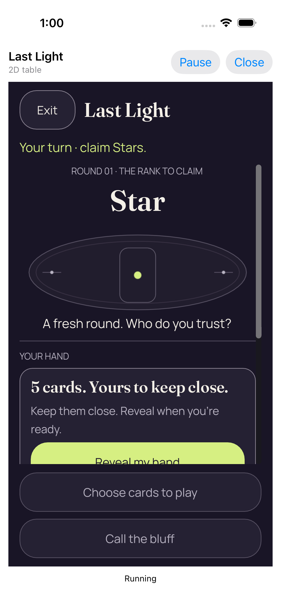</a> | **01 concealed 2d text 1** iPhone 17 simulator, actual native Last Light authority host Original: [878DF658-BE75-4CDE-ABE4-2E37E9C087C0.png](attachments/878DF658-BE75-4CDE-ABE4-2E37E9C087C0.png) 1206 × 2622 px; text 1× SHA-256: <code>c903596eb24f8616d8fcfa90da49f084133b5e635634dd311820f277ed8febbb</code> [Original paired measurements](evidence/attachments/AA901419-7004-47AB-B4FF-A371C5868484.json) Recorded enclosing case: Success Initial Reveal is cut by the lower edge of the central scroll region: its text and lower border are incomplete. The fixed Choose cards and Call the bluff actions fit. |
| <a href="attachments/8F3B3340-42DC-417B-98E6-8AA131D9026B.png">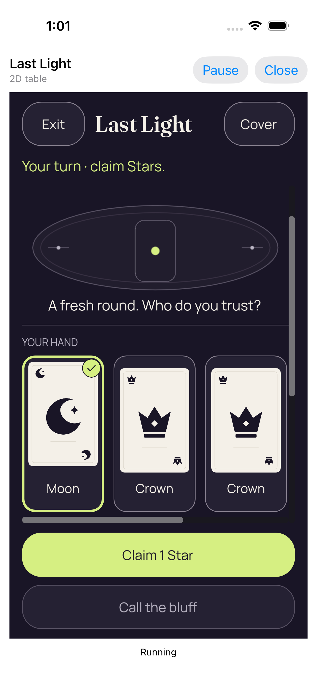</a> | **02 revealed and selected 2d text 1** iPhone 17 simulator, actual native Last Light authority host Original: [8F3B3340-42DC-417B-98E6-8AA131D9026B.png](attachments/8F3B3340-42DC-417B-98E6-8AA131D9026B.png) 1206 × 2622 px; text 1× SHA-256: <code>25c564ab5fc9bc0450369789afabf2433ce06278fd3ca372bc4059e6a7c252b1</code> [Original paired measurements](evidence/attachments/C7445DCE-A65A-4E33-98F3-04C3B9BFEC43.json) Recorded enclosing case: Success After scrolling, the selected Moon outline/check and visible Crown cards are complete. Claim 1 Star and the disabled bluff action fit below the hand. |
| <a href="attachments/216F7F0F-D870-4E34-A74B-1E2673268411.png">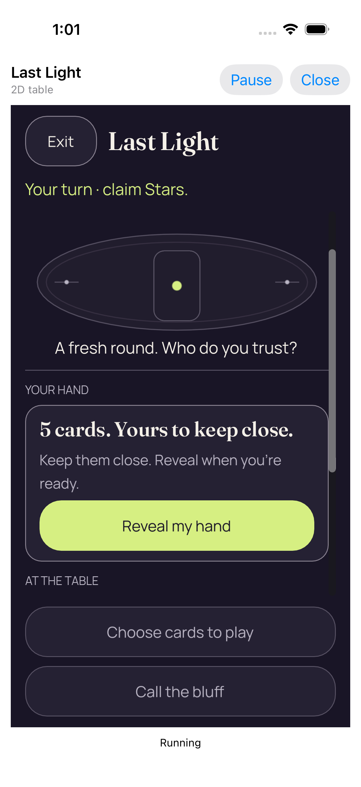</a> | **03 private bindings cleared 2d text 1** iPhone 17 simulator, actual native Last Light authority host Original: [216F7F0F-D870-4E34-A74B-1E2673268411.png](attachments/216F7F0F-D870-4E34-A74B-1E2673268411.png) 1206 × 2622 px; text 1× SHA-256: <code>7ab29f9f22e3b0ab812d09479d76c481e899737d576a6adfc6ce5b2106ad7652</code> [Original paired measurements](evidence/attachments/8DAB943B-82F0-485A-B17D-A503EAFC6606.json) Recorded enclosing case: Success Cover removes private faces and exposes the full Reveal button in the scrolled panel. The title and current claim remain readable. |
| <a href="attachments/78CF2DE8-05A7-4A7B-B0C4-85830915AFE8.png">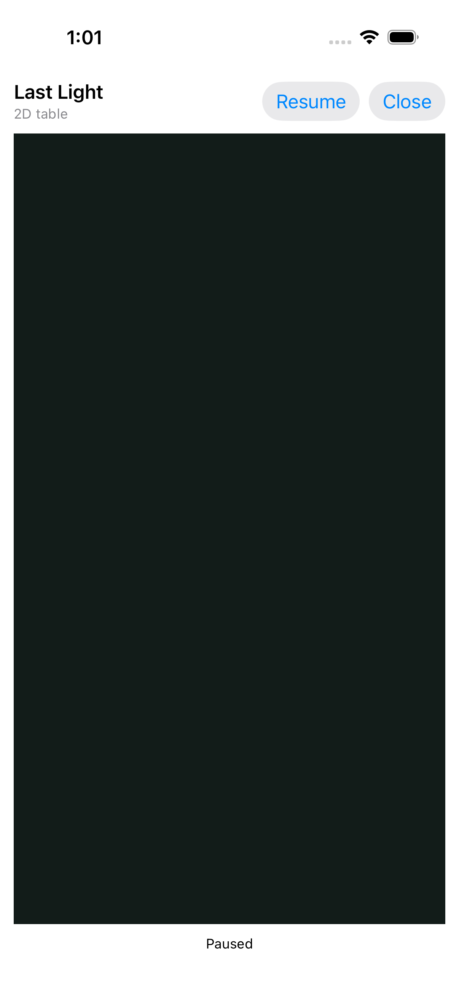</a> | **Native cover with paused private bindings cleared** iPhone 17 simulator, actual native Last Light authority host Original: [78CF2DE8-05A7-4A7B-B0C4-85830915AFE8.png](attachments/78CF2DE8-05A7-4A7B-B0C4-85830915AFE8.png) 1206 × 2622 px; text 1× SHA-256: <code>55f848df085096edfc48c69bf4b977be70540989c04ed69a6ecccdb303bb6291</code> [Original paired measurements](evidence/attachments/4C6E9BB6-A640-463D-AB86-7939571BEEB0.json) Recorded enclosing case: Success The native paused surface is fully covered. Resume and Close remain visible and no private card face is exposed. |
| <a href="attachments/00B8C3C5-D88C-4278-B01F-1358DB8D794F.png">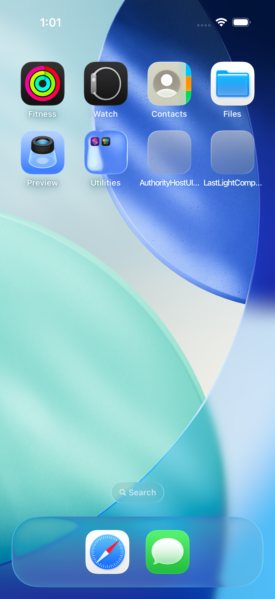</a> | **Actual Home screen before game reactivation** iPhone 17 simulator, actual native Last Light authority host Original: [00B8C3C5-D88C-4278-B01F-1358DB8D794F.png](attachments/00B8C3C5-D88C-4278-B01F-1358DB8D794F.png) 1206 × 2622 px; text 1× SHA-256: <code>38cd34619218e5289eddfa3bc9f3ac11079cd150a91a4e417119a240cbec9205</code> Recorded enclosing case: Success The actual Home screen and Safari/Messages dock are visible without game content. Preserve the original application-state report alongside this observation. |
| <a href="attachments/74835CAF-790F-4A9E-94EF-F778D8BFB4E4.png">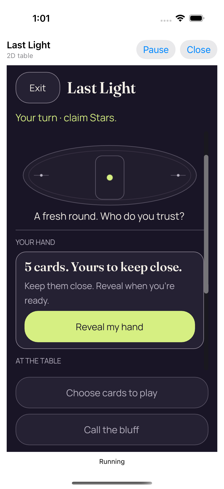</a> | **Same authority resumed with concealed cards** iPhone 17 simulator, actual native Last Light authority host Original: [74835CAF-790F-4A9E-94EF-F778D8BFB4E4.png](attachments/74835CAF-790F-4A9E-94EF-F778D8BFB4E4.png) 1206 × 2622 px; text 1× SHA-256: <code>e18c8a4d71a186d9a3d3f882b251e88af0d95e996b72828b9aeb7d88f8a99e5d</code> [Original paired measurements](evidence/attachments/9BEC554E-8393-4B99-9AA5-018CE5866D07.json) Recorded enclosing case: Success The same authority resumes concealed. The full Reveal panel and fixed disabled gameplay actions fit this scrolled state. |
|  | **04 actual viewer play 2d text 1** iPhone 17 simulator, actual native Last Light authority host Original: [AC1632F9-731E-4E86-ADE9-8B632B6FF511.png](attachments/AC1632F9-731E-4E86-ADE9-8B632B6FF511.png) 1206 × 2622 px; text 1× SHA-256: <code>ee50342c5890574e5753d42a7710bbdb62a1522c3055d2271ad328fb43b16a69</code> [Original paired measurements](evidence/attachments/77DB6FB5-F5A9-4988-9F23-230A25D832C5.json) Recorded enclosing case: Success Bluff caught, the Moon proof, named challenge and light consequence are readable. Deal the next round is complete; lower seat rows continue in the scroll region. |
| <a href="attachments/9817C2D2-0C0F-412D-81B2-4EB3F95808DC.png">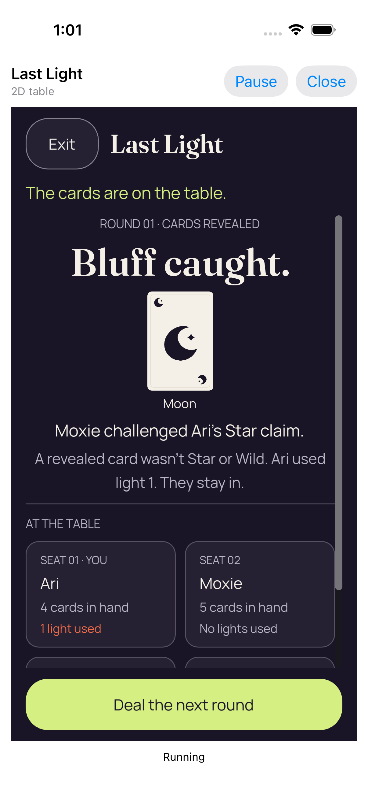</a> | **05 public outcome 2d text 1** iPhone 17 simulator, actual native Last Light authority host Original: [9817C2D2-0C0F-412D-81B2-4EB3F95808DC.png](attachments/9817C2D2-0C0F-412D-81B2-4EB3F95808DC.png) 1206 × 2622 px; text 1× SHA-256: <code>ee50342c5890574e5753d42a7710bbdb62a1522c3055d2271ad328fb43b16a69</code> [Original paired measurements](evidence/attachments/24DFA923-8580-4452-818D-BD5511BC0A18.json) Recorded enclosing case: Success The separate public-outcome capture retains the full proof and next action, with the lower seat grid partly outside the viewport. |
| <a href="attachments/600DE82D-546D-406D-916D-8C3DDBD2348F.png">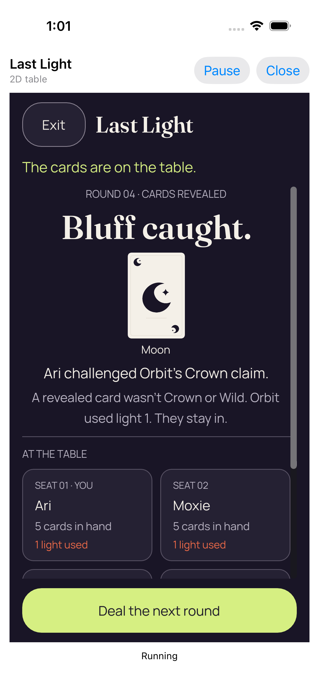</a> | **06 actual viewer challenge 2d text 1** iPhone 17 simulator, actual native Last Light authority host Original: [600DE82D-546D-406D-916D-8C3DDBD2348F.png](attachments/600DE82D-546D-406D-916D-8C3DDBD2348F.png) 1206 × 2622 px; text 1× SHA-256: <code>c5793b26b14aacb5216e5dd4f42a7d2f356a576dfa9d57160837b6f77790fd62</code> [Original paired measurements](evidence/attachments/04358227-0D71-4FC6-9B67-9D8EFAE86973.json) Recorded enclosing case: Success Round 4 names Ari challenging Orbit and shows the Moon mismatch. The explanation and next-round action fit; lower seats remain scrollable. |
| <a href="attachments/F169FE8F-6160-471B-B162-655F1542AB69.png">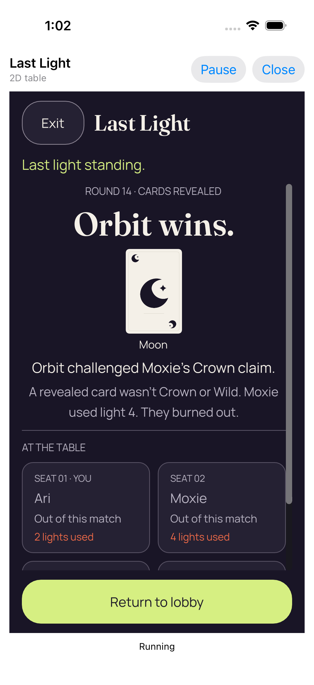</a> | **07 real winner 2d text 1** iPhone 17 simulator, actual native Last Light authority host Original: [F169FE8F-6160-471B-B162-655F1542AB69.png](attachments/F169FE8F-6160-471B-B162-655F1542AB69.png) 1206 × 2622 px; text 1× SHA-256: <code>eb27edef05d46229667805d7f001084d257665263385e446c6a3c30819b6e268</code> [Original paired measurements](evidence/attachments/A77498C1-3ED1-4517-AF8B-A726E88784BD.json) Recorded enclosing case: Success Orbit wins, the Moon proof, named challenge and Moxie burnout explanation are complete. Return to lobby is fully visible; lower seat rows remain scrollable. |
|  | **09 table returned through authority 2d text 1** iPhone 17 simulator, actual native Last Light authority host Original: [68BD0D43-65E7-49E0-A249-8169EB0038F6.png](attachments/68BD0D43-65E7-49E0-A249-8169EB0038F6.png) 1206 × 2622 px; text 1× SHA-256: <code>dcac01d9e458e6d721371807a69fa8faf76102b232576ab5c00017a3192933bf</code> [Original paired measurements](evidence/attachments/C22F7501-7D72-4669-B814-6DFCD9FD2465.json) Recorded enclosing case: Success The renderer has closed into the native Table closed shell. Relaunch guidance, Host +1 and Closed status are visible, with no game cards. |

## 3D · 200% text

3D/200% fails its current-diagnostic predicate after input: the rejected running observation remains revealed with selectedCount 0. The later failure capture visibly shows Selected Moon and measures selectedCount 1; it does not satisfy the earlier 15-second wait.

| Original image | Scenario and provenance |
| --- | --- |
| <a href="attachments/B45DC249-E1F6-4AAD-9433-8D0DD07DF5DF.png">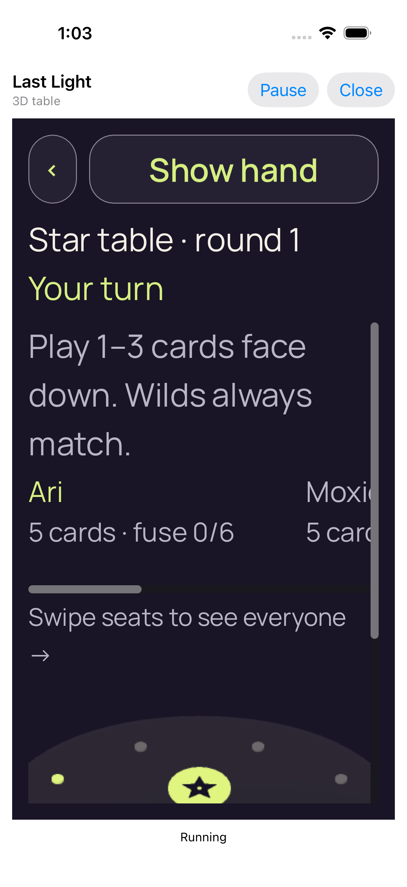</a> | **01 concealed 3d text 2** iPhone 17 simulator, actual native Last Light authority host Original: [B45DC249-E1F6-4AAD-9433-8D0DD07DF5DF.png](attachments/B45DC249-E1F6-4AAD-9433-8D0DD07DF5DF.png) 1206 × 2622 px; text 2× SHA-256: <code>979a11c482a093b830fb7e0a6983c7e96efa8240a52504f8de6fbc3431c37265</code> [Original paired measurements](evidence/attachments/45AD27DE-933C-48C1-A963-CB9330F2DD7E.json) Recorded enclosing case: Failure Back, Show hand, Star table and Your turn are readable. The wide seat roster is horizontally clipped and the lower 3D table lies mostly below the initial scroll viewport. |
| <a href="attachments/F84F6B36-3540-4947-B6AE-F4B581508336.png">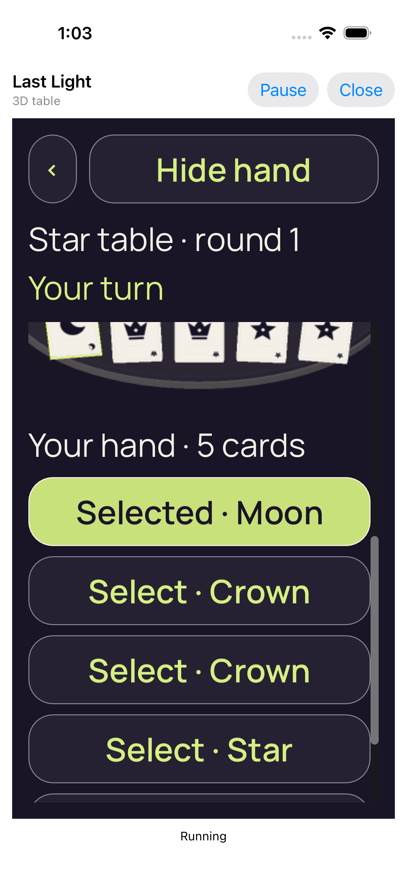</a> | **Failed authority wait** iPhone 17 simulator, actual native Last Light authority host Original: [F84F6B36-3540-4947-B6AE-F4B581508336.png](attachments/F84F6B36-3540-4947-B6AE-F4B581508336.png) 1206 × 2622 px; text 2× SHA-256: <code>f7a127a0a45027e56daf3d4db3a98b079ff52875856367f10a9dd521bf5af5dd</code> [Original paired measurements](evidence/attachments/3AA280F9-FE59-4676-AFF3-AF91665F1E94.json) Recorded enclosing case: Failure The later failure PNG shows Selected Moon and readable Crown rows with Hide hand fixed above. The 3D cards are clipped above the scrolled list, while later rows and Play remain below the viewport. This later selected state is separate from the rejected selectedCount 0 observation. |

## 3D · 100% text

Normal 3D fails its current-diagnostic predicate after input: the rejected running observation is still concealed. The later failure frame and measurement are revealed with selectedCount 0, without qualifying the failed 15-second wait.

| Original image | Scenario and provenance |
| --- | --- |
| <a href="attachments/347DC8F7-8D8E-46C4-8503-780ADE3688DB.png">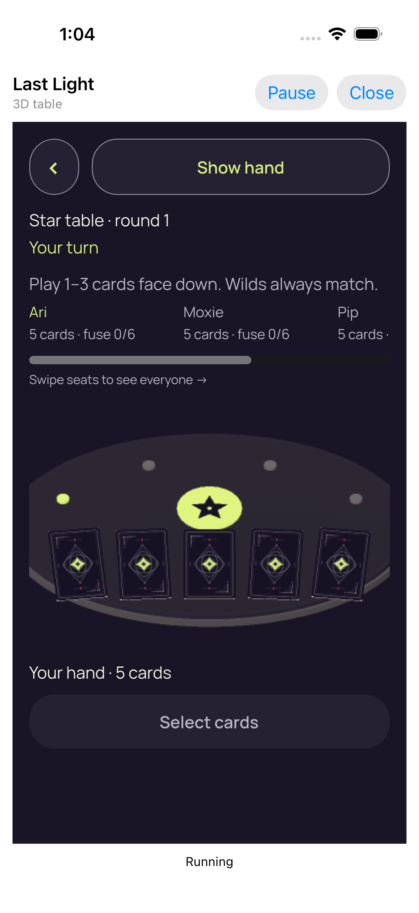</a> | **01 concealed 3d text 1** iPhone 17 simulator, actual native Last Light authority host Original: [347DC8F7-8D8E-46C4-8503-780ADE3688DB.png](attachments/347DC8F7-8D8E-46C4-8503-780ADE3688DB.png) 1206 × 2622 px; text 1× SHA-256: <code>f349cb7dd5450c0c6be70b2aff08a2acf315f23b424e58180ac6473ad09d4176</code> [Original paired measurements](evidence/attachments/F8C32C9D-DC0E-4052-81B3-E1D4DDE51E70.json) Recorded enclosing case: Failure All five card backs, Show hand and the disabled Select cards action fit. Star table and Your turn are readable; the roster extends horizontally beyond the viewport. |
| <a href="attachments/98096A0E-7EF4-406C-9D56-8125A46E2760.png">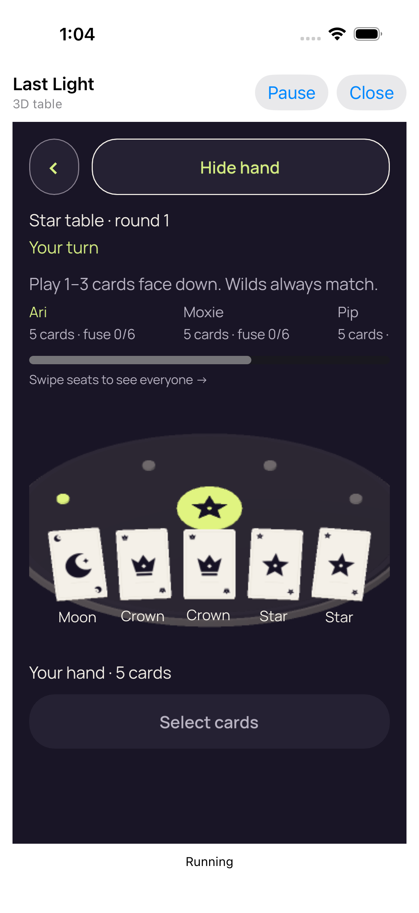</a> | **Failed authority wait** iPhone 17 simulator, actual native Last Light authority host Original: [98096A0E-7EF4-406C-9D56-8125A46E2760.png](attachments/98096A0E-7EF4-406C-9D56-8125A46E2760.png) 1206 × 2622 px; text 1× SHA-256: <code>2d592fbdc49ae115b9238801281c4012d1174c2b077950bbd9f26053de7b0dbd</code> [Original paired measurements](evidence/attachments/CCA006B1-CAED-44C7-8E42-11BF8E8E2920.json) Recorded enclosing case: Failure The later failure PNG shows five unselected revealed faces with Moon, Crown, Crown, Star and Star captions. Hide hand fits and Select cards remains disabled. This later reveal does not satisfy the earlier rejected concealed observation. |

## Secure default renderer Exit

Secure default renderer Exit passes within its bounded launch-and-exit scope.

| Original image | Scenario and provenance |
| --- | --- |
| <a href="attachments/40C03840-3D69-47F5-805D-F0FC56C332E6.png">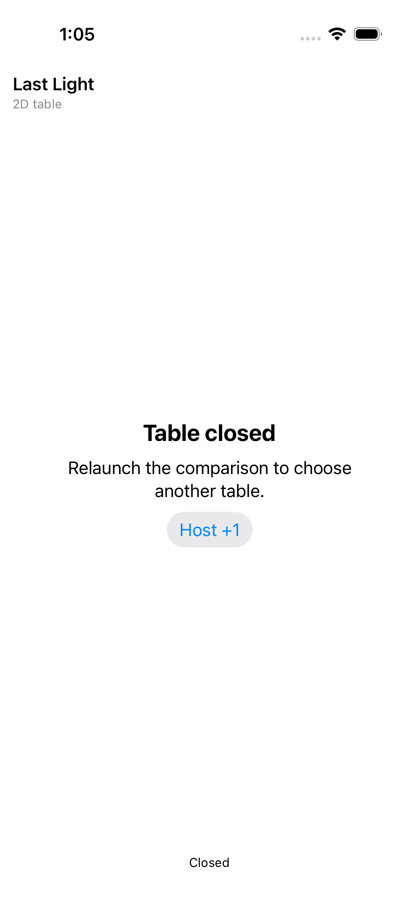</a> | **Secure default table exited through Godot input** iPhone 17 simulator, actual native Last Light authority host Original: [40C03840-3D69-47F5-805D-F0FC56C332E6.png](attachments/40C03840-3D69-47F5-805D-F0FC56C332E6.png) 1206 × 2622 px; text 1× SHA-256: <code>fb9a4b5fdde5d2a2e48307ce8228595ca8d76966ab21a879d84b30d8875c4c4b</code> [Original paired measurements](evidence/attachments/AACA0431-86C5-4BE5-843C-A0EE193E7F78.json) Recorded enclosing case: Success The native Table closed shell shows relaunch guidance, Host +1 and Closed status without renderer content. This proves the captured exit state, not a secure-default full match. |
