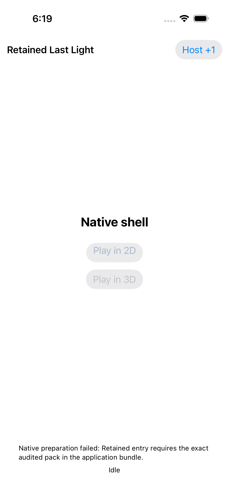

# iOS MSAA diagnostic guard failure — CI 34512412329

[All collections](../README.md) · [Preserved evidence index](evidence-index.md) · [Copy/review binding](../android-34503251315/provenance/publication-review/partydeck-gallery-2815-publication-binding-v1.json) · [Completed visual review](provenance/publication-review/partydeck-gallery-after-2355-msaa-native-visual-review-v1.json) · [Unchanged source mapping](provenance/source-map/native-gallery-map.json)

**All three cases failed at initial 2D entry because the exact-pack guard still required the baseline pack. Native preparation and rendering were not reached.**

All three Actual retained owner failure originals show the Native shell, pale/grey Play controls, the complete exact-audited-pack failure message and Idle. These are pre-render failure captures. The original XCTest isAssociatedWithFailure=false flags are retained verbatim and do not override the three failed case results. Stack sampling was disabled. The corrected retry is separate evidence and is not represented here.

Source revision: `c058bdc806b918bff17630489257a1b401e224b4`. CI run: [34512412329](https://github.com/Apdelrahman1911/PartyDeck/actions/runs/34512412329). 3 original PNG identities. Review methods: 3 direct original view.

Every thumbnail opens the unchanged original PNG. Original filenames, dimensions, source paths and outcomes remain separate even when pixels match. No derivative image was created. Frozen provenance pages retain their original text and source references.

| Original capture | Original identity and evidence | Visual observation |
| --- | --- | --- |
|  <code>6BA0A549-B0C7-414D-9085-4FA6AC6AF40D.png</code> Actual retained owner failure_0_58164AAE-AF45-4809-807E-1A767B6DA7FD.png | 1206 × 2622 px · 107,269 bytes SHA-256: <code>1c7ea100161ed5bd4a2c345e754f5d418f7c7d1399d85e7f68cde01f6e958da4</code> Source: <code>/root/projects/PartyDeck/artifacts/evidence-storage/34512412329/godot-ios-retained-host-test-attempt-1/retained-host-test/artifacts/attachments/6BA0A549-B0C7-414D-9085-4FA6AC6AF40D.png</code> Original case: <code>RetainedHostUITests/testActiveAndDormantBackgroundTransitionsStayConcealed()</code> — **failed** Original timestamp: 1789064349.991 [Original result](evidence/result.json) · [Case/attachment index](companions.md) | **Direct original view**. The retained shell shows its title, Host +1, Native shell, greyed Play in 2D and Play in 3D controls, the complete exact-audited-pack preparation-failure message, and Idle. No engine table or private card content appears. This is the failed background-case original before native preparation or rendering. |
|  <code>5C919968-6216-46A3-A6CC-992912645781.png</code> Actual retained owner failure_0_43A52762-5738-493F-AE8B-A835A04951FD.png | 1206 × 2622 px · 108,607 bytes SHA-256: <code>670e820de259ac7f95a0d4c08ff650cfad07fbb90a85cb0449bc9127a0b9d603</code> Source: <code>/root/projects/PartyDeck/artifacts/evidence-storage/34512412329/godot-ios-retained-host-test-attempt-1/retained-host-test/artifacts/attachments/5C919968-6216-46A3-A6CC-992912645781.png</code> Original case: <code>RetainedHostUITests/testRepeated2DAnd3DKeepOneDormantEngine()</code> — **failed** Original timestamp: 1789064362.359 [Original result](evidence/result.json) · [Case/attachment index](companions.md) | **Direct original view**. The retained shell shows its title, Host +1, Native shell, pale Play in 2D and grey Play in 3D controls, the complete exact-audited-pack preparation-failure message, and Idle. The slight Play in 2D tint is a still-image observation only. No engine table or private card content appears. This is the failed repeated-entry-case original before native preparation or rendering. |
|  <code>80F5291B-E82C-4A09-A027-B25ED88D958A.png</code> Actual retained owner failure_0_CB742E0A-C634-4316-9A51-B8F3E0943387.png | 1206 × 2622 px · 108,462 bytes SHA-256: <code>ce942f79b5296d668e31f3c0c45fee0382bef02756e31bc40c5b7ed63559b41e</code> Source: <code>/root/projects/PartyDeck/artifacts/evidence-storage/34512412329/godot-ios-retained-host-test-attempt-1/retained-host-test/artifacts/attachments/80F5291B-E82C-4A09-A027-B25ED88D958A.png</code> Original case: <code>RetainedHostUITests/testStaleFirstReadyAndCloseCompletionReentry()</code> — **failed** Original timestamp: 1789064373.3 [Original result](evidence/result.json) · [Case/attachment index](companions.md) | **Direct original view**. The retained shell shows its title, Host +1, Native shell, greyed Play in 2D and Play in 3D controls, the complete exact-audited-pack preparation-failure message, and Idle. No engine table or private card content appears. This is the failed stale-ready/reentry-case original before native preparation or rendering. |
