# iOS Authority native host — five Simulator fixture passes

[All collections](../../README.md) · [Original CI run](https://github.com/Apdelrahman1911/PartyDeck/actions/runs/34488350932)

Five Authority Simulator fixture cases passed: four reference full matches and secure launch/renderer exit. Secure-default full match and production KMP factory integration remain unqualified.

45 original PNGs and 361 original JSON/TXT companions. The overall run failed in the separate retained-host case; no new pixel review is claimed by publication preparation.

Exact source: `4f694296b08899176831e7c444c6f8082d40d64b`.

Retained lifecycle and same-process reentry remain unqualified after the stale-first-ready failure. Five Authority Simulator fixture cases passed, including four reference full matches and secure launch/exit. Secure-default full match, production KMP factory, physical sensors, device Metal and real audio interruption remain unqualified. No clean-native-log or no-crash claim is made.

The separate visual-review receipt lists 64 directly viewed originals across both native hosts and nine named exact-byte matches to those originals. All 73 capture identities remain distinct. Publication performs no new image views.

[Original companions by case and time](companions.md) · [Frozen owner summary](../provenance/collection-evidence-summary.json) · [Original visual-review receipt](../provenance/native-visual-review.json)

## Publication visual review

All 45 original capture identities have review coverage: 41 direct original views, 4 exact matches to direct views in this batch. Each capture keeps its original name, source, dimensions, scenario and recorded time. Matching pixels do not transfer runtime outcomes. No derived image was created.

[Completed visual review](../provenance/native-visual-review.json) · [Capture/review binding](../provenance/publication-review/partydeck-gallery-2355-publication-review.json) · [Frozen publication queue](../provenance/publication-queue-v1/queue-freeze.json) · [Original copy mapping](../provenance/publication-queue-v1/copy-paths.tsv) · [Unchanged queue page](../provenance/publication-queue-v1/payload/docs/screenshots/godot-ios-native-34488350932/authority/README.md). The archived queue page retains its original text and relative paths as provenance.

Normal-text 2D first-entry Reveal remains clipped or below the renderer scroll edge. At 200% text, some cards, public proof and continuation/return actions lie outside the captured viewport; the passing authority cases do not establish an unreachable-control defect. The later Running frame does not satisfy the original failed retained-host deadline.

| Original capture | Recorded identity and evidence scope |
| --- | --- |
| <a href="attachments/F5FA927D-9E3F-4B12-ADC7-B0B73DF06C00.png">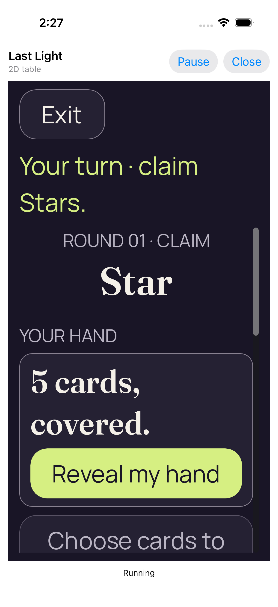</a> | **01 concealed 2d text 2** [01 concealed 2d text 2_0_51E2A6C7-6E7B-4C4D-A495-747250E5C265.png](attachments/F5FA927D-9E3F-4B12-ADC7-B0B73DF06C00.png) Exported file: <code>F5FA927D-9E3F-4B12-ADC7-B0B73DF06C00.png</code> 1206 × 2622 px · 2026-09-10T14:27:58.959+00:00 <code>AuthorityHostUITests/testReferenceMatchIn2DAt200Percent()</code> — passed SHA-256: <code>e61e12945501c74a3f3db70c29babbef1bb4ea264f32d97eb2f230d426a38a8f</code> [Owner mapping](../provenance/source-map/mapping.json) · [Original case results](../provenance/collection-evidence-summary.json) · [Case companions](companions.md#case-a3924c80db4b) Original native authority host attachment; original XCTest case result: Success. Associated by recorded test case, attachment name and timestamp only; no per-screenshot pairing is attested. Retained lifecycle and same-process reentry remain unqualified after the stale-first-ready failure. Five Authority Simulator fixture cases passed, including four reference full matches and secure launch/exit. Secure-default full match, production KMP factory, physical sensors, device Metal and real audio interruption remain unqualified. No clean-native-log or no-crash claim is made. Direct original visual observation: At 200% text, the concealed 2D table shows readable Star turn context and a complete Reveal my hand button. The following Choose cards action is clipped by the lower scroll edge and requires scrolling. **Publication review — direct original view:** At 200% text, the concealed 2D table shows readable Star turn context and a complete Reveal my hand button. The following Choose cards action is clipped by the lower scroll edge and requires scrolling. |
| <a href="attachments/F804FE36-18BF-495A-82B5-D7FA8DF218B3.png">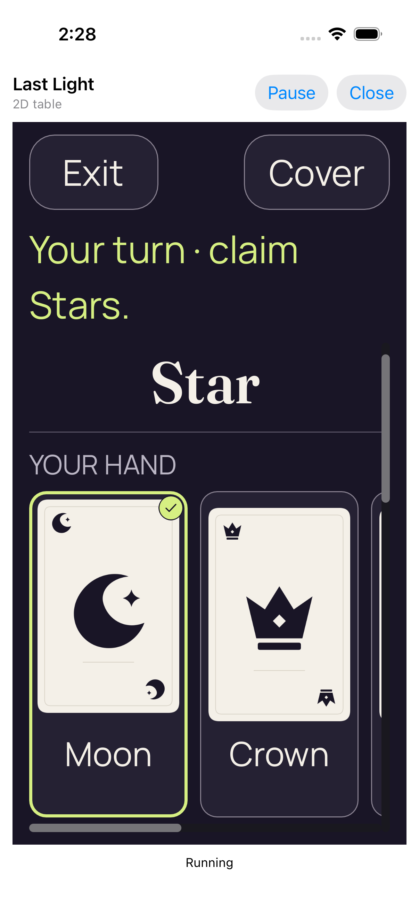</a> | **02 revealed and selected 2d text 2** [02 revealed and selected 2d text 2_0_E2AB0E31-A460-46BC-A4E3-9345D16CC625.png](attachments/F804FE36-18BF-495A-82B5-D7FA8DF218B3.png) Exported file: <code>F804FE36-18BF-495A-82B5-D7FA8DF218B3.png</code> 1206 × 2622 px · 2026-09-10T14:28:02.485+00:00 <code>AuthorityHostUITests/testReferenceMatchIn2DAt200Percent()</code> — passed SHA-256: <code>d0a153ea513f4396bdffc3f88a1b359bca159b9e4a55c5e5f3cad46102a2046d</code> [Owner mapping](../provenance/source-map/mapping.json) · [Original case results](../provenance/collection-evidence-summary.json) · [Case companions](companions.md#case-a3924c80db4b) Original native authority host attachment; original XCTest case result: Success. Associated by recorded test case, attachment name and timestamp only; no per-screenshot pairing is attested. Retained lifecycle and same-process reentry remain unqualified after the stale-first-ready failure. Five Authority Simulator fixture cases passed, including four reference full matches and secure launch/exit. Secure-default full match, production KMP factory, physical sensors, device Metal and real audio interruption remain unqualified. No clean-native-log or no-crash claim is made. Direct original visual observation: At 200% text the selected Moon outline/check and one complete Crown card are readable; the next card is only a sliver at the right edge. Cover and turn context fit, while Play is below this scroll position. **Publication review — direct original view:** At 200% text the selected Moon outline/check and one complete Crown card are readable; the next card is only a sliver at the right edge. Cover and turn context fit, while Play is below this scroll position. |
| <a href="attachments/CC45677A-13F0-490B-B56A-9432DEFE3ABA.png">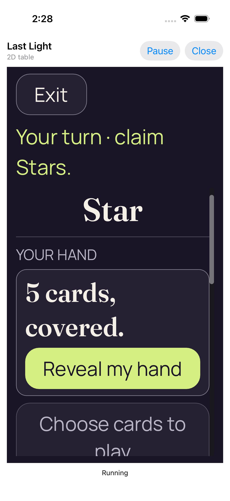</a> | **03 private bindings cleared 2d text 2** [03 private bindings cleared 2d text 2_0_B9870A01-17C1-4D7C-8011-9E150A80D9E3.png](attachments/CC45677A-13F0-490B-B56A-9432DEFE3ABA.png) Exported file: <code>CC45677A-13F0-490B-B56A-9432DEFE3ABA.png</code> 1206 × 2622 px · 2026-09-10T14:28:03.824+00:00 <code>AuthorityHostUITests/testReferenceMatchIn2DAt200Percent()</code> — passed SHA-256: <code>e6d620e0dde35207d0af0fc2201d3dfc0ad98bb01e86da33dc7dc3d10b1798b6</code> [Owner mapping](../provenance/source-map/mapping.json) · [Original case results](../provenance/collection-evidence-summary.json) · [Case companions](companions.md#case-a3924c80db4b) Original native authority host attachment; original XCTest case result: Success. Associated by recorded test case, attachment name and timestamp only; no per-screenshot pairing is attested. Retained lifecycle and same-process reentry remain unqualified after the stale-first-ready failure. Five Authority Simulator fixture cases passed, including four reference full matches and secure launch/exit. Secure-default full match, production KMP factory, physical sensors, device Metal and real audio interruption remain unqualified. No clean-native-log or no-crash claim is made. Direct original visual observation: The enlarged 2D hand is concealed with a complete Reveal button and readable Star context. The lower Choose cards to play control is cut by the scroll boundary. **Publication review — direct original view:** The enlarged 2D hand is concealed with a complete Reveal button and readable Star context. The lower Choose cards to play control is cut by the scroll boundary. |
|  | **Native cover with paused private bindings cleared** [Native cover with paused private bindings cleared_0_2FA8A40A-9B43-429B-A513-5728AABA68BD.png](attachments/EF525AFE-B394-400C-B2C0-83B74B807F4E.png) Exported file: <code>EF525AFE-B394-400C-B2C0-83B74B807F4E.png</code> 1206 × 2622 px · 2026-09-10T14:28:09.351+00:00 <code>AuthorityHostUITests/testReferenceMatchIn2DAt200Percent()</code> — passed SHA-256: <code>ab9c5f8e2a6435702a1f2e34cce71ca2deb834ec8af9dfeb36acac73ece1ddfa</code> [Owner mapping](../provenance/source-map/mapping.json) · [Original case results](../provenance/collection-evidence-summary.json) · [Case companions](companions.md#case-a3924c80db4b) Original native authority host attachment; original XCTest case result: Success. Associated by recorded test case, attachment name and timestamp only; no per-screenshot pairing is attested. Retained lifecycle and same-process reentry remain unqualified after the stale-first-ready failure. Five Authority Simulator fixture cases passed, including four reference full matches and secure launch/exit. Secure-default full match, production KMP factory, physical sensors, device Metal and real audio interruption remain unqualified. No clean-native-log or no-crash claim is made. Direct original visual observation: The paused native surface is uniformly covered with no private face visible. Native Resume, Close and Paused status remain readable. **Publication review — direct original view:** The paused native surface is uniformly covered with no private face visible. Native Resume, Close and Paused status remain readable. |
|  | **Actual Home screen before game reactivation** [Actual Home screen before game reactivation_0_5D2B7372-FAAF-4182-A7E3-108911A86D55.png](attachments/AF54E76B-B61E-43F5-ADE4-475CDE3C0663.png) Exported file: <code>AF54E76B-B61E-43F5-ADE4-475CDE3C0663.png</code> 1206 × 2622 px · 2026-09-10T14:28:16.982+00:00 <code>AuthorityHostUITests/testReferenceMatchIn2DAt200Percent()</code> — passed SHA-256: <code>cf210bd83f63e95f99338acfc8c821b77204a6179ecc93a45e9a5a5451b758ab</code> [Owner mapping](../provenance/source-map/mapping.json) · [Original case results](../provenance/collection-evidence-summary.json) · [Case companions](companions.md#case-a3924c80db4b) Original native authority host attachment; original XCTest case result: Success. Associated by recorded test case, attachment name and timestamp only; no per-screenshot pairing is attested. Retained lifecycle and same-process reentry remain unqualified after the stale-first-ready failure. Five Authority Simulator fixture cases passed, including four reference full matches and secure launch/exit. Secure-default full match, production KMP factory, physical sensors, device Metal and real audio interruption remain unqualified. No clean-native-log or no-crash claim is made. Direct original visual observation: The original authority Home capture shows SpringBoard and the Safari/Messages dock without game content. Preserve raw application-state evidence independently of the visible Home screen. **Publication review — direct original view:** The original authority Home capture shows SpringBoard and the Safari/Messages dock without game content. Preserve raw application-state evidence independently of the visible Home screen. |
|  | **Same authority resumed with concealed cards** [Same authority resumed with concealed cards_0_0CEFF460-BF05-4360-8163-59C02F89CCA4.png](attachments/8342AE12-AEB3-4079-9617-0419652840BE.png) Exported file: <code>8342AE12-AEB3-4079-9617-0419652840BE.png</code> 1206 × 2622 px · 2026-09-10T14:28:18.072+00:00 <code>AuthorityHostUITests/testReferenceMatchIn2DAt200Percent()</code> — passed SHA-256: <code>9a270b632acb528c48bd63a46b0a7422fcea9da490731771e2091bc8fff0fee8</code> [Owner mapping](../provenance/source-map/mapping.json) · [Original case results](../provenance/collection-evidence-summary.json) · [Case companions](companions.md#case-a3924c80db4b) Original native authority host attachment; original XCTest case result: Success. Associated by recorded test case, attachment name and timestamp only; no per-screenshot pairing is attested. Retained lifecycle and same-process reentry remain unqualified after the stale-first-ready failure. Five Authority Simulator fixture cases passed, including four reference full matches and secure launch/exit. Secure-default full match, production KMP factory, physical sensors, device Metal and real audio interruption remain unqualified. No clean-native-log or no-crash claim is made. Direct original visual observation: The resumed enlarged 2D table is concealed with the full Reveal button visible. The lower Choose cards action remains clipped by the scroll boundary. **Publication review — direct original view:** The resumed enlarged 2D table is concealed with the full Reveal button visible. The lower Choose cards action remains clipped by the scroll boundary. |
| <a href="attachments/F4E39829-FECF-46A5-B786-D96509A17529.png">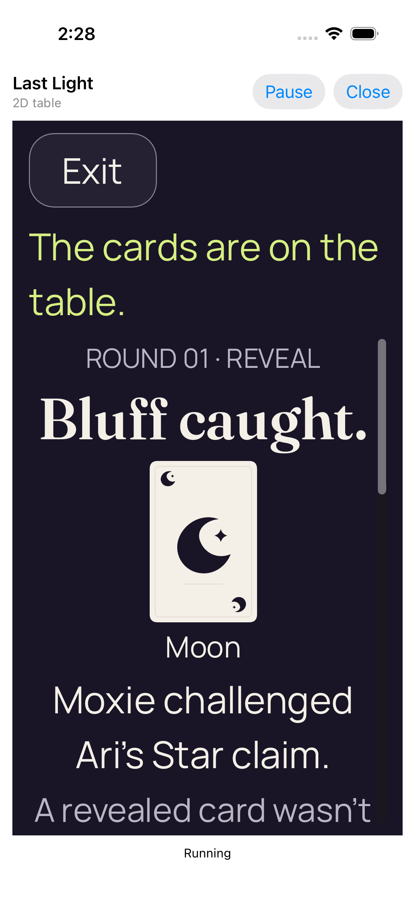</a> | **04 actual viewer play 2d text 2** [04 actual viewer play 2d text 2_0_9B5AC897-9333-4CE8-B65F-01DB365FD49A.png](attachments/F4E39829-FECF-46A5-B786-D96509A17529.png) Exported file: <code>F4E39829-FECF-46A5-B786-D96509A17529.png</code> 1206 × 2622 px · 2026-09-10T14:28:26.579+00:00 <code>AuthorityHostUITests/testReferenceMatchIn2DAt200Percent()</code> — passed SHA-256: <code>7a5318419f9def3fa9b58a75a29388adcad83cf7c558b099e7b5be398bdaca14</code> [Owner mapping](../provenance/source-map/mapping.json) · [Original case results](../provenance/collection-evidence-summary.json) · [Case companions](companions.md#case-a3924c80db4b) Original native authority host attachment; original XCTest case result: Success. Associated by recorded test case, attachment name and timestamp only; no per-screenshot pairing is attested. Retained lifecycle and same-process reentry remain unqualified after the stale-first-ready failure. Five Authority Simulator fixture cases passed, including four reference full matches and secure launch/exit. Secure-default full match, production KMP factory, physical sensors, device Metal and real audio interruption remain unqualified. No clean-native-log or no-crash claim is made. Direct original visual observation: The enlarged 2D result shows Bluff caught, a complete Moon proof and Moxie challenging Ari. The consequence begins at the bottom edge; its remainder and the next-round action are below this viewport. **Publication review — direct original view:** The enlarged 2D result shows Bluff caught, a complete Moon proof and Moxie challenging Ari. The consequence begins at the bottom edge; its remainder and the next-round action are below this viewport. |
|  | **05 public outcome 2d text 2** [05 public outcome 2d text 2_0_08C30F0D-27BE-4A5C-B7DA-A190B36FA1F7.png](attachments/575290F2-27F0-4CBD-94A6-C928C7AB0940.png) Exported file: <code>575290F2-27F0-4CBD-94A6-C928C7AB0940.png</code> 1206 × 2622 px · 2026-09-10T14:28:26.731+00:00 <code>AuthorityHostUITests/testReferenceMatchIn2DAt200Percent()</code> — passed SHA-256: <code>7a5318419f9def3fa9b58a75a29388adcad83cf7c558b099e7b5be398bdaca14</code> [Owner mapping](../provenance/source-map/mapping.json) · [Original case results](../provenance/collection-evidence-summary.json) · [Case companions](companions.md#case-a3924c80db4b) Original native authority host attachment; original XCTest case result: Success. Associated by recorded test case, attachment name and timestamp only; no per-screenshot pairing is attested. Retained lifecycle and same-process reentry remain unqualified after the stale-first-ready failure. Five Authority Simulator fixture cases passed, including four reference full matches and secure launch/exit. Secure-default full match, production KMP factory, physical sensors, device Metal and real audio interruption remain unqualified. No clean-native-log or no-crash claim is made. Observation reused from a named byte-identical direct original; this capture was not directly viewed: The enlarged 2D result shows Bluff caught, a complete Moon proof and Moxie challenging Ari. The consequence begins at the bottom edge; its remainder and the next-round action are below this viewport. **Publication review — exact match to a directly viewed original in this batch:** The enlarged 2D result shows Bluff caught, a complete Moon proof and Moxie challenging Ari. The consequence begins at the bottom edge; its remainder and the next-round action are below this viewport. [Reviewed matching original](attachments/F4E39829-FECF-46A5-B786-D96509A17529.png); capture context remains separate. |
| <a href="attachments/FB1CF026-4BAD-4837-B392-757345B0E8EE.png">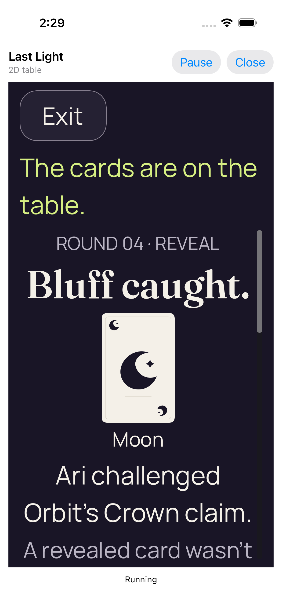</a> | **06 actual viewer challenge 2d text 2** [06 actual viewer challenge 2d text 2_0_EE8982E9-105F-4478-9DB5-8D958741AE00.png](attachments/FB1CF026-4BAD-4837-B392-757345B0E8EE.png) Exported file: <code>FB1CF026-4BAD-4837-B392-757345B0E8EE.png</code> 1206 × 2622 px · 2026-09-10T14:29:23.814+00:00 <code>AuthorityHostUITests/testReferenceMatchIn2DAt200Percent()</code> — passed SHA-256: <code>51244d60d872668e224719a22a5b8cbbe3cbd119a0493c7dcc1462ac1ab7675a</code> [Owner mapping](../provenance/source-map/mapping.json) · [Original case results](../provenance/collection-evidence-summary.json) · [Case companions](companions.md#case-a3924c80db4b) Original native authority host attachment; original XCTest case result: Success. Associated by recorded test case, attachment name and timestamp only; no per-screenshot pairing is attested. Retained lifecycle and same-process reentry remain unqualified after the stale-first-ready failure. Five Authority Simulator fixture cases passed, including four reference full matches and secure launch/exit. Secure-default full match, production KMP factory, physical sensors, device Metal and real audio interruption remain unqualified. No clean-native-log or no-crash claim is made. Direct original visual observation: The enlarged round-4 result names Ari challenging Orbit and shows the complete Moon proof. The light consequence and continuation action extend below this scroll position. **Publication review — direct original view:** The enlarged round-4 result names Ari challenging Orbit and shows the complete Moon proof. The light consequence and continuation action extend below this scroll position. |
| <a href="attachments/3FA6238D-D82D-4C28-9EBF-302879A70E39.png">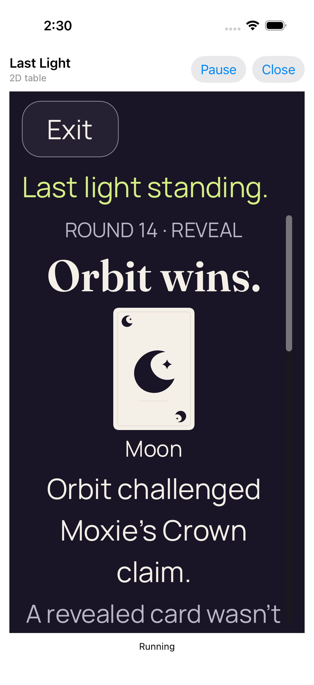</a> | **07 real winner 2d text 2** [07 real winner 2d text 2_0_CCA6B307-2096-4AD9-AD36-1CEAE6DF262D.png](attachments/3FA6238D-D82D-4C28-9EBF-302879A70E39.png) Exported file: <code>3FA6238D-D82D-4C28-9EBF-302879A70E39.png</code> 1206 × 2622 px · 2026-09-10T14:30:20.594+00:00 <code>AuthorityHostUITests/testReferenceMatchIn2DAt200Percent()</code> — passed SHA-256: <code>b2b218d3b1fd6f5085ba9e1b70df1ceaa31e765a8e9007c2e9d5be365d93b7a7</code> [Owner mapping](../provenance/source-map/mapping.json) · [Original case results](../provenance/collection-evidence-summary.json) · [Case companions](companions.md#case-a3924c80db4b) Original native authority host attachment; original XCTest case result: Success. Associated by recorded test case, attachment name and timestamp only; no per-screenshot pairing is attested. Retained lifecycle and same-process reentry remain unqualified after the stale-first-ready failure. Five Authority Simulator fixture cases passed, including four reference full matches and secure launch/exit. Secure-default full match, production KMP factory, physical sensors, device Metal and real audio interruption remain unqualified. No clean-native-log or no-crash claim is made. Direct original visual observation: Orbit wins and the public Moon proof are readable at 200% text, along with the named final challenge. The burnout explanation and Return to lobby action are below the captured scroll position. **Publication review — direct original view:** Orbit wins and the public Moon proof are readable at 200% text, along with the named final challenge. The burnout explanation and Return to lobby action are below the captured scroll position. |
|  | **09 table returned through authority 2d text 2** [09 table returned through authority 2d text 2_0_60847DE7-9EE8-44C8-AA58-631BADDDE6ED.png](attachments/E155D19F-8BC5-4599-B20C-42E3FD19793A.png) Exported file: <code>E155D19F-8BC5-4599-B20C-42E3FD19793A.png</code> 1206 × 2622 px · 2026-09-10T14:30:28.033+00:00 <code>AuthorityHostUITests/testReferenceMatchIn2DAt200Percent()</code> — passed SHA-256: <code>1dc09e9ed69b66ff14a9c199a7ff1b044688e66ef9e5ba88f7e7f75cdb366b2c</code> [Owner mapping](../provenance/source-map/mapping.json) · [Original case results](../provenance/collection-evidence-summary.json) · [Case companions](companions.md#case-a3924c80db4b) Original native authority host attachment; original XCTest case result: Success. Associated by recorded test case, attachment name and timestamp only; no per-screenshot pairing is attested. Retained lifecycle and same-process reentry remain unqualified after the stale-first-ready failure. Five Authority Simulator fixture cases passed, including four reference full matches and secure launch/exit. Secure-default full match, production KMP factory, physical sensors, device Metal and real audio interruption remain unqualified. No clean-native-log or no-crash claim is made. Direct original visual observation: The enlarged 2D case ends at the native Table closed view. Relaunch instructions, Host +1 and Closed status fit, with no renderer content. **Publication review — direct original view:** The enlarged 2D case ends at the native Table closed view. Relaunch instructions, Host +1 and Closed status fit, with no renderer content. |
| <a href="attachments/E8188697-7492-4ABE-902D-89D260EF09A0.png">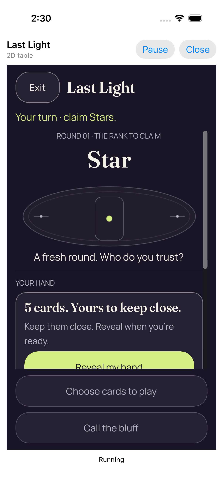</a> | **01 concealed 2d text 1** [01 concealed 2d text 1_0_B314C880-B26B-4DC8-8307-8043AACB00C6.png](attachments/E8188697-7492-4ABE-902D-89D260EF09A0.png) Exported file: <code>E8188697-7492-4ABE-902D-89D260EF09A0.png</code> 1206 × 2622 px · 2026-09-10T14:30:37.124+00:00 <code>AuthorityHostUITests/testReferenceMatchIn2D()</code> — passed SHA-256: <code>7b2b8279445d2e690cdea2771a3b017041bbc91f4edb0b2ced4db7b325af3956</code> [Owner mapping](../provenance/source-map/mapping.json) · [Original case results](../provenance/collection-evidence-summary.json) · [Case companions](companions.md#case-d467b4236c1f) Original native authority host attachment; original XCTest case result: Success. Associated by recorded test case, attachment name and timestamp only; no per-screenshot pairing is attested. Retained lifecycle and same-process reentry remain unqualified after the stale-first-ready failure. Five Authority Simulator fixture cases passed, including four reference full matches and secure launch/exit. Secure-default full match, production KMP factory, physical sensors, device Metal and real audio interruption remain unqualified. No clean-native-log or no-crash claim is made. Direct original visual observation: The normal-text authority 2D initial Reveal button is cut across its label and lower portion by the central scroll edge. Turn/rank context and fixed disabled gameplay actions fit. **Publication review — direct original view:** The normal-text authority 2D initial Reveal button is cut across its label and lower portion by the central scroll edge. Turn/rank context and fixed disabled gameplay actions fit. |
| <a href="attachments/DCF80BE5-8876-40C3-BF1E-D7DEEE3F2DEE.png">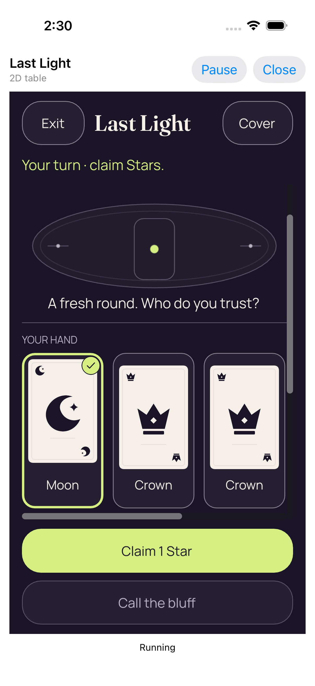</a> | **02 revealed and selected 2d text 1** [02 revealed and selected 2d text 1_0_47E035C9-7EAC-4326-A270-65CE12C3A03A.png](attachments/DCF80BE5-8876-40C3-BF1E-D7DEEE3F2DEE.png) Exported file: <code>DCF80BE5-8876-40C3-BF1E-D7DEEE3F2DEE.png</code> 1206 × 2622 px · 2026-09-10T14:30:43.404+00:00 <code>AuthorityHostUITests/testReferenceMatchIn2D()</code> — passed SHA-256: <code>f04292e3bc84b11bb8385ffe13e9f5b8de86cb3863f1f09ccdde330a2b21eea9</code> [Owner mapping](../provenance/source-map/mapping.json) · [Original case results](../provenance/collection-evidence-summary.json) · [Case companions](companions.md#case-d467b4236c1f) Original native authority host attachment; original XCTest case result: Success. Associated by recorded test case, attachment name and timestamp only; no per-screenshot pairing is attested. Retained lifecycle and same-process reentry remain unqualified after the stale-first-ready failure. Five Authority Simulator fixture cases passed, including four reference full matches and secure launch/exit. Secure-default full match, production KMP factory, physical sensors, device Metal and real audio interruption remain unqualified. No clean-native-log or no-crash claim is made. Direct original visual observation: The normal-text scrolled 2D hand shows a selected Moon with a complete outline/check and two Crown cards. Claim 1 Star is fully visible; remaining cards continue horizontally. **Publication review — direct original view:** The normal-text scrolled 2D hand shows a selected Moon with a complete outline/check and two Crown cards. Claim 1 Star is fully visible; remaining cards continue horizontally. |
| <a href="attachments/554C6A34-5E85-40B7-949F-0979FE6A92C7.png">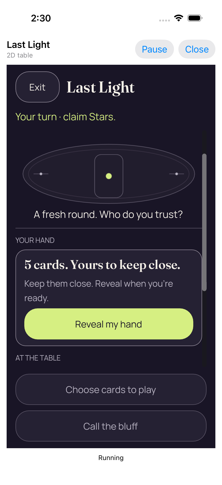</a> | **03 private bindings cleared 2d text 1** [03 private bindings cleared 2d text 1_0_795415F2-EB94-4114-9586-677FC0ADFC41.png](attachments/554C6A34-5E85-40B7-949F-0979FE6A92C7.png) Exported file: <code>554C6A34-5E85-40B7-949F-0979FE6A92C7.png</code> 1206 × 2622 px · 2026-09-10T14:30:45.385+00:00 <code>AuthorityHostUITests/testReferenceMatchIn2D()</code> — passed SHA-256: <code>98927516513edb4cb87894a9fe0d49a3d891873666239e911234808814ce71de</code> [Owner mapping](../provenance/source-map/mapping.json) · [Original case results](../provenance/collection-evidence-summary.json) · [Case companions](companions.md#case-d467b4236c1f) Original native authority host attachment; original XCTest case result: Success. Associated by recorded test case, attachment name and timestamp only; no per-screenshot pairing is attested. Retained lifecycle and same-process reentry remain unqualified after the stale-first-ready failure. Five Authority Simulator fixture cases passed, including four reference full matches and secure launch/exit. Secure-default full match, production KMP factory, physical sensors, device Metal and real audio interruption remain unqualified. No clean-native-log or no-crash claim is made. Direct original visual observation: After cover, the normal-text 2D hand is concealed and the full Reveal control fits the scrolled panel. Disabled gameplay actions remain complete. **Publication review — direct original view:** After cover, the normal-text 2D hand is concealed and the full Reveal control fits the scrolled panel. Disabled gameplay actions remain complete. |
| <a href="attachments/1C164056-29BF-45D0-B3FC-28362547902D.png">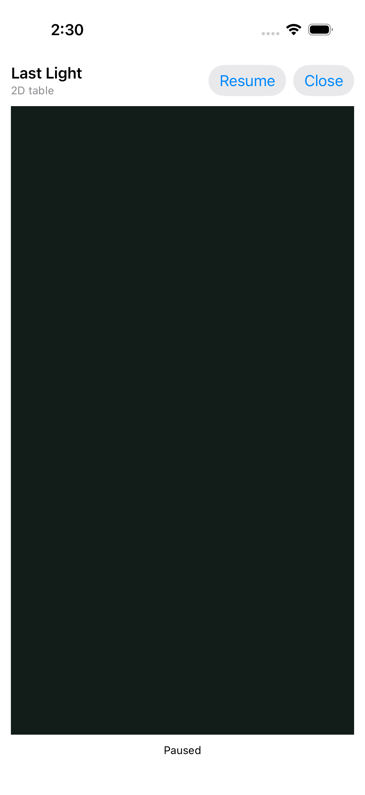</a> | **Native cover with paused private bindings cleared** [Native cover with paused private bindings cleared_0_E8F84D1F-73EB-46D0-A477-1DD5C7BDB0FA.png](attachments/1C164056-29BF-45D0-B3FC-28362547902D.png) Exported file: <code>1C164056-29BF-45D0-B3FC-28362547902D.png</code> 1206 × 2622 px · 2026-09-10T14:30:50.308+00:00 <code>AuthorityHostUITests/testReferenceMatchIn2D()</code> — passed SHA-256: <code>0b820bdf80675e8ddaa607f81a1ccfca090d555f97417daf72a6c5953b2e21a4</code> [Owner mapping](../provenance/source-map/mapping.json) · [Original case results](../provenance/collection-evidence-summary.json) · [Case companions](companions.md#case-d467b4236c1f) Original native authority host attachment; original XCTest case result: Success. Associated by recorded test case, attachment name and timestamp only; no per-screenshot pairing is attested. Retained lifecycle and same-process reentry remain unqualified after the stale-first-ready failure. Five Authority Simulator fixture cases passed, including four reference full matches and secure launch/exit. Secure-default full match, production KMP factory, physical sensors, device Metal and real audio interruption remain unqualified. No clean-native-log or no-crash claim is made. Direct original visual observation: The normal-text 2D native pause frame fully covers the renderer. Resume, Close and Paused are readable; no private card content is visible. **Publication review — direct original view:** The normal-text 2D native pause frame fully covers the renderer. Resume, Close and Paused are readable; no private card content is visible. |
|  | **Actual Home screen before game reactivation** [Actual Home screen before game reactivation_0_F1A601BA-ED66-491E-AF92-787725027FD8.png](attachments/90CA163E-1EA4-4EB0-BDCC-2A3892B55B7F.png) Exported file: <code>90CA163E-1EA4-4EB0-BDCC-2A3892B55B7F.png</code> 1206 × 2622 px · 2026-09-10T14:30:57.463+00:00 <code>AuthorityHostUITests/testReferenceMatchIn2D()</code> — passed SHA-256: <code>bc3089f795c2ef49396b1e0bfcae56443829f99c20cff9456be003bc7a2549a9</code> [Owner mapping](../provenance/source-map/mapping.json) · [Original case results](../provenance/collection-evidence-summary.json) · [Case companions](companions.md#case-d467b4236c1f) Original native authority host attachment; original XCTest case result: Success. Associated by recorded test case, attachment name and timestamp only; no per-screenshot pairing is attested. Retained lifecycle and same-process reentry remain unqualified after the stale-first-ready failure. Five Authority Simulator fixture cases passed, including four reference full matches and secure launch/exit. Secure-default full match, production KMP factory, physical sensors, device Metal and real audio interruption remain unqualified. No clean-native-log or no-crash claim is made. Direct original visual observation: The normal-text authority case records the actual Home screen with Safari and Messages in the dock and no game content. **Publication review — direct original view:** The normal-text authority case records the actual Home screen with Safari and Messages in the dock and no game content. |
| <a href="attachments/2E2C91DB-0031-492C-A9D6-DAA2CFB3A3DD.png">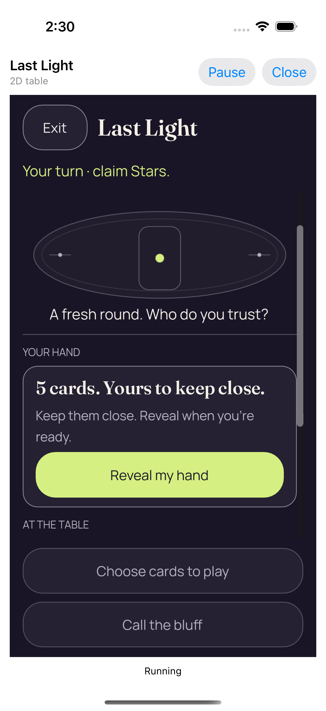</a> | **Same authority resumed with concealed cards** [Same authority resumed with concealed cards_0_005E2B24-D763-41E6-9B8D-A4F1456183FA.png](attachments/2E2C91DB-0031-492C-A9D6-DAA2CFB3A3DD.png) Exported file: <code>2E2C91DB-0031-492C-A9D6-DAA2CFB3A3DD.png</code> 1206 × 2622 px · 2026-09-10T14:30:58.586+00:00 <code>AuthorityHostUITests/testReferenceMatchIn2D()</code> — passed SHA-256: <code>f366d5f0992f847a9cbdebba50459f41f75c0ceb67577fafbfd8952f4dce864c</code> [Owner mapping](../provenance/source-map/mapping.json) · [Original case results](../provenance/collection-evidence-summary.json) · [Case companions](companions.md#case-d467b4236c1f) Original native authority host attachment; original XCTest case result: Success. Associated by recorded test case, attachment name and timestamp only; no per-screenshot pairing is attested. Retained lifecycle and same-process reentry remain unqualified after the stale-first-ready failure. Five Authority Simulator fixture cases passed, including four reference full matches and secure launch/exit. Secure-default full match, production KMP factory, physical sensors, device Metal and real audio interruption remain unqualified. No clean-native-log or no-crash claim is made. Direct original visual observation: The resumed normal-text 2D table remains concealed, with a full Reveal button and complete disabled gameplay actions in the captured scroll position. **Publication review — direct original view:** The resumed normal-text 2D table remains concealed, with a full Reveal button and complete disabled gameplay actions in the captured scroll position. |
|  | **04 actual viewer play 2d text 1** [04 actual viewer play 2d text 1_0_0C3060A7-27B1-4C45-9C4A-9788E881E04C.png](attachments/A5E3C7D6-3501-49D8-89B8-A46E88750529.png) Exported file: <code>A5E3C7D6-3501-49D8-89B8-A46E88750529.png</code> 1206 × 2622 px · 2026-09-10T14:31:03.547+00:00 <code>AuthorityHostUITests/testReferenceMatchIn2D()</code> — passed SHA-256: <code>8818f6eebe42b2cf244861f5a6d1a9e692eb642c5abebfb563beda144a9e1d18</code> [Owner mapping](../provenance/source-map/mapping.json) · [Original case results](../provenance/collection-evidence-summary.json) · [Case companions](companions.md#case-d467b4236c1f) Original native authority host attachment; original XCTest case result: Success. Associated by recorded test case, attachment name and timestamp only; no per-screenshot pairing is attested. Retained lifecycle and same-process reentry remain unqualified after the stale-first-ready failure. Five Authority Simulator fixture cases passed, including four reference full matches and secure launch/exit. Secure-default full match, production KMP factory, physical sensors, device Metal and real audio interruption remain unqualified. No clean-native-log or no-crash claim is made. Direct original visual observation: The normal-text 2D result shows the Moon proof, named challenge and light consequence in full. Deal the next round fits; further seat rows continue below the scroll edge. **Publication review — direct original view:** The normal-text 2D result shows the Moon proof, named challenge and light consequence in full. Deal the next round fits; further seat rows continue below the scroll edge. |
| <a href="attachments/69BA0E82-33AE-4B65-9F31-66BEBB27D330.png">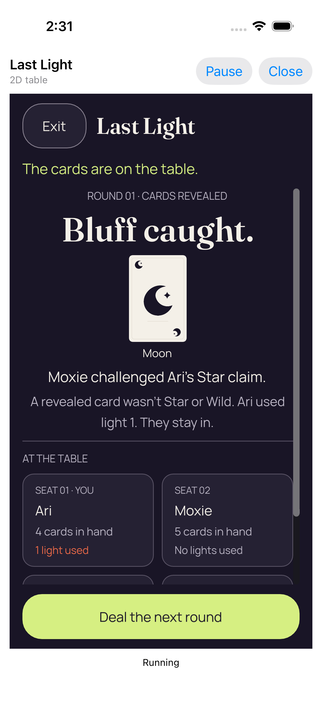</a> | **05 public outcome 2d text 1** [05 public outcome 2d text 1_0_3A78A72E-6FCA-433B-8F86-DD065D6455AF.png](attachments/69BA0E82-33AE-4B65-9F31-66BEBB27D330.png) Exported file: <code>69BA0E82-33AE-4B65-9F31-66BEBB27D330.png</code> 1206 × 2622 px · 2026-09-10T14:31:03.692+00:00 <code>AuthorityHostUITests/testReferenceMatchIn2D()</code> — passed SHA-256: <code>8818f6eebe42b2cf244861f5a6d1a9e692eb642c5abebfb563beda144a9e1d18</code> [Owner mapping](../provenance/source-map/mapping.json) · [Original case results](../provenance/collection-evidence-summary.json) · [Case companions](companions.md#case-d467b4236c1f) Original native authority host attachment; original XCTest case result: Success. Associated by recorded test case, attachment name and timestamp only; no per-screenshot pairing is attested. Retained lifecycle and same-process reentry remain unqualified after the stale-first-ready failure. Five Authority Simulator fixture cases passed, including four reference full matches and secure launch/exit. Secure-default full match, production KMP factory, physical sensors, device Metal and real audio interruption remain unqualified. No clean-native-log or no-crash claim is made. Observation reused from a named byte-identical direct original; this capture was not directly viewed: The normal-text 2D result shows the Moon proof, named challenge and light consequence in full. Deal the next round fits; further seat rows continue below the scroll edge. **Publication review — exact match to a directly viewed original in this batch:** The normal-text 2D result shows the Moon proof, named challenge and light consequence in full. Deal the next round fits; further seat rows continue below the scroll edge. [Reviewed matching original](attachments/A5E3C7D6-3501-49D8-89B8-A46E88750529.png); capture context remains separate. |
| <a href="attachments/6AFBBD54-8EAA-4851-99E7-A93FBB210F48.png">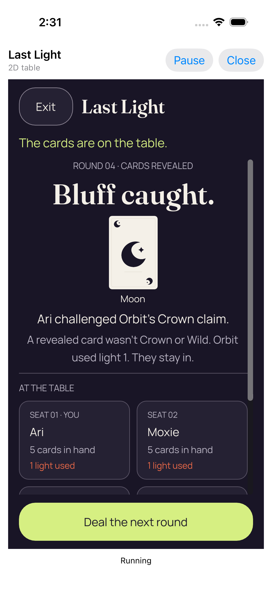</a> | **06 actual viewer challenge 2d text 1** [06 actual viewer challenge 2d text 1_0_4D58BEBD-EB79-4303-9B5E-451A5956C940.png](attachments/6AFBBD54-8EAA-4851-99E7-A93FBB210F48.png) Exported file: <code>6AFBBD54-8EAA-4851-99E7-A93FBB210F48.png</code> 1206 × 2622 px · 2026-09-10T14:31:10.785+00:00 <code>AuthorityHostUITests/testReferenceMatchIn2D()</code> — passed SHA-256: <code>8a3de6606dac70a583d8748c4751df99340cd26aa99c728c62fcbaf64898dc99</code> [Owner mapping](../provenance/source-map/mapping.json) · [Original case results](../provenance/collection-evidence-summary.json) · [Case companions](companions.md#case-d467b4236c1f) Original native authority host attachment; original XCTest case result: Success. Associated by recorded test case, attachment name and timestamp only; no per-screenshot pairing is attested. Retained lifecycle and same-process reentry remain unqualified after the stale-first-ready failure. Five Authority Simulator fixture cases passed, including four reference full matches and secure launch/exit. Secure-default full match, production KMP factory, physical sensors, device Metal and real audio interruption remain unqualified. No clean-native-log or no-crash claim is made. Direct original visual observation: Normal 2D round-4 result: complete Moon proof, Ari challenges Orbit’s Crown claim, spent-light explanation, and Deal the next round are readable. Further seat rows continue below the scroll edge. **Publication review — direct original view:** Normal 2D round-4 result: complete Moon proof, Ari challenges Orbit’s Crown claim, spent-light explanation, and Deal the next round are readable. Further seat rows continue below the scroll edge. |
| <a href="attachments/8FC44A2A-CDB9-4810-BBE9-1757E71561A7.png">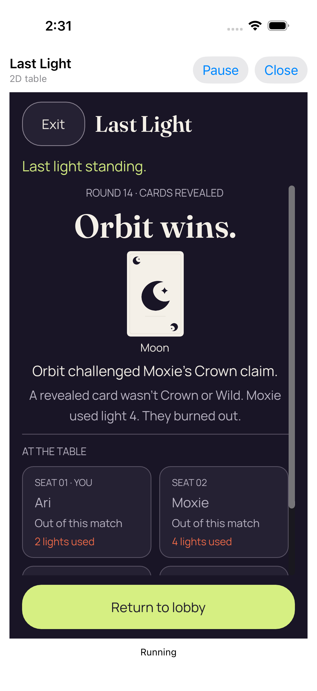</a> | **07 real winner 2d text 1** [07 real winner 2d text 1_0_B605319D-0541-49E2-8FBB-67129003265E.png](attachments/8FC44A2A-CDB9-4810-BBE9-1757E71561A7.png) Exported file: <code>8FC44A2A-CDB9-4810-BBE9-1757E71561A7.png</code> 1206 × 2622 px · 2026-09-10T14:31:39.238+00:00 <code>AuthorityHostUITests/testReferenceMatchIn2D()</code> — passed SHA-256: <code>0271f57dee300f65622560f47822d2b2de6d04ca9998a42fcfd4e9e91aa6a00d</code> [Owner mapping](../provenance/source-map/mapping.json) · [Original case results](../provenance/collection-evidence-summary.json) · [Case companions](companions.md#case-d467b4236c1f) Original native authority host attachment; original XCTest case result: Success. Associated by recorded test case, attachment name and timestamp only; no per-screenshot pairing is attested. Retained lifecycle and same-process reentry remain unqualified after the stale-first-ready failure. Five Authority Simulator fixture cases passed, including four reference full matches and secure launch/exit. Secure-default full match, production KMP factory, physical sensors, device Metal and real audio interruption remain unqualified. No clean-native-log or no-crash claim is made. Direct original visual observation: Normal 2D winner: Orbit wins, public Moon, named Orbit/Moxie challenge and Moxie burnout explanation are readable. Return to lobby is complete; further seats continue below the scroll edge. **Publication review — direct original view:** Normal 2D winner: Orbit wins, public Moon, named Orbit/Moxie challenge and Moxie burnout explanation are readable. Return to lobby is complete; further seats continue below the scroll edge. |
| <a href="attachments/BAE51245-FDAB-4CBA-BA4E-84DED7DD7F46.png">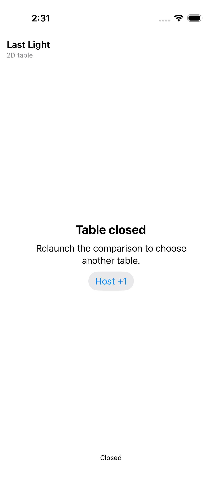</a> | **09 table returned through authority 2d text 1** [09 table returned through authority 2d text 1_0_0698B013-4DE6-4B79-9722-4582E5C2DBF1.png](attachments/BAE51245-FDAB-4CBA-BA4E-84DED7DD7F46.png) Exported file: <code>BAE51245-FDAB-4CBA-BA4E-84DED7DD7F46.png</code> 1206 × 2622 px · 2026-09-10T14:31:41.740+00:00 <code>AuthorityHostUITests/testReferenceMatchIn2D()</code> — passed SHA-256: <code>8250c64fe8a7dc57a8205e4f13b3d2f342d74398182bd00325ff728b51edc94b</code> [Owner mapping](../provenance/source-map/mapping.json) · [Original case results](../provenance/collection-evidence-summary.json) · [Case companions](companions.md#case-d467b4236c1f) Original native authority host attachment; original XCTest case result: Success. Associated by recorded test case, attachment name and timestamp only; no per-screenshot pairing is attested. Retained lifecycle and same-process reentry remain unqualified after the stale-first-ready failure. Five Authority Simulator fixture cases passed, including four reference full matches and secure launch/exit. Secure-default full match, production KMP factory, physical sensors, device Metal and real audio interruption remain unqualified. No clean-native-log or no-crash claim is made. Direct original visual observation: Normal 2D native Table closed screen shows the relaunch instruction, Host +1 and Closed status. No renderer content is visible. **Publication review — direct original view:** Normal 2D native Table closed screen shows the relaunch instruction, Host +1 and Closed status. No renderer content is visible. |
| <a href="attachments/61822678-E67D-499A-8DA4-BCC4CA664238.png">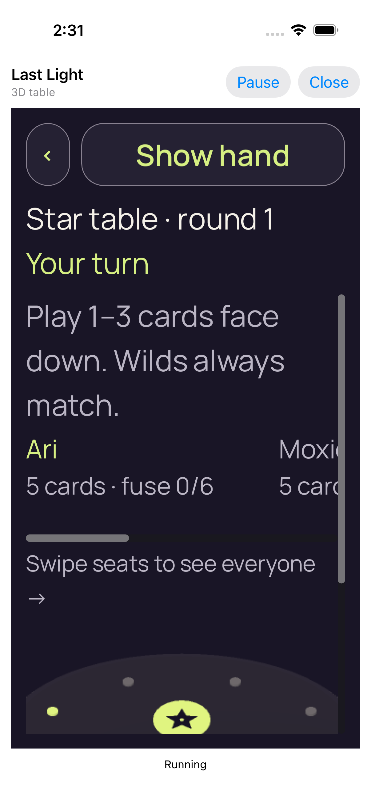</a> | **01 concealed 3d text 2** [01 concealed 3d text 2_0_F635A00B-CE3C-43FB-85F3-D7CBD199B015.png](attachments/61822678-E67D-499A-8DA4-BCC4CA664238.png) Exported file: <code>61822678-E67D-499A-8DA4-BCC4CA664238.png</code> 1206 × 2622 px · 2026-09-10T14:32:00.014+00:00 <code>AuthorityHostUITests/testReferenceMatchIn3DAt200Percent()</code> — passed SHA-256: <code>6e6c225b307ec985c1fade81fb861928d4fb9a2dad06257246e84853c268858d</code> [Owner mapping](../provenance/source-map/mapping.json) · [Original case results](../provenance/collection-evidence-summary.json) · [Case companions](companions.md#case-2e6c745dde8a) Original native authority host attachment; original XCTest case result: Success. Associated by recorded test case, attachment name and timestamp only; no per-screenshot pairing is attested. Retained lifecycle and same-process reentry remain unqualified after the stale-first-ready failure. Five Authority Simulator fixture cases passed, including four reference full matches and secure launch/exit. Secure-default full match, production KMP factory, physical sensors, device Metal and real audio interruption remain unqualified. No clean-native-log or no-crash claim is made. Direct original visual observation: Initial 3D at 200%: Show hand, Star table and round 1, Your turn and the full instruction are readable. The seat row clips Moxie horizontally. The table begins at the bottom; hand/back cards and Select cards fall below the captured viewport. **Publication review — direct original view:** Initial 3D at 200%: Show hand, Star table and round 1, Your turn and the full instruction are readable. The seat row clips Moxie horizontally. The table begins at the bottom; hand/back cards and Select cards fall below the captured viewport. |
| <a href="attachments/D3500B3D-9221-4BDD-A4D8-D51AA534B37D.png">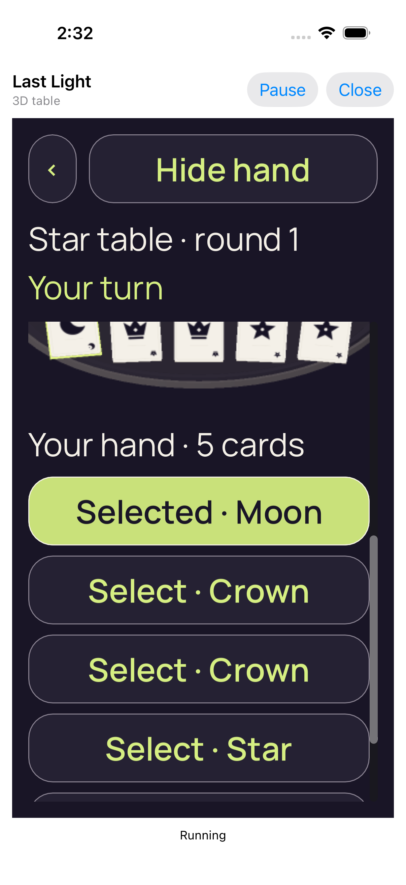</a> | **02 revealed and selected 3d text 2** [02 revealed and selected 3d text 2_0_8BFADC5F-34F9-4980-8FC4-114EEE49B55B.png](attachments/D3500B3D-9221-4BDD-A4D8-D51AA534B37D.png) Exported file: <code>D3500B3D-9221-4BDD-A4D8-D51AA534B37D.png</code> 1206 × 2622 px · 2026-09-10T14:32:26.949+00:00 <code>AuthorityHostUITests/testReferenceMatchIn3DAt200Percent()</code> — passed SHA-256: <code>45dc753fc1e243a707cbfb688db754667e2b4827a55d34adabf662d270912360</code> [Owner mapping](../provenance/source-map/mapping.json) · [Original case results](../provenance/collection-evidence-summary.json) · [Case companions](companions.md#case-2e6c745dde8a) Original native authority host attachment; original XCTest case result: Success. Associated by recorded test case, attachment name and timestamp only; no per-screenshot pairing is attested. Retained lifecycle and same-process reentry remain unqualified after the stale-first-ready failure. Five Authority Simulator fixture cases passed, including four reference full matches and secure launch/exit. Secure-default full match, production KMP factory, physical sensors, device Metal and real audio interruption remain unqualified. No clean-native-log or no-crash claim is made. Direct original visual observation: The scrolled 3D view at 200% shows the lower portion of five card faces, a bright Moon selection outline, and complete Selected Moon, Crown and first Star controls. Card artwork is cut at the top of the scroll region; more hand and play content continues below the captured viewport. **Publication review — direct original view:** The scrolled 3D view at 200% shows the lower portion of five card faces, a bright Moon selection outline, and complete Selected Moon, Crown and first Star controls. Card artwork is cut at the top of the scroll region; more hand and play content continues below the captured viewport. |
| <a href="attachments/829B1818-D120-4DC1-9F22-18D8BCA717A9.png">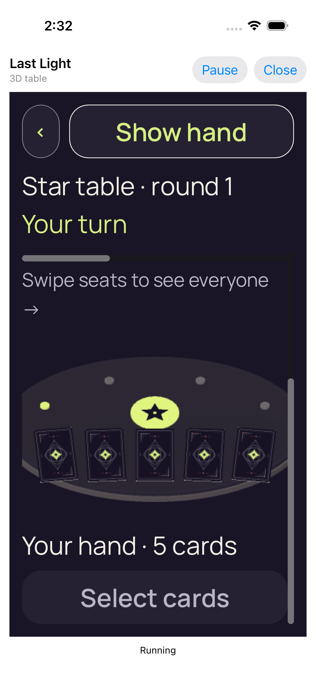</a> | **03 private bindings cleared 3d text 2** [03 private bindings cleared 3d text 2_0_850DF69A-B862-43BD-B0D0-75F20CE18F90.png](attachments/829B1818-D120-4DC1-9F22-18D8BCA717A9.png) Exported file: <code>829B1818-D120-4DC1-9F22-18D8BCA717A9.png</code> 1206 × 2622 px · 2026-09-10T14:32:40.165+00:00 <code>AuthorityHostUITests/testReferenceMatchIn3DAt200Percent()</code> — passed SHA-256: <code>9fe819252f3409e371117fc21133dab35f49a19584a07e06124debc8d6880615</code> [Owner mapping](../provenance/source-map/mapping.json) · [Original case results](../provenance/collection-evidence-summary.json) · [Case companions](companions.md#case-2e6c745dde8a) Original native authority host attachment; original XCTest case result: Success. Associated by recorded test case, attachment name and timestamp only; no per-screenshot pairing is attested. Retained lifecycle and same-process reentry remain unqualified after the stale-first-ready failure. Five Authority Simulator fixture cases passed, including four reference full matches and secure launch/exit. Secure-default full match, production KMP factory, physical sensors, device Metal and real audio interruption remain unqualified. No clean-native-log or no-crash claim is made. Direct original visual observation: The scrolled concealed 3D view at 200% shows five complete card backs and the full disabled Select cards control. Show hand and the turn/table headings remain readable. The seat-swiping instruction wraps its arrow to the next line. No ranks are visible on the displayed cards. **Publication review — direct original view:** The scrolled concealed 3D view at 200% shows five complete card backs and the full disabled Select cards control. Show hand and the turn/table headings remain readable. The seat-swiping instruction wraps its arrow to the next line. No ranks are visible on the displayed cards. |
| <a href="attachments/06886A56-7E8F-41CE-9EE7-DED4B04EDE54.png">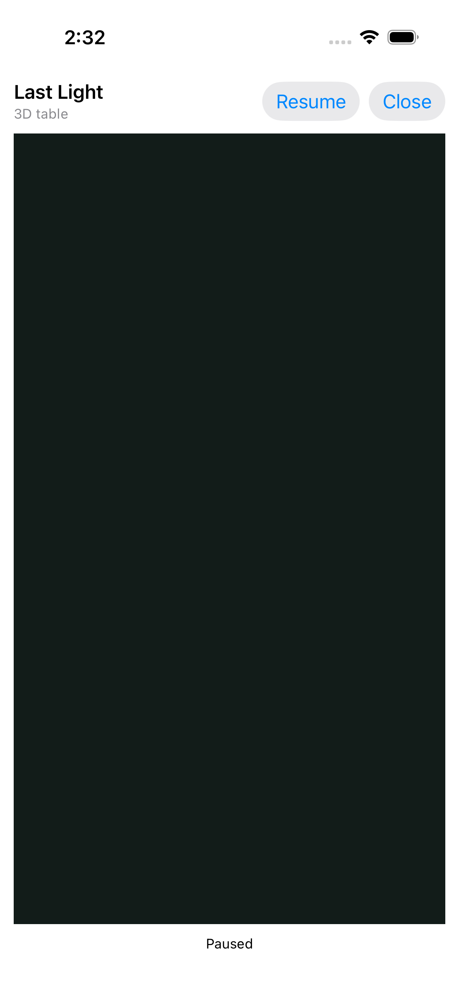</a> | **Native cover with paused private bindings cleared** [Native cover with paused private bindings cleared_0_23090204-9961-4820-B98B-322886A947DE.png](attachments/06886A56-7E8F-41CE-9EE7-DED4B04EDE54.png) Exported file: <code>06886A56-7E8F-41CE-9EE7-DED4B04EDE54.png</code> 1206 × 2622 px · 2026-09-10T14:33:00.021+00:00 <code>AuthorityHostUITests/testReferenceMatchIn3DAt200Percent()</code> — passed SHA-256: <code>359b79fd62437d06396b74a92a70b07ffbb73f016e3188ddf9b3b948b0dac790</code> [Owner mapping](../provenance/source-map/mapping.json) · [Original case results](../provenance/collection-evidence-summary.json) · [Case companions](companions.md#case-2e6c745dde8a) Original native authority host attachment; original XCTest case result: Success. Associated by recorded test case, attachment name and timestamp only; no per-screenshot pairing is attested. Retained lifecycle and same-process reentry remain unqualified after the stale-first-ready failure. Five Authority Simulator fixture cases passed, including four reference full matches and secure launch/exit. Secure-default full match, production KMP factory, physical sensors, device Metal and real audio interruption remain unqualified. No clean-native-log or no-crash claim is made. Direct original visual observation: The 3D paused native cover is a uniform dark panel with complete Resume and Close controls and Paused status. No game scene or private hand content is visible in the covered area. **Publication review — direct original view:** The 3D paused native cover is a uniform dark panel with complete Resume and Close controls and Paused status. No game scene or private hand content is visible in the covered area. |
|  | **Actual Home screen before game reactivation** [Actual Home screen before game reactivation_0_F8D09D93-AB2B-43B4-8144-7BECF5BB27A7.png](attachments/BB14F89E-329C-42F0-B948-0FB655C2AE5F.png) Exported file: <code>BB14F89E-329C-42F0-B948-0FB655C2AE5F.png</code> 1206 × 2622 px · 2026-09-10T14:33:12.890+00:00 <code>AuthorityHostUITests/testReferenceMatchIn3DAt200Percent()</code> — passed SHA-256: <code>a37bd2ec24ecceb2709298cb6f3d6fcfd54f3c9a231293b737bbdc68f0e15af3</code> [Owner mapping](../provenance/source-map/mapping.json) · [Original case results](../provenance/collection-evidence-summary.json) · [Case companions](companions.md#case-2e6c745dde8a) Original native authority host attachment; original XCTest case result: Success. Associated by recorded test case, attachment name and timestamp only; no per-screenshot pairing is attested. Retained lifecycle and same-process reentry remain unqualified after the stale-first-ready failure. Five Authority Simulator fixture cases passed, including four reference full matches and secure launch/exit. Secure-default full match, production KMP factory, physical sensors, device Metal and real audio interruption remain unqualified. No clean-native-log or no-crash claim is made. Direct original visual observation: The capture shows the actual iOS Home screen with app icons, Search, and the Safari/Messages dock. No game content is displayed; application-state evidence remains a separate companion. **Publication review — direct original view:** The capture shows the actual iOS Home screen with app icons, Search, and the Safari/Messages dock. No game content is displayed; application-state evidence remains a separate companion. |
|  | **Same authority resumed with concealed cards** [Same authority resumed with concealed cards_0_84F6157D-61C6-4513-BA45-DBE1BA8495EB.png](attachments/DCB2E667-CB8B-49F3-BB35-296DE150DE02.png) Exported file: <code>DCB2E667-CB8B-49F3-BB35-296DE150DE02.png</code> 1206 × 2622 px · 2026-09-10T14:33:15.983+00:00 <code>AuthorityHostUITests/testReferenceMatchIn3DAt200Percent()</code> — passed SHA-256: <code>4b1b082c6d51519c8a538eae43978712fc84341b0657f0f0bf543c670787d983</code> [Owner mapping](../provenance/source-map/mapping.json) · [Original case results](../provenance/collection-evidence-summary.json) · [Case companions](companions.md#case-2e6c745dde8a) Original native authority host attachment; original XCTest case result: Success. Associated by recorded test case, attachment name and timestamp only; no per-screenshot pairing is attested. Retained lifecycle and same-process reentry remain unqualified after the stale-first-ready failure. Five Authority Simulator fixture cases passed, including four reference full matches and secure launch/exit. Secure-default full match, production KMP factory, physical sensors, device Metal and real audio interruption remain unqualified. No clean-native-log or no-crash claim is made. Direct original visual observation: The resumed 3D capture at 200% shows five complete card backs, readable Show hand and a complete disabled Select cards control. The turn/table headings and wrapped seat-swiping instruction remain visible; no displayed card rank is exposed. **Publication review — direct original view:** The resumed 3D capture at 200% shows five complete card backs, readable Show hand and a complete disabled Select cards control. The turn/table headings and wrapped seat-swiping instruction remain visible; no displayed card rank is exposed. |
| <a href="attachments/5C151EA5-C595-4FAE-887A-BAD26E82C623.png">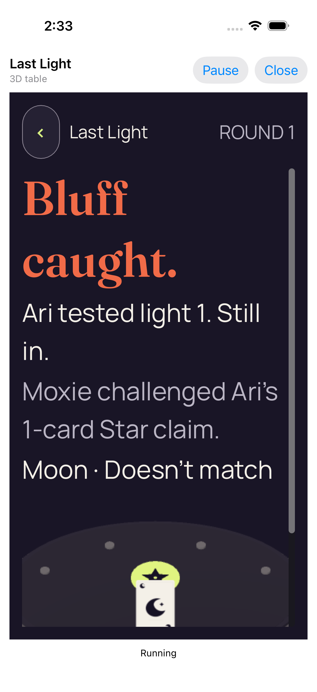</a> | **04 actual viewer play 3d text 2** [04 actual viewer play 3d text 2_0_35ED8ECD-18D6-4876-86D2-CA8B4DBD8202.png](attachments/5C151EA5-C595-4FAE-887A-BAD26E82C623.png) Exported file: <code>5C151EA5-C595-4FAE-887A-BAD26E82C623.png</code> 1206 × 2622 px · 2026-09-10T14:33:29.151+00:00 <code>AuthorityHostUITests/testReferenceMatchIn3DAt200Percent()</code> — passed SHA-256: <code>39fa0520c3f5a2c8647bb8d30b7027746b903ce23b288a9b764ea4dff8efd37c</code> [Owner mapping](../provenance/source-map/mapping.json) · [Original case results](../provenance/collection-evidence-summary.json) · [Case companions](companions.md#case-2e6c745dde8a) Original native authority host attachment; original XCTest case result: Success. Associated by recorded test case, attachment name and timestamp only; no per-screenshot pairing is attested. Retained lifecycle and same-process reentry remain unqualified after the stale-first-ready failure. Five Authority Simulator fixture cases passed, including four reference full matches and secure launch/exit. Secure-default full match, production KMP factory, physical sensors, device Metal and real audio interruption remain unqualified. No clean-native-log or no-crash claim is made. Direct original visual observation: The 200% 3D round-1 result shows Bluff caught, Ari still in, Moxie’s named challenge and Moon does not match. The public Moon artwork is cut by the lower scroll edge, and the remaining explanation and continuation control are below the viewport. **Publication review — direct original view:** The 200% 3D round-1 result shows Bluff caught, Ari still in, Moxie’s named challenge and Moon does not match. The public Moon artwork is cut by the lower scroll edge, and the remaining explanation and continuation control are below the viewport. |
|  | **05 public outcome 3d text 2** [05 public outcome 3d text 2_0_3950289A-423E-48B4-8904-7500CD6DF74C.png](attachments/8CD8B6F0-C74B-450B-BABF-00288F60782F.png) Exported file: <code>8CD8B6F0-C74B-450B-BABF-00288F60782F.png</code> 1206 × 2622 px · 2026-09-10T14:33:29.286+00:00 <code>AuthorityHostUITests/testReferenceMatchIn3DAt200Percent()</code> — passed SHA-256: <code>39fa0520c3f5a2c8647bb8d30b7027746b903ce23b288a9b764ea4dff8efd37c</code> [Owner mapping](../provenance/source-map/mapping.json) · [Original case results](../provenance/collection-evidence-summary.json) · [Case companions](companions.md#case-2e6c745dde8a) Original native authority host attachment; original XCTest case result: Success. Associated by recorded test case, attachment name and timestamp only; no per-screenshot pairing is attested. Retained lifecycle and same-process reentry remain unqualified after the stale-first-ready failure. Five Authority Simulator fixture cases passed, including four reference full matches and secure launch/exit. Secure-default full match, production KMP factory, physical sensors, device Metal and real audio interruption remain unqualified. No clean-native-log or no-crash claim is made. Observation reused from a named byte-identical direct original; this capture was not directly viewed: The 200% 3D round-1 result shows Bluff caught, Ari still in, Moxie’s named challenge and Moon does not match. The public Moon artwork is cut by the lower scroll edge, and the remaining explanation and continuation control are below the viewport. **Publication review — exact match to a directly viewed original in this batch:** The 200% 3D round-1 result shows Bluff caught, Ari still in, Moxie’s named challenge and Moon does not match. The public Moon artwork is cut by the lower scroll edge, and the remaining explanation and continuation control are below the viewport. [Reviewed matching original](attachments/5C151EA5-C595-4FAE-887A-BAD26E82C623.png); capture context remains separate. |
| <a href="attachments/64CB214B-A5AE-4BEF-91A1-4589980F6BDB.png">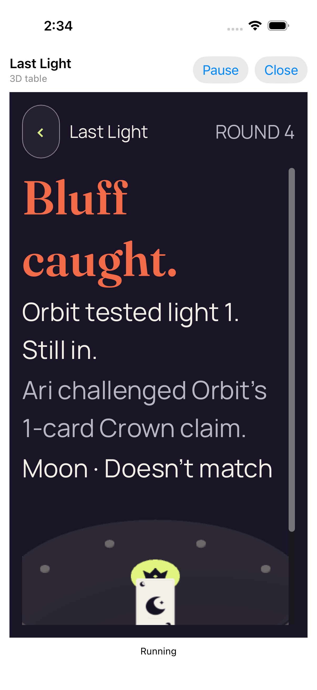</a> | **06 actual viewer challenge 3d text 2** [06 actual viewer challenge 3d text 2_0_891810AF-A29B-4755-A180-2EA6AE4A4248.png](attachments/64CB214B-A5AE-4BEF-91A1-4589980F6BDB.png) Exported file: <code>64CB214B-A5AE-4BEF-91A1-4589980F6BDB.png</code> 1206 × 2622 px · 2026-09-10T14:34:01.526+00:00 <code>AuthorityHostUITests/testReferenceMatchIn3DAt200Percent()</code> — passed SHA-256: <code>abb5a8e4696ab8e6579b235397a0066ac5ea63fe86f662a35c602ddc19710091</code> [Owner mapping](../provenance/source-map/mapping.json) · [Original case results](../provenance/collection-evidence-summary.json) · [Case companions](companions.md#case-2e6c745dde8a) Original native authority host attachment; original XCTest case result: Success. Associated by recorded test case, attachment name and timestamp only; no per-screenshot pairing is attested. Retained lifecycle and same-process reentry remain unqualified after the stale-first-ready failure. Five Authority Simulator fixture cases passed, including four reference full matches and secure launch/exit. Secure-default full match, production KMP factory, physical sensors, device Metal and real audio interruption remain unqualified. No clean-native-log or no-crash claim is made. Direct original visual observation: The 200% 3D round-4 result shows Bluff caught, Orbit still in, Ari’s named Crown challenge and Moon does not match. The public Moon artwork is cut at the lower scroll edge; the remaining explanation and continuation control are below the viewport. **Publication review — direct original view:** The 200% 3D round-4 result shows Bluff caught, Orbit still in, Ari’s named Crown challenge and Moon does not match. The public Moon artwork is cut at the lower scroll edge; the remaining explanation and continuation control are below the viewport. |
| <a href="attachments/04B0797C-33C8-4D70-AE9A-4DF15A1E3600.png">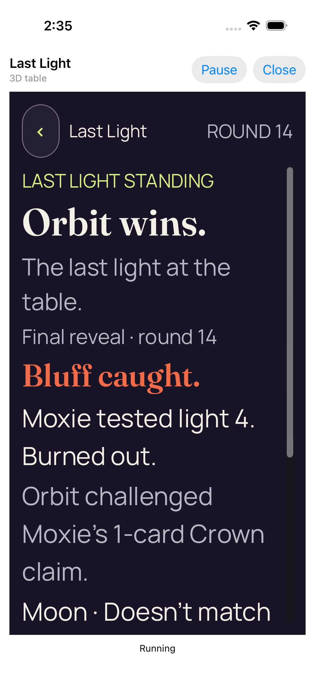</a> | **07 real winner 3d text 2** [07 real winner 3d text 2_0_10C38484-A0B9-45C5-9B97-47104B2EB8DA.png](attachments/04B0797C-33C8-4D70-AE9A-4DF15A1E3600.png) Exported file: <code>04B0797C-33C8-4D70-AE9A-4DF15A1E3600.png</code> 1206 × 2622 px · 2026-09-10T14:35:10.083+00:00 <code>AuthorityHostUITests/testReferenceMatchIn3DAt200Percent()</code> — passed SHA-256: <code>f5c2eb511430520d6dafff6c3cc73463185578df1bf0c27e424ffde05e650f74</code> [Owner mapping](../provenance/source-map/mapping.json) · [Original case results](../provenance/collection-evidence-summary.json) · [Case companions](companions.md#case-2e6c745dde8a) Original native authority host attachment; original XCTest case result: Success. Associated by recorded test case, attachment name and timestamp only; no per-screenshot pairing is attested. Retained lifecycle and same-process reentry remain unqualified after the stale-first-ready failure. Five Authority Simulator fixture cases passed, including four reference full matches and secure launch/exit. Secure-default full match, production KMP factory, physical sensors, device Metal and real audio interruption remain unqualified. No clean-native-log or no-crash claim is made. Direct original visual observation: The 200% 3D winner screen clearly names Orbit, round 14, Moxie’s fourth-light burnout and Orbit’s challenge of Moxie’s Crown claim. Moon does not match is readable at the bottom; proof artwork and the return control are below the captured viewport. **Publication review — direct original view:** The 200% 3D winner screen clearly names Orbit, round 14, Moxie’s fourth-light burnout and Orbit’s challenge of Moxie’s Crown claim. Moon does not match is readable at the bottom; proof artwork and the return control are below the captured viewport. |
|  | **09 table returned through authority 3d text 2** [09 table returned through authority 3d text 2_0_D42B8D77-FBE5-479D-985C-BEA470A9BE4F.png](attachments/37CF95F8-F7FA-4077-A965-90749773A68C.png) Exported file: <code>37CF95F8-F7FA-4077-A965-90749773A68C.png</code> 1206 × 2622 px · 2026-09-10T14:35:18.503+00:00 <code>AuthorityHostUITests/testReferenceMatchIn3DAt200Percent()</code> — passed SHA-256: <code>f4559798425a6ec14c183010e6f496e3e60d4f7719ace9d27d241503f9946ef8</code> [Owner mapping](../provenance/source-map/mapping.json) · [Original case results](../provenance/collection-evidence-summary.json) · [Case companions](companions.md#case-2e6c745dde8a) Original native authority host attachment; original XCTest case result: Success. Associated by recorded test case, attachment name and timestamp only; no per-screenshot pairing is attested. Retained lifecycle and same-process reentry remain unqualified after the stale-first-ready failure. Five Authority Simulator fixture cases passed, including four reference full matches and secure launch/exit. Secure-default full match, production KMP factory, physical sensors, device Metal and real audio interruption remain unqualified. No clean-native-log or no-crash claim is made. Direct original visual observation: The native 3D Table closed screen shows the complete relaunch instruction, Host +1 and Closed status. No renderer or hand content is visible. **Publication review — direct original view:** The native 3D Table closed screen shows the complete relaunch instruction, Host +1 and Closed status. No renderer or hand content is visible. |
| <a href="attachments/315FC0B5-1CD0-45B3-8686-ED1D3D4CDD93.png">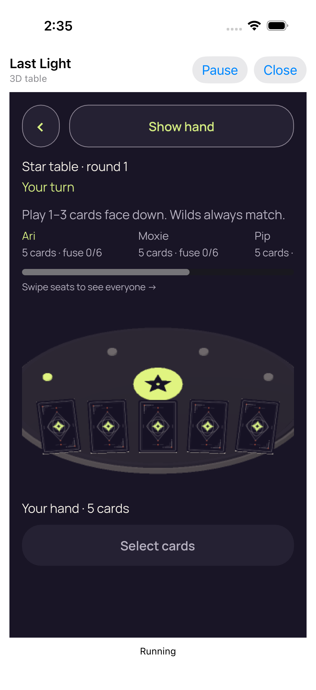</a> | **01 concealed 3d text 1** [01 concealed 3d text 1_0_E0BEDA1C-05EE-470E-BBF1-1B72280DA9B1.png](attachments/315FC0B5-1CD0-45B3-8686-ED1D3D4CDD93.png) Exported file: <code>315FC0B5-1CD0-45B3-8686-ED1D3D4CDD93.png</code> 1206 × 2622 px · 2026-09-10T14:35:37.953+00:00 <code>AuthorityHostUITests/testReferenceMatchIn3D()</code> — passed SHA-256: <code>b74720dcb8c9f779d226ab0b98490d6d5c502a5cf11e2709bbe2486c8bb85419</code> [Owner mapping](../provenance/source-map/mapping.json) · [Original case results](../provenance/collection-evidence-summary.json) · [Case companions](companions.md#case-101af43a7bca) Original native authority host attachment; original XCTest case result: Success. Associated by recorded test case, attachment name and timestamp only; no per-screenshot pairing is attested. Retained lifecycle and same-process reentry remain unqualified after the stale-first-ready failure. Five Authority Simulator fixture cases passed, including four reference full matches and secure launch/exit. Secure-default full match, production KMP factory, physical sensors, device Metal and real audio interruption remain unqualified. No clean-native-log or no-crash claim is made. Direct original visual observation: The initial normal-size 3D view contains five complete card backs, readable table/turn instructions and complete Show hand and disabled Select cards controls. Pip’s seat details continue beyond the horizontal scroll edge. **Publication review — direct original view:** The initial normal-size 3D view contains five complete card backs, readable table/turn instructions and complete Show hand and disabled Select cards controls. Pip’s seat details continue beyond the horizontal scroll edge. |
| <a href="attachments/0E8ED525-6561-4AE2-A223-C6839FD92DF8.png">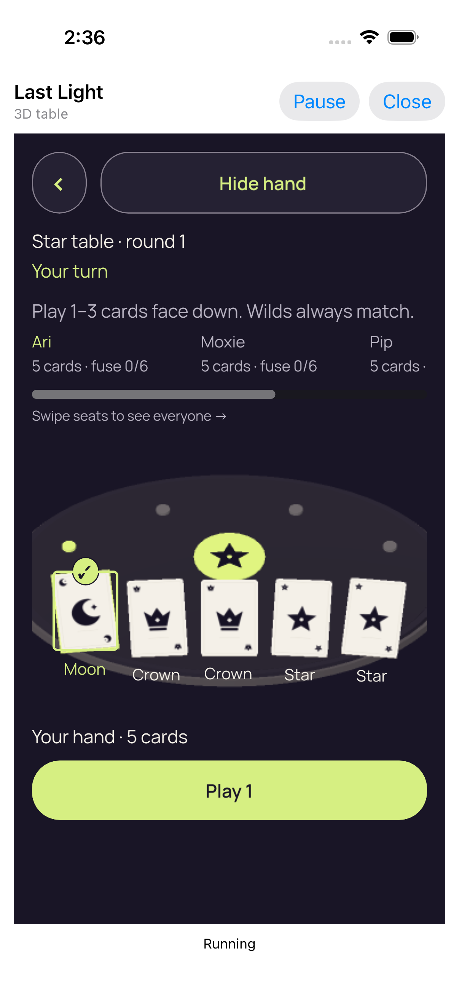</a> | **02 revealed and selected 3d text 1** [02 revealed and selected 3d text 1_0_0ABE26A0-7F48-4876-962A-1709F7B77DDB.png](attachments/0E8ED525-6561-4AE2-A223-C6839FD92DF8.png) Exported file: <code>0E8ED525-6561-4AE2-A223-C6839FD92DF8.png</code> 1206 × 2622 px · 2026-09-10T14:36:04.727+00:00 <code>AuthorityHostUITests/testReferenceMatchIn3D()</code> — passed SHA-256: <code>6a901eda01f57b147351a198c0a7d835012adc866bad7ede4a3e6ffec1163728</code> [Owner mapping](../provenance/source-map/mapping.json) · [Original case results](../provenance/collection-evidence-summary.json) · [Case companions](companions.md#case-101af43a7bca) Original native authority host attachment; original XCTest case result: Success. Associated by recorded test case, attachment name and timestamp only; no per-screenshot pairing is attested. Retained lifecycle and same-process reentry remain unqualified after the stale-first-ready failure. Five Authority Simulator fixture cases passed, including four reference full matches and secure launch/exit. Secure-default full match, production KMP factory, physical sensors, device Metal and real audio interruption remain unqualified. No clean-native-log or no-crash claim is made. Direct original visual observation: The normal-size 3D revealed hand shows all five faces and labels. The selected Moon has a complete bright outline and check badge, and Play 1 fits completely. Pip’s seat details continue beyond the horizontal scroll edge. **Publication review — direct original view:** The normal-size 3D revealed hand shows all five faces and labels. The selected Moon has a complete bright outline and check badge, and Play 1 fits completely. Pip’s seat details continue beyond the horizontal scroll edge. |
| <a href="attachments/3F690D8F-BD76-4C9D-8573-2C869C096E28.png">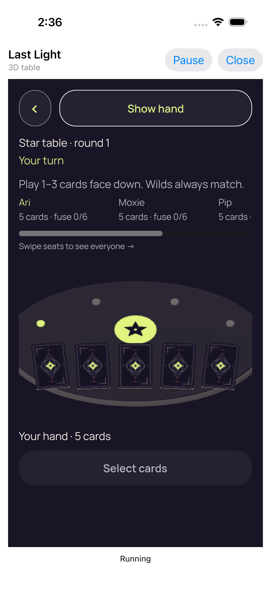</a> | **03 private bindings cleared 3d text 1** [03 private bindings cleared 3d text 1_0_1F70CFDD-EC5B-4B81-899E-D06119823B9B.png](attachments/3F690D8F-BD76-4C9D-8573-2C869C096E28.png) Exported file: <code>3F690D8F-BD76-4C9D-8573-2C869C096E28.png</code> 1206 × 2622 px · 2026-09-10T14:36:17.880+00:00 <code>AuthorityHostUITests/testReferenceMatchIn3D()</code> — passed SHA-256: <code>285f7c1de682d2407cc3a670507296b762febe04e5986c4c26813275d320bc1b</code> [Owner mapping](../provenance/source-map/mapping.json) · [Original case results](../provenance/collection-evidence-summary.json) · [Case companions](companions.md#case-101af43a7bca) Original native authority host attachment; original XCTest case result: Success. Associated by recorded test case, attachment name and timestamp only; no per-screenshot pairing is attested. Retained lifecycle and same-process reentry remain unqualified after the stale-first-ready failure. Five Authority Simulator fixture cases passed, including four reference full matches and secure launch/exit. Secure-default full match, production KMP factory, physical sensors, device Metal and real audio interruption remain unqualified. No clean-native-log or no-crash claim is made. Direct original visual observation: The normal-size concealed 3D frame shows five complete card backs with no displayed rank labels, full Show hand and disabled Select cards controls. Turn instructions remain readable; the seat row continues horizontally. **Publication review — direct original view:** The normal-size concealed 3D frame shows five complete card backs with no displayed rank labels, full Show hand and disabled Select cards controls. Turn instructions remain readable; the seat row continues horizontally. |
|  | **Native cover with paused private bindings cleared** [Native cover with paused private bindings cleared_0_C0820935-1233-4DCA-8B68-813D80C6A65E.png](attachments/8C7908B2-6062-4B76-8F50-5F763F41E3B5.png) Exported file: <code>8C7908B2-6062-4B76-8F50-5F763F41E3B5.png</code> 1206 × 2622 px · 2026-09-10T14:36:37.470+00:00 <code>AuthorityHostUITests/testReferenceMatchIn3D()</code> — passed SHA-256: <code>cbe5bf3b06bb60c074d0d494d2d690f495db07e0d044a72eb6a9af03752408ae</code> [Owner mapping](../provenance/source-map/mapping.json) · [Original case results](../provenance/collection-evidence-summary.json) · [Case companions](companions.md#case-101af43a7bca) Original native authority host attachment; original XCTest case result: Success. Associated by recorded test case, attachment name and timestamp only; no per-screenshot pairing is attested. Retained lifecycle and same-process reentry remain unqualified after the stale-first-ready failure. Five Authority Simulator fixture cases passed, including four reference full matches and secure launch/exit. Secure-default full match, production KMP factory, physical sensors, device Metal and real audio interruption remain unqualified. No clean-native-log or no-crash claim is made. Direct original visual observation: The native 3D paused cover is a uniform dark panel beneath complete Resume and Close controls. Paused status is readable; no renderer scene or private hand is visible. **Publication review — direct original view:** The native 3D paused cover is a uniform dark panel beneath complete Resume and Close controls. Paused status is readable; no renderer scene or private hand is visible. |
| <a href="attachments/670CAA0C-5DC3-4B43-9264-C93422DCB5A9.png">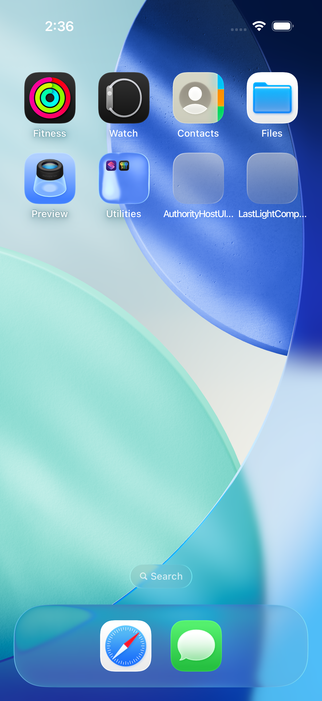</a> | **Actual Home screen before game reactivation** [Actual Home screen before game reactivation_0_AD743106-208F-4A8E-B0B2-1FC0883CF734.png](attachments/670CAA0C-5DC3-4B43-9264-C93422DCB5A9.png) Exported file: <code>670CAA0C-5DC3-4B43-9264-C93422DCB5A9.png</code> 1206 × 2622 px · 2026-09-10T14:36:48.746+00:00 <code>AuthorityHostUITests/testReferenceMatchIn3D()</code> — passed SHA-256: <code>afeb1f956cb87463b7d8759921ae7806ba4a8374a82985d8a86ab2a65b1bd77b</code> [Owner mapping](../provenance/source-map/mapping.json) · [Original case results](../provenance/collection-evidence-summary.json) · [Case companions](companions.md#case-101af43a7bca) Original native authority host attachment; original XCTest case result: Success. Associated by recorded test case, attachment name and timestamp only; no per-screenshot pairing is attested. Retained lifecycle and same-process reentry remain unqualified after the stale-first-ready failure. Five Authority Simulator fixture cases passed, including four reference full matches and secure launch/exit. Secure-default full match, production KMP factory, physical sensors, device Metal and real audio interruption remain unqualified. No clean-native-log or no-crash claim is made. Direct original visual observation: The original shows the actual iOS Home screen, including app icons, Search and the Safari/Messages dock. No game content is displayed. Application-state evidence is retained separately. **Publication review — direct original view:** The original shows the actual iOS Home screen, including app icons, Search and the Safari/Messages dock. No game content is displayed. Application-state evidence is retained separately. |
|  | **Same authority resumed with concealed cards** [Same authority resumed with concealed cards_0_392F5527-50D0-40A1-BF25-80A58138DB89.png](attachments/C1B01AC6-BB94-4CA9-AB17-90546C353328.png) Exported file: <code>C1B01AC6-BB94-4CA9-AB17-90546C353328.png</code> 1206 × 2622 px · 2026-09-10T14:36:50.920+00:00 <code>AuthorityHostUITests/testReferenceMatchIn3D()</code> — passed SHA-256: <code>6bb76e5c3284b8c7bf208639f8c094767275fc09704b007deccd16fffc9ffbd3</code> [Owner mapping](../provenance/source-map/mapping.json) · [Original case results](../provenance/collection-evidence-summary.json) · [Case companions](companions.md#case-101af43a7bca) Original native authority host attachment; original XCTest case result: Success. Associated by recorded test case, attachment name and timestamp only; no per-screenshot pairing is attested. Retained lifecycle and same-process reentry remain unqualified after the stale-first-ready failure. Five Authority Simulator fixture cases passed, including four reference full matches and secure launch/exit. Secure-default full match, production KMP factory, physical sensors, device Metal and real audio interruption remain unqualified. No clean-native-log or no-crash claim is made. Direct original visual observation: The resumed normal-size 3D frame shows five complete card backs and full Show hand and disabled Select cards controls. The table/turn instruction is readable and seat details continue horizontally; no displayed card ranks are exposed. **Publication review — direct original view:** The resumed normal-size 3D frame shows five complete card backs and full Show hand and disabled Select cards controls. The table/turn instruction is readable and seat details continue horizontally; no displayed card ranks are exposed. |
|  | **04 actual viewer play 3d text 1** [04 actual viewer play 3d text 1_0_4326954E-17BE-4FE1-8B68-9E7D49BC33D5.png](attachments/44A408B9-20EA-4EA2-9797-8FB3219CC14F.png) Exported file: <code>44A408B9-20EA-4EA2-9797-8FB3219CC14F.png</code> 1206 × 2622 px · 2026-09-10T14:37:00.506+00:00 <code>AuthorityHostUITests/testReferenceMatchIn3D()</code> — passed SHA-256: <code>b512d857df45f9f3cea492ea5ab3f1524de03083d55937cac2bb53c4b8ec72a3</code> [Owner mapping](../provenance/source-map/mapping.json) · [Original case results](../provenance/collection-evidence-summary.json) · [Case companions](companions.md#case-101af43a7bca) Original native authority host attachment; original XCTest case result: Success. Associated by recorded test case, attachment name and timestamp only; no per-screenshot pairing is attested. Retained lifecycle and same-process reentry remain unqualified after the stale-first-ready failure. Five Authority Simulator fixture cases passed, including four reference full matches and secure launch/exit. Secure-default full match, production KMP factory, physical sensors, device Metal and real audio interruption remain unqualified. No clean-native-log or no-crash claim is made. Direct original visual observation: The normal-size 3D round-1 result includes the complete public Moon proof, Does not match label, Moxie’s named Star challenge, Ari’s first-light result and a complete Next round control. **Publication review — direct original view:** The normal-size 3D round-1 result includes the complete public Moon proof, Does not match label, Moxie’s named Star challenge, Ari’s first-light result and a complete Next round control. |
| <a href="attachments/F79DB5C0-0B46-4FF8-9255-BE6AB5A18203.png">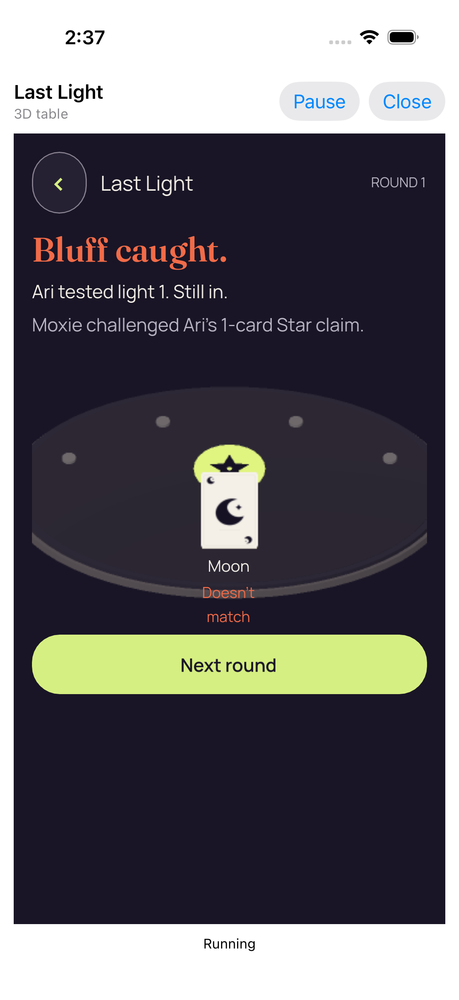</a> | **05 public outcome 3d text 1** [05 public outcome 3d text 1_0_6DB23A88-C8FB-4520-AC0E-FB2E80BADDCB.png](attachments/F79DB5C0-0B46-4FF8-9255-BE6AB5A18203.png) Exported file: <code>F79DB5C0-0B46-4FF8-9255-BE6AB5A18203.png</code> 1206 × 2622 px · 2026-09-10T14:37:00.634+00:00 <code>AuthorityHostUITests/testReferenceMatchIn3D()</code> — passed SHA-256: <code>b512d857df45f9f3cea492ea5ab3f1524de03083d55937cac2bb53c4b8ec72a3</code> [Owner mapping](../provenance/source-map/mapping.json) · [Original case results](../provenance/collection-evidence-summary.json) · [Case companions](companions.md#case-101af43a7bca) Original native authority host attachment; original XCTest case result: Success. Associated by recorded test case, attachment name and timestamp only; no per-screenshot pairing is attested. Retained lifecycle and same-process reentry remain unqualified after the stale-first-ready failure. Five Authority Simulator fixture cases passed, including four reference full matches and secure launch/exit. Secure-default full match, production KMP factory, physical sensors, device Metal and real audio interruption remain unqualified. No clean-native-log or no-crash claim is made. Observation reused from a named byte-identical direct original; this capture was not directly viewed: The normal-size 3D round-1 result includes the complete public Moon proof, Does not match label, Moxie’s named Star challenge, Ari’s first-light result and a complete Next round control. **Publication review — exact match to a directly viewed original in this batch:** The normal-size 3D round-1 result includes the complete public Moon proof, Does not match label, Moxie’s named Star challenge, Ari’s first-light result and a complete Next round control. [Reviewed matching original](attachments/44A408B9-20EA-4EA2-9797-8FB3219CC14F.png); capture context remains separate. |
|  | **06 actual viewer challenge 3d text 1** [06 actual viewer challenge 3d text 1_0_9264320D-D7F8-4B83-846C-0BCF91C78D73.png](attachments/3F494449-095F-4F65-ACF5-422E5151E05A.png) Exported file: <code>3F494449-095F-4F65-ACF5-422E5151E05A.png</code> 1206 × 2622 px · 2026-09-10T14:37:23.262+00:00 <code>AuthorityHostUITests/testReferenceMatchIn3D()</code> — passed SHA-256: <code>596cea74f01e8967e608ffaa185afc619e26029c07bfb7f3ede77b5138f5e086</code> [Owner mapping](../provenance/source-map/mapping.json) · [Original case results](../provenance/collection-evidence-summary.json) · [Case companions](companions.md#case-101af43a7bca) Original native authority host attachment; original XCTest case result: Success. Associated by recorded test case, attachment name and timestamp only; no per-screenshot pairing is attested. Retained lifecycle and same-process reentry remain unqualified after the stale-first-ready failure. Five Authority Simulator fixture cases passed, including four reference full matches and secure launch/exit. Secure-default full match, production KMP factory, physical sensors, device Metal and real audio interruption remain unqualified. No clean-native-log or no-crash claim is made. Direct original visual observation: The normal-size 3D round-4 result shows the complete public Moon proof and Does not match label, Ari’s named Crown challenge, Orbit’s first-light result and a complete Next round control. **Publication review — direct original view:** The normal-size 3D round-4 result shows the complete public Moon proof and Does not match label, Ari’s named Crown challenge, Orbit’s first-light result and a complete Next round control. |
| <a href="attachments/86B9762A-7CD1-4A56-81A8-3EB7816C34FC.png">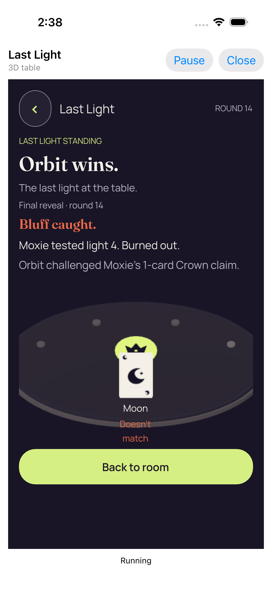</a> | **07 real winner 3d text 1** [07 real winner 3d text 1_0_3D54FF72-3365-4A60-AE3F-6F040DEE83B6.png](attachments/86B9762A-7CD1-4A56-81A8-3EB7816C34FC.png) Exported file: <code>86B9762A-7CD1-4A56-81A8-3EB7816C34FC.png</code> 1206 × 2622 px · 2026-09-10T14:38:11.843+00:00 <code>AuthorityHostUITests/testReferenceMatchIn3D()</code> — passed SHA-256: <code>c95fb197c6c2e5fac9ebbeca8774c981bc6d1b0509f2ad7c75f85f64cc113896</code> [Owner mapping](../provenance/source-map/mapping.json) · [Original case results](../provenance/collection-evidence-summary.json) · [Case companions](companions.md#case-101af43a7bca) Original native authority host attachment; original XCTest case result: Success. Associated by recorded test case, attachment name and timestamp only; no per-screenshot pairing is attested. Retained lifecycle and same-process reentry remain unqualified after the stale-first-ready failure. Five Authority Simulator fixture cases passed, including four reference full matches and secure launch/exit. Secure-default full match, production KMP factory, physical sensors, device Metal and real audio interruption remain unqualified. No clean-native-log or no-crash claim is made. Direct original visual observation: The normal-size 3D winner screen names Orbit and round 14, gives Moxie’s fourth-light burnout and Orbit’s named Crown challenge, and includes the complete public Moon proof and Back to room control. **Publication review — direct original view:** The normal-size 3D winner screen names Orbit and round 14, gives Moxie’s fourth-light burnout and Orbit’s named Crown challenge, and includes the complete public Moon proof and Back to room control. |
|  | **09 table returned through authority 3d text 1** [09 table returned through authority 3d text 1_0_98273B37-52AD-4382-A57A-EFC64277003C.png](attachments/E427C1E7-71F3-4A74-B295-0F5CB4162F19.png) Exported file: <code>E427C1E7-71F3-4A74-B295-0F5CB4162F19.png</code> 1206 × 2622 px · 2026-09-10T14:38:14.118+00:00 <code>AuthorityHostUITests/testReferenceMatchIn3D()</code> — passed SHA-256: <code>6a382dcb885a548ca75d97e998e2cc9e15bc7a38eb93ab88d14751d9de002276</code> [Owner mapping](../provenance/source-map/mapping.json) · [Original case results](../provenance/collection-evidence-summary.json) · [Case companions](companions.md#case-101af43a7bca) Original native authority host attachment; original XCTest case result: Success. Associated by recorded test case, attachment name and timestamp only; no per-screenshot pairing is attested. Retained lifecycle and same-process reentry remain unqualified after the stale-first-ready failure. Five Authority Simulator fixture cases passed, including four reference full matches and secure launch/exit. Secure-default full match, production KMP factory, physical sensors, device Metal and real audio interruption remain unqualified. No clean-native-log or no-crash claim is made. Direct original visual observation: The native 3D Table closed screen shows the full relaunch instruction, Host +1 and Closed status with no renderer content. **Publication review — direct original view:** The native 3D Table closed screen shows the full relaunch instruction, Host +1 and Closed status with no renderer content. |
|  | **Secure default table exited through Godot input** [Secure default table exited through Godot input_0_B3029231-EE55-48CF-BA29-9FF1D3D7DFB2.png](attachments/BE12CB9E-17D2-442E-8497-7A80C871C6C6.png) Exported file: <code>BE12CB9E-17D2-442E-8497-7A80C871C6C6.png</code> 1206 × 2622 px · 2026-09-10T14:38:25.198+00:00 <code>AuthorityHostUITests/testSecureTableRendererExit()</code> — passed SHA-256: <code>1b51e939183903006876dd103fda5e911c24aad7a6570519c5782bbe857e8973</code> [Owner mapping](../provenance/source-map/mapping.json) · [Original case results](../provenance/collection-evidence-summary.json) · [Case companions](companions.md#case-8b7bd25dd96d) Original native authority host attachment; original XCTest case result: Success. Associated by recorded test case, attachment name and timestamp only; no per-screenshot pairing is attested. Retained lifecycle and same-process reentry remain unqualified after the stale-first-ready failure. Five Authority Simulator fixture cases passed, including four reference full matches and secure launch/exit. Secure-default full match, production KMP factory, physical sensors, device Metal and real audio interruption remain unqualified. No clean-native-log or no-crash claim is made. Direct original visual observation: The native 2D Table closed screen is visible after the secure-default exit case, with complete relaunch instruction, Host +1 and Closed status. The image itself does not establish the input route or lifecycle result; those remain in test evidence. **Publication review — direct original view:** The native 2D Table closed screen is visible after the secure-default exit case, with complete relaunch instruction, Host +1 and Closed status. The image itself does not establish the input route or lifecycle result; those remain in test evidence. |
