# iOS retained native host — two passes, one failed wait

[All collections](../../README.md) · [Original CI run](https://github.com/Apdelrahman1911/PartyDeck/actions/runs/34488350932)

Active/dormant background and repeated 2D/3D cases passed; stale-first-ready/close-completion reentry failed its renderer-diagnostics wait. The retained suite remains unqualified.

28 original PNGs and 65 original JSON/TXT companions are staged. Three additional companion identities (one MP4 and two synthesized-event payloads) are source-only references. Original exported UUID filenames, attachment names, case identities and times are preserved.

Exact source: `4f694296b08899176831e7c444c6f8082d40d64b`.

Retained lifecycle and same-process reentry remain unqualified after the stale-first-ready failure. Five Authority Simulator fixture cases passed, including four reference full matches and secure launch/exit. Secure-default full match, production KMP factory, physical sensors, device Metal and real audio interruption remain unqualified. No clean-native-log or no-crash claim is made.

The separate visual-review receipt lists 64 directly viewed originals across both native hosts and nine named exact-byte matches to those originals. All 73 capture identities remain distinct. Publication performs no new image views.

[Original companions by case and time](companions.md) · [Frozen owner summary](../provenance/collection-evidence-summary.json) · [Original visual-review receipt](../provenance/native-visual-review.json)

## Publication visual review

All 28 original capture identities have review coverage: 23 direct original views, 5 exact matches to direct views in this batch. Each capture keeps its original name, source, dimensions, scenario and recorded time. Matching pixels do not transfer runtime outcomes. No derived image was created.

[Completed visual review](../provenance/native-visual-review.json) · [Capture/review binding](../provenance/publication-review/partydeck-gallery-2355-publication-review.json) · [Frozen publication queue](../provenance/publication-queue-v1/queue-freeze.json) · [Original copy mapping](../provenance/publication-queue-v1/copy-paths.tsv) · [Unchanged queue page](../provenance/publication-queue-v1/payload/docs/screenshots/godot-ios-native-34488350932/retained/README.md). The archived queue page retains its original text and relative paths as provenance.

Normal-text 2D first-entry Reveal remains clipped or below the renderer scroll edge. At 200% text, some cards, public proof and continuation/return actions lie outside the captured viewport; the passing authority cases do not establish an unreachable-control defect. The later Running frame does not satisfy the original failed retained-host deadline.

| Original capture | Recorded identity and evidence scope |
| --- | --- |
|  | **Real reveal and card selection** [Real reveal and card selection_0_2A9DA1B1-40A0-4421-BCC1-9328A8E00177.png](attachments/CFDDE82F-81CF-417A-9E0F-F832F9BBCC9D.png) Exported file: <code>CFDDE82F-81CF-417A-9E0F-F832F9BBCC9D.png</code> 1206 × 2622 px · 2026-09-10T14:39:22.826+00:00 <code>RetainedHostUITests/testActiveAndDormantBackgroundTransitionsStayConcealed()</code> — passed SHA-256: <code>95341a3b6c430362d7f93d75a5ca072719fe49a85865f69475f12908cb29702c</code> [Owner mapping](../provenance/source-map/mapping.json) · [Original case results](../provenance/collection-evidence-summary.json) · [Case companions](companions.md#case-52abe6969309) Original native retained host attachment; original XCTest case result: Success. Associated by recorded test case, attachment name and timestamp only; no per-screenshot pairing is attested. Retained lifecycle and same-process reentry remain unqualified after the stale-first-ready failure. Five Authority Simulator fixture cases passed, including four reference full matches and secure launch/exit. Secure-default full match, production KMP factory, physical sensors, device Metal and real audio interruption remain unqualified. No clean-native-log or no-crash claim is made. Direct original visual observation: The selected Moon has a complete bright outline and check badge; two Crown cards and Claim 1 Star fit. Additional hand cards continue horizontally. Native host controls remain visible. **Publication review — direct original view:** The selected Moon has a complete bright outline and check badge; two Crown cards and Claim 1 Star fit. Additional hand cards continue horizontally. Native host controls remain visible. |
| <a href="attachments/BB3046A9-5E84-4497-97D0-5F0CF6D2E01F.png">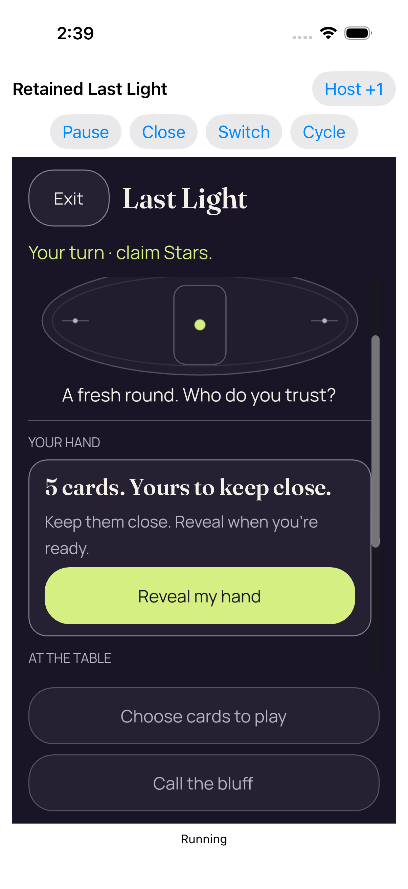</a> | **Coalesced native foreground loss and regain returned concealed** [Coalesced native foreground loss and regain returned concealed_0_F477E9DF-C9E0-4268-8750-3932A7F42EA6.png](attachments/BB3046A9-5E84-4497-97D0-5F0CF6D2E01F.png) Exported file: <code>BB3046A9-5E84-4497-97D0-5F0CF6D2E01F.png</code> 1206 × 2622 px · 2026-09-10T14:39:23.692+00:00 <code>RetainedHostUITests/testActiveAndDormantBackgroundTransitionsStayConcealed()</code> — passed SHA-256: <code>85911e3a9c92fef8ea53d3e59289d8ea8c3c13cf562eb05e35aa9a58fef0729b</code> [Owner mapping](../provenance/source-map/mapping.json) · [Original case results](../provenance/collection-evidence-summary.json) · [Case companions](companions.md#case-52abe6969309) Original native retained host attachment; original XCTest case result: Success. Associated by recorded test case, attachment name and timestamp only; no per-screenshot pairing is attested. Retained lifecycle and same-process reentry remain unqualified after the stale-first-ready failure. Five Authority Simulator fixture cases passed, including four reference full matches and secure launch/exit. Secure-default full match, production KMP factory, physical sensors, device Metal and real audio interruption remain unqualified. No clean-native-log or no-crash claim is made. Direct original visual observation: The table is concealed after foreground loss/regain. The full Reveal my hand button and disabled gameplay actions fit; no private face is visible. This static view does not establish transition ordering. **Publication review — direct original view:** The table is concealed after foreground loss/regain. The full Reveal my hand button and disabled gameplay actions fit; no private face is visible. This static view does not establish transition ordering. |
|  | **Real reveal and card selection** [Real reveal and card selection_0_13E63162-DD9D-44F9-BAD5-74ADED7E674F.png](attachments/382525B2-6B8C-4E32-84EF-CE9BA0F7CE49.png) Exported file: <code>382525B2-6B8C-4E32-84EF-CE9BA0F7CE49.png</code> 1206 × 2622 px · 2026-09-10T14:39:27.846+00:00 <code>RetainedHostUITests/testActiveAndDormantBackgroundTransitionsStayConcealed()</code> — passed SHA-256: <code>95341a3b6c430362d7f93d75a5ca072719fe49a85865f69475f12908cb29702c</code> [Owner mapping](../provenance/source-map/mapping.json) · [Original case results](../provenance/collection-evidence-summary.json) · [Case companions](companions.md#case-52abe6969309) Original native retained host attachment; original XCTest case result: Success. Associated by recorded test case, attachment name and timestamp only; no per-screenshot pairing is attested. Retained lifecycle and same-process reentry remain unqualified after the stale-first-ready failure. Five Authority Simulator fixture cases passed, including four reference full matches and secure launch/exit. Secure-default full match, production KMP factory, physical sensors, device Metal and real audio interruption remain unqualified. No clean-native-log or no-crash claim is made. Observation reused from a named byte-identical direct original; this capture was not directly viewed: The selected Moon has a complete bright outline and check badge; two Crown cards and Claim 1 Star fit. Additional hand cards continue horizontally. Native host controls remain visible. **Publication review — exact match to a directly viewed original in this batch:** The selected Moon has a complete bright outline and check badge; two Crown cards and Claim 1 Star fit. Additional hand cards continue horizontally. Native host controls remain visible. [Reviewed matching original](attachments/CFDDE82F-81CF-417A-9E0F-F832F9BBCC9D.png); capture context remains separate. |
| <a href="attachments/3B521895-B01F-4882-A192-3CCEB450C7D2.png">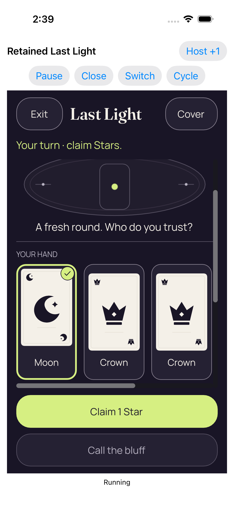</a> | **Real reveal and card selection** [Real reveal and card selection_0_E8451F62-10E4-48AC-A35D-3F01FFF59F42.png](attachments/3B521895-B01F-4882-A192-3CCEB450C7D2.png) Exported file: <code>3B521895-B01F-4882-A192-3CCEB450C7D2.png</code> 1206 × 2622 px · 2026-09-10T14:39:34.990+00:00 <code>RetainedHostUITests/testActiveAndDormantBackgroundTransitionsStayConcealed()</code> — passed SHA-256: <code>95341a3b6c430362d7f93d75a5ca072719fe49a85865f69475f12908cb29702c</code> [Owner mapping](../provenance/source-map/mapping.json) · [Original case results](../provenance/collection-evidence-summary.json) · [Case companions](companions.md#case-52abe6969309) Original native retained host attachment; original XCTest case result: Success. Associated by recorded test case, attachment name and timestamp only; no per-screenshot pairing is attested. Retained lifecycle and same-process reentry remain unqualified after the stale-first-ready failure. Five Authority Simulator fixture cases passed, including four reference full matches and secure launch/exit. Secure-default full match, production KMP factory, physical sensors, device Metal and real audio interruption remain unqualified. No clean-native-log or no-crash claim is made. Observation reused from a named byte-identical direct original; this capture was not directly viewed: The selected Moon has a complete bright outline and check badge; two Crown cards and Claim 1 Star fit. Additional hand cards continue horizontally. Native host controls remain visible. **Publication review — exact match to a directly viewed original in this batch:** The selected Moon has a complete bright outline and check badge; two Crown cards and Claim 1 Star fit. Additional hand cards continue horizontally. Native host controls remain visible. [Reviewed matching original](attachments/CFDDE82F-81CF-417A-9E0F-F832F9BBCC9D.png); capture context remains separate. |
|  | **Actual Home screen** [Actual Home screen_0_AD2733A7-8327-44F4-A389-6702A66F7997.png](attachments/64CCCB44-CBBC-4033-AE03-7CA8F87EF3F9.png) Exported file: <code>64CCCB44-CBBC-4033-AE03-7CA8F87EF3F9.png</code> 1206 × 2622 px · 2026-09-10T14:39:38.593+00:00 <code>RetainedHostUITests/testActiveAndDormantBackgroundTransitionsStayConcealed()</code> — passed SHA-256: <code>c51cc7d61d002aab6e69385c36cfd7cfbf64d8222ab44e6f2c0f0d8cc7b74736</code> [Owner mapping](../provenance/source-map/mapping.json) · [Original case results](../provenance/collection-evidence-summary.json) · [Case companions](companions.md#case-52abe6969309) Original native retained host attachment; original XCTest case result: Success. Associated by recorded test case, attachment name and timestamp only; no per-screenshot pairing is attested. Retained lifecycle and same-process reentry remain unqualified after the stale-first-ready failure. Five Authority Simulator fixture cases passed, including four reference full matches and secure launch/exit. Secure-default full match, production KMP factory, physical sensors, device Metal and real audio interruption remain unqualified. No clean-native-log or no-crash claim is made. Direct original visual observation: The actual iOS Home screen shows the Safari and Messages dock with no game content. Its screenshot is separate from the recorded application-state observation. **Publication review — direct original view:** The actual iOS Home screen shows the Safari and Messages dock with no game content. Its screenshot is separate from the recorded application-state observation. |
| <a href="attachments/BC329A5A-37C6-4588-9F76-FBBC460D1453.png">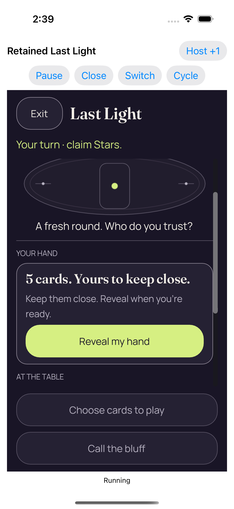</a> | **Real background and resume kept the same authority concealed** [Real background and resume kept the same authority concealed_0_D3F52575-6991-444A-B2C2-C7FB051485D9.png](attachments/BC329A5A-37C6-4588-9F76-FBBC460D1453.png) Exported file: <code>BC329A5A-37C6-4588-9F76-FBBC460D1453.png</code> 1206 × 2622 px · 2026-09-10T14:39:39.785+00:00 <code>RetainedHostUITests/testActiveAndDormantBackgroundTransitionsStayConcealed()</code> — passed SHA-256: <code>79ae64856dc1f22cb0032323a0de75b4d327ac5a087be8516556dfebbe2ac283</code> [Owner mapping](../provenance/source-map/mapping.json) · [Original case results](../provenance/collection-evidence-summary.json) · [Case companions](companions.md#case-52abe6969309) Original native retained host attachment; original XCTest case result: Success. Associated by recorded test case, attachment name and timestamp only; no per-screenshot pairing is attested. Retained lifecycle and same-process reentry remain unqualified after the stale-first-ready failure. Five Authority Simulator fixture cases passed, including four reference full matches and secure launch/exit. Secure-default full match, production KMP factory, physical sensors, device Metal and real audio interruption remain unqualified. No clean-native-log or no-crash claim is made. Direct original visual observation: The resumed table is concealed with the full Reveal my hand button visible. Disabled gameplay actions and native host controls fit; the later static state alone does not qualify transition timing. **Publication review — direct original view:** The resumed table is concealed with the full Reveal my hand button visible. Disabled gameplay actions and native host controls fit; the later static state alone does not qualify transition timing. |
|  | **Whole recipient scene retired; retained services dormant** [Whole recipient scene retired; retained services dormant_0_FD4B6820-4091-436E-BCE7-1D45D7D1912A.png](attachments/7A0356F2-0B0E-49EF-97FE-DD011A3BFC38.png) Exported file: <code>7A0356F2-0B0E-49EF-97FE-DD011A3BFC38.png</code> 1206 × 2622 px · 2026-09-10T14:39:42.045+00:00 <code>RetainedHostUITests/testActiveAndDormantBackgroundTransitionsStayConcealed()</code> — passed SHA-256: <code>dd15fecffef47e4afc1ca7ff73cd8ea3a3e97bc01a87d4bcb135f03b48aba744</code> [Owner mapping](../provenance/source-map/mapping.json) · [Original case results](../provenance/collection-evidence-summary.json) · [Case companions](companions.md#case-52abe6969309) Original native retained host attachment; original XCTest case result: Success. Associated by recorded test case, attachment name and timestamp only; no per-screenshot pairing is attested. Retained lifecycle and same-process reentry remain unqualified after the stale-first-ready failure. Five Authority Simulator fixture cases passed, including four reference full matches and secure launch/exit. Secure-default full match, production KMP factory, physical sensors, device Metal and real audio interruption remain unqualified. No clean-native-log or no-crash claim is made. Direct original visual observation: The native shell shows engine dormant, complete Play in 2D and Play in 3D controls, and no renderer or private card content. **Publication review — direct original view:** The native shell shows engine dormant, complete Play in 2D and Play in 3D controls, and no renderer or private card content. |
| <a href="attachments/16FAC7D9-E61C-445E-9653-15F69849C830.png">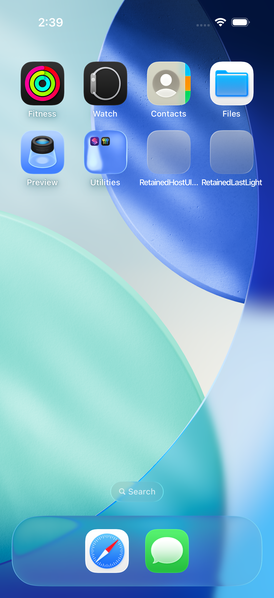</a> | **Actual Home screen** [Actual Home screen_0_48314D87-066C-48E7-A4C4-EAB533A8CFEA.png](attachments/16FAC7D9-E61C-445E-9653-15F69849C830.png) Exported file: <code>16FAC7D9-E61C-445E-9653-15F69849C830.png</code> 1206 × 2622 px · 2026-09-10T14:39:45.206+00:00 <code>RetainedHostUITests/testActiveAndDormantBackgroundTransitionsStayConcealed()</code> — passed SHA-256: <code>c4b197c0f8a450e69c1090c7172ace87d249cec399ce5e9967403bfff3ea74ef</code> [Owner mapping](../provenance/source-map/mapping.json) · [Original case results](../provenance/collection-evidence-summary.json) · [Case companions](companions.md#case-52abe6969309) Original native retained host attachment; original XCTest case result: Success. Associated by recorded test case, attachment name and timestamp only; no per-screenshot pairing is attested. Retained lifecycle and same-process reentry remain unqualified after the stale-first-ready failure. Five Authority Simulator fixture cases passed, including four reference full matches and secure launch/exit. Secure-default full match, production KMP factory, physical sensors, device Metal and real audio interruption remain unqualified. No clean-native-log or no-crash claim is made. Direct original visual observation: A separate actual Home capture shows the Safari and Messages dock and no game content. Capture identity remains distinct from the earlier Home view. **Publication review — direct original view:** A separate actual Home capture shows the Safari and Messages dock and no game content. Capture identity remains distinct from the earlier Home view. |
|  | **Whole recipient scene retired; retained services dormant** [Whole recipient scene retired; retained services dormant_0_FA8B31FB-8631-48AC-83B4-2AA1826A9C35.png](attachments/827A98EA-AC8B-4C6E-9DA8-92E11368B5FC.png) Exported file: <code>827A98EA-AC8B-4C6E-9DA8-92E11368B5FC.png</code> 1206 × 2622 px · 2026-09-10T14:41:41.559+00:00 <code>RetainedHostUITests/testActiveAndDormantBackgroundTransitionsStayConcealed()</code> — passed SHA-256: <code>139e32a4d2b4437da1405ca7f450f47f4bd7433408588856438152f9b0759565</code> [Owner mapping](../provenance/source-map/mapping.json) · [Original case results](../provenance/collection-evidence-summary.json) · [Case companions](companions.md#case-52abe6969309) Original native retained host attachment; original XCTest case result: Success. Associated by recorded test case, attachment name and timestamp only; no per-screenshot pairing is attested. Retained lifecycle and same-process reentry remain unqualified after the stale-first-ready failure. Five Authority Simulator fixture cases passed, including four reference full matches and secure launch/exit. Secure-default full match, production KMP factory, physical sensors, device Metal and real audio interruption remain unqualified. No clean-native-log or no-crash claim is made. Direct original visual observation: After the dormant interval, the native shell still shows engine dormant and both complete presentation choices. No private card content is displayed. **Publication review — direct original view:** After the dormant interval, the native shell still shows engine dormant and both complete presentation choices. No private card content is displayed. |
| <a href="attachments/0663CF6D-3611-4F6E-89EA-60E7F4BD1739.png">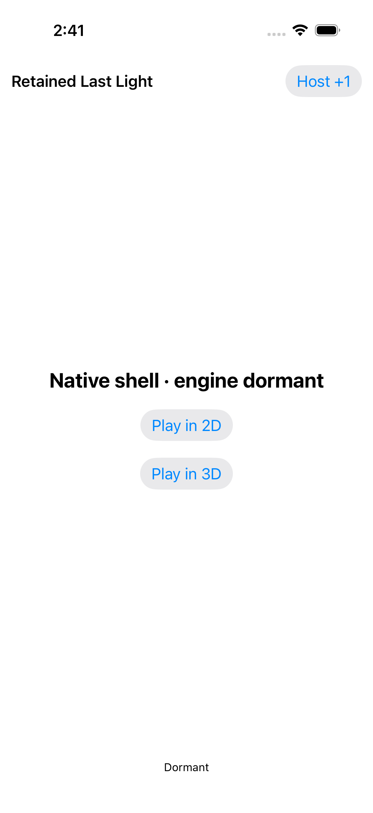</a> | **Dormant application lifecycle did not restart the engine services** [Dormant application lifecycle did not restart the engine services_0_7D034091-2BBE-4CB6-B409-E74C04650A0A.png](attachments/0663CF6D-3611-4F6E-89EA-60E7F4BD1739.png) Exported file: <code>0663CF6D-3611-4F6E-89EA-60E7F4BD1739.png</code> 1206 × 2622 px · 2026-09-10T14:41:41.739+00:00 <code>RetainedHostUITests/testActiveAndDormantBackgroundTransitionsStayConcealed()</code> — passed SHA-256: <code>139e32a4d2b4437da1405ca7f450f47f4bd7433408588856438152f9b0759565</code> [Owner mapping](../provenance/source-map/mapping.json) · [Original case results](../provenance/collection-evidence-summary.json) · [Case companions](companions.md#case-52abe6969309) Original native retained host attachment; original XCTest case result: Success. Associated by recorded test case, attachment name and timestamp only; no per-screenshot pairing is attested. Retained lifecycle and same-process reentry remain unqualified after the stale-first-ready failure. Five Authority Simulator fixture cases passed, including four reference full matches and secure launch/exit. Secure-default full match, production KMP factory, physical sensors, device Metal and real audio interruption remain unqualified. No clean-native-log or no-crash claim is made. Observation reused from a named byte-identical direct original; this capture was not directly viewed: After the dormant interval, the native shell still shows engine dormant and both complete presentation choices. No private card content is displayed. **Publication review — exact match to a directly viewed original in this batch:** After the dormant interval, the native shell still shows engine dormant and both complete presentation choices. No private card content is displayed. [Reviewed matching original](attachments/827A98EA-AC8B-4C6E-9DA8-92E11368B5FC.png); capture context remains separate. |
| <a href="attachments/1BC7D5A6-713B-4B2E-BF56-33BD8F785695.png">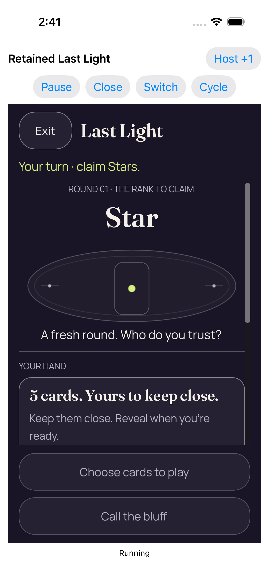</a> | **Entry 1 fresh concealed 2d** [Entry 1 fresh concealed 2d_0_FCE4D414-B6C9-4E37-A1DF-95726D6266A9.png](attachments/1BC7D5A6-713B-4B2E-BF56-33BD8F785695.png) Exported file: <code>1BC7D5A6-713B-4B2E-BF56-33BD8F785695.png</code> 1206 × 2622 px · 2026-09-10T14:41:54.999+00:00 <code>RetainedHostUITests/testRepeated2DAnd3DKeepOneDormantEngine()</code> — passed SHA-256: <code>708d57263280ae8617a0fb0ac6481d4ec37ca737e679b11ff853b7228b63f30a</code> [Owner mapping](../provenance/source-map/mapping.json) · [Original case results](../provenance/collection-evidence-summary.json) · [Case companions](companions.md#case-95ca2d79abd5) Original native retained host attachment; original XCTest case result: Success. Associated by recorded test case, attachment name and timestamp only; no per-screenshot pairing is attested. Retained lifecycle and same-process reentry remain unqualified after the stale-first-ready failure. Five Authority Simulator fixture cases passed, including four reference full matches and secure launch/exit. Secure-default full match, production KMP factory, physical sensors, device Metal and real audio interruption remain unqualified. No clean-native-log or no-crash claim is made. Direct original visual observation: The initial concealed 2D table displays turn, Star rank and the hand explanation, but Reveal is below the central scroll edge and is not visible. Fixed disabled gameplay actions fit. **Publication review — direct original view:** The initial concealed 2D table displays turn, Star rank and the hand explanation, but Reveal is below the central scroll edge and is not visible. Fixed disabled gameplay actions fit. |
|  | **Real reveal and card selection** [Real reveal and card selection_0_1017DD7B-920A-481A-BEAE-B7B951E64E31.png](attachments/B25978A6-7D0E-41CE-A80C-B71D55501348.png) Exported file: <code>B25978A6-7D0E-41CE-A80C-B71D55501348.png</code> 1206 × 2622 px · 2026-09-10T14:42:03.871+00:00 <code>RetainedHostUITests/testRepeated2DAnd3DKeepOneDormantEngine()</code> — passed SHA-256: <code>f02c23261d6e30154dcbed6cd511f1f3c5dada9ebc2745158e4a2f6aba6f22d1</code> [Owner mapping](../provenance/source-map/mapping.json) · [Original case results](../provenance/collection-evidence-summary.json) · [Case companions](companions.md#case-95ca2d79abd5) Original native retained host attachment; original XCTest case result: Success. Associated by recorded test case, attachment name and timestamp only; no per-screenshot pairing is attested. Retained lifecycle and same-process reentry remain unqualified after the stale-first-ready failure. Five Authority Simulator fixture cases passed, including four reference full matches and secure launch/exit. Secure-default full match, production KMP factory, physical sensors, device Metal and real audio interruption remain unqualified. No clean-native-log or no-crash claim is made. Direct original visual observation: The scrolled 2D hand shows the selected Moon with a clear outline/check and two complete Crown cards. Claim 1 Star fits; additional cards continue horizontally. **Publication review — direct original view:** The scrolled 2D hand shows the selected Moon with a clear outline/check and two complete Crown cards. Claim 1 Star fits; additional cards continue horizontally. |
| <a href="attachments/63F813CC-4FA7-4C30-BC8B-9F2F2A8FB30D.png">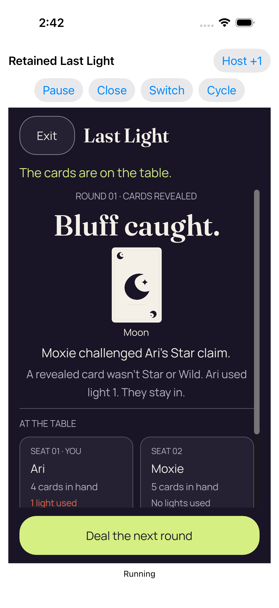</a> | **Real play accepted by the Kotlin authority** [Real play accepted by the Kotlin authority_0_AAC65B2B-8BD0-4C3C-86F8-179F6E781FD9.png](attachments/63F813CC-4FA7-4C30-BC8B-9F2F2A8FB30D.png) Exported file: <code>63F813CC-4FA7-4C30-BC8B-9F2F2A8FB30D.png</code> 1206 × 2622 px · 2026-09-10T14:42:07.530+00:00 <code>RetainedHostUITests/testRepeated2DAnd3DKeepOneDormantEngine()</code> — passed SHA-256: <code>ec7aedc8787beaaac1e1679302a7c0adbee13020f4abb3e2dbe20c3a95b518af</code> [Owner mapping](../provenance/source-map/mapping.json) · [Original case results](../provenance/collection-evidence-summary.json) · [Case companions](companions.md#case-95ca2d79abd5) Original native retained host attachment; original XCTest case result: Success. Associated by recorded test case, attachment name and timestamp only; no per-screenshot pairing is attested. Retained lifecycle and same-process reentry remain unqualified after the stale-first-ready failure. Five Authority Simulator fixture cases passed, including four reference full matches and secure launch/exit. Secure-default full match, production KMP factory, physical sensors, device Metal and real audio interruption remain unqualified. No clean-native-log or no-crash claim is made. Direct original visual observation: The 2D result names Moxie challenging Ari, shows the Moon proof and explains the spent light. Deal the next round is complete; the seat cards are cut by the scroll boundary. **Publication review — direct original view:** The 2D result names Moxie challenging Ari, shows the Moon proof and explains the spent light. Deal the next round is complete; the seat cards are cut by the scroll boundary. |
| <a href="attachments/94B908BF-AFA2-4D1A-B95A-AAC3EE0573AA.png">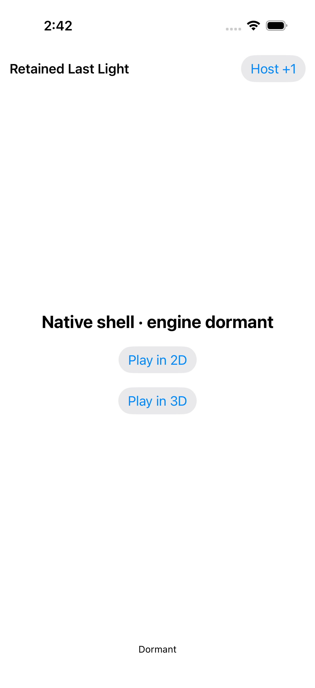</a> | **Whole recipient scene retired; retained services dormant** [Whole recipient scene retired; retained services dormant_0_DD896052-F604-44F1-85DD-0092155D5E86.png](attachments/94B908BF-AFA2-4D1A-B95A-AAC3EE0573AA.png) Exported file: <code>94B908BF-AFA2-4D1A-B95A-AAC3EE0573AA.png</code> 1206 × 2622 px · 2026-09-10T14:42:11.113+00:00 <code>RetainedHostUITests/testRepeated2DAnd3DKeepOneDormantEngine()</code> — passed SHA-256: <code>c8ccc4b79484d1cf4b80591ad79a657caa0dfc13a01855107526dcec1718f125</code> [Owner mapping](../provenance/source-map/mapping.json) · [Original case results](../provenance/collection-evidence-summary.json) · [Case companions](companions.md#case-95ca2d79abd5) Original native retained host attachment; original XCTest case result: Success. Associated by recorded test case, attachment name and timestamp only; no per-screenshot pairing is attested. Retained lifecycle and same-process reentry remain unqualified after the stale-first-ready failure. Five Authority Simulator fixture cases passed, including four reference full matches and secure launch/exit. Secure-default full match, production KMP factory, physical sensors, device Metal and real audio interruption remain unqualified. No clean-native-log or no-crash claim is made. Direct original visual observation: The post-entry native shell shows engine dormant with both presentation choices complete and no game content. **Publication review — direct original view:** The post-entry native shell shows engine dormant with both presentation choices complete and no game content. |
|  | **Entry 2 fresh concealed 3d** [Entry 2 fresh concealed 3d_0_4BFFD11D-9240-46C2-A676-C3EC53D39504.png](attachments/9185F0DC-622A-480D-822E-5C791EE026DB.png) Exported file: <code>9185F0DC-622A-480D-822E-5C791EE026DB.png</code> 1206 × 2622 px · 2026-09-10T14:42:49.649+00:00 <code>RetainedHostUITests/testRepeated2DAnd3DKeepOneDormantEngine()</code> — passed SHA-256: <code>7a269d8b40829b4fd98c1c8d622df93f950fd5bbb2f38f3014a71c1c7805a4ed</code> [Owner mapping](../provenance/source-map/mapping.json) · [Original case results](../provenance/collection-evidence-summary.json) · [Case companions](companions.md#case-95ca2d79abd5) Original native retained host attachment; original XCTest case result: Success. Associated by recorded test case, attachment name and timestamp only; no per-screenshot pairing is attested. Retained lifecycle and same-process reentry remain unqualified after the stale-first-ready failure. Five Authority Simulator fixture cases passed, including four reference full matches and secure launch/exit. Secure-default full match, production KMP factory, physical sensors, device Metal and real audio interruption remain unqualified. No clean-native-log or no-crash claim is made. Direct original visual observation: The fresh 3D view shows five complete backs, readable Star turn context, Show hand and disabled Select cards. Seat content continues horizontally; the visible Old handle control does not itself establish a probe result. **Publication review — direct original view:** The fresh 3D view shows five complete backs, readable Star turn context, Show hand and disabled Select cards. Seat content continues horizontally; the visible Old handle control does not itself establish a probe result. |
|  | **Real reveal and card selection** [Real reveal and card selection_0_8244B0CB-5DC7-406D-B85F-51D4034F187B.png](attachments/5EA48281-2595-49FA-814A-612BB25C9EA5.png) Exported file: <code>5EA48281-2595-49FA-814A-612BB25C9EA5.png</code> 1206 × 2622 px · 2026-09-10T14:43:34.883+00:00 <code>RetainedHostUITests/testRepeated2DAnd3DKeepOneDormantEngine()</code> — passed SHA-256: <code>43628aeb4fdb848897a6417c94d6b71d7e440e1fe2c1cbeaf75fbbb67c7f00bf</code> [Owner mapping](../provenance/source-map/mapping.json) · [Original case results](../provenance/collection-evidence-summary.json) · [Case companions](companions.md#case-95ca2d79abd5) Original native retained host attachment; original XCTest case result: Success. Associated by recorded test case, attachment name and timestamp only; no per-screenshot pairing is attested. Retained lifecycle and same-process reentry remain unqualified after the stale-first-ready failure. Five Authority Simulator fixture cases passed, including four reference full matches and secure launch/exit. Secure-default full match, production KMP factory, physical sensors, device Metal and real audio interruption remain unqualified. No clean-native-log or no-crash claim is made. Direct original visual observation: All five 3D faces and labels are visible; the selected Moon has a bright outline/check. Hide hand, turn context and Play 1 fit, while the seat row continues horizontally. **Publication review — direct original view:** All five 3D faces and labels are visible; the selected Moon has a bright outline/check. Hide hand, turn context and Play 1 fit, while the seat row continues horizontally. |
| <a href="attachments/96395ECA-9093-458E-8AC3-B0DCAA1E7DBF.png">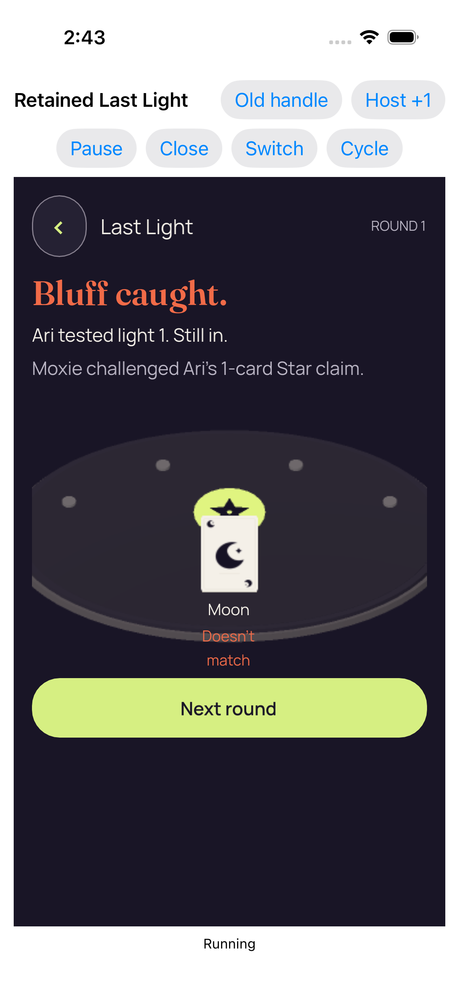</a> | **Real play accepted by the Kotlin authority** [Real play accepted by the Kotlin authority_0_3A88B0E3-D2BC-4D08-AEAE-68AC6F9DB6F1.png](attachments/96395ECA-9093-458E-8AC3-B0DCAA1E7DBF.png) Exported file: <code>96395ECA-9093-458E-8AC3-B0DCAA1E7DBF.png</code> 1206 × 2622 px · 2026-09-10T14:43:58.979+00:00 <code>RetainedHostUITests/testRepeated2DAnd3DKeepOneDormantEngine()</code> — passed SHA-256: <code>2d5fdc23b059d7bb8a38de1cb50507f1ac787b34fb5d60a99dfe4d8eb513b2c6</code> [Owner mapping](../provenance/source-map/mapping.json) · [Original case results](../provenance/collection-evidence-summary.json) · [Case companions](companions.md#case-95ca2d79abd5) Original native retained host attachment; original XCTest case result: Success. Associated by recorded test case, attachment name and timestamp only; no per-screenshot pairing is attested. Retained lifecycle and same-process reentry remain unqualified after the stale-first-ready failure. Five Authority Simulator fixture cases passed, including four reference full matches and secure launch/exit. Secure-default full match, production KMP factory, physical sensors, device Metal and real audio interruption remain unqualified. No clean-native-log or no-crash claim is made. Direct original visual observation: The 3D public result names Moxie and Ari, shows the Moon mismatch and spent-light explanation, and leaves Next round fully visible. **Publication review — direct original view:** The 3D public result names Moxie and Ari, shows the Moon mismatch and spent-light explanation, and leaves Next round fully visible. |
|  | **Whole recipient scene retired; retained services dormant** [Whole recipient scene retired; retained services dormant_0_FA0A19D5-5B30-4196-B212-03663119D8C6.png](attachments/70944E92-DCFA-4B78-B2FE-4F78190486DD.png) Exported file: <code>70944E92-DCFA-4B78-B2FE-4F78190486DD.png</code> 1206 × 2622 px · 2026-09-10T14:44:04.587+00:00 <code>RetainedHostUITests/testRepeated2DAnd3DKeepOneDormantEngine()</code> — passed SHA-256: <code>0b97047db5582f1f80a95a1707187795ca4668d794624246ae3c5f6cd97dd4ac</code> [Owner mapping](../provenance/source-map/mapping.json) · [Original case results](../provenance/collection-evidence-summary.json) · [Case companions](companions.md#case-95ca2d79abd5) Original native retained host attachment; original XCTest case result: Success. Associated by recorded test case, attachment name and timestamp only; no per-screenshot pairing is attested. Retained lifecycle and same-process reentry remain unqualified after the stale-first-ready failure. Five Authority Simulator fixture cases passed, including four reference full matches and secure launch/exit. Secure-default full match, production KMP factory, physical sensors, device Metal and real audio interruption remain unqualified. No clean-native-log or no-crash claim is made. Direct original visual observation: The native shell again displays engine dormant and both complete presentation choices, with no renderer content. **Publication review — direct original view:** The native shell again displays engine dormant and both complete presentation choices, with no renderer content. |
| <a href="attachments/451C630B-07BD-449E-B46F-88670CBD6D14.png">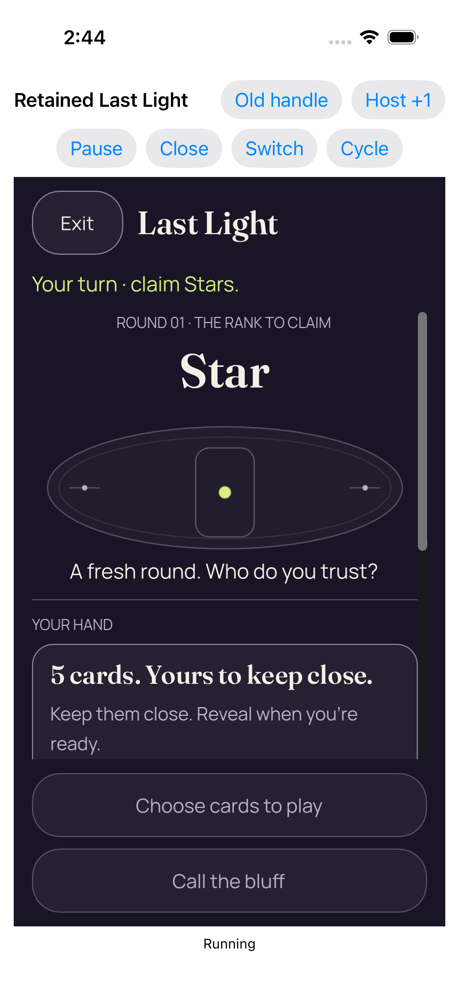</a> | **Entry 3 fresh concealed 2d** [Entry 3 fresh concealed 2d_0_8C91C6D5-158A-4491-A383-4D69A87DF4AA.png](attachments/451C630B-07BD-449E-B46F-88670CBD6D14.png) Exported file: <code>451C630B-07BD-449E-B46F-88670CBD6D14.png</code> 1206 × 2622 px · 2026-09-10T14:44:08.228+00:00 <code>RetainedHostUITests/testRepeated2DAnd3DKeepOneDormantEngine()</code> — passed SHA-256: <code>5d4b4b159a3da5d8152a34259cfc6fcf5cbadca604a65aa2f8f2009fcd0da0b4</code> [Owner mapping](../provenance/source-map/mapping.json) · [Original case results](../provenance/collection-evidence-summary.json) · [Case companions](companions.md#case-95ca2d79abd5) Original native retained host attachment; original XCTest case result: Success. Associated by recorded test case, attachment name and timestamp only; no per-screenshot pairing is attested. Retained lifecycle and same-process reentry remain unqualified after the stale-first-ready failure. Five Authority Simulator fixture cases passed, including four reference full matches and secure launch/exit. Secure-default full match, production KMP factory, physical sensors, device Metal and real audio interruption remain unqualified. No clean-native-log or no-crash claim is made. Direct original visual observation: The third entry is concealed in 2D. Turn and Star rank fit, but the Reveal button remains below the central scroll edge; the fixed disabled actions are complete. **Publication review — direct original view:** The third entry is concealed in 2D. Turn and Star rank fit, but the Reveal button remains below the central scroll edge; the fixed disabled actions are complete. |
| <a href="attachments/E6257ADA-B3BB-4A3D-A07D-C52B551C7931.png">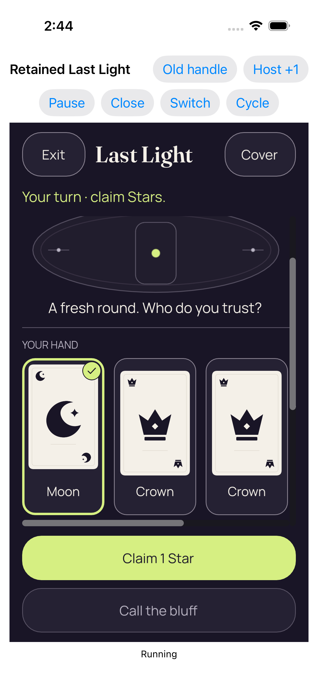</a> | **Real reveal and card selection** [Real reveal and card selection_0_836843C5-A26C-46F8-8800-C6AD70AC2D8F.png](attachments/E6257ADA-B3BB-4A3D-A07D-C52B551C7931.png) Exported file: <code>E6257ADA-B3BB-4A3D-A07D-C52B551C7931.png</code> 1206 × 2622 px · 2026-09-10T14:44:16.121+00:00 <code>RetainedHostUITests/testRepeated2DAnd3DKeepOneDormantEngine()</code> — passed SHA-256: <code>31e8444d2290b527c47716bed02ba454f585738f65fed13665361a5c2021f322</code> [Owner mapping](../provenance/source-map/mapping.json) · [Original case results](../provenance/collection-evidence-summary.json) · [Case companions](companions.md#case-95ca2d79abd5) Original native retained host attachment; original XCTest case result: Success. Associated by recorded test case, attachment name and timestamp only; no per-screenshot pairing is attested. Retained lifecycle and same-process reentry remain unqualified after the stale-first-ready failure. Five Authority Simulator fixture cases passed, including four reference full matches and secure launch/exit. Secure-default full match, production KMP factory, physical sensors, device Metal and real audio interruption remain unqualified. No clean-native-log or no-crash claim is made. Direct original visual observation: After scrolling the third-entry hand, the selected Moon and two Crown cards fit, with a clear check badge and complete Claim 1 Star action. More cards continue horizontally. **Publication review — direct original view:** After scrolling the third-entry hand, the selected Moon and two Crown cards fit, with a clear check badge and complete Claim 1 Star action. More cards continue horizontally. |
| <a href="attachments/76FA5310-A118-48CC-ADEC-F656129AA288.png">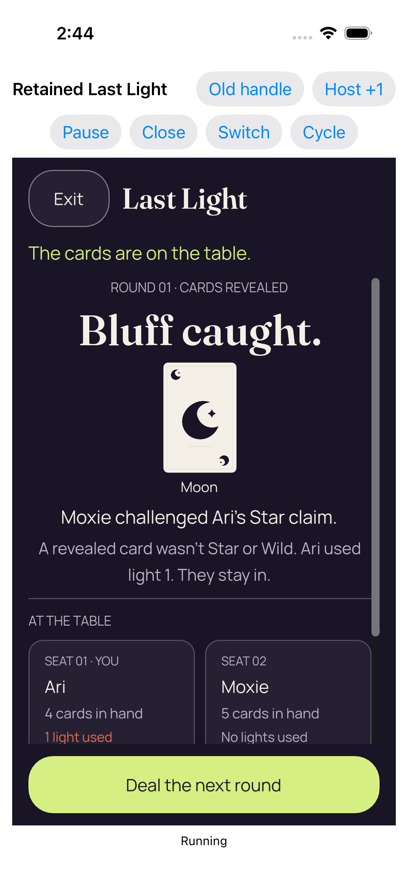</a> | **Real play accepted by the Kotlin authority** [Real play accepted by the Kotlin authority_0_B8266E85-5629-4F1D-ACF4-E4CC01ECC1A0.png](attachments/76FA5310-A118-48CC-ADEC-F656129AA288.png) Exported file: <code>76FA5310-A118-48CC-ADEC-F656129AA288.png</code> 1206 × 2622 px · 2026-09-10T14:44:18.625+00:00 <code>RetainedHostUITests/testRepeated2DAnd3DKeepOneDormantEngine()</code> — passed SHA-256: <code>2c4c190ec1758bdab705514cf838a821774533676c6cc298b14e432cacd6b5a8</code> [Owner mapping](../provenance/source-map/mapping.json) · [Original case results](../provenance/collection-evidence-summary.json) · [Case companions](companions.md#case-95ca2d79abd5) Original native retained host attachment; original XCTest case result: Success. Associated by recorded test case, attachment name and timestamp only; no per-screenshot pairing is attested. Retained lifecycle and same-process reentry remain unqualified after the stale-first-ready failure. Five Authority Simulator fixture cases passed, including four reference full matches and secure launch/exit. Secure-default full match, production KMP factory, physical sensors, device Metal and real audio interruption remain unqualified. No clean-native-log or no-crash claim is made. Direct original visual observation: The third-entry 2D outcome shows the complete Moon proof, named challenge, spent-light explanation and next-round action. Lower seat-card content remains clipped by the scroll area. **Publication review — direct original view:** The third-entry 2D outcome shows the complete Moon proof, named challenge, spent-light explanation and next-round action. Lower seat-card content remains clipped by the scroll area. |
|  | **Whole recipient scene retired; retained services dormant** [Whole recipient scene retired; retained services dormant_0_B463681F-90FA-41E4-8871-3F0A1B28C144.png](attachments/0D01F069-AB3C-4E6A-A1A0-37FF93587478.png) Exported file: <code>0D01F069-AB3C-4E6A-A1A0-37FF93587478.png</code> 1206 × 2622 px · 2026-09-10T14:44:23.223+00:00 <code>RetainedHostUITests/testRepeated2DAnd3DKeepOneDormantEngine()</code> — passed SHA-256: <code>0b97047db5582f1f80a95a1707187795ca4668d794624246ae3c5f6cd97dd4ac</code> [Owner mapping](../provenance/source-map/mapping.json) · [Original case results](../provenance/collection-evidence-summary.json) · [Case companions](companions.md#case-95ca2d79abd5) Original native retained host attachment; original XCTest case result: Success. Associated by recorded test case, attachment name and timestamp only; no per-screenshot pairing is attested. Retained lifecycle and same-process reentry remain unqualified after the stale-first-ready failure. Five Authority Simulator fixture cases passed, including four reference full matches and secure launch/exit. Secure-default full match, production KMP factory, physical sensors, device Metal and real audio interruption remain unqualified. No clean-native-log or no-crash claim is made. Observation reused from a named byte-identical direct original; this capture was not directly viewed: The native shell again displays engine dormant and both complete presentation choices, with no renderer content. **Publication review — exact match to a directly viewed original in this batch:** The native shell again displays engine dormant and both complete presentation choices, with no renderer content. [Reviewed matching original](attachments/70944E92-DCFA-4B78-B2FE-4F78190486DD.png); capture context remains separate. |
|  | **Entry 4 fresh concealed 3d** [Entry 4 fresh concealed 3d_0_D46F4930-64CE-4FEA-87E6-4C45A363E71F.png](attachments/C093E1FC-CFB9-47FD-84F3-FF19741876BC.png) Exported file: <code>C093E1FC-CFB9-47FD-84F3-FF19741876BC.png</code> 1206 × 2622 px · 2026-09-10T14:44:52.848+00:00 <code>RetainedHostUITests/testRepeated2DAnd3DKeepOneDormantEngine()</code> — passed SHA-256: <code>85a69df7db5b43e458ea8ca5c9422dd65609ee8751ba9618861c688919fa8c6d</code> [Owner mapping](../provenance/source-map/mapping.json) · [Original case results](../provenance/collection-evidence-summary.json) · [Case companions](companions.md#case-95ca2d79abd5) Original native retained host attachment; original XCTest case result: Success. Associated by recorded test case, attachment name and timestamp only; no per-screenshot pairing is attested. Retained lifecycle and same-process reentry remain unqualified after the stale-first-ready failure. Five Authority Simulator fixture cases passed, including four reference full matches and secure launch/exit. Secure-default full match, production KMP factory, physical sensors, device Metal and real audio interruption remain unqualified. No clean-native-log or no-crash claim is made. Direct original visual observation: The fourth entry is a concealed 3D table with all five backs complete. Show hand, Star turn context and disabled Select cards fit; the seat row continues horizontally. **Publication review — direct original view:** The fourth entry is a concealed 3D table with all five backs complete. Show hand, Star turn context and disabled Select cards fit; the seat row continues horizontally. |
| <a href="attachments/37F726A0-2D19-41F4-98EF-BABAAA8912C8.png">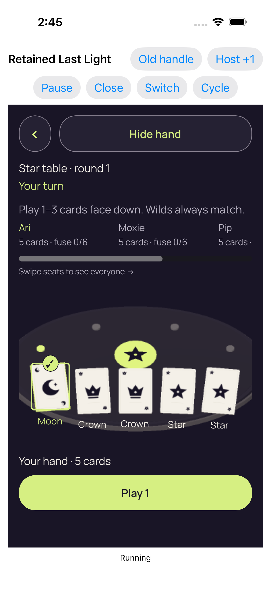</a> | **Real reveal and card selection** [Real reveal and card selection_0_02F8D7B3-079F-46BE-89AB-BE96692E09E6.png](attachments/37F726A0-2D19-41F4-98EF-BABAAA8912C8.png) Exported file: <code>37F726A0-2D19-41F4-98EF-BABAAA8912C8.png</code> 1206 × 2622 px · 2026-09-10T14:45:17.772+00:00 <code>RetainedHostUITests/testRepeated2DAnd3DKeepOneDormantEngine()</code> — passed SHA-256: <code>63a6fd6e660036b6d85e00e2129e6dac7f54f8e94bf60923eec4ba840cc1a0a1</code> [Owner mapping](../provenance/source-map/mapping.json) · [Original case results](../provenance/collection-evidence-summary.json) · [Case companions](companions.md#case-95ca2d79abd5) Original native retained host attachment; original XCTest case result: Success. Associated by recorded test case, attachment name and timestamp only; no per-screenshot pairing is attested. Retained lifecycle and same-process reentry remain unqualified after the stale-first-ready failure. Five Authority Simulator fixture cases passed, including four reference full matches and secure launch/exit. Secure-default full match, production KMP factory, physical sensors, device Metal and real audio interruption remain unqualified. No clean-native-log or no-crash claim is made. Direct original visual observation: The fourth-entry 3D hand shows five readable labels, a selected Moon outline/check and a complete Play 1 action. Native controls and Hide hand remain visible. **Publication review — direct original view:** The fourth-entry 3D hand shows five readable labels, a selected Moon outline/check and a complete Play 1 action. Native controls and Hide hand remain visible. |
|  | **Real play accepted by the Kotlin authority** [Real play accepted by the Kotlin authority_0_DEE413FE-90EB-4DAB-9DF3-28A12158783E.png](attachments/AC0F1A71-4724-4B8E-B546-80E3B6B0DA4E.png) Exported file: <code>AC0F1A71-4724-4B8E-B546-80E3B6B0DA4E.png</code> 1206 × 2622 px · 2026-09-10T14:45:26.417+00:00 <code>RetainedHostUITests/testRepeated2DAnd3DKeepOneDormantEngine()</code> — passed SHA-256: <code>9a9b912a889646b5f5233720c642c2b412cefd091ded0a19d6fd5d32e9e964f1</code> [Owner mapping](../provenance/source-map/mapping.json) · [Original case results](../provenance/collection-evidence-summary.json) · [Case companions](companions.md#case-95ca2d79abd5) Original native retained host attachment; original XCTest case result: Success. Associated by recorded test case, attachment name and timestamp only; no per-screenshot pairing is attested. Retained lifecycle and same-process reentry remain unqualified after the stale-first-ready failure. Five Authority Simulator fixture cases passed, including four reference full matches and secure launch/exit. Secure-default full match, production KMP factory, physical sensors, device Metal and real audio interruption remain unqualified. No clean-native-log or no-crash claim is made. Direct original visual observation: The fourth-entry 3D outcome displays the named challenge, spent-light explanation, public Moon mismatch and complete Next round action. **Publication review — direct original view:** The fourth-entry 3D outcome displays the named challenge, spent-light explanation, public Moon mismatch and complete Next round action. |
|  | **Whole recipient scene retired; retained services dormant** [Whole recipient scene retired; retained services dormant_0_886D7969-F908-4787-8BAA-C6CCE446E2E0.png](attachments/DFCD5D60-7F51-495D-A6F3-D971BF41140D.png) Exported file: <code>DFCD5D60-7F51-495D-A6F3-D971BF41140D.png</code> 1206 × 2622 px · 2026-09-10T14:45:29.207+00:00 <code>RetainedHostUITests/testRepeated2DAnd3DKeepOneDormantEngine()</code> — passed SHA-256: <code>b6780cdc607bae8fee92f6f9eaad4fabe638f44a2fe722d3a74547700465230e</code> [Owner mapping](../provenance/source-map/mapping.json) · [Original case results](../provenance/collection-evidence-summary.json) · [Case companions](companions.md#case-95ca2d79abd5) Original native retained host attachment; original XCTest case result: Success. Associated by recorded test case, attachment name and timestamp only; no per-screenshot pairing is attested. Retained lifecycle and same-process reentry remain unqualified after the stale-first-ready failure. Five Authority Simulator fixture cases passed, including four reference full matches and secure launch/exit. Secure-default full match, production KMP factory, physical sensors, device Metal and real audio interruption remain unqualified. No clean-native-log or no-crash claim is made. Direct original visual observation: The final fourth-entry shell displays engine dormant and both complete presentation choices; no renderer or private content remains visible. **Publication review — direct original view:** The final fourth-entry shell displays engine dormant and both complete presentation choices; no renderer or private content remains visible. |
|  | **Four completed real entries in one retained engine process** [Four completed real entries in one retained engine process_0_FB363F2F-E665-4C8B-A23B-1694EC030858.png](attachments/7F9389FD-5405-4350-AAAF-37AF478412ED.png) Exported file: <code>7F9389FD-5405-4350-AAAF-37AF478412ED.png</code> 1206 × 2622 px · 2026-09-10T14:45:30.094+00:00 <code>RetainedHostUITests/testRepeated2DAnd3DKeepOneDormantEngine()</code> — passed SHA-256: <code>b6780cdc607bae8fee92f6f9eaad4fabe638f44a2fe722d3a74547700465230e</code> [Owner mapping](../provenance/source-map/mapping.json) · [Original case results](../provenance/collection-evidence-summary.json) · [Case companions](companions.md#case-95ca2d79abd5) Original native retained host attachment; original XCTest case result: Success. Associated by recorded test case, attachment name and timestamp only; no per-screenshot pairing is attested. Retained lifecycle and same-process reentry remain unqualified after the stale-first-ready failure. Five Authority Simulator fixture cases passed, including four reference full matches and secure launch/exit. Secure-default full match, production KMP factory, physical sensors, device Metal and real audio interruption remain unqualified. No clean-native-log or no-crash claim is made. Observation reused from a named byte-identical direct original; this capture was not directly viewed: The final fourth-entry shell displays engine dormant and both complete presentation choices; no renderer or private content remains visible. **Publication review — exact match to a directly viewed original in this batch:** The final fourth-entry shell displays engine dormant and both complete presentation choices; no renderer or private content remains visible. [Reviewed matching original](attachments/DFCD5D60-7F51-495D-A6F3-D971BF41140D.png); capture context remains separate. |
| <a href="attachments/D52E7232-7A25-4216-9FFE-B7A6252B0E65.png">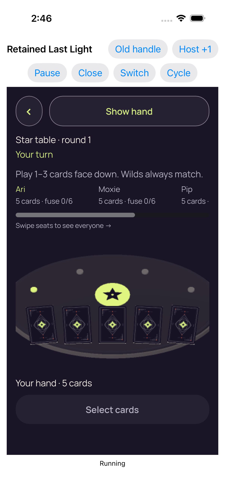</a> | **Failed retained observation** [Failed retained observation_0_AF7751B1-5209-40CF-BB02-F9DD3A746726.png](attachments/D52E7232-7A25-4216-9FFE-B7A6252B0E65.png) Exported file: <code>D52E7232-7A25-4216-9FFE-B7A6252B0E65.png</code> 1206 × 2622 px · 2026-09-10T14:46:14.320+00:00 <code>RetainedHostUITests/testStaleFirstReadyAndCloseCompletionReentry()</code> — failed SHA-256: <code>2100a200df0dbc5f856ccbd2316e7bc02295dd0cbb09b410cc1c6cfc3525d169</code> [Owner mapping](../provenance/source-map/mapping.json) · [Original case results](../provenance/collection-evidence-summary.json) · [Case companions](companions.md#case-7c3ee2e6c45f) Original native retained host attachment; original XCTest case result: Failure. Associated by recorded test case, attachment name and timestamp only; no per-screenshot pairing is attested. Retained lifecycle and same-process reentry remain unqualified after the stale-first-ready failure. Five Authority Simulator fixture cases passed, including four reference full matches and secure launch/exit. Secure-default full match, production KMP factory, physical sensors, device Metal and real audio interruption remain unqualified. No clean-native-log or no-crash claim is made. failed - Observe current renderer diagnostics for the retained presentation. Direct original visual observation: The failure attachment later shows a Running concealed 3D table with five backs, Show hand and disabled Select cards. This later view does not satisfy the earlier failed renderer-diagnostics deadline; Old handle visibility is not a probe result. **Publication review — direct original view:** The failure attachment later shows a Running concealed 3D table with five backs, Show hand and disabled Select cards. This later view does not satisfy the earlier failed renderer-diagnostics deadline; Old handle visibility is not a probe result. |
