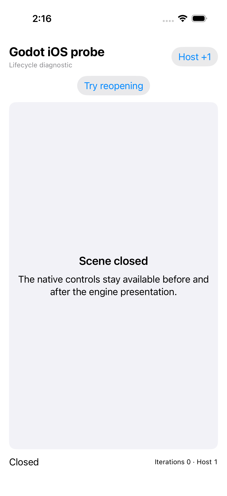
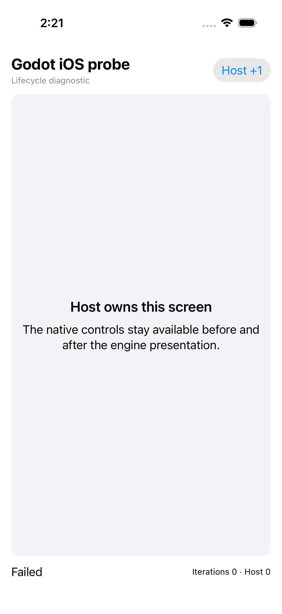

# Godot iOS probe — cancellation pass and initialization failure

[All screenshot collections](../README.md) · [CI run 34428221586](https://github.com/Apdelrahman1911/PartyDeck/actions/runs/34428221586)

**Evidence status:** One test passes by cancelling before engine construction; four tests fail. The two exported PNGs show the native diagnostic host. Neither shows a rendered game. Native Godot rendering, gameplay, KMP factory integration and full lifecycle qualification remain unestablished.

Exact CI revision: `a04f22be8623bec9fbf38d4e74d8f96a94ebb225`. The [original simulator metadata](evidence/simulator.json) identifies an iPhone 17 with iOS runtime 26.4.1; [Xcode version](evidence/xcode-version.log) and [SDK inventory](evidence/xcode-sdks.log) are retained. Each original PNG is 1206 × 2622 pixels. Text scale was not recorded. This is simulator evidence, with no physical-device claim.

The [original host test log](evidence/host-test.log) records five executed test cases: one pass and four failures, ending with `TEST FAILED`. Trailing empty test-suite summaries do not override those outcomes. The [original attachment manifest](attachments/manifest.json) maps each UUID filename to its test, name, device and timestamp. Both PNGs carry `isAssociatedWithFailure=false`; this attachment flag does not establish test success.

The screenshot named **Diagnostic rendering** visibly says **Failed** and **Iterations 0 · Host 0**. Its paired measurements record `INITIALIZATION_FAILED_BEFORE_SAFE_CLEANUP`, `quarantined=true`, `setup2Succeeded=false`, an OS singleton still present and zero draw calls, Ready events and iterations. The passing cancellation has bootstrap count 0, no OS singleton, host counter 1 and restored idle-timer policy. It proves that specific cancellation path only.

The CI reviewer’s [startup excerpts](provenance/startup-failure-excerpts.log) preserve four app-log rejections: the host passes `--path`, but the engine was built without path-override support. This fails before setup2. The [downloaded-artifact audit](provenance/evidence-summary.json) records the decoded xcresult source path and full app-log SHA-256; its excerpts and summary are later review products, not original test-runner reports. The full source app log was independently hash-checked, and all four rejection lines were checked against it. Original [engine build receipt](evidence/engine-artifact.json) and [host resource receipt](evidence/host-resources.json) cover compile/resource stages and do not themselves claim runtime success.

The downloaded ZIP SHA-256 is `37c3c48bc7f1b1fa07f1c1cdb7f190dc75b8765062b1a78d1b05554a5fcd2f81`, independently matched to [GitHub artifact metadata](provenance/artifacts.json) and the [download receipt](provenance/artifact-download-receipt.json). Every exported attachment was independently compared with its original ZIP entry. [Job metadata](provenance/last-job-status.json) retains the failed conclusion. Large engine libraries and app bundles are not copied into the screenshot gallery.

All original PNG filenames and bytes, both measurements, the original attachment manifest and four source screen recordings are preserved. The videos remain supplemental source attachments; they are not counted as screenshots or treated as a passing rendering result. The native probe has no live invitation or admission surface.

| Original image | Scenario and provenance |
| --- | --- |
|  | **Cancelled before engine construction; native controls remain available** iPhone 17 simulator, iOS runtime 26.4.1, native Godot lifecycle probe host Original: [9F469479-722A-4F94-9511-64C10AB0E529.png](attachments/9F469479-722A-4F94-9511-64C10AB0E529.png) 1206 × 2622 px; text scale not recorded SHA-256: <code>5a237ba1025ba1b20ee209375323b51405133bb1c2a40e1076bd33aedec709c2</code> [Original measurements](attachments/00C4100B-1750-415F-B576-AFA089BF98A4.json) The native screen says Scene closed, Closed and Iterations 0 · Host 1; Host +1 and Try reopening remain visible. The passing test cancelled before engine construction. Measurements record bootstrap 0, no OS singleton and zero draw, Ready and iterations. This is a bounded cancellation result, not a rendering or gameplay pass. |
|  | **Failed initialization; native host remains visible with zero iterations** iPhone 17 simulator, iOS runtime 26.4.1, native Godot lifecycle probe host Original: [8B3D004C-2A79-4045-AD18-A4C4BE52489D.png](attachments/8B3D004C-2A79-4045-AD18-A4C4BE52489D.png) 1206 × 2622 px; text scale not recorded SHA-256: <code>172453ec0ceafe8805fef692ef777903ffec1496a940f57a7f24ac4bee3d5300</code> [Original measurements](attachments/28F67620-E355-4777-A8DF-A90044A3F7D7.json) The native screen says Failed and Iterations 0 · Host 0. No game scene is rendered. The original attachment is named Diagnostic rendering, but its paired measurements record INITIALIZATION_FAILED_BEFORE_SAFE_CLEANUP, quarantine, setup2=false and zero draw, Ready and iterations. This screenshot belongs to the failing real-scene test; the attachment’s isAssociatedWithFailure=false flag does not mean the test passed. |

## Supplemental original screen recordings

These attachments belong to the four failing test cases. Their names and test mappings remain in the original manifest; they have not been used to expand the PNG review’s behavioral claims.

- [Close during initialization](attachments/FC905912-323A-4954-87E1-2C7151C6457D.mp4).
- [Close inside the draw loop](attachments/4E763D2B-E244-42D7-A00A-326791C701ED.mp4).
- [Immediate foreground loss and resume](attachments/7EDA8766-0B63-45AD-98F2-2CBB90F853B6.mp4).
- [Real-scene pause, resume, input, exit and reopen test](attachments/58B2C3E2-51F4-4698-B940-4A0D62F280D1.mp4).
