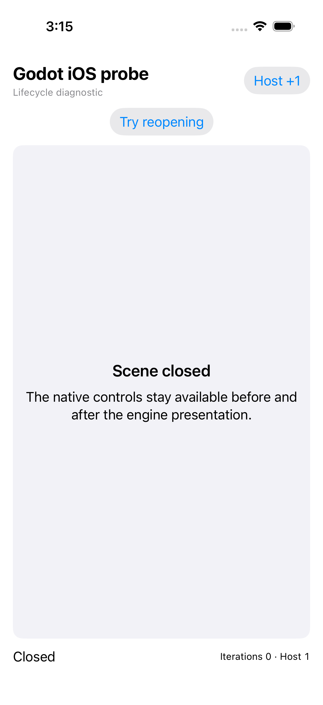
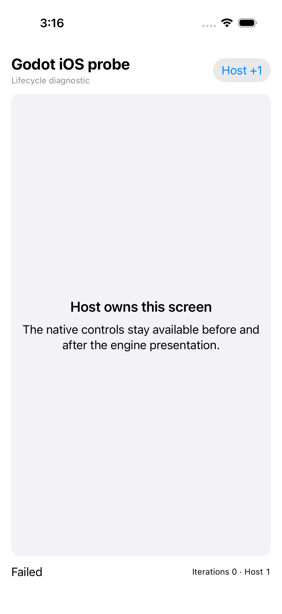
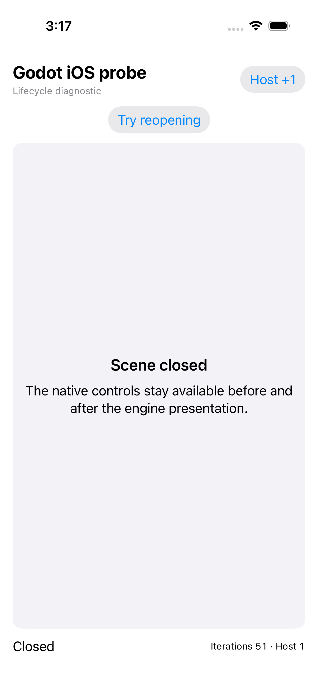
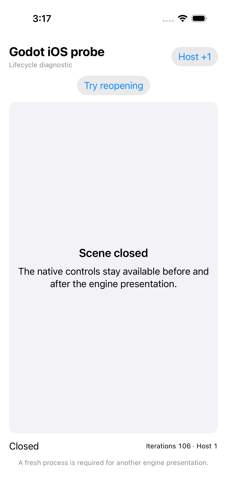
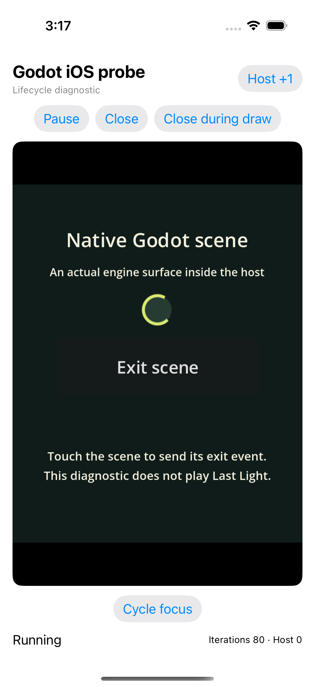
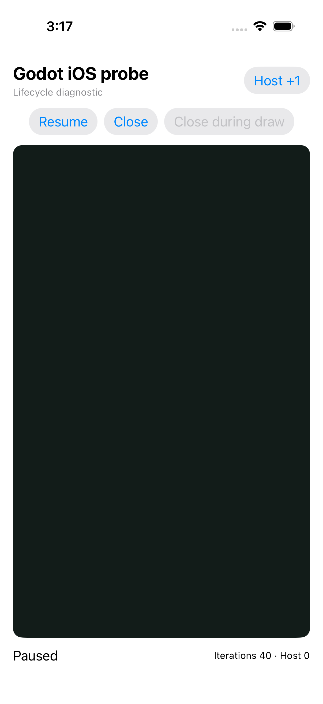
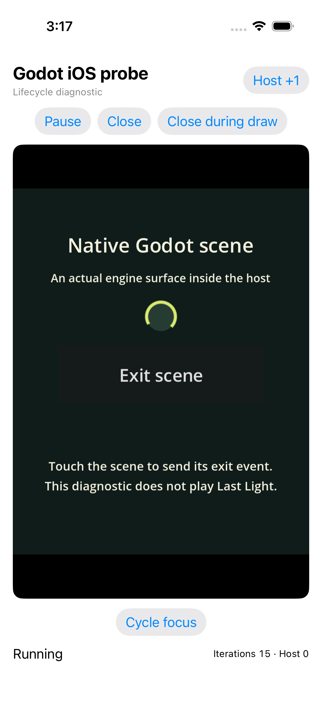

# Godot iOS native diagnostic probe — five tests pass

[All screenshot collections](../README.md) · [CI run 34431377938](https://github.com/Apdelrahman1911/PartyDeck/actions/runs/34431377938)

**Evidence status:** All five native diagnostic tests pass. Nine original screenshots show actual diagnostic rendering, native cover, resume, closed states and the intentionally induced scene-load failure. The [original native result](evidence/native-host-result.json), [Xcode test summary](evidence/native-test-summary.json) and [test log](evidence/host-test.log) agree. This is **diagnostic-scene execution only**, without Last Light authority gameplay, KMP factory execution, same-process engine reinitialization or physical-device Metal qualification.

Exact CI revision: `4f7776aba5809330fdd0197623a03f7a45cba3a1`. [Simulator metadata](evidence/simulator.json) records iPhone 17 and iOS runtime 26.4.1. [Xcode](evidence/xcode-version.log) is 26.4.1 (17E202), with [SDK 26.4](evidence/xcode-sdks.log). Every PNG is 1206 × 2622; font scale was not recorded. The app executable independently matches SHA-256 `ae1020f5dc0065d415c8a62c96ef1d1b132c709b58e331a653ee25525b5f2d68` inside the original downloaded archive; engine archives and bundled diagnostic source hashes also match their original receipts.

The [tests at this exact source](https://github.com/Apdelrahman1911/PartyDeck/blob/4f7776aba5809330fdd0197623a03f7a45cba3a1/godot/ios-host/ProbeHostUITests/ProbeHostUITests.swift) verify cancellation before construction, close during checked initialization, cleanup after an actual draw callback, immediate foreground loss/resume, and real scene touch → GDScript → bridge exit. A deliberately missing main scene produces the real `MAIN_START_FAILED` loader outcome and restores shell policy; that expected failure remains visible rather than being relabeled as rendered success. Closed-state checks include released view/controller, stopped iterations, empty queues and restored idle-timer policy.

The diagnostic uses an actual `GDTOpenGLLayer`. Its paused image is covered; the running images show the diagnostic scene and its Exit button. There are zero authority gameplay intents. The capture named Immediate focus loss and resume is taken after the test closes the scene. PNG and measurement attachments are sequential, so live iteration counters differ between the running images and their later JSONs. The [original attachment manifest](attachments/manifest.json) retains all UUID filenames, timestamps and test associations.

The earlier [failed iOS probe](../godot-ios-probe-34428221586/README.md) remains retained. [CI artifacts](provenance/artifacts.json) · [Job metadata](provenance/last-job-status.json) · [Later downloaded-artifact audit](provenance/evidence-summary.json) · [Original resource receipt](evidence/host-resources.json). Source directory: `/tmp/partydeck-engine-ci/34431377938/godot-ios-probe-test/artifacts/attachments`.

| Original image | Scenario and provenance |
| --- | --- |
|  | **Closed before engine construction** iPhone 17 simulator, iOS runtime 26.4.1, native diagnostic Godot host Original: [DFF24192-40F9-4B0A-AD9D-1C9AB9F8B476.png](attachments/DFF24192-40F9-4B0A-AD9D-1C9AB9F8B476.png) 1206 × 2622 px; text scale not recorded SHA-256: <code>3c00f42cb5615607039c162b4016869d4a80f0cb853226884b08f8800b2f401b</code> [Original measurements](attachments/5F980313-C0C7-421C-8CCB-D1E2601BDF18.json) Diagnostic scene only. No Last Light authority gameplay or KMP factory execution is established. Cancellation passes with zero bootstrap, cleanup, Ready, draws and iterations; the native Host +1 control remains usable. |
|  | **Real scene-load failure restored shell policy** iPhone 17 simulator, iOS runtime 26.4.1, native diagnostic Godot host Original: [8159FA04-3B58-4439-9784-0ABD252228F8.png](attachments/8159FA04-3B58-4439-9784-0ABD252228F8.png) 1206 × 2622 px; text scale not recorded SHA-256: <code>0c5993d0d0046a12722c5e49d7f9fbb7c1c70c5824b9e3f3ff70fc9817e8a520</code> [Original measurements](attachments/6A58E653-75FF-4C50-AD40-7713E1003388.json) Diagnostic scene only. No Last Light authority gameplay or KMP factory execution is established. The test deliberately loads a missing main scene in a fresh process. The actual MAIN_START_FAILED state is expected here; one cleanup releases the native view/controller and restores shell policy. The enclosing test passes. |
|  | **Closed during checked initialization** iPhone 17 simulator, iOS runtime 26.4.1, native diagnostic Godot host Original: [60CB52DB-3A79-4C97-945E-3F0730B2EE26.png](attachments/60CB52DB-3A79-4C97-945E-3F0730B2EE26.png) 1206 × 2622 px; text scale not recorded SHA-256: <code>8c272865ee0366757bc2a5bcf31eddc57a3766f4c4858ceb4263057265c777fd</code> [Original measurements](attachments/6AE38F66-F889-40F9-91C1-6FFFA2FA9B79.json) Diagnostic scene only. No Last Light authority gameplay or KMP factory execution is established. A close requested during initialization reaches the checked cleanup boundary: setup2 succeeded, cleanup ran once, no draw/Ready occurred, native controller/view were released and shell idle-timer policy was restored. |
|  | **Close requested inside draw** iPhone 17 simulator, iOS runtime 26.4.1, native diagnostic Godot host Original: [F0E0737F-430D-4033-975C-D189657C34C0.png](attachments/F0E0737F-430D-4033-975C-D189657C34C0.png) 1206 × 2622 px; text scale not recorded SHA-256: <code>5a07abba88249c0e5603a523e21b0f1214adab954804def61f5b2a65826f1e7d</code> [Original measurements](attachments/03504AF4-0CA6-4584-8BF2-26267B240505.json) Diagnostic scene only. No Last Light authority gameplay or KMP factory execution is established. Close was requested inside the actual draw callback. The later measurements record 46 draw calls, 45 iterations and one cleanup after draw/cleanup depth returns to zero; the captured host is Closed. |
|  | **Immediate focus loss and resume** iPhone 17 simulator, iOS runtime 26.4.1, native diagnostic Godot host Original: [001B3118-E1D2-4304-A0B6-87734D08E194.png](attachments/001B3118-E1D2-4304-A0B6-87734D08E194.png) 1206 × 2622 px; text scale not recorded SHA-256: <code>c83cabeb8bd90bacb9122c53de43f492adb859f616c03a6cf97fd7d4083b56ef</code> [Original measurements](attachments/AC98F181-E3F0-4C10-8BF6-BACEF58C658D.json) Diagnostic scene only. No Last Light authority gameplay or KMP factory execution is established. The false/true foreground pair resumes drawing, then the test closes the scene before taking this PNG. This image shows Closed; its paired measurements retain 51 iterations, one background transition and one cleanup. |
|  | **Diagnostic closed and reopen refused** iPhone 17 simulator, iOS runtime 26.4.1, native diagnostic Godot host Original: [3A29CB8D-B44B-494E-8088-EEB0AB7F0271.png](attachments/3A29CB8D-B44B-494E-8088-EEB0AB7F0271.png) 1206 × 2622 px; text scale not recorded SHA-256: <code>e0b2763a89de635e6ea0f27927d510056c61c6a65fc2e2d654c22a2053f17651</code> [Original measurements](attachments/515E29CD-7B8A-4897-854F-4C45B9B2B2F2.json) Diagnostic scene only. No Last Light authority gameplay or KMP factory execution is established. An actual tap on the Godot Exit scene button produces one bridge exit event. Cleanup runs once, native view/controller and OS singleton are released, queues empty and shell policy restores. Reopening is refused with one total bootstrap; same-process reinitialization is not qualified. |
|  | **Diagnostic resumed** iPhone 17 simulator, iOS runtime 26.4.1, native diagnostic Godot host Original: [3B592249-3F44-4BB2-A56F-A6A8C77EE749.png](attachments/3B592249-3F44-4BB2-A56F-A6A8C77EE749.png) 1206 × 2622 px; text scale not recorded SHA-256: <code>0317f59dbd83a8d6bd2a6db2b4dfe3051fed376692c6deb1ee86fe38015af32f</code> [Original measurements](attachments/2C625CA9-7F8D-4E6C-9C26-1128C9E4BFE0.json) Diagnostic scene only. No Last Light authority gameplay or KMP factory execution is established. The native diagnostic scene is visible again after pause/resume and app background/reactivation. The displayed counter reads 80 iterations; the following measurement records 85 iterations, 86 draws and four background transitions. |
|  | **Diagnostic paused and covered** iPhone 17 simulator, iOS runtime 26.4.1, native diagnostic Godot host Original: [5EF1C4C0-0E7C-40CF-93A8-CA626797EA71.png](attachments/5EF1C4C0-0E7C-40CF-93A8-CA626797EA71.png) 1206 × 2622 px; text scale not recorded SHA-256: <code>99b59ada6bb1809cedc71fd499c1b1b227088be61773596baf436c6e87b61f74</code> [Original measurements](attachments/BCA19762-8EC7-479E-AEC9-E55669682B22.json) Diagnostic scene only. No Last Light authority gameplay or KMP factory execution is established. The native cover hides the old engine frame. The paired measurements record paused state, a visible cover, stopped render loop and 40 iterations. |
|  | **Diagnostic rendering** iPhone 17 simulator, iOS runtime 26.4.1, native diagnostic Godot host Original: [44AD9CFD-9216-422F-8046-CC7E3D49295C.png](attachments/44AD9CFD-9216-422F-8046-CC7E3D49295C.png) 1206 × 2622 px; text scale not recorded SHA-256: <code>edc68152c9b0a6d95c1581f4d552a550413ffdccc6bd36c595dd5ac3206680cc</code> [Original measurements](attachments/5DCC1F14-F58C-451A-8981-7C62A5A60CB3.json) Diagnostic scene only. No Last Light authority gameplay or KMP factory execution is established. Actual GDTOpenGLLayer content is visible with one Ready event. The displayed counter reads 15 iterations; the following measurement attachment records 20 iterations and 21 draw calls. |
