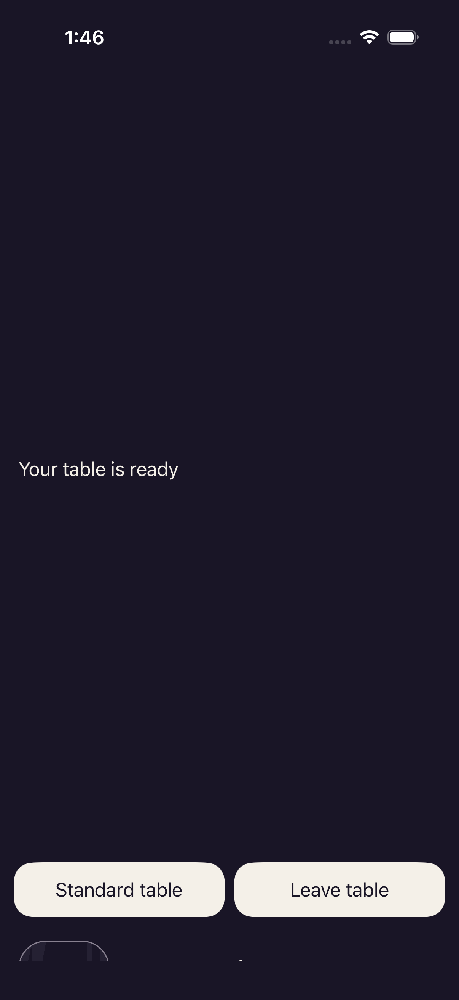

# iOS production — both session smokes failed

[All collections](../README.md) · [Original CI run](https://github.com/Apdelrahman1911/PartyDeck/actions/runs/34480503751)

Both production session tests failed. Host text and Standard/Leave buttons occupy almost all the screen; the Godot viewport is clipped to a strip along the bottom.

Two viewed original PNGs retain their paired UUID observation JSONs. Recorded renderer viewport: 402 × 26. Six baseline cases and package checks were verified separately; no production interaction pass, runtime acceptance or shipping promotion.

Exact source: `7012ba031a4129c81cd118206f727a46a1c846e4`; run attempt 1. Original PNG and metadata bytes, filenames, source identities and review limits are preserved.

Failure evidence only. The original observations do not prove a unique source root cause or continuous state throughout the wait.

Existing provenance: [production-session-failure-review.json](provenance/production-session-failure-review.json) · [test-summary.json](provenance/test-summary.json) · [production-tests.json](provenance/production-tests.json).

## Publication review

Review coverage for these 2 originals: 2 direct original views. Capture identities remain separate when pixels match. The review describes the captured viewport; it adds no native execution or assistive-technology result.

[Completed visual review](../godot-android-34478725424/provenance/publication-review/partydeck-gallery-next2-historical-visual-review.json) · [Publication copy audit](../godot-android-34478725424/provenance/publication-review/partydeck-gallery-next2-historical-source-audit.json) · [Frozen queue](../godot-android-34478725424/provenance/publication-queue-v1/queue-freeze.json) · [Original copy mapping](../godot-android-34478725424/provenance/publication-queue-v1/copy-paths.tsv) · [Original queue page](../godot-android-34478725424/provenance/publication-queue-v1/payload/docs/screenshots/godot-ios-production-34480503751/README.md). The archived queue page retains its original text and relative paths as provenance.

Both saved observations report a 402 × 26 renderer viewport in `root_viewport` coordinates; the separate native bounds retain their screen-coordinate labels. Native `surfaceAccessibilityHidden=false` leaves the mandatory accessibility guard unsatisfied. [Existing independent image/source review](provenance/independent-review/original-evidence-review.json) retains the original failure and source-analysis limits.

| Original capture | Recorded observation and scope |
| --- | --- |
|  | **Failed production 2D smoke — clipped renderer viewport** iOS Simulator 26.4.1, iPhone 17 (arm64), production qualification host [45478AA1-B877-4B9D-879B-B8C721AF43F1.png](attachments/45478AA1-B877-4B9D-879B-B8C721AF43F1.png); 1206 × 2622 px SHA-256: <code>f0c55ffbebd6c8dd06de8926f2b3872f053aea674204706c0de38e88240a6dc8</code> [Original observation](attachments/3AD5C42A-665B-4FCD-AF2D-5365FEE35E8A.json) · [Original result](provenance/test-summary.json) · [Existing visual review](provenance/production-session-failure-review.json) Original PNG viewed: host message and Standard/Leave buttons occupy almost all the screen; only a clipped Godot strip appears along the bottom. Original failed production 2D smoke; stretched native status area and clipped renderer viewport, no production interaction pass. Recorded renderer viewport 402 × 26; the original observation preserves the native bounds and coordinate-space labels. The first actual assertion failed: Observe fresh, current production renderer diagnostics. Six baseline cases and package checks were verified separately; runtime acceptance and shipping promotion remain false. **Publication review — direct original view:** The failed production 2D original shows a large mostly empty native status area with Your table is ready and complete Standard table / Leave table buttons near the bottom. Only a narrow clipped renderer strip appears below them. The paired observation reports a 402 × 26 viewport; the status text does not establish usable gameplay. |
|  | **Failed production 3D smoke — clipped renderer viewport** iOS Simulator 26.4.1, iPhone 17 (arm64), production qualification host [71843BE7-2F20-47C3-A626-F621D9221F3E.png](attachments/71843BE7-2F20-47C3-A626-F621D9221F3E.png); 1206 × 2622 px SHA-256: <code>44df809c18bd80e1885d8d19c634530e894336ae9d2e8dc3a4925f98af750127</code> [Original observation](attachments/76E03857-ED6A-42AC-9BD4-9DE9FA4738A4.json) · [Original result](provenance/test-summary.json) · [Existing visual review](provenance/production-session-failure-review.json) Original PNG viewed: host message and Standard/Leave buttons occupy almost all the screen; only a clipped Godot strip appears along the bottom. Original failed production 3D smoke; stretched native status area and clipped renderer viewport, no production interaction pass. Recorded renderer viewport 402 × 26; the original observation preserves the native bounds and coordinate-space labels. The first actual assertion failed: Observe fresh, current production renderer diagnostics. Six baseline cases and package checks were verified separately; runtime acceptance and shipping promotion remain false. **Publication review — direct original view:** The failed production 3D original shows the same stretched native status area, Your table is ready and complete Standard table / Leave table buttons. The renderer is reduced to a clipped strip at the bottom. The paired observation reports a 402 × 26 viewport; this is failure evidence, not an interaction pass. |
