# Godot iOS retained host — CI 34464316979

Background transitions and four repeated entries pass. Stale reentry fails its diagnostic wait; the later failure PNG shows a concealed table. The full retained suite remains unqualified.

28 unchanged original PNGs from exact revision `ea84bf49e799675c181545cc3511460b11e0e23d`, renderer PCK SHA-256 `a47392b4ca50e0433e1f42043b9473b08e9641d24117e251a4ab88e11027e3db`. The enclosing workflow concludes `failure`. Companion suite: [godot-ios-authority-34464316979](../godot-ios-authority-34464316979/README.md).

These are actual iPhone 17 simulator captures at 1206 × 2622 pixels. Authority scale labels follow their recorded cases; retained scale is left unrecorded where measurements do not specify it. Each thumbnail opens its unchanged original UUID filename.

| Recorded case | Result | Original PNGs | Scope |
| --- | --- | ---: | --- |
| Active and dormant background transitions | Success | 10 | The active/dormant background case passes. Selected private cards are covered after the focus and Home transitions, and the dormant shell exposes its two entry actions. Recorded dormant endpoints support stopped counters; screenshots alone do not measure native work. |
| Four repeated 2D/3D entries | Success | 17 | The repeated-entry case passes four 2D/3D entries in one retained process. Both initial 2D frames place Reveal below the central viewport; later scrolled hand/play states and 3D actions fit. Each retirement returns to the native dormant shell. |
| Stale Ready / close-completion reentry | Failure | 1 | The stale-Ready/close-completion reentry case fails waiting for current renderer diagnostics. Its later failure capture visibly shows a concealed 3D table; this does not satisfy the failed wait or establish the old-handle probe and subsequent play/exit. |

The [independent source audit](../godot-ios-authority-34464316979/review/partydeck-gallery-next-ios-34464316979-source-audit.json) verifies all six ZIPs and 4,422 extracted members, original SQLite case results, exported payload identities, producer source inputs, compiled PCK entries and both packaged apps. The [completed visual review](../godot-ios-authority-34464316979/review/partydeck-gallery-next-ios-34464316979-visual-review.json) binds every image to its per-image notes. Internal review sheets remain outside the gallery.

This suite has 94 independently verified original attachment payloads. Compact measurements, failed predicates, results, source and provenance are published here. Other large runtime logs, archives, binaries and internal attachments remain separately retained with exact source paths and hashes in the audit; verification is not a claim that every large payload was duplicated into this page.

The successful repeated-entry case is bounded to four entries in its recorded process. Dormant evidence checks the recorded endpoints and stopped counters; it does not reconstruct unrecorded intermediate samples. Touch-candidate eligibility is separate from actual tap delivery. A visible Old handle test control does not establish an executed probe. The full retained suite and general same-process reentry remain unqualified.

Native production KMP factories, VoiceOver traversal, physical-device Metal/performance, physical sensor shutdown and real audio interruptions are not qualified by these simulator cases. Secure default Exit is a launch-and-exit fixture, not a secure-default full match.

## Active and dormant background transitions

The active/dormant background case passes. Selected private cards are covered after the focus and Home transitions, and the dormant shell exposes its two entry actions. Recorded dormant endpoints support stopped counters; screenshots alone do not measure native work.

| Original image | Scenario and provenance |
| --- | --- |
|  | **Real reveal and card selection** iPhone 17 simulator, actual native Last Light retained host Original: [98276FDA-8F80-496B-A2D5-D100A0D222D3.png](attachments/98276FDA-8F80-496B-A2D5-D100A0D222D3.png) 1206 × 2622 px; text scale not separately recorded SHA-256: <code>fe266c6bbe543af606c7c5e127444978a4f391aa08c5d47faca1412c5369cce1</code> [Original paired measurements](evidence/attachments/E88211DB-B39F-4DA4-93C4-BF06CB728890.json) Recorded enclosing case: Success The selected Moon is clearly marked and Claim 1 Star fits. Additional cards continue horizontally; native Pause, Close, Switch and Cycle controls remain visible. |
|  | **Coalesced native foreground loss and regain returned concealed** iPhone 17 simulator, actual native Last Light retained host Original: [68044485-722A-4079-9827-AFEB195FB08E.png](attachments/68044485-722A-4079-9827-AFEB195FB08E.png) 1206 × 2622 px; text scale not separately recorded SHA-256: <code>122eacea42dfb3cd7506749cbf92a350344b8cd02fae640f2682a3adee0a642a</code> [Original paired measurements](evidence/attachments/2EDFF76D-B754-46EC-9F53-38AD41225B13.json) Recorded enclosing case: Success After the coalesced focus cycle, private faces are gone and Reveal is fully visible in the scrolled 2D panel. |
|  | **Real reveal and card selection** iPhone 17 simulator, actual native Last Light retained host Original: [9FDE69CD-7B1B-4098-A224-A483B170AC3E.png](attachments/9FDE69CD-7B1B-4098-A224-A483B170AC3E.png) 1206 × 2622 px; text scale not separately recorded SHA-256: <code>fe266c6bbe543af606c7c5e127444978a4f391aa08c5d47faca1412c5369cce1</code> [Original paired measurements](evidence/attachments/621A577F-DFAC-400F-8150-C28E18662E34.json) Recorded enclosing case: Success A second original selected-hand view shows the same clear Moon marker and complete Claim action after the focus cycle. |
|  | **Real reveal and card selection** iPhone 17 simulator, actual native Last Light retained host Original: [E95C8B67-D0CE-4045-B089-296AC3307156.png](attachments/E95C8B67-D0CE-4045-B089-296AC3307156.png) 1206 × 2622 px; text scale not separately recorded SHA-256: <code>fe266c6bbe543af606c7c5e127444978a4f391aa08c5d47faca1412c5369cce1</code> [Original paired measurements](evidence/attachments/77811F74-B279-4AF4-BE18-F4A5AB7FB7E2.json) Recorded enclosing case: Success The separate pre-Home selected-hand capture retains the Moon selection and complete Claim action; it is not deduplicated. |
| <a href="attachments/DB717A18-6834-4C95-B0E7-E071FF745C29.png">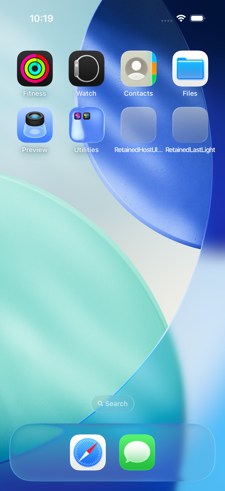</a> | **Actual Home screen** iPhone 17 simulator, actual native Last Light retained host Original: [DB717A18-6834-4C95-B0E7-E071FF745C29.png](attachments/DB717A18-6834-4C95-B0E7-E071FF745C29.png) 1206 × 2622 px; text scale not separately recorded SHA-256: <code>cd8225672cfbe8dc5bc1a89860651865e2c55938a7060c0622637d29fc889605</code> Recorded enclosing case: Success The actual Home screen and Safari/Messages dock are visible with no game content. The raw applicationState value is retained separately. |
| <a href="attachments/D60F07CD-0E2D-45AB-B325-6665F34AF6E8.png">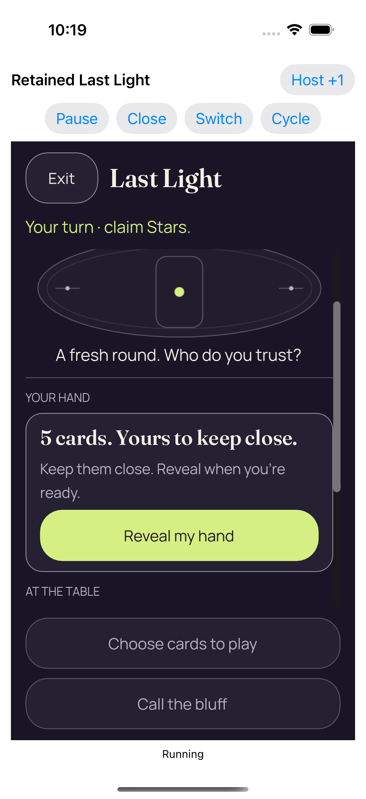</a> | **Real background and resume kept the same authority concealed** iPhone 17 simulator, actual native Last Light retained host Original: [D60F07CD-0E2D-45AB-B325-6665F34AF6E8.png](attachments/D60F07CD-0E2D-45AB-B325-6665F34AF6E8.png) 1206 × 2622 px; text scale not separately recorded SHA-256: <code>36b3cd23f0b15635b700cc805519bdb8614fc25fc2d481a9126136fc8e6e3e72</code> [Original paired measurements](evidence/attachments/1C80489D-6E6E-41E9-9B68-3FC5479088CA.json) Recorded enclosing case: Success Returning from Home displays the covered-hand panel and complete Reveal action; the authority and native lifetime are correlated by original measurements. |
| <a href="attachments/FB3CE59B-5289-44F5-9E0D-CC20ED104BAD.png">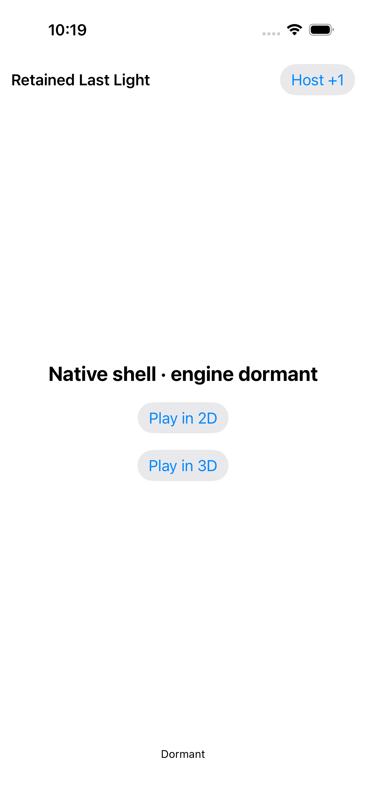</a> | **Whole recipient scene retired; retained services dormant** iPhone 17 simulator, actual native Last Light retained host Original: [FB3CE59B-5289-44F5-9E0D-CC20ED104BAD.png](attachments/FB3CE59B-5289-44F5-9E0D-CC20ED104BAD.png) 1206 × 2622 px; text scale not separately recorded SHA-256: <code>351e6824a30ae86bf5dad843551c4977b1b3b2414e4951049595bb4f4817aa53</code> [Original paired measurements](evidence/attachments/8CDB346A-417B-40E0-839E-38E489DCEDC7.json) Recorded enclosing case: Success The native shell shows engine dormant, Play in 2D and Play in 3D, without the recipient game scene. |
|  | **Actual Home screen** iPhone 17 simulator, actual native Last Light retained host Original: [0EA38356-6284-4999-86ED-54305B9E6B87.png](attachments/0EA38356-6284-4999-86ED-54305B9E6B87.png) 1206 × 2622 px; text scale not separately recorded SHA-256: <code>d3a953544a87eda4d3e6238520734d69a961ca10e89c2d1c782deec4b07c0afe</code> Recorded enclosing case: Success The dormant Home capture is a separate original. The actual Home dock is visible and no game content is exposed. |
|  | **Whole recipient scene retired; retained services dormant** iPhone 17 simulator, actual native Last Light retained host Original: [DF78672A-2223-46F4-BA0C-1AFC9EA8E919.png](attachments/DF78672A-2223-46F4-BA0C-1AFC9EA8E919.png) 1206 × 2622 px; text scale not separately recorded SHA-256: <code>03e77863842f50601782c4dba35e565a2a4cad7a7a50cfeac4d6c2e3afde04d9</code> [Original paired measurements](evidence/attachments/4452C1B9-C4C0-41B5-BC8E-A013D002DBB3.json) Recorded enclosing case: Success After the later 3D retirement, the dormant shell again shows both entry actions with no renderer content. |
|  | **Dormant application lifecycle did not restart the engine services** iPhone 17 simulator, actual native Last Light retained host Original: [CD8CD740-8950-457C-A558-9FA9BDC85274.png](attachments/CD8CD740-8950-457C-A558-9FA9BDC85274.png) 1206 × 2622 px; text scale not separately recorded SHA-256: <code>03e77863842f50601782c4dba35e565a2a4cad7a7a50cfeac4d6c2e3afde04d9</code> [Original paired measurements](evidence/attachments/06262F50-3040-43C7-8875-04B44C432AD4.json) Recorded enclosing case: Success The final dormant lifecycle capture remains a clear native shell. Stopped work is established only by its recorded endpoint counters. |

## Four repeated 2D/3D entries

The repeated-entry case passes four 2D/3D entries in one retained process. Both initial 2D frames place Reveal below the central viewport; later scrolled hand/play states and 3D actions fit. Each retirement returns to the native dormant shell.

| Original image | Scenario and provenance |
| --- | --- |
| <a href="attachments/F2376D24-5E5B-43C4-8692-010CFBBBF504.png">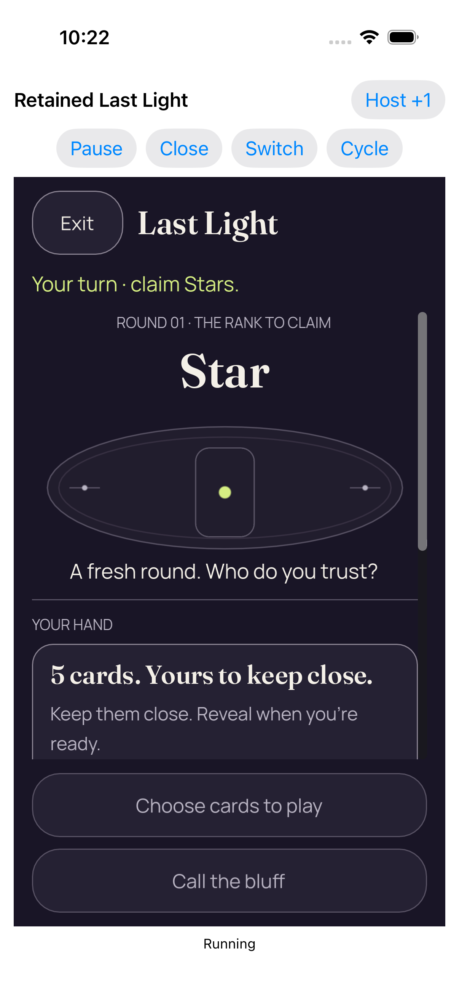</a> | **Entry 1 fresh concealed 2d** iPhone 17 simulator, actual native Last Light retained host Original: [F2376D24-5E5B-43C4-8692-010CFBBBF504.png](attachments/F2376D24-5E5B-43C4-8692-010CFBBBF504.png) 1206 × 2622 px; text scale not separately recorded SHA-256: <code>461d32299a28ee259f2af4854852c19974e2a528a45b94e7fec8772fb1cfe9f0</code> [Original paired measurements](evidence/attachments/0C5AB133-C879-46F9-9E51-E94A49FE86F2.json) Recorded enclosing case: Success Entry 1 starts concealed in 2D, but Reveal is entirely below the central scroll viewport. Fixed disabled gameplay actions remain visible. |
| <a href="attachments/7853739E-701D-4334-8878-08E9C77ADA24.png">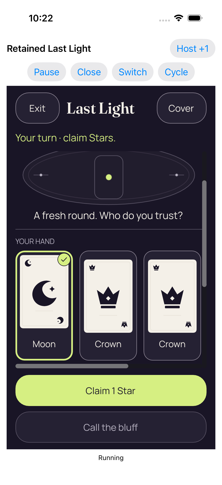</a> | **Real reveal and card selection** iPhone 17 simulator, actual native Last Light retained host Original: [7853739E-701D-4334-8878-08E9C77ADA24.png](attachments/7853739E-701D-4334-8878-08E9C77ADA24.png) 1206 × 2622 px; text scale not separately recorded SHA-256: <code>22ee3aa40f0cd27115aac7a1c91677bb3d954246fdf0a0e1904e4a3fb9463efd</code> [Original paired measurements](evidence/attachments/87E013A8-F729-481D-AAA3-268CAE42D69B.json) Recorded enclosing case: Success After scrolling and selection, the Moon marker and Claim 1 Star action are complete. Other cards remain horizontally scrollable. |
| <a href="attachments/0AAE3654-9BB8-4424-A0C2-75E3CD652C78.png">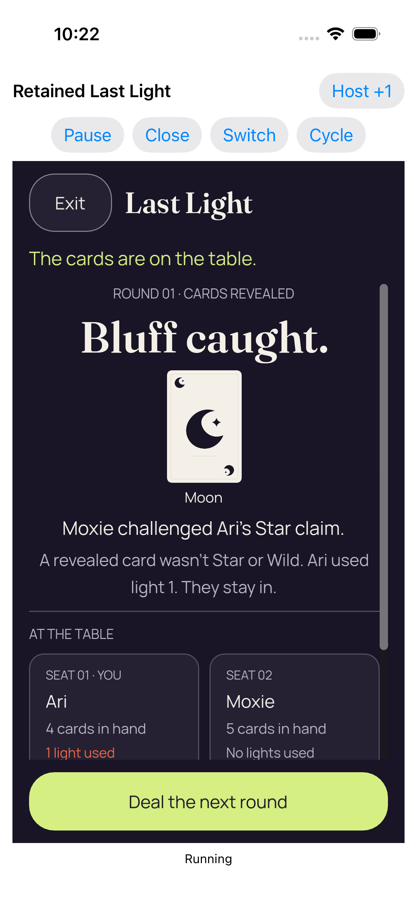</a> | **Real play accepted by the Kotlin authority** iPhone 17 simulator, actual native Last Light retained host Original: [0AAE3654-9BB8-4424-A0C2-75E3CD652C78.png](attachments/0AAE3654-9BB8-4424-A0C2-75E3CD652C78.png) 1206 × 2622 px; text scale not separately recorded SHA-256: <code>74411cf4b095d4eabfdb879aca1afd274b6ba5262d15d557fbd872eaf1d3a99d</code> [Original paired measurements](evidence/attachments/0971A13B-F0E9-4A83-BB17-93170AC15A36.json) Recorded enclosing case: Success The real accepted play produces a readable Moon proof, named challenge and light consequence. Deal the next round fits; seat details clip at the lower scroll edge. |
|  | **Whole recipient scene retired; retained services dormant** iPhone 17 simulator, actual native Last Light retained host Original: [C8516137-739A-497A-8567-23CBF0B3387A.png](attachments/C8516137-739A-497A-8567-23CBF0B3387A.png) 1206 × 2622 px; text scale not separately recorded SHA-256: <code>233b716fb43cd3e91636e6921a4845e238181b90f7ba76cd6ac6643037005027</code> [Original paired measurements](evidence/attachments/1ACAFEBA-A955-4E95-9810-4DBA861E61EB.json) Recorded enclosing case: Success Entry 1 retires to the native dormant shell with both 2D and 3D entry actions and no game content. |
| <a href="attachments/BD0765D7-DEF6-4254-B25C-B477500318DE.png">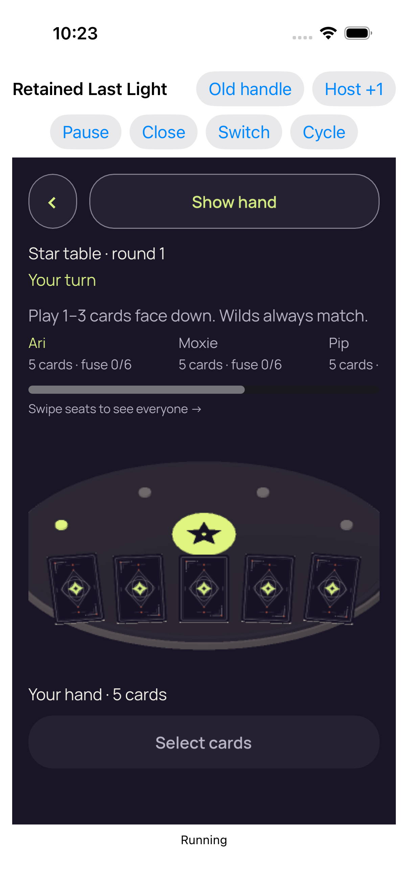</a> | **Entry 2 fresh concealed 3d** iPhone 17 simulator, actual native Last Light retained host Original: [BD0765D7-DEF6-4254-B25C-B477500318DE.png](attachments/BD0765D7-DEF6-4254-B25C-B477500318DE.png) 1206 × 2622 px; text scale not separately recorded SHA-256: <code>70d56d0337373761126c6990c79a751c306950283de05357b7592e8e1e973106</code> [Original paired measurements](evidence/attachments/F41027D9-E55C-4F85-BF25-132BE7A83A37.json) Recorded enclosing case: Success Entry 2 starts in 3D with five card backs, readable turn/claim context and complete Show hand. The Old handle control is visible in the test header, not evidence of an executed probe. |
|  | **Real reveal and card selection** iPhone 17 simulator, actual native Last Light retained host Original: [5E08086A-8A50-4304-9B7E-333DA42FF8A1.png](attachments/5E08086A-8A50-4304-9B7E-333DA42FF8A1.png) 1206 × 2622 px; text scale not separately recorded SHA-256: <code>8df80dc900812525523313990b6da49e662c7effb1925e7d4dc0d9fad6451636</code> [Original paired measurements](evidence/attachments/207B1A1D-33AC-45F5-8286-86285FAE4CE4.json) Recorded enclosing case: Success The 3D Moon selection marker, five rank captions and Play 1 action are visible. Native test controls remain separate from the renderer. |
| <a href="attachments/B46F15EE-4DA5-4A12-A57F-711C10140FA1.png">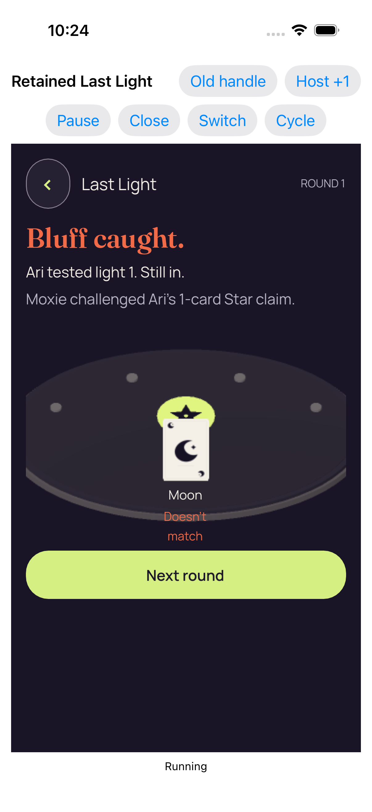</a> | **Real play accepted by the Kotlin authority** iPhone 17 simulator, actual native Last Light retained host Original: [B46F15EE-4DA5-4A12-A57F-711C10140FA1.png](attachments/B46F15EE-4DA5-4A12-A57F-711C10140FA1.png) 1206 × 2622 px; text scale not separately recorded SHA-256: <code>cabd924c74334b1df02b82f073458f55fb828f71146d0118f17710989e064afd</code> [Original paired measurements](evidence/attachments/25ABA10D-029D-4B35-9D67-D2BACDE66786.json) Recorded enclosing case: Success The accepted 3D play shows the public Moon mismatch and complete Next round action; the small mismatch caption remains readable across the table edge. |
|  | **Whole recipient scene retired; retained services dormant** iPhone 17 simulator, actual native Last Light retained host Original: [1EA8B297-232B-455D-A340-4B34715A9C55.png](attachments/1EA8B297-232B-455D-A340-4B34715A9C55.png) 1206 × 2622 px; text scale not separately recorded SHA-256: <code>04b19543b14b92d4e6a5049cd3d56b23e1b1ed5bfd0a93292974ee1d9e41c3ef</code> [Original paired measurements](evidence/attachments/A67DA26C-60C8-48C1-8175-63DD5C012DCA.json) Recorded enclosing case: Success Entry 2 retires to a clear native dormant shell with both entry actions. |
| <a href="attachments/88A8CDC9-4970-4FBB-A0E2-EF5F6F07DEA6.png">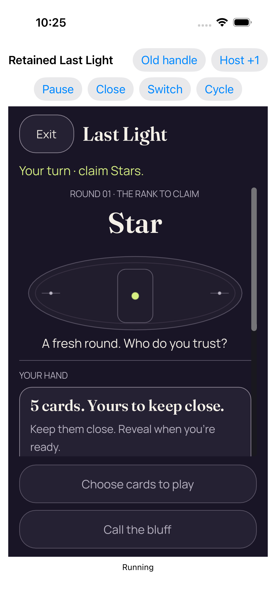</a> | **Entry 3 fresh concealed 2d** iPhone 17 simulator, actual native Last Light retained host Original: [88A8CDC9-4970-4FBB-A0E2-EF5F6F07DEA6.png](attachments/88A8CDC9-4970-4FBB-A0E2-EF5F6F07DEA6.png) 1206 × 2622 px; text scale not separately recorded SHA-256: <code>591ddbe55af5d08d2388b46566e084788aee6b8b4a3f3364b562f0eaa1f69a72</code> [Original paired measurements](evidence/attachments/088F7C40-5418-428F-AA45-2BD7FD05D5CB.json) Recorded enclosing case: Success Entry 3 is a distinct concealed 2D original. Reveal again lies below the central scroll viewport; fixed disabled actions fit. |
| <a href="attachments/6EF855DE-01D1-40A8-9EE7-37053C47FCD5.png">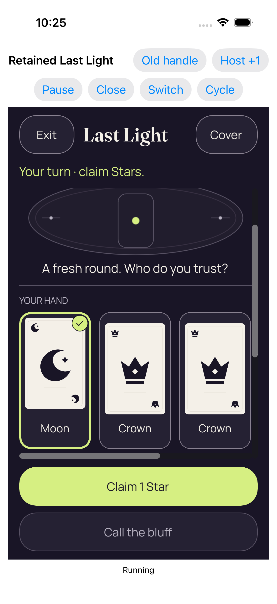</a> | **Real reveal and card selection** iPhone 17 simulator, actual native Last Light retained host Original: [6EF855DE-01D1-40A8-9EE7-37053C47FCD5.png](attachments/6EF855DE-01D1-40A8-9EE7-37053C47FCD5.png) 1206 × 2622 px; text scale not separately recorded SHA-256: <code>a86fdcd973680f37e945ad5502a6f42e41537788eeceec1f6bd8c062ec8239ff</code> [Original paired measurements](evidence/attachments/238F52EF-56AF-4315-93FC-121E9886AC12.json) Recorded enclosing case: Success Entry 3 exposes the selected Moon and complete Claim action after scrolling; identical-looking states retain their separate capture identity. |
| <a href="attachments/1598435B-A3F4-4445-879F-117E81A633B3.png">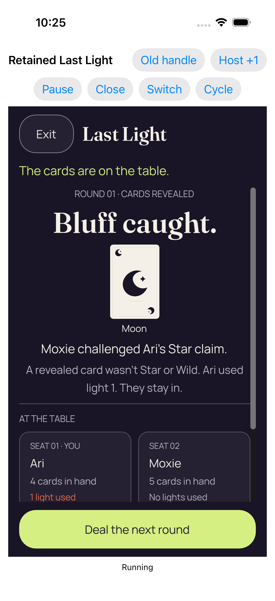</a> | **Real play accepted by the Kotlin authority** iPhone 17 simulator, actual native Last Light retained host Original: [1598435B-A3F4-4445-879F-117E81A633B3.png](attachments/1598435B-A3F4-4445-879F-117E81A633B3.png) 1206 × 2622 px; text scale not separately recorded SHA-256: <code>d1672a95add334e990f323c6d12c72d45d6280d96fdcb6506ea9e1949c0e85c0</code> [Original paired measurements](evidence/attachments/AD3C28F7-4FC7-463B-91C6-7F4D13E49EBA.json) Recorded enclosing case: Success Entry 3&#x27;s accepted play shows the readable named Moon proof and full next-round action, with lower seat details clipped by scrolling. |
|  | **Whole recipient scene retired; retained services dormant** iPhone 17 simulator, actual native Last Light retained host Original: [199A4DCE-5F14-4FFF-A98F-489A19886D5C.png](attachments/199A4DCE-5F14-4FFF-A98F-489A19886D5C.png) 1206 × 2622 px; text scale not separately recorded SHA-256: <code>04b19543b14b92d4e6a5049cd3d56b23e1b1ed5bfd0a93292974ee1d9e41c3ef</code> [Original paired measurements](evidence/attachments/54170115-1B40-4E7A-BB0D-A13E8FCA2710.json) Recorded enclosing case: Success Entry 3 retires to the native dormant shell without game content. |
|  | **Entry 4 fresh concealed 3d** iPhone 17 simulator, actual native Last Light retained host Original: [1FD15971-AD52-4C86-B98E-6B6F973F1AED.png](attachments/1FD15971-AD52-4C86-B98E-6B6F973F1AED.png) 1206 × 2622 px; text scale not separately recorded SHA-256: <code>e2f483ea40926282554290f2b3f7e4384ad0012d40830992427178566b11ecaa</code> [Original paired measurements](evidence/attachments/D4E93470-F45C-4890-A115-BF00B9498CC3.json) Recorded enclosing case: Success Entry 4 starts concealed in 3D with five card backs and a complete Show hand action. The roster remains horizontally scrollable. |
| <a href="attachments/9CAFD804-947D-480E-B80E-DE5A89AE2CC6.png">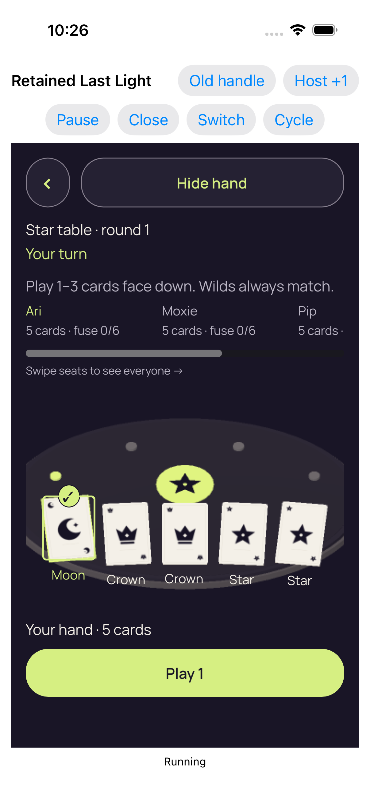</a> | **Real reveal and card selection** iPhone 17 simulator, actual native Last Light retained host Original: [9CAFD804-947D-480E-B80E-DE5A89AE2CC6.png](attachments/9CAFD804-947D-480E-B80E-DE5A89AE2CC6.png) 1206 × 2622 px; text scale not separately recorded SHA-256: <code>d013486cab1e5b4983660eeaee85abb1e8a97aec219b335300e3e16119229cca</code> [Original paired measurements](evidence/attachments/B58CC072-E713-4793-8386-42957B3A8263.json) Recorded enclosing case: Success Entry 4 has a visible selected Moon marker, readable rank captions and a complete Play 1 action. |
| <a href="attachments/30127409-6522-40AB-A180-FD674FEB5A40.png">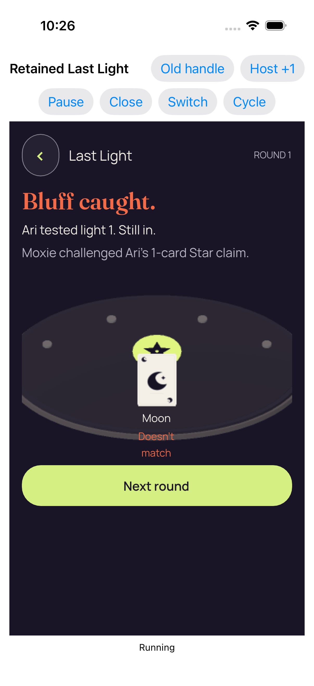</a> | **Real play accepted by the Kotlin authority** iPhone 17 simulator, actual native Last Light retained host Original: [30127409-6522-40AB-A180-FD674FEB5A40.png](attachments/30127409-6522-40AB-A180-FD674FEB5A40.png) 1206 × 2622 px; text scale not separately recorded SHA-256: <code>03ed90b6392d08422ec36d2508939c74adc2b07f4dcc98385520ec584585f081</code> [Original paired measurements](evidence/attachments/772A4B1C-4F3A-4445-97B9-D8C1D6297AD5.json) Recorded enclosing case: Success Entry 4&#x27;s accepted play shows the Moon mismatch and a complete Next round action. |
| <a href="attachments/A61FC7E9-1E6C-4214-8BDA-6F213E8C6E49.png">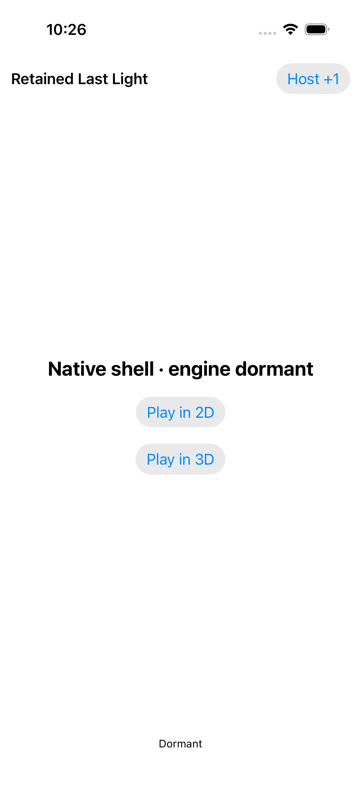</a> | **Whole recipient scene retired; retained services dormant** iPhone 17 simulator, actual native Last Light retained host Original: [A61FC7E9-1E6C-4214-8BDA-6F213E8C6E49.png](attachments/A61FC7E9-1E6C-4214-8BDA-6F213E8C6E49.png) 1206 × 2622 px; text scale not separately recorded SHA-256: <code>29259021961c5b958ce37fbba39ff1af52c46efcaa7dc7d2ac0080961faf592e</code> [Original paired measurements](evidence/attachments/4D113D7F-5ED1-4120-93AC-F55074B90B23.json) Recorded enclosing case: Success Entry 4 retires to the native dormant shell with both entry actions. |
|  | **Four completed real entries in one retained engine process** iPhone 17 simulator, actual native Last Light retained host Original: [523C1E22-CC65-429E-808A-014AD084CEEF.png](attachments/523C1E22-CC65-429E-808A-014AD084CEEF.png) 1206 × 2622 px; text scale not separately recorded SHA-256: <code>29259021961c5b958ce37fbba39ff1af52c46efcaa7dc7d2ac0080961faf592e</code> [Original paired measurements](evidence/attachments/2B282012-FB80-49FE-A0FE-1ECF674370F7.json) Recorded enclosing case: Success The final repeated-entry capture remains a clean native dormant shell. Its distinct original measurements record the four completed entries and one retained process. |

## Stale Ready / close-completion reentry

The stale-Ready/close-completion reentry case fails waiting for current renderer diagnostics. Its later failure capture visibly shows a concealed 3D table; this does not satisfy the failed wait or establish the old-handle probe and subsequent play/exit.

| Original image | Scenario and provenance |
| --- | --- |
|  | **Failed retained observation** iPhone 17 simulator, actual native Last Light retained host Original: [7129E448-B2DD-4C20-B8E9-3F949AAA8F2B.png](attachments/7129E448-B2DD-4C20-B8E9-3F949AAA8F2B.png) 1206 × 2622 px; text scale not separately recorded SHA-256: <code>12f0f1106405212ca7ad60bfae5189f4b155d9d5f1861983f0b9a01c4c3770c1</code> [Original paired measurements](evidence/attachments/D7FB9236-0931-4E26-800D-17C034246074.json) Recorded enclosing case: Failure The failure attachment visibly renders five covered 3D cards, Show hand and disabled Select cards. Old handle is present in the test header, but the probe was not reached; the later visible frame cannot turn the original diagnostic timeout into a pass. |
