# iOS corrected retained-host diagnostic — CI 34515678208

[All collections](../README.md) · [Preserved evidence index](evidence-index.md) · [Copy/review binding](../android-34515669045/provenance/publication-review/partydeck-gallery-3433-publication-binding-v1.json) · [Completed focused review](provenance/publication-review/partydeck-gallery-after-2815-retained34515678208-visual-review-v1.json) · [Source mapping](provenance/source-map/native-gallery-map.json)

**Two retained-host cases pass; stale second-3D-entry diagnostics fails. All native qualification gates are false.**

The background case passes in 111.587 seconds and repeated 2D/3D passes in 130.345 seconds. Stale second-3D-entry diagnostics fails in 47.996 seconds. Every native qualification gate remains false. The MSAA-disabled diagnostic pack is `c8d2b0989524c66715fd7469b7a8315a6fd2fb8563ec87bd2294d60b4ebbcd4a`.

Ten priority originals were directly viewed; 18 others remain explicitly unviewed. Both reviewed initial concealed 2D entries place Reveal below the body clip. Lower-scroll selected states show a selected Moon, two complete Crowns, a horizontal hand scroll and full Claim 1 Star. The public 2D result fits Deal next round while seat details clip. Foreground/background return stills show full cover/Reveal at lower scroll with no private face visible. The failed 3D capture renders a concealed Star table and Running, with complete Show hand/Select cards, horizontally clipped later seats and a visibly stepped table rim. These stills do not satisfy the failed diagnostics deadline or establish its cause or continuous privacy.

Source revision: `3616960b3162e658fd1a428a73b82f2a569f4d2a`. CI run: [34515678208](https://github.com/Apdelrahman1911/PartyDeck/actions/runs/34515678208). 28 original PNG identities. Review methods: 18 unviewed original — no visual acceptance, 10 direct original view.

Every thumbnail opens the unchanged original PNG. **UNVIEWED** means no direct pixel review or visual acceptance is asserted. Matching bytes reuse only earlier pixel observations. Each source, scenario and original outcome remains separate. Frozen review plans retain their historical pending flags; the completed focused-review receipt records the final status. No new derivative image or video decoding was performed.

| Original capture | Original identity and evidence | Review status and observation |
| --- | --- | --- |
|  <code>F50EEE71-DED8-4679-9272-E187B0FBD80A.png</code> Dormant application lifecycle did not restart the engine services_0_6D709458-CE0E-4F40-96D1-834C581DF7F2.png | 1206 × 2622 px · 99,304 bytes SHA-256: <code>0f829bc7a2f406afadf5a922178e6a1984b32707270d9c9343d031e52220274b</code> Source: <code>/root/projects/PartyDeck/artifacts/evidence-storage/34515678208/godot-ios-retained-host-test-attempt-1/retained-host-test/artifacts/attachments/F50EEE71-DED8-4679-9272-E187B0FBD80A.png</code> Original case: <code>RetainedHostUITests/testActiveAndDormantBackgroundTransitionsStayConcealed()</code> — **passed** Original timestamp: 1789066399.991 [Original result](evidence/result.json) · [Attachment index](companions.md) | **UNVIEWED original — no visual acceptance**. Original capture preserved without direct visual review. The original attachment label, timestamp and case outcome are retained as source metadata; no pixel observation or visual acceptance is asserted. |
|  <code>307F50F0-6984-405D-83A6-70CD0FF5C627.png</code> Whole recipient scene retired; retained services dormant_0_07D5CD48-2647-4975-9551-C72A8CC6A3D7.png | 1206 × 2622 px · 99,304 bytes SHA-256: <code>0f829bc7a2f406afadf5a922178e6a1984b32707270d9c9343d031e52220274b</code> Source: <code>/root/projects/PartyDeck/artifacts/evidence-storage/34515678208/godot-ios-retained-host-test-attempt-1/retained-host-test/artifacts/attachments/307F50F0-6984-405D-83A6-70CD0FF5C627.png</code> Original case: <code>RetainedHostUITests/testActiveAndDormantBackgroundTransitionsStayConcealed()</code> — **passed** Original timestamp: 1789066399.519 [Original result](evidence/result.json) · [Attachment index](companions.md) | **UNVIEWED original — no visual acceptance**. Original capture preserved without direct visual review. The original attachment label, timestamp and case outcome are retained as source metadata; no pixel observation or visual acceptance is asserted. |
| <a href="attachments/8EE7D1A1-29F3-4F5A-9C03-F290B63D409D.png">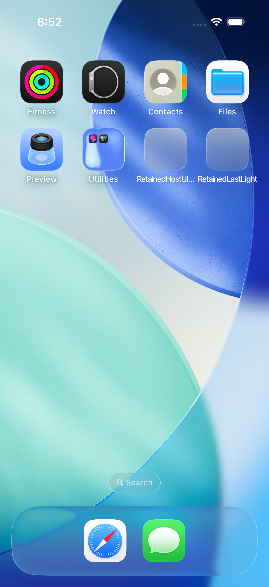</a> <code>8EE7D1A1-29F3-4F5A-9C03-F290B63D409D.png</code> Actual Home screen_0_CFA7CAF1-0CEE-4C58-9EB3-C37DB9438EC1.png | 1206 × 2622 px · 2,805,609 bytes SHA-256: <code>96a910f6767484f40dcf0cd10589a5bf1fd0c1e0c5ea669a25f902b0b0cfba86</code> Source: <code>/root/projects/PartyDeck/artifacts/evidence-storage/34515678208/godot-ios-retained-host-test-attempt-1/retained-host-test/artifacts/attachments/8EE7D1A1-29F3-4F5A-9C03-F290B63D409D.png</code> Original case: <code>RetainedHostUITests/testActiveAndDormantBackgroundTransitionsStayConcealed()</code> — **passed** Original timestamp: 1789066377.753 [Original result](evidence/result.json) · [Attachment index](companions.md) | **UNVIEWED original — no visual acceptance**. Original capture preserved without direct visual review. The original attachment label, timestamp and case outcome are retained as source metadata; no pixel observation or visual acceptance is asserted. |
| <a href="attachments/1C0B4223-C568-4C72-9E51-C243A63A1702.png">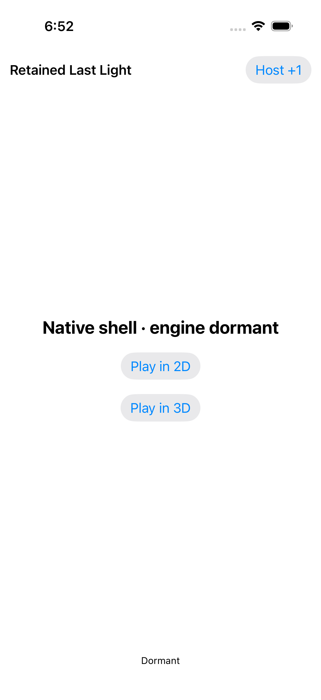</a> <code>1C0B4223-C568-4C72-9E51-C243A63A1702.png</code> Whole recipient scene retired; retained services dormant_0_E1635204-6B33-4090-91D6-364C6D0B3A92.png | 1206 × 2622 px · 99,172 bytes SHA-256: <code>ac4c82ce097bbf1efbd15b4ab3de426565b4d82d72e7db76620f0a75673b3c02</code> Source: <code>/root/projects/PartyDeck/artifacts/evidence-storage/34515678208/godot-ios-retained-host-test-attempt-1/retained-host-test/artifacts/attachments/1C0B4223-C568-4C72-9E51-C243A63A1702.png</code> Original case: <code>RetainedHostUITests/testActiveAndDormantBackgroundTransitionsStayConcealed()</code> — **passed** Original timestamp: 1789066372.086 [Original result](evidence/result.json) · [Attachment index](companions.md) | **UNVIEWED original — no visual acceptance**. Original capture preserved without direct visual review. The original attachment label, timestamp and case outcome are retained as source metadata; no pixel observation or visual acceptance is asserted. |
| <a href="attachments/BD2E436D-052A-4F40-9D39-07C876D4D824.png">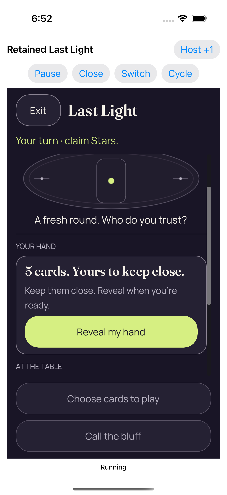</a> <code>BD2E436D-052A-4F40-9D39-07C876D4D824.png</code> Real background and resume kept the same authority concealed_0_A92E571B-8801-4472-B00E-4994C7139713.png | 1206 × 2622 px · 269,492 bytes SHA-256: <code>da30222d7c69f47ce0a34827689c655bbf80a2f83c955bf36136738a5c85a18c</code> Source: <code>/root/projects/PartyDeck/artifacts/evidence-storage/34515678208/godot-ios-retained-host-test-attempt-1/retained-host-test/artifacts/attachments/BD2E436D-052A-4F40-9D39-07C876D4D824.png</code> Original case: <code>RetainedHostUITests/testActiveAndDormantBackgroundTransitionsStayConcealed()</code> — **passed** Original timestamp: 1789066366.722 [Original result](evidence/result.json) · [Attachment index](companions.md) | **Direct original view**. The real background/resume checkpoint shows the 2D hand covered at a lower body scroll position, with full Exit/Last Light and Star turn context. The complete five-card cover, description and Reveal my hand button fit; AT THE TABLE appears below, with seat details beyond the body clip. Both muted fixed lower actions fit. The iOS Home indicator is visible below Running. No private card face appears, but continuous privacy throughout Home/resume is not established by this frame. |
|  <code>2C48742B-2EA3-4E92-A5BF-6F35E732879F.png</code> Actual Home screen_0_E747AC3F-27A8-491A-9E15-609F6F3FD53E.png | 1206 × 2622 px · 2,805,609 bytes SHA-256: <code>9b1fb768272aa7bf7a7c7a9193fd0308f01f62cda0aad85d86fb6e8fbfabb46a</code> Source: <code>/root/projects/PartyDeck/artifacts/evidence-storage/34515678208/godot-ios-retained-host-test-attempt-1/retained-host-test/artifacts/attachments/2C48742B-2EA3-4E92-A5BF-6F35E732879F.png</code> Original case: <code>RetainedHostUITests/testActiveAndDormantBackgroundTransitionsStayConcealed()</code> — **passed** Original timestamp: 1789066365.146 [Original result](evidence/result.json) · [Attachment index](companions.md) | **UNVIEWED original — no visual acceptance**. Original capture preserved without direct visual review. The original attachment label, timestamp and case outcome are retained as source metadata; no pixel observation or visual acceptance is asserted. |
|  <code>DACB47B3-D119-4C0D-9C0B-28A03DB9CE15.png</code> Real reveal and card selection_0_B28C9ABD-D069-409E-9F1B-F4E6732BBE94.png | 1206 × 2622 px · 244,980 bytes SHA-256: <code>5d4ea2fa32a060ff1c5799a670806070cd092f73422a86626db9749403e9dcd2</code> Source: <code>/root/projects/PartyDeck/artifacts/evidence-storage/34515678208/godot-ios-retained-host-test-attempt-1/retained-host-test/artifacts/attachments/DACB47B3-D119-4C0D-9C0B-28A03DB9CE15.png</code> Original case: <code>RetainedHostUITests/testActiveAndDormantBackgroundTransitionsStayConcealed()</code> — **passed** Original timestamp: 1789066360.292 [Original result](evidence/result.json) · [Attachment index](companions.md) | **Direct original view**. The background-case selected 2D checkpoint shows complete Exit/Last Light/Cover and Star turn context. A selected Moon with checkmark and two full Crown cards occupy the visible portion of the horizontally scrolling hand; the main round/rank heading is above the captured body scroll position. Claim 1 Star and muted Call the bluff fit. Retained-host controls and Running are visible. The private faces are explicitly revealed here; no unobserved background interval is judged from this still. |
| <a href="attachments/F9C04F2C-C556-447D-808B-5671A52B6AE4.png">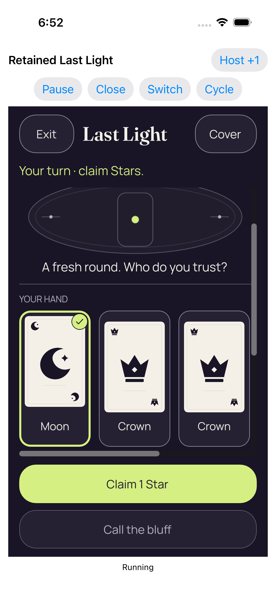</a> <code>F9C04F2C-C556-447D-808B-5671A52B6AE4.png</code> Real reveal and card selection_0_A8C7E3C7-3952-47E3-A8F0-01417644A379.png | 1206 × 2622 px · 244,980 bytes SHA-256: <code>5d4ea2fa32a060ff1c5799a670806070cd092f73422a86626db9749403e9dcd2</code> Source: <code>/root/projects/PartyDeck/artifacts/evidence-storage/34515678208/godot-ios-retained-host-test-attempt-1/retained-host-test/artifacts/attachments/F9C04F2C-C556-447D-808B-5671A52B6AE4.png</code> Original case: <code>RetainedHostUITests/testActiveAndDormantBackgroundTransitionsStayConcealed()</code> — **passed** Original timestamp: 1789066353.727 [Original result](evidence/result.json) · [Attachment index](companions.md) | **UNVIEWED original — no visual acceptance**. Original capture preserved without direct visual review. The original attachment label, timestamp and case outcome are retained as source metadata; no pixel observation or visual acceptance is asserted. |
|  <code>B31451EA-F2FF-46D4-806A-E4436E3AB9FC.png</code> Coalesced native foreground loss and regain returned concealed_0_A2FE6F47-C703-4C17-8012-D6303F3CC54F.png | 1206 × 2622 px · 268,109 bytes SHA-256: <code>75c6078596c6ad7f0a8be120d0c6e7ae1f07f96e759777eee3f31b5aac694b6b</code> Source: <code>/root/projects/PartyDeck/artifacts/evidence-storage/34515678208/godot-ios-retained-host-test-attempt-1/retained-host-test/artifacts/attachments/B31451EA-F2FF-46D4-806A-E4436E3AB9FC.png</code> Original case: <code>RetainedHostUITests/testActiveAndDormantBackgroundTransitionsStayConcealed()</code> — **passed** Original timestamp: 1789066347.666 [Original result](evidence/result.json) · [Attachment index](companions.md) | **Direct original view**. The coalesced foreground-return checkpoint shows the 2D hand covered at a lower body scroll position. Exit/Last Light and Star turn context fit; the round/rank heading is above the body viewport. The entire five-card cover, explanatory copy and Reveal my hand button fit, followed by AT THE TABLE while seat details remain below the body clip. Both muted fixed lower actions fit. No private card face is visible; the still does not establish concealment during the unobserved foreground transition. |
|  <code>6A1A8793-BCC9-4DEB-9292-9A1D8481BFBB.png</code> Real reveal and card selection_0_A28B6C39-EBE7-4444-A373-83AED0CBC9D4.png | 1206 × 2622 px · 244,980 bytes SHA-256: <code>5d4ea2fa32a060ff1c5799a670806070cd092f73422a86626db9749403e9dcd2</code> Source: <code>/root/projects/PartyDeck/artifacts/evidence-storage/34515678208/godot-ios-retained-host-test-attempt-1/retained-host-test/artifacts/attachments/6A1A8793-BCC9-4DEB-9292-9A1D8481BFBB.png</code> Original case: <code>RetainedHostUITests/testActiveAndDormantBackgroundTransitionsStayConcealed()</code> — **passed** Original timestamp: 1789066345.861 [Original result](evidence/result.json) · [Attachment index](companions.md) | **UNVIEWED original — no visual acceptance**. Original capture preserved without direct visual review. The original attachment label, timestamp and case outcome are retained as source metadata; no pixel observation or visual acceptance is asserted. |
|  <code>5EA9DE95-BB17-4230-BEDA-6749593C863E.png</code> Four completed real entries in one retained engine process_0_9C98B0C6-845F-42F8-881D-0012B6485A15.png | 1206 × 2622 px · 98,694 bytes SHA-256: <code>7d825dd49b065c68b32d79b549b105c8b8e79626901421974d20e4365889e0f5</code> Source: <code>/root/projects/PartyDeck/artifacts/evidence-storage/34515678208/godot-ios-retained-host-test-attempt-1/retained-host-test/artifacts/attachments/5EA9DE95-BB17-4230-BEDA-6749593C863E.png</code> Original case: <code>RetainedHostUITests/testRepeated2DAnd3DKeepOneDormantEngine()</code> — **passed** Original timestamp: 1789066533.494 [Original result](evidence/result.json) · [Attachment index](companions.md) | **UNVIEWED original — no visual acceptance**. Original capture preserved without direct visual review. The original attachment label, timestamp and case outcome are retained as source metadata; no pixel observation or visual acceptance is asserted. |
|  <code>4BB1EF6B-2E0B-4D6C-87CF-E71D0D696B18.png</code> Whole recipient scene retired; retained services dormant_0_F409BA7D-A5DE-4EF1-B99D-17DC6C9A93C4.png | 1206 × 2622 px · 98,694 bytes SHA-256: <code>7d825dd49b065c68b32d79b549b105c8b8e79626901421974d20e4365889e0f5</code> Source: <code>/root/projects/PartyDeck/artifacts/evidence-storage/34515678208/godot-ios-retained-host-test-attempt-1/retained-host-test/artifacts/attachments/4BB1EF6B-2E0B-4D6C-87CF-E71D0D696B18.png</code> Original case: <code>RetainedHostUITests/testRepeated2DAnd3DKeepOneDormantEngine()</code> — **passed** Original timestamp: 1789066532.368 [Original result](evidence/result.json) · [Attachment index](companions.md) | **UNVIEWED original — no visual acceptance**. Original capture preserved without direct visual review. The original attachment label, timestamp and case outcome are retained as source metadata; no pixel observation or visual acceptance is asserted. |
|  <code>49C4BC9B-8B55-413C-967F-8734A0B94A3D.png</code> Real play accepted by the Kotlin authority_0_3EF89BA7-F739-4615-95AB-92ED4C25BA0D.png | 1206 × 2622 px · 215,020 bytes SHA-256: <code>2a3c166e74c9df9a7ec41281c82e5bc1eabe48828d823dfc016a50bfc5414f46</code> Source: <code>/root/projects/PartyDeck/artifacts/evidence-storage/34515678208/godot-ios-retained-host-test-attempt-1/retained-host-test/artifacts/attachments/49C4BC9B-8B55-413C-967F-8734A0B94A3D.png</code> Original case: <code>RetainedHostUITests/testRepeated2DAnd3DKeepOneDormantEngine()</code> — **passed** Original timestamp: 1789066529.046 [Original result](evidence/result.json) · [Attachment index](companions.md) | **UNVIEWED original — no visual acceptance**. Original capture preserved without direct visual review. The original attachment label, timestamp and case outcome are retained as source metadata; no pixel observation or visual acceptance is asserted. |
| <a href="attachments/ED97DB82-902A-4748-9971-85DD3F972219.png">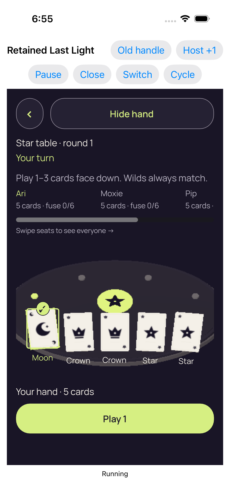</a> <code>ED97DB82-902A-4748-9971-85DD3F972219.png</code> Real reveal and card selection_0_B49C4409-18D5-491F-9333-178E32B366FF.png | 1206 × 2622 px · 305,936 bytes SHA-256: <code>aba3bde1241b1a6f757654ce54062aee4c09d8b34aca61bf079dc8e3ffda14a8</code> Source: <code>/root/projects/PartyDeck/artifacts/evidence-storage/34515678208/godot-ios-retained-host-test-attempt-1/retained-host-test/artifacts/attachments/ED97DB82-902A-4748-9971-85DD3F972219.png</code> Original case: <code>RetainedHostUITests/testRepeated2DAnd3DKeepOneDormantEngine()</code> — **passed** Original timestamp: 1789066524.316 [Original result](evidence/result.json) · [Attachment index](companions.md) | **UNVIEWED original — no visual acceptance**. Original capture preserved without direct visual review. The original attachment label, timestamp and case outcome are retained as source metadata; no pixel observation or visual acceptance is asserted. |
|  <code>08A9F212-8F9D-41EE-BAD8-56217E8C4272.png</code> Entry 4 fresh concealed 3d_0_E165CE34-298F-46F7-A733-4147AE392306.png | 1206 × 2622 px · 351,266 bytes SHA-256: <code>18f931f219f98bf1ea2f7c352d773fbd9ad27cfd88cf513fd055e815eb4e1331</code> Source: <code>/root/projects/PartyDeck/artifacts/evidence-storage/34515678208/godot-ios-retained-host-test-attempt-1/retained-host-test/artifacts/attachments/08A9F212-8F9D-41EE-BAD8-56217E8C4272.png</code> Original case: <code>RetainedHostUITests/testRepeated2DAnd3DKeepOneDormantEngine()</code> — **passed** Original timestamp: 1789066509.455 [Original result](evidence/result.json) · [Attachment index](companions.md) | **UNVIEWED original — no visual acceptance**. Original capture preserved without direct visual review. The original attachment label, timestamp and case outcome are retained as source metadata; no pixel observation or visual acceptance is asserted. |
|  <code>689CDB36-8192-4836-87D1-7BB4D7119E30.png</code> Whole recipient scene retired; retained services dormant_0_BD2EBF3D-B62B-45E4-A87D-81BCB6A67A49.png | 1206 × 2622 px · 98,944 bytes SHA-256: <code>385ed23b0fd2129646966e8949be203ad97999d7911bfc8c0779341d9fac9f19</code> Source: <code>/root/projects/PartyDeck/artifacts/evidence-storage/34515678208/godot-ios-retained-host-test-attempt-1/retained-host-test/artifacts/attachments/689CDB36-8192-4836-87D1-7BB4D7119E30.png</code> Original case: <code>RetainedHostUITests/testRepeated2DAnd3DKeepOneDormantEngine()</code> — **passed** Original timestamp: 1789066497.198 [Original result](evidence/result.json) · [Attachment index](companions.md) | **UNVIEWED original — no visual acceptance**. Original capture preserved without direct visual review. The original attachment label, timestamp and case outcome are retained as source metadata; no pixel observation or visual acceptance is asserted. |
| <a href="attachments/FB50F434-D4A0-477A-B06E-5D460A601E10.png">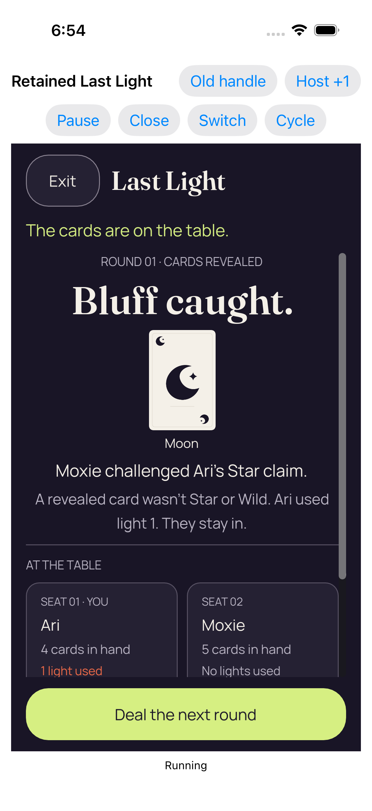</a> <code>FB50F434-D4A0-477A-B06E-5D460A601E10.png</code> Real play accepted by the Kotlin authority_0_BC24A8B2-274E-46E6-B7E5-E46D8004DDA7.png | 1206 × 2622 px · 273,091 bytes SHA-256: <code>301ea9be5184653ebac9449470899a4f4c2652087f4d662981cee45a754ddaf1</code> Source: <code>/root/projects/PartyDeck/artifacts/evidence-storage/34515678208/godot-ios-retained-host-test-attempt-1/retained-host-test/artifacts/attachments/FB50F434-D4A0-477A-B06E-5D460A601E10.png</code> Original case: <code>RetainedHostUITests/testRepeated2DAnd3DKeepOneDormantEngine()</code> — **passed** Original timestamp: 1789066494.794 [Original result](evidence/result.json) · [Attachment index](companions.md) | **Direct original view**. The third-entry 2D public result shows Bluff caught, a Moon card, Moxie challenged Ari’s Star claim, and the full explanation that Ari used light 1 and stays in. The initial Ari/Moxie seat panels continue below the body clip while Deal the next round fits fully. Old handle is visible in the retained shell. The source case passes, but this still does not qualify the separate failed lifecycle case or continuous privacy. |
| <a href="attachments/648C51B5-F60B-485E-ABB6-A6C0CAA57795.png">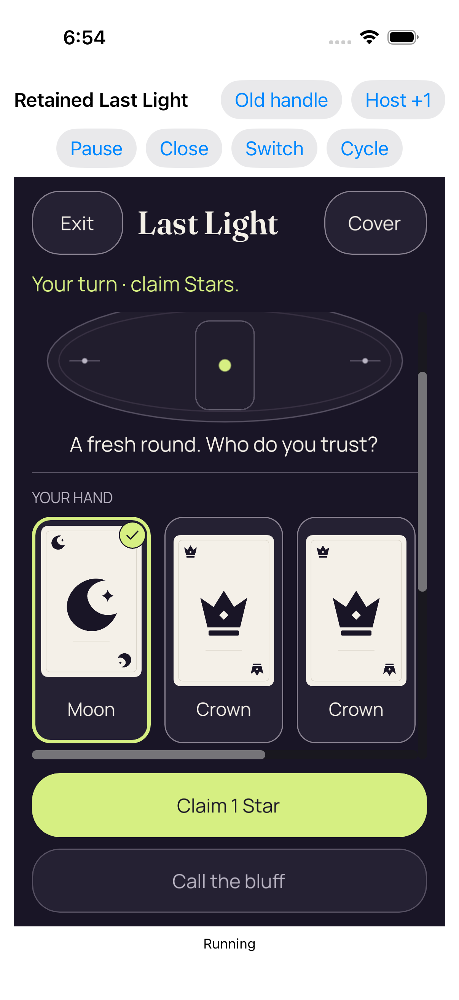</a> <code>648C51B5-F60B-485E-ABB6-A6C0CAA57795.png</code> Real reveal and card selection_0_FE81C10E-4CD6-44E7-BDBD-63A0A655E8DA.png | 1206 × 2622 px · 249,918 bytes SHA-256: <code>939909fd6b8f73f75cef8326322fc23d805f6ff272d960ffb9358424266a7a7f</code> Source: <code>/root/projects/PartyDeck/artifacts/evidence-storage/34515678208/godot-ios-retained-host-test-attempt-1/retained-host-test/artifacts/attachments/648C51B5-F60B-485E-ABB6-A6C0CAA57795.png</code> Original case: <code>RetainedHostUITests/testRepeated2DAnd3DKeepOneDormantEngine()</code> — **passed** Original timestamp: 1789066491.964 [Original result](evidence/result.json) · [Attachment index](companions.md) | **Direct original view**. The third-entry selected 2D original shows the retained Old handle control and full Exit/Last Light/Cover header. At the captured lower body scroll position, a selected Moon with checkmark and two complete Crown cards fit above the horizontal scrollbar. Claim 1 Star and muted Call the bluff fit fully. The round/rank heading is above the body viewport. These are explicitly revealed private faces; no between-capture privacy behavior is inferred. |
| <a href="attachments/1D802C05-3D04-4A03-943C-D93896F69EF5.png">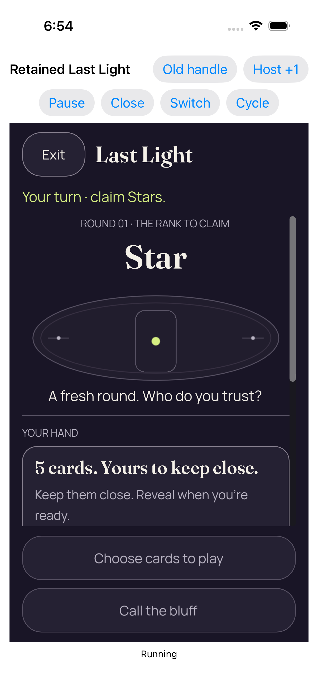</a> <code>1D802C05-3D04-4A03-943C-D93896F69EF5.png</code> Entry 3 fresh concealed 2d_0_14FD47EA-A623-4577-B73E-A6E71410890E.png | 1206 × 2622 px · 277,637 bytes SHA-256: <code>21e51bf306673cb2760980b4a26a4d1a12ab762c5d41250665c32f7491a9aaf4</code> Source: <code>/root/projects/PartyDeck/artifacts/evidence-storage/34515678208/godot-ios-retained-host-test-attempt-1/retained-host-test/artifacts/attachments/1D802C05-3D04-4A03-943C-D93896F69EF5.png</code> Original case: <code>RetainedHostUITests/testRepeated2DAnd3DKeepOneDormantEngine()</code> — **passed** Original timestamp: 1789066482.393 [Original result](evidence/result.json) · [Attachment index](companions.md) | **Direct original view**. The third-entry concealed 2D original shows Old handle in the retained-host chrome, then Exit/Last Light, the Star turn prompt, Round 01/Star, table illustration and fresh-round copy. The cover headline and description are visible but Reveal is entirely below the body clip; both muted fixed actions fit. No private card face appears. This remains a separate reentry capture and provides no measured native margin or continuous-privacy conclusion. |
|  <code>CADA0B8A-DC61-47CF-A058-300F37AF66C0.png</code> Whole recipient scene retired; retained services dormant_0_FA87CDE1-3080-4C53-A778-DAB2B203BB09.png | 1206 × 2622 px · 98,944 bytes SHA-256: <code>385ed23b0fd2129646966e8949be203ad97999d7911bfc8c0779341d9fac9f19</code> Source: <code>/root/projects/PartyDeck/artifacts/evidence-storage/34515678208/godot-ios-retained-host-test-attempt-1/retained-host-test/artifacts/attachments/CADA0B8A-DC61-47CF-A058-300F37AF66C0.png</code> Original case: <code>RetainedHostUITests/testRepeated2DAnd3DKeepOneDormantEngine()</code> — **passed** Original timestamp: 1789066478.02 [Original result](evidence/result.json) · [Attachment index](companions.md) | **UNVIEWED original — no visual acceptance**. Original capture preserved without direct visual review. The original attachment label, timestamp and case outcome are retained as source metadata; no pixel observation or visual acceptance is asserted. |
| <a href="attachments/53C36E84-6F9E-44A9-A2E9-12BB4448FA73.png">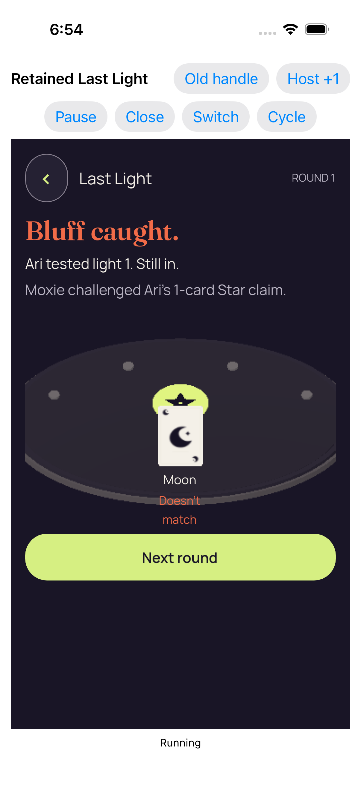</a> <code>53C36E84-6F9E-44A9-A2E9-12BB4448FA73.png</code> Real play accepted by the Kotlin authority_0_EFB06AF3-F47B-49E8-8B3E-6F03F68FB681.png | 1206 × 2622 px · 215,250 bytes SHA-256: <code>0e5f877c1e3cafceed372e9a3d44a9d1c3d7691c466bc079f7ce02439b164497</code> Source: <code>/root/projects/PartyDeck/artifacts/evidence-storage/34515678208/godot-ios-retained-host-test-attempt-1/retained-host-test/artifacts/attachments/53C36E84-6F9E-44A9-A2E9-12BB4448FA73.png</code> Original case: <code>RetainedHostUITests/testRepeated2DAnd3DKeepOneDormantEngine()</code> — **passed** Original timestamp: 1789066473.934 [Original result](evidence/result.json) · [Attachment index](companions.md) | **UNVIEWED original — no visual acceptance**. Original capture preserved without direct visual review. The original attachment label, timestamp and case outcome are retained as source metadata; no pixel observation or visual acceptance is asserted. |
| <a href="attachments/D82F2178-94DD-44F6-AAA3-30B3267610AB.png">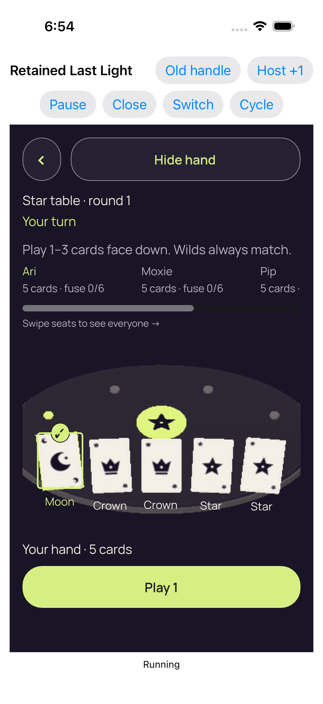</a> <code>D82F2178-94DD-44F6-AAA3-30B3267610AB.png</code> Real reveal and card selection_0_811CC3E6-BF3F-417E-8D12-E6B6DC4032A9.png | 1206 × 2622 px · 306,246 bytes SHA-256: <code>71b2b52c50275b15294ce4966a31fcfa107e1f58d0a0600a7aca05f314abc841</code> Source: <code>/root/projects/PartyDeck/artifacts/evidence-storage/34515678208/godot-ios-retained-host-test-attempt-1/retained-host-test/artifacts/attachments/D82F2178-94DD-44F6-AAA3-30B3267610AB.png</code> Original case: <code>RetainedHostUITests/testRepeated2DAnd3DKeepOneDormantEngine()</code> — **passed** Original timestamp: 1789066461.714 [Original result](evidence/result.json) · [Attachment index](companions.md) | **UNVIEWED original — no visual acceptance**. Original capture preserved without direct visual review. The original attachment label, timestamp and case outcome are retained as source metadata; no pixel observation or visual acceptance is asserted. |
| <a href="attachments/E361F57B-64EA-4483-A411-1A96FA9F3A2E.png">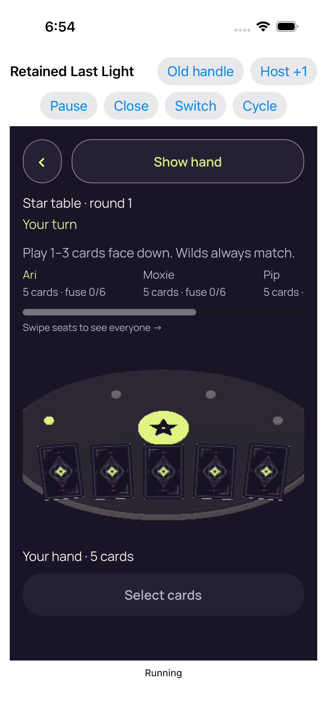</a> <code>E361F57B-64EA-4483-A411-1A96FA9F3A2E.png</code> Entry 2 fresh concealed 3d_0_02CAFB29-0DCE-4986-B61D-94B8326F1B26.png | 1206 × 2622 px · 351,559 bytes SHA-256: <code>32617c210bc1376aefe3d88e45644f78421f60efd11693bea5ae5f520a8fd307</code> Source: <code>/root/projects/PartyDeck/artifacts/evidence-storage/34515678208/godot-ios-retained-host-test-attempt-1/retained-host-test/artifacts/attachments/E361F57B-64EA-4483-A411-1A96FA9F3A2E.png</code> Original case: <code>RetainedHostUITests/testRepeated2DAnd3DKeepOneDormantEngine()</code> — **passed** Original timestamp: 1789066446.604 [Original result](evidence/result.json) · [Attachment index](companions.md) | **UNVIEWED original — no visual acceptance**. Original capture preserved without direct visual review. The original attachment label, timestamp and case outcome are retained as source metadata; no pixel observation or visual acceptance is asserted. |
|  <code>DDD578FC-F2B7-4F2D-B6BA-4A02255A765A.png</code> Whole recipient scene retired; retained services dormant_0_985A014B-5525-4160-ADFA-699DB5CBC1B6.png | 1206 × 2622 px · 99,304 bytes SHA-256: <code>0f829bc7a2f406afadf5a922178e6a1984b32707270d9c9343d031e52220274b</code> Source: <code>/root/projects/PartyDeck/artifacts/evidence-storage/34515678208/godot-ios-retained-host-test-attempt-1/retained-host-test/artifacts/attachments/DDD578FC-F2B7-4F2D-B6BA-4A02255A765A.png</code> Original case: <code>RetainedHostUITests/testRepeated2DAnd3DKeepOneDormantEngine()</code> — **passed** Original timestamp: 1789066432.359 [Original result](evidence/result.json) · [Attachment index](companions.md) | **UNVIEWED original — no visual acceptance**. Original capture preserved without direct visual review. The original attachment label, timestamp and case outcome are retained as source metadata; no pixel observation or visual acceptance is asserted. |
| <a href="attachments/C7E2A804-B8BF-47B6-B83A-880F9A3E65EA.png">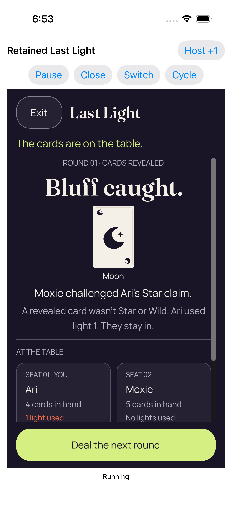</a> <code>C7E2A804-B8BF-47B6-B83A-880F9A3E65EA.png</code> Real play accepted by the Kotlin authority_0_4D1D95EA-D05C-4BE4-AD30-C95D6C0A137C.png | 1206 × 2622 px · 268,276 bytes SHA-256: <code>5452a7ec29eb0d4ea8b83daafde84492466110fba056605662e00fee53a61153</code> Source: <code>/root/projects/PartyDeck/artifacts/evidence-storage/34515678208/godot-ios-retained-host-test-attempt-1/retained-host-test/artifacts/attachments/C7E2A804-B8BF-47B6-B83A-880F9A3E65EA.png</code> Original case: <code>RetainedHostUITests/testRepeated2DAnd3DKeepOneDormantEngine()</code> — **passed** Original timestamp: 1789066429.898 [Original result](evidence/result.json) · [Attachment index](companions.md) | **Direct original view**. The 2D round result shows The cards are on the table, Round 01 · Cards revealed, Bluff caught, a public Moon card, Moxie challenged Ari’s Star claim and the full explanation that Ari used light 1 and stays in. The first numbered Ari/Moxie seat panels continue below the body clip. The full Deal the next round action fits beneath them. This original is labelled Real play accepted by the Kotlin authority in a passed case; the still itself does not establish the complete lifecycle or continuous privacy. |
|  <code>075D989C-C82F-43F6-8EB7-35D7046B297A.png</code> Real reveal and card selection_0_37FB8618-C767-47FE-B93F-841BF2622D35.png | 1206 × 2622 px · 245,119 bytes SHA-256: <code>ea27ab704b72cb6d4b1c01306c53d94e83528ad5df87d8c8408a2e74f13b962d</code> Source: <code>/root/projects/PartyDeck/artifacts/evidence-storage/34515678208/godot-ios-retained-host-test-attempt-1/retained-host-test/artifacts/attachments/075D989C-C82F-43F6-8EB7-35D7046B297A.png</code> Original case: <code>RetainedHostUITests/testRepeated2DAnd3DKeepOneDormantEngine()</code> — **passed** Original timestamp: 1789066427.113 [Original result](evidence/result.json) · [Attachment index](companions.md) | **Direct original view**. The selected 2D hand is shown at a lower body scroll position: Exit/Last Light/Cover and the Star turn prompt remain visible, while the round/rank heading is above the body viewport. A selected Moon has a bright outline and checkmark beside two complete Crown cards; the horizontal scrollbar indicates remaining hand content. Claim 1 Star and muted Call the bluff fit fully. The private faces belong to the explicitly revealed/selected checkpoint; this still does not establish the input or privacy behavior between captures. |
| <a href="attachments/D9C42064-37AD-45F6-BEE2-1847A449AEF3.png">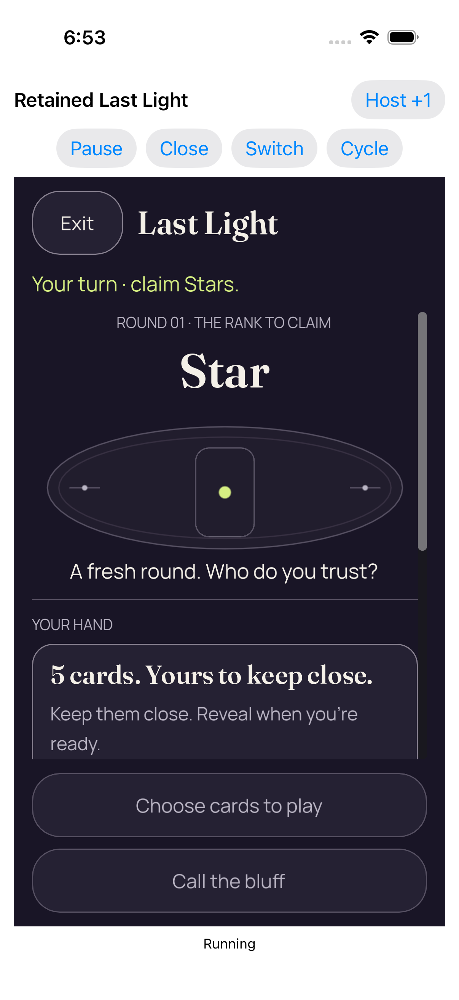</a> <code>D9C42064-37AD-45F6-BEE2-1847A449AEF3.png</code> Entry 1 fresh concealed 2d_0_A9EB3797-F554-4911-83FE-6D953A7D0A3E.png | 1206 × 2622 px · 272,672 bytes SHA-256: <code>d047215a2cb1286ce072f5ff0662a565576bc98681caec465e9009aedfad16ca</code> Source: <code>/root/projects/PartyDeck/artifacts/evidence-storage/34515678208/godot-ios-retained-host-test-attempt-1/retained-host-test/artifacts/attachments/D9C42064-37AD-45F6-BEE2-1847A449AEF3.png</code> Original case: <code>RetainedHostUITests/testRepeated2DAnd3DKeepOneDormantEngine()</code> — **passed** Original timestamp: 1789066418.753 [Original result](evidence/result.json) · [Attachment index](companions.md) | **Direct original view**. The first concealed 2D entry shows Exit/Last Light, Your turn · claim Stars, Round 01/Star, the table illustration and A fresh round. Who do you trust? The cover headline and explanatory copy are visible, but Reveal is entirely below the body clip. Both muted fixed lower actions fit. Retained-host controls and Running are visible; no private card face appears. This native still provides no measured margin, initial zero-scroll or continuous-privacy acceptance. |
|  <code>782F2AD0-DCF1-4596-B905-1E2DD4F9F4F0.png</code> Failed retained observation_0_129A928C-77EA-456D-8DE0-305CE9B8550E.png | 1206 × 2622 px · 351,300 bytes SHA-256: <code>f20b394de4859e81a4ef0a0ee6d498577fbfa9f50a79e857e2e67dd0d693e049</code> Source: <code>/root/projects/PartyDeck/artifacts/evidence-storage/34515678208/godot-ios-retained-host-test-attempt-1/retained-host-test/artifacts/attachments/782F2AD0-DCF1-4596-B905-1E2DD4F9F4F0.png</code> Original case: <code>RetainedHostUITests/testStaleFirstReadyAndCloseCompletionReentry()</code> — **failed** Original timestamp: 1789066580.695 [Original result](evidence/result.json) · [Attachment index](companions.md) | **Direct original view**. The failed retained observation shows the full retained-host controls and a rendered 3D Star table, round 1, Your turn. Show hand, instructions, Ari/Moxie seat context, the horizontal seat-scroll hint, five card backs, Your hand · 5 cards and the muted Select cards control are visible. Pip details continue beyond the horizontal seat clip. The table rim has visibly stepped edges. The shell status reads Running; no private card face is visible. This frame retains the failed stale second-3D-entry diagnostics result and does not establish a passed freshness wait, continuous privacy or a failure cause. |
