# iOS retained-host diagnostic — CI 34520375602

[All collections](../README.md) · [Preserved evidence](evidence-index.md) · [Copy/review binding](provenance/publication-review/publication-binding.json) · [Completed focused review](provenance/publication-review/partydeck-gallery-after-3433-retained34520375602-visual-review-v1.json) · [Frozen source mapping](provenance/source-map/native-gallery-map.json)

**Background and repeated-entry cases pass; stale reentry fails. All native qualification gates remain false.**

Background passes in 133.366 seconds and repeated 2D/3D passes in 235.690 seconds; stale reentry fails in 43.641 seconds. Two directly viewed originals show the compact 2D entry with complete cover/Reveal, turn/rank and fixed lower actions, then the failed concealed Star round-1 3D table with full Show hand/Select cards and Running. The lower No lights used text clips at the 2D scroll boundary; later 3D seats clip horizontally. Twenty-six originals remain explicitly unviewed. The last rejected observation is prepared/WAITING_FOR_READY with empty diagnostics and cover=false; its wait takes 15.577 seconds with a 14.660-second query. A later original is running/READY with the scene applied and passes the exact after:nil predicate, which has no frame-progress clause at that call. Later progress does not undo the timeout.

All six native qualification gates remain false. The original compact MSAA_2X PCK is `557b2297bed133a433acc25efa4837462465dd4e06da659ae5a4cbd792f77fe0`, 1,549,560 bytes. The original MP4 remains unviewed/undecoded. Original stills and separately acquired observations do not establish continuous privacy, timing improvement or a failure cause. Source identity is a frozen derived snapshot; no original target-head archive is asserted.

A separate later ui_game review of this 2D original and the previously published 34515669045 production original concludes ordinary scroll-boundary clipping and recommends no correction. Its companion records a 378 × 655 viewport and TableScroll clip [16, 118, 346, 391]. Those measurements and pinned ScrollContainer semantics are separate from still observations; no native swipe or accessibility execution is inferred. The original frozen visual receipt remains unchanged.

Source revision: `c65e264892ad21ecd8b7f8fba8bc3ae441ab3137`. CI run: [34520375602](https://github.com/Apdelrahman1911/PartyDeck/actions/runs/34520375602). 28 separate original PNGs. Review methods: 26 unviewed original — no visual acceptance, 2 direct original view by review_design.

Every thumbnail opens the unchanged original PNG. **UNVIEWED** means no direct pixel review or visual acceptance is asserted. Byte matching reuses only the earlier reviewed pixels; each execution, scenario and result remains separate. Frozen plans retain their historical pending flags; the completed review records final publication status. No image was recaptured or transformed, and no video was decoded.

| Original capture | Original identity and evidence | Review status and observation |
| --- | --- | --- |
|  <code>104C4B9F-A1A4-4FD7-B08D-CF5D2F21B7D6.png</code> Dormant application lifecycle did not restart the engine services_0_D3E206E2-5C18-4F95-855C-6D24EE418DF4.png | 1206 × 2622 px · 98,355 bytes SHA-256: <code>8cf70c9e6a845941bfc6f330738101c4eb0fe507ea4afe1a21fc6f986e6fa22d</code> Source: <code>/root/projects/PartyDeck/artifacts/evidence-storage/34520375602/godot-ios-retained-host-test-attempt-1/retained-host-test/artifacts/attachments/104C4B9F-A1A4-4FD7-B08D-CF5D2F21B7D6.png</code> Original case: <code>RetainedHostUITests/testActiveAndDormantBackgroundTransitionsStayConcealed()</code> — **passed** Original attachment timestamp: 1789069362.629 [Original result](evidence/result.json) · [Attachment index](companions.md) | **UNVIEWED original — no visual acceptance**. Original capture retained without direct visual review. Its recorded test, label, timestamp and outcome identify the source checkpoint; no pixel observation or visual acceptance is asserted. |
|  <code>929CB5E1-1799-4854-900E-B25D7B91AAEB.png</code> Whole recipient scene retired; retained services dormant_0_B6653EC9-3719-4DC8-B696-FB4ABC964E38.png | 1206 × 2622 px · 98,355 bytes SHA-256: <code>8cf70c9e6a845941bfc6f330738101c4eb0fe507ea4afe1a21fc6f986e6fa22d</code> Source: <code>/root/projects/PartyDeck/artifacts/evidence-storage/34520375602/godot-ios-retained-host-test-attempt-1/retained-host-test/artifacts/attachments/929CB5E1-1799-4854-900E-B25D7B91AAEB.png</code> Original case: <code>RetainedHostUITests/testActiveAndDormantBackgroundTransitionsStayConcealed()</code> — **passed** Original attachment timestamp: 1789069362.381 [Original result](evidence/result.json) · [Attachment index](companions.md) | **UNVIEWED original — no visual acceptance**. Original capture retained without direct visual review. Its recorded test, label, timestamp and outcome identify the source checkpoint; no pixel observation or visual acceptance is asserted. |
|  <code>7D7E1315-44AF-4D20-8571-499DF67A3E62.png</code> Actual Home screen_0_417DD31A-0BED-43A2-A22E-BB96A5DB8F2E.png | 1206 × 2622 px · 2,804,414 bytes SHA-256: <code>4e0aedb75fe2d92f538a046e1806446a9d436ae36187f9dce5436a51e33550b0</code> Source: <code>/root/projects/PartyDeck/artifacts/evidence-storage/34520375602/godot-ios-retained-host-test-attempt-1/retained-host-test/artifacts/attachments/7D7E1315-44AF-4D20-8571-499DF67A3E62.png</code> Original case: <code>RetainedHostUITests/testActiveAndDormantBackgroundTransitionsStayConcealed()</code> — **passed** Original attachment timestamp: 1789069297.229 [Original result](evidence/result.json) · [Attachment index](companions.md) | **UNVIEWED original — no visual acceptance**. Original capture retained without direct visual review. Its recorded test, label, timestamp and outcome identify the source checkpoint; no pixel observation or visual acceptance is asserted. |
| <a href="attachments/C9FD2ED3-744A-4A63-B939-199FC80AFFE9.png">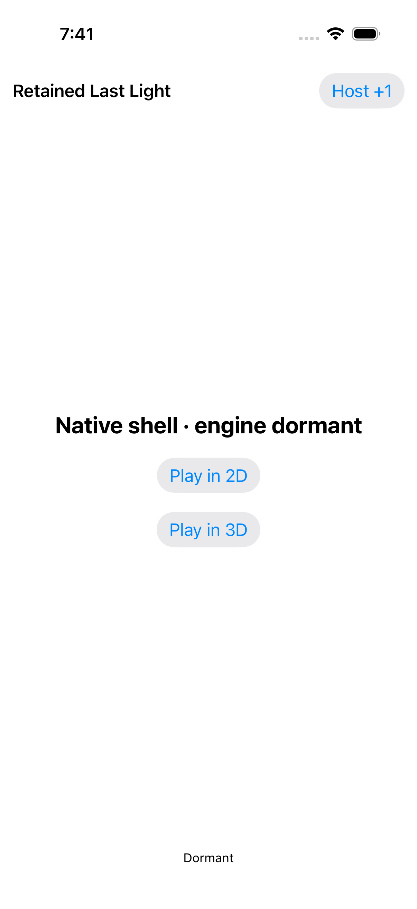</a> <code>C9FD2ED3-744A-4A63-B939-199FC80AFFE9.png</code> Whole recipient scene retired; retained services dormant_0_1AA1DAD7-6B27-4071-A999-D6ACEF83DDFB.png | 1206 × 2622 px · 97,840 bytes SHA-256: <code>e611fd64b89969abd6591de8ed8341ed5c6d1b914f542c9c80677d8f4bc6a940</code> Source: <code>/root/projects/PartyDeck/artifacts/evidence-storage/34520375602/godot-ios-retained-host-test-attempt-1/retained-host-test/artifacts/attachments/C9FD2ED3-744A-4A63-B939-199FC80AFFE9.png</code> Original case: <code>RetainedHostUITests/testActiveAndDormantBackgroundTransitionsStayConcealed()</code> — **passed** Original attachment timestamp: 1789069292.824 [Original result](evidence/result.json) · [Attachment index](companions.md) | **UNVIEWED original — no visual acceptance**. Original capture retained without direct visual review. Its recorded test, label, timestamp and outcome identify the source checkpoint; no pixel observation or visual acceptance is asserted. |
| <a href="attachments/0DB9B036-BD1A-451F-94EE-A2ECFD12BF6E.png">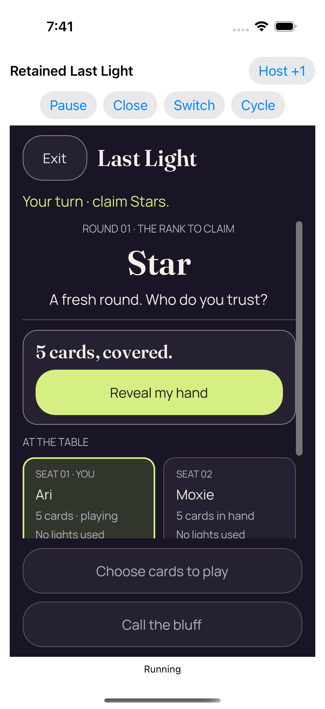</a> <code>0DB9B036-BD1A-451F-94EE-A2ECFD12BF6E.png</code> Real background and resume kept the same authority concealed_0_77796DA5-CAE1-4D43-B7EC-13D5466C99CF.png | 1206 × 2622 px · 264,967 bytes SHA-256: <code>222114d03d835fb94963420485732d713b4bc0cfc595e07327ea1d0f57582a2d</code> Source: <code>/root/projects/PartyDeck/artifacts/evidence-storage/34520375602/godot-ios-retained-host-test-attempt-1/retained-host-test/artifacts/attachments/0DB9B036-BD1A-451F-94EE-A2ECFD12BF6E.png</code> Original case: <code>RetainedHostUITests/testActiveAndDormantBackgroundTransitionsStayConcealed()</code> — **passed** Original attachment timestamp: 1789069289.151 [Original result](evidence/result.json) · [Attachment index](companions.md) | **UNVIEWED original — no visual acceptance**. Original capture retained without direct visual review. Its recorded test, label, timestamp and outcome identify the source checkpoint; no pixel observation or visual acceptance is asserted. |
| <a href="attachments/716319E7-5C87-4653-BD49-A70BEF9B5BBB.png">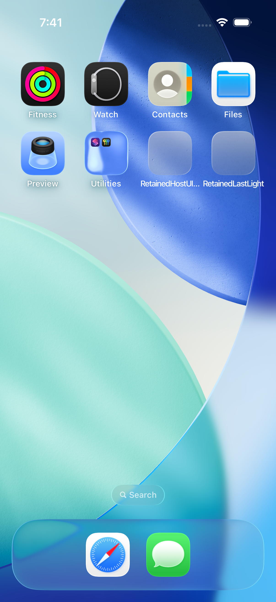</a> <code>716319E7-5C87-4653-BD49-A70BEF9B5BBB.png</code> Actual Home screen_0_F8753D20-C0B1-48A2-88D1-52111E59D75F.png | 1206 × 2622 px · 2,804,359 bytes SHA-256: <code>af42e42a965e1279b0c22f036c0aedc93f0f4285e7bc92d188e9be441059e678</code> Source: <code>/root/projects/PartyDeck/artifacts/evidence-storage/34520375602/godot-ios-retained-host-test-attempt-1/retained-host-test/artifacts/attachments/716319E7-5C87-4653-BD49-A70BEF9B5BBB.png</code> Original case: <code>RetainedHostUITests/testActiveAndDormantBackgroundTransitionsStayConcealed()</code> — **passed** Original attachment timestamp: 1789069287.632 [Original result](evidence/result.json) · [Attachment index](companions.md) | **UNVIEWED original — no visual acceptance**. Original capture retained without direct visual review. Its recorded test, label, timestamp and outcome identify the source checkpoint; no pixel observation or visual acceptance is asserted. |
|  <code>173B5002-ADAC-4FD7-B9D5-63BF874A5C8E.png</code> Real reveal and card selection_0_2BADFB14-B882-4AE8-A421-939C95A290C7.png | 1206 × 2622 px · 239,040 bytes SHA-256: <code>b9324a87cf2b60f1fa25aca0a1d559c5999ea043634c1663236295b07690f5c3</code> Source: <code>/root/projects/PartyDeck/artifacts/evidence-storage/34520375602/godot-ios-retained-host-test-attempt-1/retained-host-test/artifacts/attachments/173B5002-ADAC-4FD7-B9D5-63BF874A5C8E.png</code> Original case: <code>RetainedHostUITests/testActiveAndDormantBackgroundTransitionsStayConcealed()</code> — **passed** Original attachment timestamp: 1789069282.74 [Original result](evidence/result.json) · [Attachment index](companions.md) | **UNVIEWED original — no visual acceptance**. Original capture retained without direct visual review. Its recorded test, label, timestamp and outcome identify the source checkpoint; no pixel observation or visual acceptance is asserted. |
|  <code>D7232367-29BE-44A5-B8D0-FD5D72204A44.png</code> Real reveal and card selection_0_A3A1ABA4-CEF5-476F-81D0-6613981E8769.png | 1206 × 2622 px · 239,040 bytes SHA-256: <code>b9324a87cf2b60f1fa25aca0a1d559c5999ea043634c1663236295b07690f5c3</code> Source: <code>/root/projects/PartyDeck/artifacts/evidence-storage/34520375602/godot-ios-retained-host-test-attempt-1/retained-host-test/artifacts/attachments/D7232367-29BE-44A5-B8D0-FD5D72204A44.png</code> Original case: <code>RetainedHostUITests/testActiveAndDormantBackgroundTransitionsStayConcealed()</code> — **passed** Original attachment timestamp: 1789069270.593 [Original result](evidence/result.json) · [Attachment index](companions.md) | **UNVIEWED original — no visual acceptance**. Original capture retained without direct visual review. Its recorded test, label, timestamp and outcome identify the source checkpoint; no pixel observation or visual acceptance is asserted. |
| <a href="attachments/08D94A4D-EE94-4797-903D-3B0C69DE1B1A.png">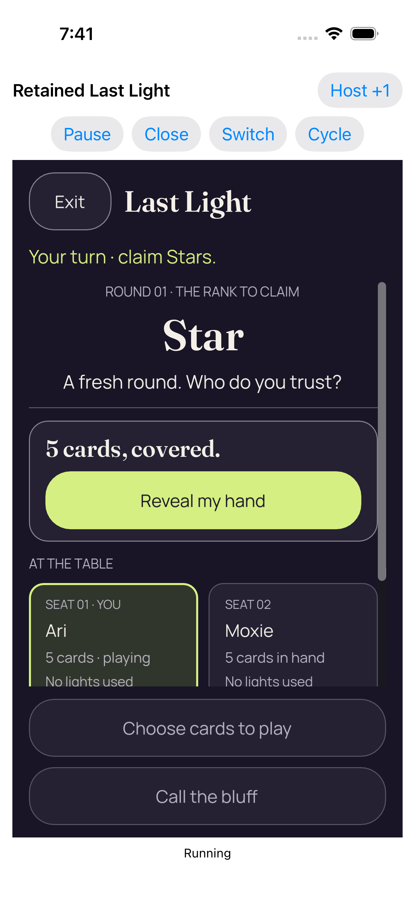</a> <code>08D94A4D-EE94-4797-903D-3B0C69DE1B1A.png</code> Coalesced native foreground loss and regain returned concealed_0_9B679798-5147-4C84-96A6-FEE9A3327B1D.png | 1206 × 2622 px · 263,573 bytes SHA-256: <code>6e341e46e0952015d5434abd5ba2e293d143aac67497d6db3e292237d8dea470</code> Source: <code>/root/projects/PartyDeck/artifacts/evidence-storage/34520375602/godot-ios-retained-host-test-attempt-1/retained-host-test/artifacts/attachments/08D94A4D-EE94-4797-903D-3B0C69DE1B1A.png</code> Original case: <code>RetainedHostUITests/testActiveAndDormantBackgroundTransitionsStayConcealed()</code> — **passed** Original attachment timestamp: 1789069264.265 [Original result](evidence/result.json) · [Attachment index](companions.md) | **UNVIEWED original — no visual acceptance**. Original capture retained without direct visual review. Its recorded test, label, timestamp and outcome identify the source checkpoint; no pixel observation or visual acceptance is asserted. |
|  <code>4F544D0D-E94E-4102-B1A9-7EC39BA4A3F8.png</code> Real reveal and card selection_0_D3C31C3F-6E02-4076-A0EE-46E1D5121EDE.png | 1206 × 2622 px · 239,040 bytes SHA-256: <code>b9324a87cf2b60f1fa25aca0a1d559c5999ea043634c1663236295b07690f5c3</code> Source: <code>/root/projects/PartyDeck/artifacts/evidence-storage/34520375602/godot-ios-retained-host-test-attempt-1/retained-host-test/artifacts/attachments/4F544D0D-E94E-4102-B1A9-7EC39BA4A3F8.png</code> Original case: <code>RetainedHostUITests/testActiveAndDormantBackgroundTransitionsStayConcealed()</code> — **passed** Original attachment timestamp: 1789069262.572 [Original result](evidence/result.json) · [Attachment index](companions.md) | **UNVIEWED original — no visual acceptance**. Original capture retained without direct visual review. Its recorded test, label, timestamp and outcome identify the source checkpoint; no pixel observation or visual acceptance is asserted. |
|  <code>79177A8C-1463-4261-8064-34F4DED4A57E.png</code> Four completed real entries in one retained engine process_0_1B4FBAB7-0B2A-40D3-93BA-6B4C1B6E4CEE.png | 1206 × 2622 px · 98,706 bytes SHA-256: <code>ab0ff4a6e294e0a89186ec440eb4b6a940365bd2d56f98c784712b16d6e8fc62</code> Source: <code>/root/projects/PartyDeck/artifacts/evidence-storage/34520375602/godot-ios-retained-host-test-attempt-1/retained-host-test/artifacts/attachments/79177A8C-1463-4261-8064-34F4DED4A57E.png</code> Original case: <code>RetainedHostUITests/testRepeated2DAnd3DKeepOneDormantEngine()</code> — **passed** Original attachment timestamp: 1789069598.83 [Original result](evidence/result.json) · [Attachment index](companions.md) | **UNVIEWED original — no visual acceptance**. Original capture retained without direct visual review. Its recorded test, label, timestamp and outcome identify the source checkpoint; no pixel observation or visual acceptance is asserted. |
|  <code>746701B4-BB40-49D0-961F-940A9A268D67.png</code> Whole recipient scene retired; retained services dormant_0_BA1D63E5-6578-4622-8A8E-3B123A11C427.png | 1206 × 2622 px · 98,706 bytes SHA-256: <code>ab0ff4a6e294e0a89186ec440eb4b6a940365bd2d56f98c784712b16d6e8fc62</code> Source: <code>/root/projects/PartyDeck/artifacts/evidence-storage/34520375602/godot-ios-retained-host-test-attempt-1/retained-host-test/artifacts/attachments/746701B4-BB40-49D0-961F-940A9A268D67.png</code> Original case: <code>RetainedHostUITests/testRepeated2DAnd3DKeepOneDormantEngine()</code> — **passed** Original attachment timestamp: 1789069597.62 [Original result](evidence/result.json) · [Attachment index](companions.md) | **UNVIEWED original — no visual acceptance**. Original capture retained without direct visual review. Its recorded test, label, timestamp and outcome identify the source checkpoint; no pixel observation or visual acceptance is asserted. |
| <a href="attachments/0367B4DC-3294-4FF7-BE76-A4385DD41FB1.png">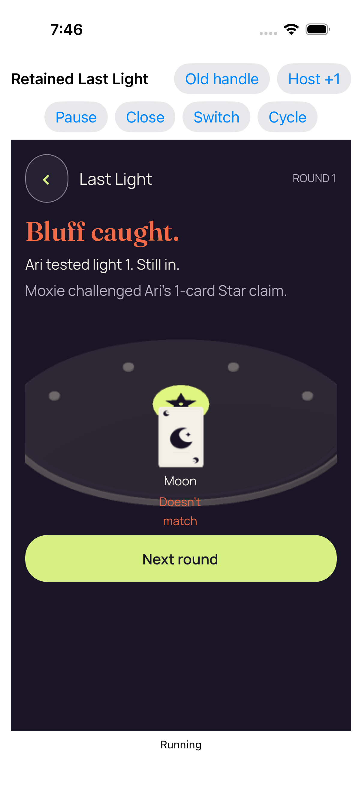</a> <code>0367B4DC-3294-4FF7-BE76-A4385DD41FB1.png</code> Real play accepted by the Kotlin authority_0_989F2B2C-4D5F-451E-83F4-1FB077515513.png | 1206 × 2622 px · 234,787 bytes SHA-256: <code>37448df584fc6493f40ef2b3f63f9a540826a8ced490b6a4d082db1b6f3009a4</code> Source: <code>/root/projects/PartyDeck/artifacts/evidence-storage/34520375602/godot-ios-retained-host-test-attempt-1/retained-host-test/artifacts/attachments/0367B4DC-3294-4FF7-BE76-A4385DD41FB1.png</code> Original case: <code>RetainedHostUITests/testRepeated2DAnd3DKeepOneDormantEngine()</code> — **passed** Original attachment timestamp: 1789069595.114 [Original result](evidence/result.json) · [Attachment index](companions.md) | **UNVIEWED original — no visual acceptance**. Original capture retained without direct visual review. Its recorded test, label, timestamp and outcome identify the source checkpoint; no pixel observation or visual acceptance is asserted. |
| <a href="attachments/8C27215D-FCEC-4349-BEF1-E3526A995CF0.png">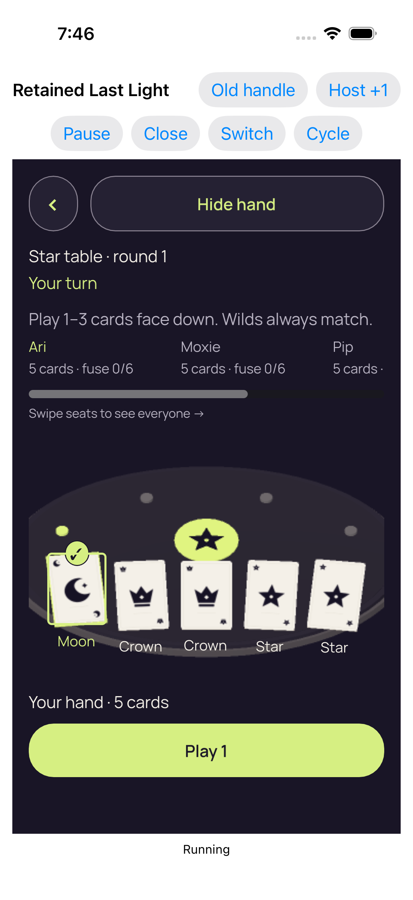</a> <code>8C27215D-FCEC-4349-BEF1-E3526A995CF0.png</code> Real reveal and card selection_0_AD021703-F875-488D-B613-0C8C1366A236.png | 1206 × 2622 px · 324,762 bytes SHA-256: <code>435690d47bd77a7308df5a648940d9b2f9b6020cedb2e02f034162cbd74d56c3</code> Source: <code>/root/projects/PartyDeck/artifacts/evidence-storage/34520375602/godot-ios-retained-host-test-attempt-1/retained-host-test/artifacts/attachments/8C27215D-FCEC-4349-BEF1-E3526A995CF0.png</code> Original case: <code>RetainedHostUITests/testRepeated2DAnd3DKeepOneDormantEngine()</code> — **passed** Original attachment timestamp: 1789069591.549 [Original result](evidence/result.json) · [Attachment index](companions.md) | **UNVIEWED original — no visual acceptance**. Original capture retained without direct visual review. Its recorded test, label, timestamp and outcome identify the source checkpoint; no pixel observation or visual acceptance is asserted. |
| <a href="attachments/8A5D1A3B-FC0E-4C11-9653-ECE2BFD2E3DE.png">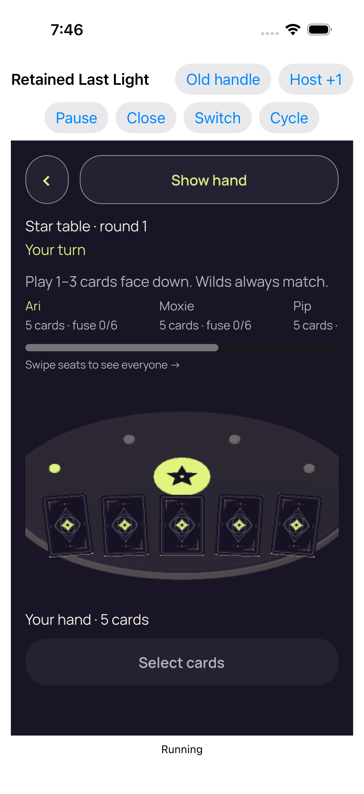</a> <code>8A5D1A3B-FC0E-4C11-9653-ECE2BFD2E3DE.png</code> Entry 4 fresh concealed 3d_0_A5140266-604E-4E56-ACF8-4AE071190EC2.png | 1206 × 2622 px · 365,637 bytes SHA-256: <code>fd7adc25203fe93bd5b67e88c492d6329b201cc333c3b8abb124173a26179581</code> Source: <code>/root/projects/PartyDeck/artifacts/evidence-storage/34520375602/godot-ios-retained-host-test-attempt-1/retained-host-test/artifacts/attachments/8A5D1A3B-FC0E-4C11-9653-ECE2BFD2E3DE.png</code> Original case: <code>RetainedHostUITests/testRepeated2DAnd3DKeepOneDormantEngine()</code> — **passed** Original attachment timestamp: 1789069573.275 [Original result](evidence/result.json) · [Attachment index](companions.md) | **UNVIEWED original — no visual acceptance**. Original capture retained without direct visual review. Its recorded test, label, timestamp and outcome identify the source checkpoint; no pixel observation or visual acceptance is asserted. |
|  <code>FAD56AF5-1036-4A1C-9F80-DFF2B6F09B4A.png</code> Whole recipient scene retired; retained services dormant_0_33B3D763-733A-493E-8640-555A6FBBAECC.png | 1206 × 2622 px · 98,392 bytes SHA-256: <code>d6527dae43841c92b6f1327db17eb63920596b74b20932e5b38c36ad7d7b887f</code> Source: <code>/root/projects/PartyDeck/artifacts/evidence-storage/34520375602/godot-ios-retained-host-test-attempt-1/retained-host-test/artifacts/attachments/FAD56AF5-1036-4A1C-9F80-DFF2B6F09B4A.png</code> Original case: <code>RetainedHostUITests/testRepeated2DAnd3DKeepOneDormantEngine()</code> — **passed** Original attachment timestamp: 1789069559.563 [Original result](evidence/result.json) · [Attachment index](companions.md) | **UNVIEWED original — no visual acceptance**. Original capture retained without direct visual review. Its recorded test, label, timestamp and outcome identify the source checkpoint; no pixel observation or visual acceptance is asserted. |
| <a href="attachments/A5F04D34-BE30-447F-8C23-9D919808E1E8.png">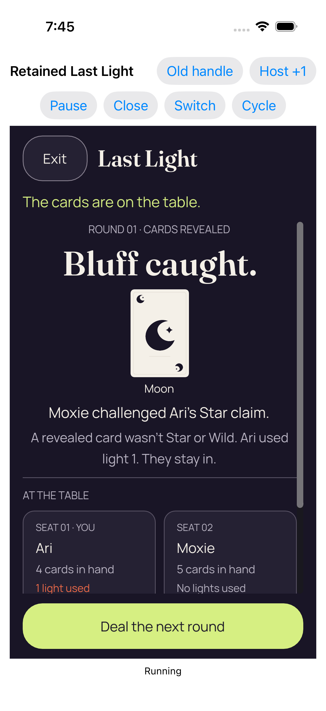</a> <code>A5F04D34-BE30-447F-8C23-9D919808E1E8.png</code> Real play accepted by the Kotlin authority_0_6691F6F7-1A5E-45FB-A316-587ECBCD6A16.png | 1206 × 2622 px · 272,469 bytes SHA-256: <code>b8a8093168cf6137705ef6aec349ecaf97de20fe7faa00c32303ff3099a80d39</code> Source: <code>/root/projects/PartyDeck/artifacts/evidence-storage/34520375602/godot-ios-retained-host-test-attempt-1/retained-host-test/artifacts/attachments/A5F04D34-BE30-447F-8C23-9D919808E1E8.png</code> Original case: <code>RetainedHostUITests/testRepeated2DAnd3DKeepOneDormantEngine()</code> — **passed** Original attachment timestamp: 1789069555.059 [Original result](evidence/result.json) · [Attachment index](companions.md) | **UNVIEWED original — no visual acceptance**. Original capture retained without direct visual review. Its recorded test, label, timestamp and outcome identify the source checkpoint; no pixel observation or visual acceptance is asserted. |
| <a href="attachments/C34F4000-C14F-4F9E-A5DB-0D347CA93984.png">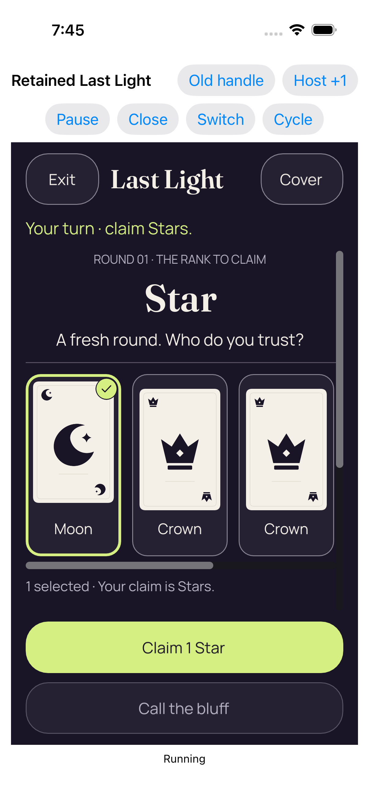</a> <code>C34F4000-C14F-4F9E-A5DB-0D347CA93984.png</code> Real reveal and card selection_0_65D54781-7D0A-47B4-88C7-8AB26974A90E.png | 1206 × 2622 px · 244,247 bytes SHA-256: <code>916531d214c11a97ef532e92d05aaf227a6103545186305a8e48a5857c5286dd</code> Source: <code>/root/projects/PartyDeck/artifacts/evidence-storage/34520375602/godot-ios-retained-host-test-attempt-1/retained-host-test/artifacts/attachments/C34F4000-C14F-4F9E-A5DB-0D347CA93984.png</code> Original case: <code>RetainedHostUITests/testRepeated2DAnd3DKeepOneDormantEngine()</code> — **passed** Original attachment timestamp: 1789069552.13 [Original result](evidence/result.json) · [Attachment index](companions.md) | **UNVIEWED original — no visual acceptance**. Original capture retained without direct visual review. Its recorded test, label, timestamp and outcome identify the source checkpoint; no pixel observation or visual acceptance is asserted. |
| <a href="attachments/F35C9A2A-94AE-4BDF-9B3B-8F4C1D5A938D.png">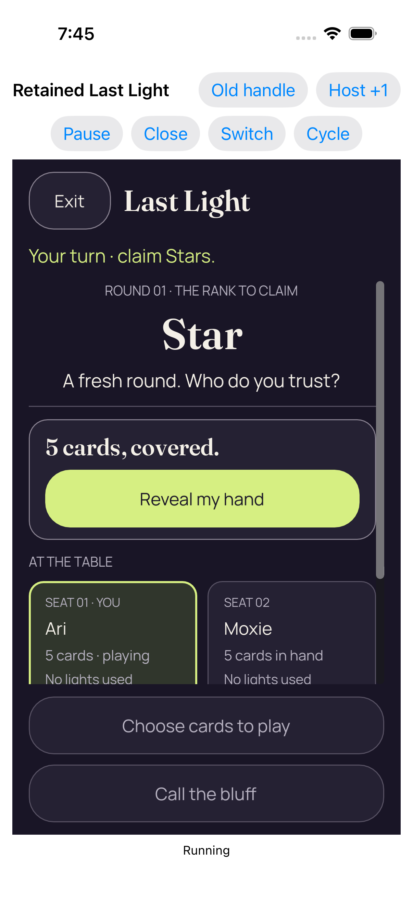</a> <code>F35C9A2A-94AE-4BDF-9B3B-8F4C1D5A938D.png</code> Entry 3 fresh concealed 2d_0_6D634DC0-96D8-4667-8A27-B5EA03CB676E.png | 1206 × 2622 px · 269,348 bytes SHA-256: <code>30eaed6cad47fedfd0ed3d8989537b55d6e5ab8490e5816a2e764243a7aff7e0</code> Source: <code>/root/projects/PartyDeck/artifacts/evidence-storage/34520375602/godot-ios-retained-host-test-attempt-1/retained-host-test/artifacts/attachments/F35C9A2A-94AE-4BDF-9B3B-8F4C1D5A938D.png</code> Original case: <code>RetainedHostUITests/testRepeated2DAnd3DKeepOneDormantEngine()</code> — **passed** Original attachment timestamp: 1789069547.211 [Original result](evidence/result.json) · [Attachment index](companions.md) | **UNVIEWED original — no visual acceptance**. Original capture retained without direct visual review. Its recorded test, label, timestamp and outcome identify the source checkpoint; no pixel observation or visual acceptance is asserted. |
|  <code>E960A1D4-490E-4FC1-9752-03C0434B2BEB.png</code> Whole recipient scene retired; retained services dormant_0_2DFB8EEF-E50F-48D7-B981-2E5883883872.png | 1206 × 2622 px · 98,392 bytes SHA-256: <code>d6527dae43841c92b6f1327db17eb63920596b74b20932e5b38c36ad7d7b887f</code> Source: <code>/root/projects/PartyDeck/artifacts/evidence-storage/34520375602/godot-ios-retained-host-test-attempt-1/retained-host-test/artifacts/attachments/E960A1D4-490E-4FC1-9752-03C0434B2BEB.png</code> Original case: <code>RetainedHostUITests/testRepeated2DAnd3DKeepOneDormantEngine()</code> — **passed** Original attachment timestamp: 1789069543.693 [Original result](evidence/result.json) · [Attachment index](companions.md) | **UNVIEWED original — no visual acceptance**. Original capture retained without direct visual review. Its recorded test, label, timestamp and outcome identify the source checkpoint; no pixel observation or visual acceptance is asserted. |
| <a href="attachments/91BEC9B4-DCFB-4709-ABBB-E7D6ABF2C013.png">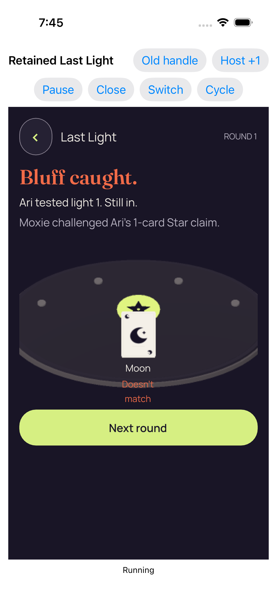</a> <code>91BEC9B4-DCFB-4709-ABBB-E7D6ABF2C013.png</code> Real play accepted by the Kotlin authority_0_64B01152-9350-4A01-9F20-FA683F3FE36D.png | 1206 × 2622 px · 234,478 bytes SHA-256: <code>2faed8f7c12385c4c72da6f028d5c5ffa04af12107807eafd901f31b05883fc2</code> Source: <code>/root/projects/PartyDeck/artifacts/evidence-storage/34520375602/godot-ios-retained-host-test-attempt-1/retained-host-test/artifacts/attachments/91BEC9B4-DCFB-4709-ABBB-E7D6ABF2C013.png</code> Original case: <code>RetainedHostUITests/testRepeated2DAnd3DKeepOneDormantEngine()</code> — **passed** Original attachment timestamp: 1789069525.159 [Original result](evidence/result.json) · [Attachment index](companions.md) | **UNVIEWED original — no visual acceptance**. Original capture retained without direct visual review. Its recorded test, label, timestamp and outcome identify the source checkpoint; no pixel observation or visual acceptance is asserted. |
| <a href="attachments/83E30B20-E184-454C-B9B5-7A5A1CF37DA4.png">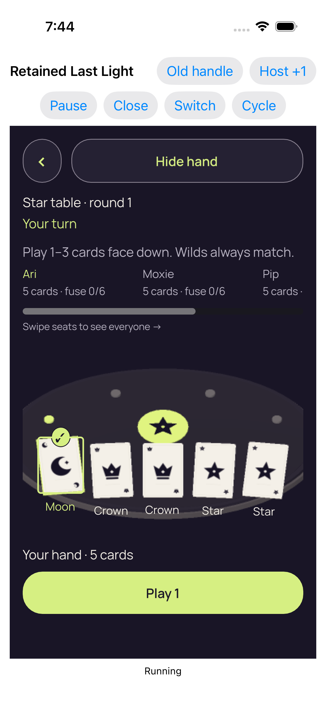</a> <code>83E30B20-E184-454C-B9B5-7A5A1CF37DA4.png</code> Real reveal and card selection_0_4075A35F-78DD-4BEF-AA26-E6697E7BC073.png | 1206 × 2622 px · 323,718 bytes SHA-256: <code>a116e664faaf71223852535cf31f9370a2618218bdfe0089f106e8f306ead49d</code> Source: <code>/root/projects/PartyDeck/artifacts/evidence-storage/34520375602/godot-ios-retained-host-test-attempt-1/retained-host-test/artifacts/attachments/83E30B20-E184-454C-B9B5-7A5A1CF37DA4.png</code> Original case: <code>RetainedHostUITests/testRepeated2DAnd3DKeepOneDormantEngine()</code> — **passed** Original attachment timestamp: 1789069496.894 [Original result](evidence/result.json) · [Attachment index](companions.md) | **UNVIEWED original — no visual acceptance**. Original capture retained without direct visual review. Its recorded test, label, timestamp and outcome identify the source checkpoint; no pixel observation or visual acceptance is asserted. |
|  <code>3B94E34D-1074-451B-B7C1-8A944D8F8247.png</code> Entry 2 fresh concealed 3d_0_18DAAF8C-803B-4437-8319-15ABEE076BBE.png | 1206 × 2622 px · 365,542 bytes SHA-256: <code>613c794c9215f9b90d0c6629071e2ea123550d939c464c408e1a36f83ac0bee8</code> Source: <code>/root/projects/PartyDeck/artifacts/evidence-storage/34520375602/godot-ios-retained-host-test-attempt-1/retained-host-test/artifacts/attachments/3B94E34D-1074-451B-B7C1-8A944D8F8247.png</code> Original case: <code>RetainedHostUITests/testRepeated2DAnd3DKeepOneDormantEngine()</code> — **passed** Original attachment timestamp: 1789069427.8 [Original result](evidence/result.json) · [Attachment index](companions.md) | **UNVIEWED original — no visual acceptance**. Original capture retained without direct visual review. Its recorded test, label, timestamp and outcome identify the source checkpoint; no pixel observation or visual acceptance is asserted. |
| <a href="attachments/D076EE3E-5C11-4187-9C5C-72F9F529FD4A.png">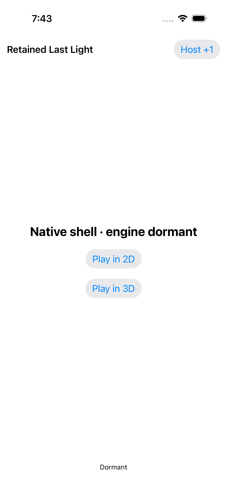</a> <code>D076EE3E-5C11-4187-9C5C-72F9F529FD4A.png</code> Whole recipient scene retired; retained services dormant_0_E488980B-0BCC-4103-A811-C9EA4A0C7637.png | 1206 × 2622 px · 98,591 bytes SHA-256: <code>b494651badc107d6c65b16997d27b89c7316e1018920ee63853ec86a224f16b4</code> Source: <code>/root/projects/PartyDeck/artifacts/evidence-storage/34520375602/godot-ios-retained-host-test-attempt-1/retained-host-test/artifacts/attachments/D076EE3E-5C11-4187-9C5C-72F9F529FD4A.png</code> Original case: <code>RetainedHostUITests/testRepeated2DAnd3DKeepOneDormantEngine()</code> — **passed** Original attachment timestamp: 1789069394.08 [Original result](evidence/result.json) · [Attachment index](companions.md) | **UNVIEWED original — no visual acceptance**. Original capture retained without direct visual review. Its recorded test, label, timestamp and outcome identify the source checkpoint; no pixel observation or visual acceptance is asserted. |
| <a href="attachments/10B6E206-A0B6-4A6E-83F4-537CFAE13F87.png">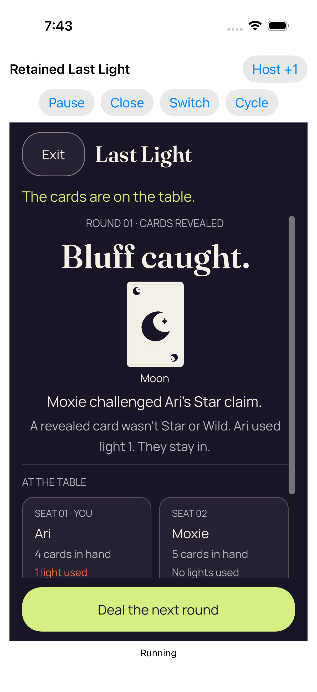</a> <code>10B6E206-A0B6-4A6E-83F4-537CFAE13F87.png</code> Real play accepted by the Kotlin authority_0_C75C6FA0-815D-4301-A3DA-9A75A674A1D0.png | 1206 × 2622 px · 267,559 bytes SHA-256: <code>f8db2b499ee7d32e8d6447609537cf0562a54134ac0747636b45e35d5f271478</code> Source: <code>/root/projects/PartyDeck/artifacts/evidence-storage/34520375602/godot-ios-retained-host-test-attempt-1/retained-host-test/artifacts/attachments/10B6E206-A0B6-4A6E-83F4-537CFAE13F87.png</code> Original case: <code>RetainedHostUITests/testRepeated2DAnd3DKeepOneDormantEngine()</code> — **passed** Original attachment timestamp: 1789069389.687 [Original result](evidence/result.json) · [Attachment index](companions.md) | **UNVIEWED original — no visual acceptance**. Original capture retained without direct visual review. Its recorded test, label, timestamp and outcome identify the source checkpoint; no pixel observation or visual acceptance is asserted. |
| <a href="attachments/617E9842-EDFF-41DE-919D-47B21DF0EBE2.png">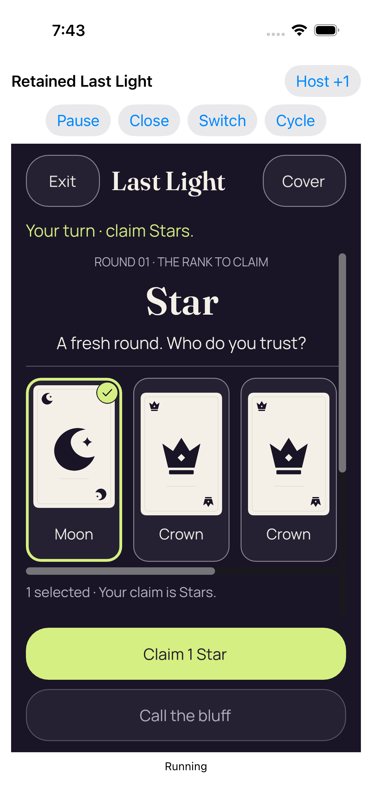</a> <code>617E9842-EDFF-41DE-919D-47B21DF0EBE2.png</code> Real reveal and card selection_0_AAC97F96-5115-404B-960C-ADB833D92AF6.png | 1206 × 2622 px · 239,639 bytes SHA-256: <code>fe92955c8ae1d8ff839507c54baca1640c97a480e7cb141261ebcd9d07575ea7</code> Source: <code>/root/projects/PartyDeck/artifacts/evidence-storage/34520375602/godot-ios-retained-host-test-attempt-1/retained-host-test/artifacts/attachments/617E9842-EDFF-41DE-919D-47B21DF0EBE2.png</code> Original case: <code>RetainedHostUITests/testRepeated2DAnd3DKeepOneDormantEngine()</code> — **passed** Original attachment timestamp: 1789069386.261 [Original result](evidence/result.json) · [Attachment index](companions.md) | **UNVIEWED original — no visual acceptance**. Original capture retained without direct visual review. Its recorded test, label, timestamp and outcome identify the source checkpoint; no pixel observation or visual acceptance is asserted. |
| <a href="attachments/D8DC6F91-F686-4FDA-BB84-752CAB0571D4.png">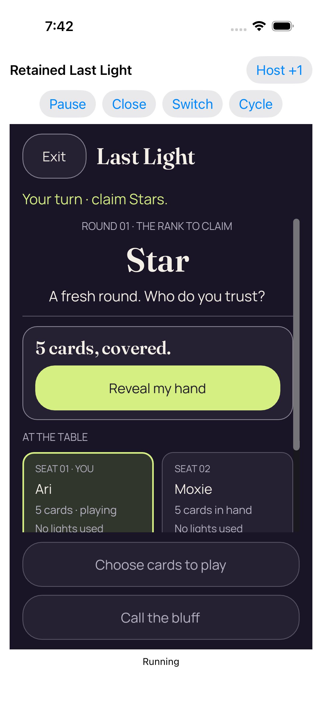</a> <code>D8DC6F91-F686-4FDA-BB84-752CAB0571D4.png</code> Entry 1 fresh concealed 2d_0_8913207F-6AC5-4DB9-9325-4312F2CA61D5.png | 1206 × 2622 px · 264,091 bytes SHA-256: <code>7a836e682b220802031fd5c887e7d88cd3e8ac1d310a09044825bcc95b708068</code> Source: <code>/root/projects/PartyDeck/artifacts/evidence-storage/34520375602/godot-ios-retained-host-test-attempt-1/retained-host-test/artifacts/attachments/D8DC6F91-F686-4FDA-BB84-752CAB0571D4.png</code> Original case: <code>RetainedHostUITests/testRepeated2DAnd3DKeepOneDormantEngine()</code> — **passed** Original attachment timestamp: 1789069378.889 [Original result](evidence/result.json) · [Attachment index](companions.md) · [Later scroll-boundary review](provenance/later-seat-review/findings.json) | **Direct original view by review_design**. The retained-host first 2D entry shows the host title and Host +1/Pause/Close/Switch/Cycle controls above the renderer. Exit/Last Light, Your turn · claim Stars, Round 01/Star and fresh-round copy fit. The complete 5 cards, covered panel and Reveal my hand button fit inside the body. The first two numbered seats are visible, but their lower No lights used text clips at the body edge. Both muted fixed lower game actions fit completely, and Running appears below the renderer. No private face is visible. This verifies the named still only, without a zero-scroll, timing or continuous-privacy claim. |
|  <code>6AE27F4E-016E-49D8-91F2-0549CB4DC36B.png</code> Failed retained observation_0_56017706-622D-4709-8A57-DF50521D6518.png | 1206 × 2622 px · 364,550 bytes SHA-256: <code>7c8e40aa988907f07830a59407c9c96d4d24198758a1f2e9eb254a41ddc66097</code> Source: <code>/root/projects/PartyDeck/artifacts/evidence-storage/34520375602/godot-ios-retained-host-test-attempt-1/retained-host-test/artifacts/attachments/6AE27F4E-016E-49D8-91F2-0549CB4DC36B.png</code> Original case: <code>RetainedHostUITests/testStaleFirstReadyAndCloseCompletionReentry()</code> — **failed** Original attachment timestamp: 1789069639.809 [Original result](evidence/result.json) · [Attachment index](companions.md) | **Direct original view by review_design**. The failed retained observation shows Old handle and the retained-host controls, then a rendered Star table · round 1 with full Show hand, Your turn and play guidance. The horizontal seat strip clips Pip’s later details and shows its scroll bar and Swipe seats hint. Five card backs and the Star table are visible; Your hand · 5 cards and the full Select cards action fit above the renderer bottom. Running appears below. No private face is visible. This later failure still does not undo the original stale-entry timeout, establish when READY arrived, or identify its cause. |
