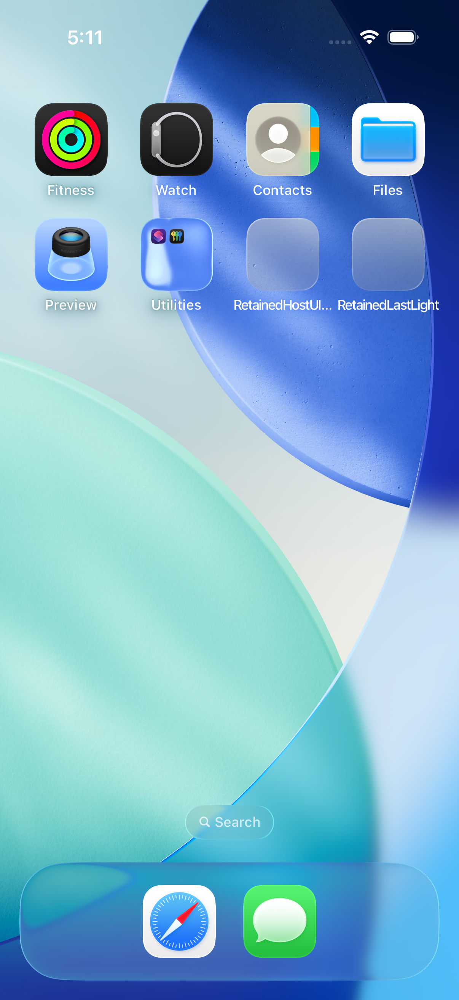
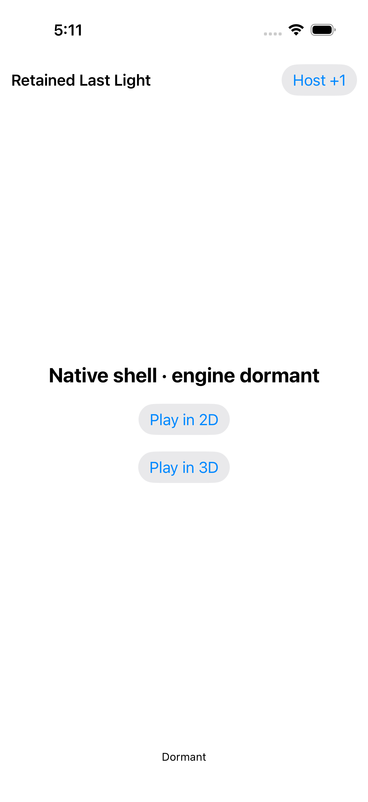
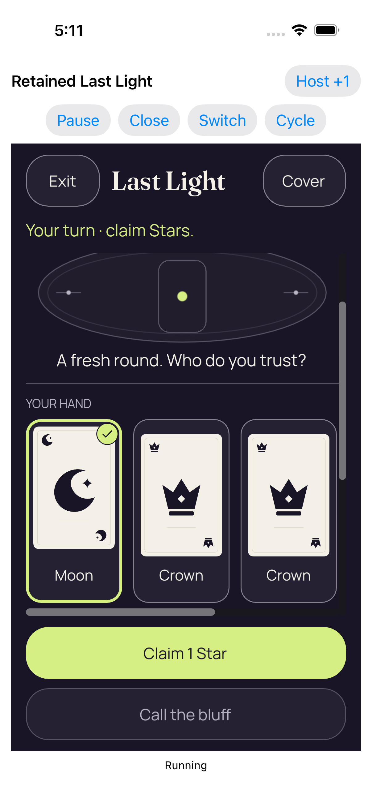
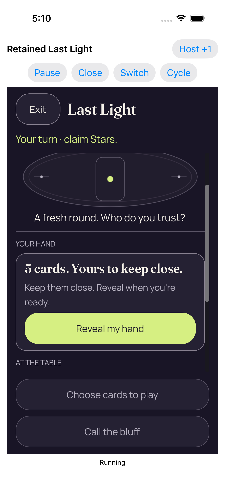
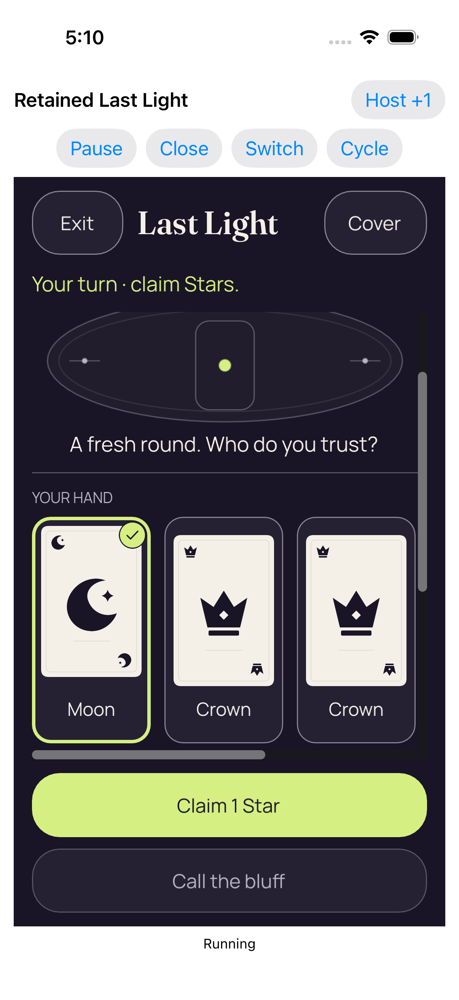
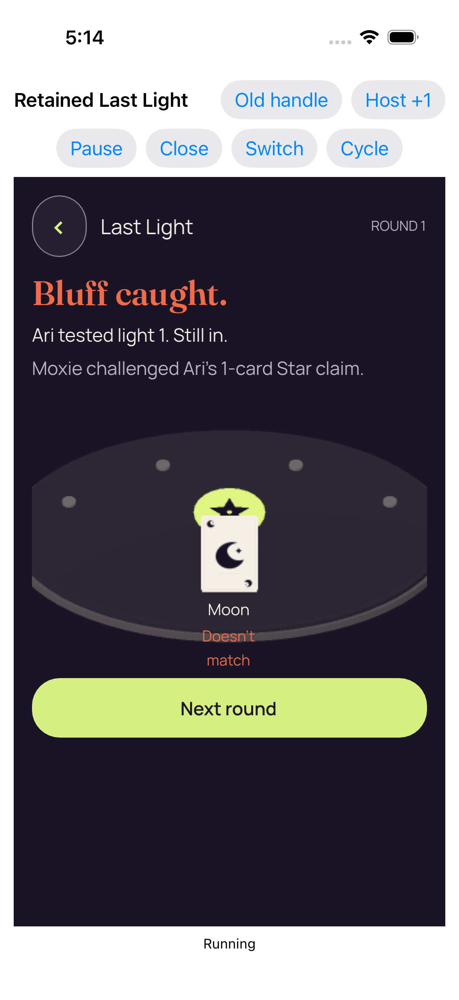
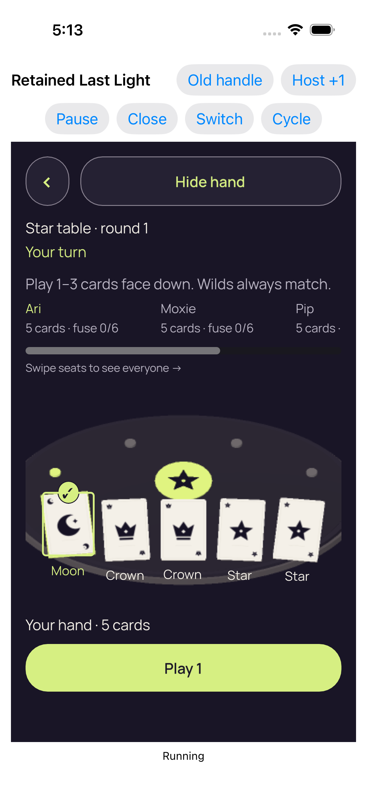
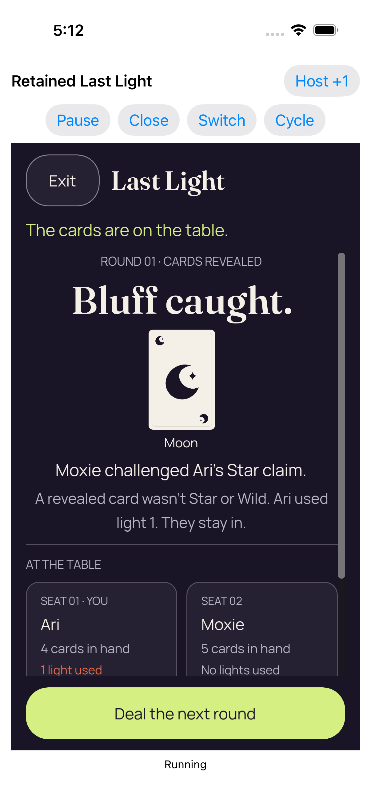
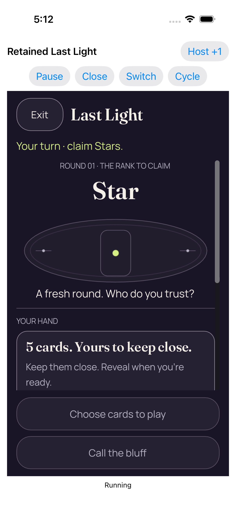
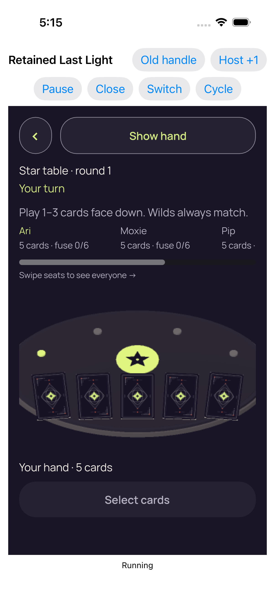

# iOS sampled retained-host diagnostic — CI 34505106959

[All collections](../README.md) · [Preserved evidence index](evidence-index.md) · [Copy/review binding](../android-34503251315/provenance/publication-review/partydeck-gallery-2815-publication-binding-v1.json) · [Completed visual review](provenance/publication-review/partydeck-gallery-after-2355-ios-sampled-visual-review-v1.json) · [Unchanged source mapping](provenance/source-map/native-gallery-map.json)

**Diagnostic stack sampling was enabled. One original case passed and two failed; full retained lifecycle and same-process reentry remain unqualified.**

Eighteen original attachment identities retain opt-in sampling=true and the original one-pass/two-failure result. Initial old-PCK 2D Reveal lies below the body; scrolled captures show the full Reveal and cover. Selected 2D hand and 3D seat details scroll horizontally. Selected/concealed 3D controls are readable. The failed-case 3D result has a complete Next round button, which does not change that case’s failure. Dormant shell/Home stills show no private content and establish no continuous-transition privacy.

The bounded Sample-05 supplement records main-thread software rendering, synchronous pipeline preparation and separate compiler work. Its 526 aggregate draw observations are neither frames nor CPU time; no blocking call is tied to a failed deadline, and no material/cache-cause conclusion is made. The earlier 3D scroll supplement reuses seven already-published originals with zero new PNGs: 29 recorded touches fit their clips, including 13 Next actions and the final Lobby action. This does not establish human discoverability or same-frame geometry.

Source revision: `16d828e10212dbe7e930421c2fbe7d040f835c19`. CI run: [34505106959](https://github.com/Apdelrahman1911/PartyDeck/actions/runs/34505106959). 18 original PNG identities. Review methods: 14 direct original view, 4 exact same-batch match.

Every thumbnail opens the unchanged original PNG. Original filenames, dimensions, source paths and outcomes remain separate even when pixels match. No derivative image was created. Frozen provenance pages retain their original text and source references.

[Sample-05 performance review](provenance/sample-05-assets-review-v1/RESULT.md) · [Earlier 3D scrolling audit — zero new PNGs](provenance/earlier-3d-scroll-audit-v1/README.md)

| Original capture | Original identity and evidence | Visual observation |
| --- | --- | --- |
|  <code>5E006EB3-4871-4637-8F8E-1B380EC1DAD3.png</code> Dormant application lifecycle did not restart the engine services_0_E7C0EEA5-CA23-421A-A392-14A0DFB6BD55.png | 1206 × 2622 px · 98,436 bytes SHA-256: <code>589851296ccc5e58ae50fe8440602f62c6e59eec8578efbc95d728cda0e79620</code> Source: <code>/root/projects/PartyDeck/artifacts/evidence-storage/34505106959/godot-ios-retained-host-test-attempt-1/retained-host-test/artifacts/attachments/5E006EB3-4871-4637-8F8E-1B380EC1DAD3.png</code> Original case: <code>RetainedHostUITests/testActiveAndDormantBackgroundTransitionsStayConcealed()</code> — **passed** Original timestamp: 1789060327.458 [Original result](evidence/result.json) · [Case/attachment index](companions.md) | **Direct original view**. The retained diagnostic shell shows Native shell · engine dormant, full Play in 2D and Play in 3D controls, Host +1 and Dormant status. No table or private card face is visible. |
|  <code>313A8B8F-21B6-4395-8B14-72D8DF331CBA.png</code> Whole recipient scene retired; retained services dormant_0_03D43D93-8ECB-48D2-A6F1-62DCF4BFD353.png | 1206 × 2622 px · 98,436 bytes SHA-256: <code>589851296ccc5e58ae50fe8440602f62c6e59eec8578efbc95d728cda0e79620</code> Source: <code>/root/projects/PartyDeck/artifacts/evidence-storage/34505106959/godot-ios-retained-host-test-attempt-1/retained-host-test/artifacts/attachments/313A8B8F-21B6-4395-8B14-72D8DF331CBA.png</code> Original case: <code>RetainedHostUITests/testActiveAndDormantBackgroundTransitionsStayConcealed()</code> — **passed** Original timestamp: 1789060327.171 [Original result](evidence/result.json) · [Case/attachment index](companions.md) | **Exact same-batch match**. Exact bytes match separately retained sampled capture 0. Reused pixel observation: The retained diagnostic shell shows Native shell · engine dormant, full Play in 2D and Play in 3D controls, Host +1 and Dormant status. No table or private card face is visible. [Reviewed matching original](attachments/5E006EB3-4871-4637-8F8E-1B380EC1DAD3.png); original capture identity remains separate. |
|  <code>5A941CF3-CCBE-4DCA-AD85-7EBF53B244BB.png</code> Actual Home screen_0_0DC01278-7EA4-4F89-885C-51BF6D7528AD.png | 1206 × 2622 px · 2,803,902 bytes SHA-256: <code>5706cacabc9910b8862f434658d40c022781463d67bbaadeb8039df488535009</code> Source: <code>/root/projects/PartyDeck/artifacts/evidence-storage/34505106959/godot-ios-retained-host-test-attempt-1/retained-host-test/artifacts/attachments/5A941CF3-CCBE-4DCA-AD85-7EBF53B244BB.png</code> Original case: <code>RetainedHostUITests/testActiveAndDormantBackgroundTransitionsStayConcealed()</code> — **passed** Original timestamp: 1789060286.819 [Original result](evidence/result.json) · [Case/attachment index](companions.md) | **Direct original view**. The actual iOS Home screen shows app icons and the system dock. No PartyDeck table or private hand is visible. This still does not establish continuous transition privacy. |
|  <code>9BE707D8-CBD0-409E-801D-C7B5068BD140.png</code> Whole recipient scene retired; retained services dormant_0_3A8E3DFC-A494-4575-94F5-F0A8770B5467.png | 1206 × 2622 px · 97,738 bytes SHA-256: <code>f0f4074a238b09d1484217356b6b927fcc6dbf8110354a31d493d95d405fc3cd</code> Source: <code>/root/projects/PartyDeck/artifacts/evidence-storage/34505106959/godot-ios-retained-host-test-attempt-1/retained-host-test/artifacts/attachments/9BE707D8-CBD0-409E-801D-C7B5068BD140.png</code> Original case: <code>RetainedHostUITests/testActiveAndDormantBackgroundTransitionsStayConcealed()</code> — **passed** Original timestamp: 1789060281.47 [Original result](evidence/result.json) · [Case/attachment index](companions.md) | **Direct original view**. The retained diagnostic shell shows the complete Native shell · engine dormant message, Play in 2D/3D, Host +1 and Dormant status. No private content appears. |
|  <code>BF88A643-CECE-4D6E-839A-F0E65E92975B.png</code> Real background and resume kept the same authority concealed_0_DC51834F-17F1-4651-9D55-2B31D7FC5AB1.png | 1206 × 2622 px · 266,707 bytes SHA-256: <code>3b75526173102c3561b10fdeb92e14e7db08110362febb2db4b0ec4138f5f9be</code> Source: <code>/root/projects/PartyDeck/artifacts/evidence-storage/34505106959/godot-ios-retained-host-test-attempt-1/retained-host-test/artifacts/attachments/BF88A643-CECE-4D6E-839A-F0E65E92975B.png</code> Original case: <code>RetainedHostUITests/testActiveAndDormantBackgroundTransitionsStayConcealed()</code> — **passed** Original timestamp: 1789060276.026 [Original result](evidence/result.json) · [Case/attachment index](companions.md) | **Direct original view**. The resumed 2D diagnostic host shows full native controls, Your turn · claim Stars., fresh-round guidance and a complete covered-hand panel with Reveal my hand. Fixed Choose cards/Call the bluff fit; the scroll thumb is below the top and the rank block is outside this scroll position. No private card ranks appear. |
|  <code>1EB5798E-7EFD-4BD0-9216-0196197844CB.png</code> Actual Home screen_0_181D20A7-BD33-4C5B-9C00-C14D103661A5.png | 1206 × 2622 px · 2,803,902 bytes SHA-256: <code>5706cacabc9910b8862f434658d40c022781463d67bbaadeb8039df488535009</code> Source: <code>/root/projects/PartyDeck/artifacts/evidence-storage/34505106959/godot-ios-retained-host-test-attempt-1/retained-host-test/artifacts/attachments/1EB5798E-7EFD-4BD0-9216-0196197844CB.png</code> Original case: <code>RetainedHostUITests/testActiveAndDormantBackgroundTransitionsStayConcealed()</code> — **passed** Original timestamp: 1789060273.489 [Original result](evidence/result.json) · [Case/attachment index](companions.md) | **Exact same-batch match**. Exact bytes match separately retained sampled capture 2. Reused pixel observation: The actual iOS Home screen shows app icons and the system dock. No PartyDeck table or private hand is visible. This still does not establish continuous transition privacy. [Reviewed matching original](attachments/5A941CF3-CCBE-4DCA-AD85-7EBF53B244BB.png); original capture identity remains separate. |
|  <code>10D37F51-600E-4AF2-9577-B698B6450326.png</code> Real reveal and card selection_0_217A99B7-BCDC-4C81-B7DC-3FB4AA7BDC7F.png | 1206 × 2622 px · 243,368 bytes SHA-256: <code>3c2a8db308cddcf77c71f90bbc71f65ae1c93d74856f958976a0c44c9da6cca7</code> Source: <code>/root/projects/PartyDeck/artifacts/evidence-storage/34505106959/godot-ios-retained-host-test-attempt-1/retained-host-test/artifacts/attachments/10D37F51-600E-4AF2-9577-B698B6450326.png</code> Original case: <code>RetainedHostUITests/testActiveAndDormantBackgroundTransitionsStayConcealed()</code> — **passed** Original timestamp: 1789060266.061 [Original result](evidence/result.json) · [Case/attachment index](companions.md) | **Direct original view**. The scrolled 2D hand shows a clearly selected Moon with bright outline/check and two complete Crown cards. The horizontal scrollbar indicates additional cards outside the view. Exit, Cover, Star turn guidance, Claim 1 Star and disabled Call the bluff are fully visible. |
|  <code>3C834BE2-0BF2-42EF-8F45-281634E5AE99.png</code> Real reveal and card selection_0_427BA910-17D9-4807-825C-3C8AD2142989.png | 1206 × 2622 px · 244,377 bytes SHA-256: <code>6aac0e6e30f1eea96ffe50272b9528c5d881c653cb6f53d09674ed309520e200</code> Source: <code>/root/projects/PartyDeck/artifacts/evidence-storage/34505106959/godot-ios-retained-host-test-attempt-1/retained-host-test/artifacts/attachments/3C834BE2-0BF2-42EF-8F45-281634E5AE99.png</code> Original case: <code>RetainedHostUITests/testActiveAndDormantBackgroundTransitionsStayConcealed()</code> — **passed** Original timestamp: 1789060251.943 [Original result](evidence/result.json) · [Case/attachment index](companions.md) | **Direct original view**. The scrolled 2D hand shows the selected Moon and two full Crown cards, with a horizontal scrollbar for the remaining hand. Exit, Cover, Star turn guidance and complete Claim 1 Star/Call the bluff controls fit. |
|  <code>06C12AC6-916D-40ED-B77F-6EBDEDB8E156.png</code> Coalesced native foreground loss and regain returned concealed_0_A41F25C3-00FF-4D12-AF16-18E5B60F43B0.png | 1206 × 2622 px · 267,587 bytes SHA-256: <code>b2b73ea24ac986520a45f63313ceb0912b11a3a092c1ecf71ade9cdf8d47de2b</code> Source: <code>/root/projects/PartyDeck/artifacts/evidence-storage/34505106959/godot-ios-retained-host-test-attempt-1/retained-host-test/artifacts/attachments/06C12AC6-916D-40ED-B77F-6EBDEDB8E156.png</code> Original case: <code>RetainedHostUITests/testActiveAndDormantBackgroundTransitionsStayConcealed()</code> — **passed** Original timestamp: 1789060239.769 [Original result](evidence/result.json) · [Case/attachment index](companions.md) | **Direct original view**. The resumed 2D still shows a complete concealed-hand panel and Reveal my hand, with readable Star turn/fresh-round context and full fixed lower actions. The body is scrolled; no private card ranks appear. This does not establish continuous foreground-transition privacy. |
|  <code>2C3F36DC-6DBB-4FC3-9F61-F4AAB59A438F.png</code> Real reveal and card selection_0_8A7EDA45-69E6-410E-8D1C-585E1A8F2C81.png | 1206 × 2622 px · 244,377 bytes SHA-256: <code>6aac0e6e30f1eea96ffe50272b9528c5d881c653cb6f53d09674ed309520e200</code> Source: <code>/root/projects/PartyDeck/artifacts/evidence-storage/34505106959/godot-ios-retained-host-test-attempt-1/retained-host-test/artifacts/attachments/2C3F36DC-6DBB-4FC3-9F61-F4AAB59A438F.png</code> Original case: <code>RetainedHostUITests/testActiveAndDormantBackgroundTransitionsStayConcealed()</code> — **passed** Original timestamp: 1789060237.312 [Original result](evidence/result.json) · [Case/attachment index](companions.md) | **Exact same-batch match**. Exact bytes match separately retained sampled capture 7. Reused pixel observation: The scrolled 2D hand shows the selected Moon and two full Crown cards, with a horizontal scrollbar for the remaining hand. Exit, Cover, Star turn guidance and complete Claim 1 Star/Call the bluff controls fit. [Reviewed matching original](attachments/3C834BE2-0BF2-42EF-8F45-281634E5AE99.png); original capture identity remains separate. |
|  <code>8CDCE79D-40D7-4850-B191-639C1BE27F87.png</code> Failed retained observation_0_30C66697-DC2E-4694-872A-9B020F1E7158.png | 1206 × 2622 px · 234,211 bytes SHA-256: <code>6e58518dd5af0bb0b7b3de59d37f2c23036d5b78170b4458f34f0d0a55219225</code> Source: <code>/root/projects/PartyDeck/artifacts/evidence-storage/34505106959/godot-ios-retained-host-test-attempt-1/retained-host-test/artifacts/attachments/8CDCE79D-40D7-4850-B191-639C1BE27F87.png</code> Original case: <code>RetainedHostUITests/testRepeated2DAnd3DKeepOneDormantEngine()</code> — **failed** Original timestamp: 1789060460.274 [Original result](evidence/result.json) · [Case/attachment index](companions.md) | **Direct original view**. This failed-case diagnostic still shows the complete 3D round-1 Bluff caught result: Moxie challenged Ari&#x27;s one-card Star claim, Moon does not match, and Ari is still in. The full Next round button fits. Native diagnostic controls and Running status are visible; the original case remains failed. |
|  <code>A628F6E8-EB9C-451E-AD3D-6C084C3F2AB4.png</code> Real reveal and card selection_0_50B4BFBE-D507-4202-93ED-A2C9AE0EAE9E.png | 1206 × 2622 px · 324,617 bytes SHA-256: <code>16a084fecbe0e82b46a3d5fe7234c4edde5c8f36e0d05ec429bb93bf0972f7fa</code> Source: <code>/root/projects/PartyDeck/artifacts/evidence-storage/34505106959/godot-ios-retained-host-test-attempt-1/retained-host-test/artifacts/attachments/A628F6E8-EB9C-451E-AD3D-6C084C3F2AB4.png</code> Original case: <code>RetainedHostUITests/testRepeated2DAnd3DKeepOneDormantEngine()</code> — **failed** Original timestamp: 1789060436.389 [Original result](evidence/result.json) · [Case/attachment index](companions.md) | **Direct original view**. The failed repeated-entry case&#x27;s 3D selection still shows all five Moon/Crown/Crown/Star/Star cards with the first Moon clearly selected. Full Hide hand and Play 1 controls fit. Star/turn/opening context is readable; seat details clip horizontally with an explicit scrollbar. The case remains failed. |
|  <code>1F5AF9C6-78C9-4A21-B61C-F2197D3665A8.png</code> Entry 2 fresh concealed 3d_0_83B68DD9-0643-408F-A5BA-24537912FD3B.png | 1206 × 2622 px · 365,510 bytes SHA-256: <code>829c3da15f29d9a3a6a82110df4980c017281c192430921a7b4936698fa8a7d5</code> Source: <code>/root/projects/PartyDeck/artifacts/evidence-storage/34505106959/godot-ios-retained-host-test-attempt-1/retained-host-test/artifacts/attachments/1F5AF9C6-78C9-4A21-B61C-F2197D3665A8.png</code> Original case: <code>RetainedHostUITests/testRepeated2DAnd3DKeepOneDormantEngine()</code> — **failed** Original timestamp: 1789060393.383 [Original result](evidence/result.json) · [Case/attachment index](companions.md) | **Direct original view**. The failed repeated-entry case&#x27;s 3D entry still shows five card backs, full Show hand and Select cards, plus readable Star round 1, Your turn and opening guidance. Seat details scroll horizontally. No private ranks appear; the case outcome remains failed. |
|  <code>088AF648-B6BF-414A-A0F1-939810FE8172.png</code> Whole recipient scene retired; retained services dormant_0_B70DE70F-8F90-49DC-B485-580C99B33D15.png | 1206 × 2622 px · 98,436 bytes SHA-256: <code>589851296ccc5e58ae50fe8440602f62c6e59eec8578efbc95d728cda0e79620</code> Source: <code>/root/projects/PartyDeck/artifacts/evidence-storage/34505106959/godot-ios-retained-host-test-attempt-1/retained-host-test/artifacts/attachments/088AF648-B6BF-414A-A0F1-939810FE8172.png</code> Original case: <code>RetainedHostUITests/testRepeated2DAnd3DKeepOneDormantEngine()</code> — **failed** Original timestamp: 1789060362.521 [Original result](evidence/result.json) · [Case/attachment index](companions.md) | **Exact same-batch match**. Exact bytes match separately retained sampled capture 0. Reused pixel observation: The retained diagnostic shell shows Native shell · engine dormant, full Play in 2D and Play in 3D controls, Host +1 and Dormant status. No table or private card face is visible. [Reviewed matching original](attachments/5E006EB3-4871-4637-8F8E-1B380EC1DAD3.png); original capture identity remains separate. |
|  <code>90F412F8-0188-424B-ACB4-07EC5494E0AF.png</code> Real play accepted by the Kotlin authority_0_7433AAE2-0D84-4FDE-819B-A9D844074164.png | 1206 × 2622 px · 267,404 bytes SHA-256: <code>7846a2534de9eabdeb09a712b35851103dbf53905835831c9bcfae956a88a4c0</code> Source: <code>/root/projects/PartyDeck/artifacts/evidence-storage/34505106959/godot-ios-retained-host-test-attempt-1/retained-host-test/artifacts/attachments/90F412F8-0188-424B-ACB4-07EC5494E0AF.png</code> Original case: <code>RetainedHostUITests/testRepeated2DAnd3DKeepOneDormantEngine()</code> — **failed** Original timestamp: 1789060360.234 [Original result](evidence/result.json) · [Case/attachment index](companions.md) | **Direct original view**. The failed repeated-entry case&#x27;s 2D result shows Bluff caught, the Moon card, Moxie&#x27;s challenge of Ari&#x27;s Star claim and Ari&#x27;s one-light still-in explanation. Seat panels are partly cut at the body edge while the full fixed Deal the next round button fits. This view does not change the failed case result. |
|  <code>C71A370C-759D-4683-8901-A0A3A81D0186.png</code> Real reveal and card selection_0_4E55CF04-7702-42CE-87A5-A489CACF1230.png | 1206 × 2622 px · 244,140 bytes SHA-256: <code>7a143328ec3a107613fee9c052f498d59b1b47f8815c76ad7c3e5aae9fe8ff21</code> Source: <code>/root/projects/PartyDeck/artifacts/evidence-storage/34505106959/godot-ios-retained-host-test-attempt-1/retained-host-test/artifacts/attachments/C71A370C-759D-4683-8901-A0A3A81D0186.png</code> Original case: <code>RetainedHostUITests/testRepeated2DAnd3DKeepOneDormantEngine()</code> — **failed** Original timestamp: 1789060357.899 [Original result](evidence/result.json) · [Case/attachment index](companions.md) | **Direct original view**. The failed repeated-entry case&#x27;s 2D selection still shows the selected Moon and two full Crown cards, with a horizontal scrollbar for remaining cards. Full Exit/Cover, Star turn guidance, Claim 1 Star and Call the bluff fit; the body is scrolled. The case remains failed. |
|  <code>04D687D0-A1F0-4DC9-A8B6-EAA72AF1A50D.png</code> Entry 1 fresh concealed 2d_0_380C1AE6-F8A0-42A3-9EE2-00F18D59AD5F.png | 1206 × 2622 px · 271,624 bytes SHA-256: <code>0abd6f52c4679b0717a518a6903c8c184f54d8a817aad327447c49b782dcd2c0</code> Source: <code>/root/projects/PartyDeck/artifacts/evidence-storage/34505106959/godot-ios-retained-host-test-attempt-1/retained-host-test/artifacts/attachments/04D687D0-A1F0-4DC9-A8B6-EAA72AF1A50D.png</code> Original case: <code>RetainedHostUITests/testRepeated2DAnd3DKeepOneDormantEngine()</code> — **failed** Original timestamp: 1789060351.395 [Original result](evidence/result.json) · [Case/attachment index](companions.md) | **Direct original view**. The failed repeated-entry case&#x27;s initial 2D view shows Star round 1, Your turn and fresh-round guidance. The covered-hand copy is cut at the body edge and Reveal is below the initial viewport. Fixed Choose cards/Call the bluff controls fit; no private ranks appear. The case remains failed. |
|  <code>A65A135B-8D5E-457F-AEBF-A2F71E391C33.png</code> Failed retained observation_0_65B5D622-B7FA-4035-800A-D2B56A356151.png | 1206 × 2622 px · 364,615 bytes SHA-256: <code>047524e767a67f18379188b6a559794c5694225471948a86b05e3e9bc7b3e5a7</code> Source: <code>/root/projects/PartyDeck/artifacts/evidence-storage/34505106959/godot-ios-retained-host-test-attempt-1/retained-host-test/artifacts/attachments/A65A135B-8D5E-457F-AEBF-A2F71E391C33.png</code> Original case: <code>RetainedHostUITests/testStaleFirstReadyAndCloseCompletionReentry()</code> — **failed** Original timestamp: 1789060533.614 [Original result](evidence/result.json) · [Case/attachment index](companions.md) | **Direct original view**. The failed stale/reentry case&#x27;s 3D still shows a concealed five-card hand, complete Show hand and Select cards controls, and readable Star round 1, turn and opening guidance. Seat details clip horizontally with a scrollbar. Running status does not change the original failed case result. |
