# iOS startup-phase diagnostic — CI 34525504734

[All collections](../README.md) · [Preserved evidence](evidence-index.md) · [Copy/review binding](../godot-ios-retained-34520375602/provenance/publication-review/publication-binding.json) · [Completed focused review](provenance/publication-review/partydeck-gallery-after-3433-phase34525504734-visual-review-v1.json) · [Frozen source mapping](provenance/source-map/native-gallery-map.json)

**Background and repeated-entry cases pass; stale reentry fails. All native qualification gates remain false.**

Background passes in 126.192 seconds and repeated 2D/3D passes in 273.403 seconds; stale reentry fails in 46.146 seconds. The one directly reviewed failure original shows a solid dark cover filling the native viewport. No table, game controls or card faces are visible; host controls and Running remain below it. Twenty-seven originals remain explicitly unviewed. Both last-rejected and later original metrics keep privacyCoverVisible=true; the later observation still fails the unchanged predicate. The phase index contains 38 sample references to five unique canonical snapshots. Listener-delivery intervals do not isolate CPU, GPU, shader or engine-method time.

All six native qualification gates remain false. The original compact MSAA_2X PCK is `557b2297bed133a433acc25efa4837462465dd4e06da659ae5a4cbd792f77fe0`, 1,549,560 bytes. The original MP4 remains unviewed/undecoded. Original stills and separately acquired observations do not establish continuous privacy, timing improvement or a failure cause. Source identity is a frozen derived snapshot; no original target-head archive is asserted.

Source revision: `fa0fabbdc315a75e3333c735ed410dab02ad823e`. CI run: [34525504734](https://github.com/Apdelrahman1911/PartyDeck/actions/runs/34525504734). 28 separate original PNGs. Review methods: 27 unviewed original — no visual acceptance, 1 direct original view by review_design.

Every thumbnail opens the unchanged original PNG. **UNVIEWED** means no direct pixel review or visual acceptance is asserted. Byte matching reuses only the earlier reviewed pixels; each execution, scenario and result remains separate. Frozen plans retain their historical pending flags; the completed review records final publication status. No image was recaptured or transformed, and no video was decoded.

| Original capture | Original identity and evidence | Review status and observation |
| --- | --- | --- |
|  <code>FCCA10C8-9F9D-4D06-A3FE-D69CA0FDC554.png</code> Dormant application lifecycle did not restart the engine services_0_1A52ACCF-F25D-41B5-8817-D91439BE7095.png | 1206 × 2622 px · 99,204 bytes SHA-256: <code>cd85f223d2fa407d82624dae9ddf0d9444e42fa1035e4637b92b65fd463013b5</code> Source: <code>/root/projects/PartyDeck/artifacts/evidence-storage/34525504734/godot-ios-retained-host-test-attempt-1/retained-host-test/artifacts/attachments/FCCA10C8-9F9D-4D06-A3FE-D69CA0FDC554.png</code> Original case: <code>RetainedHostUITests/testActiveAndDormantBackgroundTransitionsStayConcealed()</code> — **passed** Original attachment timestamp: 1789072324.414 [Original result](evidence/result.json) · [Attachment index](companions.md) | **UNVIEWED original — no visual acceptance**. Original capture retained without direct visual review. Its recorded test, label, timestamp and outcome identify the source checkpoint; no pixel observation or visual acceptance is asserted. |
|  <code>AF935729-A5C4-4F16-96FA-97A80396492C.png</code> Whole recipient scene retired; retained services dormant_0_54E12091-C197-4107-99B5-70A5AF745639.png | 1206 × 2622 px · 99,204 bytes SHA-256: <code>cd85f223d2fa407d82624dae9ddf0d9444e42fa1035e4637b92b65fd463013b5</code> Source: <code>/root/projects/PartyDeck/artifacts/evidence-storage/34525504734/godot-ios-retained-host-test-attempt-1/retained-host-test/artifacts/attachments/AF935729-A5C4-4F16-96FA-97A80396492C.png</code> Original case: <code>RetainedHostUITests/testActiveAndDormantBackgroundTransitionsStayConcealed()</code> — **passed** Original attachment timestamp: 1789072323.005 [Original result](evidence/result.json) · [Attachment index](companions.md) | **UNVIEWED original — no visual acceptance**. Original capture retained without direct visual review. Its recorded test, label, timestamp and outcome identify the source checkpoint; no pixel observation or visual acceptance is asserted. |
|  <code>ACCF917D-35B0-4CA5-B706-3B5B066AE263.png</code> Actual Home screen_0_CDCD4F31-D355-453D-B0BE-40302A725B69.png | 1206 × 2622 px · 2,805,205 bytes SHA-256: <code>dafea69d72dca084657770a382e1f48241271f460293cab107acad89034142e4</code> Source: <code>/root/projects/PartyDeck/artifacts/evidence-storage/34525504734/godot-ios-retained-host-test-attempt-1/retained-host-test/artifacts/attachments/ACCF917D-35B0-4CA5-B706-3B5B066AE263.png</code> Original case: <code>RetainedHostUITests/testActiveAndDormantBackgroundTransitionsStayConcealed()</code> — **passed** Original attachment timestamp: 1789072256.562 [Original result](evidence/result.json) · [Attachment index](companions.md) | **UNVIEWED original — no visual acceptance**. Original capture retained without direct visual review. Its recorded test, label, timestamp and outcome identify the source checkpoint; no pixel observation or visual acceptance is asserted. |
|  <code>0899007A-7012-455C-885D-AAD91C5937E9.png</code> Whole recipient scene retired; retained services dormant_0_FF5D2FCB-EDB0-4385-BF24-B0D77B837BF8.png | 1206 × 2622 px · 99,397 bytes SHA-256: <code>2466d28a07a4fde2d7fc611562668ae6c642fe6d0998dd7e8bf3352670d52454</code> Source: <code>/root/projects/PartyDeck/artifacts/evidence-storage/34525504734/godot-ios-retained-host-test-attempt-1/retained-host-test/artifacts/attachments/0899007A-7012-455C-885D-AAD91C5937E9.png</code> Original case: <code>RetainedHostUITests/testActiveAndDormantBackgroundTransitionsStayConcealed()</code> — **passed** Original attachment timestamp: 1789072252.442 [Original result](evidence/result.json) · [Attachment index](companions.md) | **UNVIEWED original — no visual acceptance**. Original capture retained without direct visual review. Its recorded test, label, timestamp and outcome identify the source checkpoint; no pixel observation or visual acceptance is asserted. |
| <a href="attachments/E143D2DF-5182-456D-85B4-DB0178733F74.png">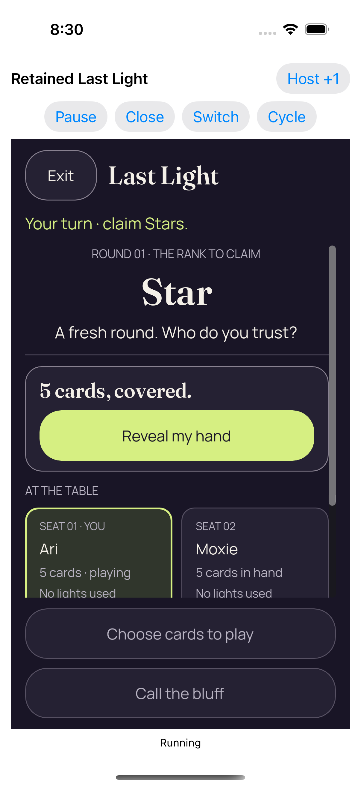</a> <code>E143D2DF-5182-456D-85B4-DB0178733F74.png</code> Real background and resume kept the same authority concealed_0_B3D60C08-8F96-45E7-A8CB-821F9FF28974.png | 1206 × 2622 px · 266,623 bytes SHA-256: <code>e1abe3d047eda7de2f841dcc375077651d87eae639385dd27b730892e769c4ff</code> Source: <code>/root/projects/PartyDeck/artifacts/evidence-storage/34525504734/godot-ios-retained-host-test-attempt-1/retained-host-test/artifacts/attachments/E143D2DF-5182-456D-85B4-DB0178733F74.png</code> Original case: <code>RetainedHostUITests/testActiveAndDormantBackgroundTransitionsStayConcealed()</code> — **passed** Original attachment timestamp: 1789072249.237 [Original result](evidence/result.json) · [Attachment index](companions.md) | **UNVIEWED original — no visual acceptance**. Original capture retained without direct visual review. Its recorded test, label, timestamp and outcome identify the source checkpoint; no pixel observation or visual acceptance is asserted. |
| <a href="attachments/00DCFDAE-D114-4CDD-8E5B-DC333AE4C85F.png">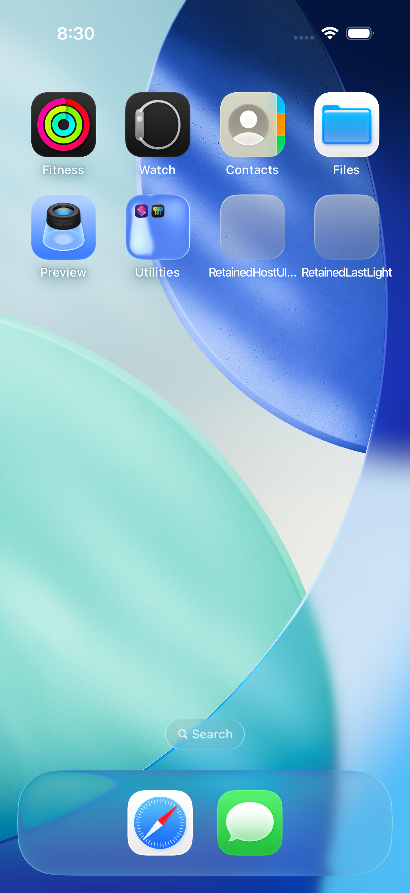</a> <code>00DCFDAE-D114-4CDD-8E5B-DC333AE4C85F.png</code> Actual Home screen_0_C7F2E1D4-3EE2-4FDE-8415-4E3026FA9A48.png | 1206 × 2622 px · 2,805,207 bytes SHA-256: <code>8798f13f66c43986d11d993b9c3496f00123c4ba96487dcf8663e7af5a7aaac2</code> Source: <code>/root/projects/PartyDeck/artifacts/evidence-storage/34525504734/godot-ios-retained-host-test-attempt-1/retained-host-test/artifacts/attachments/00DCFDAE-D114-4CDD-8E5B-DC333AE4C85F.png</code> Original case: <code>RetainedHostUITests/testActiveAndDormantBackgroundTransitionsStayConcealed()</code> — **passed** Original attachment timestamp: 1789072247.678 [Original result](evidence/result.json) · [Attachment index](companions.md) | **UNVIEWED original — no visual acceptance**. Original capture retained without direct visual review. Its recorded test, label, timestamp and outcome identify the source checkpoint; no pixel observation or visual acceptance is asserted. |
|  <code>BB023D2D-E16A-4CDA-B4CE-D616D620AFC6.png</code> Real reveal and card selection_0_2EE55CFA-C280-462A-88D6-1FC052090719.png | 1206 × 2622 px · 240,282 bytes SHA-256: <code>dabc1289fa1558aae7b1af9ccde991f6b429ef8732cc47c1edcc6e0c86570ac9</code> Source: <code>/root/projects/PartyDeck/artifacts/evidence-storage/34525504734/godot-ios-retained-host-test-attempt-1/retained-host-test/artifacts/attachments/BB023D2D-E16A-4CDA-B4CE-D616D620AFC6.png</code> Original case: <code>RetainedHostUITests/testActiveAndDormantBackgroundTransitionsStayConcealed()</code> — **passed** Original attachment timestamp: 1789072243.769 [Original result](evidence/result.json) · [Attachment index](companions.md) | **UNVIEWED original — no visual acceptance**. Original capture retained without direct visual review. Its recorded test, label, timestamp and outcome identify the source checkpoint; no pixel observation or visual acceptance is asserted. |
| <a href="attachments/BB48E72B-7106-419A-8835-1BC462C5A50F.png">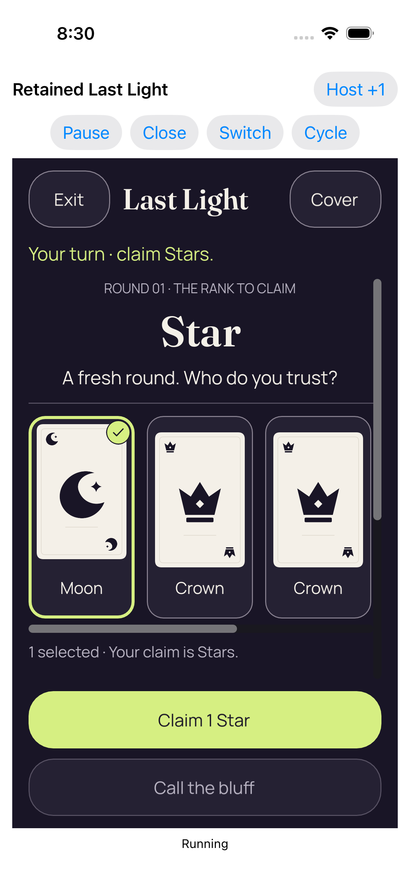</a> <code>BB48E72B-7106-419A-8835-1BC462C5A50F.png</code> Real reveal and card selection_0_6814890A-096D-4D85-B8EF-FB5A13BECBDB.png | 1206 × 2622 px · 240,282 bytes SHA-256: <code>dabc1289fa1558aae7b1af9ccde991f6b429ef8732cc47c1edcc6e0c86570ac9</code> Source: <code>/root/projects/PartyDeck/artifacts/evidence-storage/34525504734/godot-ios-retained-host-test-attempt-1/retained-host-test/artifacts/attachments/BB48E72B-7106-419A-8835-1BC462C5A50F.png</code> Original case: <code>RetainedHostUITests/testActiveAndDormantBackgroundTransitionsStayConcealed()</code> — **passed** Original attachment timestamp: 1789072237.077 [Original result](evidence/result.json) · [Attachment index](companions.md) | **UNVIEWED original — no visual acceptance**. Original capture retained without direct visual review. Its recorded test, label, timestamp and outcome identify the source checkpoint; no pixel observation or visual acceptance is asserted. |
| <a href="attachments/93FDEE8A-DF89-430A-ADA4-E19E81CDB1D7.png">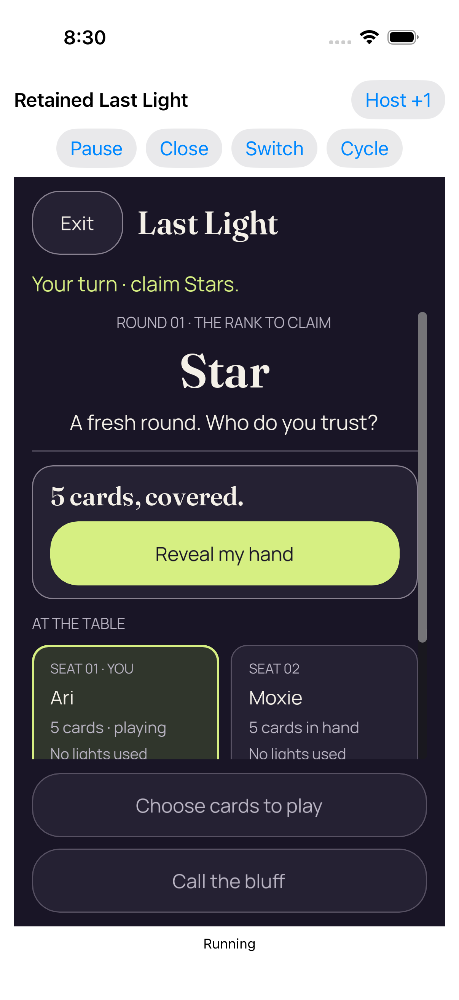</a> <code>93FDEE8A-DF89-430A-ADA4-E19E81CDB1D7.png</code> Coalesced native foreground loss and regain returned concealed_0_EFF958AA-D9CB-46D4-B003-B33CAD9A3A66.png | 1206 × 2622 px · 267,769 bytes SHA-256: <code>29f55be254337b66149d965d5e99a1bdd45601294ed962786361ca8aee0c663a</code> Source: <code>/root/projects/PartyDeck/artifacts/evidence-storage/34525504734/godot-ios-retained-host-test-attempt-1/retained-host-test/artifacts/attachments/93FDEE8A-DF89-430A-ADA4-E19E81CDB1D7.png</code> Original case: <code>RetainedHostUITests/testActiveAndDormantBackgroundTransitionsStayConcealed()</code> — **passed** Original attachment timestamp: 1789072232.603 [Original result](evidence/result.json) · [Attachment index](companions.md) | **UNVIEWED original — no visual acceptance**. Original capture retained without direct visual review. Its recorded test, label, timestamp and outcome identify the source checkpoint; no pixel observation or visual acceptance is asserted. |
|  <code>C90C4A86-E040-453E-BB48-BB5D2F019E82.png</code> Real reveal and card selection_0_18FEA76D-FAA4-4DB3-8862-8333BA912E63.png | 1206 × 2622 px · 240,282 bytes SHA-256: <code>dabc1289fa1558aae7b1af9ccde991f6b429ef8732cc47c1edcc6e0c86570ac9</code> Source: <code>/root/projects/PartyDeck/artifacts/evidence-storage/34525504734/godot-ios-retained-host-test-attempt-1/retained-host-test/artifacts/attachments/C90C4A86-E040-453E-BB48-BB5D2F019E82.png</code> Original case: <code>RetainedHostUITests/testActiveAndDormantBackgroundTransitionsStayConcealed()</code> — **passed** Original attachment timestamp: 1789072231.642 [Original result](evidence/result.json) · [Attachment index](companions.md) | **UNVIEWED original — no visual acceptance**. Original capture retained without direct visual review. Its recorded test, label, timestamp and outcome identify the source checkpoint; no pixel observation or visual acceptance is asserted. |
|  <code>C9CB11DB-01A9-4179-B52F-D3478F6EBFAC.png</code> Four completed real entries in one retained engine process_0_A44C4920-CD88-4E48-A4C0-3F56632BDD11.png | 1206 × 2622 px · 99,578 bytes SHA-256: <code>0c63d58771552798b55db34dd8645860ed1f17d1dc93f500274622ee86acbb59</code> Source: <code>/root/projects/PartyDeck/artifacts/evidence-storage/34525504734/godot-ios-retained-host-test-attempt-1/retained-host-test/artifacts/attachments/C9CB11DB-01A9-4179-B52F-D3478F6EBFAC.png</code> Original case: <code>RetainedHostUITests/testRepeated2DAnd3DKeepOneDormantEngine()</code> — **passed** Original attachment timestamp: 1789072598.496 [Original result](evidence/result.json) · [Attachment index](companions.md) | **UNVIEWED original — no visual acceptance**. Original capture retained without direct visual review. Its recorded test, label, timestamp and outcome identify the source checkpoint; no pixel observation or visual acceptance is asserted. |
|  <code>233101B2-AD30-45C4-9F66-D920FA39AB0D.png</code> Whole recipient scene retired; retained services dormant_0_6682463A-0AE7-43D5-AF7A-F2B84811251C.png | 1206 × 2622 px · 99,578 bytes SHA-256: <code>0c63d58771552798b55db34dd8645860ed1f17d1dc93f500274622ee86acbb59</code> Source: <code>/root/projects/PartyDeck/artifacts/evidence-storage/34525504734/godot-ios-retained-host-test-attempt-1/retained-host-test/artifacts/attachments/233101B2-AD30-45C4-9F66-D920FA39AB0D.png</code> Original case: <code>RetainedHostUITests/testRepeated2DAnd3DKeepOneDormantEngine()</code> — **passed** Original attachment timestamp: 1789072597.373 [Original result](evidence/result.json) · [Attachment index](companions.md) | **UNVIEWED original — no visual acceptance**. Original capture retained without direct visual review. Its recorded test, label, timestamp and outcome identify the source checkpoint; no pixel observation or visual acceptance is asserted. |
|  <code>F97DE381-0C3F-425F-816A-1B825C567197.png</code> Real play accepted by the Kotlin authority_0_79E0F188-B7CB-4EDD-BB91-BAD17AAB4CDD.png | 1206 × 2622 px · 235,669 bytes SHA-256: <code>fac4cf1b5a6c056a74db010b3c790c71fd072715a01520531d28b959eb6e387a</code> Source: <code>/root/projects/PartyDeck/artifacts/evidence-storage/34525504734/godot-ios-retained-host-test-attempt-1/retained-host-test/artifacts/attachments/F97DE381-0C3F-425F-816A-1B825C567197.png</code> Original case: <code>RetainedHostUITests/testRepeated2DAnd3DKeepOneDormantEngine()</code> — **passed** Original attachment timestamp: 1789072591.604 [Original result](evidence/result.json) · [Attachment index](companions.md) | **UNVIEWED original — no visual acceptance**. Original capture retained without direct visual review. Its recorded test, label, timestamp and outcome identify the source checkpoint; no pixel observation or visual acceptance is asserted. |
| <a href="attachments/31F4727B-2E91-46FD-88DB-4D00A3426349.png">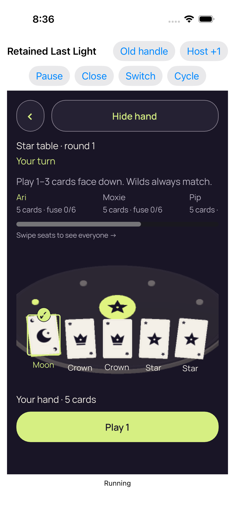</a> <code>31F4727B-2E91-46FD-88DB-4D00A3426349.png</code> Real reveal and card selection_0_63650123-AEB6-4B4F-8E88-552210784866.png | 1206 × 2622 px · 325,653 bytes SHA-256: <code>4340433b44fc109f16e8dc853f5f0b8c2385f357c0e3734d6907c8cba3007bab</code> Source: <code>/root/projects/PartyDeck/artifacts/evidence-storage/34525504734/godot-ios-retained-host-test-attempt-1/retained-host-test/artifacts/attachments/31F4727B-2E91-46FD-88DB-4D00A3426349.png</code> Original case: <code>RetainedHostUITests/testRepeated2DAnd3DKeepOneDormantEngine()</code> — **passed** Original attachment timestamp: 1789072580.642 [Original result](evidence/result.json) · [Attachment index](companions.md) | **UNVIEWED original — no visual acceptance**. Original capture retained without direct visual review. Its recorded test, label, timestamp and outcome identify the source checkpoint; no pixel observation or visual acceptance is asserted. |
| <a href="attachments/05C9FF15-A969-496C-81B6-B9E1B5B841A5.png">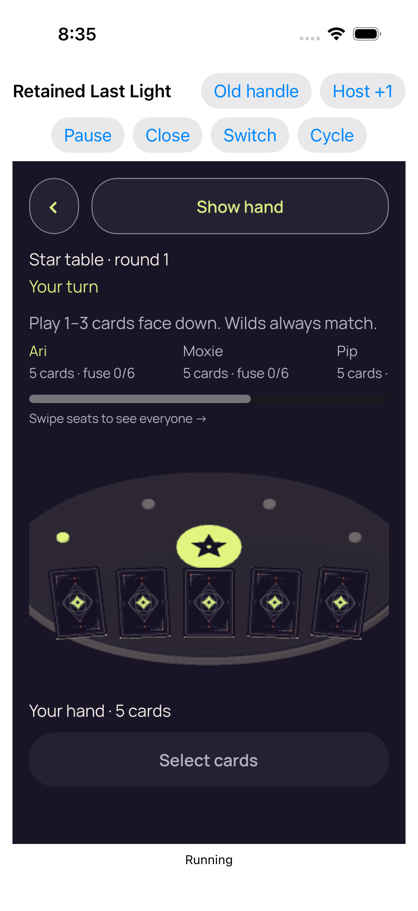</a> <code>05C9FF15-A969-496C-81B6-B9E1B5B841A5.png</code> Entry 4 fresh concealed 3d_0_A30FA371-4C5D-4198-BFFD-56474F866A29.png | 1206 × 2622 px · 366,633 bytes SHA-256: <code>b4732b6364d58d7cf88521b6c3eae2692d1269f4f08c19a35585767d2c171273</code> Source: <code>/root/projects/PartyDeck/artifacts/evidence-storage/34525504734/godot-ios-retained-host-test-attempt-1/retained-host-test/artifacts/attachments/05C9FF15-A969-496C-81B6-B9E1B5B841A5.png</code> Original case: <code>RetainedHostUITests/testRepeated2DAnd3DKeepOneDormantEngine()</code> — **passed** Original attachment timestamp: 1789072557.864 [Original result](evidence/result.json) · [Attachment index](companions.md) | **UNVIEWED original — no visual acceptance**. Original capture retained without direct visual review. Its recorded test, label, timestamp and outcome identify the source checkpoint; no pixel observation or visual acceptance is asserted. |
|  <code>653146FB-6802-461A-A299-016C738573BC.png</code> Whole recipient scene retired; retained services dormant_0_2326478E-FD3E-4686-A8BB-E8A44C7B1F8D.png | 1206 × 2622 px · 99,372 bytes SHA-256: <code>7d06dbecb12de3a8f483a4a5ff2b6010438c42728c3cc489aebbb7ba81fdd21a</code> Source: <code>/root/projects/PartyDeck/artifacts/evidence-storage/34525504734/godot-ios-retained-host-test-attempt-1/retained-host-test/artifacts/attachments/653146FB-6802-461A-A299-016C738573BC.png</code> Original case: <code>RetainedHostUITests/testRepeated2DAnd3DKeepOneDormantEngine()</code> — **passed** Original attachment timestamp: 1789072529.356 [Original result](evidence/result.json) · [Attachment index](companions.md) | **UNVIEWED original — no visual acceptance**. Original capture retained without direct visual review. Its recorded test, label, timestamp and outcome identify the source checkpoint; no pixel observation or visual acceptance is asserted. |
| <a href="attachments/0DCA9C7D-5F20-4B6A-A853-40AE4A69748E.png">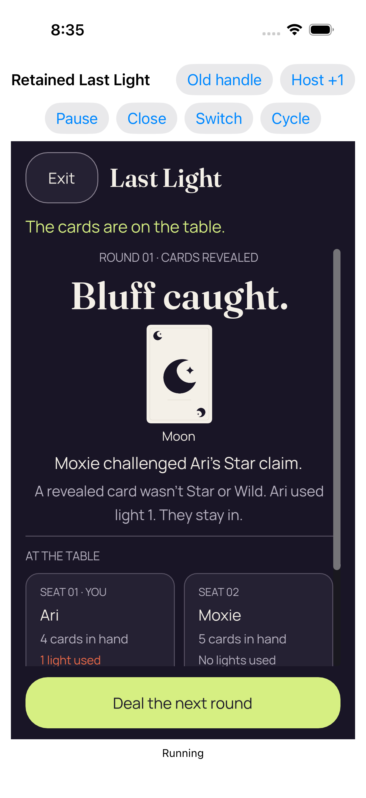</a> <code>0DCA9C7D-5F20-4B6A-A853-40AE4A69748E.png</code> Real play accepted by the Kotlin authority_0_16CD005C-BF87-4761-806B-9DAC86C455E5.png | 1206 × 2622 px · 273,571 bytes SHA-256: <code>6f9a9f1931c9e1bd0b7486278eb199767b300fa654fc78d6d406a06f659e9d70</code> Source: <code>/root/projects/PartyDeck/artifacts/evidence-storage/34525504734/godot-ios-retained-host-test-attempt-1/retained-host-test/artifacts/attachments/0DCA9C7D-5F20-4B6A-A853-40AE4A69748E.png</code> Original case: <code>RetainedHostUITests/testRepeated2DAnd3DKeepOneDormantEngine()</code> — **passed** Original attachment timestamp: 1789072526.809 [Original result](evidence/result.json) · [Attachment index](companions.md) | **UNVIEWED original — no visual acceptance**. Original capture retained without direct visual review. Its recorded test, label, timestamp and outcome identify the source checkpoint; no pixel observation or visual acceptance is asserted. |
| <a href="attachments/46BE68CC-AB3C-4AE6-BB6E-2B52D3A25E91.png">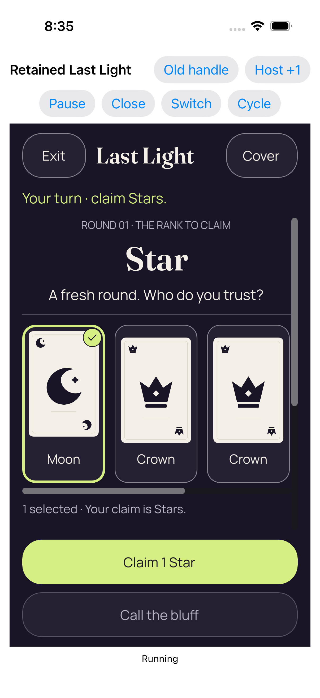</a> <code>46BE68CC-AB3C-4AE6-BB6E-2B52D3A25E91.png</code> Real reveal and card selection_0_445F360B-D2EF-4EE4-9B16-5D6A22B2467F.png | 1206 × 2622 px · 245,262 bytes SHA-256: <code>6cb0eb2096a9d72434ae54d59059314c86f17d0ed1b10580b60ec307234001c4</code> Source: <code>/root/projects/PartyDeck/artifacts/evidence-storage/34525504734/godot-ios-retained-host-test-attempt-1/retained-host-test/artifacts/attachments/46BE68CC-AB3C-4AE6-BB6E-2B52D3A25E91.png</code> Original case: <code>RetainedHostUITests/testRepeated2DAnd3DKeepOneDormantEngine()</code> — **passed** Original attachment timestamp: 1789072523.165 [Original result](evidence/result.json) · [Attachment index](companions.md) | **UNVIEWED original — no visual acceptance**. Original capture retained without direct visual review. Its recorded test, label, timestamp and outcome identify the source checkpoint; no pixel observation or visual acceptance is asserted. |
| <a href="attachments/68DE7E15-7269-4ED3-8FB5-62E10E0EB47B.png">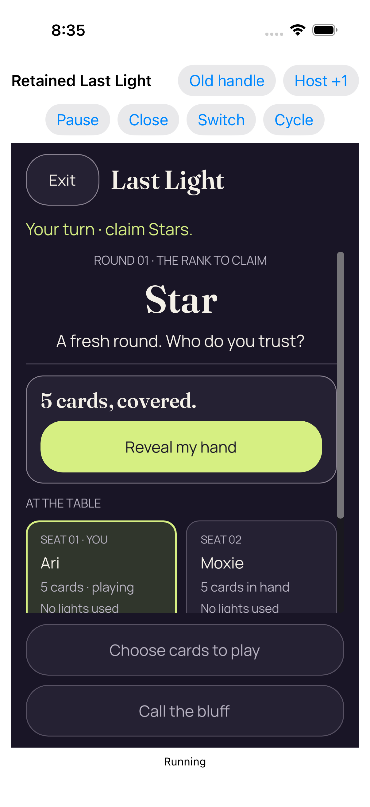</a> <code>68DE7E15-7269-4ED3-8FB5-62E10E0EB47B.png</code> Entry 3 fresh concealed 2d_0_E9229039-1133-4ABF-B263-58B5CFEC9CF1.png | 1206 × 2622 px · 270,259 bytes SHA-256: <code>b78901b865cd4f1236cd03e68ff8a46c334fdfeb503410259fe57968239fbbe3</code> Source: <code>/root/projects/PartyDeck/artifacts/evidence-storage/34525504734/godot-ios-retained-host-test-attempt-1/retained-host-test/artifacts/attachments/68DE7E15-7269-4ED3-8FB5-62E10E0EB47B.png</code> Original case: <code>RetainedHostUITests/testRepeated2DAnd3DKeepOneDormantEngine()</code> — **passed** Original attachment timestamp: 1789072517.642 [Original result](evidence/result.json) · [Attachment index](companions.md) | **UNVIEWED original — no visual acceptance**. Original capture retained without direct visual review. Its recorded test, label, timestamp and outcome identify the source checkpoint; no pixel observation or visual acceptance is asserted. |
|  <code>6F569085-4309-4C83-92AB-BCE199BF86A1.png</code> Whole recipient scene retired; retained services dormant_0_79091F66-71A3-4095-AB29-5257B61602A0.png | 1206 × 2622 px · 99,372 bytes SHA-256: <code>7d06dbecb12de3a8f483a4a5ff2b6010438c42728c3cc489aebbb7ba81fdd21a</code> Source: <code>/root/projects/PartyDeck/artifacts/evidence-storage/34525504734/godot-ios-retained-host-test-attempt-1/retained-host-test/artifacts/attachments/6F569085-4309-4C83-92AB-BCE199BF86A1.png</code> Original case: <code>RetainedHostUITests/testRepeated2DAnd3DKeepOneDormantEngine()</code> — **passed** Original attachment timestamp: 1789072514.285 [Original result](evidence/result.json) · [Attachment index](companions.md) | **UNVIEWED original — no visual acceptance**. Original capture retained without direct visual review. Its recorded test, label, timestamp and outcome identify the source checkpoint; no pixel observation or visual acceptance is asserted. |
| <a href="attachments/5EFF60CD-9CCA-49C3-9893-79D8EBA0EC48.png">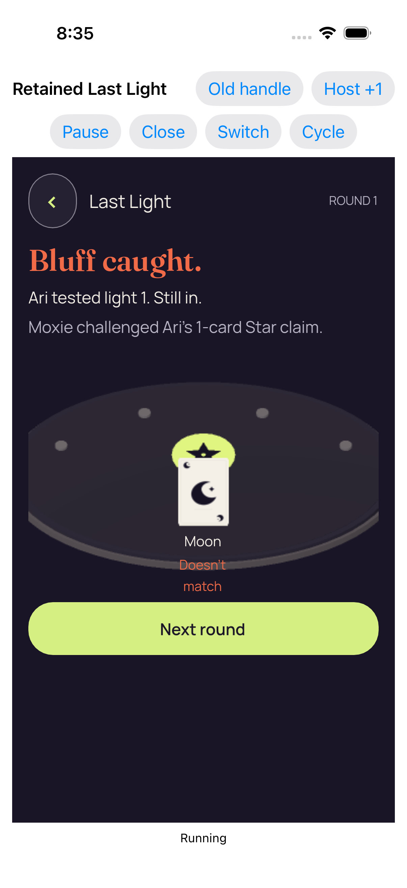</a> <code>5EFF60CD-9CCA-49C3-9893-79D8EBA0EC48.png</code> Real play accepted by the Kotlin authority_0_A7F7A2AF-2D2A-435D-8A3C-89C529193535.png | 1206 × 2622 px · 235,449 bytes SHA-256: <code>07b2211c2fb2a471a3a9c59872102d3cd6a51ee1f5a601c4d4626d170920862d</code> Source: <code>/root/projects/PartyDeck/artifacts/evidence-storage/34525504734/godot-ios-retained-host-test-attempt-1/retained-host-test/artifacts/attachments/5EFF60CD-9CCA-49C3-9893-79D8EBA0EC48.png</code> Original case: <code>RetainedHostUITests/testRepeated2DAnd3DKeepOneDormantEngine()</code> — **passed** Original attachment timestamp: 1789072511.807 [Original result](evidence/result.json) · [Attachment index](companions.md) | **UNVIEWED original — no visual acceptance**. Original capture retained without direct visual review. Its recorded test, label, timestamp and outcome identify the source checkpoint; no pixel observation or visual acceptance is asserted. |
| <a href="attachments/06B43B13-5EA7-47BD-8064-00D8191218F9.png">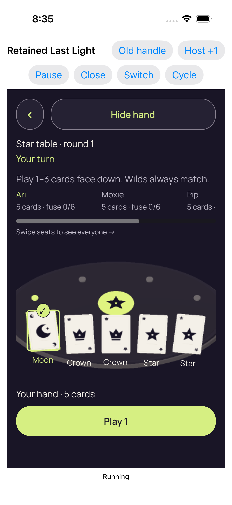</a> <code>06B43B13-5EA7-47BD-8064-00D8191218F9.png</code> Real reveal and card selection_0_CC5A9C81-D510-4C2F-BCAA-C688B2889FBA.png | 1206 × 2622 px · 325,449 bytes SHA-256: <code>7b5876bffac5a581ce052edd01b883f42a4e0f1a64b9bbb7b325bb29435cd0d6</code> Source: <code>/root/projects/PartyDeck/artifacts/evidence-storage/34525504734/godot-ios-retained-host-test-attempt-1/retained-host-test/artifacts/attachments/06B43B13-5EA7-47BD-8064-00D8191218F9.png</code> Original case: <code>RetainedHostUITests/testRepeated2DAnd3DKeepOneDormantEngine()</code> — **passed** Original attachment timestamp: 1789072504.683 [Original result](evidence/result.json) · [Attachment index](companions.md) | **UNVIEWED original — no visual acceptance**. Original capture retained without direct visual review. Its recorded test, label, timestamp and outcome identify the source checkpoint; no pixel observation or visual acceptance is asserted. |
|  <code>ED39CD87-FF0D-44CE-A311-906DAE60858E.png</code> Entry 2 fresh concealed 3d_0_236E6E57-5D41-45C7-AE74-54D428BFCB4F.png | 1206 × 2622 px · 366,339 bytes SHA-256: <code>9749514ff624df887bd203bd52e920b6a12fef18c7a7324497a9479f3976d452</code> Source: <code>/root/projects/PartyDeck/artifacts/evidence-storage/34525504734/godot-ios-retained-host-test-attempt-1/retained-host-test/artifacts/attachments/ED39CD87-FF0D-44CE-A311-906DAE60858E.png</code> Original case: <code>RetainedHostUITests/testRepeated2DAnd3DKeepOneDormantEngine()</code> — **passed** Original attachment timestamp: 1789072445.603 [Original result](evidence/result.json) · [Attachment index](companions.md) | **UNVIEWED original — no visual acceptance**. Original capture retained without direct visual review. Its recorded test, label, timestamp and outcome identify the source checkpoint; no pixel observation or visual acceptance is asserted. |
| <a href="attachments/851E69C1-BF7F-4EFC-A32F-83299180E9A7.png">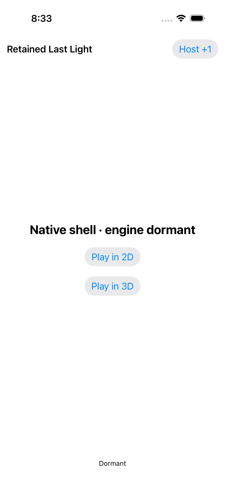</a> <code>851E69C1-BF7F-4EFC-A32F-83299180E9A7.png</code> Whole recipient scene retired; retained services dormant_0_29F3BA2A-FBA5-4933-A2DA-1FA11E1FA733.png | 1206 × 2622 px · 98,785 bytes SHA-256: <code>66eded75c3c99d55bcd5db0bc74b96102e2736ca84ed4157e9817626c3c0114f</code> Source: <code>/root/projects/PartyDeck/artifacts/evidence-storage/34525504734/godot-ios-retained-host-test-attempt-1/retained-host-test/artifacts/attachments/851E69C1-BF7F-4EFC-A32F-83299180E9A7.png</code> Original case: <code>RetainedHostUITests/testRepeated2DAnd3DKeepOneDormantEngine()</code> — **passed** Original attachment timestamp: 1789072409.483 [Original result](evidence/result.json) · [Attachment index](companions.md) | **UNVIEWED original — no visual acceptance**. Original capture retained without direct visual review. Its recorded test, label, timestamp and outcome identify the source checkpoint; no pixel observation or visual acceptance is asserted. |
| <a href="attachments/20F05055-14C3-4A94-B9B6-4011D8A2DAFF.png">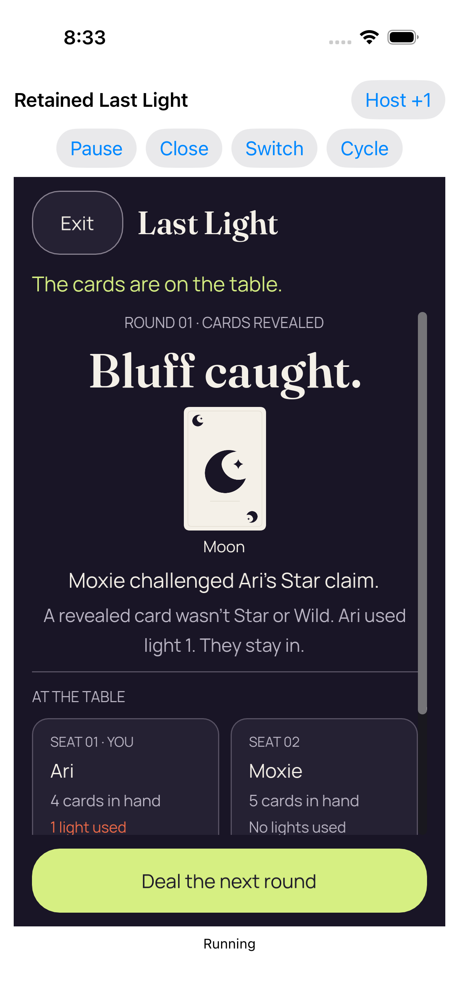</a> <code>20F05055-14C3-4A94-B9B6-4011D8A2DAFF.png</code> Real play accepted by the Kotlin authority_0_31161610-EFF1-47C1-98E6-0B3EE22434F4.png | 1206 × 2622 px · 267,747 bytes SHA-256: <code>35725cfa11dfed5e613aa88f8b624c9b0461c058052da4e868769eccd9a33b21</code> Source: <code>/root/projects/PartyDeck/artifacts/evidence-storage/34525504734/godot-ios-retained-host-test-attempt-1/retained-host-test/artifacts/attachments/20F05055-14C3-4A94-B9B6-4011D8A2DAFF.png</code> Original case: <code>RetainedHostUITests/testRepeated2DAnd3DKeepOneDormantEngine()</code> — **passed** Original attachment timestamp: 1789072405.582 [Original result](evidence/result.json) · [Attachment index](companions.md) | **UNVIEWED original — no visual acceptance**. Original capture retained without direct visual review. Its recorded test, label, timestamp and outcome identify the source checkpoint; no pixel observation or visual acceptance is asserted. |
|  <code>CE28093D-A39B-480B-96F8-418973947492.png</code> Real reveal and card selection_0_8CC4B538-C34D-4466-BDE1-5ECDA59E4877.png | 1206 × 2622 px · 240,152 bytes SHA-256: <code>d831818ff2da2197f0265b70c5c52f9e6f1b33ad2663053a5c41ed843a876b19</code> Source: <code>/root/projects/PartyDeck/artifacts/evidence-storage/34525504734/godot-ios-retained-host-test-attempt-1/retained-host-test/artifacts/attachments/CE28093D-A39B-480B-96F8-418973947492.png</code> Original case: <code>RetainedHostUITests/testRepeated2DAnd3DKeepOneDormantEngine()</code> — **passed** Original attachment timestamp: 1789072373.363 [Original result](evidence/result.json) · [Attachment index](companions.md) | **UNVIEWED original — no visual acceptance**. Original capture retained without direct visual review. Its recorded test, label, timestamp and outcome identify the source checkpoint; no pixel observation or visual acceptance is asserted. |
| <a href="attachments/A9865F81-0852-432E-9539-C5332EB354E8.png">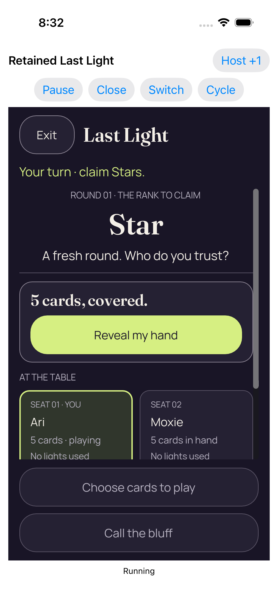</a> <code>A9865F81-0852-432E-9539-C5332EB354E8.png</code> Entry 1 fresh concealed 2d_0_0BC14B3A-BC03-4AEB-ACF1-E444573DF56D.png | 1206 × 2622 px · 265,006 bytes SHA-256: <code>ac4443873c9dc8b34c71616adc8581dc5e382963c4a942d4fc7d982ecc3ee56d</code> Source: <code>/root/projects/PartyDeck/artifacts/evidence-storage/34525504734/godot-ios-retained-host-test-attempt-1/retained-host-test/artifacts/attachments/A9865F81-0852-432E-9539-C5332EB354E8.png</code> Original case: <code>RetainedHostUITests/testRepeated2DAnd3DKeepOneDormantEngine()</code> — **passed** Original attachment timestamp: 1789072342.355 [Original result](evidence/result.json) · [Attachment index](companions.md) | **UNVIEWED original — no visual acceptance**. Original capture retained without direct visual review. Its recorded test, label, timestamp and outcome identify the source checkpoint; no pixel observation or visual acceptance is asserted. |
| <a href="attachments/60487A22-060F-4018-8DB2-1A19CD3033F1.png">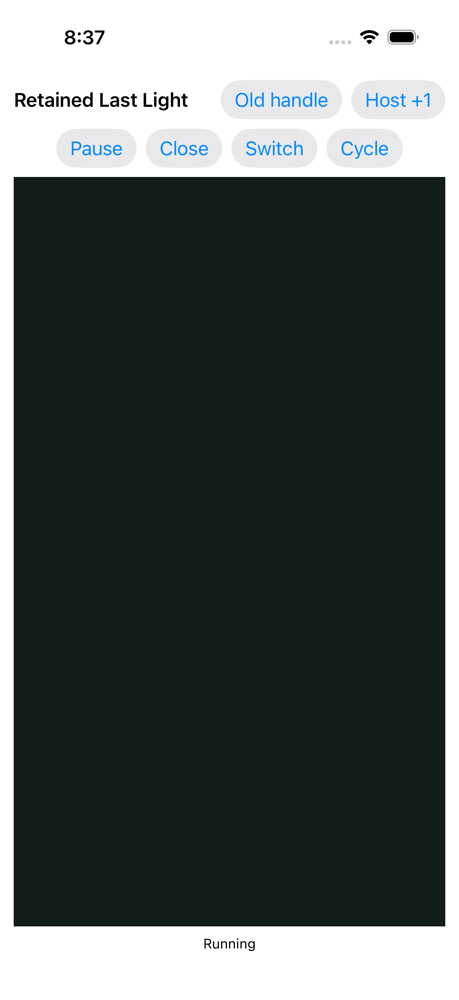</a> <code>60487A22-060F-4018-8DB2-1A19CD3033F1.png</code> Failed retained observation_0_3CD1FD8A-B98E-44B6-BB6C-8924EB1E4235.png | 1206 × 2622 px · 93,446 bytes SHA-256: <code>f7e7217247069cee92f76724719f69c4f4af2d455d97164defb32ce664426d6d</code> Source: <code>/root/projects/PartyDeck/artifacts/evidence-storage/34525504734/godot-ios-retained-host-test-attempt-1/retained-host-test/artifacts/attachments/60487A22-060F-4018-8DB2-1A19CD3033F1.png</code> Original case: <code>RetainedHostUITests/testStaleFirstReadyAndCloseCompletionReentry()</code> — **failed** Original attachment timestamp: 1789072642.014 [Original result](evidence/result.json) · [Attachment index](companions.md) | **Direct original view by review_design**. The isolated startup-phase failure still shows Retained Last Light, Old handle, Host +1 and the Pause/Close/Switch/Cycle controls. A solid dark cover fills the native viewport; no game table, card faces or game actions are visible. Running remains visible below the covered viewport. This is consistent with the separately recorded cover-visible failure context but is not an atomic measurement pairing. The still does not establish continuous privacy, successful entry, native timing improvement or a delay cause. |
