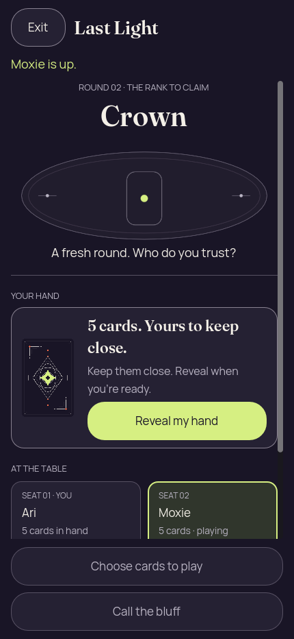
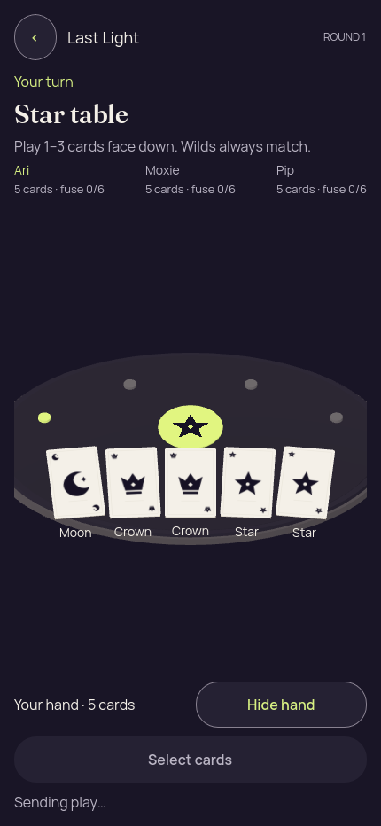
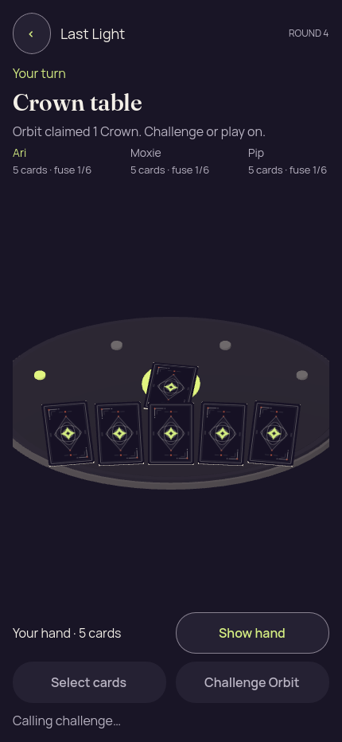

# Godot 2D and 3D — matched packed seed-2 gameplay

[All screenshot collections](../README.md)

**Evidence status:** Both desktop presentations completed the same 42-snapshot authority trace using actual Godot input through the shared bridge. Each performed 2 viewer plays, 2 challenges and 13 round advances to the round-14 winner. Both renderer exits are 0 and retained logs contain no engine/script errors. The 3D winner still fails visual review: wrong Star emblem for the Crown claim and missing final challenge/burnout explanation.

This run used the same canonical PCK for both presentations: SHA-256 `2c840bb8a20177aaed657cf5ae6f0bcee74964bc591d269ed741cd9e58365e35`, independently recomputed against the packed artifact. Original PNG bytes, reports, per-image receipts and both process logs are preserved.

Actual Godot `4.7.2.stable.official.ed1daf0bf`, gl_compatibility / X11 / Xvfb, OpenGL 4.5 / Mesa llvmpipe 25.2.8 LLVM 20.1.2. Viewport: **430 × 932**, text scale 1.0, seed 2, reduced motion enabled. This is desktop rendering at phone dimensions.

Working-tree basis: `e1ee4fb7d498449035181515dd7f40899b2b6c2f`; `workingTreeDirty=true`, so it is **not an exact clean source revision**. The harness checks source/PCK stability during the run. Source fingerprint: `26426170ab4341d7ff72b3b387b3f70f5938376d0285f216d102fb27689f9637`.

Run: `2026-09-10T00:47:44.096195320Z` to `2026-09-10T00:48:15.126801986Z`.

[Original paired run report](report.json) · [2D result and trace](2d/result.json) · [3D result and trace](3d/result.json) · [2D Godot log](2d/godot.log) · [3D Godot log](3d/godot.log).

The full 42-entry traces are independently equal, and each recomputes to SHA-256 `79b5b2a6415a365d531da3488b7b87f1b2309f2b1208899ee5b4618da16be674`. Both result files match the paired report and record renderer exit 0. Logs retain V-Sync and root-user warnings; neither contains an engine/script error. This fresh run supplies clean-exit evidence missing from [the first 2D gameplay run](../godot-first-real-2d-input/README.md), whose original shutdown failure remains recorded.

All 18 unique image states were visually inspected, and hashes establish that covered/fresh-entry PNGs match the initial concealed frame within each presentation. Every one of the 22 scenario records is retained. Initial, covered, inactive, outcome and fresh-entry diagnostics report zero private faces, labels and selected cards. Revealed/pending-play frames show only the viewer’s hand. The 3D selected frame has six private labels: five rank captions and one checkmark.

The 2D round and winner views explain the public proof and penalty. **The 3D winner is a visual failure:** it displays Star behind Moon for a Crown claim and omits the final claimant/challenger/burnout explanation. Correct result: Orbit challenged Moxie’s Crown claim, Moon did not match, and Moxie burned out on light 4. The 3D roster also extends beyond the initial horizontal viewport. Matching authority traces do not establish matching visual correctness.

The exercised scope includes reveal/select/cover, foreground privacy, real play and challenge events, pending-until-authority-view behavior, round continuation, winner, navigation intent and fresh presentation entry. There is no native accessibility, touch, physical LAN, OS lifecycle or native navigation-screen qualification. Stage 11 has no screenshot because neither presentation required the optional lobby confirmation at this finished state; no missing image is invented.

## 2D

| Original image | Scenario and provenance |
| --- | --- |
|  | **Initial concealed own hand — 2D** Godot 4.7.2 desktop 2D, real Kotlin authority, canonical PCK Original: [01-concealed.png](2d/01-concealed.png) 430 × 932 px; text 1×; seed 2 SHA-256: <code>1609dcecbe23473394038126943aee9545ce82932cdab1b9dbbedb36b7a9fc46</code> Authority revision: 0 View SHA-256: <code>edf527cc8ff21d8a5485008fc35d21e784dda2adb745e2c1188b9c6b08f447ca</code> [Original receipt](2d/01-concealed.receipt.json) |
|  | **Own hand revealed — 2D** Godot 4.7.2 desktop 2D, real Kotlin authority, canonical PCK Original: [02-revealed.png](2d/02-revealed.png) 430 × 932 px; text 1×; seed 2 SHA-256: <code>a54d55a66ec2f09cd921a10b8127b77052862d8973aab05423b55ca7132b41b0</code> Authority revision: 0 View SHA-256: <code>edf527cc8ff21d8a5485008fc35d21e784dda2adb745e2c1188b9c6b08f447ca</code> [Original receipt](2d/02-revealed.receipt.json) |
|  | **Moon selected for a Star claim — 2D** Godot 4.7.2 desktop 2D, real Kotlin authority, canonical PCK Original: [03-selected.png](2d/03-selected.png) 430 × 932 px; text 1×; seed 2 SHA-256: <code>b926c9f847c2b4c8065c376169b3242f4044f5605ebca6472c6a061dcffbf1b8</code> Authority revision: 0 View SHA-256: <code>edf527cc8ff21d8a5485008fc35d21e784dda2adb745e2c1188b9c6b08f447ca</code> [Original receipt](2d/03-selected.receipt.json) |
|  | **Hand covered and selection cleared — 2D** Godot 4.7.2 desktop 2D, real Kotlin authority, canonical PCK Original: [04-covered.png](2d/04-covered.png) 430 × 932 px; text 1×; seed 2 SHA-256: <code>1609dcecbe23473394038126943aee9545ce82932cdab1b9dbbedb36b7a9fc46</code> Authority revision: 0 View SHA-256: <code>edf527cc8ff21d8a5485008fc35d21e784dda2adb745e2c1188b9c6b08f447ca</code> [Original receipt](2d/04-covered.receipt.json) |
|  | **Hand concealed while the presentation is inactive — 2D** Godot 4.7.2 desktop 2D, real Kotlin authority, canonical PCK Original: [05-background-privacy.png](2d/05-background-privacy.png) 430 × 932 px; text 1×; seed 2 SHA-256: <code>ca40b79751f9444a908be3f638d02b566e375fb91e77fbe84487ebd667810814</code> Authority revision: 0 View SHA-256: <code>edf527cc8ff21d8a5485008fc35d21e784dda2adb745e2c1188b9c6b08f447ca</code> [Original receipt](2d/05-background-privacy.receipt.json) Renderer foreground=false privacy check; this is not a native OS background capture. |
|  | **Play sent; waiting for the authority view — 2D** Godot 4.7.2 desktop 2D, real Kotlin authority, canonical PCK Original: [06-play-pending.png](2d/06-play-pending.png) 430 × 932 px; text 1×; seed 2 SHA-256: <code>b2741012013047fe9e7d6aa375d1092b86b8a82fad6d3c0021bfafd4ae0130ba</code> Authority revision: 0 View SHA-256: <code>edf527cc8ff21d8a5485008fc35d21e784dda2adb745e2c1188b9c6b08f447ca</code> [Original receipt](2d/06-play-pending.receipt.json) |
|  | **Moon bluff caught; Ari used light 1 and stays in — 2D** Godot 4.7.2 desktop 2D, real Kotlin authority, canonical PCK Original: [07-public-round-result.png](2d/07-public-round-result.png) 430 × 932 px; text 1×; seed 2 SHA-256: <code>18087509121376c9f028470b1d15683356438a050bcfe5a35e545e1d5caa158e</code> Authority revision: 2 View SHA-256: <code>0aa7ada0d2891b98c3751f2ece396f921c4eaa223f44d344a860ff006766b852</code> [Original receipt](2d/07-public-round-result.receipt.json) |
|  | **Round 2 redealt with Crown; Moxie takes the turn — 2D** Godot 4.7.2 desktop 2D, real Kotlin authority, canonical PCK Original: [08-next-round.png](2d/08-next-round.png) 430 × 932 px; text 1×; seed 2 SHA-256: <code>f6f7e337cd87695c7d718aa0e63504562f592f42d04d252d5e550cc11fdf6755</code> Authority revision: 3 View SHA-256: <code>598baddae45fa6e87442003dd27d382e28529575c23ebf6b363b79ec914f40ea</code> [Original receipt](2d/08-next-round.receipt.json) |
|  | **Challenge sent against Orbit’s Crown claim — 2D** Godot 4.7.2 desktop 2D, real Kotlin authority, canonical PCK Original: [09-challenge-pending.png](2d/09-challenge-pending.png) 430 × 932 px; text 1×; seed 2 SHA-256: <code>9f2f5f9a0eb89bed27b71eb99c96a30975c4333695d0d823b9ddab426d83729b</code> Authority revision: 10 View SHA-256: <code>40a9485d3575a9891e566cb632da0e357ea0c43542ebc38a6927198a5a2a9e68</code> [Original receipt](2d/09-challenge-pending.receipt.json) |
|  | **Orbit wins in round 14; public Moon proof — 2D** Godot 4.7.2 desktop 2D, real Kotlin authority, canonical PCK Original: [10-winner.png](2d/10-winner.png) 430 × 932 px; text 1×; seed 2 SHA-256: <code>4d83c897e5670096846e637d3219452a367e744b83dde44d8faf97c3f15a26f7</code> Authority revision: 41 View SHA-256: <code>ce5672d29351f3e806102334c6b6ed1946ad63ba2cc206b5064a883f128e69ad</code> [Original receipt](2d/10-winner.receipt.json) |
|  | **Fresh presentation starts concealed with no stale selection — 2D** Godot 4.7.2 desktop 2D, real Kotlin authority, canonical PCK Original: [12-fresh-presentation.png](2d/12-fresh-presentation.png) 430 × 932 px; text 1×; seed 2 SHA-256: <code>1609dcecbe23473394038126943aee9545ce82932cdab1b9dbbedb36b7a9fc46</code> Authority revision: 0 View SHA-256: <code>edf527cc8ff21d8a5485008fc35d21e784dda2adb745e2c1188b9c6b08f447ca</code> [Original receipt](2d/12-fresh-presentation.receipt.json) Fresh presentation identity and cleared private state were checked; this capture is the renderer, not a native lobby screen. |

## 3D

| Original image | Scenario and provenance |
| --- | --- |
|  | **Initial concealed own hand — 3D** Godot 4.7.2 desktop 3D, real Kotlin authority, canonical PCK Original: [01-concealed.png](3d/01-concealed.png) 430 × 932 px; text 1×; seed 2 SHA-256: <code>0ba1de5264dee6cdf258061b13c93d7495c81395e3d00fa792edde81acc127f8</code> Authority revision: 0 View SHA-256: <code>edf527cc8ff21d8a5485008fc35d21e784dda2adb745e2c1188b9c6b08f447ca</code> [Original receipt](3d/01-concealed.receipt.json) Only the first three roster entries are shown initially; more roster content lies outside the horizontal viewport. |
|  | **Own hand revealed — 3D** Godot 4.7.2 desktop 3D, real Kotlin authority, canonical PCK Original: [02-revealed.png](3d/02-revealed.png) 430 × 932 px; text 1×; seed 2 SHA-256: <code>4bc3e80f119400e2832b979d1780d1467a07270f3974ef746bcc8f285faccb8c</code> Authority revision: 0 View SHA-256: <code>edf527cc8ff21d8a5485008fc35d21e784dda2adb745e2c1188b9c6b08f447ca</code> [Original receipt](3d/02-revealed.receipt.json) Only the first three roster entries are shown initially; more roster content lies outside the horizontal viewport. |
|  | **Moon selected for a Star claim — 3D** Godot 4.7.2 desktop 3D, real Kotlin authority, canonical PCK Original: [03-selected.png](3d/03-selected.png) 430 × 932 px; text 1×; seed 2 SHA-256: <code>167d1a432266eeceb19d1114740dfe064d502e8c8204f6d0d16d2e7ed2b99118</code> Authority revision: 0 View SHA-256: <code>edf527cc8ff21d8a5485008fc35d21e784dda2adb745e2c1188b9c6b08f447ca</code> [Original receipt](3d/03-selected.receipt.json) Only the first three roster entries are shown initially; more roster content lies outside the horizontal viewport. |
|  | **Hand covered and selection cleared — 3D** Godot 4.7.2 desktop 3D, real Kotlin authority, canonical PCK Original: [04-covered.png](3d/04-covered.png) 430 × 932 px; text 1×; seed 2 SHA-256: <code>0ba1de5264dee6cdf258061b13c93d7495c81395e3d00fa792edde81acc127f8</code> Authority revision: 0 View SHA-256: <code>edf527cc8ff21d8a5485008fc35d21e784dda2adb745e2c1188b9c6b08f447ca</code> [Original receipt](3d/04-covered.receipt.json) Only the first three roster entries are shown initially; more roster content lies outside the horizontal viewport. |
|  | **Hand concealed while the presentation is inactive — 3D** Godot 4.7.2 desktop 3D, real Kotlin authority, canonical PCK Original: [05-background-privacy.png](3d/05-background-privacy.png) 430 × 932 px; text 1×; seed 2 SHA-256: <code>34119f4c45455b6c34c02c0eba9009982174e6b28a7410b41340bab6d968063c</code> Authority revision: 0 View SHA-256: <code>edf527cc8ff21d8a5485008fc35d21e784dda2adb745e2c1188b9c6b08f447ca</code> [Original receipt](3d/05-background-privacy.receipt.json) Only the first three roster entries are shown initially; more roster content lies outside the horizontal viewport. Renderer foreground=false privacy check; this is not a native OS background capture. |
|  | **Play sent; waiting for the authority view — 3D** Godot 4.7.2 desktop 3D, real Kotlin authority, canonical PCK Original: [06-play-pending.png](3d/06-play-pending.png) 430 × 932 px; text 1×; seed 2 SHA-256: <code>5f0f6369b7ac17fde0df47d3e56e4f80bd8c2e6417f0a6297500dba740f4c0ec</code> Authority revision: 0 View SHA-256: <code>edf527cc8ff21d8a5485008fc35d21e784dda2adb745e2c1188b9c6b08f447ca</code> [Original receipt](3d/06-play-pending.receipt.json) Only the first three roster entries are shown initially; more roster content lies outside the horizontal viewport. |
|  | **Moon bluff caught; Ari used light 1 and stays in — 3D** Godot 4.7.2 desktop 3D, real Kotlin authority, canonical PCK Original: [07-public-round-result.png](3d/07-public-round-result.png) 430 × 932 px; text 1×; seed 2 SHA-256: <code>5330f8e1dda046f1481892e5d1b170375f877e0c63ada3df488642a9e6e44095</code> Authority revision: 2 View SHA-256: <code>0aa7ada0d2891b98c3751f2ece396f921c4eaa223f44d344a860ff006766b852</code> [Original receipt](3d/07-public-round-result.receipt.json) |
|  | **Round 2 redealt with Crown; Moxie takes the turn — 3D** Godot 4.7.2 desktop 3D, real Kotlin authority, canonical PCK Original: [08-next-round.png](3d/08-next-round.png) 430 × 932 px; text 1×; seed 2 SHA-256: <code>0fdeb8086dd0f6dad358900d7194a576d35f222bbc1b3d0a998fd9af672d101e</code> Authority revision: 3 View SHA-256: <code>598baddae45fa6e87442003dd27d382e28529575c23ebf6b363b79ec914f40ea</code> [Original receipt](3d/08-next-round.receipt.json) Only the first three roster entries are shown initially; more roster content lies outside the horizontal viewport. |
|  | **Challenge sent against Orbit’s Crown claim — 3D** Godot 4.7.2 desktop 3D, real Kotlin authority, canonical PCK Original: [09-challenge-pending.png](3d/09-challenge-pending.png) 430 × 932 px; text 1×; seed 2 SHA-256: <code>b3ab16127dc46671cd3268969474b7fb15d2f57a787c255696c595907669512f</code> Authority revision: 10 View SHA-256: <code>40a9485d3575a9891e566cb632da0e357ea0c43542ebc38a6927198a5a2a9e68</code> [Original receipt](3d/09-challenge-pending.receipt.json) Only the first three roster entries are shown initially; more roster content lies outside the horizontal viewport. |
|  | **Orbit wins in round 14; public Moon proof — 3D** Godot 4.7.2 desktop 3D, real Kotlin authority, canonical PCK Original: [10-winner.png](3d/10-winner.png) 430 × 932 px; text 1×; seed 2 SHA-256: <code>77c1965666087c455ea27e8e7b856c41f80d51b14fcca76fb2beac889a935179</code> Authority revision: 41 View SHA-256: <code>ce5672d29351f3e806102334c6b6ed1946ad63ba2cc206b5064a883f128e69ad</code> [Original receipt](3d/10-winner.receipt.json) Visual failure: the central emblem is Star despite the final Crown claim; claimant/challenger and burnout explanation are absent. Correct outcome: Orbit challenged Moxie’s Crown claim; public Moon mismatched it; Moxie burned out on light 4. |
|  | **Fresh presentation starts concealed with no stale selection — 3D** Godot 4.7.2 desktop 3D, real Kotlin authority, canonical PCK Original: [12-fresh-presentation.png](3d/12-fresh-presentation.png) 430 × 932 px; text 1×; seed 2 SHA-256: <code>0ba1de5264dee6cdf258061b13c93d7495c81395e3d00fa792edde81acc127f8</code> Authority revision: 0 View SHA-256: <code>edf527cc8ff21d8a5485008fc35d21e784dda2adb745e2c1188b9c6b08f447ca</code> [Original receipt](3d/12-fresh-presentation.receipt.json) Only the first three roster entries are shown initially; more roster content lies outside the horizontal viewport. Fresh presentation identity and cleared private state were checked; this capture is the renderer, not a native lobby screen. |
