# Godot 2D and 3D — final ordered packed gameplay

[All screenshot collections](../README.md)

**Evidence status:** Both desktop modes pass against the final ordered PCK with equal 42-view authority traces and clean exits. All 22 images match the reviewed corrected v5 pixels; their fresh original receipts identify the final artifact.

Each presentation completes the same seed-2 match through real Godot input, the shared bridge and the existing Kotlin authority: two viewer plays, two challenges and thirteen round advances to the round-14 winner. Both full traces contain 42 equal authority views; both renderer exits are 0. The original comparison report exactly matches the per-mode results, and every nested capture matches its original receipt, PNG hash and dimensions. Retained logs have no engine/script errors.

[Original comparison report](report.json) · [2D result and trace](2d/result.json) · [3D result and trace](3d/result.json) · [2D runtime log](2d/godot.log) · [3D runtime log](3d/godot.log) · [Original pack receipt](pack/partydeck-last-light.receipt.json).

Actual Godot `4.7.2-stable (official)`, gl_compatibility / X11 / Xvfb, 430 × 932 desktop pixels, text scale 1.0 and reduced motion enabled. Local basis commit `ce98579b5972b24c077df42d7af1ab278043e5b5`; `workingTreeDirty=true`. The basis commit is not claimed as an exact capture revision. Every receipt identifies the final ordered artifact and the recorded source fingerprint.

- Source fingerprint SHA-256: `642422de487b33a6dc2951d8a9a178c5a40737bf0e80bb6831fa197116cda515`.
- Executed PCK SHA-256: `26bfbb72efa55b63bef2e0ab989c82356c75b3bb3ca40bcf1c5e70e931bff890`; independently recomputed and matched to every receipt.
- Complete authority trace SHA-256: `79b5b2a6415a365d531da3488b7b87f1b2309f2b1208899ee5b4618da16be674`; independently recomputed for both traces.
- Run interval: `2026-09-10T02:38:21.648933522Z` to `2026-09-10T02:38:52.976447279Z`.

All 22 originals are byte-for-byte identical to the [previously reviewed corrected v5 captures](../godot-matched-packed-v5-20260910/README.md), verified against both the original files and gallery records. Their new receipts identify the final ordered PCK, so every new source original is retained rather than merged with the earlier run. The source fingerprint also matches v5. The 3D winner shows the correct Crown emblem, public Moon and named final challenge/burnout explanation. The [older CI winner defect](../godot-desktop-34427418175/README.md) remains preserved separately.

Concealed, covered, background, public-outcome and fresh-entry states have zero private faces, labels and selection. The play-pending frame retains the own revealed hand while selection clears before the authority reply. Return and fresh-entry/leave coverage is in the original result; no native lobby screenshot is implied. The foreground probe covers desktop renderer behavior, not native OS snapshots. Native touch/accessibility, native lifecycle, audio, sustained device performance and physical LAN remain outside this run’s qualification.

Source directory: `/root/projects/PartyDeck/godot/qualification/build/comparison/matched-packed-ordered-20260910`. All 22 original PNGs and their 27 original receipts/results/logs are preserved with original filenames and bytes. Inline thumbnails open those original files.

## 2D

| Original image | Scenario and provenance |
| --- | --- |
|  | **Initial concealed own hand — 2D** Godot 4.7.2 desktop 2D, real Kotlin authority, packed renderer Original: [01-concealed.png](2d/01-concealed.png) 430 × 932 px; text 1× SHA-256: <code>1609dcecbe23473394038126943aee9545ce82932cdab1b9dbbedb36b7a9fc46</code> [Original receipt](2d/01-concealed.receipt.json) |
|  | **Own hand revealed without selection — 2D** Godot 4.7.2 desktop 2D, real Kotlin authority, packed renderer Original: [02-revealed.png](2d/02-revealed.png) 430 × 932 px; text 1× SHA-256: <code>a54d55a66ec2f09cd921a10b8127b77052862d8973aab05423b55ca7132b41b0</code> [Original receipt](2d/02-revealed.receipt.json) |
|  | **Moon selected for a one-card Star claim — 2D** Godot 4.7.2 desktop 2D, real Kotlin authority, packed renderer Original: [03-selected.png](2d/03-selected.png) 430 × 932 px; text 1× SHA-256: <code>b926c9f847c2b4c8065c376169b3242f4044f5605ebca6472c6a061dcffbf1b8</code> [Original receipt](2d/03-selected.receipt.json) |
|  | **Hand covered and selection cleared — 2D** Godot 4.7.2 desktop 2D, real Kotlin authority, packed renderer Original: [04-covered.png](2d/04-covered.png) 430 × 932 px; text 1× SHA-256: <code>1609dcecbe23473394038126943aee9545ce82932cdab1b9dbbedb36b7a9fc46</code> [Original receipt](2d/04-covered.receipt.json) |
| <a href="2d/05-background-privacy.png">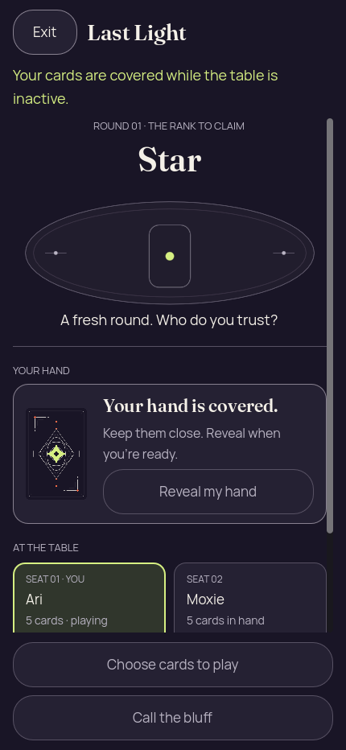</a> | **Private hand erased while the presentation is inactive — 2D** Godot 4.7.2 desktop 2D, real Kotlin authority, packed renderer Original: [05-background-privacy.png](2d/05-background-privacy.png) 430 × 932 px; text 1× SHA-256: <code>ca40b79751f9444a908be3f638d02b566e375fb91e77fbe84487ebd667810814</code> [Original receipt](2d/05-background-privacy.receipt.json) Bridge foreground=false conceals private faces, labels and selection. This desktop probe does not qualify native OS snapshot behavior. |
|  | **Play pending before the authority reply — 2D** Godot 4.7.2 desktop 2D, real Kotlin authority, packed renderer Original: [06-play-pending.png](2d/06-play-pending.png) 430 × 932 px; text 1× SHA-256: <code>b2741012013047fe9e7d6aa375d1092b86b8a82fad6d3c0021bfafd4ae0130ba</code> [Original receipt](2d/06-play-pending.receipt.json) Before authority acceptance, the own hand remains revealed, selection clears and gameplay controls are disabled. This pending frame is not the accepted result. |
|  | **Moxie catches Ari’s Star bluff; public Moon revealed — 2D** Godot 4.7.2 desktop 2D, real Kotlin authority, packed renderer Original: [07-public-round-result.png](2d/07-public-round-result.png) 430 × 932 px; text 1× SHA-256: <code>18087509121376c9f028470b1d15683356438a050bcfe5a35e545e1d5caa158e</code> [Original receipt](2d/07-public-round-result.receipt.json) Moxie challenged Ari’s one-card Star claim. Moon did not match; Ari used light 1 and remains in. |
|  | **Round 2 starts with Moxie and Crown required — 2D** Godot 4.7.2 desktop 2D, real Kotlin authority, packed renderer Original: [08-next-round.png](2d/08-next-round.png) 430 × 932 px; text 1× SHA-256: <code>f6f7e337cd87695c7d718aa0e63504562f592f42d04d252d5e550cc11fdf6755</code> [Original receipt](2d/08-next-round.receipt.json) |
| <a href="2d/09-challenge-pending.png">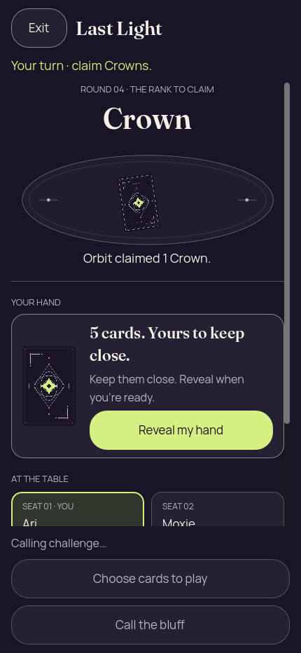</a> | **Challenge to Orbit’s Crown claim pending authority reply — 2D** Godot 4.7.2 desktop 2D, real Kotlin authority, packed renderer Original: [09-challenge-pending.png](2d/09-challenge-pending.png) 430 × 932 px; text 1× SHA-256: <code>9f2f5f9a0eb89bed27b71eb99c96a30975c4333695d0d823b9ddab426d83729b</code> [Original receipt](2d/09-challenge-pending.receipt.json) Calling challenge is visible with private counts zero and gameplay controls disabled, before the next authority view. |
|  | **Orbit wins after the final Crown bluff is caught — 2D** Godot 4.7.2 desktop 2D, real Kotlin authority, packed renderer Original: [10-winner.png](2d/10-winner.png) 430 × 932 px; text 1× SHA-256: <code>4d83c897e5670096846e637d3219452a367e744b83dde44d8faf97c3f15a26f7</code> [Original receipt](2d/10-winner.receipt.json) Authority outcome: Orbit challenged Moxie’s one-card Crown claim. Public Moon did not match; Moxie used light 4 and burned out. The final challenge and penalty explanation are visible. |
|  | **Fresh round-1 presentation after return and re-entry — 2D** Godot 4.7.2 desktop 2D, real Kotlin authority, packed renderer Original: [12-fresh-presentation.png](2d/12-fresh-presentation.png) 430 × 932 px; text 1× SHA-256: <code>1609dcecbe23473394038126943aee9545ce82932cdab1b9dbbedb36b7a9fc46</code> [Original receipt](2d/12-fresh-presentation.receipt.json) |

## 3D

| Original image | Scenario and provenance |
| --- | --- |
|  | **Initial concealed own hand — 3D** Godot 4.7.2 desktop 3D, real Kotlin authority, packed renderer Original: [01-concealed.png](3d/01-concealed.png) 430 × 932 px; text 1× SHA-256: <code>3e6a069c35429f136251009541c5847344df351f2ef1bd46d2785d6a062a6664</code> [Original receipt](3d/01-concealed.receipt.json) |
| <a href="3d/02-revealed.png">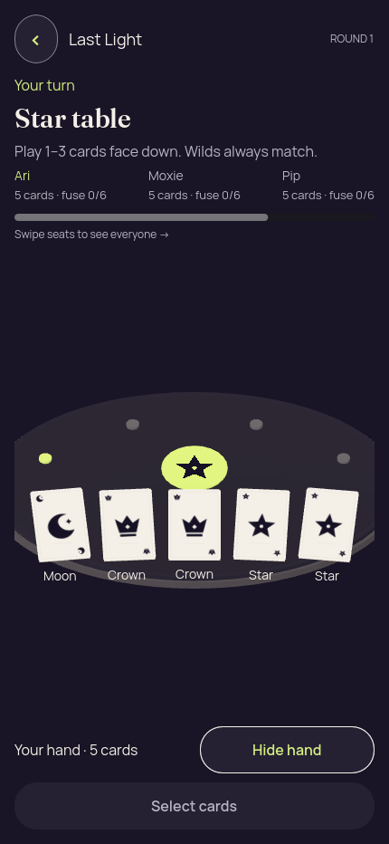</a> | **Own hand revealed without selection — 3D** Godot 4.7.2 desktop 3D, real Kotlin authority, packed renderer Original: [02-revealed.png](3d/02-revealed.png) 430 × 932 px; text 1× SHA-256: <code>175668392dea2790d864cd59c60d8e8b16a3cd41863156745de3193437d5c3a3</code> [Original receipt](3d/02-revealed.receipt.json) |
| <a href="3d/03-selected.png">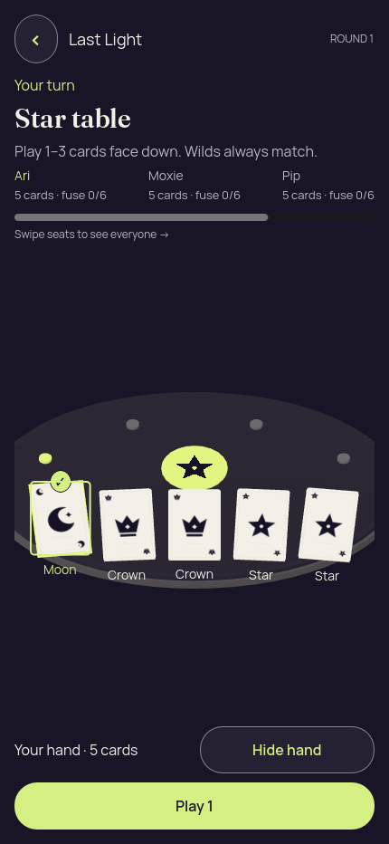</a> | **Moon selected for a one-card Star claim — 3D** Godot 4.7.2 desktop 3D, real Kotlin authority, packed renderer Original: [03-selected.png](3d/03-selected.png) 430 × 932 px; text 1× SHA-256: <code>7cde0a4e95d0b9f374c78f1116d4cf6ccf439bf83e61fd45c29e6ffba5db4423</code> [Original receipt](3d/03-selected.receipt.json) |
| <a href="3d/04-covered.png">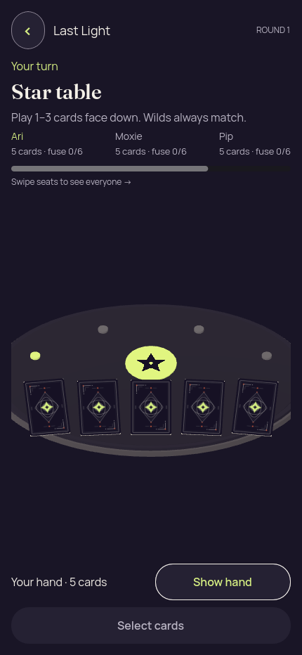</a> | **Hand covered and selection cleared — 3D** Godot 4.7.2 desktop 3D, real Kotlin authority, packed renderer Original: [04-covered.png](3d/04-covered.png) 430 × 932 px; text 1× SHA-256: <code>1dac6160b656c7fccf714555caba3f942fe8b17e63885c00663ff29a02213373</code> [Original receipt](3d/04-covered.receipt.json) |
| <a href="3d/05-background-privacy.png">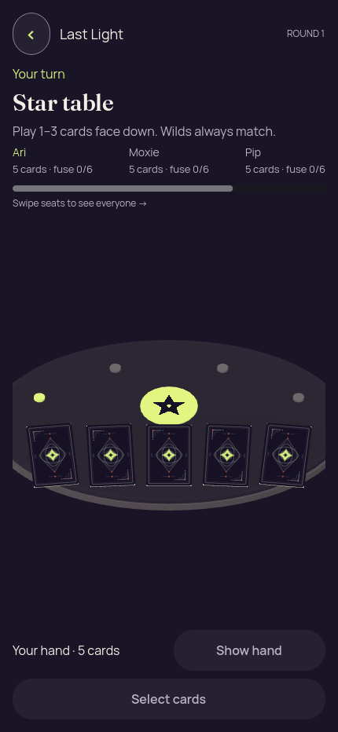</a> | **Private hand erased while the presentation is inactive — 3D** Godot 4.7.2 desktop 3D, real Kotlin authority, packed renderer Original: [05-background-privacy.png](3d/05-background-privacy.png) 430 × 932 px; text 1× SHA-256: <code>6a2be29e88a60ac11d237256f203683e3cdd87fd1dca2a3014e291542e68abfd</code> [Original receipt](3d/05-background-privacy.receipt.json) Bridge foreground=false conceals private faces, labels and selection. This desktop probe does not qualify native OS snapshot behavior. |
| <a href="3d/06-play-pending.png">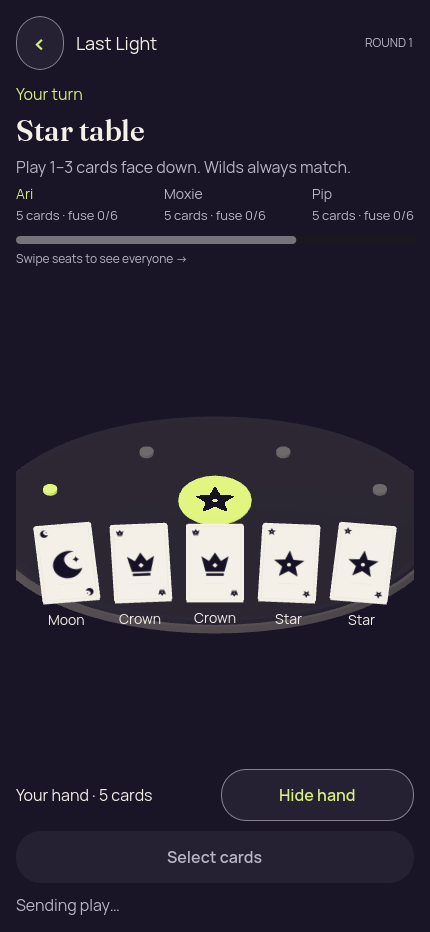</a> | **Play pending before the authority reply — 3D** Godot 4.7.2 desktop 3D, real Kotlin authority, packed renderer Original: [06-play-pending.png](3d/06-play-pending.png) 430 × 932 px; text 1× SHA-256: <code>ceb1856c77d6257042cd91dc5141115a4fff87e81019acdba8f08698710cc725</code> [Original receipt](3d/06-play-pending.receipt.json) Before authority acceptance, the own hand remains revealed, selection clears and gameplay controls are disabled. This pending frame is not the accepted result. |
| <a href="3d/07-public-round-result.png">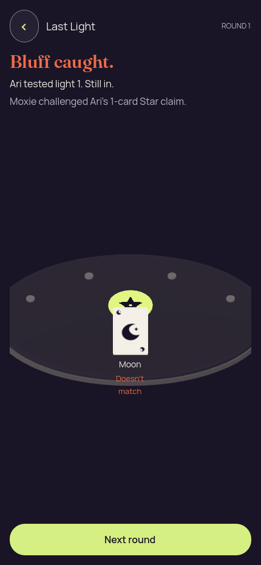</a> | **Moxie catches Ari’s Star bluff; public Moon revealed — 3D** Godot 4.7.2 desktop 3D, real Kotlin authority, packed renderer Original: [07-public-round-result.png](3d/07-public-round-result.png) 430 × 932 px; text 1× SHA-256: <code>a3e91d95106a5a758dbd7d8ceff63d5054e1b114f16303752e22e9d259888b70</code> [Original receipt](3d/07-public-round-result.receipt.json) Moxie challenged Ari’s one-card Star claim. Moon did not match; Ari used light 1 and remains in. |
| <a href="3d/08-next-round.png">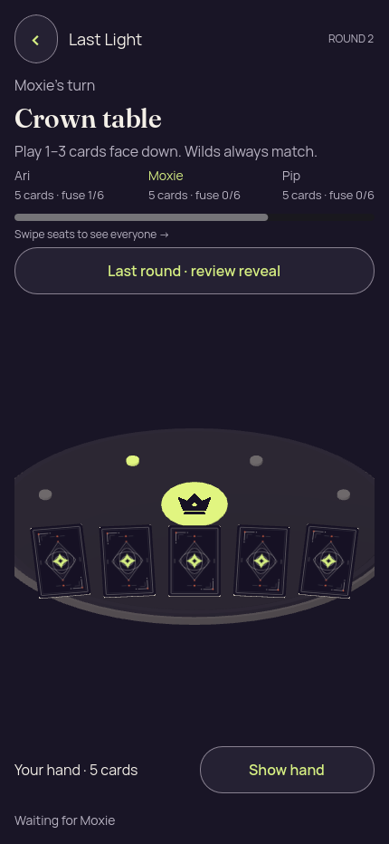</a> | **Round 2 starts with Moxie and Crown required — 3D** Godot 4.7.2 desktop 3D, real Kotlin authority, packed renderer Original: [08-next-round.png](3d/08-next-round.png) 430 × 932 px; text 1× SHA-256: <code>33b4f9b001898a039d662f584219ea454e1dc7f38f440eb86a211a15ee82fbba</code> [Original receipt](3d/08-next-round.receipt.json) |
| <a href="3d/09-challenge-pending.png">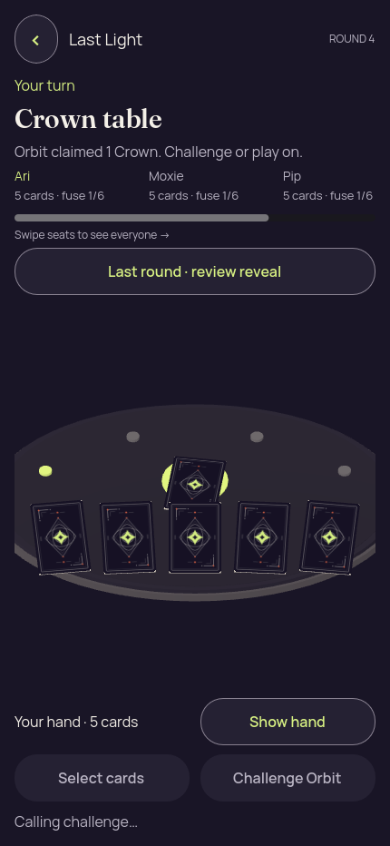</a> | **Challenge to Orbit’s Crown claim pending authority reply — 3D** Godot 4.7.2 desktop 3D, real Kotlin authority, packed renderer Original: [09-challenge-pending.png](3d/09-challenge-pending.png) 430 × 932 px; text 1× SHA-256: <code>43d42aae8a32ea9e59407fb384506f39c8ce4c0b5fdd611526237ea7fffeae48</code> [Original receipt](3d/09-challenge-pending.receipt.json) Calling challenge is visible with private counts zero and gameplay controls disabled, before the next authority view. |
| <a href="3d/10-winner.png">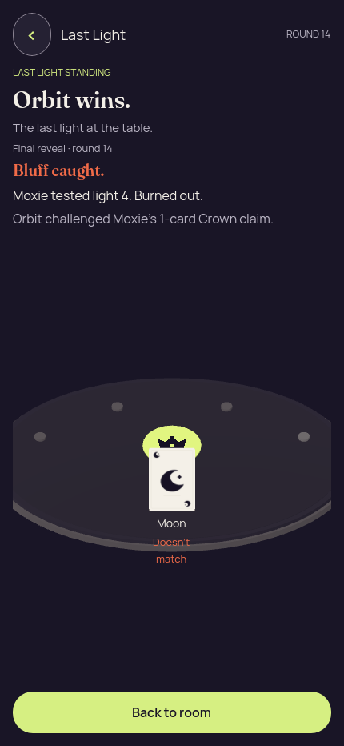</a> | **Orbit wins after the final Crown bluff is caught — 3D** Godot 4.7.2 desktop 3D, real Kotlin authority, packed renderer Original: [10-winner.png](3d/10-winner.png) 430 × 932 px; text 1× SHA-256: <code>ee8e53e4a5f94be9607386ad222475943c81e2417b37e0a3af52cf1933fb2c53</code> [Original receipt](3d/10-winner.receipt.json) Authority outcome: Orbit challenged Moxie’s one-card Crown claim. Public Moon did not match; Moxie used light 4 and burned out. The final challenge and penalty explanation are visible. The 3D table uses the correct Crown emblem behind the public Moon. |
|  | **Fresh round-1 presentation after return and re-entry — 3D** Godot 4.7.2 desktop 3D, real Kotlin authority, packed renderer Original: [12-fresh-presentation.png](3d/12-fresh-presentation.png) 430 × 932 px; text 1× SHA-256: <code>3e6a069c35429f136251009541c5847344df351f2ef1bd46d2785d6a062a6664</code> [Original receipt](3d/12-fresh-presentation.receipt.json) |
