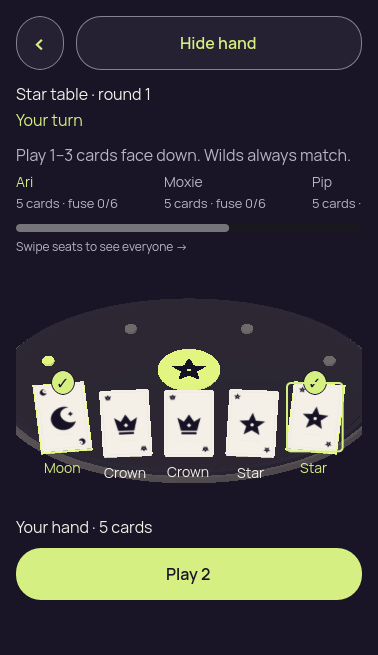
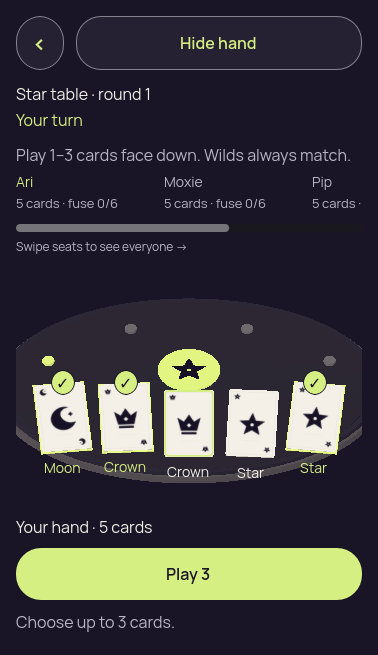
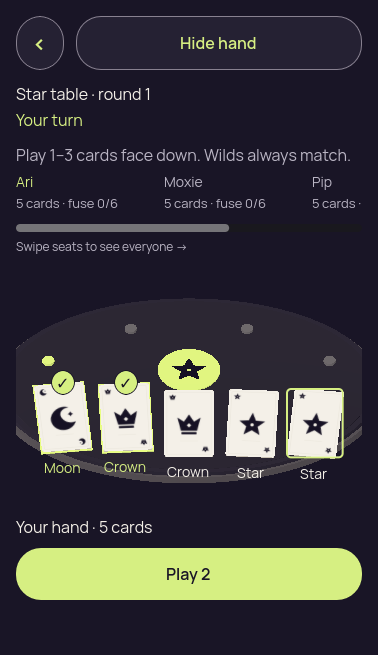
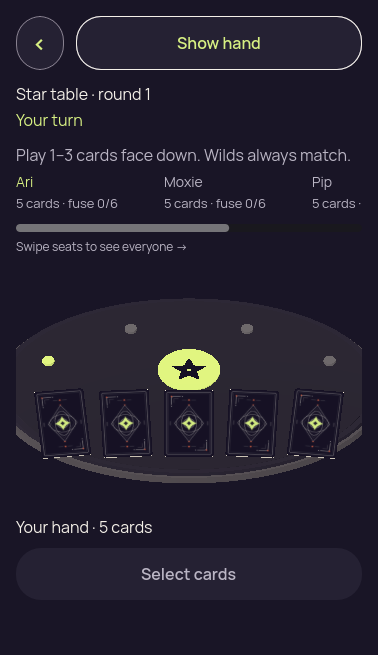
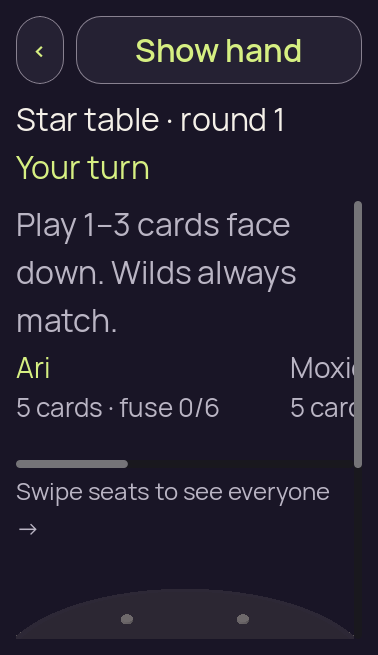
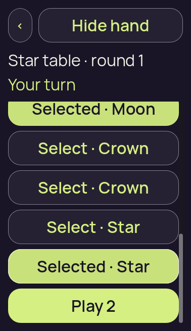
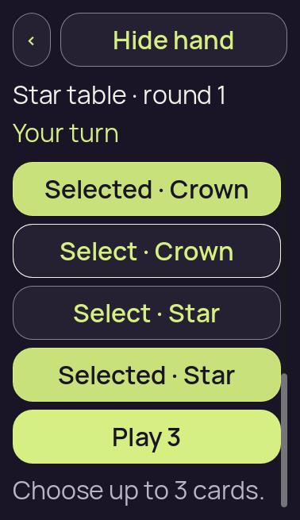
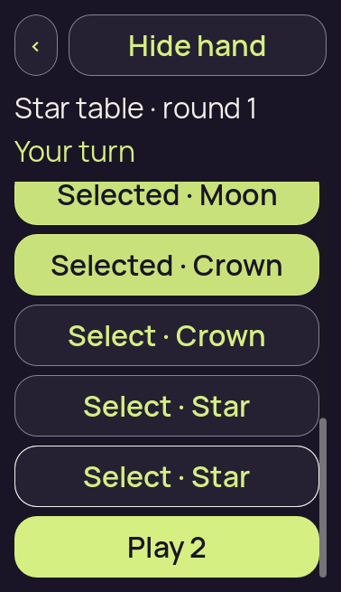
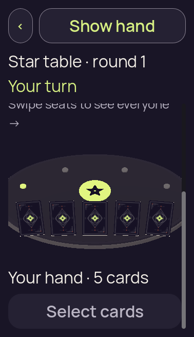

# 3D MSAA-disabled diagnostic — root packed checks

[All collections](../README.md) · [Preserved evidence index](evidence-index.md) · [Copy/review binding](../android-34503251315/provenance/publication-review/partydeck-gallery-2815-publication-binding-v1.json) · [Completed visual review](provenance/publication-review/partydeck-gallery-after-2355-msaa-local-visual-review-v1.json)

**Both existing packed checks passed; peer visual review accepts isolated diagnostic suitability only.**

All twelve original packed diagnostic captures were directly reviewed by /root/assets, along with four already-published native reference originals. Both existing Linux Mesa graphical checks pass at 378×655, text scales 1 and 2. Controls/ranks remain legible; slanted edges and the table rim show visible aliasing. At 200%, card/control rows require scrolling and the first Moon row clips or lies above the viewport in the recorded selected states.

The sole compared 3D table-source change sets MSAA_2X to MSAA_DISABLED. Diagnostic PCK c8d2b0989524c66715fd7469b7a8315a6fd2fb8563ec87bd2294d60b4ebbcd4a is 1,549,656 bytes. Different platform/viewport/selection state prevents a precise quality-delta attribution. These views support the isolated diagnostic experiment, with no native, privacy, performance or failure-cause acceptance. The first import failure and later successful pack/check receipts remain separate.

Source revision: `local changed-source fixture; exact whole-tree capture commit not asserted`. 12 original PNG identities. Review methods: 12 attributed peer direct view.

Every thumbnail opens the unchanged original PNG. Original filenames, dimensions, source paths and outcomes remain separate even when pixels match. No derivative image was created. Frozen provenance pages retain their original text and source references.

| Original capture | Original identity and evidence | Visual observation |
| --- | --- | --- |
|  <code>01-concealed.png</code> packed-check-378x655-text-1 — 01-concealed | 378 × 655 px · 55,404 bytes · text 1.0 SHA-256: <code>91cdcc1949b682d7b246f7728af73dc3a33c6b5dd1a9d4f9ecc1ed939bb32bd2</code> Source: <code>/root/projects/PartyDeck/artifacts/evidence-storage/ios-msaa-disabled-root-validation-20260910/packed-check-378x655-text-1/01-concealed.png</code> [Capture/result JSON](packed-check-378x655-text-1/01-concealed.json) · [Original result](packed-check-378x655-text-1/report.json) · [Execution](packed-check-378x655-text-1/execution.json) | **Attributed peer direct view** by <code>/root/assets</code>. Peer review of this normal-text original finds the table, card artwork, rank/control labels and selection indicators recognizable and legible; slanted card edges, seat dots and the curved table rim show visible stair-stepping. The separate original fixture report records handConcealed=true, selectedCount=0. These observations do not establish native or performance acceptance. |
|  <code>02-revealed-selected.png</code> packed-check-378x655-text-1 — 02-revealed-selected | 378 × 655 px · 49,092 bytes · text 1.0 SHA-256: <code>2c498fb4f65b13c7502f84033b55ad6581c5fa80eed6a2eb0a0ff0d425b5e5d1</code> Source: <code>/root/projects/PartyDeck/artifacts/evidence-storage/ios-msaa-disabled-root-validation-20260910/packed-check-378x655-text-1/02-revealed-selected.png</code> [Capture/result JSON](packed-check-378x655-text-1/02-revealed-selected.json) · [Original result](packed-check-378x655-text-1/report.json) · [Execution](packed-check-378x655-text-1/execution.json) | **Attributed peer direct view** by <code>/root/assets</code>. Peer review of this normal-text original finds the table, card artwork, rank/control labels and selection indicators recognizable and legible; slanted card edges, seat dots and the curved table rim show visible stair-stepping. The separate original fixture report records handConcealed=false, selectedCount=2. These observations do not establish native or performance acceptance. |
|  <code>02a-selection-limit.png</code> packed-check-378x655-text-1 — 02a-selection-limit | 378 × 655 px · 52,280 bytes · text 1.0 SHA-256: <code>e501849d4cbbb6ddf35447d5e6526d3003d7f5b15b15195168ff9d6fd1c01172</code> Source: <code>/root/projects/PartyDeck/artifacts/evidence-storage/ios-msaa-disabled-root-validation-20260910/packed-check-378x655-text-1/02a-selection-limit.png</code> [Capture/result JSON](packed-check-378x655-text-1/02a-selection-limit.json) · [Original result](packed-check-378x655-text-1/report.json) · [Execution](packed-check-378x655-text-1/execution.json) | **Attributed peer direct view** by <code>/root/assets</code>. Peer review of this normal-text original finds the table, card artwork, rank/control labels and selection indicators recognizable and legible; slanted card edges, seat dots and the curved table rim show visible stair-stepping. The separate original fixture report records handConcealed=false, selectedCount=3. These observations do not establish native or performance acceptance. |
|  <code>02b-deselected-last.png</code> packed-check-378x655-text-1 — 02b-deselected-last | 378 × 655 px · 48,944 bytes · text 1.0 SHA-256: <code>e6d166d6225e99a7247e61c02b47ac34d74bf09f4cbbfbaf46ebfc32f93be243</code> Source: <code>/root/projects/PartyDeck/artifacts/evidence-storage/ios-msaa-disabled-root-validation-20260910/packed-check-378x655-text-1/02b-deselected-last.png</code> [Capture/result JSON](packed-check-378x655-text-1/02b-deselected-last.json) · [Original result](packed-check-378x655-text-1/report.json) · [Execution](packed-check-378x655-text-1/execution.json) | **Attributed peer direct view** by <code>/root/assets</code>. Peer review of this normal-text original finds the table, card artwork, rank/control labels and selection indicators recognizable and legible; slanted card edges, seat dots and the curved table rim show visible stair-stepping. The separate original fixture report records handConcealed=false, selectedCount=2. These observations do not establish native or performance acceptance. |
|  <code>03-covered-again.png</code> packed-check-378x655-text-1 — 03-covered-again | 378 × 655 px · 56,004 bytes · text 1.0 SHA-256: <code>8052fb11361a15c99c77e083cd375588ca6a5cfbee35508a4cba613a7eae1fd7</code> Source: <code>/root/projects/PartyDeck/artifacts/evidence-storage/ios-msaa-disabled-root-validation-20260910/packed-check-378x655-text-1/03-covered-again.png</code> [Capture/result JSON](packed-check-378x655-text-1/03-covered-again.json) · [Original result](packed-check-378x655-text-1/report.json) · [Execution](packed-check-378x655-text-1/execution.json) | **Attributed peer direct view** by <code>/root/assets</code>. Peer review of this normal-text original finds the table, card artwork, rank/control labels and selection indicators recognizable and legible; slanted card edges, seat dots and the curved table rim show visible stair-stepping. The separate original fixture report records handConcealed=true, selectedCount=0. These observations do not establish native or performance acceptance. |
|  <code>04-resumed-covered.png</code> packed-check-378x655-text-1 — 04-resumed-covered | 378 × 655 px · 55,404 bytes · text 1.0 SHA-256: <code>91cdcc1949b682d7b246f7728af73dc3a33c6b5dd1a9d4f9ecc1ed939bb32bd2</code> Source: <code>/root/projects/PartyDeck/artifacts/evidence-storage/ios-msaa-disabled-root-validation-20260910/packed-check-378x655-text-1/04-resumed-covered.png</code> [Capture/result JSON](packed-check-378x655-text-1/04-resumed-covered.json) · [Original result](packed-check-378x655-text-1/report.json) · [Execution](packed-check-378x655-text-1/execution.json) | **Attributed peer direct view** by <code>/root/assets</code>. Peer review of this normal-text original finds the table, card artwork, rank/control labels and selection indicators recognizable and legible; slanted card edges, seat dots and the curved table rim show visible stair-stepping. The separate original fixture report records handConcealed=true, selectedCount=0. These observations do not establish native or performance acceptance. |
|  <code>01-concealed.png</code> packed-check-378x655-text-2 — 01-concealed | 378 × 655 px · 42,645 bytes · text 2.0 SHA-256: <code>ec951b38c955858e9ade1bd644dd3276f2945a87ab3530ba1d7975fd524206ac</code> Source: <code>/root/projects/PartyDeck/artifacts/evidence-storage/ios-msaa-disabled-root-validation-20260910/packed-check-378x655-text-2/01-concealed.png</code> [Capture/result JSON](packed-check-378x655-text-2/01-concealed.json) · [Original result](packed-check-378x655-text-2/report.json) · [Execution](packed-check-378x655-text-2/execution.json) | **Attributed peer direct view** by <code>/root/assets</code>. Peer review of this 200% original records the public information above the hand; the large control and action labels remain legible. The separate original fixture report records handConcealed=true, selectedCount=0. These observations do not establish native or performance acceptance. |
|  <code>02-revealed-selected.png</code> packed-check-378x655-text-2 — 02-revealed-selected | 378 × 655 px · 45,844 bytes · text 2.0 SHA-256: <code>59fd99043020fe728f03df7552a5b5fb1a8f97feec52c3c7dee13e70e848dfab</code> Source: <code>/root/projects/PartyDeck/artifacts/evidence-storage/ios-msaa-disabled-root-validation-20260910/packed-check-378x655-text-2/02-revealed-selected.png</code> [Capture/result JSON](packed-check-378x655-text-2/02-revealed-selected.json) · [Original result](packed-check-378x655-text-2/report.json) · [Execution](packed-check-378x655-text-2/execution.json) | **Attributed peer direct view** by <code>/root/assets</code>. Peer review records legible large Selected/Select card controls and action labels at this 200% scroll position. First Selected · Moon row is clipped at the top of the body scroll area; its text remains readable. This is not a claim that all controls are wholly visible simultaneously. The separate original fixture report records handConcealed=false, selectedCount=2. These observations do not establish native or performance acceptance. |
|  <code>02a-selection-limit.png</code> packed-check-378x655-text-2 — 02a-selection-limit | 378 × 655 px · 47,909 bytes · text 2.0 SHA-256: <code>e64165c77f4409b03fe5264dff789bc76f17b2b248e33d26c6fad79e6c5180c7</code> Source: <code>/root/projects/PartyDeck/artifacts/evidence-storage/ios-msaa-disabled-root-validation-20260910/packed-check-378x655-text-2/02a-selection-limit.png</code> [Capture/result JSON](packed-check-378x655-text-2/02a-selection-limit.json) · [Original result](packed-check-378x655-text-2/report.json) · [Execution](packed-check-378x655-text-2/execution.json) | **Attributed peer direct view** by <code>/root/assets</code>. Peer review records legible large Selected/Select card controls and action labels at this 200% scroll position. Moon row is above the viewport at this later scroll offset; selected Crown and Star rows, Play 3, and selection-limit feedback are visible. The separate original fixture report records handConcealed=false, selectedCount=3. These observations do not establish native or performance acceptance. |
|  <code>02b-deselected-last.png</code> packed-check-378x655-text-2 — 02b-deselected-last | 378 × 655 px · 45,999 bytes · text 2.0 SHA-256: <code>8fa82bbbe7fb2c7abe0cdbfd083bc14563f4fe3cf50db4c9a897fdd965ffaf54</code> Source: <code>/root/projects/PartyDeck/artifacts/evidence-storage/ios-msaa-disabled-root-validation-20260910/packed-check-378x655-text-2/02b-deselected-last.png</code> [Capture/result JSON](packed-check-378x655-text-2/02b-deselected-last.json) · [Original result](packed-check-378x655-text-2/report.json) · [Execution](packed-check-378x655-text-2/execution.json) | **Attributed peer direct view** by <code>/root/assets</code>. Peer review records legible large Selected/Select card controls and action labels at this 200% scroll position. First Selected · Moon row is clipped at the top of the body scroll area; its text remains readable. This is not a claim that all controls are wholly visible simultaneously. The separate original fixture report records handConcealed=false, selectedCount=2. These observations do not establish native or performance acceptance. |
|  <code>03-covered-again.png</code> packed-check-378x655-text-2 — 03-covered-again | 378 × 655 px · 56,911 bytes · text 2.0 SHA-256: <code>01e5db86ad1c4331315d1c00145f17cf28e969ccc5c191bca6b7c08b2183d2d7</code> Source: <code>/root/projects/PartyDeck/artifacts/evidence-storage/ios-msaa-disabled-root-validation-20260910/packed-check-378x655-text-2/03-covered-again.png</code> [Capture/result JSON](packed-check-378x655-text-2/03-covered-again.json) · [Original result](packed-check-378x655-text-2/report.json) · [Execution](packed-check-378x655-text-2/execution.json) | **Attributed peer direct view** by <code>/root/assets</code>. Peer review of this 200% covered/resumed original records card backs and disabled Select cards. The large control labels remain legible at the captured scroll position. The separate original fixture report records handConcealed=true, selectedCount=0. These observations do not establish native or performance acceptance. |
|  <code>04-resumed-covered.png</code> packed-check-378x655-text-2 — 04-resumed-covered | 378 × 655 px · 56,330 bytes · text 2.0 SHA-256: <code>1e075dca2ebe8522629f00712413e3b5dcfea962b4c2a12531dd19bb5b4acc4d</code> Source: <code>/root/projects/PartyDeck/artifacts/evidence-storage/ios-msaa-disabled-root-validation-20260910/packed-check-378x655-text-2/04-resumed-covered.png</code> [Capture/result JSON](packed-check-378x655-text-2/04-resumed-covered.json) · [Original result](packed-check-378x655-text-2/report.json) · [Execution](packed-check-378x655-text-2/execution.json) | **Attributed peer direct view** by <code>/root/assets</code>. Peer review of this 200% covered/resumed original records card backs and disabled Select cards. The large control labels remain legible at the captured scroll position. The separate original fixture report records handConcealed=true, selectedCount=0. These observations do not establish native or performance acceptance. |
