# Earlier Android optimized review — c73a659

[All screenshot collections](../../README.md)

API 36 AVD; 1080 × 2400 pixels; 420 dpi; three-button navigation. Normal font scale is 1.0; large-text captures and final-screen.png use 2.0. These older captures do not show a software keyboard. CI run number was not independently established in the retained provenance.

**Evidence status:** Historical evidence, superseded by the API 35 capture set for current review. Smoke failed during malformed 200% Join text replacement. The large-text final-rule image shows only a sliver of that rule, so it does not establish complete rule visibility.

Source revision: [`c73a659221f94a5ba7eeafa38a4b7a0754a54265`](https://github.com/Apdelrahman1911/PartyDeck/commit/c73a659221f94a5ba7eeafa38a4b7a0754a54265).

APK SHA-256: `2c4adc0151dbcc2330507d3761eebc4732a699037557a0db0a73ed8fc615efb9`.

Original source directory: `/tmp/partydeck-c73a659-android-report/build/ci/android/optimized-test-signed`. This is an archival locator; use the repository links below to open the retained files.

Preserved receipts: [smoke-result.json](smoke-result.json).

Click any thumbnail for the full original PNG. Dimensions are pixels. Hashes identify the unedited original files.

| Original image | Scenario and provenance |
| --- | --- |
| <a href="final-screen.png">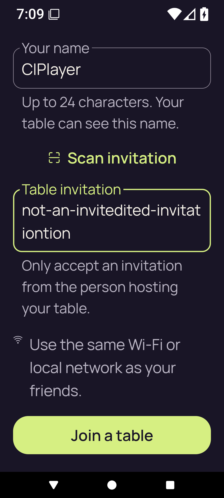</a> | **Final failure capture — Join at 200% text** Android API 36 emulator, optimized test-signed APK Original: [final-screen.png](final-screen.png) 1080 × 2400 px; text 2.0× SHA-256: <code>b8ecf24d037e5f60ca8bead79720e8639fb3e75f4627e00536182e6b4c644ebd</code> Failure evidence; this is not a successful final state. |
| <a href="home.png">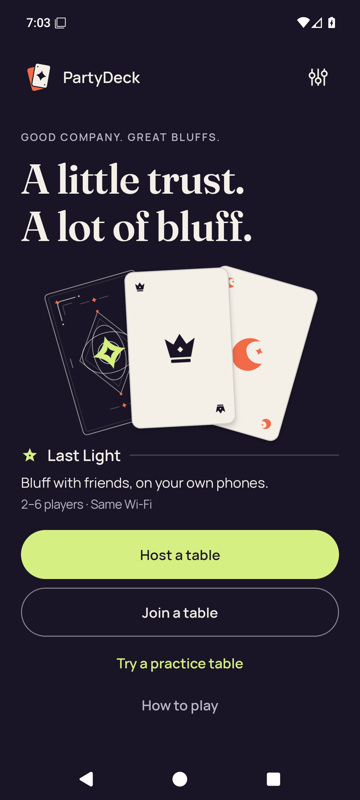</a> | **Home** Android API 36 emulator, optimized test-signed APK Original: [home.png](home.png) 1080 × 2400 px; text 1.0× SHA-256: <code>3465d48a00b0709cef42465a72df41905534f8d4da62f130226d0f720ab86c55</code> |
| <a href="host-after-share.png">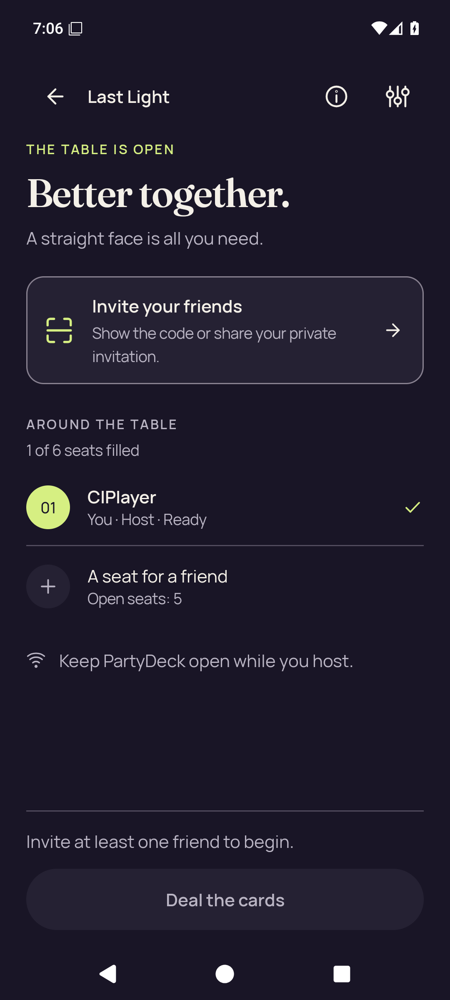</a> | **Host lobby after closing invitation and share surfaces** Android API 36 emulator, optimized test-signed APK Original: [host-after-share.png](host-after-share.png) 1080 × 2400 px; text 1.0× SHA-256: <code>5ac289ccd4ef55216c213ae35c164e4af9b8ff65ffe746da6a144c5ba2e4f34f</code> Invitation dialog is closed; no live admission credentials are shown. |
|  | **Native host lobby before opening invitation** Android API 36 emulator, optimized test-signed APK Original: [host-lobby.png](host-lobby.png) 1080 × 2400 px; text 1.0× SHA-256: <code>36556324a63c71d40f2d04537a2265f41ff1628271a9b3b7ad8d8907b243785c</code> Invitation dialog is closed; no live admission credentials are shown. |
|  | **Home after leaving host lobby** Android API 36 emulator, optimized test-signed APK Original: [host-returned-home.png](host-returned-home.png) 1080 × 2400 px; text 1.0× SHA-256: <code>ca75eee91f104f16d1af5fa88689013633ba67650c0965b29b6e2ec5839fa65f</code> |
| <a href="join-invalid.png">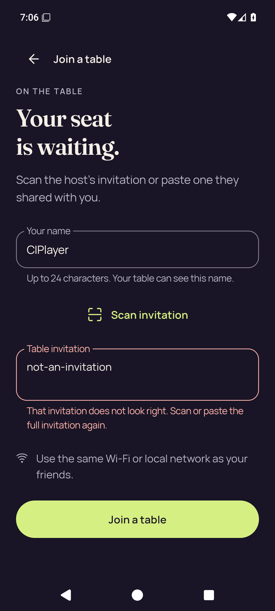</a> | **Join with invalid invitation feedback** Android API 36 emulator, optimized test-signed APK Original: [join-invalid.png](join-invalid.png) 1080 × 2400 px; text 1.0× SHA-256: <code>b16074b27fd6aa397be2ec85e8c268b7c7f1813f41c605f3b1a2ccc431524c09</code> |
| <a href="large-text-home-actions.png">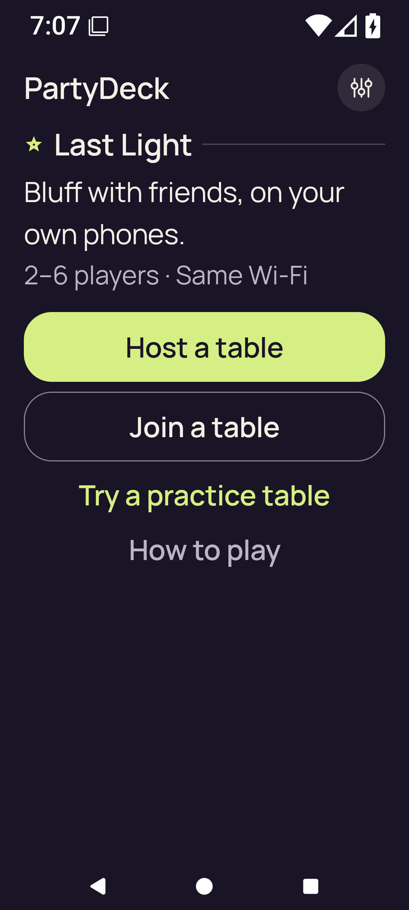</a> | **Home actions at 200% text** Android API 36 emulator, optimized test-signed APK Original: [large-text-home-actions.png](large-text-home-actions.png) 1080 × 2400 px; text 2.0× SHA-256: <code>a0307c01d8ddb7e51c1b5ed6491199b9e8165755aa757dd81c76e254eb5eaf96</code> |
| <a href="large-text-join-invalid.png">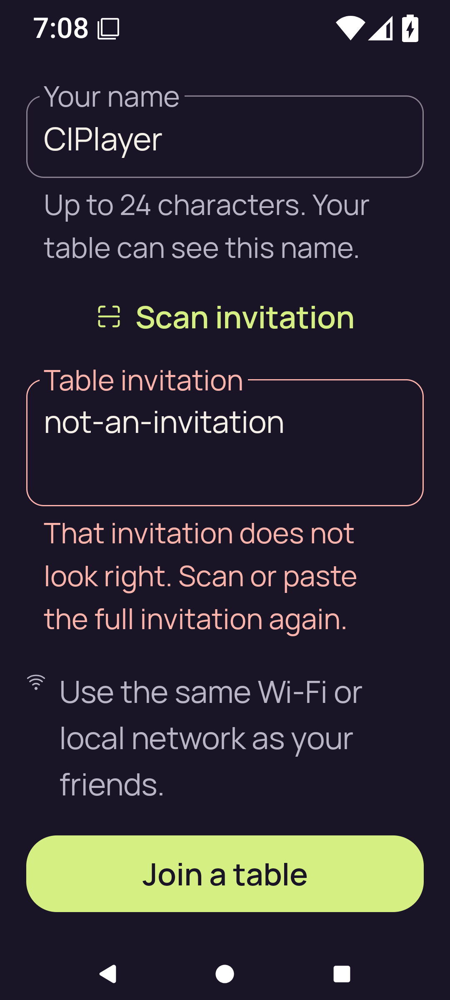</a> | **Join invalid input at 200% text** Android API 36 emulator, optimized test-signed APK Original: [large-text-join-invalid.png](large-text-join-invalid.png) 1080 × 2400 px; text 2.0× SHA-256: <code>bfad0946b06e8a9c7abc82558046c7d00f4205cca19dd17dda5da8c2851e875b</code> |
| <a href="large-text-rules-intro.png">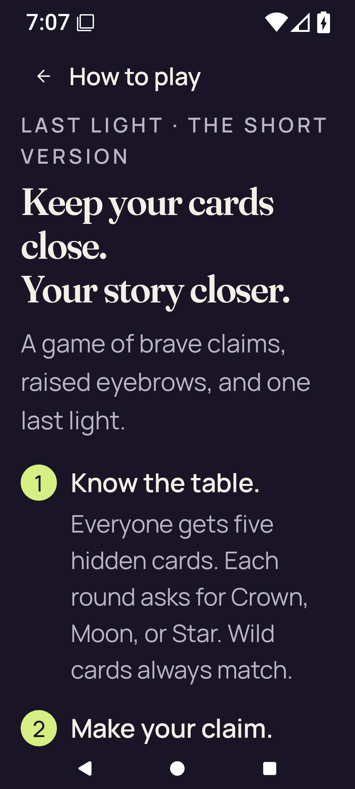</a> | **Rules introduction at 200% text** Android API 36 emulator, optimized test-signed APK Original: [large-text-rules-intro.png](large-text-rules-intro.png) 1080 × 2400 px; text 2.0× SHA-256: <code>f727c1386c25e79e9fd24a5c7ab3e6e46cbff250c97e60bf39dc14589b3ec208</code> |
| <a href="large-text-rules-last-step.png">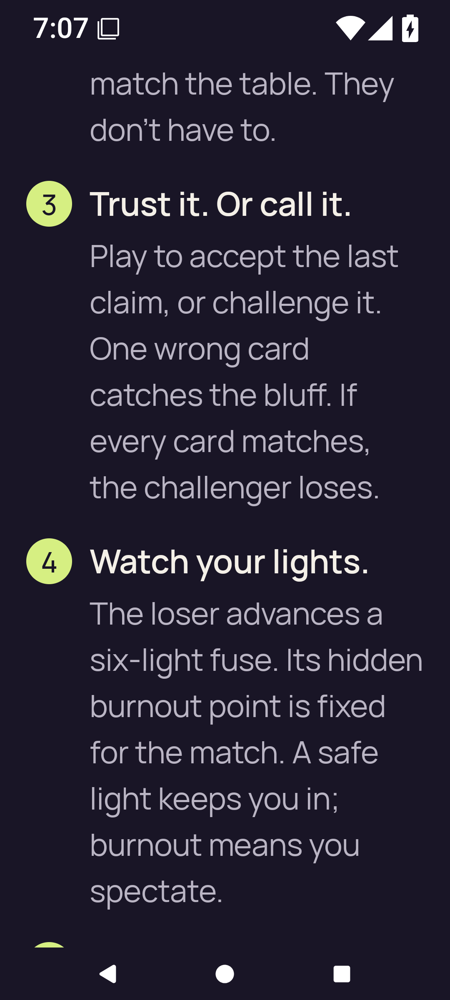</a> | **Rules final-step scroll position at 200% text** Android API 36 emulator, optimized test-signed APK Original: [large-text-rules-last-step.png](large-text-rules-last-step.png) 1080 × 2400 px; text 2.0× SHA-256: <code>e8aacac1b1ca17c975c337d53cebd4eebd2fa84666ea781dc6b9bcbfd7723fb8</code> |
| <a href="large-text-settings.png">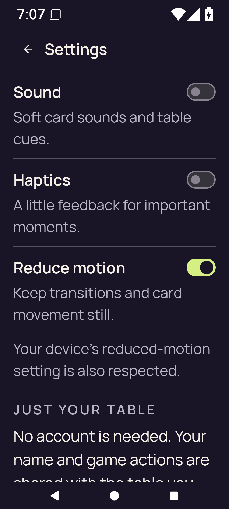</a> | **Settings at 200% text** Android API 36 emulator, optimized test-signed APK Original: [large-text-settings.png](large-text-settings.png) 1080 × 2400 px; text 2.0× SHA-256: <code>e43102f67a0dbaf8dc7ae99d4ad4862990c72098ee8f6f0549b7dde8110a5b33</code> |
| <a href="practice-after-play.png">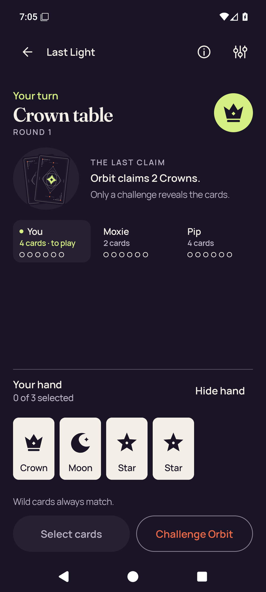</a> | **Practice after accepted one-card play** Android API 36 emulator, optimized test-signed APK Original: [practice-after-play.png](practice-after-play.png) 1080 × 2400 px; text 1.0× SHA-256: <code>5e36aaf62ac1840a15655770d51eeae961c718ddfa147f26ad77742b2fe4944a</code> |
|  | **Practice with concealed hand** Android API 36 emulator, optimized test-signed APK Original: [practice-concealed.png](practice-concealed.png) 1080 × 2400 px; text 1.0× SHA-256: <code>dc1f1ecc66fd22c2768d167df1969b6a2231027ac6c71dea51ccaf4431366f69</code> |
| <a href="practice-resumed-concealed.png">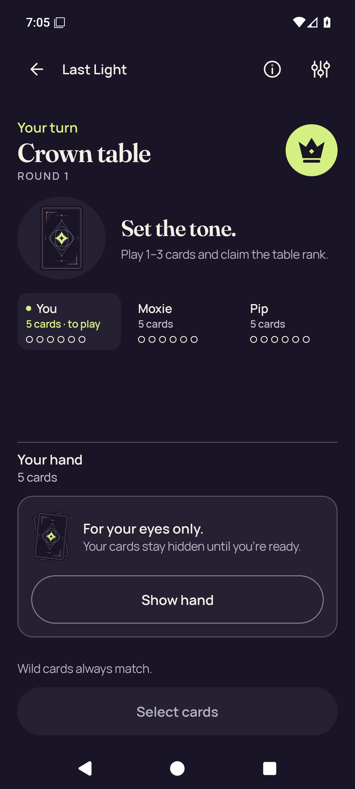</a> | **Practice concealed after app resumes** Android API 36 emulator, optimized test-signed APK Original: [practice-resumed-concealed.png](practice-resumed-concealed.png) 1080 × 2400 px; text 1.0× SHA-256: <code>81c0a47c6460a3f3eb7ebc8ab990537ecea84f0a958442dbe943112f271491f8</code> |
|  | **Home after leaving Practice** Android API 36 emulator, optimized test-signed APK Original: [practice-returned-home.png](practice-returned-home.png) 1080 × 2400 px; text 1.0× SHA-256: <code>fb7d43174abfc7c8247785c9dbd138247f7b6b9f36c8de6ce9ec86f0416a8602</code> |
| <a href="practice-selected.png">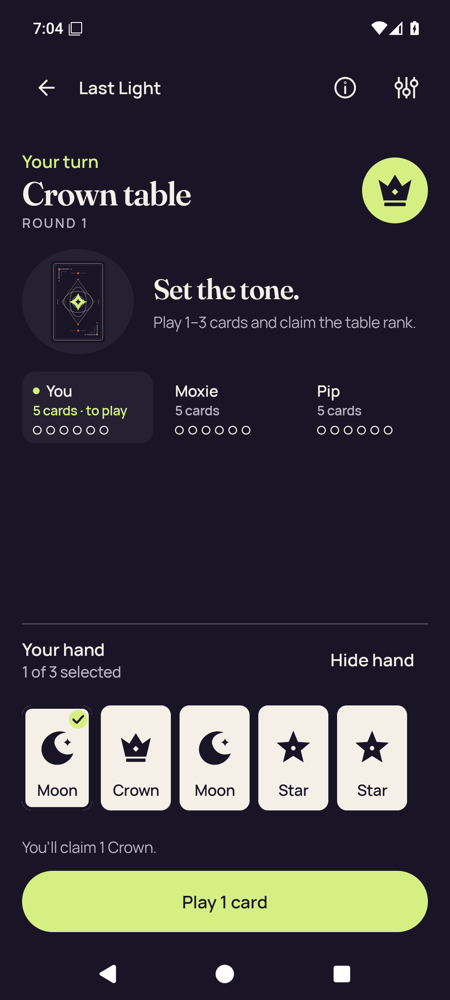</a> | **Practice with a selected card** Android API 36 emulator, optimized test-signed APK Original: [practice-selected.png](practice-selected.png) 1080 × 2400 px; text 1.0× SHA-256: <code>caec23f99f1aa71ab46478719140367393ec9281d24e31cb934e0a170a3a294c</code> |
| <a href="rules-intro.png">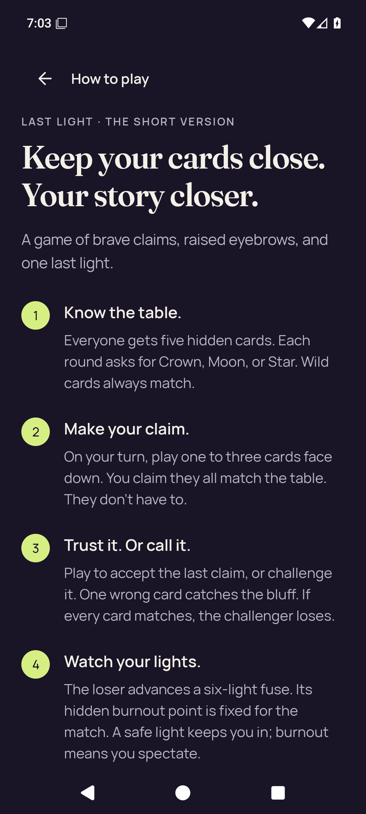</a> | **Rules introduction** Android API 36 emulator, optimized test-signed APK Original: [rules-intro.png](rules-intro.png) 1080 × 2400 px; text 1.0× SHA-256: <code>eb01d436119df257e143404fa482cd3964973612e41db95020fa6b2bbc4b63c4</code> |
| <a href="rules-last-step.png">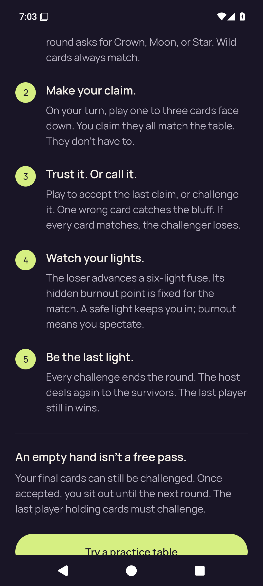</a> | **Rules final-step scroll position** Android API 36 emulator, optimized test-signed APK Original: [rules-last-step.png](rules-last-step.png) 1080 × 2400 px; text 1.0× SHA-256: <code>cfb55d8051426c260ab3356bb683921d0e18c169a74d7c3427b8731b98870d2c</code> |
| <a href="settings-changed.png">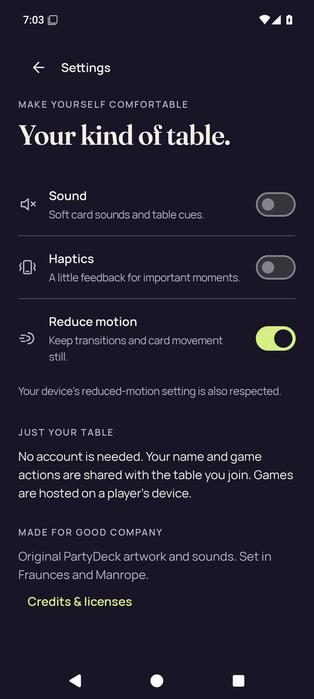</a> | **Settings after changing all three preferences** Android API 36 emulator, optimized test-signed APK Original: [settings-changed.png](settings-changed.png) 1080 × 2400 px; text 1.0× SHA-256: <code>2ede4d9e884fc7521d851b38557417ccab525f694ebf1b49943a9257bcddb3e7</code> |
|  | **Settings after process restart** Android API 36 emulator, optimized test-signed APK Original: [settings-persisted.png](settings-persisted.png) 1080 × 2400 px; text 1.0× SHA-256: <code>596102a9a55ddd6d57e828ce1476fd68ebf805e970b7084ff2ac09810717a2a9</code> |
|  | **Home after closing Settings** Android API 36 emulator, optimized test-signed APK Original: [settings-return-home.png](settings-return-home.png) 1080 × 2400 px; text 1.0× SHA-256: <code>b96c0a03b9be6341b7f85e09dc90d5f5f4fe7408f9d368808ee0a4f4108e581b</code> |
