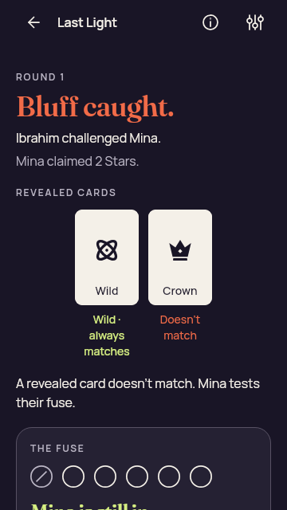
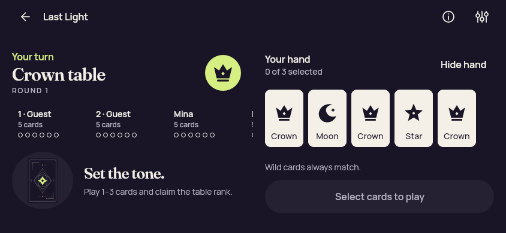
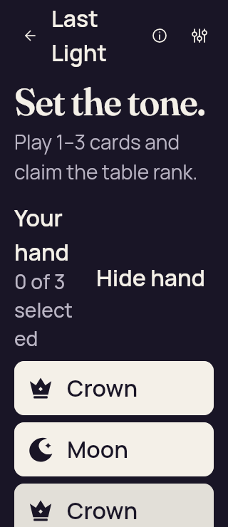
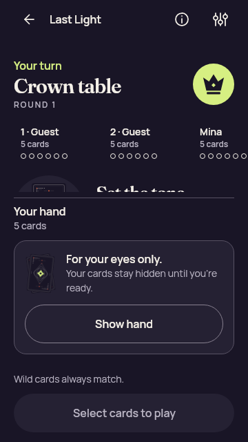
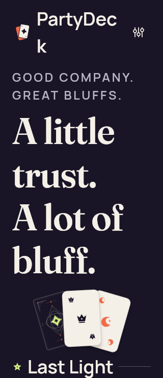
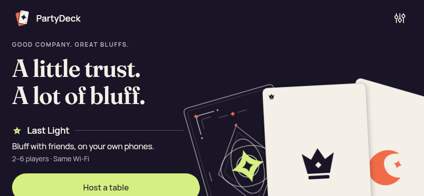

# Earlier Compose review — first render

[All screenshot collections](../../README.md)

First reviewed working-tree captures from 2026-09-09 around 15:54–15:55 UTC. Based on 7a4f8b8 with uncommitted implementation changes; these are not images of that commit alone. Density 1; large-text files use font scale 2.0.

**Evidence status:** Historical comparisons retain the original Home hierarchy/landscape clipping, concealed claim clipping, selected-label wrapping and below-fold outcome issues. Use the current Compose collection for the later reviewed state.

Working-tree basis: [`7a4f8b80597472ac1fb2aac498c7db3a5dda7dfe`](https://github.com/Apdelrahman1911/PartyDeck/commit/7a4f8b80597472ac1fb2aac498c7db3a5dda7dfe); **not an exact capture revision**.

Original source directory: `/tmp/partydeck-design-review/first-render`. This is an archival locator; use the repository links below to open the retained files.

Click any thumbnail for the full original PNG. Dimensions are pixels. Hashes identify the unedited original files.

| Original image | Scenario and provenance |
| --- | --- |
|  | **Bluff outcome containing a Wild** JVM Compose/Skiko working-tree layout fixture Original: [game-bluff-with-wild.png](game-bluff-with-wild.png) 360 × 640 px; text 1.0× SHA-256: <code>ebc816dd77a70f243efc1792f76b49d272f1011477189f238cae9f7fab8073c9</code> Earlier outcome fell below the initial viewport. |
|  | **Gameplay, revealed hand — short landscape phone** JVM Compose/Skiko working-tree layout fixture Original: [game-landscape-hand.png](game-landscape-hand.png) 844 × 390 px; text 1.0× SHA-256: <code>67f456d61b5d597450ff0537ebd8bf988f0f14b57ac4b55db6f2a7a785754e1f</code> Earlier usable landscape comparison. |
|  | **Gameplay, revealed hand — 200% text** JVM Compose/Skiko working-tree layout fixture Original: [game-large-text-hand.png](game-large-text-hand.png) 320 × 740 px; text 2.0× SHA-256: <code>e80283f6aed70be917b87f9a2f4635b9186b04814c2e2bc339177bae79f38556</code> Earlier selected-label wrapping. |
|  | **Gameplay, concealed hand — phone** JVM Compose/Skiko working-tree layout fixture Original: [game-phone-concealed.png](game-phone-concealed.png) 360 × 640 px; text 1.0× SHA-256: <code>a1f6412d41d4e12ab2476c307a023e5ac7018f14af797985ec2d0e68d2232735</code> Earlier claim clipping. |
|  | **Home at 200% text** JVM Compose/Skiko working-tree layout fixture Original: [home-large-text.png](home-large-text.png) 320 × 740 px; text 2.0× SHA-256: <code>940f0377211e7f6acbacf20d853e995fe544fe5e602c09bc8f0c3b6aabb93ef7</code> Earlier broken brand/action hierarchy. |
|  | **Home on a short landscape phone** JVM Compose/Skiko working-tree layout fixture Original: [home-phone-landscape.png](home-phone-landscape.png) 844 × 390 px; text 1.0× SHA-256: <code>6e372aecb3d0a344ccc45b59641e493e5d4f206249f3ee68bbde199863b4084f</code> Earlier hero clipping. |
|  | **Home on a phone** JVM Compose/Skiko working-tree layout fixture Original: [home-phone.png](home-phone.png) 390 × 844 px; text 1.0× SHA-256: <code>72b504135fc293ab9a804711655dd0dc941a877f9f81fbf0e1d9171f87cff90a</code> Unchanged normal-size baseline retained for comparison. |
