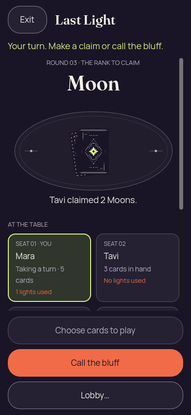
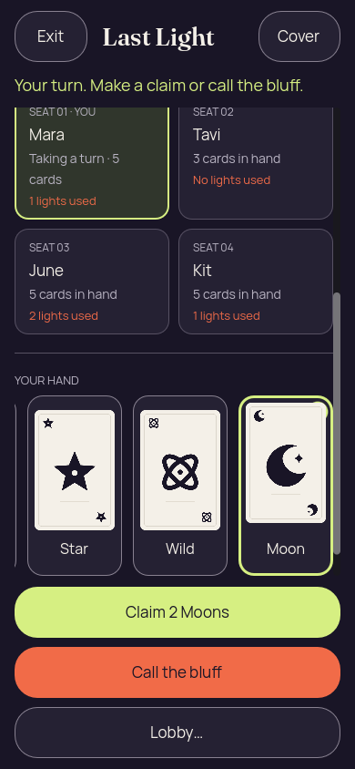
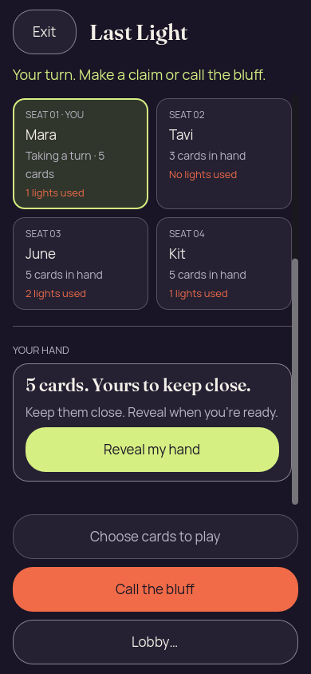
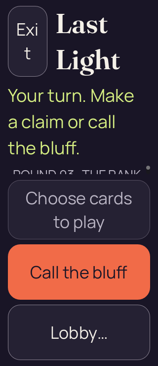
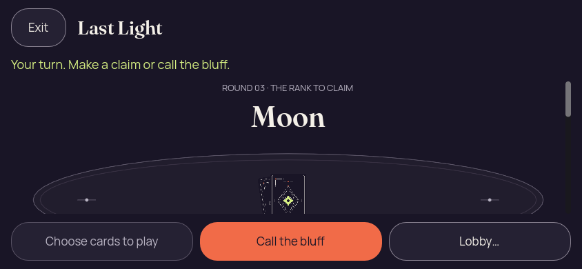
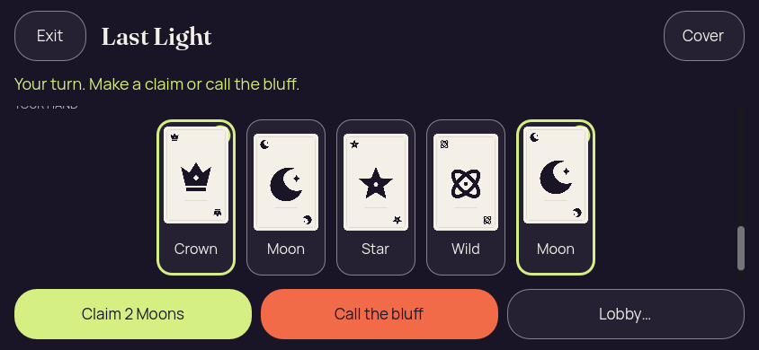
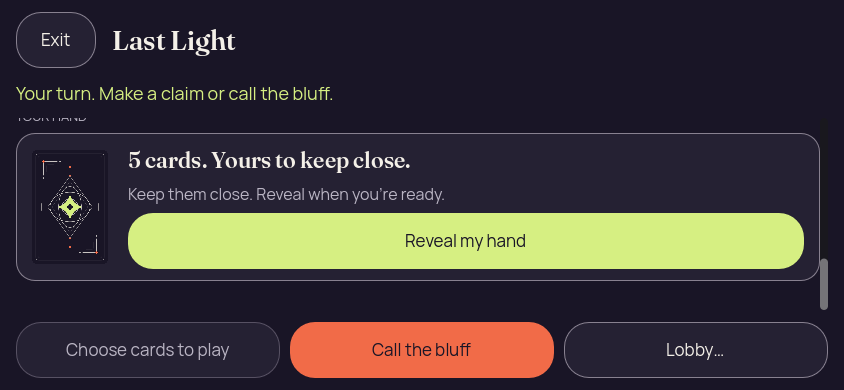

# Godot 2D — iteration 01, phone and landscape history

[All screenshot collections](../../README.md)

Actual Godot 4.7.2.stable.official.ed1daf0bf rendering under Xvfb, OpenGL 4.5 Compatibility / Mesa llvmpipe 25.2.8, LLVM 20.1.2. The source was a shared working tree over the stated basis, including uncommitted changes; no exact capture commit is claimed.

**Evidence status:** Phone and landscape reports passed their bounded static renderer checks. The 200% attempt failed input reachability: pinned header/actions left almost no content viewport. That failed attempt produced one PNG and diagnostic JSON, with no success report. Iteration 01 also hides the selection checkmark behind the card and places the phone hand below the seats.

Working-tree basis: [`02364e5f3a4dd7742b43f8595269ff610acd2e4e`](https://github.com/Apdelrahman1911/PartyDeck/commit/02364e5f3a4dd7742b43f8595269ff610acd2e4e); **not an exact capture revision**.

The checker sends actual mouse events to Godot Buttons after programmatically scrolling them into view with `ensure_control_visible`. It exercises reveal, card selection, cover, foreground loss/resume and close; it does not establish touch scrolling, native mobile accessibility, OS lifecycle protection or game-authority acceptance. Captures with identical pixels retain their separate scenario records.

[The four original desktop views](desktop/README.md) are retained separately and linked to the published first batch. The shared [synthetic fixture provenance](desktop/evidence/partydeck-2d-design-launch-provenance.txt) confirms that this iteration contains no real session/admission credentials.

## Phone

[Original renderer check report](phone/report.json).

| Original image | Scenario and provenance |
| --- | --- |
|  | **Initial concealed hand — phone** Godot 4.7.2 desktop, 2D Compatibility renderer Original: [01-concealed.png](phone/01-concealed.png) 390 × 844 px; text 1.0× SHA-256: <code>ba7129f3b4329b4c22f540f00617865b0dd87510643fa02f5d0da8a1ca8264b7</code> [Original diagnostics](phone/01-concealed.json) Synthetic structural fixture, not generated by the authority. |
|  | **Revealed hand with cards 0 and 4 selected — phone** Godot 4.7.2 desktop, 2D Compatibility renderer Original: [02-revealed-selected.png](phone/02-revealed-selected.png) 390 × 844 px; text 1.0× SHA-256: <code>2fe0a8cae6de6b26c5317d4d9c737cca4a73223c54767c410d8893409c01c5ad</code> [Original diagnostics](phone/02-revealed-selected.json) Synthetic structural fixture, not generated by the authority. |
|  | **Hand covered after selection — phone** Godot 4.7.2 desktop, 2D Compatibility renderer Original: [03-covered-again.png](phone/03-covered-again.png) 390 × 844 px; text 1.0× SHA-256: <code>7b6751e093072e30785470eb313e86d05dca89db51278a5dbcf872ce673334dd</code> [Original diagnostics](phone/03-covered-again.json) Synthetic structural fixture, not generated by the authority. |
|  | **Hand remains covered after background and resume — phone** Godot 4.7.2 desktop, 2D Compatibility renderer Original: [04-resumed-covered.png](phone/04-resumed-covered.png) 390 × 844 px; text 1.0× SHA-256: <code>7b6751e093072e30785470eb313e86d05dca89db51278a5dbcf872ce673334dd</code> [Original diagnostics](phone/04-resumed-covered.json) Synthetic structural fixture, not generated by the authority. |

## Phone Large Text

Failed attempt: no successful report was produced. The original screenshot and diagnostics are retained.

| Original image | Scenario and provenance |
| --- | --- |
|  | **Initial concealed hand — phone-large-text** Godot 4.7.2 desktop, 2D Compatibility renderer Original: [01-concealed.png](phone-large-text/01-concealed.png) 320 × 740 px; text 2.0× SHA-256: <code>14be4333d702797c963d87f5bf88eb8f9567a34adf5494708e2812b1f45d01bb</code> [Original diagnostics](phone-large-text/01-concealed.json) Synthetic structural fixture, not generated by the authority. Failed input reachability attempt; the content viewport is almost entirely consumed by pinned header/actions. No success report was produced. |

## Short Landscape

[Original renderer check report](short-landscape/report.json).

| Original image | Scenario and provenance |
| --- | --- |
|  | **Initial concealed hand — short-landscape** Godot 4.7.2 desktop, 2D Compatibility renderer Original: [01-concealed.png](short-landscape/01-concealed.png) 844 × 390 px; text 1.0× SHA-256: <code>744247138d4d588856807afbbd7b4bc540ef6b77ed74e62b28ebb7fd4a768495</code> [Original diagnostics](short-landscape/01-concealed.json) Synthetic structural fixture, not generated by the authority. |
|  | **Revealed hand with cards 0 and 4 selected — short-landscape** Godot 4.7.2 desktop, 2D Compatibility renderer Original: [02-revealed-selected.png](short-landscape/02-revealed-selected.png) 844 × 390 px; text 1.0× SHA-256: <code>263f731daf88cd2fc2a75c0ff181be2d78eb849fb2070bb40270bbdf0f155863</code> [Original diagnostics](short-landscape/02-revealed-selected.json) Synthetic structural fixture, not generated by the authority. |
|  | **Hand covered after selection — short-landscape** Godot 4.7.2 desktop, 2D Compatibility renderer Original: [03-covered-again.png](short-landscape/03-covered-again.png) 844 × 390 px; text 1.0× SHA-256: <code>48728696dfdb2b26d733f25ee04d0abed09c40ae646986bea5c0e2ec0eeb5240</code> [Original diagnostics](short-landscape/03-covered-again.json) Synthetic structural fixture, not generated by the authority. |
|  | **Hand remains covered after background and resume — short-landscape** Godot 4.7.2 desktop, 2D Compatibility renderer Original: [04-resumed-covered.png](short-landscape/04-resumed-covered.png) 844 × 390 px; text 1.0× SHA-256: <code>48728696dfdb2b26d733f25ee04d0abed09c40ae646986bea5c0e2ec0eeb5240</code> [Original diagnostics](short-landscape/04-resumed-covered.json) Synthetic structural fixture, not generated by the authority. |
