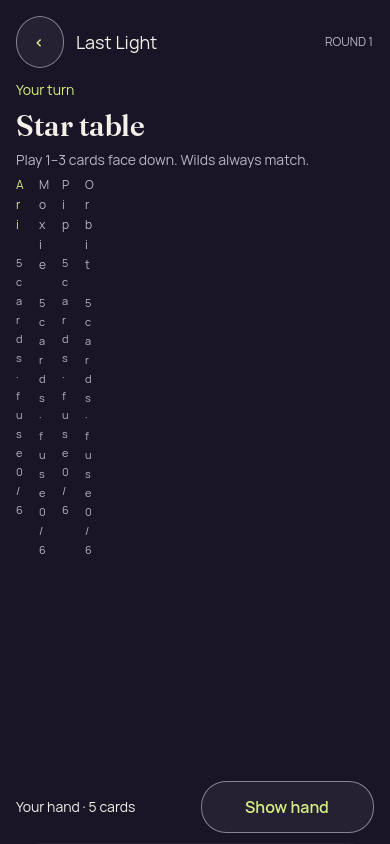

# Godot 3D — v1, Camera failure and broken portrait roster

[All screenshot collections](../../README.md)

**Evidence status:** One concealed frame only. Camera orientation was applied before the stage entered the scene tree, leaving the 3D table absent. The roster wraps one character at a time and pushes Play outside the viewport. The checker stopped at an unrelated proof-node assertion; no complete local-input pass is claimed.

Actual Godot 4.7.2.stable.official.ed1daf0bf rendering under Xvfb on Linux, OpenGL Compatibility / Mesa 25.2.8 llvmpipe LLVM 20.1.2. Static recipient-safe launch data was generated by the Kotlin authority with seed 2; no action was round-tripped through the authority in these captures. Exact immutable source revision was not recorded.

[Original provenance](provenance.json) · [Frozen authority-generated launch fixture](../godot-3d-fixtures/launch-3d.json).

Fixture SHA-256: `d099a9ff543d5409925a3afb669780dd702f20bdd886cf530c431d546af99407`.

Original PNGs and diagnostics are retained without alteration. The source revision is unknown; do not attribute the pictures to the current HEAD. No frozen source snapshot was supplied for this failed first attempt.

Local checks cover reveal, selecting the first and last own cards, cover and foreground loss/resume. They do not establish accepted game actions, touch input, native accessibility, native lifecycle protection or a visual pass. Concealed/covered/resumed diagnostics report zero private faces, private labels and selected cards.

## Portrait

Failed attempt; no complete passing report was supplied.

| Original image | Scenario and provenance |
| --- | --- |
|  | **Initial concealed own hand — portrait** Godot 4.7.2 desktop 3D, Compatibility renderer Original: [01-concealed.png](portrait/01-concealed.png) 390 × 844 px; text 1.0×; seed 2 SHA-256: <code>c81ef99e75f85e5a6726b781128c67dd76cc75a429a4a7e1db4bace3d53d9ae3</code> [Original diagnostics](portrait/01-concealed.json) Static authority-derived fixture with local renderer input/privacy checks; no accepted gameplay or native accessibility claim. Failure capture: 3D table is absent due to the camera setup error; roster is unreadable and Play is below the viewport. |
