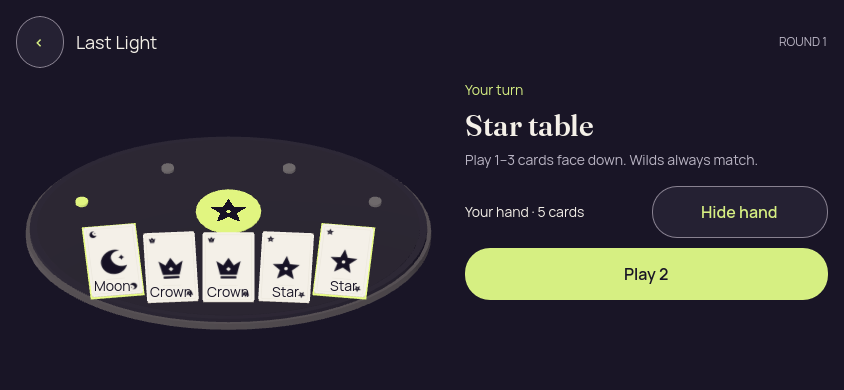
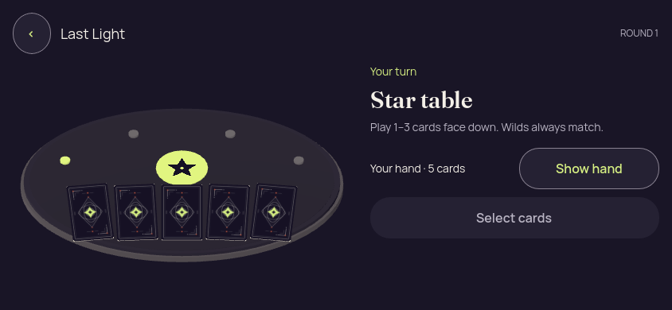
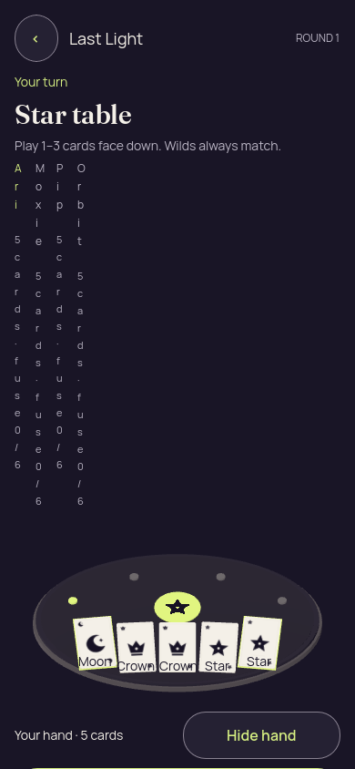
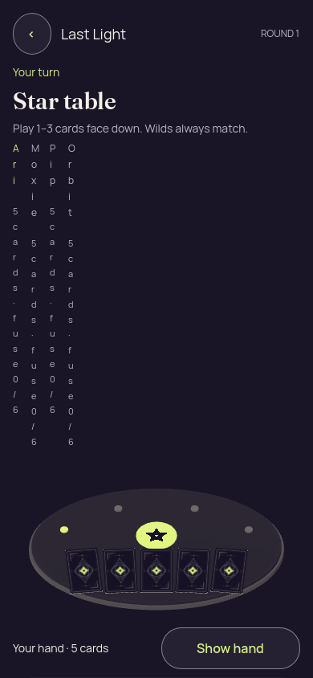

# Godot 3D — v2, Camera corrected; portrait layout still broken

[All screenshot collections](../../README.md)

**Evidence status:** Actual local mouse reveal/select/cover/foreground checks passed in portrait and landscape. Visual review fails the portrait layout: roster columns wrap one character at a time and Play is below the viewport. Projected rank captions overlap card corners and selection relies on a thin edge/lift. Landscape does not expose the roster in these captures.

Actual Godot 4.7.2.stable.official.ed1daf0bf rendering under Xvfb on Linux, OpenGL Compatibility / Mesa 25.2.8 llvmpipe LLVM 20.1.2. Static recipient-safe launch data was generated by the Kotlin authority with seed 2; no action was round-tripped through the authority in these captures. Exact immutable source revision was not recorded.

[Original provenance](provenance.json) · [Frozen authority-generated launch fixture](../godot-3d-fixtures/launch-3d.json).

Fixture SHA-256: `d099a9ff543d5409925a3afb669780dd702f20bdd886cf530c431d546af99407`.

Original PNGs and diagnostics are retained without alteration. The source revision is unknown; do not attribute the pictures to the current HEAD. The six frozen source files named and hashed in provenance.json are preserved under source/.

Local checks cover reveal, selecting the first and last own cards, cover and foreground loss/resume. They do not establish accepted game actions, touch input, native accessibility, native lifecycle protection or a visual pass. Concealed/covered/resumed diagnostics report zero private faces, private labels and selected cards.

## Landscape

[Original local renderer check report](landscape/report.json).

| Original image | Scenario and provenance |
| --- | --- |
|  | **Initial concealed own hand — landscape** Godot 4.7.2 desktop 3D, Compatibility renderer Original: [01-concealed.png](landscape/01-concealed.png) 844 × 390 px; text 1.0×; seed 2 SHA-256: <code>2ba12eed17a16cef08143efb44fe78c2e3fed0770158688cd9a2f5b3dafef4a9</code> [Original diagnostics](landscape/01-concealed.json) Static authority-derived fixture with local renderer input/privacy checks; no accepted gameplay or native accessibility claim. |
|  | **Own hand revealed with first and last cards selected — landscape** Godot 4.7.2 desktop 3D, Compatibility renderer Original: [02-revealed-selected.png](landscape/02-revealed-selected.png) 844 × 390 px; text 1.0×; seed 2 SHA-256: <code>425534fd14c5288eedaa98e888514cc9dc47a35a8e259cf76b7d03d8e185e81f</code> [Original diagnostics](landscape/02-revealed-selected.json) Static authority-derived fixture with local renderer input/privacy checks; no accepted gameplay or native accessibility claim. Known visual issue: rank captions overlap corner art and selected-card markers are weak. |
|  | **Hand covered after selection — landscape** Godot 4.7.2 desktop 3D, Compatibility renderer Original: [03-covered-again.png](landscape/03-covered-again.png) 844 × 390 px; text 1.0×; seed 2 SHA-256: <code>2ba12eed17a16cef08143efb44fe78c2e3fed0770158688cd9a2f5b3dafef4a9</code> [Original diagnostics](landscape/03-covered-again.json) Static authority-derived fixture with local renderer input/privacy checks; no accepted gameplay or native accessibility claim. |
|  | **Hand remains covered after background and resume — landscape** Godot 4.7.2 desktop 3D, Compatibility renderer Original: [04-resumed-covered.png](landscape/04-resumed-covered.png) 844 × 390 px; text 1.0×; seed 2 SHA-256: <code>2ba12eed17a16cef08143efb44fe78c2e3fed0770158688cd9a2f5b3dafef4a9</code> [Original diagnostics](landscape/04-resumed-covered.json) Static authority-derived fixture with local renderer input/privacy checks; no accepted gameplay or native accessibility claim. |

## Portrait

[Original local renderer check report](portrait/report.json).

| Original image | Scenario and provenance |
| --- | --- |
|  | **Initial concealed own hand — portrait** Godot 4.7.2 desktop 3D, Compatibility renderer Original: [01-concealed.png](portrait/01-concealed.png) 390 × 844 px; text 1.0×; seed 2 SHA-256: <code>7585350686fd829c39768390f15616b040b5c46ac08d770eff10d28ad82e02c5</code> [Original diagnostics](portrait/01-concealed.json) Static authority-derived fixture with local renderer input/privacy checks; no accepted gameplay or native accessibility claim. Known visual failure: per-character roster wrapping and Play below the viewport. |
|  | **Own hand revealed with first and last cards selected — portrait** Godot 4.7.2 desktop 3D, Compatibility renderer Original: [02-revealed-selected.png](portrait/02-revealed-selected.png) 390 × 844 px; text 1.0×; seed 2 SHA-256: <code>1994ea9908192c0e9ef1c1e29b97475ee57ee6cbb0a5dbac9a5494a93558f9aa</code> [Original diagnostics](portrait/02-revealed-selected.json) Static authority-derived fixture with local renderer input/privacy checks; no accepted gameplay or native accessibility claim. Known visual failure: per-character roster wrapping and Play below the viewport. Known visual issue: rank captions overlap corner art and selected-card markers are weak. |
|  | **Hand covered after selection — portrait** Godot 4.7.2 desktop 3D, Compatibility renderer Original: [03-covered-again.png](portrait/03-covered-again.png) 390 × 844 px; text 1.0×; seed 2 SHA-256: <code>7585350686fd829c39768390f15616b040b5c46ac08d770eff10d28ad82e02c5</code> [Original diagnostics](portrait/03-covered-again.json) Static authority-derived fixture with local renderer input/privacy checks; no accepted gameplay or native accessibility claim. Known visual failure: per-character roster wrapping and Play below the viewport. |
|  | **Hand remains covered after background and resume — portrait** Godot 4.7.2 desktop 3D, Compatibility renderer Original: [04-resumed-covered.png](portrait/04-resumed-covered.png) 390 × 844 px; text 1.0×; seed 2 SHA-256: <code>7585350686fd829c39768390f15616b040b5c46ac08d770eff10d28ad82e02c5</code> [Original diagnostics](portrait/04-resumed-covered.json) Static authority-derived fixture with local renderer input/privacy checks; no accepted gameplay or native accessibility claim. Known visual failure: per-character roster wrapping and Play below the viewport. |
