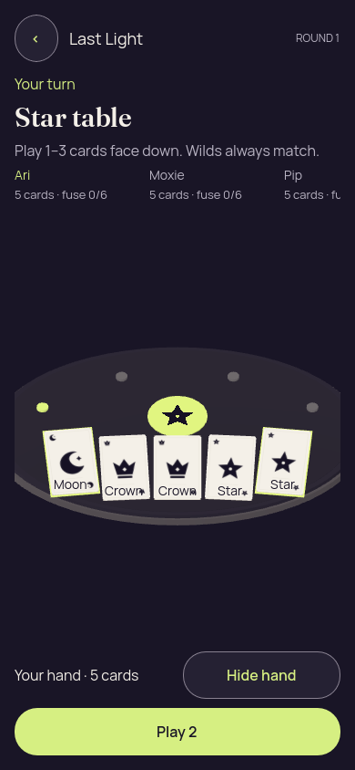

# Godot 3D — v3, Portrait roster and Play visibility corrected

[All screenshot collections](../../README.md)

**Evidence status:** Actual local mouse/privacy checks passed at 390 × 844. Roster width is corrected and Play is visible. Rank captions still overlap corner art and selection markers remain weak; the roster extends horizontally beyond the initial viewport. This is an intermediate visual iteration, not accepted 3D gameplay.

Actual Godot 4.7.2.stable.official.ed1daf0bf rendering under Xvfb on Linux, OpenGL Compatibility / Mesa 25.2.8 llvmpipe LLVM 20.1.2. Static recipient-safe launch data was generated by the Kotlin authority with seed 2; no action was round-tripped through the authority in these captures. Exact immutable source revision was not recorded.

[Original provenance](provenance.json) · [Frozen authority-generated launch fixture](../godot-3d-fixtures/launch-3d.json).

Fixture SHA-256: `d099a9ff543d5409925a3afb669780dd702f20bdd886cf530c431d546af99407`.

Original PNGs and diagnostics are retained without alteration. The source revision is unknown; do not attribute the pictures to the current HEAD. The six frozen source files named and hashed in provenance.json are preserved under source/.

Local checks cover reveal, selecting the first and last own cards, cover and foreground loss/resume. They do not establish accepted game actions, touch input, native accessibility, native lifecycle protection or a visual pass. Concealed/covered/resumed diagnostics report zero private faces, private labels and selected cards.

## Portrait

[Original local renderer check report](portrait/report.json).

| Original image | Scenario and provenance |
| --- | --- |
|  | **Initial concealed own hand — portrait** Godot 4.7.2 desktop 3D, Compatibility renderer Original: [01-concealed.png](portrait/01-concealed.png) 390 × 844 px; text 1.0×; seed 2 SHA-256: <code>b345a16d8c98b4ff8f588b18d38f6c739d503483aca4b9d58fbf01f1a7610598</code> [Original diagnostics](portrait/01-concealed.json) Static authority-derived fixture with local renderer input/privacy checks; no accepted gameplay or native accessibility claim. Roster character wrapping is fixed and Play is visible; additional roster content lies beyond the horizontal viewport. |
|  | **Own hand revealed with first and last cards selected — portrait** Godot 4.7.2 desktop 3D, Compatibility renderer Original: [02-revealed-selected.png](portrait/02-revealed-selected.png) 390 × 844 px; text 1.0×; seed 2 SHA-256: <code>367f65cd948c31824961c89512ad851548829a5f87e7c70f1dd6ccc696e16bf9</code> [Original diagnostics](portrait/02-revealed-selected.json) Static authority-derived fixture with local renderer input/privacy checks; no accepted gameplay or native accessibility claim. Known visual issue: rank captions overlap corner art and selected-card markers are weak. Roster character wrapping is fixed and Play is visible; additional roster content lies beyond the horizontal viewport. |
|  | **Hand covered after selection — portrait** Godot 4.7.2 desktop 3D, Compatibility renderer Original: [03-covered-again.png](portrait/03-covered-again.png) 390 × 844 px; text 1.0×; seed 2 SHA-256: <code>b345a16d8c98b4ff8f588b18d38f6c739d503483aca4b9d58fbf01f1a7610598</code> [Original diagnostics](portrait/03-covered-again.json) Static authority-derived fixture with local renderer input/privacy checks; no accepted gameplay or native accessibility claim. Roster character wrapping is fixed and Play is visible; additional roster content lies beyond the horizontal viewport. |
|  | **Hand remains covered after background and resume — portrait** Godot 4.7.2 desktop 3D, Compatibility renderer Original: [04-resumed-covered.png](portrait/04-resumed-covered.png) 390 × 844 px; text 1.0×; seed 2 SHA-256: <code>b345a16d8c98b4ff8f588b18d38f6c739d503483aca4b9d58fbf01f1a7610598</code> [Original diagnostics](portrait/04-resumed-covered.json) Static authority-derived fixture with local renderer input/privacy checks; no accepted gameplay or native accessibility claim. Roster character wrapping is fixed and Play is visible; additional roster content lies beyond the horizontal viewport. |
