# Godot 3D — v4, captions improved; large-text and winner defects retained

[All screenshot collections](../../README.md)

**Evidence status:** Local static reports pass across seven viewports/states, but visual review fails: 200% selection markers become tall bars, the large-text back control is clipped, narrow hit rectangles overlap, selection can reset scroll, and the winner uses the wrong central rank emblem while omitting the final challenge explanation.

Actual Godot `4.7.2.stable.official.ed1daf0bf`, OpenGL Compatibility / Mesa llvmpipe 25.2.8 LLVM 20.1.2 / Xvfb Linux. All 22 original images are retained, including separate covered/resumed records whose bytes match the concealed frame.

[Original provenance](provenance.json) lists six frozen source files under [source/](source/). Each copy matches its recorded SHA-256. The exact source commit was not recorded.

The seed-2 inputs are real recipient-safe Kotlin-authority projections: [playing](../godot-3d-fixtures/launch-3d.json), [round ended](../godot-3d-fixtures/round-ended-launch-3d.json) and [finished](../godot-3d-fixtures/finished-launch-3d.json). This suite checks local mouse input and privacy against static views; it does not exercise authority acceptance, native touch, accessibility or OS lifecycle protection.

Six scenarios retain original runtime logs and capture-basis receipts. All six record exit 0, stable source hashes and fixture hashes that independently match the preserved files; none of those logs contains an engine/script error. **Portrait is report-only:** the owner ran it directly and did not persist its runtime log or capture-basis receipt. No replacement receipt is invented.

Captions now sit below card faces, and normal-text selection has explicit check markers. The remaining defects are preserved: 200% marker bars and clipped back control, owner-reported scroll reset after selection, horizontal roster overflow and narrow hit overlap (0.837, 0.754, 4.154 and 4.071 pixels between successive cards).

The [frozen winner code](source/godot/renderer/presentations/three_d/table.gd#L314) forces the central rank to Star when finished. The frozen input says **Crown**, and the capture visibly shows Star behind the public Moon. It also omits the final explanation: Orbit challenged Moxie’s Crown claim, Moon did not match, and Moxie burned out on light 4.

All 12 unique image states were visually inspected; hashes establish covered/resumed equality for each viewport. Concealed, covered, resumed and outcome diagnostics have zero private faces, labels and selection. Revealed selected frames have **5 private faces, 7 private labels and 2 selected cards**: five rank captions plus two private checkmark labels.

## Desktop

[Original static check report](desktop/report.json) · [Original capture basis](desktop/capture-basis.json) · [Original runtime log](desktop/runtime.log).

| Original image | Scenario and provenance |
| --- | --- |
|  | **Initial concealed own hand — desktop** Godot 4.7.2 desktop 3D, Compatibility renderer Original: [01-concealed.png](desktop/01-concealed.png) 1280 × 800 px; text 1×; seed 2 SHA-256: <code>95cb831da09578b381463beecf54edfcdab051c662164984a5864c0767693119</code> [Original diagnostics](desktop/01-concealed.json) Static seed-2 authority-derived fixture with local mouse/privacy checks; no authority-accepted gameplay action is exercised. |
| <a href="desktop/02-revealed-selected.png">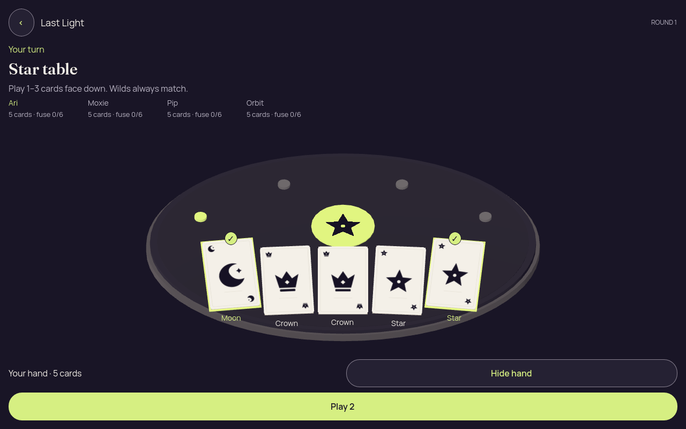</a> | **Own hand revealed with first and last cards selected — desktop** Godot 4.7.2 desktop 3D, Compatibility renderer Original: [02-revealed-selected.png](desktop/02-revealed-selected.png) 1280 × 800 px; text 1×; seed 2 SHA-256: <code>c18b18b1c261ee6ab9acd1e16b398e3716262b00be153915f80c42982c7aa409</code> [Original diagnostics](desktop/02-revealed-selected.json) Static seed-2 authority-derived fixture with local mouse/privacy checks; no authority-accepted gameplay action is exercised. |
| <a href="desktop/03-covered-again.png">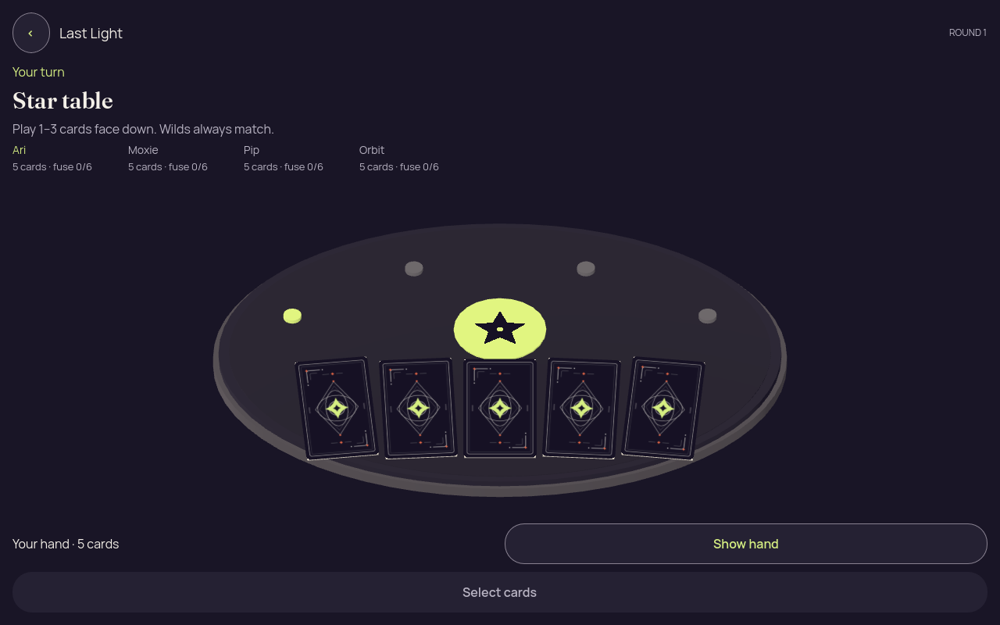</a> | **Hand covered after selection — desktop** Godot 4.7.2 desktop 3D, Compatibility renderer Original: [03-covered-again.png](desktop/03-covered-again.png) 1280 × 800 px; text 1×; seed 2 SHA-256: <code>95cb831da09578b381463beecf54edfcdab051c662164984a5864c0767693119</code> [Original diagnostics](desktop/03-covered-again.json) Static seed-2 authority-derived fixture with local mouse/privacy checks; no authority-accepted gameplay action is exercised. |
|  | **Hand remains covered after background and resume — desktop** Godot 4.7.2 desktop 3D, Compatibility renderer Original: [04-resumed-covered.png](desktop/04-resumed-covered.png) 1280 × 800 px; text 1×; seed 2 SHA-256: <code>95cb831da09578b381463beecf54edfcdab051c662164984a5864c0767693119</code> [Original diagnostics](desktop/04-resumed-covered.json) Static seed-2 authority-derived fixture with local mouse/privacy checks; no authority-accepted gameplay action is exercised. |

## Portrait

[Original static check report](portrait/report.json); original runtime/capture-basis receipt unavailable.

| Original image | Scenario and provenance |
| --- | --- |
| <a href="portrait/01-concealed.png">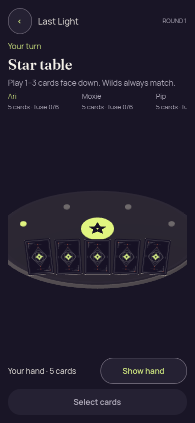</a> | **Initial concealed own hand — portrait** Godot 4.7.2 desktop 3D, Compatibility renderer Original: [01-concealed.png](portrait/01-concealed.png) 390 × 844 px; text 1×; seed 2 SHA-256: <code>b345a16d8c98b4ff8f588b18d38f6c739d503483aca4b9d58fbf01f1a7610598</code> [Original diagnostics](portrait/01-concealed.json) Static seed-2 authority-derived fixture with local mouse/privacy checks; no authority-accepted gameplay action is exercised. Report and diagnostics are retained; no original runtime log or capture-basis receipt was persisted for this viewport. Roster content extends horizontally beyond the initial viewport. |
| <a href="portrait/02-revealed-selected.png">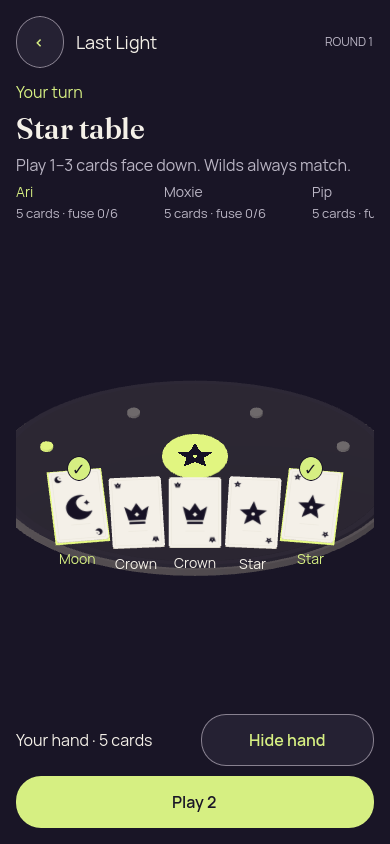</a> | **Own hand revealed with first and last cards selected — portrait** Godot 4.7.2 desktop 3D, Compatibility renderer Original: [02-revealed-selected.png](portrait/02-revealed-selected.png) 390 × 844 px; text 1×; seed 2 SHA-256: <code>83dff1848a41c34cf544cdc25276af5ceb34431e7261d388bcb508483bbef400</code> [Original diagnostics](portrait/02-revealed-selected.json) Static seed-2 authority-derived fixture with local mouse/privacy checks; no authority-accepted gameplay action is exercised. Report and diagnostics are retained; no original runtime log or capture-basis receipt was persisted for this viewport. Roster content extends horizontally beyond the initial viewport. |
|  | **Hand covered after selection — portrait** Godot 4.7.2 desktop 3D, Compatibility renderer Original: [03-covered-again.png](portrait/03-covered-again.png) 390 × 844 px; text 1×; seed 2 SHA-256: <code>b345a16d8c98b4ff8f588b18d38f6c739d503483aca4b9d58fbf01f1a7610598</code> [Original diagnostics](portrait/03-covered-again.json) Static seed-2 authority-derived fixture with local mouse/privacy checks; no authority-accepted gameplay action is exercised. Report and diagnostics are retained; no original runtime log or capture-basis receipt was persisted for this viewport. Roster content extends horizontally beyond the initial viewport. |
|  | **Hand remains covered after background and resume — portrait** Godot 4.7.2 desktop 3D, Compatibility renderer Original: [04-resumed-covered.png](portrait/04-resumed-covered.png) 390 × 844 px; text 1×; seed 2 SHA-256: <code>b345a16d8c98b4ff8f588b18d38f6c739d503483aca4b9d58fbf01f1a7610598</code> [Original diagnostics](portrait/04-resumed-covered.json) Static seed-2 authority-derived fixture with local mouse/privacy checks; no authority-accepted gameplay action is exercised. Report and diagnostics are retained; no original runtime log or capture-basis receipt was persisted for this viewport. Roster content extends horizontally beyond the initial viewport. |

## Narrow phone viewport

[Original static check report](narrow/report.json) · [Original capture basis](narrow/capture-basis.json) · [Original runtime log](narrow/runtime.log).

| Original image | Scenario and provenance |
| --- | --- |
|  | **Initial concealed own hand — narrow phone viewport** Godot 4.7.2 desktop 3D, Compatibility renderer Original: [01-concealed.png](narrow/01-concealed.png) 320 × 568 px; text 1×; seed 2 SHA-256: <code>4eb784750bbfcdb94704ede7e8cc786152a646b108169b065f0c3586a830805a</code> [Original diagnostics](narrow/01-concealed.json) Static seed-2 authority-derived fixture with local mouse/privacy checks; no authority-accepted gameplay action is exercised. Adjacent hand hit rectangles overlap by 0.837, 0.754, 4.154 and 4.071 pixels. After selection, Play is below the initial viewport. |
| <a href="narrow/02-revealed-selected.png">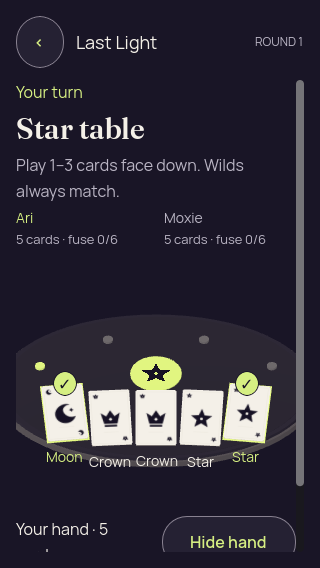</a> | **Own hand revealed with first and last cards selected — narrow phone viewport** Godot 4.7.2 desktop 3D, Compatibility renderer Original: [02-revealed-selected.png](narrow/02-revealed-selected.png) 320 × 568 px; text 1×; seed 2 SHA-256: <code>6673887061c0d1ea5d1ea119cad6ea8f0ed9172d66fb585f65a5f62bbff39692</code> [Original diagnostics](narrow/02-revealed-selected.json) Static seed-2 authority-derived fixture with local mouse/privacy checks; no authority-accepted gameplay action is exercised. Adjacent hand hit rectangles overlap by 0.837, 0.754, 4.154 and 4.071 pixels. After selection, Play is below the initial viewport. |
|  | **Hand covered after selection — narrow phone viewport** Godot 4.7.2 desktop 3D, Compatibility renderer Original: [03-covered-again.png](narrow/03-covered-again.png) 320 × 568 px; text 1×; seed 2 SHA-256: <code>4eb784750bbfcdb94704ede7e8cc786152a646b108169b065f0c3586a830805a</code> [Original diagnostics](narrow/03-covered-again.json) Static seed-2 authority-derived fixture with local mouse/privacy checks; no authority-accepted gameplay action is exercised. Adjacent hand hit rectangles overlap by 0.837, 0.754, 4.154 and 4.071 pixels. After selection, Play is below the initial viewport. |
| <a href="narrow/04-resumed-covered.png">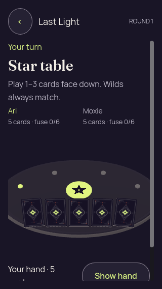</a> | **Hand remains covered after background and resume — narrow phone viewport** Godot 4.7.2 desktop 3D, Compatibility renderer Original: [04-resumed-covered.png](narrow/04-resumed-covered.png) 320 × 568 px; text 1×; seed 2 SHA-256: <code>4eb784750bbfcdb94704ede7e8cc786152a646b108169b065f0c3586a830805a</code> [Original diagnostics](narrow/04-resumed-covered.json) Static seed-2 authority-derived fixture with local mouse/privacy checks; no authority-accepted gameplay action is exercised. Adjacent hand hit rectangles overlap by 0.837, 0.754, 4.154 and 4.071 pixels. After selection, Play is below the initial viewport. |

## Phone, 200% text

[Original static check report](large-text/report.json) · [Original capture basis](large-text/capture-basis.json) · [Original runtime log](large-text/runtime.log).

| Original image | Scenario and provenance |
| --- | --- |
|  | **Initial concealed own hand — phone, 200% text** Godot 4.7.2 desktop 3D, Compatibility renderer Original: [01-concealed.png](large-text/01-concealed.png) 320 × 740 px; text 2×; seed 2 SHA-256: <code>d5526886cc8f0e37cd9cdbd0eea68d04c82cb6e6bb0ca1d01db38ed558e6cfb9</code> [Original diagnostics](large-text/01-concealed.json) Static seed-2 authority-derived fixture with local mouse/privacy checks; no authority-accepted gameplay action is exercised. Visual failure at 200% text: the back control is blank or clipped; selected markers stretch into tall bars, and selection resets scroll. |
| <a href="large-text/02-revealed-selected.png">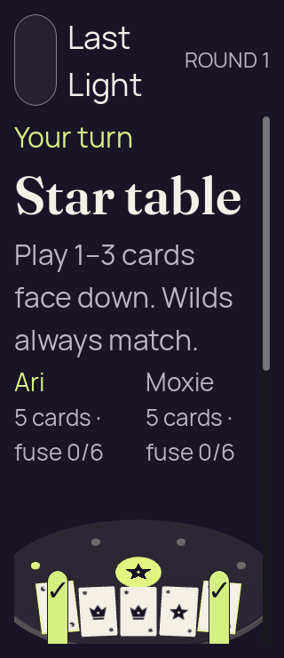</a> | **Own hand revealed with first and last cards selected — phone, 200% text** Godot 4.7.2 desktop 3D, Compatibility renderer Original: [02-revealed-selected.png](large-text/02-revealed-selected.png) 320 × 740 px; text 2×; seed 2 SHA-256: <code>8ac888d9b747d6c897d18420c1974e7c2f96e05121bdfa7dd0ca3c2b18d9ddaf</code> [Original diagnostics](large-text/02-revealed-selected.json) Static seed-2 authority-derived fixture with local mouse/privacy checks; no authority-accepted gameplay action is exercised. Visual failure at 200% text: the back control is blank or clipped; selected markers stretch into tall bars, and selection resets scroll. |
|  | **Hand covered after selection — phone, 200% text** Godot 4.7.2 desktop 3D, Compatibility renderer Original: [03-covered-again.png](large-text/03-covered-again.png) 320 × 740 px; text 2×; seed 2 SHA-256: <code>d5526886cc8f0e37cd9cdbd0eea68d04c82cb6e6bb0ca1d01db38ed558e6cfb9</code> [Original diagnostics](large-text/03-covered-again.json) Static seed-2 authority-derived fixture with local mouse/privacy checks; no authority-accepted gameplay action is exercised. Visual failure at 200% text: the back control is blank or clipped; selected markers stretch into tall bars, and selection resets scroll. |
| <a href="large-text/04-resumed-covered.png">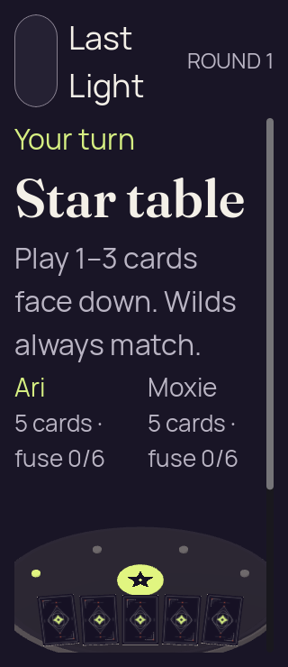</a> | **Hand remains covered after background and resume — phone, 200% text** Godot 4.7.2 desktop 3D, Compatibility renderer Original: [04-resumed-covered.png](large-text/04-resumed-covered.png) 320 × 740 px; text 2×; seed 2 SHA-256: <code>d5526886cc8f0e37cd9cdbd0eea68d04c82cb6e6bb0ca1d01db38ed558e6cfb9</code> [Original diagnostics](large-text/04-resumed-covered.json) Static seed-2 authority-derived fixture with local mouse/privacy checks; no authority-accepted gameplay action is exercised. Visual failure at 200% text: the back control is blank or clipped; selected markers stretch into tall bars, and selection resets scroll. |

## Short landscape

[Original static check report](landscape/report.json) · [Original capture basis](landscape/capture-basis.json) · [Original runtime log](landscape/runtime.log).

| Original image | Scenario and provenance |
| --- | --- |
| <a href="landscape/01-concealed.png">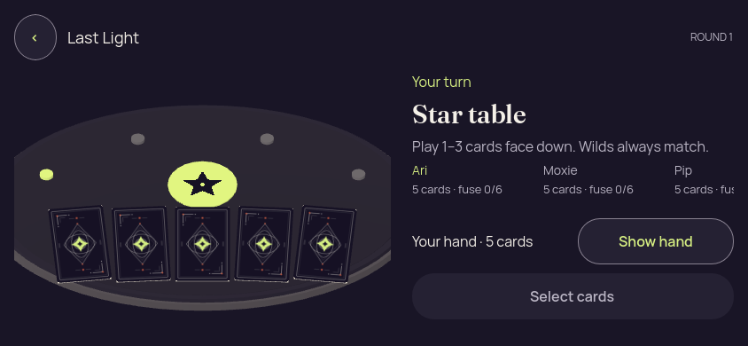</a> | **Initial concealed own hand — short landscape** Godot 4.7.2 desktop 3D, Compatibility renderer Original: [01-concealed.png](landscape/01-concealed.png) 844 × 390 px; text 1×; seed 2 SHA-256: <code>85a3975ebd794ca6623c13f7eed1d07621485371936cefc6148f99e0bd552e85</code> [Original diagnostics](landscape/01-concealed.json) Static seed-2 authority-derived fixture with local mouse/privacy checks; no authority-accepted gameplay action is exercised. Roster content extends horizontally beyond the initial viewport. |
| <a href="landscape/02-revealed-selected.png">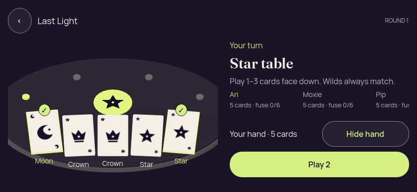</a> | **Own hand revealed with first and last cards selected — short landscape** Godot 4.7.2 desktop 3D, Compatibility renderer Original: [02-revealed-selected.png](landscape/02-revealed-selected.png) 844 × 390 px; text 1×; seed 2 SHA-256: <code>cb86b793f4d51b0614a4b6ce79a2aab1d9b33e15217e27ed131f93e3d4b007b3</code> [Original diagnostics](landscape/02-revealed-selected.json) Static seed-2 authority-derived fixture with local mouse/privacy checks; no authority-accepted gameplay action is exercised. Roster content extends horizontally beyond the initial viewport. |
|  | **Hand covered after selection — short landscape** Godot 4.7.2 desktop 3D, Compatibility renderer Original: [03-covered-again.png](landscape/03-covered-again.png) 844 × 390 px; text 1×; seed 2 SHA-256: <code>85a3975ebd794ca6623c13f7eed1d07621485371936cefc6148f99e0bd552e85</code> [Original diagnostics](landscape/03-covered-again.json) Static seed-2 authority-derived fixture with local mouse/privacy checks; no authority-accepted gameplay action is exercised. Roster content extends horizontally beyond the initial viewport. |
|  | **Hand remains covered after background and resume — short landscape** Godot 4.7.2 desktop 3D, Compatibility renderer Original: [04-resumed-covered.png](landscape/04-resumed-covered.png) 844 × 390 px; text 1×; seed 2 SHA-256: <code>85a3975ebd794ca6623c13f7eed1d07621485371936cefc6148f99e0bd552e85</code> [Original diagnostics](landscape/04-resumed-covered.json) Static seed-2 authority-derived fixture with local mouse/privacy checks; no authority-accepted gameplay action is exercised. Roster content extends horizontally beyond the initial viewport. |

## Round result

[Original static check report](round-ended/report.json) · [Original capture basis](round-ended/capture-basis.json) · [Original runtime log](round-ended/runtime.log).

| Original image | Scenario and provenance |
| --- | --- |
| <a href="round-ended/01-concealed.png">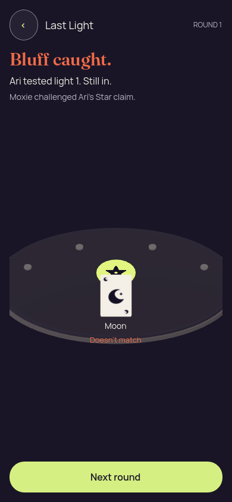</a> | **Moon bluff against Star; Ari used light 1 and stays in** Godot 4.7.2 desktop 3D, Compatibility renderer Original: [01-concealed.png](round-ended/01-concealed.png) 390 × 844 px; text 1×; seed 2 SHA-256: <code>4bc5330b7ee9901fece971a617aa989a0659293d2110dd0abfdeb93af02c628c</code> [Original diagnostics](round-ended/01-concealed.json) Static seed-2 authority-derived fixture with local mouse/privacy checks; no authority-accepted gameplay action is exercised. Moxie challenged Ari; public Moon and Next round are visible. |

## Winner

[Original static check report](winner/report.json) · [Original capture basis](winner/capture-basis.json) · [Original runtime log](winner/runtime.log).

| Original image | Scenario and provenance |
| --- | --- |
| <a href="winner/01-concealed.png">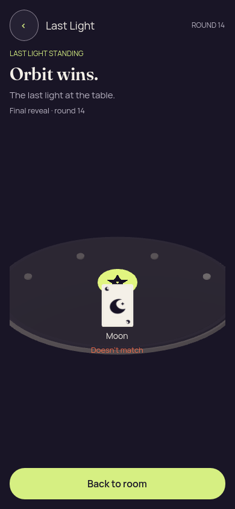</a> | **Orbit wins; final Moon proof with an incorrect Star emblem** Godot 4.7.2 desktop 3D, Compatibility renderer Original: [01-concealed.png](winner/01-concealed.png) 390 × 844 px; text 1×; seed 2 SHA-256: <code>5bee9e6c0962f0f5bdb94688367f9762b6c259ab0b84b3127b22658c87da8b35</code> [Original diagnostics](winner/01-concealed.json) Static seed-2 authority-derived fixture with local mouse/privacy checks; no authority-accepted gameplay action is exercised. Visual failure: the authority fixture requires Crown, but the center emblem shows Star. The screen omits who challenged whom, the claim rank and final burnout explanation. Correct final outcome: Orbit challenged Moxie’s Crown claim; public Moon mismatched it; Moxie burned out on light 4. |
