# Godot 3D — v6, authority edge cases and retained layout defects

[All screenshot collections](../../README.md)

**Evidence status:** All 16 static reports and runtime receipts pass. Visual review retains compact scrolled-context loss, weak focused confirmation contrast, overwrapped 200% roster names, and contradictory forced-challenge copy.

All 52 original PNGs are retained, including repeated image states and failed attempts. Every unique state was visually inspected; original bytes, filenames, dimensions and source locations are preserved. Inline thumbnails open the original file.

Actual Godot `4.7.2.stable.official.ed1daf0bf`, OpenGL Compatibility / Mesa llvmpipe / Xvfb. Each case retains its original command, exit code, source-before/source-after hashes, exact `fixture.json`, diagnostics and runtime log. The recorded 11-file [source subset](source/) is frozen and independently matches every corresponding receipt. No exact capture commit was recorded. Passing logs contain no engine/script errors; failing logs retain their original errors.

[Authority provenance](edge-authority-provenance.json) and [the edge-fixture manifest](edge-fixture-manifest.json) retain case-specific seeds and source recipes. Truthful-rank, truthful-Wild and burnout fixtures use seed 1; other edge inputs and the canonical launch/winner inputs use seed 2. The first five imported cases preserve deterministic recipes and verified safe bytes, without claiming original per-operation logs; new cases record real authority operations. Original fixture tooling is retained with [2D iteration 09](../../godot-2d-iteration-09/README.md). Every copied fixture hash and the authority-provenance hash were independently verified.

The reports exercise local reveal, selection, fourth-card rejection, deselection, cover and simulated foreground changes where applicable. A lobby check emits its final local intent without an authority round-trip. All retained concealed, covered, resumed, confirmation and public-outcome frames have zero private faces, labels and selection. Ordinary selected frames have five private faces, seven labels including selection markers and two selections; maximum-selection frames have five faces, eight labels and three selections. Emulated drag frames have five faces/labels and zero selection. The v6 one-card selected frame has one face, two labels and one selection.

Reported hand-target rectangles have at least 48-pixel dimensions and no mutual overlap in the reviewed diagnostics. That full-rectangle check does not make every target visible at every scroll position: v7/v8 containment failures and other offscreen cards remain explicit. These desktop checks do not establish native touch, accessibility, OS lifecycle/snapshot privacy, device performance or LAN behavior.

## Burnout

[Capture basis](burnout/capture-basis.json) · [Runtime log](burnout/runtime.log) · [Frozen input](burnout/fixture.json) · [Static report](burnout/report.json).

| Original image | Scenario and provenance |
| --- | --- |
| <a href="burnout/01-concealed.png">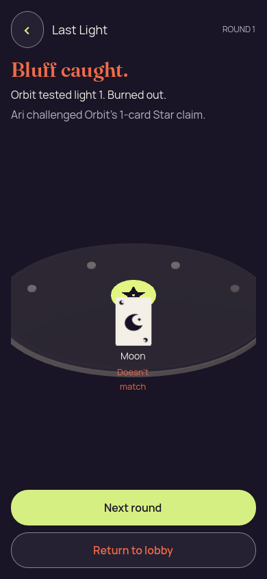</a> | **Orbit burns out after Ari catches the Star bluff** Godot 4.7.2 desktop 3D, Compatibility renderer Original: [01-concealed.png](burnout/01-concealed.png) 390 × 844 px; text 1×; seed 1 SHA-256: <code>ff7c741c2d44382662caff648e18b18ed1589dea81b834a351f8518e885ef269</code> [Original diagnostics](burnout/01-concealed.json) Static seed-1 recipient-safe authority input; no renderer action round-trip to the authority. Ari challenged Orbit’s one-card Star claim. Public Moon did not match; Orbit used light 1 and burned out. |

## Eliminated active round

[Capture basis](eliminated-active-round/capture-basis.json) · [Runtime log](eliminated-active-round/runtime.log) · [Frozen input](eliminated-active-round/fixture.json) · [Static report](eliminated-active-round/report.json).

| Original image | Scenario and provenance |
| --- | --- |
| <a href="eliminated-active-round/01-concealed.png">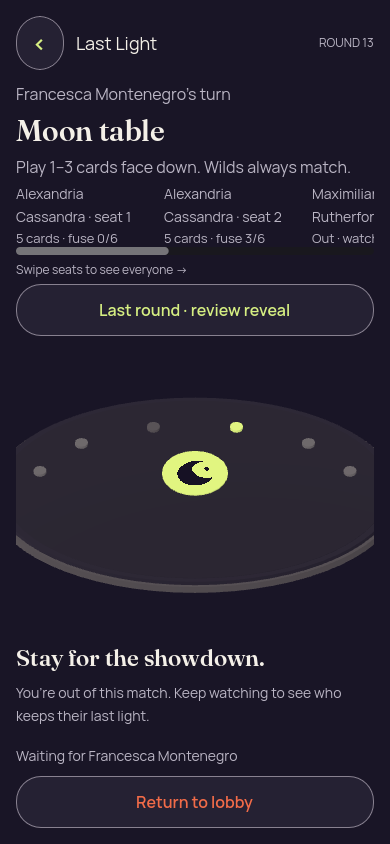</a> | **Initial concealed own hand — eliminated active round** Godot 4.7.2 desktop 3D, Compatibility renderer Original: [01-concealed.png](eliminated-active-round/01-concealed.png) 390 × 844 px; text 1×; seed 2 SHA-256: <code>1ee27e7ac65ca33b8a74a7b28da958ab4f3f9455b8a1dcc2db241ec3943f6efc</code> [Original diagnostics](eliminated-active-round/01-concealed.json) Static seed-2 recipient-safe authority input; no renderer action round-trip to the authority. The recipient is eliminated while round 13 continues with Francesca Montenegro taking the turn and Moon required. The separate history frame labels round 12’s public Moon proof and Maximilian Rutherford’s light-3 burnout. |
| <a href="eliminated-active-round/04a-previous-round.png">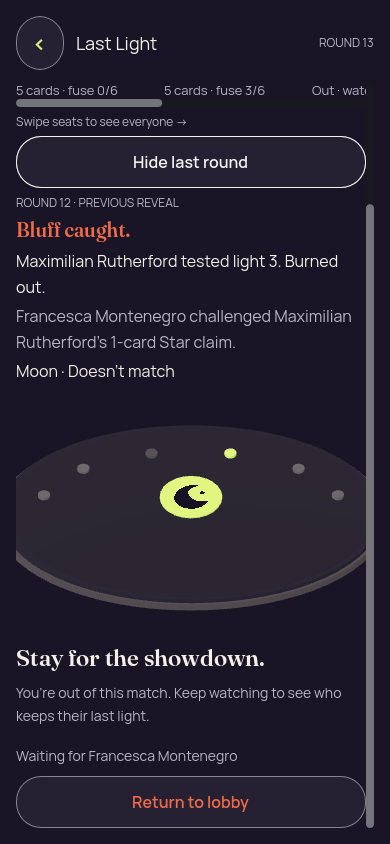</a> | **Previous-round public proof while the current round continues — eliminated active round** Godot 4.7.2 desktop 3D, Compatibility renderer Original: [04a-previous-round.png](eliminated-active-round/04a-previous-round.png) 390 × 844 px; text 1×; seed 2 SHA-256: <code>75291fb9eba4f29917b7310ea988622c2a901c40f2e4eb99f1607ca4c82aa93d</code> [Original diagnostics](eliminated-active-round/04a-previous-round.json) Static seed-2 recipient-safe authority input; no renderer action round-trip to the authority. The recipient is eliminated while round 13 continues with Francesca Montenegro taking the turn and Moon required. The separate history frame labels round 12’s public Moon proof and Maximilian Rutherford’s light-3 burnout. |

## Forced challenge

[Capture basis](forced-challenge/capture-basis.json) · [Runtime log](forced-challenge/runtime.log) · [Frozen input](forced-challenge/fixture.json) · [Static report](forced-challenge/report.json).

| Original image | Scenario and provenance |
| --- | --- |
| <a href="forced-challenge/01-concealed.png">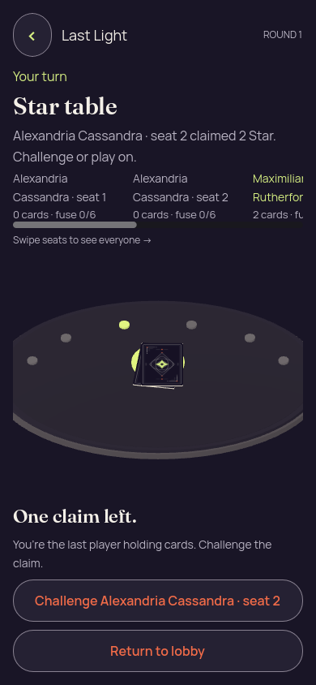</a> | **Last player holding cards must challenge the outstanding claim** Godot 4.7.2 desktop 3D, Compatibility renderer Original: [01-concealed.png](forced-challenge/01-concealed.png) 390 × 844 px; text 1×; seed 2 SHA-256: <code>028d21ddae1ff7773592b4497a57fb2bbf159ca5f0bf2158df83a0b6bf42d3ec</code> [Original diagnostics](forced-challenge/01-concealed.json) Static seed-2 recipient-safe authority input; no renderer action round-trip to the authority. Only a challenge is allowed. The v6 top copy still incorrectly says “Challenge or play on”; the lower explanation and available action require a challenge. |

## Landscape

[Capture basis](landscape/capture-basis.json) · [Runtime log](landscape/runtime.log) · [Frozen input](landscape/fixture.json) · [Static report](landscape/report.json).

| Original image | Scenario and provenance |
| --- | --- |
| <a href="landscape/01-concealed.png">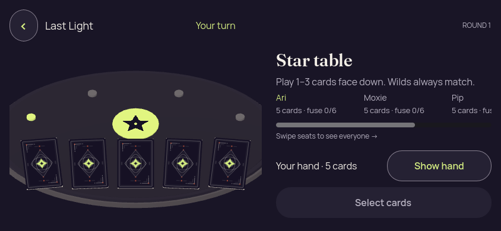</a> | **Initial concealed own hand — landscape** Godot 4.7.2 desktop 3D, Compatibility renderer Original: [01-concealed.png](landscape/01-concealed.png) 844 × 390 px; text 1×; seed 2 SHA-256: <code>461e01907587e5866ab92efc03dc664a4ac03347729a1ec7d9c4025731ca7fe0</code> [Original diagnostics](landscape/01-concealed.json) Static seed-2 recipient-safe authority input; no renderer action round-trip to the authority. |
| <a href="landscape/02-revealed-selected.png">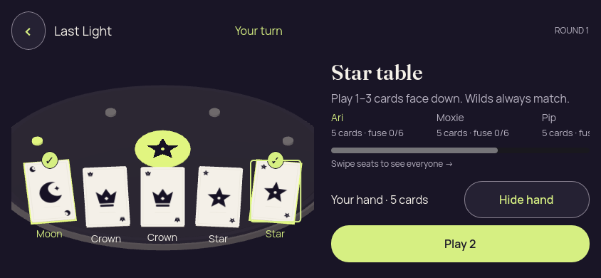</a> | **Own hand revealed with first and last cards selected — landscape** Godot 4.7.2 desktop 3D, Compatibility renderer Original: [02-revealed-selected.png](landscape/02-revealed-selected.png) 844 × 390 px; text 1×; seed 2 SHA-256: <code>f3fa16e1c6fed6aa0094827d97e0ee0beb1faf31220948265594b1fecd76ce20</code> [Original diagnostics](landscape/02-revealed-selected.json) Static seed-2 recipient-safe authority input; no renderer action round-trip to the authority. |
| <a href="landscape/02a-selection-limit.png">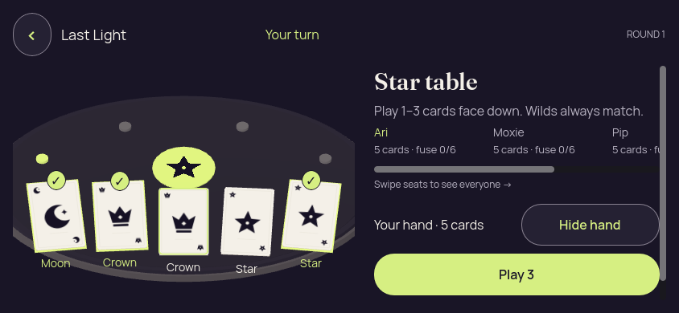</a> | **Three cards selected; fourth choice rejected with count-only feedback — landscape** Godot 4.7.2 desktop 3D, Compatibility renderer Original: [02a-selection-limit.png](landscape/02a-selection-limit.png) 844 × 390 px; text 1×; seed 2 SHA-256: <code>ef5bbda7ae39b7c9ad49ebf11be78f12c75009b38b84d4349d870389675a84e7</code> [Original diagnostics](landscape/02a-selection-limit.json) Static seed-2 recipient-safe authority input; no renderer action round-trip to the authority. |
| <a href="landscape/02b-deselected-last.png">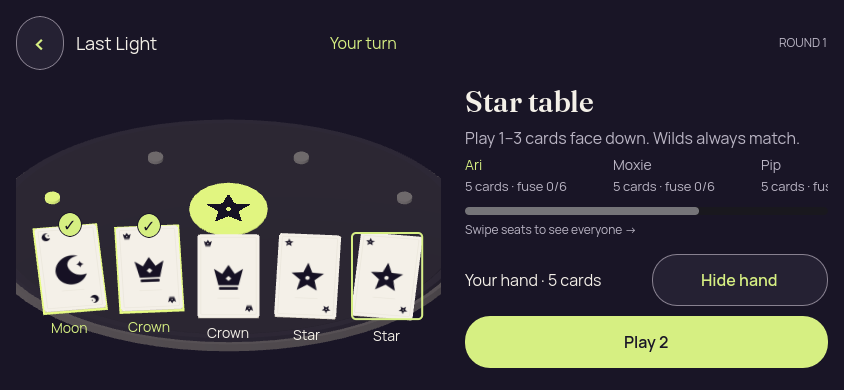</a> | **Last selected card deselected; two selections remain — landscape** Godot 4.7.2 desktop 3D, Compatibility renderer Original: [02b-deselected-last.png](landscape/02b-deselected-last.png) 844 × 390 px; text 1×; seed 2 SHA-256: <code>6877bc0c553e693f01bed3ef9dae9cbcc0289b0a0660bf4b80525eb561ec9142</code> [Original diagnostics](landscape/02b-deselected-last.json) Static seed-2 recipient-safe authority input; no renderer action round-trip to the authority. |
| <a href="landscape/03-covered-again.png">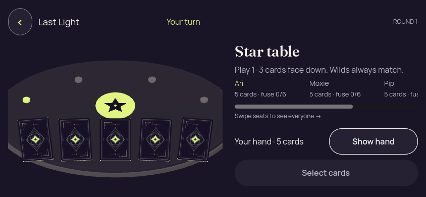</a> | **Hand covered with selection cleared — landscape** Godot 4.7.2 desktop 3D, Compatibility renderer Original: [03-covered-again.png](landscape/03-covered-again.png) 844 × 390 px; text 1×; seed 2 SHA-256: <code>9cf38c9f88492cdbaa050e09fa9368b4825c34da25b1314a1ec133fb101d4355</code> [Original diagnostics](landscape/03-covered-again.json) Static seed-2 recipient-safe authority input; no renderer action round-trip to the authority. |
|  | **Hand remains covered after simulated background and resume — landscape** Godot 4.7.2 desktop 3D, Compatibility renderer Original: [04-resumed-covered.png](landscape/04-resumed-covered.png) 844 × 390 px; text 1×; seed 2 SHA-256: <code>461e01907587e5866ab92efc03dc664a4ac03347729a1ec7d9c4025731ca7fe0</code> [Original diagnostics](landscape/04-resumed-covered.json) Static seed-2 recipient-safe authority input; no renderer action round-trip to the authority. |

## Large text

[Capture basis](large-text/capture-basis.json) · [Runtime log](large-text/runtime.log) · [Frozen input](large-text/fixture.json) · [Static report](large-text/report.json).

| Original image | Scenario and provenance |
| --- | --- |
|  | **Initial concealed own hand — large text** Godot 4.7.2 desktop 3D, Compatibility renderer Original: [01-concealed.png](large-text/01-concealed.png) 320 × 740 px; text 2×; seed 2 SHA-256: <code>665a7ff040f9988b04ae492883b2c7a9ea0e3b60db9b04b616b4c66e7d9681af</code> [Original diagnostics](large-text/01-concealed.json) Static seed-2 recipient-safe authority input; no renderer action round-trip to the authority. Compact scrolled frames can lose current turn/rank context and the Show/Hide control. The 200% roster also wraps long names awkwardly; later versions retain these corrections separately. |
|  | **Own hand revealed with first and last cards selected — large text** Godot 4.7.2 desktop 3D, Compatibility renderer Original: [02-revealed-selected.png](large-text/02-revealed-selected.png) 320 × 740 px; text 2×; seed 2 SHA-256: <code>2c41be2dd26e1dd11a0b745c58bd25bb7189b4366b9f0b064f0e85c71f3a4779</code> [Original diagnostics](large-text/02-revealed-selected.json) Static seed-2 recipient-safe authority input; no renderer action round-trip to the authority. Compact scrolled frames can lose current turn/rank context and the Show/Hide control. The 200% roster also wraps long names awkwardly; later versions retain these corrections separately. |
| <a href="large-text/02a-selection-limit.png">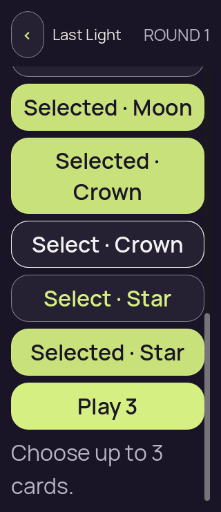</a> | **Three cards selected; fourth choice rejected with count-only feedback — large text** Godot 4.7.2 desktop 3D, Compatibility renderer Original: [02a-selection-limit.png](large-text/02a-selection-limit.png) 320 × 740 px; text 2×; seed 2 SHA-256: <code>64e3d68154a18ffa722076170804d2b875e7437272ccac4e17f4cf5adb57fa58</code> [Original diagnostics](large-text/02a-selection-limit.json) Static seed-2 recipient-safe authority input; no renderer action round-trip to the authority. Compact scrolled frames can lose current turn/rank context and the Show/Hide control. The 200% roster also wraps long names awkwardly; later versions retain these corrections separately. |
| <a href="large-text/02b-deselected-last.png">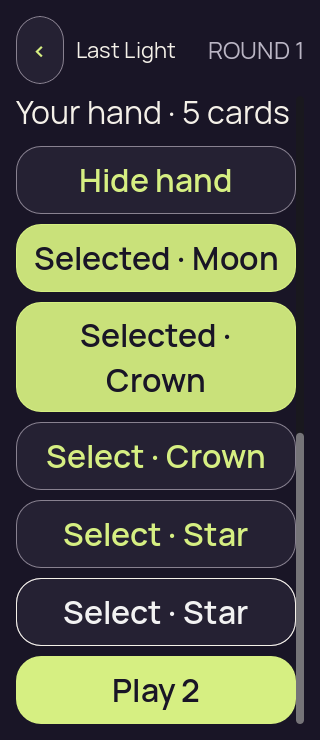</a> | **Last selected card deselected; two selections remain — large text** Godot 4.7.2 desktop 3D, Compatibility renderer Original: [02b-deselected-last.png](large-text/02b-deselected-last.png) 320 × 740 px; text 2×; seed 2 SHA-256: <code>b5924c9737689cc0dae95c7782089c7d62e9196ace57cedf085139b859b09689</code> [Original diagnostics](large-text/02b-deselected-last.json) Static seed-2 recipient-safe authority input; no renderer action round-trip to the authority. Compact scrolled frames can lose current turn/rank context and the Show/Hide control. The 200% roster also wraps long names awkwardly; later versions retain these corrections separately. |
| <a href="large-text/03-covered-again.png">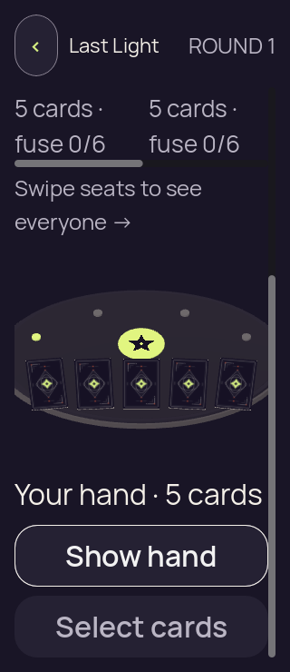</a> | **Hand covered with selection cleared — large text** Godot 4.7.2 desktop 3D, Compatibility renderer Original: [03-covered-again.png](large-text/03-covered-again.png) 320 × 740 px; text 2×; seed 2 SHA-256: <code>7ca1595f4dabdfc7d624613668ea4d778db1e860c039c6b96816be351fdbc0d9</code> [Original diagnostics](large-text/03-covered-again.json) Static seed-2 recipient-safe authority input; no renderer action round-trip to the authority. Compact scrolled frames can lose current turn/rank context and the Show/Hide control. The 200% roster also wraps long names awkwardly; later versions retain these corrections separately. |
|  | **Hand remains covered after simulated background and resume — large text** Godot 4.7.2 desktop 3D, Compatibility renderer Original: [04-resumed-covered.png](large-text/04-resumed-covered.png) 320 × 740 px; text 2×; seed 2 SHA-256: <code>665a7ff040f9988b04ae492883b2c7a9ea0e3b60db9b04b616b4c66e7d9681af</code> [Original diagnostics](large-text/04-resumed-covered.json) Static seed-2 recipient-safe authority input; no renderer action round-trip to the authority. Compact scrolled frames can lose current turn/rank context and the Show/Hide control. The 200% roster also wraps long names awkwardly; later versions retain these corrections separately. |

## Narrow

[Capture basis](narrow/capture-basis.json) · [Runtime log](narrow/runtime.log) · [Frozen input](narrow/fixture.json) · [Static report](narrow/report.json).

| Original image | Scenario and provenance |
| --- | --- |
|  | **Initial concealed own hand — narrow** Godot 4.7.2 desktop 3D, Compatibility renderer Original: [01-concealed.png](narrow/01-concealed.png) 320 × 568 px; text 1×; seed 2 SHA-256: <code>3e97da9cf2cd2405a5948fe4cfdd90984c7fe7b3d26fbcc75dd4c07b1e7a6636</code> [Original diagnostics](narrow/01-concealed.json) Static seed-2 recipient-safe authority input; no renderer action round-trip to the authority. Compact scrolled frames can lose current turn/rank context and the Show/Hide control. The 200% roster also wraps long names awkwardly; later versions retain these corrections separately. |
| <a href="narrow/02-revealed-selected.png">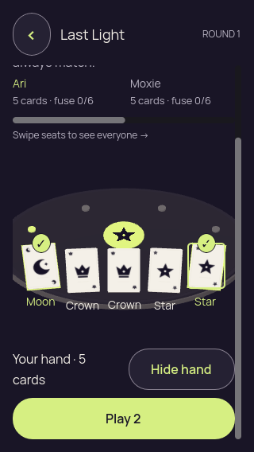</a> | **Own hand revealed with first and last cards selected — narrow** Godot 4.7.2 desktop 3D, Compatibility renderer Original: [02-revealed-selected.png](narrow/02-revealed-selected.png) 320 × 568 px; text 1×; seed 2 SHA-256: <code>ea68f8c1fa3237c2a3edf6310bbdd2ccc4267b9c0f7cff3ccb4e504a7dfb1ea2</code> [Original diagnostics](narrow/02-revealed-selected.json) Static seed-2 recipient-safe authority input; no renderer action round-trip to the authority. Compact scrolled frames can lose current turn/rank context and the Show/Hide control. The 200% roster also wraps long names awkwardly; later versions retain these corrections separately. |
| <a href="narrow/02a-selection-limit.png">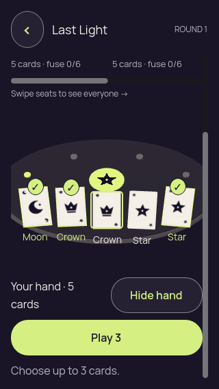</a> | **Three cards selected; fourth choice rejected with count-only feedback — narrow** Godot 4.7.2 desktop 3D, Compatibility renderer Original: [02a-selection-limit.png](narrow/02a-selection-limit.png) 320 × 568 px; text 1×; seed 2 SHA-256: <code>65620b611b70fea28172deec7c7afe2b41355c42d04885e51ff889d71edc44b1</code> [Original diagnostics](narrow/02a-selection-limit.json) Static seed-2 recipient-safe authority input; no renderer action round-trip to the authority. Compact scrolled frames can lose current turn/rank context and the Show/Hide control. The 200% roster also wraps long names awkwardly; later versions retain these corrections separately. |
| <a href="narrow/02b-deselected-last.png">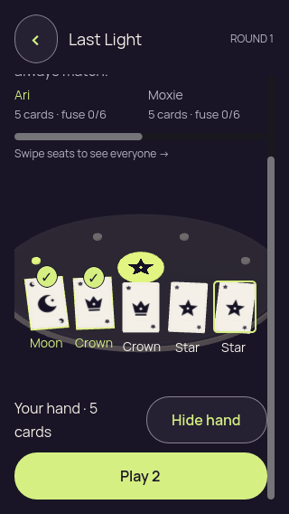</a> | **Last selected card deselected; two selections remain — narrow** Godot 4.7.2 desktop 3D, Compatibility renderer Original: [02b-deselected-last.png](narrow/02b-deselected-last.png) 320 × 568 px; text 1×; seed 2 SHA-256: <code>27a3fa81348d32fe45b1d8077bb6ebfc9feed73eee57d2360b464b50a6422f12</code> [Original diagnostics](narrow/02b-deselected-last.json) Static seed-2 recipient-safe authority input; no renderer action round-trip to the authority. Compact scrolled frames can lose current turn/rank context and the Show/Hide control. The 200% roster also wraps long names awkwardly; later versions retain these corrections separately. |
|  | **Hand covered with selection cleared — narrow** Godot 4.7.2 desktop 3D, Compatibility renderer Original: [03-covered-again.png](narrow/03-covered-again.png) 320 × 568 px; text 1×; seed 2 SHA-256: <code>20369e1625dafc7bf8a9237ec9001aa8fcb500f901d3ccf6d7428b726e32826b</code> [Original diagnostics](narrow/03-covered-again.json) Static seed-2 recipient-safe authority input; no renderer action round-trip to the authority. Compact scrolled frames can lose current turn/rank context and the Show/Hide control. The 200% roster also wraps long names awkwardly; later versions retain these corrections separately. |
|  | **Hand remains covered after simulated background and resume — narrow** Godot 4.7.2 desktop 3D, Compatibility renderer Original: [04-resumed-covered.png](narrow/04-resumed-covered.png) 320 × 568 px; text 1×; seed 2 SHA-256: <code>3e97da9cf2cd2405a5948fe4cfdd90984c7fe7b3d26fbcc75dd4c07b1e7a6636</code> [Original diagnostics](narrow/04-resumed-covered.json) Static seed-2 recipient-safe authority input; no renderer action round-trip to the authority. Compact scrolled frames can lose current turn/rank context and the Show/Hide control. The 200% roster also wraps long names awkwardly; later versions retain these corrections separately. |

## Observer

[Capture basis](observer/capture-basis.json) · [Runtime log](observer/runtime.log) · [Frozen input](observer/fixture.json) · [Static report](observer/report.json).

| Original image | Scenario and provenance |
| --- | --- |
| <a href="observer/01-concealed.png">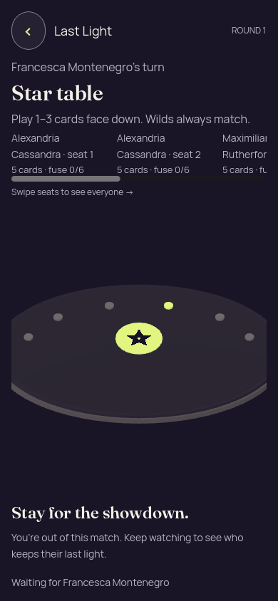</a> | **Unknown observer sees the public table without a private hand** Godot 4.7.2 desktop 3D, Compatibility renderer Original: [01-concealed.png](observer/01-concealed.png) 390 × 844 px; text 1×; seed 2 SHA-256: <code>2d4c127cfa8684bfb50954d985bf60e5c3e24cebe218d43cb9d4aaa694e294a8</code> [Original diagnostics](observer/01-concealed.json) Static seed-2 recipient-safe authority input; no renderer action round-trip to the authority. The unknown recipient has no private hand or gameplay actions. The v6 copy incorrectly says “You’re out of this match”; v7 corrects it to “You’re watching this match.” |

## One card hand

[Capture basis](one-card-hand/capture-basis.json) · [Runtime log](one-card-hand/runtime.log) · [Frozen input](one-card-hand/fixture.json) · [Static report](one-card-hand/report.json).

| Original image | Scenario and provenance |
| --- | --- |
|  | **Initial concealed own hand — one card hand** Godot 4.7.2 desktop 3D, Compatibility renderer Original: [01-concealed.png](one-card-hand/01-concealed.png) 390 × 844 px; text 1×; seed 2 SHA-256: <code>f3162abce3ec6380150f0326687f5da2b5cd99e71a0bbe130e1ec88b79310355</code> [Original diagnostics](one-card-hand/01-concealed.json) Static seed-2 recipient-safe authority input; no renderer action round-trip to the authority. Ari’s sole remaining card is Star. Its selected frame has one private face, two private labels including the selection marker, and one selected card. This v6 capture retains “1 cards” grammar. |
| <a href="one-card-hand/02-revealed-selected.png">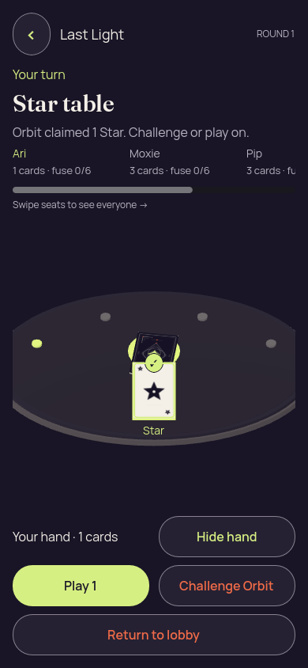</a> | **The sole remaining Star is selected** Godot 4.7.2 desktop 3D, Compatibility renderer Original: [02-revealed-selected.png](one-card-hand/02-revealed-selected.png) 390 × 844 px; text 1×; seed 2 SHA-256: <code>7b0ff47b55762cc70f0e6829d63eb9595f76c3ae3648c74038adc64ce14a70cf</code> [Original diagnostics](one-card-hand/02-revealed-selected.json) Static seed-2 recipient-safe authority input; no renderer action round-trip to the authority. Ari’s sole remaining card is Star. Its selected frame has one private face, two private labels including the selection marker, and one selected card. This v6 capture retains “1 cards” grammar. |
| <a href="one-card-hand/03-covered-again.png">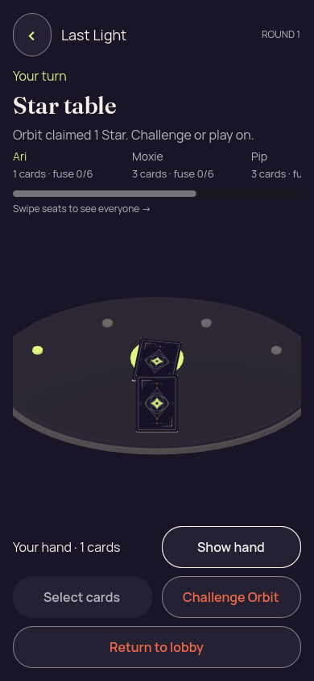</a> | **Hand covered with selection cleared — one card hand** Godot 4.7.2 desktop 3D, Compatibility renderer Original: [03-covered-again.png](one-card-hand/03-covered-again.png) 390 × 844 px; text 1×; seed 2 SHA-256: <code>d26a230986a94af2deebe9123b99809a70f242922b3f3dffff88d8b71e20fb74</code> [Original diagnostics](one-card-hand/03-covered-again.json) Static seed-2 recipient-safe authority input; no renderer action round-trip to the authority. Ari’s sole remaining card is Star. Its selected frame has one private face, two private labels including the selection marker, and one selected card. This v6 capture retains “1 cards” grammar. |
| <a href="one-card-hand/04-resumed-covered.png">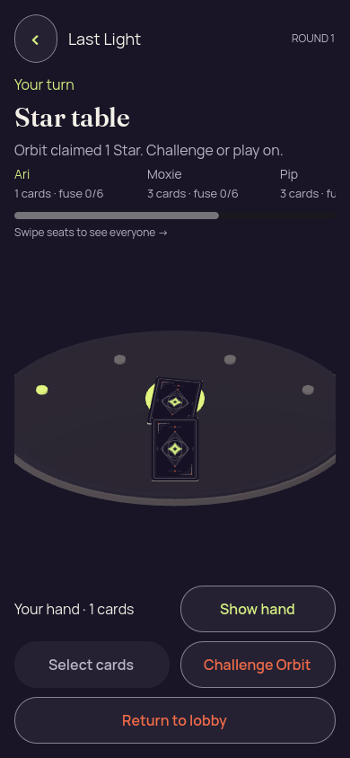</a> | **Hand remains covered after simulated background and resume — one card hand** Godot 4.7.2 desktop 3D, Compatibility renderer Original: [04-resumed-covered.png](one-card-hand/04-resumed-covered.png) 390 × 844 px; text 1×; seed 2 SHA-256: <code>f3162abce3ec6380150f0326687f5da2b5cd99e71a0bbe130e1ec88b79310355</code> [Original diagnostics](one-card-hand/04-resumed-covered.json) Static seed-2 recipient-safe authority input; no renderer action round-trip to the authority. Ari’s sole remaining card is Star. Its selected frame has one private face, two private labels including the selection marker, and one selected card. This v6 capture retains “1 cards” grammar. |

## Portrait

[Capture basis](portrait/capture-basis.json) · [Runtime log](portrait/runtime.log) · [Frozen input](portrait/fixture.json) · [Static report](portrait/report.json).

| Original image | Scenario and provenance |
| --- | --- |
|  | **Initial concealed own hand — portrait** Godot 4.7.2 desktop 3D, Compatibility renderer Original: [01-concealed.png](portrait/01-concealed.png) 390 × 844 px; text 1×; seed 2 SHA-256: <code>9b31edd4d8a07d0353e4732c5676f0e76b4fc536e193cc804e3f85ce52e51b9f</code> [Original diagnostics](portrait/01-concealed.json) Static seed-2 recipient-safe authority input; no renderer action round-trip to the authority. |
|  | **Own hand revealed with first and last cards selected — portrait** Godot 4.7.2 desktop 3D, Compatibility renderer Original: [02-revealed-selected.png](portrait/02-revealed-selected.png) 390 × 844 px; text 1×; seed 2 SHA-256: <code>81ed93be5c09cb651fa182601adaebc6d4df7625623650ab37599bed886d825b</code> [Original diagnostics](portrait/02-revealed-selected.json) Static seed-2 recipient-safe authority input; no renderer action round-trip to the authority. |
|  | **Three cards selected; fourth choice rejected with count-only feedback — portrait** Godot 4.7.2 desktop 3D, Compatibility renderer Original: [02a-selection-limit.png](portrait/02a-selection-limit.png) 390 × 844 px; text 1×; seed 2 SHA-256: <code>298fd444896c0ba7351436507993f82c00583531eb2d52016d63b55fd1a66ee4</code> [Original diagnostics](portrait/02a-selection-limit.json) Static seed-2 recipient-safe authority input; no renderer action round-trip to the authority. |
|  | **Last selected card deselected; two selections remain — portrait** Godot 4.7.2 desktop 3D, Compatibility renderer Original: [02b-deselected-last.png](portrait/02b-deselected-last.png) 390 × 844 px; text 1×; seed 2 SHA-256: <code>cb137e7569d79e796589b36404f8a81f8c310dd806d410751d0d4f44fd67fc0a</code> [Original diagnostics](portrait/02b-deselected-last.json) Static seed-2 recipient-safe authority input; no renderer action round-trip to the authority. |
| <a href="portrait/03-covered-again.png">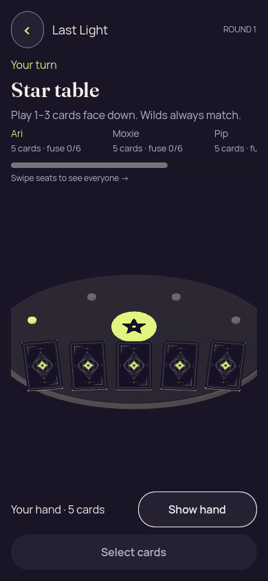</a> | **Hand covered with selection cleared — portrait** Godot 4.7.2 desktop 3D, Compatibility renderer Original: [03-covered-again.png](portrait/03-covered-again.png) 390 × 844 px; text 1×; seed 2 SHA-256: <code>7cfb096aac1acb5315bfe842bbfa0b9ad1a20cfb7589e4c8a7ade3555388401d</code> [Original diagnostics](portrait/03-covered-again.json) Static seed-2 recipient-safe authority input; no renderer action round-trip to the authority. |
|  | **Hand remains covered after simulated background and resume — portrait** Godot 4.7.2 desktop 3D, Compatibility renderer Original: [04-resumed-covered.png](portrait/04-resumed-covered.png) 390 × 844 px; text 1×; seed 2 SHA-256: <code>9b31edd4d8a07d0353e4732c5676f0e76b4fc536e193cc804e3f85ce52e51b9f</code> [Original diagnostics](portrait/04-resumed-covered.json) Static seed-2 recipient-safe authority input; no renderer action round-trip to the authority. |

## Six long names

[Capture basis](six-long-names/capture-basis.json) · [Runtime log](six-long-names/runtime.log) · [Frozen input](six-long-names/fixture.json) · [Static report](six-long-names/report.json).

| Original image | Scenario and provenance |
| --- | --- |
| <a href="six-long-names/01-concealed.png">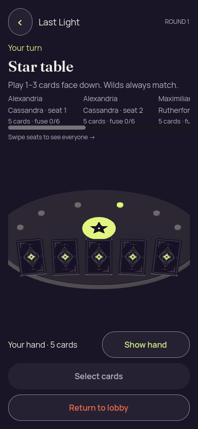</a> | **Initial concealed own hand — six long names** Godot 4.7.2 desktop 3D, Compatibility renderer Original: [01-concealed.png](six-long-names/01-concealed.png) 390 × 844 px; text 1×; seed 2 SHA-256: <code>36fa148ac097f84fdefaebbd1d958cd1139a13971e77243faf1ca901d6383d15</code> [Original diagnostics](six-long-names/01-concealed.json) Static seed-2 recipient-safe authority input; no renderer action round-trip to the authority. |
|  | **Own hand revealed with first and last cards selected — six long names** Godot 4.7.2 desktop 3D, Compatibility renderer Original: [02-revealed-selected.png](six-long-names/02-revealed-selected.png) 390 × 844 px; text 1×; seed 2 SHA-256: <code>69eeb7d9d8e4abed3757a8e1c9a315cad91840c8b71d84eb857afcdea0cbd9f2</code> [Original diagnostics](six-long-names/02-revealed-selected.json) Static seed-2 recipient-safe authority input; no renderer action round-trip to the authority. |
| <a href="six-long-names/02a-selection-limit.png">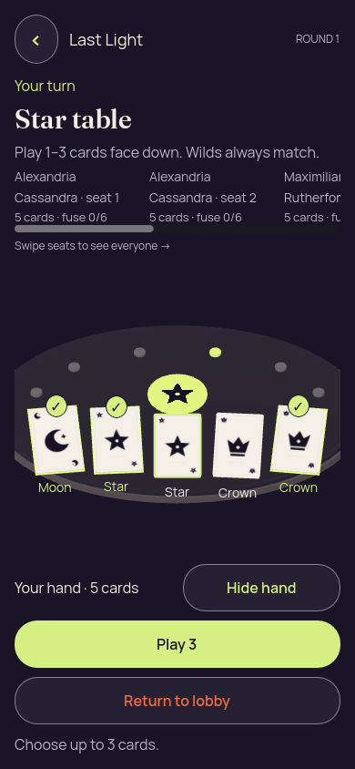</a> | **Three cards selected; fourth choice rejected with count-only feedback — six long names** Godot 4.7.2 desktop 3D, Compatibility renderer Original: [02a-selection-limit.png](six-long-names/02a-selection-limit.png) 390 × 844 px; text 1×; seed 2 SHA-256: <code>0f58c1859229b90c174e9a1633a484a349e049d01a2b403decec105042727960</code> [Original diagnostics](six-long-names/02a-selection-limit.json) Static seed-2 recipient-safe authority input; no renderer action round-trip to the authority. |
| <a href="six-long-names/02b-deselected-last.png">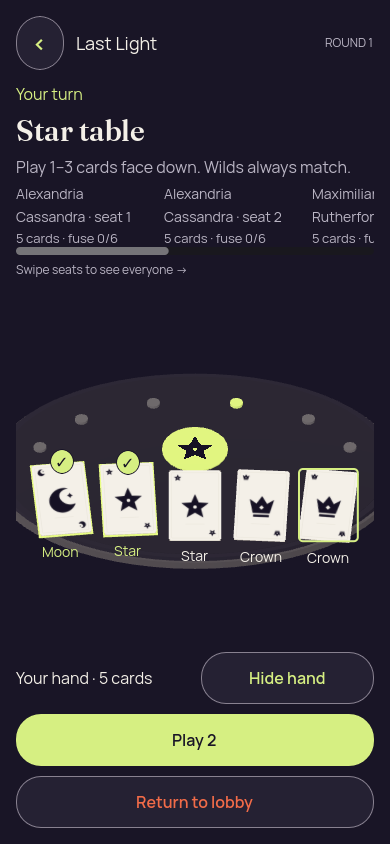</a> | **Last selected card deselected; two selections remain — six long names** Godot 4.7.2 desktop 3D, Compatibility renderer Original: [02b-deselected-last.png](six-long-names/02b-deselected-last.png) 390 × 844 px; text 1×; seed 2 SHA-256: <code>8457df1f804e14f4210e40162f6389a1bd01effc14d72d695556a99f301666bc</code> [Original diagnostics](six-long-names/02b-deselected-last.json) Static seed-2 recipient-safe authority input; no renderer action round-trip to the authority. |
| <a href="six-long-names/03-covered-again.png">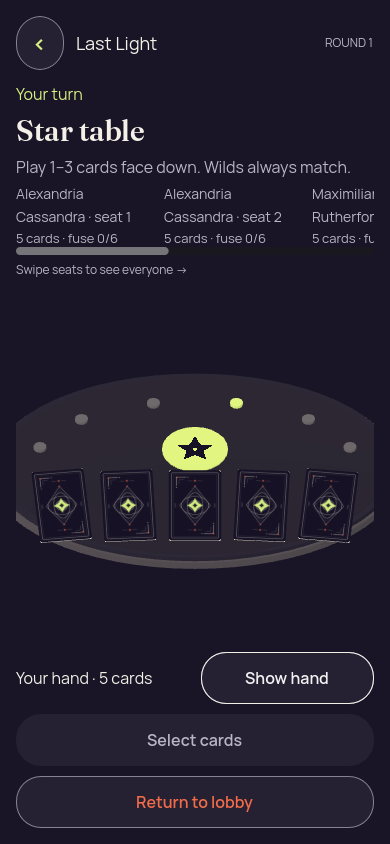</a> | **Hand covered with selection cleared — six long names** Godot 4.7.2 desktop 3D, Compatibility renderer Original: [03-covered-again.png](six-long-names/03-covered-again.png) 390 × 844 px; text 1×; seed 2 SHA-256: <code>ca2212bad2181ccba7630bd5dda562f15cf4a15b5d8e5f616a03301a1882478c</code> [Original diagnostics](six-long-names/03-covered-again.json) Static seed-2 recipient-safe authority input; no renderer action round-trip to the authority. |
|  | **Hand remains covered after simulated background and resume — six long names** Godot 4.7.2 desktop 3D, Compatibility renderer Original: [04-resumed-covered.png](six-long-names/04-resumed-covered.png) 390 × 844 px; text 1×; seed 2 SHA-256: <code>36fa148ac097f84fdefaebbd1d958cd1139a13971e77243faf1ca901d6383d15</code> [Original diagnostics](six-long-names/04-resumed-covered.json) Static seed-2 recipient-safe authority input; no renderer action round-trip to the authority. |
| <a href="six-long-names/05-lobby-confirmation.png">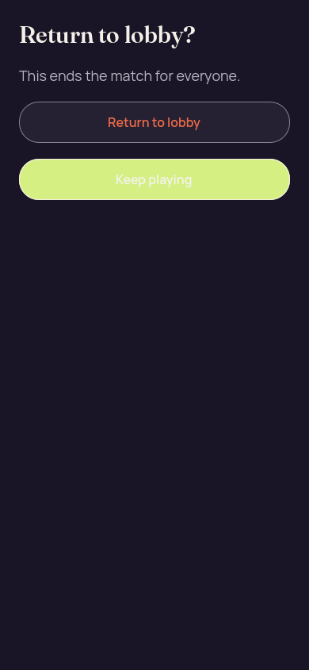</a> | **Return-to-lobby consequence and both choices — six long names** Godot 4.7.2 desktop 3D, Compatibility renderer Original: [05-lobby-confirmation.png](six-long-names/05-lobby-confirmation.png) 390 × 844 px; text 1×; seed 2 SHA-256: <code>52f7d4836a82818f05efdaa959f45238f5584a77794b1859178fbdb16d1b67d5</code> [Original diagnostics](six-long-names/05-lobby-confirmation.json) Static seed-2 recipient-safe authority input; no renderer action round-trip to the authority. Both choices fit, but focused Keep playing uses low-contrast white text on citron. The later v7/v10 originals retain the corrected dark label. |

## Six long names large text

[Capture basis](six-long-names-large-text/capture-basis.json) · [Runtime log](six-long-names-large-text/runtime.log) · [Frozen input](six-long-names-large-text/fixture.json) · [Static report](six-long-names-large-text/report.json).

| Original image | Scenario and provenance |
| --- | --- |
|  | **Initial concealed own hand — six long names large text** Godot 4.7.2 desktop 3D, Compatibility renderer Original: [01-concealed.png](six-long-names-large-text/01-concealed.png) 320 × 740 px; text 2×; seed 2 SHA-256: <code>82c4fad5f01fc1edec817307b136f0ca80276acb7c93ed1096e58fe9389c7f82</code> [Original diagnostics](six-long-names-large-text/01-concealed.json) Static seed-2 recipient-safe authority input; no renderer action round-trip to the authority. Compact scrolled frames can lose current turn/rank context and the Show/Hide control. The 200% roster also wraps long names awkwardly; later versions retain these corrections separately. |
| <a href="six-long-names-large-text/02-revealed-selected.png">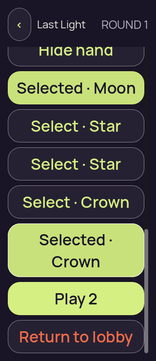</a> | **Own hand revealed with first and last cards selected — six long names large text** Godot 4.7.2 desktop 3D, Compatibility renderer Original: [02-revealed-selected.png](six-long-names-large-text/02-revealed-selected.png) 320 × 740 px; text 2×; seed 2 SHA-256: <code>6262dc2baea3342cb5421390dd84a92f9c5b425004104d54bb06733837aeafc4</code> [Original diagnostics](six-long-names-large-text/02-revealed-selected.json) Static seed-2 recipient-safe authority input; no renderer action round-trip to the authority. Compact scrolled frames can lose current turn/rank context and the Show/Hide control. The 200% roster also wraps long names awkwardly; later versions retain these corrections separately. |
| <a href="six-long-names-large-text/02a-selection-limit.png">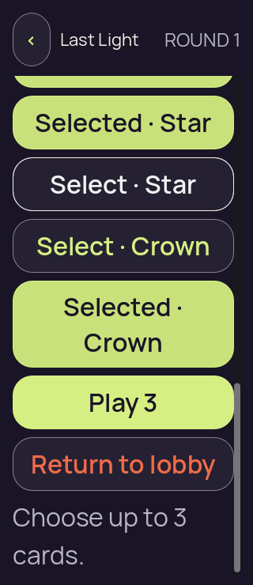</a> | **Three cards selected; fourth choice rejected with count-only feedback — six long names large text** Godot 4.7.2 desktop 3D, Compatibility renderer Original: [02a-selection-limit.png](six-long-names-large-text/02a-selection-limit.png) 320 × 740 px; text 2×; seed 2 SHA-256: <code>37b43ee6e79aca3ad3189049ad4181a6530ca002afb898ade0a77909e0dd37d7</code> [Original diagnostics](six-long-names-large-text/02a-selection-limit.json) Static seed-2 recipient-safe authority input; no renderer action round-trip to the authority. Compact scrolled frames can lose current turn/rank context and the Show/Hide control. The 200% roster also wraps long names awkwardly; later versions retain these corrections separately. |
| <a href="six-long-names-large-text/02b-deselected-last.png">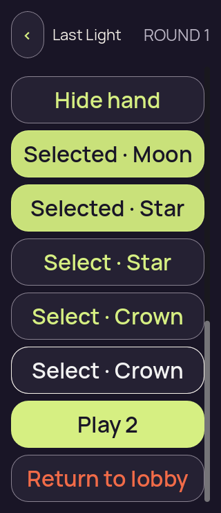</a> | **Last selected card deselected; two selections remain — six long names large text** Godot 4.7.2 desktop 3D, Compatibility renderer Original: [02b-deselected-last.png](six-long-names-large-text/02b-deselected-last.png) 320 × 740 px; text 2×; seed 2 SHA-256: <code>e24d8a2474cca08f79a09df00bfbd5774aa15ed0548389a5bfa8ad1de6ba89b7</code> [Original diagnostics](six-long-names-large-text/02b-deselected-last.json) Static seed-2 recipient-safe authority input; no renderer action round-trip to the authority. Compact scrolled frames can lose current turn/rank context and the Show/Hide control. The 200% roster also wraps long names awkwardly; later versions retain these corrections separately. |
| <a href="six-long-names-large-text/03-covered-again.png">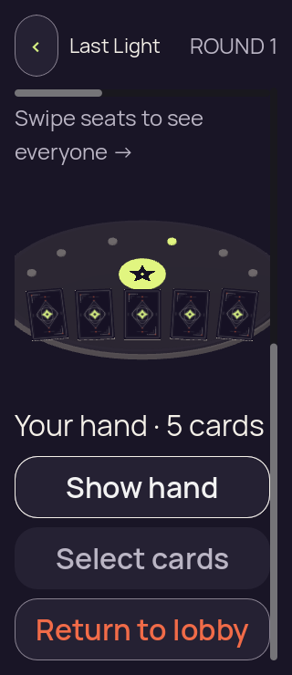</a> | **Hand covered with selection cleared — six long names large text** Godot 4.7.2 desktop 3D, Compatibility renderer Original: [03-covered-again.png](six-long-names-large-text/03-covered-again.png) 320 × 740 px; text 2×; seed 2 SHA-256: <code>9724ed00ff22fd8efa152fd53ebfc857346e07bef2c57015b597768fac9a2071</code> [Original diagnostics](six-long-names-large-text/03-covered-again.json) Static seed-2 recipient-safe authority input; no renderer action round-trip to the authority. Compact scrolled frames can lose current turn/rank context and the Show/Hide control. The 200% roster also wraps long names awkwardly; later versions retain these corrections separately. |
| <a href="six-long-names-large-text/04-resumed-covered.png">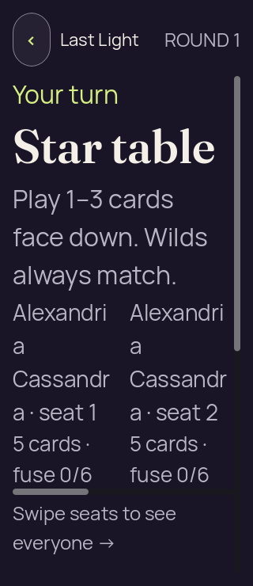</a> | **Hand remains covered after simulated background and resume — six long names large text** Godot 4.7.2 desktop 3D, Compatibility renderer Original: [04-resumed-covered.png](six-long-names-large-text/04-resumed-covered.png) 320 × 740 px; text 2×; seed 2 SHA-256: <code>82c4fad5f01fc1edec817307b136f0ca80276acb7c93ed1096e58fe9389c7f82</code> [Original diagnostics](six-long-names-large-text/04-resumed-covered.json) Static seed-2 recipient-safe authority input; no renderer action round-trip to the authority. Compact scrolled frames can lose current turn/rank context and the Show/Hide control. The 200% roster also wraps long names awkwardly; later versions retain these corrections separately. |
| <a href="six-long-names-large-text/05-lobby-confirmation.png">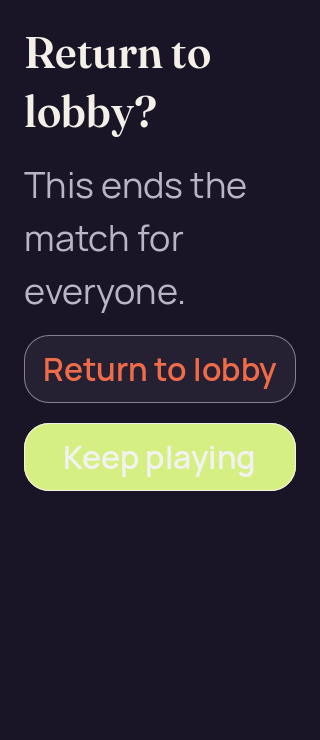</a> | **Return-to-lobby consequence and both choices — six long names large text** Godot 4.7.2 desktop 3D, Compatibility renderer Original: [05-lobby-confirmation.png](six-long-names-large-text/05-lobby-confirmation.png) 320 × 740 px; text 2×; seed 2 SHA-256: <code>b3ae831d14544cef8981a514fd9195511fa3f6ded14172923fe4dd07660c3822</code> [Original diagnostics](six-long-names-large-text/05-lobby-confirmation.json) Static seed-2 recipient-safe authority input; no renderer action round-trip to the authority. Compact scrolled frames can lose current turn/rank context and the Show/Hide control. The 200% roster also wraps long names awkwardly; later versions retain these corrections separately. Both choices fit, but focused Keep playing uses low-contrast white text on citron. The later v7/v10 originals retain the corrected dark label. |

## Three card proof

[Capture basis](three-card-proof/capture-basis.json) · [Runtime log](three-card-proof/runtime.log) · [Frozen input](three-card-proof/fixture.json) · [Static report](three-card-proof/report.json).

| Original image | Scenario and provenance |
| --- | --- |
| <a href="three-card-proof/01-concealed.png">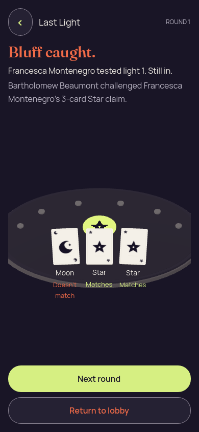</a> | **Three-card Star claim: Moon, Star and Star revealed** Godot 4.7.2 desktop 3D, Compatibility renderer Original: [01-concealed.png](three-card-proof/01-concealed.png) 390 × 844 px; text 1×; seed 2 SHA-256: <code>b248e0bffa56c752f700e7ca5806cc16b7be71718fc8d5d069b4ec5230d974c5</code> [Original diagnostics](three-card-proof/01-concealed.json) Static seed-2 recipient-safe authority input; no renderer action round-trip to the authority. Bartholomew Beaumont challenged Francesca Montenegro’s three-card Star claim. Moon does not match; both Stars match. Francesca used light 1 and remains in. |

## Truthful rank

[Capture basis](truthful-rank/capture-basis.json) · [Runtime log](truthful-rank/runtime.log) · [Frozen input](truthful-rank/fixture.json) · [Static report](truthful-rank/report.json).

| Original image | Scenario and provenance |
| --- | --- |
| <a href="truthful-rank/01-concealed.png">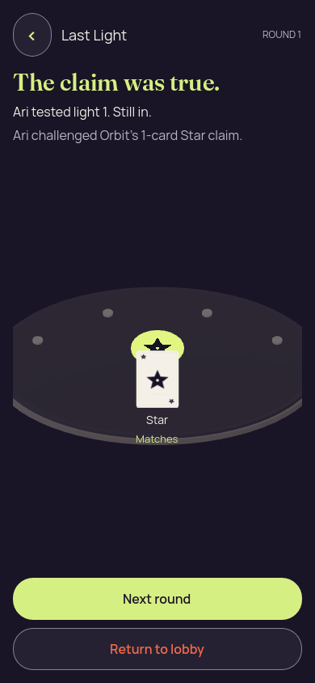</a> | **Truthful Star claim; challenger Ari remains in** Godot 4.7.2 desktop 3D, Compatibility renderer Original: [01-concealed.png](truthful-rank/01-concealed.png) 390 × 844 px; text 1×; seed 1 SHA-256: <code>bbdcf0c1c545da5ae6e03df3817c8e7b126b0bee7fd51f4348d0bce1bff7d1d2</code> [Original diagnostics](truthful-rank/01-concealed.json) Static seed-1 recipient-safe authority input; no renderer action round-trip to the authority. Public Star matches Orbit’s Star claim. Challenger Ari used light 1 and remains in. |

## Truthful wild

[Capture basis](truthful-wild/capture-basis.json) · [Runtime log](truthful-wild/runtime.log) · [Frozen input](truthful-wild/fixture.json) · [Static report](truthful-wild/report.json).

| Original image | Scenario and provenance |
| --- | --- |
| <a href="truthful-wild/01-concealed.png">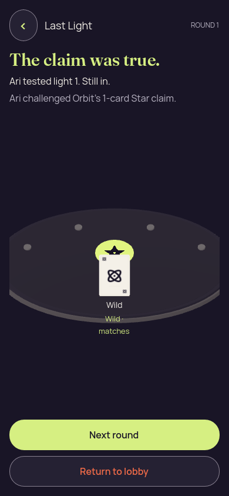</a> | **Truthful Wild proof; challenger Ari remains in** Godot 4.7.2 desktop 3D, Compatibility renderer Original: [01-concealed.png](truthful-wild/01-concealed.png) 390 × 844 px; text 1×; seed 1 SHA-256: <code>a35a7cdd345caa37a8d7d0f8404ee01041d0d4528c8f0010bd68a99658d7156d</code> [Original diagnostics](truthful-wild/01-concealed.json) Static seed-1 recipient-safe authority input; no renderer action round-trip to the authority. Public Wild matches Orbit’s Star claim. Challenger Ari used light 1 and remains in. |

## Winner

[Capture basis](winner/capture-basis.json) · [Runtime log](winner/runtime.log) · [Frozen input](winner/fixture.json) · [Static report](winner/report.json).

| Original image | Scenario and provenance |
| --- | --- |
|  | **Orbit wins with the final Crown claim and Moon proof explained** Godot 4.7.2 desktop 3D, Compatibility renderer Original: [01-concealed.png](winner/01-concealed.png) 390 × 844 px; text 1×; seed 2 SHA-256: <code>9c05677e9419a61112c638769c78a8644fdf7049452dbea28b1c228792f5ae93</code> [Original diagnostics](winner/01-concealed.json) Static seed-2 recipient-safe authority input; no renderer action round-trip to the authority. Orbit wins round 14 after challenging Moxie’s one-card Crown claim. Public Moon does not match; Moxie used light 4 and burned out. The Crown emblem and final explanation are visible. |

## Zero card hand

[Capture basis](zero-card-hand/capture-basis.json) · [Runtime log](zero-card-hand/runtime.log) · [Frozen input](zero-card-hand/fixture.json) · [Static report](zero-card-hand/report.json).

| Original image | Scenario and provenance |
| --- | --- |
| <a href="zero-card-hand/01-concealed.png">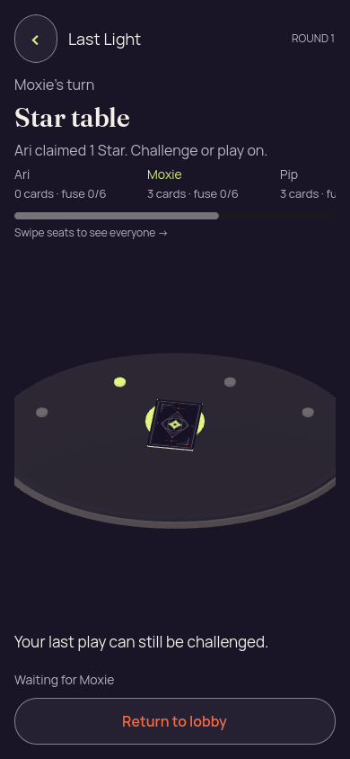</a> | **Ari’s empty hand while Moxie takes the turn** Godot 4.7.2 desktop 3D, Compatibility renderer Original: [01-concealed.png](zero-card-hand/01-concealed.png) 390 × 844 px; text 1×; seed 2 SHA-256: <code>88eb44d64c20e39f3501516088dba54af9c1b21d755acc56fc085e97d88d2195</code> [Original diagnostics](zero-card-hand/01-concealed.json) Static seed-2 recipient-safe authority input; no renderer action round-trip to the authority. Ari has an empty hand while Moxie takes the turn. There is no Reveal control; the last play can still be challenged. |
