# Godot 3D — v7, persistent context and retained six-seat failure

[All screenshot collections](../../README.md)

**Evidence status:** Ten cases pass; the six-name 200% case exits 1 after selection moves a card outside the scroll area. Header context, compact Show/Hide, observer copy, forced-challenge copy and focused confirmation contrast improve. Every initial and later frame is retained.

All 40 original PNGs are retained, including repeated image states and failed attempts. Every unique state was visually inspected; original bytes, filenames, dimensions and source locations are preserved. Inline thumbnails open the original file.

Actual Godot `4.7.2.stable.official.ed1daf0bf`, OpenGL Compatibility / Mesa llvmpipe / Xvfb. Each case retains its original command, exit code, source-before/source-after hashes, exact `fixture.json`, diagnostics and runtime log. The recorded 11-file [source subset](source/) is frozen and independently matches every corresponding receipt. No exact capture commit was recorded. Passing logs contain no engine/script errors; failing logs retain their original errors.

[Authority provenance](edge-authority-provenance.json) and [the edge-fixture manifest](edge-fixture-manifest.json) retain case-specific seeds and source recipes. Truthful-rank, truthful-Wild and burnout fixtures use seed 1; other edge inputs and the canonical launch/winner inputs use seed 2. The first five imported cases preserve deterministic recipes and verified safe bytes, without claiming original per-operation logs; new cases record real authority operations. Original fixture tooling is retained with [2D iteration 09](../../godot-2d-iteration-09/README.md). Every copied fixture hash and the authority-provenance hash were independently verified.

The reports exercise local reveal, selection, fourth-card rejection, deselection, cover and simulated foreground changes where applicable. A lobby check emits its final local intent without an authority round-trip. All retained concealed, covered, resumed, confirmation and public-outcome frames have zero private faces, labels and selection. Ordinary selected frames have five private faces, seven labels including selection markers and two selections; maximum-selection frames have five faces, eight labels and three selections. Emulated drag frames have five faces/labels and zero selection. The v6 one-card selected frame has one face, two labels and one selection.

Reported hand-target rectangles have at least 48-pixel dimensions and no mutual overlap in the reviewed diagnostics. That full-rectangle check does not make every target visible at every scroll position: v7/v8 containment failures and other offscreen cards remain explicit. These desktop checks do not establish native touch, accessibility, OS lifecycle/snapshot privacy, device performance or LAN behavior.

## Eliminated history

[Capture basis](eliminated-history/capture-basis.json) · [Runtime log](eliminated-history/runtime.log) · [Frozen input](eliminated-history/fixture.json) · [Static report](eliminated-history/report.json).

| Original image | Scenario and provenance |
| --- | --- |
| <a href="eliminated-history/01-concealed.png">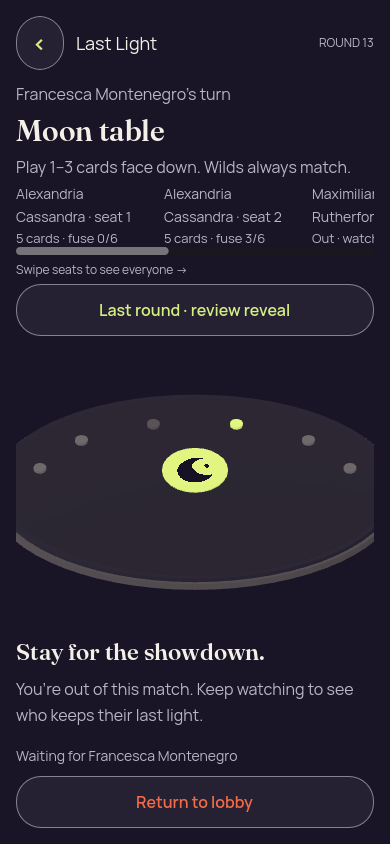</a> | **Initial concealed own hand — eliminated history** Godot 4.7.2 desktop 3D, Compatibility renderer Original: [01-concealed.png](eliminated-history/01-concealed.png) 390 × 844 px; text 1×; seed 2 SHA-256: <code>acdcfd019b014ea1c575ad8a8659f6819394085cdcc87eabc8eea795a490303b</code> [Original diagnostics](eliminated-history/01-concealed.json) Static seed-2 recipient-safe authority input; no renderer action round-trip to the authority. The recipient remains a spectator in round 13. The history frame keeps current Moon/turn context above a clearly labeled round-12 public reveal. |
| <a href="eliminated-history/04a-previous-round.png">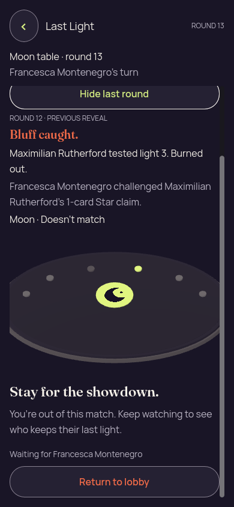</a> | **Previous-round public proof while the current round continues — eliminated history** Godot 4.7.2 desktop 3D, Compatibility renderer Original: [04a-previous-round.png](eliminated-history/04a-previous-round.png) 390 × 844 px; text 1×; seed 2 SHA-256: <code>79aa85901174876e5c1b39d82272ef80eb10eac449583d7577299f4cadc8a638</code> [Original diagnostics](eliminated-history/04a-previous-round.json) Static seed-2 recipient-safe authority input; no renderer action round-trip to the authority. The recipient remains a spectator in round 13. The history frame keeps current Moon/turn context above a clearly labeled round-12 public reveal. |

## Forced challenge

[Capture basis](forced-challenge/capture-basis.json) · [Runtime log](forced-challenge/runtime.log) · [Frozen input](forced-challenge/fixture.json) · [Static report](forced-challenge/report.json).

| Original image | Scenario and provenance |
| --- | --- |
| <a href="forced-challenge/01-concealed.png">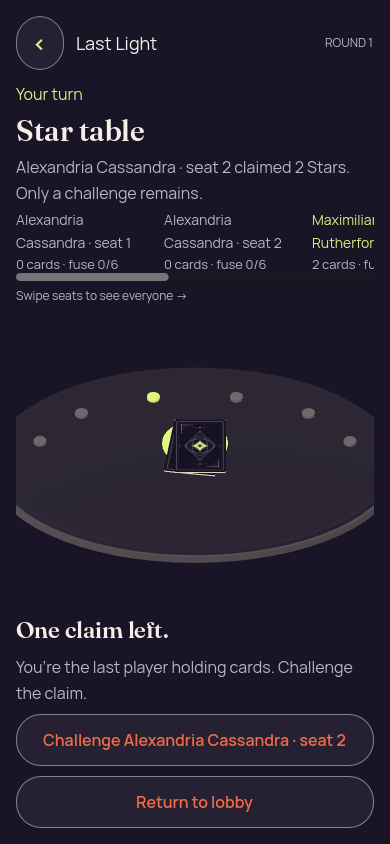</a> | **Last player holding cards must challenge the outstanding claim** Godot 4.7.2 desktop 3D, Compatibility renderer Original: [01-concealed.png](forced-challenge/01-concealed.png) 390 × 844 px; text 1×; seed 2 SHA-256: <code>e4e51c5a2a26764a944540696e0d957718544ca67ba30765901e11de9faff6dc</code> [Original diagnostics](forced-challenge/01-concealed.json) Static seed-2 recipient-safe authority input; no renderer action round-trip to the authority. Only a challenge is allowed. The top copy now correctly says “Only a challenge remains.” |

## Landscape

[Capture basis](landscape/capture-basis.json) · [Runtime log](landscape/runtime.log) · [Frozen input](landscape/fixture.json) · [Static report](landscape/report.json).

| Original image | Scenario and provenance |
| --- | --- |
| <a href="landscape/01-concealed.png">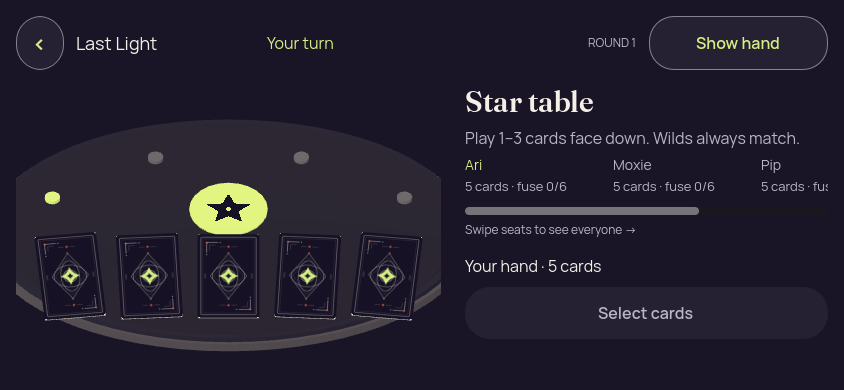</a> | **Initial concealed own hand — landscape** Godot 4.7.2 desktop 3D, Compatibility renderer Original: [01-concealed.png](landscape/01-concealed.png) 844 × 390 px; text 1×; seed 2 SHA-256: <code>cd5f896d4fa87983000f1c405568ba821b45e734821fc437c0efb8ac677c39c7</code> [Original diagnostics](landscape/01-concealed.json) Static seed-2 recipient-safe authority input; no renderer action round-trip to the authority. |
| <a href="landscape/02-revealed-selected.png">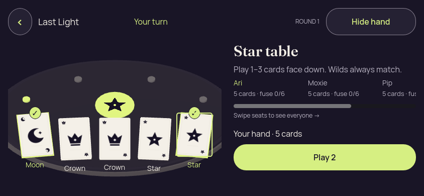</a> | **Own hand revealed with first and last cards selected — landscape** Godot 4.7.2 desktop 3D, Compatibility renderer Original: [02-revealed-selected.png](landscape/02-revealed-selected.png) 844 × 390 px; text 1×; seed 2 SHA-256: <code>76266760558ca99f3d24eaa024b0545eccb6f82fee25c7a368204c2985c0765e</code> [Original diagnostics](landscape/02-revealed-selected.json) Static seed-2 recipient-safe authority input; no renderer action round-trip to the authority. |
|  | **Three cards selected; fourth choice rejected with count-only feedback — landscape** Godot 4.7.2 desktop 3D, Compatibility renderer Original: [02a-selection-limit.png](landscape/02a-selection-limit.png) 844 × 390 px; text 1×; seed 2 SHA-256: <code>6d464a90bfdd693f434341670cace29e6f50d01e72ae1cff6253742f9adb08f6</code> [Original diagnostics](landscape/02a-selection-limit.json) Static seed-2 recipient-safe authority input; no renderer action round-trip to the authority. |
| <a href="landscape/02b-deselected-last.png">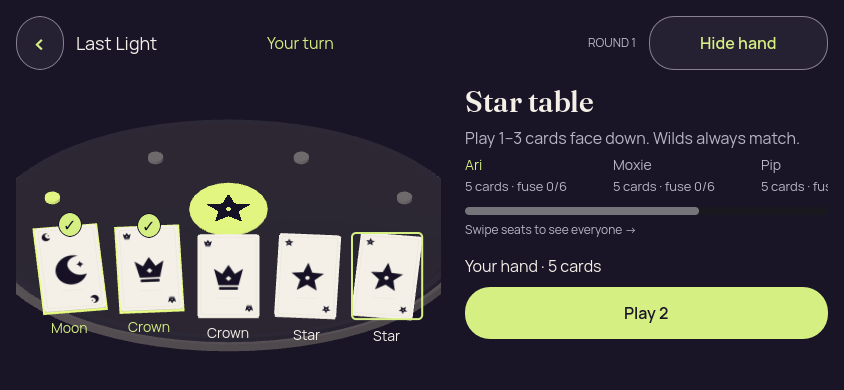</a> | **Last selected card deselected; two selections remain — landscape** Godot 4.7.2 desktop 3D, Compatibility renderer Original: [02b-deselected-last.png](landscape/02b-deselected-last.png) 844 × 390 px; text 1×; seed 2 SHA-256: <code>f8128351693224852c38e2fc0f6d6843cd4bc44a719990d63893737cf666057d</code> [Original diagnostics](landscape/02b-deselected-last.json) Static seed-2 recipient-safe authority input; no renderer action round-trip to the authority. |
|  | **Hand covered with selection cleared — landscape** Godot 4.7.2 desktop 3D, Compatibility renderer Original: [03-covered-again.png](landscape/03-covered-again.png) 844 × 390 px; text 1×; seed 2 SHA-256: <code>ed1a2ac010c57a9cc0deb7a35540406b80265a5d883fe8557fb31c0f51eff14c</code> [Original diagnostics](landscape/03-covered-again.json) Static seed-2 recipient-safe authority input; no renderer action round-trip to the authority. |
|  | **Hand remains covered after simulated background and resume — landscape** Godot 4.7.2 desktop 3D, Compatibility renderer Original: [04-resumed-covered.png](landscape/04-resumed-covered.png) 844 × 390 px; text 1×; seed 2 SHA-256: <code>cd5f896d4fa87983000f1c405568ba821b45e734821fc437c0efb8ac677c39c7</code> [Original diagnostics](landscape/04-resumed-covered.json) Static seed-2 recipient-safe authority input; no renderer action round-trip to the authority. |

## Large text touch

[Capture basis](large-text-touch/capture-basis.json) · [Runtime log](large-text-touch/runtime.log) · [Frozen input](large-text-touch/fixture.json) · [Static report](large-text-touch/report.json) · [Gesture trace](large-text-touch/gesture-diagnostics.json).

| Original image | Scenario and provenance |
| --- | --- |
|  | **Initial concealed own hand — large text touch** Godot 4.7.2 desktop 3D, Compatibility renderer Original: [01-concealed.png](large-text-touch/01-concealed.png) 320 × 740 px; text 2×; seed 2 SHA-256: <code>6a569fb1a10ee77293fbdaadd153e27c3f8b1100ddd2abcb67c8b483bbb72a36</code> [Original diagnostics](large-text-touch/01-concealed.json) Static seed-2 recipient-safe authority input; no renderer action round-trip to the authority. Emulated vertical card drag: offset 208 → 532, selection 0, event count unchanged at the initial Ready (1). The frozen check also exercises a two-pixel-motion tap, fourth-card rejection and deselection. |
| <a href="large-text-touch/01a-emulated-touch-drag.png">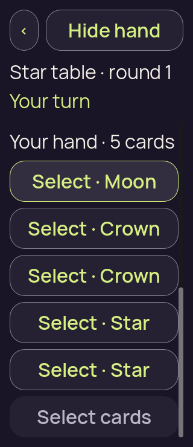</a> | **Revealed hand after emulated vertical drag, with no selection — large text touch** Godot 4.7.2 desktop 3D, Compatibility renderer Original: [01a-emulated-touch-drag.png](large-text-touch/01a-emulated-touch-drag.png) 320 × 740 px; text 2×; seed 2 SHA-256: <code>390537cb4e4065fdfbbc01a788d1d9ce1428034401d3d6cde69e15b2ce627ea3</code> [Original diagnostics](large-text-touch/01a-emulated-touch-drag.json) Static seed-2 recipient-safe authority input; no renderer action round-trip to the authority. Emulated vertical card drag: offset 208 → 532, selection 0, event count unchanged at the initial Ready (1). The frozen check also exercises a two-pixel-motion tap, fourth-card rejection and deselection. |
| <a href="large-text-touch/02-revealed-selected.png">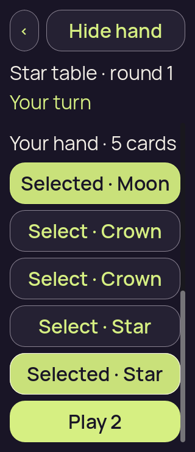</a> | **Own hand revealed with first and last cards selected — large text touch** Godot 4.7.2 desktop 3D, Compatibility renderer Original: [02-revealed-selected.png](large-text-touch/02-revealed-selected.png) 320 × 740 px; text 2×; seed 2 SHA-256: <code>460738b0aa34eccc5d22bbf54c66b5d7f902e8602592bf043b4959b07ded3e67</code> [Original diagnostics](large-text-touch/02-revealed-selected.json) Static seed-2 recipient-safe authority input; no renderer action round-trip to the authority. Emulated vertical card drag: offset 208 → 532, selection 0, event count unchanged at the initial Ready (1). The frozen check also exercises a two-pixel-motion tap, fourth-card rejection and deselection. |
| <a href="large-text-touch/02a-selection-limit.png">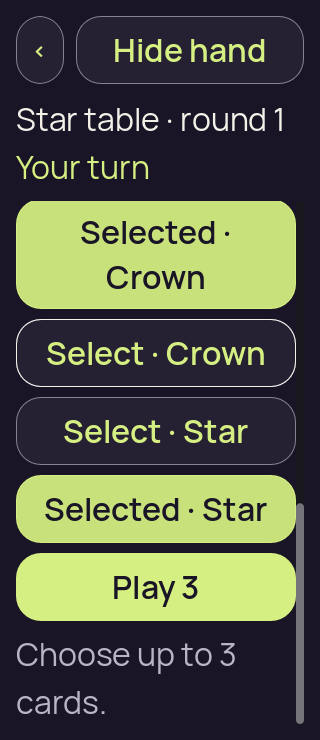</a> | **Three cards selected; fourth choice rejected with count-only feedback — large text touch** Godot 4.7.2 desktop 3D, Compatibility renderer Original: [02a-selection-limit.png](large-text-touch/02a-selection-limit.png) 320 × 740 px; text 2×; seed 2 SHA-256: <code>71debbe83779bf1edadbae28ea1030d420c3edfa53a66c6668d5176e965dc120</code> [Original diagnostics](large-text-touch/02a-selection-limit.json) Static seed-2 recipient-safe authority input; no renderer action round-trip to the authority. Emulated vertical card drag: offset 208 → 532, selection 0, event count unchanged at the initial Ready (1). The frozen check also exercises a two-pixel-motion tap, fourth-card rejection and deselection. |
| <a href="large-text-touch/02b-deselected-last.png">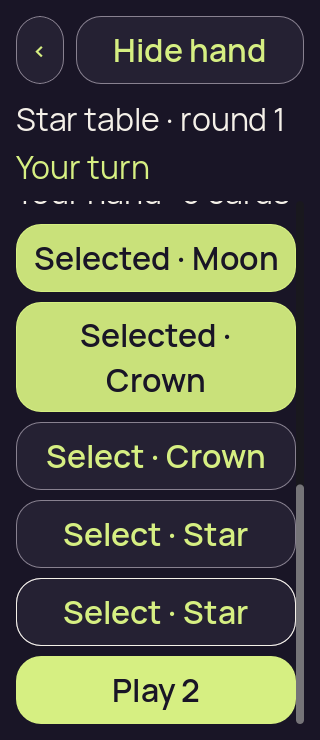</a> | **Last selected card deselected; two selections remain — large text touch** Godot 4.7.2 desktop 3D, Compatibility renderer Original: [02b-deselected-last.png](large-text-touch/02b-deselected-last.png) 320 × 740 px; text 2×; seed 2 SHA-256: <code>f49d273d8425877c339db584b70c5317514ff89b2f6382b938f6d7b24efa8e7d</code> [Original diagnostics](large-text-touch/02b-deselected-last.json) Static seed-2 recipient-safe authority input; no renderer action round-trip to the authority. Emulated vertical card drag: offset 208 → 532, selection 0, event count unchanged at the initial Ready (1). The frozen check also exercises a two-pixel-motion tap, fourth-card rejection and deselection. |
| <a href="large-text-touch/03-covered-again.png">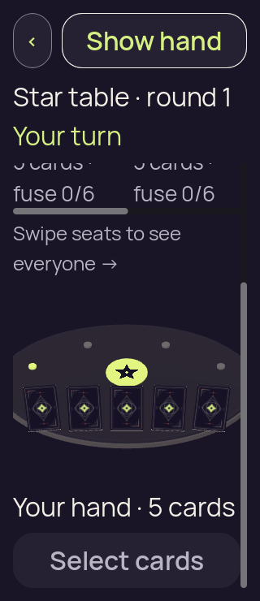</a> | **Hand covered with selection cleared — large text touch** Godot 4.7.2 desktop 3D, Compatibility renderer Original: [03-covered-again.png](large-text-touch/03-covered-again.png) 320 × 740 px; text 2×; seed 2 SHA-256: <code>d5a89b5e69e65c82b500a55816f7852b8e1562819d6534c59847b7fb6a04a6d2</code> [Original diagnostics](large-text-touch/03-covered-again.json) Static seed-2 recipient-safe authority input; no renderer action round-trip to the authority. Emulated vertical card drag: offset 208 → 532, selection 0, event count unchanged at the initial Ready (1). The frozen check also exercises a two-pixel-motion tap, fourth-card rejection and deselection. |
| <a href="large-text-touch/04-resumed-covered.png">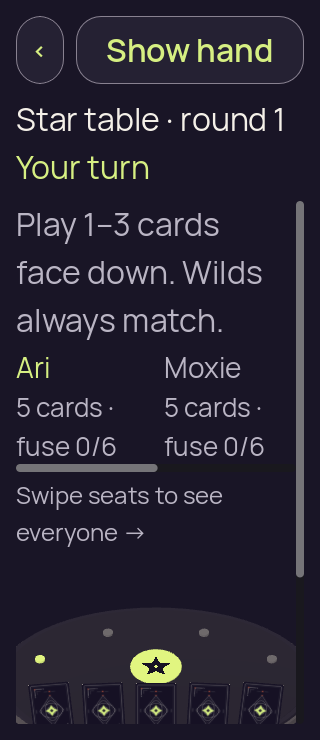</a> | **Hand remains covered after simulated background and resume — large text touch** Godot 4.7.2 desktop 3D, Compatibility renderer Original: [04-resumed-covered.png](large-text-touch/04-resumed-covered.png) 320 × 740 px; text 2×; seed 2 SHA-256: <code>6a569fb1a10ee77293fbdaadd153e27c3f8b1100ddd2abcb67c8b483bbb72a36</code> [Original diagnostics](large-text-touch/04-resumed-covered.json) Static seed-2 recipient-safe authority input; no renderer action round-trip to the authority. Emulated vertical card drag: offset 208 → 532, selection 0, event count unchanged at the initial Ready (1). The frozen check also exercises a two-pixel-motion tap, fourth-card rejection and deselection. |

## Narrow touch

[Capture basis](narrow-touch/capture-basis.json) · [Runtime log](narrow-touch/runtime.log) · [Frozen input](narrow-touch/fixture.json) · [Static report](narrow-touch/report.json) · [Gesture trace](narrow-touch/gesture-diagnostics.json).

| Original image | Scenario and provenance |
| --- | --- |
|  | **Initial concealed own hand — narrow touch** Godot 4.7.2 desktop 3D, Compatibility renderer Original: [01-concealed.png](narrow-touch/01-concealed.png) 320 × 568 px; text 1×; seed 2 SHA-256: <code>720130a029e51e9dd3cb611e641929d394921de69bdc42eaf3852e8b67e9a539</code> [Original diagnostics](narrow-touch/01-concealed.json) Static seed-2 recipient-safe authority input; no renderer action round-trip to the authority. Emulated vertical card drag: offset 0 → 74, selection 0, event count unchanged at the initial Ready (1). The frozen check also exercises a two-pixel-motion tap, fourth-card rejection and deselection. |
| <a href="narrow-touch/01a-emulated-touch-drag.png">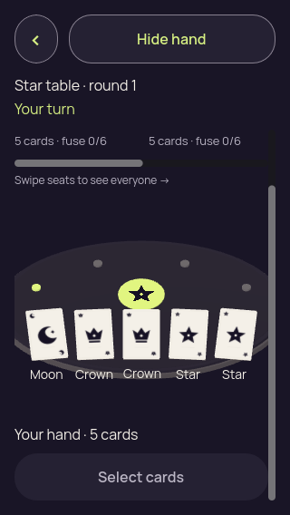</a> | **Revealed hand after emulated vertical drag, with no selection — narrow touch** Godot 4.7.2 desktop 3D, Compatibility renderer Original: [01a-emulated-touch-drag.png](narrow-touch/01a-emulated-touch-drag.png) 320 × 568 px; text 1×; seed 2 SHA-256: <code>c94175a8c08056377f6a8b356ef3847c9c0d7af237fc6d0fcd1e335403e27d6e</code> [Original diagnostics](narrow-touch/01a-emulated-touch-drag.json) Static seed-2 recipient-safe authority input; no renderer action round-trip to the authority. Emulated vertical card drag: offset 0 → 74, selection 0, event count unchanged at the initial Ready (1). The frozen check also exercises a two-pixel-motion tap, fourth-card rejection and deselection. |
| <a href="narrow-touch/02-revealed-selected.png">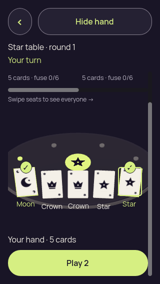</a> | **Own hand revealed with first and last cards selected — narrow touch** Godot 4.7.2 desktop 3D, Compatibility renderer Original: [02-revealed-selected.png](narrow-touch/02-revealed-selected.png) 320 × 568 px; text 1×; seed 2 SHA-256: <code>c750118142f29fc4ee0b814b19485e7be5a3181471ac3d33a23235ff3d51671e</code> [Original diagnostics](narrow-touch/02-revealed-selected.json) Static seed-2 recipient-safe authority input; no renderer action round-trip to the authority. Emulated vertical card drag: offset 0 → 74, selection 0, event count unchanged at the initial Ready (1). The frozen check also exercises a two-pixel-motion tap, fourth-card rejection and deselection. |
| <a href="narrow-touch/02a-selection-limit.png">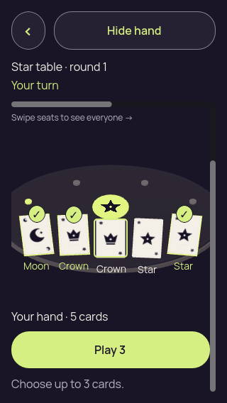</a> | **Three cards selected; fourth choice rejected with count-only feedback — narrow touch** Godot 4.7.2 desktop 3D, Compatibility renderer Original: [02a-selection-limit.png](narrow-touch/02a-selection-limit.png) 320 × 568 px; text 1×; seed 2 SHA-256: <code>925fddc45a711375d0e1fc67cdf237e4cba0ef1f3a4188995b2c9c01cf8bea47</code> [Original diagnostics](narrow-touch/02a-selection-limit.json) Static seed-2 recipient-safe authority input; no renderer action round-trip to the authority. Emulated vertical card drag: offset 0 → 74, selection 0, event count unchanged at the initial Ready (1). The frozen check also exercises a two-pixel-motion tap, fourth-card rejection and deselection. |
|  | **Last selected card deselected; two selections remain — narrow touch** Godot 4.7.2 desktop 3D, Compatibility renderer Original: [02b-deselected-last.png](narrow-touch/02b-deselected-last.png) 320 × 568 px; text 1×; seed 2 SHA-256: <code>e27b90d77a47d6773e412ec108d50441b37705105eacdfc4d4adb3ac252c0a06</code> [Original diagnostics](narrow-touch/02b-deselected-last.json) Static seed-2 recipient-safe authority input; no renderer action round-trip to the authority. Emulated vertical card drag: offset 0 → 74, selection 0, event count unchanged at the initial Ready (1). The frozen check also exercises a two-pixel-motion tap, fourth-card rejection and deselection. |
| <a href="narrow-touch/03-covered-again.png">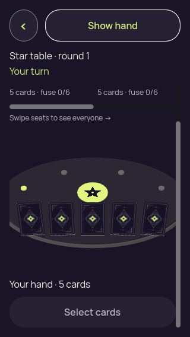</a> | **Hand covered with selection cleared — narrow touch** Godot 4.7.2 desktop 3D, Compatibility renderer Original: [03-covered-again.png](narrow-touch/03-covered-again.png) 320 × 568 px; text 1×; seed 2 SHA-256: <code>b47cb68d287c9ea7bda86cd39895d47590053357173c4ae62e1a20cc3a155698</code> [Original diagnostics](narrow-touch/03-covered-again.json) Static seed-2 recipient-safe authority input; no renderer action round-trip to the authority. Emulated vertical card drag: offset 0 → 74, selection 0, event count unchanged at the initial Ready (1). The frozen check also exercises a two-pixel-motion tap, fourth-card rejection and deselection. |
| <a href="narrow-touch/04-resumed-covered.png">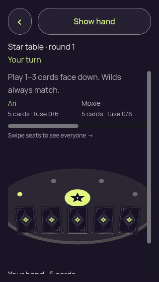</a> | **Hand remains covered after simulated background and resume — narrow touch** Godot 4.7.2 desktop 3D, Compatibility renderer Original: [04-resumed-covered.png](narrow-touch/04-resumed-covered.png) 320 × 568 px; text 1×; seed 2 SHA-256: <code>720130a029e51e9dd3cb611e641929d394921de69bdc42eaf3852e8b67e9a539</code> [Original diagnostics](narrow-touch/04-resumed-covered.json) Static seed-2 recipient-safe authority input; no renderer action round-trip to the authority. Emulated vertical card drag: offset 0 → 74, selection 0, event count unchanged at the initial Ready (1). The frozen check also exercises a two-pixel-motion tap, fourth-card rejection and deselection. |

## Observer

[Capture basis](observer/capture-basis.json) · [Runtime log](observer/runtime.log) · [Frozen input](observer/fixture.json) · [Static report](observer/report.json).

| Original image | Scenario and provenance |
| --- | --- |
| <a href="observer/01-concealed.png">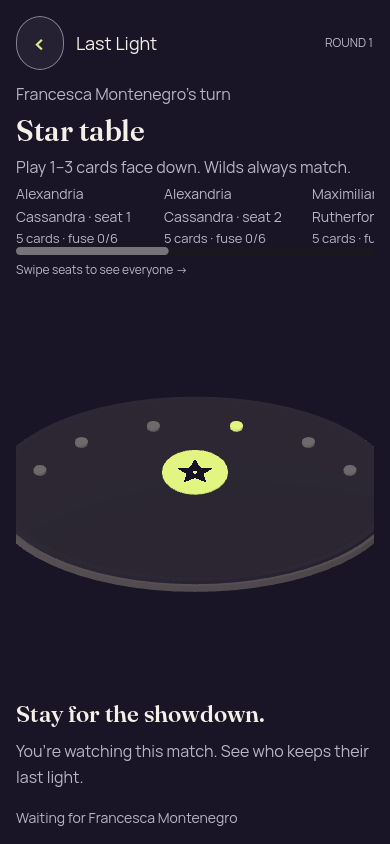</a> | **Unknown observer sees the public table without a private hand** Godot 4.7.2 desktop 3D, Compatibility renderer Original: [01-concealed.png](observer/01-concealed.png) 390 × 844 px; text 1×; seed 2 SHA-256: <code>e016669f25db3781662456bec71c466eb7796886cc87296575632c3f2b864591</code> [Original diagnostics](observer/01-concealed.json) Static seed-2 recipient-safe authority input; no renderer action round-trip to the authority. The unknown recipient has no private hand or gameplay actions. The observer copy now says “You’re watching this match.” |

## Portrait

[Capture basis](portrait/capture-basis.json) · [Runtime log](portrait/runtime.log) · [Frozen input](portrait/fixture.json) · [Static report](portrait/report.json).

| Original image | Scenario and provenance |
| --- | --- |
|  | **Initial concealed own hand — portrait** Godot 4.7.2 desktop 3D, Compatibility renderer Original: [01-concealed.png](portrait/01-concealed.png) 390 × 844 px; text 1×; seed 2 SHA-256: <code>9b31edd4d8a07d0353e4732c5676f0e76b4fc536e193cc804e3f85ce52e51b9f</code> [Original diagnostics](portrait/01-concealed.json) Static seed-2 recipient-safe authority input; no renderer action round-trip to the authority. |
| <a href="portrait/02-revealed-selected.png">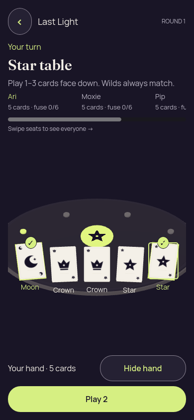</a> | **Own hand revealed with first and last cards selected — portrait** Godot 4.7.2 desktop 3D, Compatibility renderer Original: [02-revealed-selected.png](portrait/02-revealed-selected.png) 390 × 844 px; text 1×; seed 2 SHA-256: <code>81ed93be5c09cb651fa182601adaebc6d4df7625623650ab37599bed886d825b</code> [Original diagnostics](portrait/02-revealed-selected.json) Static seed-2 recipient-safe authority input; no renderer action round-trip to the authority. |
|  | **Three cards selected; fourth choice rejected with count-only feedback — portrait** Godot 4.7.2 desktop 3D, Compatibility renderer Original: [02a-selection-limit.png](portrait/02a-selection-limit.png) 390 × 844 px; text 1×; seed 2 SHA-256: <code>298fd444896c0ba7351436507993f82c00583531eb2d52016d63b55fd1a66ee4</code> [Original diagnostics](portrait/02a-selection-limit.json) Static seed-2 recipient-safe authority input; no renderer action round-trip to the authority. |
|  | **Last selected card deselected; two selections remain — portrait** Godot 4.7.2 desktop 3D, Compatibility renderer Original: [02b-deselected-last.png](portrait/02b-deselected-last.png) 390 × 844 px; text 1×; seed 2 SHA-256: <code>cb137e7569d79e796589b36404f8a81f8c310dd806d410751d0d4f44fd67fc0a</code> [Original diagnostics](portrait/02b-deselected-last.json) Static seed-2 recipient-safe authority input; no renderer action round-trip to the authority. |
|  | **Hand covered with selection cleared — portrait** Godot 4.7.2 desktop 3D, Compatibility renderer Original: [03-covered-again.png](portrait/03-covered-again.png) 390 × 844 px; text 1×; seed 2 SHA-256: <code>f8d7410cf64da58de7c8befaa020f795f1cae903028d5a09473826f0b45374a1</code> [Original diagnostics](portrait/03-covered-again.json) Static seed-2 recipient-safe authority input; no renderer action round-trip to the authority. |
|  | **Hand remains covered after simulated background and resume — portrait** Godot 4.7.2 desktop 3D, Compatibility renderer Original: [04-resumed-covered.png](portrait/04-resumed-covered.png) 390 × 844 px; text 1×; seed 2 SHA-256: <code>9b31edd4d8a07d0353e4732c5676f0e76b4fc536e193cc804e3f85ce52e51b9f</code> [Original diagnostics](portrait/04-resumed-covered.json) Static seed-2 recipient-safe authority input; no renderer action round-trip to the authority. |

## Six long names

[Capture basis](six-long-names/capture-basis.json) · [Runtime log](six-long-names/runtime.log) · [Frozen input](six-long-names/fixture.json) · [Static report](six-long-names/report.json).

| Original image | Scenario and provenance |
| --- | --- |
|  | **Initial concealed own hand — six long names** Godot 4.7.2 desktop 3D, Compatibility renderer Original: [01-concealed.png](six-long-names/01-concealed.png) 390 × 844 px; text 1×; seed 2 SHA-256: <code>36fa148ac097f84fdefaebbd1d958cd1139a13971e77243faf1ca901d6383d15</code> [Original diagnostics](six-long-names/01-concealed.json) Static seed-2 recipient-safe authority input; no renderer action round-trip to the authority. |
| <a href="six-long-names/02-revealed-selected.png">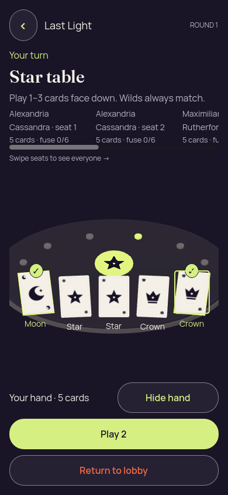</a> | **Own hand revealed with first and last cards selected — six long names** Godot 4.7.2 desktop 3D, Compatibility renderer Original: [02-revealed-selected.png](six-long-names/02-revealed-selected.png) 390 × 844 px; text 1×; seed 2 SHA-256: <code>69eeb7d9d8e4abed3757a8e1c9a315cad91840c8b71d84eb857afcdea0cbd9f2</code> [Original diagnostics](six-long-names/02-revealed-selected.json) Static seed-2 recipient-safe authority input; no renderer action round-trip to the authority. |
|  | **Three cards selected; fourth choice rejected with count-only feedback — six long names** Godot 4.7.2 desktop 3D, Compatibility renderer Original: [02a-selection-limit.png](six-long-names/02a-selection-limit.png) 390 × 844 px; text 1×; seed 2 SHA-256: <code>0f58c1859229b90c174e9a1633a484a349e049d01a2b403decec105042727960</code> [Original diagnostics](six-long-names/02a-selection-limit.json) Static seed-2 recipient-safe authority input; no renderer action round-trip to the authority. |
|  | **Last selected card deselected; two selections remain — six long names** Godot 4.7.2 desktop 3D, Compatibility renderer Original: [02b-deselected-last.png](six-long-names/02b-deselected-last.png) 390 × 844 px; text 1×; seed 2 SHA-256: <code>8457df1f804e14f4210e40162f6389a1bd01effc14d72d695556a99f301666bc</code> [Original diagnostics](six-long-names/02b-deselected-last.json) Static seed-2 recipient-safe authority input; no renderer action round-trip to the authority. |
| <a href="six-long-names/03-covered-again.png">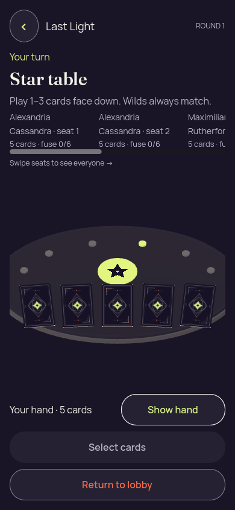</a> | **Hand covered with selection cleared — six long names** Godot 4.7.2 desktop 3D, Compatibility renderer Original: [03-covered-again.png](six-long-names/03-covered-again.png) 390 × 844 px; text 1×; seed 2 SHA-256: <code>839f45008bece5124f284ca1e37ef55ce5364ea1b549d0fbc7ff632f47fbf676</code> [Original diagnostics](six-long-names/03-covered-again.json) Static seed-2 recipient-safe authority input; no renderer action round-trip to the authority. |
|  | **Hand remains covered after simulated background and resume — six long names** Godot 4.7.2 desktop 3D, Compatibility renderer Original: [04-resumed-covered.png](six-long-names/04-resumed-covered.png) 390 × 844 px; text 1×; seed 2 SHA-256: <code>36fa148ac097f84fdefaebbd1d958cd1139a13971e77243faf1ca901d6383d15</code> [Original diagnostics](six-long-names/04-resumed-covered.json) Static seed-2 recipient-safe authority input; no renderer action round-trip to the authority. |
| <a href="six-long-names/05-lobby-confirmation.png">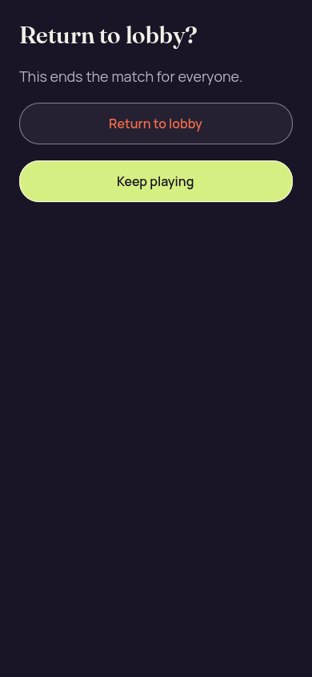</a> | **Return-to-lobby consequence and both choices — six long names** Godot 4.7.2 desktop 3D, Compatibility renderer Original: [05-lobby-confirmation.png](six-long-names/05-lobby-confirmation.png) 390 × 844 px; text 1×; seed 2 SHA-256: <code>4483aea40ad7bdf738c1dc10a7973ec308019786d28bdba286fca482ff3124f0</code> [Original diagnostics](six-long-names/05-lobby-confirmation.json) Static seed-2 recipient-safe authority input; no renderer action round-trip to the authority. |

## Six long names large text

[Capture basis](six-long-names-large-text/capture-basis.json) · [Runtime log](six-long-names-large-text/runtime.log) · [Frozen input](six-long-names-large-text/fixture.json).

| Original image | Scenario and provenance |
| --- | --- |
| <a href="six-long-names-large-text/01-concealed.png">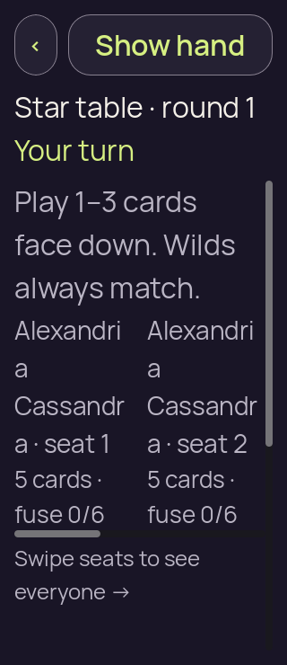</a> | **Initial concealed own hand — six long names large text** Godot 4.7.2 desktop 3D, Compatibility renderer Original: [01-concealed.png](six-long-names-large-text/01-concealed.png) 320 × 740 px; text 2×; seed 2 SHA-256: <code>4b7590624016eae5e1f01b45e03aa297f402d6933b4f84019b51591f3bbdcdd3</code> [Original diagnostics](six-long-names-large-text/01-concealed.json) Static seed-2 recipient-safe authority input; no renderer action round-trip to the authority. This case exits 1 when selection moves its focused card outside the visible scroll area; a passing suite is not claimed. |

## Winner

[Capture basis](winner/capture-basis.json) · [Runtime log](winner/runtime.log) · [Frozen input](winner/fixture.json) · [Static report](winner/report.json).

| Original image | Scenario and provenance |
| --- | --- |
|  | **Orbit wins with the final Crown claim and Moon proof explained** Godot 4.7.2 desktop 3D, Compatibility renderer Original: [01-concealed.png](winner/01-concealed.png) 390 × 844 px; text 1×; seed 2 SHA-256: <code>9c05677e9419a61112c638769c78a8644fdf7049452dbea28b1c228792f5ae93</code> [Original diagnostics](winner/01-concealed.json) Static seed-2 recipient-safe authority input; no renderer action round-trip to the authority. Orbit wins round 14 after challenging Moxie’s one-card Crown claim. Public Moon does not match; Moxie used light 4 and burned out. The Crown emblem and final explanation are visible. |

## Winner large text

[Capture basis](winner-large-text/capture-basis.json) · [Runtime log](winner-large-text/runtime.log) · [Frozen input](winner-large-text/fixture.json) · [Static report](winner-large-text/report.json).

| Original image | Scenario and provenance |
| --- | --- |
| <a href="winner-large-text/01-concealed.png">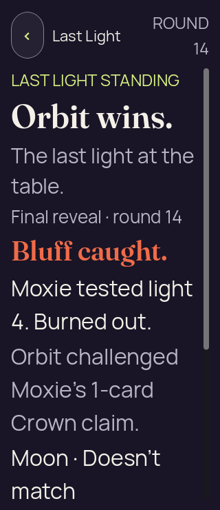</a> | **Orbit’s win and final challenge explanation at 200% text** Godot 4.7.2 desktop 3D, Compatibility renderer Original: [01-concealed.png](winner-large-text/01-concealed.png) 320 × 740 px; text 2×; seed 2 SHA-256: <code>daada6b3e01eed8be15b85d6ec97da95b25aeeb79b869ffb4a0c8f84175c0a47</code> [Original diagnostics](winner-large-text/01-concealed.json) Static seed-2 recipient-safe authority input; no renderer action round-trip to the authority. At 200% text, Orbit’s win and the complete named Crown-claim/Moon-proof explanation are visible; the physical table and return action continue below the initial viewport. |
