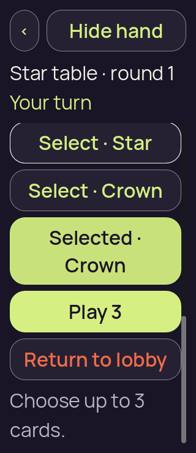

# Godot 3D — v8, retained 200% card-containment failure

[All screenshot collections](../../README.md)

**Evidence status:** The single 200% six-name run exits 1 after fourth-choice feedback leaves the focused card two pixels above the scroll clip. Initial, selected and failure frames are retained; this is not a passing suite.

All 3 original PNGs are retained, including repeated image states and failed attempts. Every unique state was visually inspected; original bytes, filenames, dimensions and source locations are preserved. Inline thumbnails open the original file.

Actual Godot `4.7.2.stable.official.ed1daf0bf`, OpenGL Compatibility / Mesa llvmpipe / Xvfb. Each case retains its original command, exit code, source-before/source-after hashes, exact `fixture.json`, diagnostics and runtime log. The recorded 8-file [source subset](source/) is frozen and independently matches every corresponding receipt. No exact capture commit was recorded. Passing logs contain no engine/script errors; failing logs retain their original errors.

The per-case fixture copies match the original hashes recorded in the receipts. The input recipes and seed provenance are retained with the [final v10 collection](../../godot-3d-20260910-v10/README.md); all cases here use seed 2.

The reports exercise local reveal, selection, fourth-card rejection, deselection, cover and simulated foreground changes where applicable. A lobby check emits its final local intent without an authority round-trip. All retained concealed, covered, resumed, confirmation and public-outcome frames have zero private faces, labels and selection. Ordinary selected frames have five private faces, seven labels including selection markers and two selections; maximum-selection frames have five faces, eight labels and three selections. Emulated drag frames have five faces/labels and zero selection. The v6 one-card selected frame has one face, two labels and one selection.

Reported hand-target rectangles have at least 48-pixel dimensions and no mutual overlap in the reviewed diagnostics. That full-rectangle check does not make every target visible at every scroll position: v7/v8 containment failures and other offscreen cards remain explicit. These desktop checks do not establish native touch, accessibility, OS lifecycle/snapshot privacy, device performance or LAN behavior.

## Six long names large text

[Capture basis](six-long-names-large-text/capture-basis.json) · [Runtime log](six-long-names-large-text/runtime.log) · [Frozen input](six-long-names-large-text/fixture.json).

| Original image | Scenario and provenance |
| --- | --- |
|  | **Initial concealed own hand — six long names large text** Godot 4.7.2 desktop 3D, Compatibility renderer Original: [01-concealed.png](six-long-names-large-text/01-concealed.png) 320 × 740 px; text 2×; seed 2 SHA-256: <code>d2a19f623dcb036640582f1ad9fe7d7eb9ae2226fe167b160132f70237d8208c</code> [Original diagnostics](six-long-names-large-text/01-concealed.json) Static seed-2 recipient-safe authority input; no renderer action round-trip to the authority. This case exits 1 when selection moves its focused card outside the visible scroll area; a passing suite is not claimed. |
|  | **Own hand revealed with first and last cards selected — six long names large text** Godot 4.7.2 desktop 3D, Compatibility renderer Original: [02-revealed-selected.png](six-long-names-large-text/02-revealed-selected.png) 320 × 740 px; text 2×; seed 2 SHA-256: <code>047a4ed11344904ac5df65f2e13b45207b71b24dc60dfdaf9c5587003a0dc449</code> [Original diagnostics](six-long-names-large-text/02-revealed-selected.json) Static seed-2 recipient-safe authority input; no renderer action round-trip to the authority. This case exits 1 when selection moves its focused card outside the visible scroll area; a passing suite is not claimed. |
|  | **Failure after fourth-choice feedback clips the focused Star control by two pixels** Godot 4.7.2 desktop 3D, Compatibility renderer Original: [failure.png](six-long-names-large-text/failure.png) 320 × 740 px; text 2×; seed 2 SHA-256: <code>81839551bef5d7b83ef44586c474b452cd855b673f7fc75c2f867d11ebf68de1</code> [Original diagnostics](six-long-names-large-text/failure-diagnostics.json) Static seed-2 recipient-safe authority input; no renderer action round-trip to the authority. This case exits 1 when selection moves its focused card outside the visible scroll area; a passing suite is not claimed. Focused card 2 occupies [16,199,280,68] against clip [16,201,288,523], leaving 66 of its 68 vertical pixels visible. Three selections remain; the run also logs failure to establish the checked maximum-selection state. |
