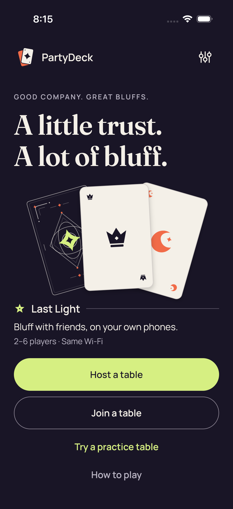
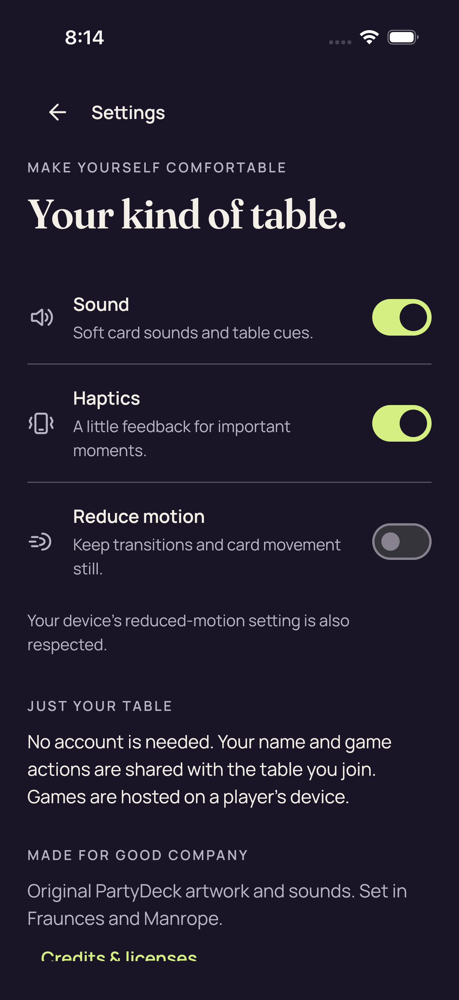
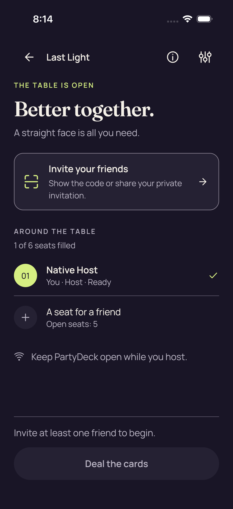
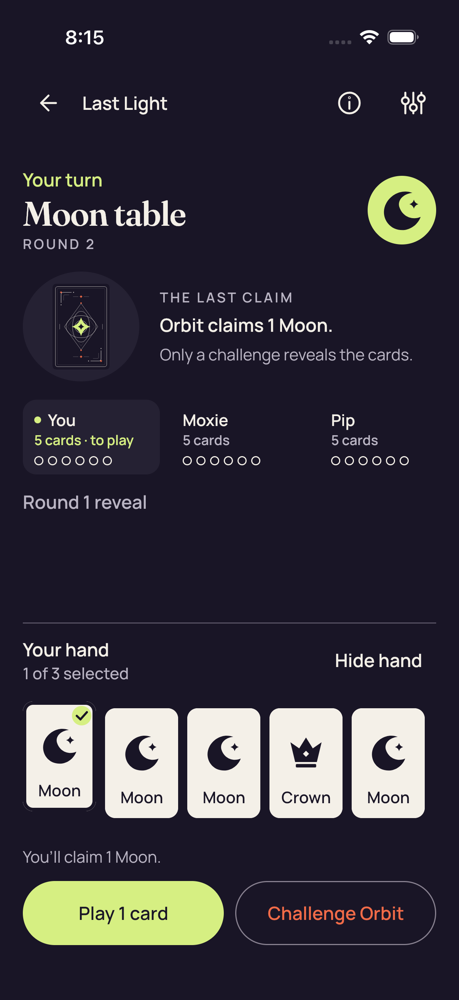
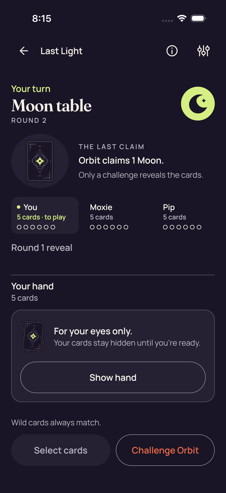
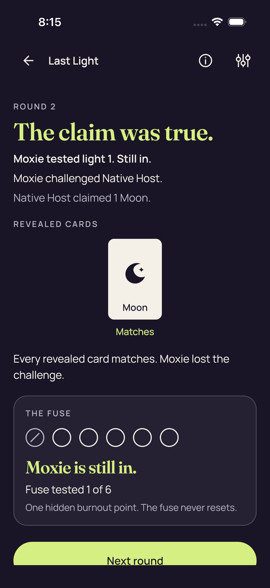

# iOS — CI 34398824935

[All screenshot collections](../README.md)

Xcode 26.4.1; iOS SDK 26.4; iPhone 17 simulator runtime 26.4.1; 1206 × 2622 pixels. Original exported UUID filenames are retained and mapped to the attachment names below.

**Evidence status:** Three UI tests passed with zero failures. All eight attachment entries have isAssociatedWithFailure=false. Native large text, keyboard layout, VoiceOver, lifecycle snapshots and preference persistence are not qualified by this run.

Source revision: [`987d380967149d80d8ba5761e206ecdf7386af25`](https://github.com/Apdelrahman1911/PartyDeck/commit/987d380967149d80d8ba5761e206ecdf7386af25).

CI run: [34398824935](https://github.com/Apdelrahman1911/PartyDeck/actions/runs/34398824935).

Original source directory: `/tmp/partydeck-toolchain-review/integrated-ios-34398824935/ios-reports-and-simulator-app/build/ci/ios/attachments`. This is an archival locator; use the repository links below to open the retained files.

Preserved receipts: [attachment-manifest.json](attachment-manifest.json).

Click any thumbnail for the full original PNG. Dimensions are pixels. Hashes identify the unedited original files.

| Original image | Scenario and provenance |
| --- | --- |
|  | **Home** iPhone 17 simulator, iOS runtime 26.4.1 Original: [A3A48608-FDBA-40BD-990B-1B6E2AF88199.png](../first-batch/ios/home.png) 1206 × 2622 px SHA-256: <code>5271f774c501954f9add35e72827d424c8191aff619132f6439def7d5b05f18e</code> Test: <code>PartyDeckUITests/testSharedHomeOpensAPlayablePracticeTable()</code> |
|  | **Settings** iPhone 17 simulator, iOS runtime 26.4.1 Original: [6717DE0F-4257-42F7-8571-1C73024679A9.png](../first-batch/ios/settings.png) 1206 × 2622 px SHA-256: <code>bd3e559b195b77288d62e3f8e133c02158218f9bc15a87df13a3f0333ebf11c9</code> Test: <code>PartyDeckUITests/testNativeHostCanNavigateSharedSettings()</code> Credits lie partly below the captured viewport. |
|  | **Native host lobby** iPhone 17 simulator, iOS runtime 26.4.1 Original: [50CC747F-9046-4F25-B2BF-D204FA4B82C1.png](../first-batch/ios/native-host-lobby.png) 1206 × 2622 px SHA-256: <code>051fee1ac2437b5b1c2a2ed1cc3c34139cc7dd00f29e2d29c69a2bd7a0548136</code> Test: <code>PartyDeckUITests/testSharedControllerHostsANativeTableAndShowsItsInvitation()</code> |
|  | **Native host invitation closed** iPhone 17 simulator, iOS runtime 26.4.1 Original: [C9A522D2-AB5E-4CD1-A13D-513A47E5A626.png](../first-batch/ios/native-host-invitation-closed.png) 1206 × 2622 px SHA-256: <code>051fee1ac2437b5b1c2a2ed1cc3c34139cc7dd00f29e2d29c69a2bd7a0548136</code> Test: <code>PartyDeckUITests/testSharedControllerHostsANativeTableAndShowsItsInvitation()</code> |
|  | **Practice concealed** iPhone 17 simulator, iOS runtime 26.4.1 Original: [C013132C-D6A4-41E6-B3F7-CC8602F35FF8.png](../first-batch/ios/practice-concealed.png) 1206 × 2622 px SHA-256: <code>56b7e6b73331178a6b1716a26c65eec698a10b8a41c703e7b442cf685feada76</code> Test: <code>PartyDeckUITests/testSharedHomeOpensAPlayablePracticeTable()</code> |
|  | **Practice selected** iPhone 17 simulator, iOS runtime 26.4.1 Original: [B9E8E429-EA1E-4F88-9971-71FB2EEF7790.png](../first-batch/ios/practice-selected.png) 1206 × 2622 px SHA-256: <code>571d9691bdd15d06a556b6f02b11b8fffd3a5c9703e2519fc3ef7eb89cbeff33</code> Test: <code>PartyDeckUITests/testSharedHomeOpensAPlayablePracticeTable()</code> |
|  | **Practice hidden after selection** iPhone 17 simulator, iOS runtime 26.4.1 Original: [709851F8-A925-44A6-90A9-DDE589774E55.png](../first-batch/ios/practice-hidden-after-selection.png) 1206 × 2622 px SHA-256: <code>56b7e6b73331178a6b1716a26c65eec698a10b8a41c703e7b442cf685feada76</code> Test: <code>PartyDeckUITests/testSharedHomeOpensAPlayablePracticeTable()</code> |
|  | **Practice after accepted play** iPhone 17 simulator, iOS runtime 26.4.1 Original: [681BA826-0B4F-4CC2-B8E1-9751B43B2961.png](../first-batch/ios/practice-after-accepted-play.png) 1206 × 2622 px SHA-256: <code>8879fe076aecd8f94b8360ef8aa6f5feb110cc3833b6d06f1f69e8f7212d34eb</code> Test: <code>PartyDeckUITests/testSharedHomeOpensAPlayablePracticeTable()</code> Round result is visible; Next round lies partly below the captured viewport. |
