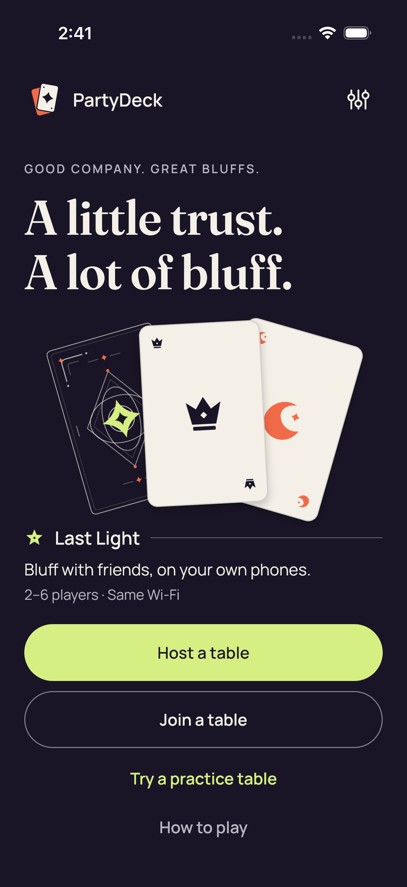
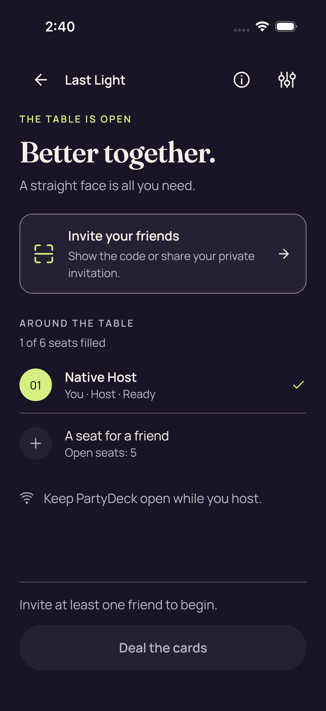
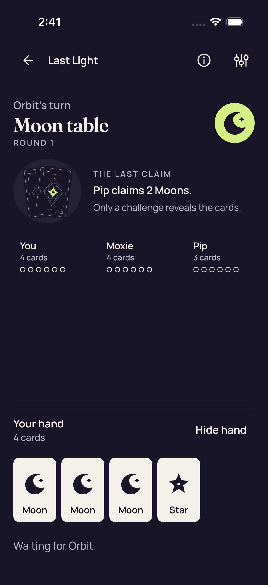
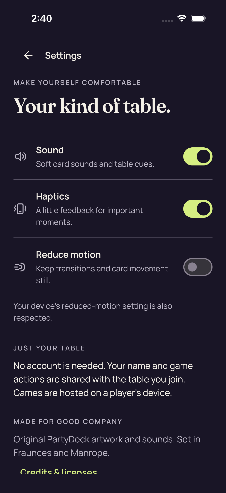
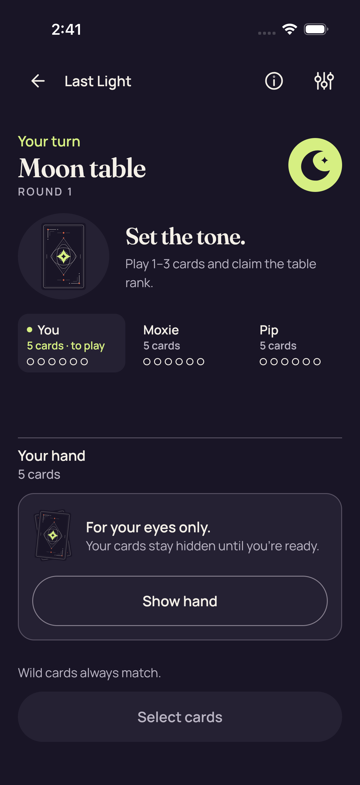
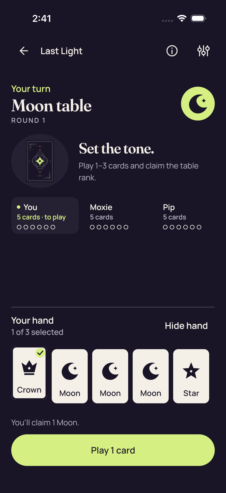

# iOS native baseline — CI 34428798269

[All screenshot collections](../README.md)

**Evidence status:** Three UI tests and three native transport tests pass. All eight original UI screenshots and their attachment mappings are retained. The [original Xcode log](xcodebuild.log) records each passing case and `TEST SUCCEEDED`; the [original interop orchestration](interop/orchestration.json) records exit 0. The broader transport test result is separate from the visual scope of these PNGs.

The [original simulator metadata](simulator.json) records iPhone 17, iOS runtime 26.4.1 and SDK 26.4. Images are 1206 × 2622 pixels; text scale was not recorded. Native large text, keyboard layout, VoiceOver, OS lifecycle snapshots, preference persistence and physical-device behavior are not qualified by these screenshots.

Exact CI revision: `15ab6408d16c04941d133214b03d4e8c6c42ced9`. [Original attachment manifest](attachments/manifest.json) · [CI artifacts](provenance/ios-artifacts.json) · [Job metadata](provenance/last-ios-job-status.json) · [Later reviewer audit](provenance/ios-simulator-evidence-summary.json).

The UI tests exercise Home → Practice, reveal/select/hide and an accepted one-card play, Settings navigation, and native host creation/invitation opening/dismissal. The [capture guard at this revision](https://github.com/Apdelrahman1911/PartyDeck/blob/15ab6408d16c04941d133214b03d4e8c6c42ced9/iosApp/PartyDeckUITests/PartyDeckUITests.swift) refuses to attach a screenshot while the live invitation dialog exists. The retained host images precede opening or follow dismissal; no live QR or invitation URI is shown.

The after-play image shows four own cards and continuing turns, rather than the earlier iOS run’s round result. Settings credits extend below the viewport. Original UUID filenames, timestamps, bytes and test associations are preserved. Source: `/tmp/partydeck-engine-ci/34428798269/ios-reports-and-simulator-app/build/ci/ios/attachments`.

| Original image | Scenario and provenance |
| --- | --- |
|  | **Home** iPhone 17 simulator, iOS runtime 26.4.1 Original: [18C31D48-23C3-46BD-9D52-613FC61B46F4.png](attachments/18C31D48-23C3-46BD-9D52-613FC61B46F4.png) 1206 × 2622 px; text scale not recorded SHA-256: <code>5499de3662a675bfcd3d1ea49122fe6c319b318f6703801daa2230fb7f8d27ce</code> |
|  | **Native host lobby** iPhone 17 simulator, iOS runtime 26.4.1 Original: [398DB456-1724-480F-B160-BFCC9EDFDDBF.png](attachments/398DB456-1724-480F-B160-BFCC9EDFDDBF.png) 1206 × 2622 px; text scale not recorded SHA-256: <code>0245df6190e03cc65a729fe108bf6a49d2be9ba276854e669e5d3dbedd2e1e16</code> The native host lobby is captured before invitation opening or after its dismissal; no live QR/URI is retained. |
|  | **Practice after accepted play** iPhone 17 simulator, iOS runtime 26.4.1 Original: [3F9690F8-BBCD-45FC-844F-E0B6EFF7A6F9.png](attachments/3F9690F8-BBCD-45FC-844F-E0B6EFF7A6F9.png) 1206 × 2622 px; text scale not recorded SHA-256: <code>62ee32f920705f4d7da2fef700849997dba0fe18b5fffffb87165bb90fb70c32</code> The own hand has four cards after the accepted Crown play. Orbit is taking the turn and Pip’s two-Moon claim is public; this capture shows continuing play, not a round result. |
|  | **Practice concealed** iPhone 17 simulator, iOS runtime 26.4.1 Original: [838F73B5-9F2C-4DE4-8131-8A6928588844.png](attachments/838F73B5-9F2C-4DE4-8131-8A6928588844.png) 1206 × 2622 px; text scale not recorded SHA-256: <code>41a12df545db704d1b734b52a4698473b1356309643ef835a56251165d22195e</code> |
|  | **Settings** iPhone 17 simulator, iOS runtime 26.4.1 Original: [8DE8E081-7363-4ADA-8FA1-4838F1067878.png](attachments/8DE8E081-7363-4ADA-8FA1-4838F1067878.png) 1206 × 2622 px; text scale not recorded SHA-256: <code>9b23c1583063be16d177a9f54dfb69143283f1d0cc7ce46f422029f027d3714f</code> Credits &amp; licenses continues below the captured viewport. This navigation test does not qualify preference persistence or VoiceOver. |
|  | **Practice hidden after selection** iPhone 17 simulator, iOS runtime 26.4.1 Original: [9E3E8FDA-F3A3-4E3F-81D8-9B86BE90691A.png](attachments/9E3E8FDA-F3A3-4E3F-81D8-9B86BE90691A.png) 1206 × 2622 px; text scale not recorded SHA-256: <code>41a12df545db704d1b734b52a4698473b1356309643ef835a56251165d22195e</code> |
|  | **Native host invitation closed** iPhone 17 simulator, iOS runtime 26.4.1 Original: [A3A07D6D-C81B-4939-B38B-BA5B36179AE1.png](attachments/A3A07D6D-C81B-4939-B38B-BA5B36179AE1.png) 1206 × 2622 px; text scale not recorded SHA-256: <code>0245df6190e03cc65a729fe108bf6a49d2be9ba276854e669e5d3dbedd2e1e16</code> The native host lobby is captured before invitation opening or after its dismissal; no live QR/URI is retained. |
|  | **Practice selected** iPhone 17 simulator, iOS runtime 26.4.1 Original: [C949A8ED-5A08-4485-BF7C-F5F176A4A001.png](attachments/C949A8ED-5A08-4485-BF7C-F5F176A4A001.png) 1206 × 2622 px; text scale not recorded SHA-256: <code>6f950bd7039644002d482c26e3e7480235694a77ccb22726d62e2ec86b9c1e63</code> The own Crown is selected for a one-card Moon claim. The complete Play 1 card action is visible. |
