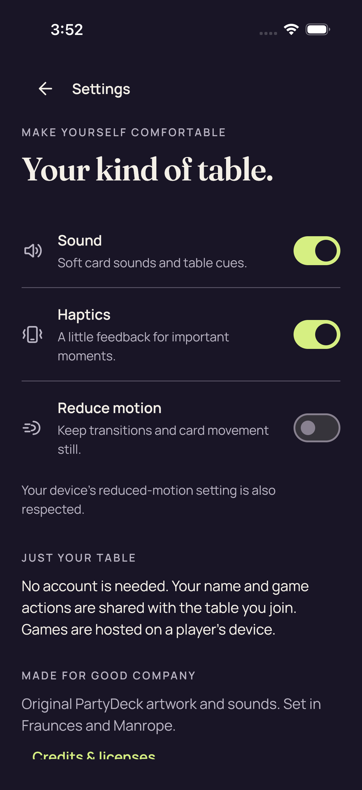
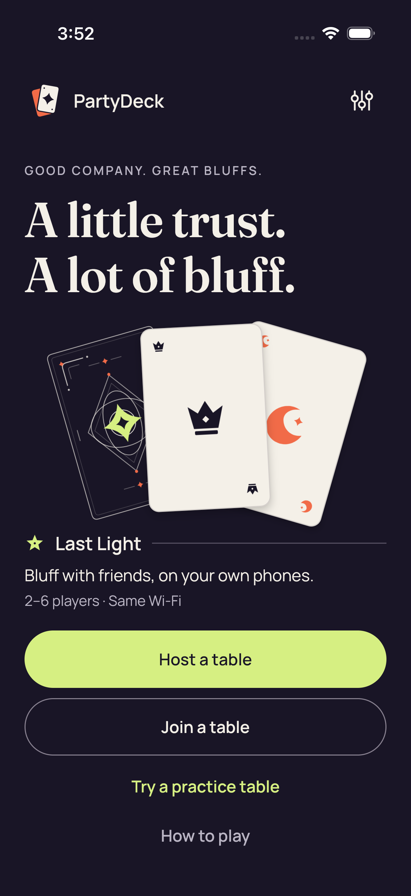

# iOS ordinary production app — Standard accessibility failure

[All collections](../README.md) · [Original CI run](https://github.com/Apdelrahman1911/PartyDeck/actions/runs/34496252392)

Ordinary Standard unfiltered .all accessibility audit failed: “Hit area is too small.” Six ordinary unit tests passed, including three real UIKit tests; UI tests had two passes and one failure. Guarded qualification geometry assertions, the separate layout gate/checker and both real Godot production sessions did not execute.

Nine original PNG capture identities across seven payloads. Distinct original filenames and times are retained even when XCTest reused bytes. The two original failure attachments were directly viewed. One retained MP4 is referenced in provenance only; no frames or derivatives are added.

Exact source: `410c9386dd88b2ad0ab380e5b8f1f9bf19674b00`.

[Original capture mapping](provenance/retained-original-capture-mapping.json) · [Actual ordinary XCTest results](provenance/ordinary-xctest-results.json) · [Qualification scope](provenance/ordinary-native-layout-scope.json) · [Viewed originals](provenance/viewed-images.json)

## Publication visual review

All 9 original capture identities have review coverage: 7 direct original views, 2 exact matches to direct views in this batch. Each capture keeps its original name, source, dimensions, scenario and recorded time. Matching pixels do not transfer runtime outcomes. No derived image was created.

[Completed visual review](provenance/publication-review/partydeck-gallery-after-2013-ios-production-visual-review.json) · [Capture/review binding](../godot-ios-native-34488350932/provenance/publication-review/partydeck-gallery-2355-publication-review.json) · [Frozen publication queue](../godot-ios-native-34488350932/provenance/publication-queue-v1/queue-freeze.json) · [Original copy mapping](../godot-ios-native-34488350932/provenance/publication-queue-v1/copy-paths.tsv) · [Unchanged queue page](../godot-ios-native-34488350932/provenance/publication-queue-v1/payload/docs/screenshots/ios-34496252392/README.md). The archived queue page retains its original text and relative paths as provenance.

The App and Element originals were directly viewed earlier at their preserved extraction paths; five further originals were viewed for this publication. The original XCTest Element Screenshot is an original attachment. Readable count-only feedback does not negate the unfiltered `.all` accessibility failure.

| Original capture | Recorded identity and evidence scope |
| --- | --- |
|  | **Settings** [Settings_0_44D273DE-0429-40E4-9526-D0257712606C.png](attachments/Settings_0_44D273DE-0429-40E4-9526-D0257712606C.png) Exported file: <code>Settings_0_44D273DE-0429-40E4-9526-D0257712606C.png</code> 1206 × 2622 px · 2026-09-10T15:52:04.207+0000 <code>PartyDeckUITests/testNativeHostCanNavigateSharedSettings()</code> — passed SHA-256: <code>23e77e4c9b5ac58efa9d28379ffa652ab4f6e9227ca96f622af32b8e06bf88ff</code> [Owner mapping](provenance/retained-original-capture-mapping.json) · [Original case results](provenance/ordinary-xctest-results.json) Ordinary Standard unfiltered .all accessibility audit failed: “Hit area is too small.” Six ordinary unit tests passed, including three real UIKit tests; UI tests had two passes and one failure. Guarded qualification geometry assertions, the separate layout gate/checker and both real Godot production sessions did not execute. Recorded names identify capture stages. Publication visual observations describe the viewport without adding native qualification. **Publication review — direct original view:** Settings shows readable sound, haptics, reduced-motion and table/privacy copy with complete toggles. Credits &amp; licenses begins at the lower scroll edge and is clipped in this captured position. |
|  | **Native host lobby** [Native host lobby_0_D326A407-718B-44B0-922F-4C0AB4B9B507.png](attachments/Native%20host%20lobby_0_D326A407-718B-44B0-922F-4C0AB4B9B507.png) Exported file: <code>Native host lobby_0_D326A407-718B-44B0-922F-4C0AB4B9B507.png</code> 1206 × 2622 px · 2026-09-10T15:52:28.760+0000 <code>PartyDeckUITests/testSharedControllerHostsANativeTableAndShowsItsInvitation()</code> — passed SHA-256: <code>f2be4757adace4f11a7b8e143da2627810a80b1451ac9c3613690b3aac336b23</code> [Owner mapping](provenance/retained-original-capture-mapping.json) · [Original case results](provenance/ordinary-xctest-results.json) Ordinary Standard unfiltered .all accessibility audit failed: “Hit area is too small.” Six ordinary unit tests passed, including three real UIKit tests; UI tests had two passes and one failure. Guarded qualification geometry assertions, the separate layout gate/checker and both real Godot production sessions did not execute. Recorded names identify capture stages. Publication visual observations describe the viewport without adding native qualification. This is a distinct recorded capture event with its own original filename and timestamp, even though XCTest reused its content-addressed payload. **Publication review — direct original view:** The native host lobby shows one ready host and five open seats, a complete invitation control, hosting instruction and disabled Deal the cards action. No private invitation value is displayed in the lobby. |
|  | **Native host invitation closed** [Native host invitation closed_0_F2B8D67F-CF53-47BB-89C3-139C1BBB0514.png](attachments/Native%20host%20invitation%20closed_0_F2B8D67F-CF53-47BB-89C3-139C1BBB0514.png) Exported file: <code>Native host invitation closed_0_F2B8D67F-CF53-47BB-89C3-139C1BBB0514.png</code> 1206 × 2622 px · 2026-09-10T15:52:37.591+0000 <code>PartyDeckUITests/testSharedControllerHostsANativeTableAndShowsItsInvitation()</code> — passed SHA-256: <code>f2be4757adace4f11a7b8e143da2627810a80b1451ac9c3613690b3aac336b23</code> [Owner mapping](provenance/retained-original-capture-mapping.json) · [Original case results](provenance/ordinary-xctest-results.json) Ordinary Standard unfiltered .all accessibility audit failed: “Hit area is too small.” Six ordinary unit tests passed, including three real UIKit tests; UI tests had two passes and one failure. Guarded qualification geometry assertions, the separate layout gate/checker and both real Godot production sessions did not execute. Recorded names identify capture stages. Publication visual observations describe the viewport without adding native qualification. This is a distinct recorded capture event with its own original filename and timestamp, even though XCTest reused its content-addressed payload. **Publication review — exact match to a directly viewed original in this batch:** The native host lobby shows one ready host and five open seats, a complete invitation control, hosting instruction and disabled Deal the cards action. No private invitation value is displayed in the lobby. [Reviewed matching original](attachments/Native%20host%20lobby_0_D326A407-718B-44B0-922F-4C0AB4B9B507.png); capture context remains separate. |
|  | **Home** [Home_0_1375A16D-1E61-43F7-93C4-4C00924A187C.png](attachments/Home_0_1375A16D-1E61-43F7-93C4-4C00924A187C.png) Exported file: <code>Home_0_1375A16D-1E61-43F7-93C4-4C00924A187C.png</code> 1206 × 2622 px · 2026-09-10T15:52:52.580+0000 <code>PartyDeckUITests/testSharedHomeOpensAPlayablePracticeTable()</code> — failed SHA-256: <code>0d769e0bdc4ad35a5669087eec2c5a211352d6f56702f8db762c260d59d1b106</code> [Owner mapping](provenance/retained-original-capture-mapping.json) · [Original case results](provenance/ordinary-xctest-results.json) Ordinary Standard unfiltered .all accessibility audit failed: “Hit area is too small.” Six ordinary unit tests passed, including three real UIKit tests; UI tests had two passes and one failure. Guarded qualification geometry assertions, the separate layout gate/checker and both real Godot production sessions did not execute. Recorded names identify capture stages. Publication visual observations describe the viewport without adding native qualification. **Publication review — direct original view:** The iOS Home capture shows the complete brand heading, card illustration, Host a table, Join a table, practice and How to play actions without visible overlap. |
|  | **Practice Standard concealed** [Practice Standard concealed_0_35CD52CB-A37D-435C-8E30-BAB1BF463716.png](attachments/Practice%20Standard%20concealed_0_35CD52CB-A37D-435C-8E30-BAB1BF463716.png) Exported file: <code>Practice Standard concealed_0_35CD52CB-A37D-435C-8E30-BAB1BF463716.png</code> 1206 × 2622 px · 2026-09-10T15:52:58.039+0000 <code>PartyDeckUITests/testSharedHomeOpensAPlayablePracticeTable()</code> — failed SHA-256: <code>ec2cc1eb3794ae9eef90c927cf9ac82e1710464d1c4ceae312cbe5b80aead3b6</code> [Owner mapping](provenance/retained-original-capture-mapping.json) · [Original case results](provenance/ordinary-xctest-results.json) Ordinary Standard unfiltered .all accessibility audit failed: “Hit area is too small.” Six ordinary unit tests passed, including three real UIKit tests; UI tests had two passes and one failure. Guarded qualification geometry assertions, the separate layout gate/checker and both real Godot production sessions did not execute. Recorded names identify capture stages. Publication visual observations describe the viewport without adding native qualification. **Publication review — direct original view:** The concealed Standard table shows readable Crown/round and Orbit claim details, a complete For your eyes only panel and Show hand control, and complete disabled Select cards and Challenge Orbit actions. Displayed private cards show backs. |
|  | **Practice Standard all five native card descriptions** [Practice Standard all five native card descriptions_0_892BB876-6325-4DB6-8A87-E998E4D95090.png](attachments/Practice%20Standard%20all%20five%20native%20card%20descriptions_0_892BB876-6325-4DB6-8A87-E998E4D95090.png) Exported file: <code>Practice Standard all five native card descriptions_0_892BB876-6325-4DB6-8A87-E998E4D95090.png</code> 1206 × 2622 px · 2026-09-10T15:53:19.404+0000 <code>PartyDeckUITests/testSharedHomeOpensAPlayablePracticeTable()</code> — failed SHA-256: <code>6b3d802d28ca8fe4e8a7689ffa2b309e810ceba5e1ddd66b9868b5b28eff4dbf</code> [Owner mapping](provenance/retained-original-capture-mapping.json) · [Original case results](provenance/ordinary-xctest-results.json) Ordinary Standard unfiltered .all accessibility audit failed: “Hit area is too small.” Six ordinary unit tests passed, including three real UIKit tests; UI tests had two passes and one failure. Guarded qualification geometry assertions, the separate layout gate/checker and both real Godot production sessions did not execute. Recorded names identify capture stages. Publication visual observations describe the viewport without adding native qualification. **Publication review — direct original view:** The revealed Standard hand shows all five card faces and rank labels, 0 of 3 selected, Hide hand, the wild-card instruction and complete Select cards/Challenge Orbit actions. Native descriptions and audit outcomes remain separate test evidence. |
|  | **Practice Standard maximum selection and count-only feedback** [Practice Standard maximum selection and count-only feedback_0_7E11A12A-FD0A-443A-A94A-96B26F66156B.png](attachments/Practice%20Standard%20maximum%20selection%20and%20count-only%20feedback_0_7E11A12A-FD0A-443A-A94A-96B26F66156B.png) Exported file: <code>Practice Standard maximum selection and count-only feedback_0_7E11A12A-FD0A-443A-A94A-96B26F66156B.png</code> 1206 × 2622 px · 2026-09-10T15:54:10.932+0000 <code>PartyDeckUITests/testSharedHomeOpensAPlayablePracticeTable()</code> — failed SHA-256: <code>b891cee1145818a571550ce13b7c1e535689d888e09c08575f8c09233715e7da</code> [Owner mapping](provenance/retained-original-capture-mapping.json) · [Original case results](provenance/ordinary-xctest-results.json) Ordinary Standard unfiltered .all accessibility audit failed: “Hit area is too small.” Six ordinary unit tests passed, including three real UIKit tests; UI tests had two passes and one failure. Guarded qualification geometry assertions, the separate layout gate/checker and both real Godot production sessions did not execute. Recorded names identify capture stages. Publication visual observations describe the viewport without adding native qualification. This is a distinct recorded capture event with its own original filename and timestamp, even though XCTest reused its content-addressed payload. **Publication review — exact match to a directly viewed original in this batch:** The Standard table shows 3 of 3 selected with three visible check badges. Choose up to 3 cards., Play 3 cards and Challenge Orbit are readable and the two action outlines fit. The original accessibility audit still fails the feedback hit area. [Reviewed matching original](attachments/App%20Screenshot_0_DB2AFFD0-2BEA-4EF4-86B9-3A7FCE0CB3C2.png); capture context remains separate. |
|  | **App Screenshot** [App Screenshot_0_DB2AFFD0-2BEA-4EF4-86B9-3A7FCE0CB3C2.png](attachments/App%20Screenshot_0_DB2AFFD0-2BEA-4EF4-86B9-3A7FCE0CB3C2.png) Exported file: <code>App Screenshot_0_DB2AFFD0-2BEA-4EF4-86B9-3A7FCE0CB3C2.png</code> 1206 × 2622 px · 2026-09-10T15:54:13.619+0000 <code>PartyDeckUITests/testSharedHomeOpensAPlayablePracticeTable()</code> — failed SHA-256: <code>b891cee1145818a571550ce13b7c1e535689d888e09c08575f8c09233715e7da</code> [Owner mapping](provenance/retained-original-capture-mapping.json) · [Original case results](provenance/ordinary-xctest-results.json) Ordinary Standard unfiltered .all accessibility audit failed: “Hit area is too small.” Six ordinary unit tests passed, including three real UIKit tests; UI tests had two passes and one failure. Guarded qualification geometry assertions, the separate layout gate/checker and both real Godot production sessions did not execute. Recorded names identify capture stages. Publication visual observations describe the viewport without adding native qualification. This is a distinct recorded capture event with its own original filename and timestamp, even though XCTest reused its content-addressed payload. Existing direct review: three selected cards with visible badges, readable feedback, and complete Play 3 cards / Challenge Orbit controls. **Publication review — earlier direct view of this original:** The Standard table shows 3 of 3 selected with three visible check badges. Choose up to 3 cards., Play 3 cards and Challenge Orbit are readable and the two action outlines fit. The original accessibility audit still fails the feedback hit area. |
|  | **Element Screenshot** [Element Screenshot_1_1472CFD1-B7EE-4B72-A5C9-6C6E0618DA2F.png](attachments/Element%20Screenshot_1_1472CFD1-B7EE-4B72-A5C9-6C6E0618DA2F.png) Exported file: <code>Element Screenshot_1_1472CFD1-B7EE-4B72-A5C9-6C6E0618DA2F.png</code> 416 × 56 px · 2026-09-10T15:54:13.839+0000 <code>PartyDeckUITests/testSharedHomeOpensAPlayablePracticeTable()</code> — failed SHA-256: <code>162fad2bf7147dade17481f54400490b2710c46e9dfc6fd591edeb1099edd9c1</code> [Owner mapping](provenance/retained-original-capture-mapping.json) · [Original case results](provenance/ordinary-xctest-results.json) Ordinary Standard unfiltered .all accessibility audit failed: “Hit area is too small.” Six ordinary unit tests passed, including three real UIKit tests; UI tests had two passes and one failure. Guarded qualification geometry assertions, the separate layout gate/checker and both real Godot production sessions did not execute. Recorded names identify capture stages. Publication visual observations describe the viewport without adding native qualification. Original XCTest element attachment showing “Choose up to 3 cards”; not an agent crop or derivative. The 416 × 56 pixel extent at 3× scale is not an exported exact accessibility rectangle. **Publication review — earlier direct view of this original:** The original XCTest element screenshot isolates the complete Choose up to 3 cards. feedback. It is an original 416 by 56 PNG, not a reviewer crop; the audit failure remains separate from visual readability. |
