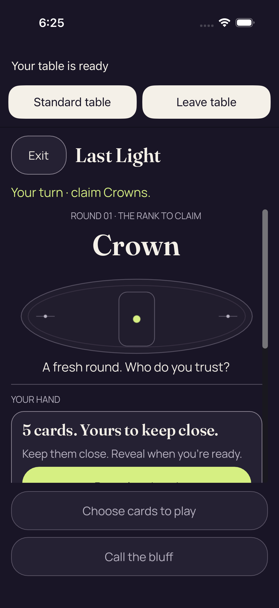
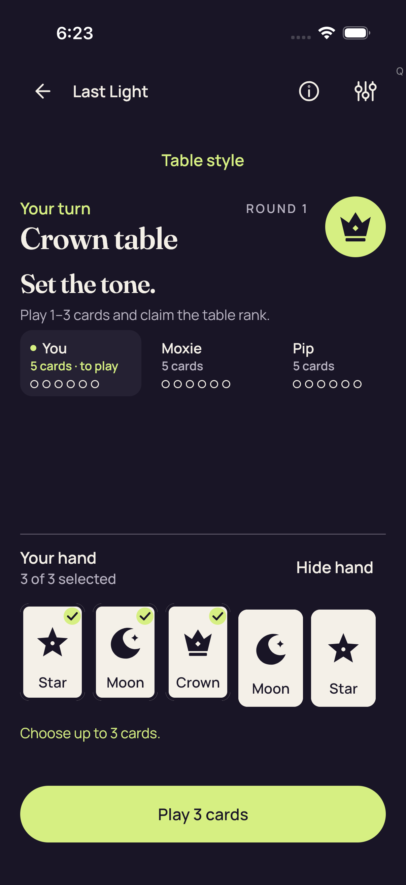
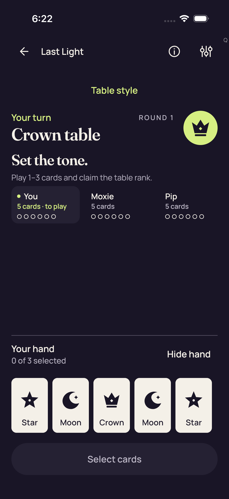
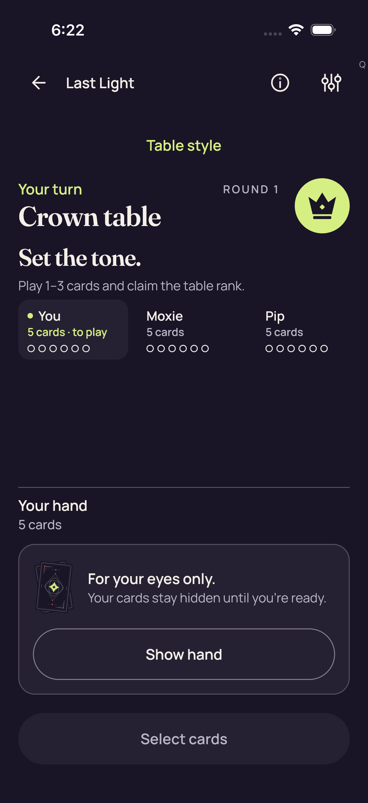
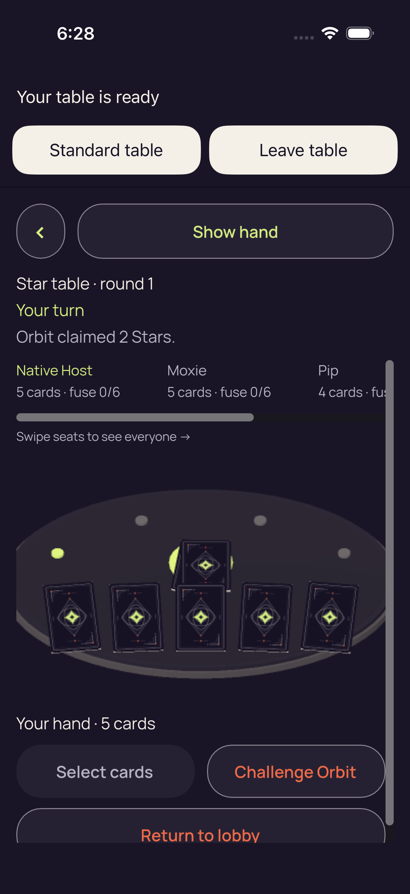
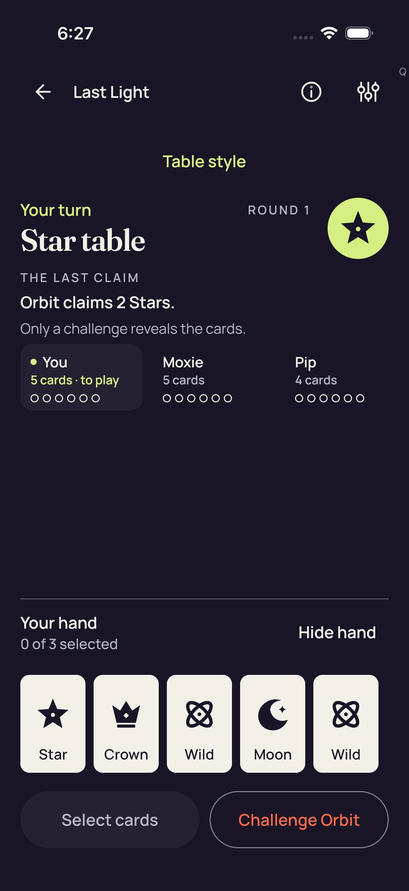
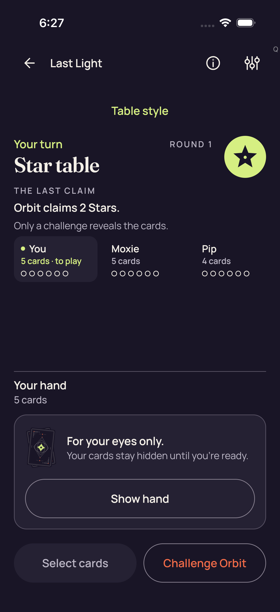
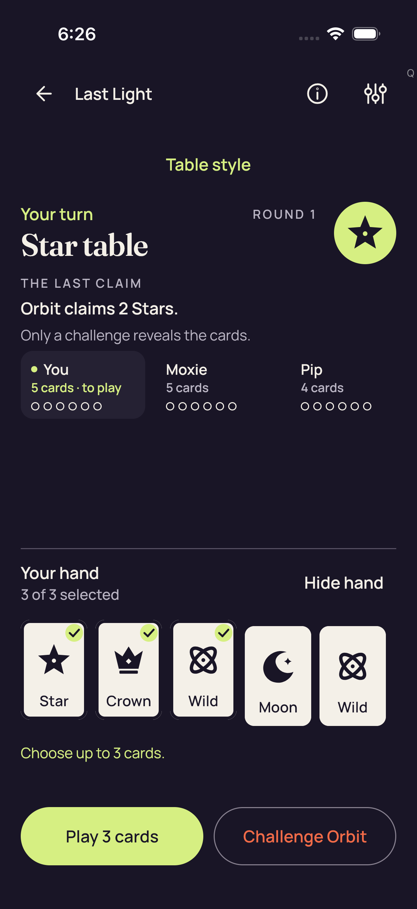

# Production native sessions — iOS CI 34509634154

[All collections](../../README.md) · [Preserved evidence index](../evidence-index.md) · [Copy/review binding](../../android-34515669045/provenance/publication-review/partydeck-gallery-3433-publication-binding-v1.json) · [Completed focused review](../provenance/publication-review/partydeck-gallery-after-2815-production34509634154-visual-review-v1.json) · [Source mapping](../provenance/source-map/partydeck-gallery-after-2815-production34509634154-source-map-v1.json)

**Both native cases fail the second initial-entry freshness wait; later native gameplay remains unreached.**

Original test outcomes and attachment metadata remain distinct from the visual-review method.

Nine ordinary XCTest cases and five unfiltered .all accessibility audits pass. Three guarded UIKit layout cases pass separately and produce zero PNGs. Both actual native production cases fail at the second fresh-frame wait in initial enter(), before native selection/Play/return/Leave/reentry. Production-session Standard checkpoints do not invoke the ordinary .all audit callback. Manual isAssociatedWithFailure=false attachment metadata is preserved and does not imply success.

The directly reviewed ordinary maximum-selection checkpoint shows all five named cards, three checks, 3 of 3 selected, count-only feedback and full lower actions. The old-pack 2D failure clips the Reveal label at the body edge. The 3D failure renders a covered table with full Show hand/Select/Challenge, horizontally clipped seats and a clipped Return to lobby. Three priority originals were directly viewed; 19 others remain explicitly unviewed.

Pack SHA-256: `d6adbba1b5cbd6a1ac3a5754e4294363eae70ae9540af4ba12040cd4cfff44e0`. Both original videos remain unviewed and undecoded. No hit-area, assistive-technology traversal, continuous-privacy or timeout-cause conclusion follows from these stills.

Source revision: `b08078028895ea8681fb72c57cfd613324a085cf`. CI run: [34509634154](https://github.com/Apdelrahman1911/PartyDeck/actions/runs/34509634154). 12 original PNG identities. Review methods: 2 direct original view, 10 unviewed original — no visual acceptance.

Every thumbnail opens the unchanged original PNG. **UNVIEWED** means no direct pixel review or visual acceptance is asserted. Matching bytes reuse only earlier pixel observations. Each source, scenario and original outcome remains separate. Frozen review plans retain their historical pending flags; the completed focused-review receipt records the final status. No new derivative image or video decoding was performed.

| Original capture | Original identity and evidence | Review status and observation |
| --- | --- | --- |
|  <code>40380FE7-70AE-4763-9F68-58220A82EC9D.png</code> 2d production smoke failure_0_DC79CE9C-2FD1-4A67-9CA0-2CB40F6BD322.png | 1206 × 2622 px · 271,487 bytes SHA-256: <code>e486634ca670ac34bd1c06930f82319ac42e557c3ee9e2f4386f728db184c587</code> Source: <code>/root/projects/PartyDeck/artifacts/evidence-storage/ios-validate-34509634154/ios-reports-and-simulator-app/build/ci/ios/godot-session/attachments/40380FE7-70AE-4763-9F68-58220A82EC9D.png</code> Original case: <code>PartyDeckGodotSessionUITests/testProduction2DPracticeSession()</code> — **failed** Original timestamp: 1789064705.742 [Original result](evidence/result.json) · [Attachment index](../companions.md) | **Direct original view**. The 2D production failure frame shows Your table is ready with full Standard table/Leave table controls, then Exit/Last Light, the Crown turn prompt, Round 01/Crown, table illustration and fresh-round copy. The five-card cover headline and description fit, while only the upper green portion of Reveal reaches the body viewport and its label is clipped. Both muted fixed lower actions fit. No private card face is visible. This old-pack frame retains the failed second entry fresh-frame wait; it does not show native selection/Play or establish continuous privacy. |
|  <code>9811C999-8ECB-442B-929E-E7FE014A3D78.png</code> 2d Standard fresh Reveal is unselected_0_362C49E9-7B41-4116-9CBE-53E7CDF27BFA.png | 1206 × 2622 px · 187,922 bytes SHA-256: <code>7599f1e14f36dc7f8c29b3cea16d35a06782fbcaef794bf955b9d14e4b26952a</code> Source: <code>/root/projects/PartyDeck/artifacts/evidence-storage/ios-validate-34509634154/ios-reports-and-simulator-app/build/ci/ios/godot-session/attachments/9811C999-8ECB-442B-929E-E7FE014A3D78.png</code> Original case: <code>PartyDeckGodotSessionUITests/testProduction2DPracticeSession()</code> — **failed** Original timestamp: 1789064669.38 [Original result](evidence/result.json) · [Attachment index](../companions.md) | **UNVIEWED original — no visual acceptance**. Original capture retained without direct visual review. Its recorded test, label, timestamp and outcome identify the source checkpoint; no pixel observation or visual acceptance is asserted. |
|  <code>2244CC76-E669-4FB7-A263-35B21164CE57.png</code> 2d Standard Hide removes private nodes and selection_0_ECDF1128-CD87-4D44-B57A-1191DC8E83D0.png | 1206 × 2622 px · 219,548 bytes SHA-256: <code>efd9d30b1ab224a4d4e4b4bf49d501be2bcfdc17e072489a2ccef2fb48da8715</code> Source: <code>/root/projects/PartyDeck/artifacts/evidence-storage/ios-validate-34509634154/ios-reports-and-simulator-app/build/ci/ios/godot-session/attachments/2244CC76-E669-4FB7-A263-35B21164CE57.png</code> Original case: <code>PartyDeckGodotSessionUITests/testProduction2DPracticeSession()</code> — **failed** Original timestamp: 1789064649.462 [Original result](evidence/result.json) · [Attachment index](../companions.md) | **UNVIEWED original — no visual acceptance**. Original capture retained without direct visual review. Its recorded test, label, timestamp and outcome identify the source checkpoint; no pixel observation or visual acceptance is asserted. |
|  <code>C7CFC14E-3045-48C1-900A-0F8BC1EEB379.png</code> 2d Standard maximum selection and count-only feedback_0_2318383C-1755-4ACE-AEF1-09BD9FABE234.png | 1206 × 2622 px · 209,532 bytes SHA-256: <code>98a75460d6e784be97e033864e64102c0d21a2a8af4a06fe568ce01597ef05d3</code> Source: <code>/root/projects/PartyDeck/artifacts/evidence-storage/ios-validate-34509634154/ios-reports-and-simulator-app/build/ci/ios/godot-session/attachments/C7CFC14E-3045-48C1-900A-0F8BC1EEB379.png</code> Original case: <code>PartyDeckGodotSessionUITests/testProduction2DPracticeSession()</code> — **failed** Original timestamp: 1789064624.35 [Original result](evidence/result.json) · [Attachment index](../companions.md) | **UNVIEWED original — no visual acceptance**. Original capture retained without direct visual review. Its recorded test, label, timestamp and outcome identify the source checkpoint; no pixel observation or visual acceptance is asserted. |
|  <code>D669A668-E9F5-4A20-B0AD-47A2B67780E9.png</code> 2d Standard all five native card descriptions_0_417075F3-BBF6-4D99-9020-6809DA29772D.png | 1206 × 2622 px · 187,562 bytes SHA-256: <code>5dd0d7b4614f093fb09638655e5345eedab9777ea2f5dd607739675cef647dca</code> Source: <code>/root/projects/PartyDeck/artifacts/evidence-storage/ios-validate-34509634154/ios-reports-and-simulator-app/build/ci/ios/godot-session/attachments/D669A668-E9F5-4A20-B0AD-47A2B67780E9.png</code> Original case: <code>PartyDeckGodotSessionUITests/testProduction2DPracticeSession()</code> — **failed** Original timestamp: 1789064571.45 [Original result](evidence/result.json) · [Attachment index](../companions.md) | **UNVIEWED original — no visual acceptance**. Original capture retained without direct visual review. Its recorded test, label, timestamp and outcome identify the source checkpoint; no pixel observation or visual acceptance is asserted. |
|  <code>A8321846-4112-4FA6-9054-B6336F163837.png</code> 2d Standard concealed_0_3CF99A37-8D2A-4AAA-BF51-84E668BA1846.png | 1206 × 2622 px · 219,207 bytes SHA-256: <code>07453eec7540055a8ee4884ed609bfccda952efba54bbb3a681ade07e6108161</code> Source: <code>/root/projects/PartyDeck/artifacts/evidence-storage/ios-validate-34509634154/ios-reports-and-simulator-app/build/ci/ios/godot-session/attachments/A8321846-4112-4FA6-9054-B6336F163837.png</code> Original case: <code>PartyDeckGodotSessionUITests/testProduction2DPracticeSession()</code> — **failed** Original timestamp: 1789064552.672 [Original result](evidence/result.json) · [Attachment index](../companions.md) | **UNVIEWED original — no visual acceptance**. Original capture retained without direct visual review. Its recorded test, label, timestamp and outcome identify the source checkpoint; no pixel observation or visual acceptance is asserted. |
|  <code>AD875070-674E-48D3-984A-9AC054661B3D.png</code> 3d production smoke failure_0_FF5007C3-989E-498A-AE99-06A3A074161A.png | 1206 × 2622 px · 390,718 bytes SHA-256: <code>3aa367d77ba04ca5f639570955327823659502e0fe22917ad05764169538d4af</code> Source: <code>/root/projects/PartyDeck/artifacts/evidence-storage/ios-validate-34509634154/ios-reports-and-simulator-app/build/ci/ios/godot-session/attachments/AD875070-674E-48D3-984A-9AC054661B3D.png</code> Original case: <code>PartyDeckGodotSessionUITests/testProduction3DPracticeSession()</code> — **failed** Original timestamp: 1789064905.983 [Original result](evidence/result.json) · [Attachment index](../companions.md) | **Direct original view**. The 3D production failure frame shows Your table is ready and full Standard table/Leave table controls. Show hand, Star table · round 1, Your turn and Orbit claimed 2 Stars fit. Native Host/Moxie seat context is readable while Pip details continue beyond the horizontal clip; the seat-scroll hint is visible. Covered cards and the table render above full Select cards and Challenge Orbit controls. Return to lobby is clipped by the lower body edge. No private card face appears. The original second fresh-frame wait remains failed, without a visual failure-cause or gameplay-completion conclusion. |
|  <code>4D0BFD00-C040-402C-A4AE-32526386C5A4.png</code> 3d Standard fresh Reveal is unselected_0_420CF012-3485-4A8E-8D83-4116B07647A5.png | 1206 × 2622 px · 214,862 bytes SHA-256: <code>a59057193a27dfd99f4ea228679eb1f7f96d6bdd342619652412a576696e2146</code> Source: <code>/root/projects/PartyDeck/artifacts/evidence-storage/ios-validate-34509634154/ios-reports-and-simulator-app/build/ci/ios/godot-session/attachments/4D0BFD00-C040-402C-A4AE-32526386C5A4.png</code> Original case: <code>PartyDeckGodotSessionUITests/testProduction3DPracticeSession()</code> — **failed** Original timestamp: 1789064850.875 [Original result](evidence/result.json) · [Attachment index](../companions.md) | **UNVIEWED original — no visual acceptance**. Original capture retained without direct visual review. Its recorded test, label, timestamp and outcome identify the source checkpoint; no pixel observation or visual acceptance is asserted. |
|  <code>2FED8B0D-9F12-4BEC-B974-2E914D1BBE66.png</code> 3d Standard Hide removes private nodes and selection_0_48A21A02-C3A8-4E4A-8EA1-E2786FB0E5E6.png | 1206 × 2622 px · 240,537 bytes SHA-256: <code>78ae634164d6e18e53856aed7a1c554ad54af0c18e7c1c2de7e1e4b61ef96646</code> Source: <code>/root/projects/PartyDeck/artifacts/evidence-storage/ios-validate-34509634154/ios-reports-and-simulator-app/build/ci/ios/godot-session/attachments/2FED8B0D-9F12-4BEC-B974-2E914D1BBE66.png</code> Original case: <code>PartyDeckGodotSessionUITests/testProduction3DPracticeSession()</code> — **failed** Original timestamp: 1789064834.891 [Original result](evidence/result.json) · [Attachment index](../companions.md) | **UNVIEWED original — no visual acceptance**. Original capture retained without direct visual review. Its recorded test, label, timestamp and outcome identify the source checkpoint; no pixel observation or visual acceptance is asserted. |
|  <code>C7608615-D8BC-48C8-8FD9-2CCE3F4229B2.png</code> 3d Standard maximum selection and count-only feedback_0_31B1BC04-E6B2-4F7C-987D-E2E3831F5B39.png | 1206 × 2622 px · 234,583 bytes SHA-256: <code>3726e406a6bcfd2f03a59468a2cb291b29b7c699e11ffd3c48d6df5dd76798e1</code> Source: <code>/root/projects/PartyDeck/artifacts/evidence-storage/ios-validate-34509634154/ios-reports-and-simulator-app/build/ci/ios/godot-session/attachments/C7608615-D8BC-48C8-8FD9-2CCE3F4229B2.png</code> Original case: <code>PartyDeckGodotSessionUITests/testProduction3DPracticeSession()</code> — **failed** Original timestamp: 1789064807.771 [Original result](evidence/result.json) · [Attachment index](../companions.md) | **UNVIEWED original — no visual acceptance**. Original capture retained without direct visual review. Its recorded test, label, timestamp and outcome identify the source checkpoint; no pixel observation or visual acceptance is asserted. |
|  <code>A229BB48-EFEB-4686-A764-F63D2075814D.png</code> 3d Standard all five native card descriptions_0_67F9D74D-B96B-4362-87E1-00F47DCFAF0C.png | 1206 × 2622 px · 215,330 bytes SHA-256: <code>f13e34b86419680e09edaa799a96e272ea1d6796ef4452139bd65354d7d40f3b</code> Source: <code>/root/projects/PartyDeck/artifacts/evidence-storage/ios-validate-34509634154/ios-reports-and-simulator-app/build/ci/ios/godot-session/attachments/A229BB48-EFEB-4686-A764-F63D2075814D.png</code> Original case: <code>PartyDeckGodotSessionUITests/testProduction3DPracticeSession()</code> — **failed** Original timestamp: 1789064747.281 [Original result](evidence/result.json) · [Attachment index](../companions.md) | **UNVIEWED original — no visual acceptance**. Original capture retained without direct visual review. Its recorded test, label, timestamp and outcome identify the source checkpoint; no pixel observation or visual acceptance is asserted. |
|  <code>0BCA6167-DCD9-43C5-9911-5A5BD9CF871B.png</code> 3d Standard concealed_0_2864CAC1-6F6A-4BEF-8223-AE6C3B58E634.png | 1206 × 2622 px · 240,970 bytes SHA-256: <code>7324926bb1ca9981be4be3dd5a6e546f305e588a91c6ee16d2ab4fabac472cf4</code> Source: <code>/root/projects/PartyDeck/artifacts/evidence-storage/ios-validate-34509634154/ios-reports-and-simulator-app/build/ci/ios/godot-session/attachments/0BCA6167-DCD9-43C5-9911-5A5BD9CF871B.png</code> Original case: <code>PartyDeckGodotSessionUITests/testProduction3DPracticeSession()</code> — **failed** Original timestamp: 1789064729.294 [Original result](evidence/result.json) · [Attachment index](../companions.md) | **UNVIEWED original — no visual acceptance**. Original capture retained without direct visual review. Its recorded test, label, timestamp and outcome identify the source checkpoint; no pixel observation or visual acceptance is asserted. |
