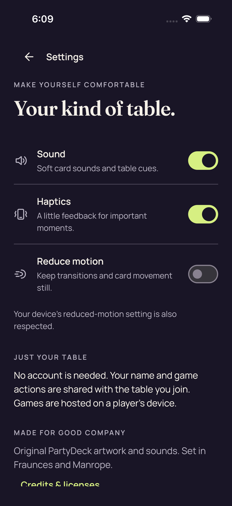
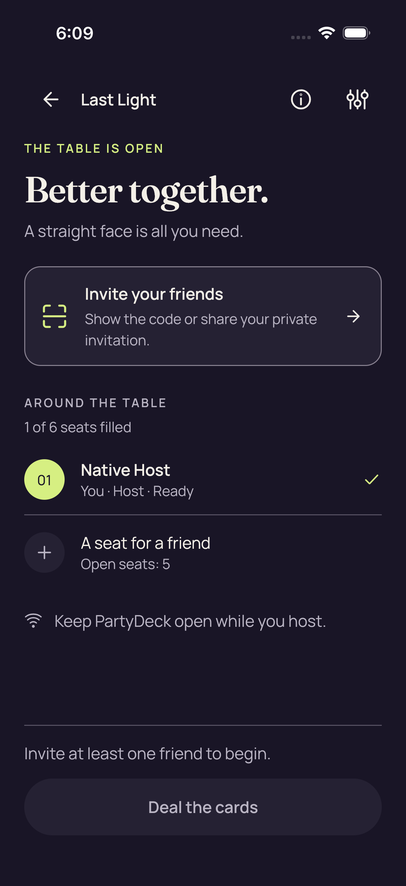
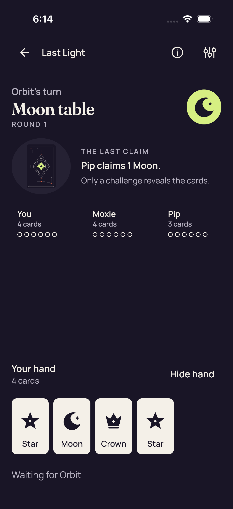
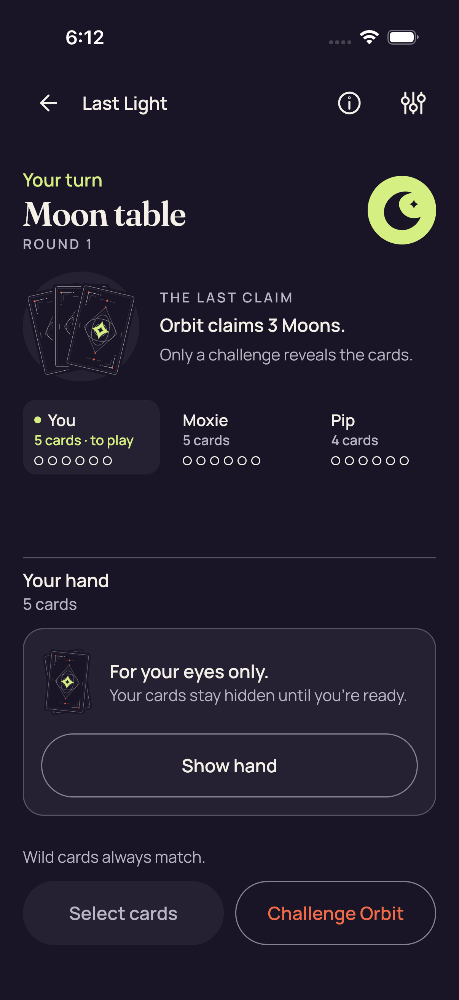
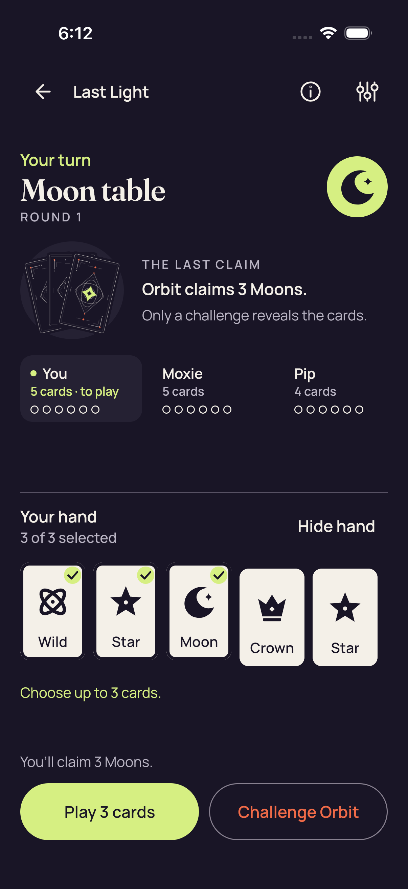
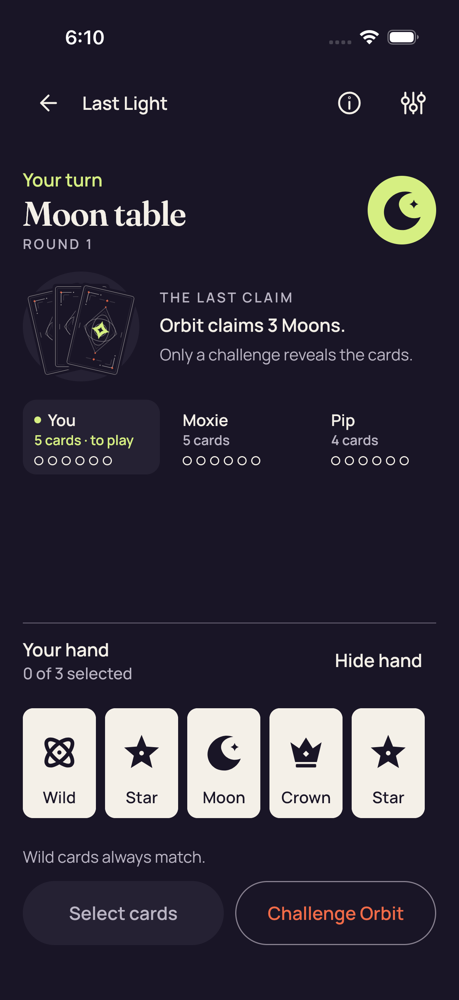
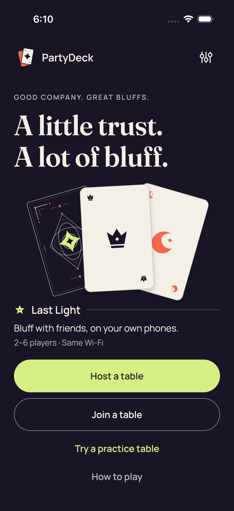

# Ordinary shared UI — iOS CI 34509634154

[All collections](../../README.md) · [Preserved evidence index](../evidence-index.md) · [Copy/review binding](../../android-34515669045/provenance/publication-review/partydeck-gallery-3433-publication-binding-v1.json) · [Completed focused review](../provenance/publication-review/partydeck-gallery-after-2815-production34509634154-visual-review-v1.json) · [Source mapping](../provenance/source-map/partydeck-gallery-after-2815-production34509634154-source-map-v1.json)

**Nine ordinary cases and five unfiltered .all audits pass; pixel review remains individually scoped.**

Original test outcomes and attachment metadata remain distinct from the visual-review method.

Nine ordinary XCTest cases and five unfiltered .all accessibility audits pass. Three guarded UIKit layout cases pass separately and produce zero PNGs. Both actual native production cases fail at the second fresh-frame wait in initial enter(), before native selection/Play/return/Leave/reentry. Production-session Standard checkpoints do not invoke the ordinary .all audit callback. Manual isAssociatedWithFailure=false attachment metadata is preserved and does not imply success.

The directly reviewed ordinary maximum-selection checkpoint shows all five named cards, three checks, 3 of 3 selected, count-only feedback and full lower actions. The old-pack 2D failure clips the Reveal label at the body edge. The 3D failure renders a covered table with full Show hand/Select/Challenge, horizontally clipped seats and a clipped Return to lobby. Three priority originals were directly viewed; 19 others remain explicitly unviewed.

Pack SHA-256: `d6adbba1b5cbd6a1ac3a5754e4294363eae70ae9540af4ba12040cd4cfff44e0`. Both original videos remain unviewed and undecoded. No hit-area, assistive-technology traversal, continuous-privacy or timeout-cause conclusion follows from these stills.

Source revision: `b08078028895ea8681fb72c57cfd613324a085cf`. CI run: [34509634154](https://github.com/Apdelrahman1911/PartyDeck/actions/runs/34509634154). 10 original PNG identities. Review methods: 9 unviewed original — no visual acceptance, 1 direct original view.

Every thumbnail opens the unchanged original PNG. **UNVIEWED** means no direct pixel review or visual acceptance is asserted. Matching bytes reuse only earlier pixel observations. Each source, scenario and original outcome remains separate. Frozen review plans retain their historical pending flags; the completed focused-review receipt records the final status. No new derivative image or video decoding was performed.

| Original capture | Original identity and evidence | Review status and observation |
| --- | --- | --- |
|  <code>83C43CCE-8D7F-4C1C-8F92-ACC1EC69D622.png</code> Settings_0_D52D6189-D82B-4F19-8BBD-D3885D0F32EF.png | 1206 × 2622 px · 288,276 bytes SHA-256: <code>a1f1319e3170258f129b07654d2f508a762abe6e7f505fb7b64460fd89415bf1</code> Source: <code>/root/projects/PartyDeck/artifacts/evidence-storage/ios-validate-34509634154/ios-reports-and-simulator-app/build/ci/ios/attachments/83C43CCE-8D7F-4C1C-8F92-ACC1EC69D622.png</code> Original case: <code>PartyDeckUITests/testNativeHostCanNavigateSharedSettings()</code> — **passed** Original timestamp: 1789063757.515 [Attachment index](../companions.md) | **UNVIEWED original — no visual acceptance**. Original capture retained without direct visual review. Its recorded test, label, timestamp and outcome identify the source checkpoint; no pixel observation or visual acceptance is asserted. |
|  <code>4F920818-1901-4BD8-84D6-94C6BBD0D91C.png</code> Native host invitation closed_0_8B541642-3E52-4481-8729-ABAA4355A17F.png | 1206 × 2622 px · 225,248 bytes SHA-256: <code>715b573a1b280de914025340f5986cb1f9f123f6b9fd77201bf863bafc7c8762</code> Source: <code>/root/projects/PartyDeck/artifacts/evidence-storage/ios-validate-34509634154/ios-reports-and-simulator-app/build/ci/ios/attachments/4F920818-1901-4BD8-84D6-94C6BBD0D91C.png</code> Original case: <code>PartyDeckUITests/testSharedControllerHostsANativeTableAndShowsItsInvitation()</code> — **passed** Original timestamp: 1789063793.576 [Attachment index](../companions.md) | **UNVIEWED original — no visual acceptance**. Original capture retained without direct visual review. Its recorded test, label, timestamp and outcome identify the source checkpoint; no pixel observation or visual acceptance is asserted. |
|  <code>8983F3B4-4D2E-478E-9B56-BB6784FC9DC3.png</code> Native host lobby_0_D91D6B20-BAD0-41D1-B1DA-3BABE94BDB4C.png | 1206 × 2622 px · 225,248 bytes SHA-256: <code>715b573a1b280de914025340f5986cb1f9f123f6b9fd77201bf863bafc7c8762</code> Source: <code>/root/projects/PartyDeck/artifacts/evidence-storage/ios-validate-34509634154/ios-reports-and-simulator-app/build/ci/ios/attachments/8983F3B4-4D2E-478E-9B56-BB6784FC9DC3.png</code> Original case: <code>PartyDeckUITests/testSharedControllerHostsANativeTableAndShowsItsInvitation()</code> — **passed** Original timestamp: 1789063786.891 [Attachment index](../companions.md) | **UNVIEWED original — no visual acceptance**. Original capture retained without direct visual review. Its recorded test, label, timestamp and outcome identify the source checkpoint; no pixel observation or visual acceptance is asserted. |
|  <code>5E3DACAC-E20B-4532-94C7-CE7F63ED4205.png</code> Practice after accepted play_0_60874073-D62A-4F0B-A65A-5124586A03E7.png | 1206 × 2622 px · 190,980 bytes SHA-256: <code>bb55d8e60857454f8523f87f92fd743b00080b1bf27e743eb46c00df4b4257f1</code> Source: <code>/root/projects/PartyDeck/artifacts/evidence-storage/ios-validate-34509634154/ios-reports-and-simulator-app/build/ci/ios/attachments/5E3DACAC-E20B-4532-94C7-CE7F63ED4205.png</code> Original case: <code>PartyDeckUITests/testSharedHomeOpensAPlayablePracticeTable()</code> — **passed** Original timestamp: 1789064041.805 [Attachment index](../companions.md) | **UNVIEWED original — no visual acceptance**. Original capture retained without direct visual review. Its recorded test, label, timestamp and outcome identify the source checkpoint; no pixel observation or visual acceptance is asserted. |
|  <code>F8586467-2F99-4ACB-B9E8-2ABDCB2EA696.png</code> Practice Standard fresh Reveal is unselected_0_E99B280F-07F2-4CF0-A010-3D22941B0414.png | 1206 × 2622 px · 260,329 bytes SHA-256: <code>9ec1c5c2ea2d888e29bf158c072bd5814a423200d9f03e7cb6c3ae2a5046e8d8</code> Source: <code>/root/projects/PartyDeck/artifacts/evidence-storage/ios-validate-34509634154/ios-reports-and-simulator-app/build/ci/ios/attachments/F8586467-2F99-4ACB-B9E8-2ABDCB2EA696.png</code> Original case: <code>PartyDeckUITests/testSharedHomeOpensAPlayablePracticeTable()</code> — **passed** Original timestamp: 1789064000.098 [Attachment index](../companions.md) | **UNVIEWED original — no visual acceptance**. Original capture retained without direct visual review. Its recorded test, label, timestamp and outcome identify the source checkpoint; no pixel observation or visual acceptance is asserted. |
|  <code>854D6D27-6050-43B8-A9AD-12DB310D52E1.png</code> Practice Standard Hide removes private nodes and selection_0_7EB78AE5-48EA-471C-9C2E-6461C590F74C.png | 1206 × 2622 px · 285,668 bytes SHA-256: <code>bebec5cfd8842431f7580e4fab1538bcabb9eea12a469f9de6bcdbf7f4044a25</code> Source: <code>/root/projects/PartyDeck/artifacts/evidence-storage/ios-validate-34509634154/ios-reports-and-simulator-app/build/ci/ios/attachments/854D6D27-6050-43B8-A9AD-12DB310D52E1.png</code> Original case: <code>PartyDeckUITests/testSharedHomeOpensAPlayablePracticeTable()</code> — **passed** Original timestamp: 1789063975.629 [Attachment index](../companions.md) | **UNVIEWED original — no visual acceptance**. Original capture retained without direct visual review. Its recorded test, label, timestamp and outcome identify the source checkpoint; no pixel observation or visual acceptance is asserted. |
|  <code>F59D7A9E-3938-4552-BA66-7EEC85765290.png</code> Practice Standard maximum selection and count-only feedback_0_9B3259B4-7F17-4C32-BD5C-94530E2A392C.png | 1206 × 2622 px · 274,239 bytes SHA-256: <code>30ef9a1c303dedb755bdc6fb1c4aaf1323bdbf301697e8dc4541d1e19595f9c1</code> Source: <code>/root/projects/PartyDeck/artifacts/evidence-storage/ios-validate-34509634154/ios-reports-and-simulator-app/build/ci/ios/attachments/F59D7A9E-3938-4552-BA66-7EEC85765290.png</code> Original case: <code>PartyDeckUITests/testSharedHomeOpensAPlayablePracticeTable()</code> — **passed** Original timestamp: 1789063935.498 [Attachment index](../companions.md) | **Direct original view**. The ordinary Standard maximum-selection checkpoint shows full Last Light navigation, Your turn, Moon table/Round 1, Orbit claims 3 Moons and the visible You/Moxie/Pip seat context. All five private hand cards fit: Wild, Star and Moon carry selected checkmarks, followed by unselected Crown and Star. The 3 of 3 selected count, Hide hand, Choose up to 3 cards feedback, You’ll claim 3 Moons, Play 3 cards and Challenge Orbit are readable and contained. This explicitly revealed screenshot accompanies a passed ordinary case and audit; it does not measure hit areas or establish assistive-technology traversal or continuous privacy. |
|  <code>179E3A58-1130-4F09-9424-0AB40DF2461F.png</code> Practice Standard all five native card descriptions_0_63EDA812-031D-400A-8758-B304AB89F472.png | 1206 × 2622 px · 260,388 bytes SHA-256: <code>f9879291b47c62083b54bf95aa002ab2e18afea9cf46b04c87254e9115c36907</code> Source: <code>/root/projects/PartyDeck/artifacts/evidence-storage/ios-validate-34509634154/ios-reports-and-simulator-app/build/ci/ios/attachments/179E3A58-1130-4F09-9424-0AB40DF2461F.png</code> Original case: <code>PartyDeckUITests/testSharedHomeOpensAPlayablePracticeTable()</code> — **passed** Original timestamp: 1789063852.149 [Attachment index](../companions.md) | **UNVIEWED original — no visual acceptance**. Original capture retained without direct visual review. Its recorded test, label, timestamp and outcome identify the source checkpoint; no pixel observation or visual acceptance is asserted. |
|  <code>77BD8456-E09A-4E0F-9BD7-051B85BB72E1.png</code> Practice Standard concealed_0_A588A063-29B7-4566-A382-557A92A53444.png | 1206 × 2622 px · 285,894 bytes SHA-256: <code>c995d5b674be50b5916938eb3f7e54419b38e109f7e61717243f6b4e26c3696f</code> Source: <code>/root/projects/PartyDeck/artifacts/evidence-storage/ios-validate-34509634154/ios-reports-and-simulator-app/build/ci/ios/attachments/77BD8456-E09A-4E0F-9BD7-051B85BB72E1.png</code> Original case: <code>PartyDeckUITests/testSharedHomeOpensAPlayablePracticeTable()</code> — **passed** Original timestamp: 1789063823.594 [Attachment index](../companions.md) | **UNVIEWED original — no visual acceptance**. Original capture retained without direct visual review. Its recorded test, label, timestamp and outcome identify the source checkpoint; no pixel observation or visual acceptance is asserted. |
|  <code>EEFF2DF0-82CF-42C3-B09A-98499E4E6957.png</code> Home_0_17B3D327-C5CD-441C-B381-D5CFE86B463B.png | 1206 × 2622 px · 298,297 bytes SHA-256: <code>625ccc85f7977392ed19311d1c46e01b4a3e44f22e4b1657f16b2f12c483da1b</code> Source: <code>/root/projects/PartyDeck/artifacts/evidence-storage/ios-validate-34509634154/ios-reports-and-simulator-app/build/ci/ios/attachments/EEFF2DF0-82CF-42C3-B09A-98499E4E6957.png</code> Original case: <code>PartyDeckUITests/testSharedHomeOpensAPlayablePracticeTable()</code> — **passed** Original timestamp: 1789063815.807 [Attachment index](../companions.md) | **UNVIEWED original — no visual acceptance**. Original capture retained without direct visual review. Its recorded test, label, timestamp and outcome identify the source checkpoint; no pixel observation or visual acceptance is asserted. |
