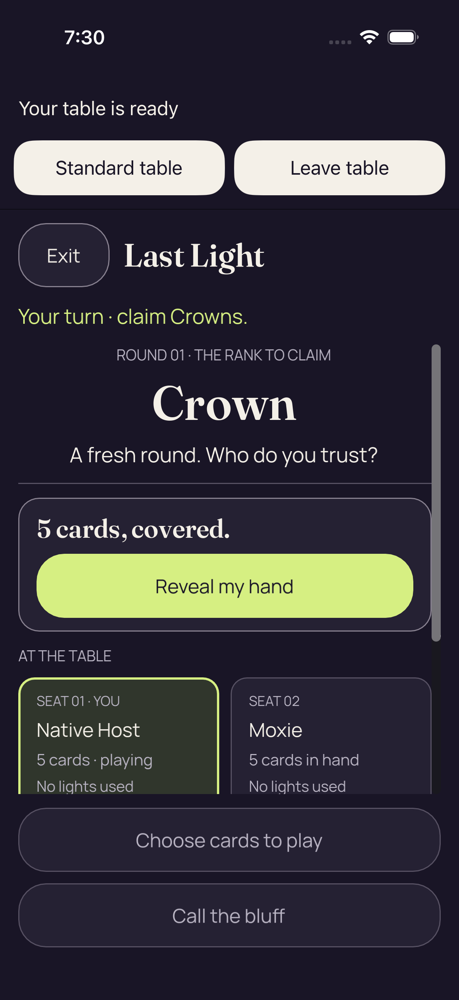
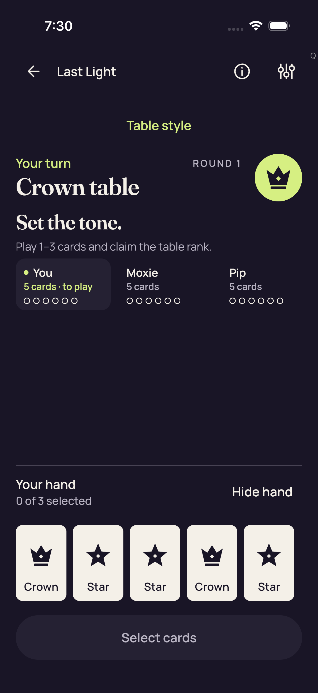
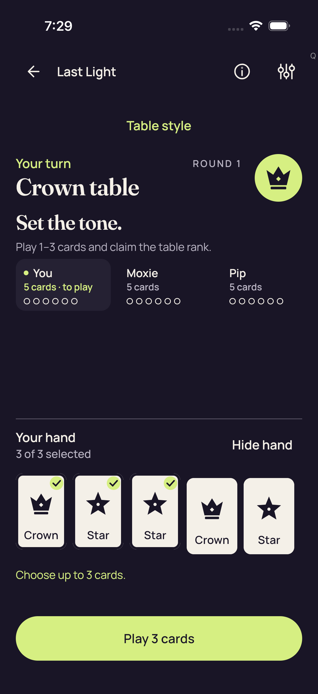
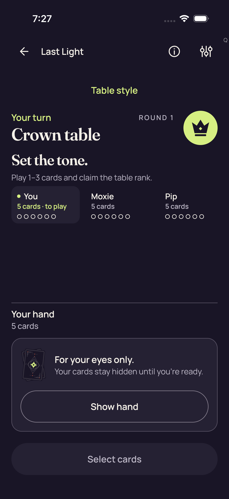
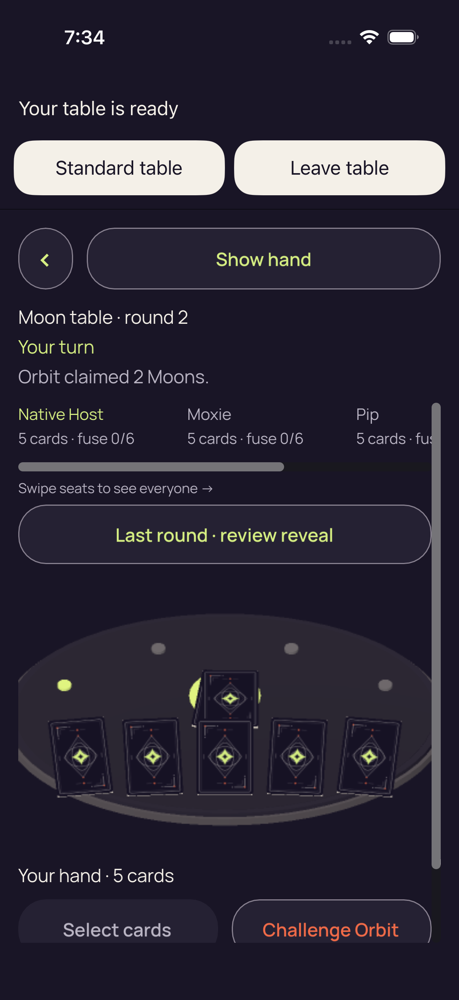
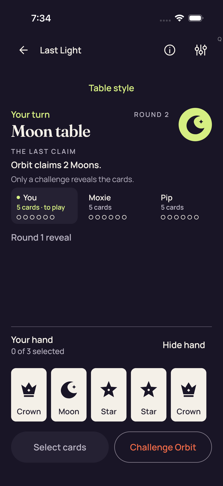
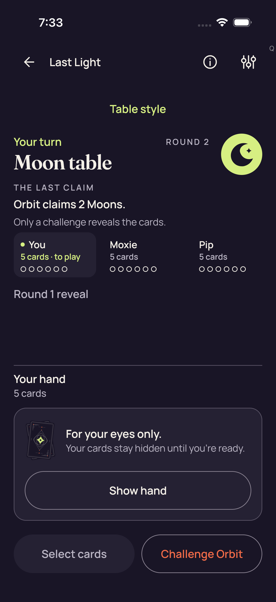
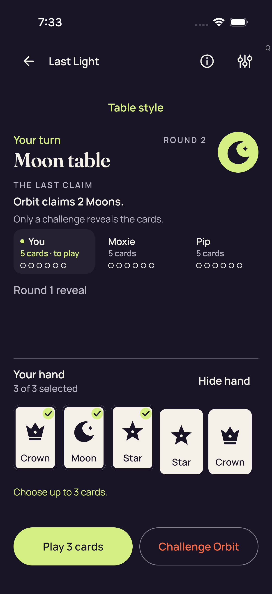

# Production native sessions — iOS CI 34515669045

[All collections](../../README.md) · [Preserved evidence index](../evidence-index.md) · [Copy/review binding](../../android-34515669045/provenance/publication-review/partydeck-gallery-3433-publication-binding-v1.json) · [Completed focused review](../provenance/publication-review/partydeck-gallery-after-2815-combinedios34515669045-visual-review-v1.json) · [Source mapping](../provenance/source-map/partydeck-gallery-after-2815-combinedios34515669045-source-map-v1.json)

**Both native cases fail the second initial-entry freshness wait; later native gameplay remains unreached.**

Original test outcomes and attachment metadata remain distinct from the visual-review method.

Nine ordinary XCTest cases and five unfiltered .all accessibility audits pass. Three guarded UIKit layout cases pass separately and produce zero PNGs. Both actual native production cases fail at the second fresh-frame wait in initial enter(), before native selection/Play/return/Leave/reentry. Production-session Standard checkpoints do not invoke the ordinary .all audit callback. Manual isAssociatedWithFailure=false attachment metadata is preserved and does not imply success.

The compact-pack 2D failure still fits the complete cover/Reveal and both fixed lower actions; the lower first-seat text clips at the body edge. The 3D Moon round-2 failure shows the prior-round review action and covered table, with later seats clipped horizontally and the lower Select cards/Challenge Orbit controls clipped. Two failure originals were directly viewed; 20 other captures remain explicitly unviewed.

Pack SHA-256: `557b2297bed133a433acc25efa4837462465dd4e06da659ae5a4cbd792f77fe0`. Both original videos remain unviewed and undecoded. No hit-area, assistive-technology traversal, continuous-privacy or timeout-cause conclusion follows from these stills. The combined workflow failure belongs to this iOS job; the successful Android job has its own collection. Exact source provenance is derived, with 1,124 omitted historical gallery payloads represented by remote-tree identity only.

Source revision: `0f00f17a398be96aef7bdb58d03074a9914f8232`. CI run: [34515669045](https://github.com/Apdelrahman1911/PartyDeck/actions/runs/34515669045). 12 original PNG identities. Review methods: 2 direct original view, 10 unviewed original — no visual acceptance.

Every thumbnail opens the unchanged original PNG. **UNVIEWED** means no direct pixel review or visual acceptance is asserted. Matching bytes reuse only earlier pixel observations. Each source, scenario and original outcome remains separate. Frozen review plans retain their historical pending flags; the completed focused-review receipt records the final status. No new derivative image or video decoding was performed.

| Original capture | Original identity and evidence | Review status and observation |
| --- | --- | --- |
|  <code>95422A0E-3799-4AEA-B34B-9D1A190713C9.png</code> 2d production smoke failure_0_AE6721A5-E705-492B-8B02-69B5876F0E9A.png | 1206 × 2622 px · 268,163 bytes SHA-256: <code>26943321b143192a56c059338fb79c43005890d78142311f48e376da3749ec5d</code> Source: <code>/root/projects/PartyDeck/artifacts/evidence-storage/ios-validate-34515669045/ios-reports-and-simulator-app/build/ci/ios/godot-session/attachments/95422A0E-3799-4AEA-B34B-9D1A190713C9.png</code> Original case: <code>PartyDeckGodotSessionUITests/testProduction2DPracticeSession()</code> — **failed** Original timestamp: 1789068656.598 [Sanitized observation](attachments/1E8DB933-55BB-48DF-A554-4DE8503CCC14.json) · [Original result](evidence/result.json) · [Attachment index](../companions.md) | **Direct original view**. The compact-pack 2D failure frame shows Your table is ready and full Standard table/Leave table controls, then Exit/Last Light, Your turn · claim Crowns, Round 01/Crown and fresh-round copy. The complete 5 cards, covered panel and Reveal my hand button fit. The first two numbered seats are visible, but the lower No lights used text meets and clips at the body edge. Both muted fixed lower actions fit completely. No private face is visible. This is a rendered failure still from the second entry fresh-frame wait, not evidence that native selection/Play or continuous privacy passed. |
|  <code>9A169874-2A66-4287-92B2-94D0B1F7ACE9.png</code> 2d Standard fresh Reveal is unselected_0_D8B36666-5FBE-4A1F-B082-2897508826F8.png | 1206 × 2622 px · 183,890 bytes SHA-256: <code>1015cbe4f2377067cef2d5192cabc6d9c91a3e89489dfd5639a8716a80bb956b</code> Source: <code>/root/projects/PartyDeck/artifacts/evidence-storage/ios-validate-34515669045/ios-reports-and-simulator-app/build/ci/ios/godot-session/attachments/9A169874-2A66-4287-92B2-94D0B1F7ACE9.png</code> Original case: <code>PartyDeckGodotSessionUITests/testProduction2DPracticeSession()</code> — **failed** Original timestamp: 1789068623.823 [Sanitized observation](attachments/0991C7D8-76E3-483F-8C5E-F61A865F8E15.json) · [Original result](evidence/result.json) · [Attachment index](../companions.md) | **UNVIEWED original — no visual acceptance**. Original capture retained without direct visual review. Its recorded test, label, timestamp and outcome identify the source checkpoint; no pixel observation or visual acceptance is asserted. |
|  <code>70878484-CFC1-48A6-9843-89AAB5AB4CD1.png</code> 2d Standard Hide removes private nodes and selection_0_DD519D87-0DEA-4A1B-A933-96410AAD6447.png | 1206 × 2622 px · 219,484 bytes SHA-256: <code>b59d917c73c66f1c3bea8365c3ea2dc59b781ca0c0ba1d9337746250463f8669</code> Source: <code>/root/projects/PartyDeck/artifacts/evidence-storage/ios-validate-34515669045/ios-reports-and-simulator-app/build/ci/ios/godot-session/attachments/70878484-CFC1-48A6-9843-89AAB5AB4CD1.png</code> Original case: <code>PartyDeckGodotSessionUITests/testProduction2DPracticeSession()</code> — **failed** Original timestamp: 1789068595.617 [Sanitized observation](attachments/014A80D7-8D5E-4A7E-B5D7-3D39DF89173D.json) · [Original result](evidence/result.json) · [Attachment index](../companions.md) | **UNVIEWED original — no visual acceptance**. Original capture retained without direct visual review. Its recorded test, label, timestamp and outcome identify the source checkpoint; no pixel observation or visual acceptance is asserted. |
|  <code>3CBEB18B-090D-4B4A-84F5-22EA8E8F09AF.png</code> 2d Standard maximum selection and count-only feedback_0_F163295F-6709-4DAB-B276-074D47ED89BF.png | 1206 × 2622 px · 205,164 bytes SHA-256: <code>5503118f5b1a178cb949474f38c598ec6bcc4c0b5a5849f90016417fc5e1fb6b</code> Source: <code>/root/projects/PartyDeck/artifacts/evidence-storage/ios-validate-34515669045/ios-reports-and-simulator-app/build/ci/ios/godot-session/attachments/3CBEB18B-090D-4B4A-84F5-22EA8E8F09AF.png</code> Original case: <code>PartyDeckGodotSessionUITests/testProduction2DPracticeSession()</code> — **failed** Original timestamp: 1789068556.774 [Sanitized observation](attachments/1FBB2F1C-6791-4396-ABCE-442F63A86490.json) · [Original result](evidence/result.json) · [Attachment index](../companions.md) | **UNVIEWED original — no visual acceptance**. Original capture retained without direct visual review. Its recorded test, label, timestamp and outcome identify the source checkpoint; no pixel observation or visual acceptance is asserted. |
|  <code>B625B38F-F5B5-4D2E-8270-7028580124B3.png</code> 2d Standard all five native card descriptions_0_B0BE9F49-4EAE-4A73-AE62-3065C83313AC.png | 1206 × 2622 px · 182,875 bytes SHA-256: <code>e1e889fb8350d39484b9144fab390dff3510a79f1f6001c285797d80be40c1f2</code> Source: <code>/root/projects/PartyDeck/artifacts/evidence-storage/ios-validate-34515669045/ios-reports-and-simulator-app/build/ci/ios/godot-session/attachments/B625B38F-F5B5-4D2E-8270-7028580124B3.png</code> Original case: <code>PartyDeckGodotSessionUITests/testProduction2DPracticeSession()</code> — **failed** Original timestamp: 1789068468.246 [Sanitized observation](attachments/4FC7D98B-B3E3-44CB-BA8C-AB1E770A9E7B.json) · [Original result](evidence/result.json) · [Attachment index](../companions.md) | **UNVIEWED original — no visual acceptance**. Original capture retained without direct visual review. Its recorded test, label, timestamp and outcome identify the source checkpoint; no pixel observation or visual acceptance is asserted. |
|  <code>51C3508B-2AEE-4E74-99C2-7CF974E2EB52.png</code> 2d Standard concealed_0_33493302-2833-4182-BE2C-9A3FD4F0B722.png | 1206 × 2622 px · 218,584 bytes SHA-256: <code>7ae9048e86340d9e822ea9a3d457ee1be09dd318eed0aebf8f71947da2deff85</code> Source: <code>/root/projects/PartyDeck/artifacts/evidence-storage/ios-validate-34515669045/ios-reports-and-simulator-app/build/ci/ios/godot-session/attachments/51C3508B-2AEE-4E74-99C2-7CF974E2EB52.png</code> Original case: <code>PartyDeckGodotSessionUITests/testProduction2DPracticeSession()</code> — **failed** Original timestamp: 1789068446.444 [Sanitized observation](attachments/B6906C30-9418-43E0-A4CC-F14DB680ACE2.json) · [Original result](evidence/result.json) · [Attachment index](../companions.md) | **UNVIEWED original — no visual acceptance**. Original capture retained without direct visual review. Its recorded test, label, timestamp and outcome identify the source checkpoint; no pixel observation or visual acceptance is asserted. |
|  <code>06E9D693-2215-4A97-B665-DD7420ADD9F3.png</code> 3d production smoke failure_0_9EF7BAEC-6BE9-4E0D-8556-825E43DB9D9C.png | 1206 × 2622 px · 393,114 bytes SHA-256: <code>912c0e0f87fcaaba1395df4c9a57c6ed7a24d7a62ab0911200f8e3c299cbd425</code> Source: <code>/root/projects/PartyDeck/artifacts/evidence-storage/ios-validate-34515669045/ios-reports-and-simulator-app/build/ci/ios/godot-session/attachments/06E9D693-2215-4A97-B665-DD7420ADD9F3.png</code> Original case: <code>PartyDeckGodotSessionUITests/testProduction3DPracticeSession()</code> — **failed** Original timestamp: 1789068899.116 [Sanitized observation](attachments/C4E2E4B1-544A-475C-AF7B-98575E6D4C83.json) · [Original result](evidence/result.json) · [Attachment index](../companions.md) | **Direct original view**. The 3D failure frame shows the full host controls and Show hand button, Moon table · round 2, Your turn and Orbit claimed 2 Moons. The horizontal seat strip clips later seat details; its scroll affordance and Swipe seats hint are visible. A complete Last round · review reveal button precedes the rendered table, central deck and five card backs. Your hand · 5 cards is visible, while the lower portions of Select cards and Challenge Orbit extend beyond the captured body edge. No private face is visible. The original case still fails at the initial entry second fresh-frame wait; this still establishes neither later native gameplay nor the timeout cause or continuous privacy. |
|  <code>117998F9-1751-4970-95D6-7927F0269519.png</code> 3d Standard fresh Reveal is unselected_0_324A5A0D-B9BF-4066-B9C1-074212DBDC90.png | 1206 × 2622 px · 215,552 bytes SHA-256: <code>74db472fee4e22e116736586a1571e91463a3b92a91ddada3f216f120b3c9d06</code> Source: <code>/root/projects/PartyDeck/artifacts/evidence-storage/ios-validate-34515669045/ios-reports-and-simulator-app/build/ci/ios/godot-session/attachments/117998F9-1751-4970-95D6-7927F0269519.png</code> Original case: <code>PartyDeckGodotSessionUITests/testProduction3DPracticeSession()</code> — **failed** Original timestamp: 1789068848.151 [Sanitized observation](attachments/1B463BBF-0945-46EC-A1F4-6A95CD322230.json) · [Original result](evidence/result.json) · [Attachment index](../companions.md) | **UNVIEWED original — no visual acceptance**. Original capture retained without direct visual review. Its recorded test, label, timestamp and outcome identify the source checkpoint; no pixel observation or visual acceptance is asserted. |
|  <code>75191C0D-824F-4360-AC7A-0E021C0AF771.png</code> 3d Standard Hide removes private nodes and selection_0_428A982B-5FCB-43FE-88D1-09B4DE7F8D4A.png | 1206 × 2622 px · 245,819 bytes SHA-256: <code>97d8ff2c34e9ea16dc8c4a13e273cfe81c90c60f5ac55cdc8e283fc7e546d018</code> Source: <code>/root/projects/PartyDeck/artifacts/evidence-storage/ios-validate-34515669045/ios-reports-and-simulator-app/build/ci/ios/godot-session/attachments/75191C0D-824F-4360-AC7A-0E021C0AF771.png</code> Original case: <code>PartyDeckGodotSessionUITests/testProduction3DPracticeSession()</code> — **failed** Original timestamp: 1789068824.287 [Sanitized observation](attachments/33B1FE99-4A1A-45BE-BC6E-576C914EB7C1.json) · [Original result](evidence/result.json) · [Attachment index](../companions.md) | **UNVIEWED original — no visual acceptance**. Original capture retained without direct visual review. Its recorded test, label, timestamp and outcome identify the source checkpoint; no pixel observation or visual acceptance is asserted. |
|  <code>A4952129-40D4-48EB-818D-8A74E8FC186D.png</code> 3d Standard maximum selection and count-only feedback_0_943111A7-59A5-4C2B-9C1C-E8D3B359CB18.png | 1206 × 2622 px · 236,205 bytes SHA-256: <code>a14a56f41c408c1e534653ddb2652e34156be74606f11e653c038d4a2bad6639</code> Source: <code>/root/projects/PartyDeck/artifacts/evidence-storage/ios-validate-34515669045/ios-reports-and-simulator-app/build/ci/ios/godot-session/attachments/A4952129-40D4-48EB-818D-8A74E8FC186D.png</code> Original case: <code>PartyDeckGodotSessionUITests/testProduction3DPracticeSession()</code> — **failed** Original timestamp: 1789068787.451 [Sanitized observation](attachments/1F90BBC4-8084-459F-A626-130308FF2F30.json) · [Original result](evidence/result.json) · [Attachment index](../companions.md) | **UNVIEWED original — no visual acceptance**. Original capture retained without direct visual review. Its recorded test, label, timestamp and outcome identify the source checkpoint; no pixel observation or visual acceptance is asserted. |
|  <code>A7D0ABF0-0620-4D3E-90A4-66596552D554.png</code> 3d Standard all five native card descriptions_0_6AF0BB8A-69EE-41A8-ACF9-54AAC58FB651.png | 1206 × 2622 px · 215,728 bytes SHA-256: <code>aae3f2458997cd25e40e47f2b475a9a044c34713234e33da9795a20817ea3292</code> Source: <code>/root/projects/PartyDeck/artifacts/evidence-storage/ios-validate-34515669045/ios-reports-and-simulator-app/build/ci/ios/godot-session/attachments/A7D0ABF0-0620-4D3E-90A4-66596552D554.png</code> Original case: <code>PartyDeckGodotSessionUITests/testProduction3DPracticeSession()</code> — **failed** Original timestamp: 1789068722.115 [Sanitized observation](attachments/80CE460D-DF8E-4721-8C8B-4270CEC04471.json) · [Original result](evidence/result.json) · [Attachment index](../companions.md) | **UNVIEWED original — no visual acceptance**. Original capture retained without direct visual review. Its recorded test, label, timestamp and outcome identify the source checkpoint; no pixel observation or visual acceptance is asserted. |
|  <code>F6833C57-063B-408E-ADD8-CD7F787B3AB9.png</code> 3d Standard concealed_0_9CB58CB6-FADF-4501-959F-8065B1E14625.png | 1206 × 2622 px · 245,837 bytes SHA-256: <code>9444ca1c2f56bd1943e9aefdd027d7c2aa83dd093e80a1224f5af45913373ce3</code> Source: <code>/root/projects/PartyDeck/artifacts/evidence-storage/ios-validate-34515669045/ios-reports-and-simulator-app/build/ci/ios/godot-session/attachments/F6833C57-063B-408E-ADD8-CD7F787B3AB9.png</code> Original case: <code>PartyDeckGodotSessionUITests/testProduction3DPracticeSession()</code> — **failed** Original timestamp: 1789068699.355 [Sanitized observation](attachments/B2E1A3C3-8AD1-4CA3-AC97-CEED395E4891.json) · [Original result](evidence/result.json) · [Attachment index](../companions.md) | **UNVIEWED original — no visual acceptance**. Original capture retained without direct visual review. Its recorded test, label, timestamp and outcome identify the source checkpoint; no pixel observation or visual acceptance is asserted. |
