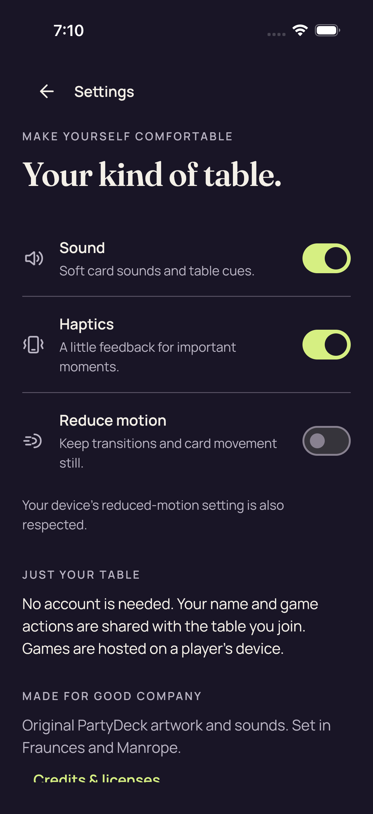
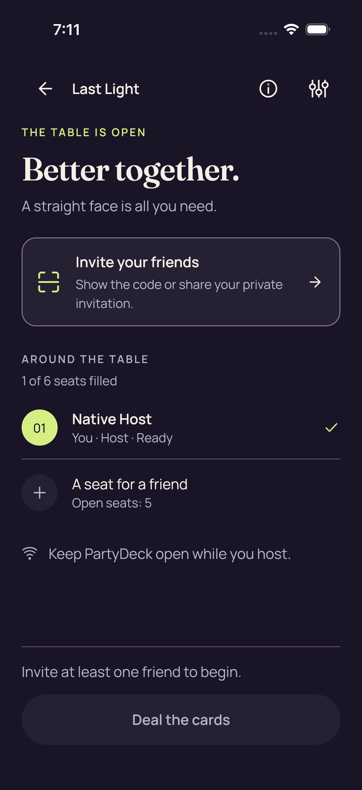
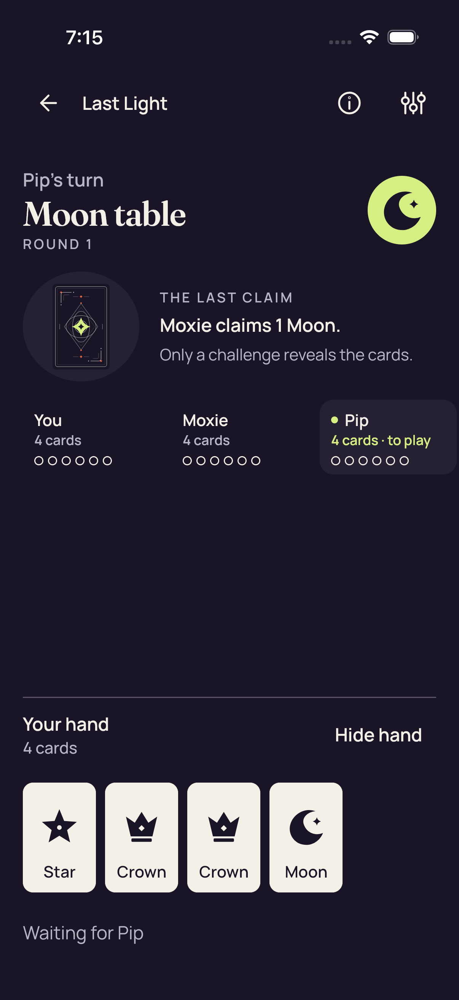
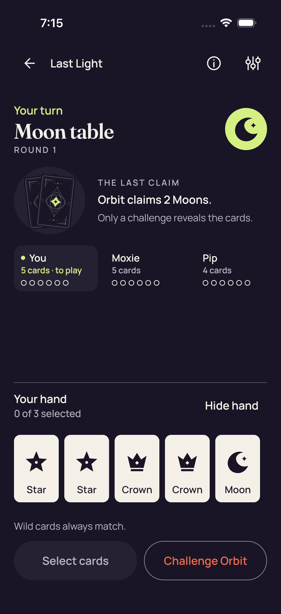
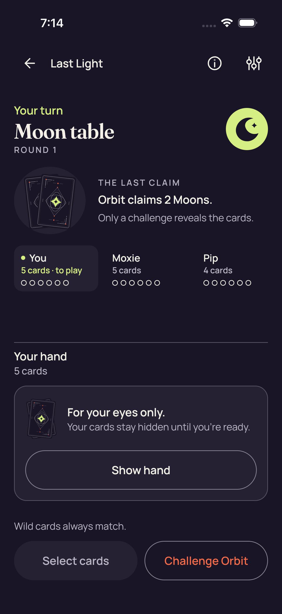
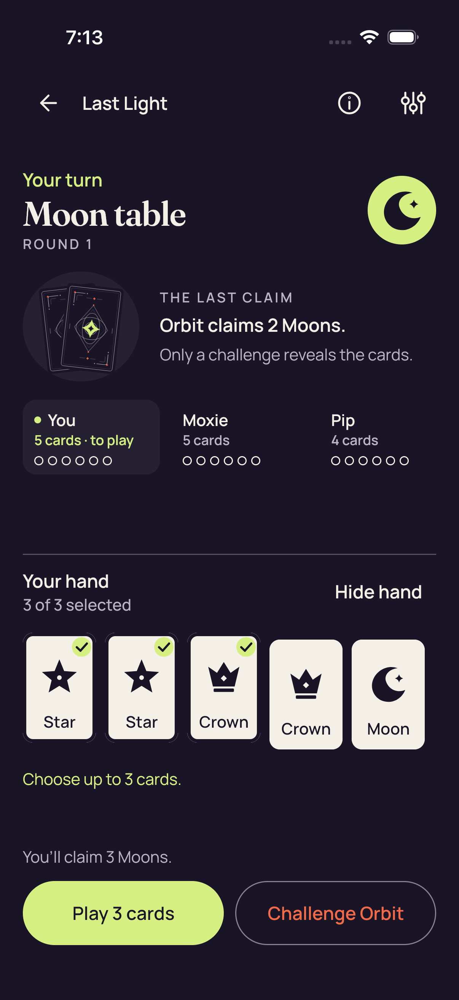
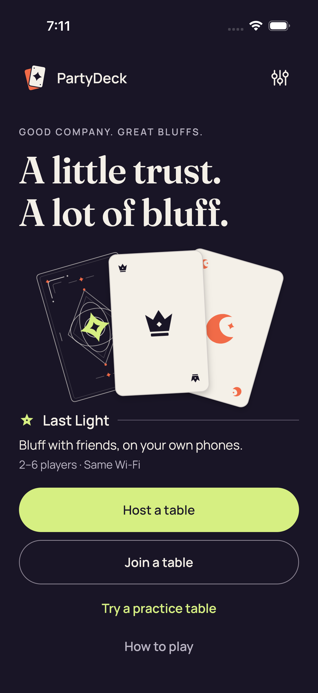

# Ordinary shared UI — iOS CI 34515669045

[All collections](../../README.md) · [Preserved evidence index](../evidence-index.md) · [Copy/review binding](../../android-34515669045/provenance/publication-review/partydeck-gallery-3433-publication-binding-v1.json) · [Completed focused review](../provenance/publication-review/partydeck-gallery-after-2815-combinedios34515669045-visual-review-v1.json) · [Source mapping](../provenance/source-map/partydeck-gallery-after-2815-combinedios34515669045-source-map-v1.json)

**Nine ordinary cases and five unfiltered .all audits pass; pixel review remains individually scoped.**

Original test outcomes and attachment metadata remain distinct from the visual-review method.

Nine ordinary XCTest cases and five unfiltered .all accessibility audits pass. Three guarded UIKit layout cases pass separately and produce zero PNGs. Both actual native production cases fail at the second fresh-frame wait in initial enter(), before native selection/Play/return/Leave/reentry. Production-session Standard checkpoints do not invoke the ordinary .all audit callback. Manual isAssociatedWithFailure=false attachment metadata is preserved and does not imply success.

The compact-pack 2D failure still fits the complete cover/Reveal and both fixed lower actions; the lower first-seat text clips at the body edge. The 3D Moon round-2 failure shows the prior-round review action and covered table, with later seats clipped horizontally and the lower Select cards/Challenge Orbit controls clipped. Two failure originals were directly viewed; 20 other captures remain explicitly unviewed.

Pack SHA-256: `557b2297bed133a433acc25efa4837462465dd4e06da659ae5a4cbd792f77fe0`. Both original videos remain unviewed and undecoded. No hit-area, assistive-technology traversal, continuous-privacy or timeout-cause conclusion follows from these stills. The combined workflow failure belongs to this iOS job; the successful Android job has its own collection. Exact source provenance is derived, with 1,124 omitted historical gallery payloads represented by remote-tree identity only.

Source revision: `0f00f17a398be96aef7bdb58d03074a9914f8232`. CI run: [34515669045](https://github.com/Apdelrahman1911/PartyDeck/actions/runs/34515669045). 10 original PNG identities. Review methods: 10 unviewed original — no visual acceptance.

Every thumbnail opens the unchanged original PNG. **UNVIEWED** means no direct pixel review or visual acceptance is asserted. Matching bytes reuse only earlier pixel observations. Each source, scenario and original outcome remains separate. Frozen review plans retain their historical pending flags; the completed focused-review receipt records the final status. No new derivative image or video decoding was performed.

| Original capture | Original identity and evidence | Review status and observation |
| --- | --- | --- |
|  <code>FDAC960C-FF43-4873-9E62-E4B453CCA2DC.png</code> Settings_0_928999D3-3CC8-4E93-A74C-F960638B3AB4.png | 1206 × 2622 px · 287,622 bytes SHA-256: <code>fe402f4a44d9c00caf82ad034a2ec8c8aedaec0244194930fa802d1d1b5a503a</code> Source: <code>/root/projects/PartyDeck/artifacts/evidence-storage/ios-validate-34515669045/ios-reports-and-simulator-app/build/ci/ios/attachments/FDAC960C-FF43-4873-9E62-E4B453CCA2DC.png</code> Original case: <code>PartyDeckUITests/testNativeHostCanNavigateSharedSettings()</code> — **passed** Original timestamp: 1789067445.589 [Attachment index](../companions.md) | **UNVIEWED original — no visual acceptance**. Original capture retained without direct visual review. Its recorded test, label, timestamp and outcome identify the source checkpoint; no pixel observation or visual acceptance is asserted. |
|  <code>55CFA218-4E3C-421C-990F-1AB713372CC9.png</code> Native host invitation closed_0_5DB0A3F6-8EEF-4DC1-B423-165DB897B9A9.png | 1206 × 2622 px · 222,611 bytes SHA-256: <code>cf2afea722bd0bf6b02608e2c7c25f4f27cc71cf823738251b2d0a6e27fbc6ac</code> Source: <code>/root/projects/PartyDeck/artifacts/evidence-storage/ios-validate-34515669045/ios-reports-and-simulator-app/build/ci/ios/attachments/55CFA218-4E3C-421C-990F-1AB713372CC9.png</code> Original case: <code>PartyDeckUITests/testSharedControllerHostsANativeTableAndShowsItsInvitation()</code> — **passed** Original timestamp: 1789067482.188 [Attachment index](../companions.md) | **UNVIEWED original — no visual acceptance**. Original capture retained without direct visual review. Its recorded test, label, timestamp and outcome identify the source checkpoint; no pixel observation or visual acceptance is asserted. |
|  <code>6BF8638D-9D32-448E-BA84-6F434B607F1B.png</code> Native host lobby_0_B87C66E5-7E9B-440C-8A14-263F446B4284.png | 1206 × 2622 px · 222,611 bytes SHA-256: <code>cf2afea722bd0bf6b02608e2c7c25f4f27cc71cf823738251b2d0a6e27fbc6ac</code> Source: <code>/root/projects/PartyDeck/artifacts/evidence-storage/ios-validate-34515669045/ios-reports-and-simulator-app/build/ci/ios/attachments/6BF8638D-9D32-448E-BA84-6F434B607F1B.png</code> Original case: <code>PartyDeckUITests/testSharedControllerHostsANativeTableAndShowsItsInvitation()</code> — **passed** Original timestamp: 1789067475.008 [Attachment index](../companions.md) | **UNVIEWED original — no visual acceptance**. Original capture retained without direct visual review. Its recorded test, label, timestamp and outcome identify the source checkpoint; no pixel observation or visual acceptance is asserted. |
|  <code>9C78FC3D-C0BF-4AD2-BCCB-DD9E1041F6FC.png</code> Practice after accepted play_0_544B066C-3AE6-4ABF-918F-3EAF8D689835.png | 1206 × 2622 px · 196,923 bytes SHA-256: <code>c82b18ac732e037cc4b1987bcddb6bb59e498fbfa5077ecc8010a7f602ac4864</code> Source: <code>/root/projects/PartyDeck/artifacts/evidence-storage/ios-validate-34515669045/ios-reports-and-simulator-app/build/ci/ios/attachments/9C78FC3D-C0BF-4AD2-BCCB-DD9E1041F6FC.png</code> Original case: <code>PartyDeckUITests/testSharedHomeOpensAPlayablePracticeTable()</code> — **passed** Original timestamp: 1789067734.595 [Attachment index](../companions.md) | **UNVIEWED original — no visual acceptance**. Original capture retained without direct visual review. Its recorded test, label, timestamp and outcome identify the source checkpoint; no pixel observation or visual acceptance is asserted. |
|  <code>CA2FB34D-FE31-4FE8-865B-8F1764292E5E.png</code> Practice Standard fresh Reveal is unselected_0_179BAC04-AD1B-4BC5-AA4E-3EE1685998F0.png | 1206 × 2622 px · 249,510 bytes SHA-256: <code>b96eee36f821428da1147a8d451bef4cc028a755264e62606abbb62a7f48741c</code> Source: <code>/root/projects/PartyDeck/artifacts/evidence-storage/ios-validate-34515669045/ios-reports-and-simulator-app/build/ci/ios/attachments/CA2FB34D-FE31-4FE8-865B-8F1764292E5E.png</code> Original case: <code>PartyDeckUITests/testSharedHomeOpensAPlayablePracticeTable()</code> — **passed** Original timestamp: 1789067702.734 [Attachment index](../companions.md) | **UNVIEWED original — no visual acceptance**. Original capture retained without direct visual review. Its recorded test, label, timestamp and outcome identify the source checkpoint; no pixel observation or visual acceptance is asserted. |
|  <code>EA590A3B-9F1A-479A-8209-731E208B821F.png</code> Practice Standard Hide removes private nodes and selection_0_3919F332-C0BE-451C-BEC2-AAF89824BA84.png | 1206 × 2622 px · 280,886 bytes SHA-256: <code>e8d4df41d3e4aeefe11d4c3cc5f4b98250fa2a0fb8cba8f0ecc65789b56ab48f</code> Source: <code>/root/projects/PartyDeck/artifacts/evidence-storage/ios-validate-34515669045/ios-reports-and-simulator-app/build/ci/ios/attachments/EA590A3B-9F1A-479A-8209-731E208B821F.png</code> Original case: <code>PartyDeckUITests/testSharedHomeOpensAPlayablePracticeTable()</code> — **passed** Original timestamp: 1789067674.016 [Attachment index](../companions.md) | **UNVIEWED original — no visual acceptance**. Original capture retained without direct visual review. Its recorded test, label, timestamp and outcome identify the source checkpoint; no pixel observation or visual acceptance is asserted. |
|  <code>3182014C-2509-4DC2-A35E-ACC85E03299B.png</code> Practice Standard maximum selection and count-only feedback_0_A76DD99F-FDAA-4464-8F9D-4A6AA4F2B3B2.png | 1206 × 2622 px · 264,001 bytes SHA-256: <code>895ff35151c1827372f3da04d9e36ee6a017d75196d80857b9077bf97be2ba41</code> Source: <code>/root/projects/PartyDeck/artifacts/evidence-storage/ios-validate-34515669045/ios-reports-and-simulator-app/build/ci/ios/attachments/3182014C-2509-4DC2-A35E-ACC85E03299B.png</code> Original case: <code>PartyDeckUITests/testSharedHomeOpensAPlayablePracticeTable()</code> — **passed** Original timestamp: 1789067635.995 [Attachment index](../companions.md) | **UNVIEWED original — no visual acceptance**. Original capture retained without direct visual review. Its recorded test, label, timestamp and outcome identify the source checkpoint; no pixel observation or visual acceptance is asserted. |
|  <code>431AA462-4A26-4E27-AA4E-3335BB8F9E8A.png</code> Practice Standard all five native card descriptions_0_351B3F7D-E70E-4D5A-97F3-6BA53D6826D2.png | 1206 × 2622 px · 249,414 bytes SHA-256: <code>e94dc2f795b2555e5427f56170901cd7879d8c3a96618cf36ad5b222ea173213</code> Source: <code>/root/projects/PartyDeck/artifacts/evidence-storage/ios-validate-34515669045/ios-reports-and-simulator-app/build/ci/ios/attachments/431AA462-4A26-4E27-AA4E-3335BB8F9E8A.png</code> Original case: <code>PartyDeckUITests/testSharedHomeOpensAPlayablePracticeTable()</code> — **passed** Original timestamp: 1789067549.558 [Attachment index](../companions.md) | **UNVIEWED original — no visual acceptance**. Original capture retained without direct visual review. Its recorded test, label, timestamp and outcome identify the source checkpoint; no pixel observation or visual acceptance is asserted. |
|  <code>319863DC-1F6C-4284-9A1C-6A58B39597A6.png</code> Practice Standard concealed_0_BC76F2E7-C88B-4D40-BFD6-FE12E6F248FB.png | 1206 × 2622 px · 281,186 bytes SHA-256: <code>fbc835bac2979a828ad6d03441b095c0de1bd3cd82e637ca1c6ecdf142396ab2</code> Source: <code>/root/projects/PartyDeck/artifacts/evidence-storage/ios-validate-34515669045/ios-reports-and-simulator-app/build/ci/ios/attachments/319863DC-1F6C-4284-9A1C-6A58B39597A6.png</code> Original case: <code>PartyDeckUITests/testSharedHomeOpensAPlayablePracticeTable()</code> — **passed** Original timestamp: 1789067523.984 [Attachment index](../companions.md) | **UNVIEWED original — no visual acceptance**. Original capture retained without direct visual review. Its recorded test, label, timestamp and outcome identify the source checkpoint; no pixel observation or visual acceptance is asserted. |
|  <code>AD093EBF-4ED8-4B66-9BFA-FF23844B7901.png</code> Home_0_7F4F572D-87E0-4A82-AD6C-474C23218FAB.png | 1206 × 2622 px · 296,412 bytes SHA-256: <code>dfc6a54d01d759f731817f6e4801bf1828617fdb1fecae4949919b7d18239a87</code> Source: <code>/root/projects/PartyDeck/artifacts/evidence-storage/ios-validate-34515669045/ios-reports-and-simulator-app/build/ci/ios/attachments/AD093EBF-4ED8-4B66-9BFA-FF23844B7901.png</code> Original case: <code>PartyDeckUITests/testSharedHomeOpensAPlayablePracticeTable()</code> — **passed** Original timestamp: 1789067512.504 [Attachment index](../companions.md) | **UNVIEWED original — no visual acceptance**. Original capture retained without direct visual review. Its recorded test, label, timestamp and outcome identify the source checkpoint; no pixel observation or visual acceptance is asserted. |
