# Production native sessions — iOS CI 34520365907

[All collections](../../README.md) · [Preserved evidence](../evidence-index.md) · [Copy/review binding](../../godot-ios-retained-34520375602/provenance/publication-review/publication-binding.json) · [Completed focused review](../provenance/publication-review/partydeck-gallery-after-3433-production34520365907-visual-review-v1.json) · [Frozen source mapping](../provenance/source-map/partydeck-gallery-after-3433-production34520365907-source-map-v1.json)

**Both native cases pass entry, selection, Hide and accepted Play, then fail Standard return.**

Original named XCTest outcomes remain separate from screenshot observations.

The frozen c65e264 run passes 156 shared-native tests, nine ordinary XCTest cases and five unfiltered .all audits. The separate guarded UIKit gate passes all three cases and contributes no PNGs. Both production native cases pass concealed entry, native selection, Hide and real authority-accepted native Play, then fail during Standard return. Production Standard checkpoints do not invoke the ordinary accessibility audit callback. The 2D read fails health through port.quarantined=true with lastCloseSucceeded=false. The 3D first dormant predicate fails solely on authorityForegroundGrant=true, despite successful close, dormant native state and matching retained identities.

Six production originals were directly reviewed; 24 other originals remain explicitly unviewed. The 2D selected hand clips horizontally while full Claim 1 Crown fits. Its accepted-Play checkpoint is a public Crown result with full Deal the next round and clipped lower seat details. The native 3D selected checkpoint shows five face-up cards/count 5; its later accepted-Play checkpoint shows four backs/count 4. Both failure stills display Standard UI. The 2D result has a toast over the lower fuse panel and only the top of the continuation action visible; the 3D failure shows a concealed four-card hand/count and full Show hand/Select cards/Challenge Orbit. Native 3D selected lower button edges and the later Return to lobby remain clipped. No complete remaining 2D hand or remaining 3D face identities are shown.

All 30 original PNGs, all 121 non-PNG attachment companions and both original attachment manifests are preserved. The 121 companions comprise 33 JSONs, 86 extensionless UI/event payloads and two unviewed/undecoded MP4s. Exactly 20 JSONs are the supplied sanitized companions paired with the 20 production PNGs. The final archive reconciliation and logical/physical storage aliases are retained. Both native cases ran once and failed; manual isAssociatedWithFailure=false metadata does not imply success.

Original compact MSAA_2X PCK: `557b2297bed133a433acc25efa4837462465dd4e06da659ae5a4cbd792f77fe0`, 1,549,560 bytes. The preserved close audit verifies 294 raw AX references against original stream offsets. Fourteen 2D observations show covered, noninteractive empty-tree cleanup with an attached native surface and fixed frame/draw/iteration counters before quarantine. The 3D failure retains the stale authority grant after successful close. Source order and observed states do not log exact UIKit-stop/Swift-timeout callback interleaving. PNG timestamps reuse lastDocument and do not measure close duration. No continuous privacy, assistive-technology traversal or native qualification follows from these stills.

Source revision: `c65e264892ad21ecd8b7f8fba8bc3ae441ab3137`. CI run: [34520365907](https://github.com/Apdelrahman1911/PartyDeck/actions/runs/34520365907). 20 separate original PNGs. Review methods: 6 direct original view by review_design, 14 unviewed original — no visual acceptance.

Every thumbnail opens the unchanged original PNG. **UNVIEWED** means no direct pixel review or visual acceptance is asserted. Byte matching reuses only the earlier reviewed pixels; each execution, scenario and result remains separate. Frozen plans retain their historical pending flags; the completed review records final publication status. No image was recaptured or transformed, and no video was decoded.

| Original capture | Original identity and evidence | Review status and observation |
| --- | --- | --- |
| <a href="attachments/B15684DB-9862-4AB7-8633-4BDE09B2CA07.png">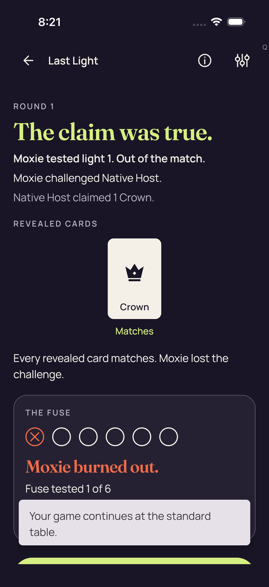</a> <code>B15684DB-9862-4AB7-8633-4BDE09B2CA07.png</code> 2d production smoke failure_0_01C8F49C-FB3C-4F42-A7C3-7BDFF37144A8.png | 1206 × 2622 px · 229,666 bytes SHA-256: <code>17b94a05809af2c7be8772ec0c492e3b399f72bd0b2ccdf81872870be6995945</code> Source: <code>/root/projects/PartyDeck/artifacts/evidence-storage/ios-validate-34520365907/ios-reports-and-simulator-app/build/ci/ios/godot-session/attachments/B15684DB-9862-4AB7-8633-4BDE09B2CA07.png</code> Original case: <code>PartyDeckGodotSessionUITests/testProduction2DPracticeSession()</code> — **failed** Original attachment timestamp: 1789071690.645 [Sanitized observation](attachments/5CFEA3BD-32C9-4FB0-8326-16419BE670CC.json) · [Original result](evidence/result.json) · [Attachment index](../companions.md) | **Direct original view by review_design**. The 2D Standard-return failure still displays the Standard Round 1 public result: The claim was true, Moxie tested light 1 and is out of the match, Native Host claimed 1 Crown, and a Crown marked Matches. The fuse panel and one-of-six result are readable. A Your game continues at the standard table toast overlaps the lower fuse panel; only the top edge of a lime continuation action is visible at the bottom, with its label outside the viewport. Visible Standard UI does not negate the failed health check. |
| <a href="attachments/64A35242-9497-4079-A617-AB24910324F1.png">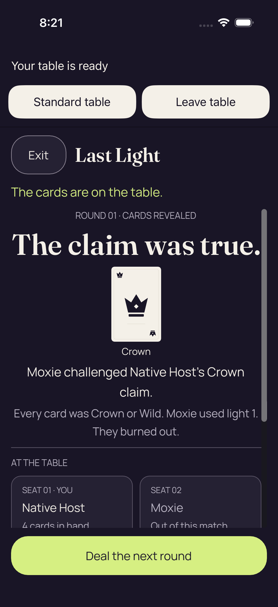</a> <code>64A35242-9497-4079-A617-AB24910324F1.png</code> 2d real authority accepted native Play_0_F045C8A4-79F1-49C3-9238-9544A5882AF3.png | 1206 × 2622 px · 262,898 bytes SHA-256: <code>afca793ac64ad9ce9c34f3b3c19b912f5111ee6a057a55179fa3e3795bf22105</code> Source: <code>/root/projects/PartyDeck/artifacts/evidence-storage/ios-validate-34520365907/ios-reports-and-simulator-app/build/ci/ios/godot-session/attachments/64A35242-9497-4079-A617-AB24910324F1.png</code> Original case: <code>PartyDeckGodotSessionUITests/testProduction2DPracticeSession()</code> — **failed** Original attachment timestamp: 1789071683.976 [Sanitized observation](attachments/4FE5E8C5-1829-4D91-8108-34DC4C95AD57.json) · [Original result](evidence/result.json) · [Attachment index](../companions.md) | **Direct original view by review_design**. The native 2D accepted-Play checkpoint shows Round 01, The claim was true, a public Crown and the readable account that Moxie challenged Native Host, used light 1 and burned out. Deal the next round is fully visible. Numbered Native Host and Moxie seat panels are visible, while their lower count/status lines clip at the body edge. No complete remaining private hand is shown. |
| <a href="attachments/31192652-1020-474E-94D3-3D7DED441954.png">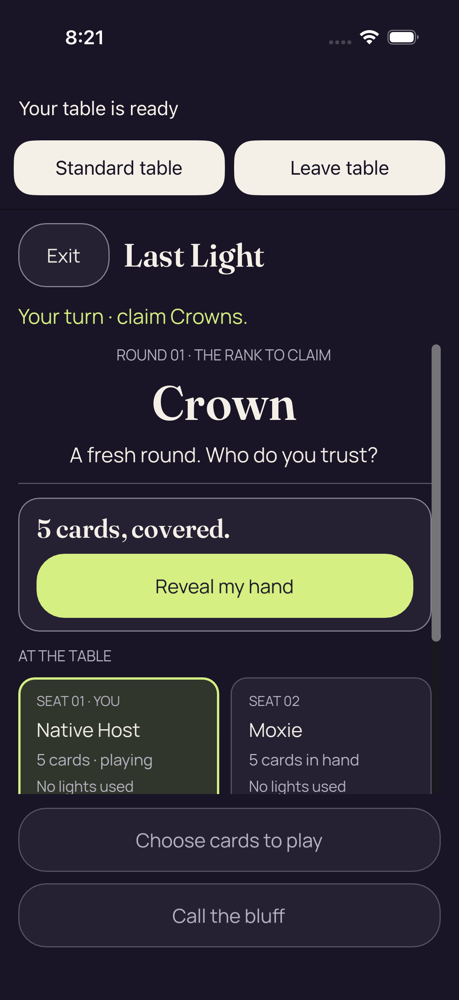</a> <code>31192652-1020-474E-94D3-3D7DED441954.png</code> 2d Hide removes private faces labels and selection_0_13052DDB-96E3-4E2F-AC19-C45D28F4F639.png | 1206 × 2622 px · 267,898 bytes SHA-256: <code>d599a703f47dd5ba5a001b5bac1a13ebfc04d5d72d05372f59f3e39b8c03d914</code> Source: <code>/root/projects/PartyDeck/artifacts/evidence-storage/ios-validate-34520365907/ios-reports-and-simulator-app/build/ci/ios/godot-session/attachments/31192652-1020-474E-94D3-3D7DED441954.png</code> Original case: <code>PartyDeckGodotSessionUITests/testProduction2DPracticeSession()</code> — **failed** Original attachment timestamp: 1789071673.828 [Sanitized observation](attachments/5340456C-B2AC-4A8F-8838-8FF9B2AD138F.json) · [Original result](evidence/result.json) · [Attachment index](../companions.md) | **UNVIEWED original — no visual acceptance**. Original capture retained without direct visual review. Its recorded case, label, timestamp and outcome identify the source checkpoint; no pixel observation or visual acceptance is asserted. |
| <a href="attachments/9CB82E70-B429-4F26-B591-6F836859CA14.png">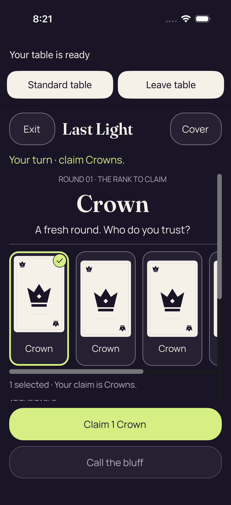</a> <code>9CB82E70-B429-4F26-B591-6F836859CA14.png</code> 2d real native card selection_0_447FB1C6-E1F1-4F2C-9B54-50CD002108B7.png | 1206 × 2622 px · 237,124 bytes SHA-256: <code>61a878b675fbdf325f58c032e11ac10a119b177bb4ae48403f05b670e931082c</code> Source: <code>/root/projects/PartyDeck/artifacts/evidence-storage/ios-validate-34520365907/ios-reports-and-simulator-app/build/ci/ios/godot-session/attachments/9CB82E70-B429-4F26-B591-6F836859CA14.png</code> Original case: <code>PartyDeckGodotSessionUITests/testProduction2DPracticeSession()</code> — **failed** Original attachment timestamp: 1789071670.899 [Sanitized observation](attachments/91DA3E3D-D574-4898-B190-490D97FE9DFD.json) · [Original result](evidence/result.json) · [Attachment index](../companions.md) | **Direct original view by review_design**. The native 2D selected-hand frame shows Your turn, Crown round 01 and three complete Crown cards, with part of the next card clipped horizontally. The first Crown has a lime border and check. One selected and the Crown claim are readable. Full Claim 1 Crown and disabled Call the bluff controls fit below the scroll area; the At the table heading is clipped at its lower edge. The complete five-card hand is not visible. |
|  <code>08369F79-6331-4360-9869-74A7E9BE8D83.png</code> 2d production concealed entry_0_6E676FDC-2ADE-4BA0-A269-048A28623A2D.png | 1206 × 2622 px · 267,898 bytes SHA-256: <code>d599a703f47dd5ba5a001b5bac1a13ebfc04d5d72d05372f59f3e39b8c03d914</code> Source: <code>/root/projects/PartyDeck/artifacts/evidence-storage/ios-validate-34520365907/ios-reports-and-simulator-app/build/ci/ios/godot-session/attachments/08369F79-6331-4360-9869-74A7E9BE8D83.png</code> Original case: <code>PartyDeckGodotSessionUITests/testProduction2DPracticeSession()</code> — **failed** Original attachment timestamp: 1789071661.827 [Sanitized observation](attachments/481AD674-A910-4510-A668-F7A5E9117643.json) · [Original result](evidence/result.json) · [Attachment index](../companions.md) | **UNVIEWED original — no visual acceptance**. Original capture retained without direct visual review. Its recorded case, label, timestamp and outcome identify the source checkpoint; no pixel observation or visual acceptance is asserted. |
|  <code>D52CECD5-8641-464F-BFFA-9A205CA320FA.png</code> 2d Standard fresh Reveal is unselected_0_8FB3B5CD-4842-4843-A25B-99C0B7130D2F.png | 1206 × 2622 px · 188,301 bytes SHA-256: <code>4945ed4ae09cb73b6d52550e793e1c0e1d99911a812c5cd4e347e4f81d940014</code> Source: <code>/root/projects/PartyDeck/artifacts/evidence-storage/ios-validate-34520365907/ios-reports-and-simulator-app/build/ci/ios/godot-session/attachments/D52CECD5-8641-464F-BFFA-9A205CA320FA.png</code> Original case: <code>PartyDeckGodotSessionUITests/testProduction2DPracticeSession()</code> — **failed** Original attachment timestamp: 1789071639.961 [Sanitized observation](attachments/E1A38E8E-BEA7-4F70-9623-D4040D5E1FD3.json) · [Original result](evidence/result.json) · [Attachment index](../companions.md) | **UNVIEWED original — no visual acceptance**. Original capture retained without direct visual review. Its recorded case, label, timestamp and outcome identify the source checkpoint; no pixel observation or visual acceptance is asserted. |
| <a href="attachments/45BD9E51-B535-4C10-A7D2-D0488F5B5009.png">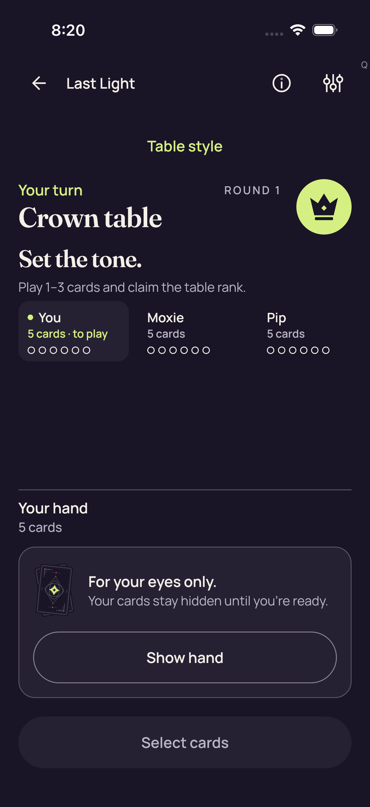</a> <code>45BD9E51-B535-4C10-A7D2-D0488F5B5009.png</code> 2d Standard Hide removes private nodes and selection_0_AE429E3C-A32F-482E-A8E1-00F54F2936E2.png | 1206 × 2622 px · 220,087 bytes SHA-256: <code>33678b510da33344c3cea632d5f59b70bf90cc302cf01d8b05602345b5731908</code> Source: <code>/root/projects/PartyDeck/artifacts/evidence-storage/ios-validate-34520365907/ios-reports-and-simulator-app/build/ci/ios/godot-session/attachments/45BD9E51-B535-4C10-A7D2-D0488F5B5009.png</code> Original case: <code>PartyDeckGodotSessionUITests/testProduction2DPracticeSession()</code> — **failed** Original attachment timestamp: 1789071610.708 [Sanitized observation](attachments/809E4F8D-C61E-494D-9FE1-A31728FAA53C.json) · [Original result](evidence/result.json) · [Attachment index](../companions.md) | **UNVIEWED original — no visual acceptance**. Original capture retained without direct visual review. Its recorded case, label, timestamp and outcome identify the source checkpoint; no pixel observation or visual acceptance is asserted. |
| <a href="attachments/A653E056-C730-4078-AF37-E660F90B7E3F.png">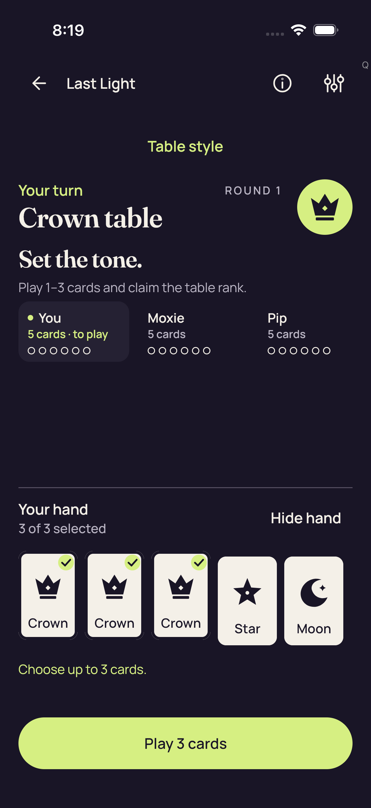</a> <code>A653E056-C730-4078-AF37-E660F90B7E3F.png</code> 2d Standard maximum selection and count-only feedback_0_CA4DD726-6A09-4B4F-B911-11A37FC555F4.png | 1206 × 2622 px · 202,295 bytes SHA-256: <code>c651184eb8bc1942bbf5d3e1d3f181d19658ed626ff12b805bbcf2a620e93aa2</code> Source: <code>/root/projects/PartyDeck/artifacts/evidence-storage/ios-validate-34520365907/ios-reports-and-simulator-app/build/ci/ios/godot-session/attachments/A653E056-C730-4078-AF37-E660F90B7E3F.png</code> Original case: <code>PartyDeckGodotSessionUITests/testProduction2DPracticeSession()</code> — **failed** Original attachment timestamp: 1789071580.419 [Sanitized observation](attachments/3CEE6136-76ED-41BC-83DA-B887DF974DD6.json) · [Original result](evidence/result.json) · [Attachment index](../companions.md) | **UNVIEWED original — no visual acceptance**. Original capture retained without direct visual review. Its recorded case, label, timestamp and outcome identify the source checkpoint; no pixel observation or visual acceptance is asserted. |
| <a href="attachments/CB7BB887-6FF8-45E2-9576-5D49E3873BEC.png">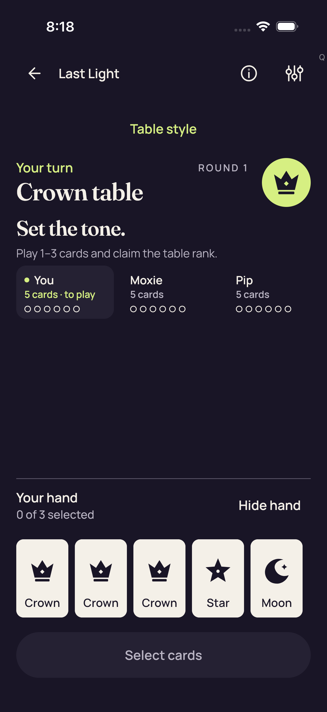</a> <code>CB7BB887-6FF8-45E2-9576-5D49E3873BEC.png</code> 2d Standard all five native card descriptions_0_3D25E8C8-E167-4EEB-8D9A-4190232193E6.png | 1206 × 2622 px · 186,857 bytes SHA-256: <code>4c25fdf687bc60f1d67c36622d2cbf95b5bcd225b17db9a76cb1256b85e4352a</code> Source: <code>/root/projects/PartyDeck/artifacts/evidence-storage/ios-validate-34520365907/ios-reports-and-simulator-app/build/ci/ios/godot-session/attachments/CB7BB887-6FF8-45E2-9576-5D49E3873BEC.png</code> Original case: <code>PartyDeckGodotSessionUITests/testProduction2DPracticeSession()</code> — **failed** Original attachment timestamp: 1789071501.953 [Sanitized observation](attachments/C663F738-75A2-4B67-8B78-ABE56E2DBFC6.json) · [Original result](evidence/result.json) · [Attachment index](../companions.md) | **UNVIEWED original — no visual acceptance**. Original capture retained without direct visual review. Its recorded case, label, timestamp and outcome identify the source checkpoint; no pixel observation or visual acceptance is asserted. |
|  <code>1B5BE4EF-A5BE-4D29-B489-6FEE60AAE191.png</code> 2d Standard concealed_0_92423C2C-284B-432F-9BAA-54B45223C60E.png | 1206 × 2622 px · 218,851 bytes SHA-256: <code>5975e6a809ccb61a8bafb750a1e810ccbcab547c662d006a1002863e0e61be9e</code> Source: <code>/root/projects/PartyDeck/artifacts/evidence-storage/ios-validate-34520365907/ios-reports-and-simulator-app/build/ci/ios/godot-session/attachments/1B5BE4EF-A5BE-4D29-B489-6FEE60AAE191.png</code> Original case: <code>PartyDeckGodotSessionUITests/testProduction2DPracticeSession()</code> — **failed** Original attachment timestamp: 1789071473.755 [Sanitized observation](attachments/4A3407BE-3523-46CE-81A8-358297D904D4.json) · [Original result](evidence/result.json) · [Attachment index](../companions.md) | **UNVIEWED original — no visual acceptance**. Original capture retained without direct visual review. Its recorded case, label, timestamp and outcome identify the source checkpoint; no pixel observation or visual acceptance is asserted. |
|  <code>90DD1809-D2DA-4033-A71B-BE534313D54A.png</code> 3d production smoke failure_0_AE7A2ECF-4F48-43DF-A5AB-25808A9C4740.png | 1206 × 2622 px · 252,915 bytes SHA-256: <code>dec2837b8596c36bd1013b584a6a74ceb44a03c9fad7e30235cc5b8fc9b142c2</code> Source: <code>/root/projects/PartyDeck/artifacts/evidence-storage/ios-validate-34520365907/ios-reports-and-simulator-app/build/ci/ios/godot-session/attachments/90DD1809-D2DA-4033-A71B-BE534313D54A.png</code> Original case: <code>PartyDeckGodotSessionUITests/testProduction3DPracticeSession()</code> — **failed** Original attachment timestamp: 1789072015.668 [Sanitized observation](attachments/75F39AD7-E4E1-4CD4-84ED-7A30EB971441.json) · [Original result](evidence/result.json) · [Attachment index](../companions.md) | **Direct original view by review_design**. The 3D Standard-return failure still displays the Standard Crown table in Round 2, Your turn, Orbit claims 3 Crowns, and the prior Round 1 reveal action. The visible You seat and hand section both say 4 cards; Moxie says 2 cards and Pip is Out watching. The concealed hand panel, full Show hand, Select cards and Challenge Orbit controls fit. No private card face is visible. This readable Standard frame does not satisfy the failed dormant-owner predicate. |
| <a href="attachments/2EB272BE-FB9F-41D8-9BE0-8188C1DA0AF2.png">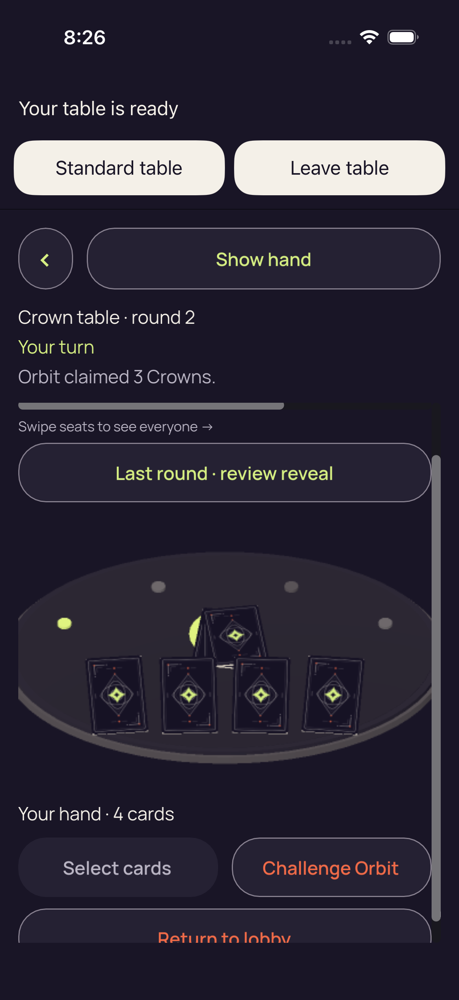</a> <code>2EB272BE-FB9F-41D8-9BE0-8188C1DA0AF2.png</code> 3d real authority accepted native Play_0_423A5A40-FACC-40BA-8EF8-2E3A16136DA2.png | 1206 × 2622 px · 379,746 bytes SHA-256: <code>87e1eb6681b9eddcc60b9a127c6f05be5514ef8064b4fcc121850afa36a49f5e</code> Source: <code>/root/projects/PartyDeck/artifacts/evidence-storage/ios-validate-34520365907/ios-reports-and-simulator-app/build/ci/ios/godot-session/attachments/2EB272BE-FB9F-41D8-9BE0-8188C1DA0AF2.png</code> Original case: <code>PartyDeckGodotSessionUITests/testProduction3DPracticeSession()</code> — **failed** Original attachment timestamp: 1789071971.759 [Sanitized observation](attachments/B3B18159-BDB2-4FC8-8882-D3C787A43BCF.json) · [Original result](evidence/result.json) · [Attachment index](../companions.md) | **Direct original view by review_design**. The native 3D accepted-Play checkpoint shows Crown table, round 2, Your turn and Orbit claimed 3 Crowns. Four concealed hand backs and Your hand 4 cards are visible. Show hand, Last round review reveal, Select cards and Challenge Orbit fit at this captured scroll position. Seat names are above the body clip while the horizontal scrollbar and swipe cue remain visible. Return to lobby is cut by the bottom edge. The selected and accepted-Play originals visibly record five cards and four backs respectively; no continuous transition or remaining face identities are observed. |
| <a href="attachments/A52150C7-D39D-4A09-9230-FF286FA3678B.png">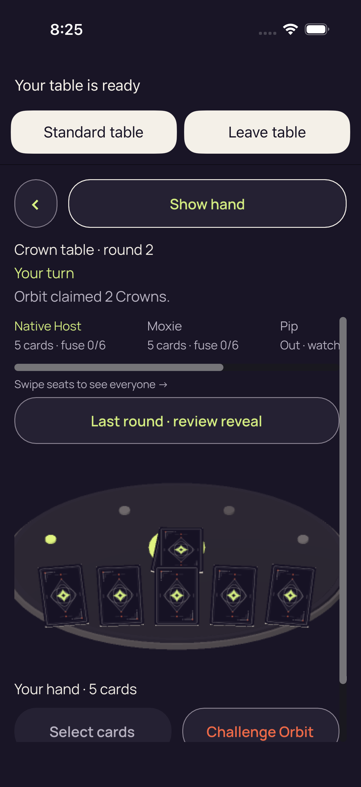</a> <code>A52150C7-D39D-4A09-9230-FF286FA3678B.png</code> 3d Hide removes private faces labels and selection_0_310080AF-E0CD-4103-B03E-F861ED7626AD.png | 1206 × 2622 px · 402,747 bytes SHA-256: <code>e85822888cf023659372cfc5417644eb6e32bc81ce2b6cfbad7fdc571b94168d</code> Source: <code>/root/projects/PartyDeck/artifacts/evidence-storage/ios-validate-34520365907/ios-reports-and-simulator-app/build/ci/ios/godot-session/attachments/A52150C7-D39D-4A09-9230-FF286FA3678B.png</code> Original case: <code>PartyDeckGodotSessionUITests/testProduction3DPracticeSession()</code> — **failed** Original attachment timestamp: 1789071956.6 [Sanitized observation](attachments/F1B74130-7E3B-490A-BB83-7246C46AB181.json) · [Original result](evidence/result.json) · [Attachment index](../companions.md) | **UNVIEWED original — no visual acceptance**. Original capture retained without direct visual review. Its recorded case, label, timestamp and outcome identify the source checkpoint; no pixel observation or visual acceptance is asserted. |
| <a href="attachments/F27271BA-7875-4783-89E7-06E016604127.png">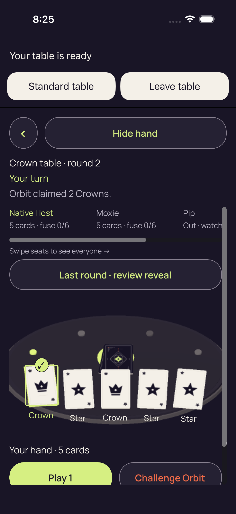</a> <code>F27271BA-7875-4783-89E7-06E016604127.png</code> 3d real native card selection_0_FA26EE06-5231-48F8-9546-2344D51CC0B3.png | 1206 × 2622 px · 358,266 bytes SHA-256: <code>4f95b4ff0ac1c5b1263b074e29fe1b3b9da4e1945b250064f9f5b95a35fce1c0</code> Source: <code>/root/projects/PartyDeck/artifacts/evidence-storage/ios-validate-34520365907/ios-reports-and-simulator-app/build/ci/ios/godot-session/attachments/F27271BA-7875-4783-89E7-06E016604127.png</code> Original case: <code>PartyDeckGodotSessionUITests/testProduction3DPracticeSession()</code> — **failed** Original attachment timestamp: 1789071953.97 [Sanitized observation](attachments/7875A7BC-A4CD-4609-895F-C9E69F9BCB95.json) · [Original result](evidence/result.json) · [Attachment index](../companions.md) | **Direct original view by review_design**. The native 3D selected checkpoint shows Crown table, round 2, Your turn and Orbit claimed 2 Crowns. Five face-up cards are visible with labels Crown, Star, Crown, Star and Star; the first Crown has a selected border/check. Your hand 5 cards is visible. Hide hand and Last round review reveal fit. Later seat content clips horizontally; Play 1 and Challenge Orbit labels are visible but their lower button edges are clipped by the viewport. |
| <a href="attachments/33B29AA0-1A02-4EFA-BADE-52590FAAC7FB.png">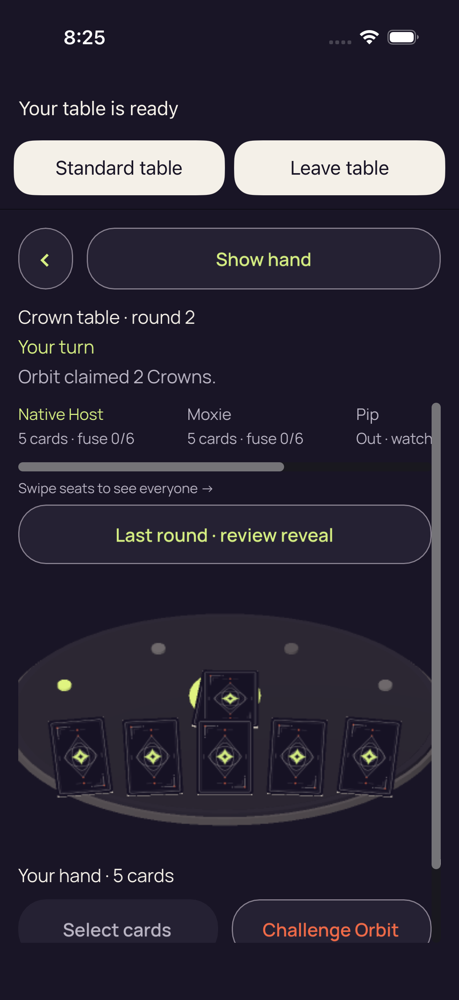</a> <code>33B29AA0-1A02-4EFA-BADE-52590FAAC7FB.png</code> 3d production concealed entry_0_FD70888A-9AD7-495D-A700-78D40AB0BAFA.png | 1206 × 2622 px · 399,514 bytes SHA-256: <code>2e947fa5b6d08939ee44c11051ee6be55c4b8878b91f04cb51b86139505eec92</code> Source: <code>/root/projects/PartyDeck/artifacts/evidence-storage/ios-validate-34520365907/ios-reports-and-simulator-app/build/ci/ios/godot-session/attachments/33B29AA0-1A02-4EFA-BADE-52590FAAC7FB.png</code> Original case: <code>PartyDeckGodotSessionUITests/testProduction3DPracticeSession()</code> — **failed** Original attachment timestamp: 1789071909.534 [Sanitized observation](attachments/36A7786A-C447-4FCA-9833-8884122E33BA.json) · [Original result](evidence/result.json) · [Attachment index](../companions.md) | **UNVIEWED original — no visual acceptance**. Original capture retained without direct visual review. Its recorded case, label, timestamp and outcome identify the source checkpoint; no pixel observation or visual acceptance is asserted. |
| <a href="attachments/A5F49CBA-6EAD-4FEB-B4CC-9EF2A589CC6E.png">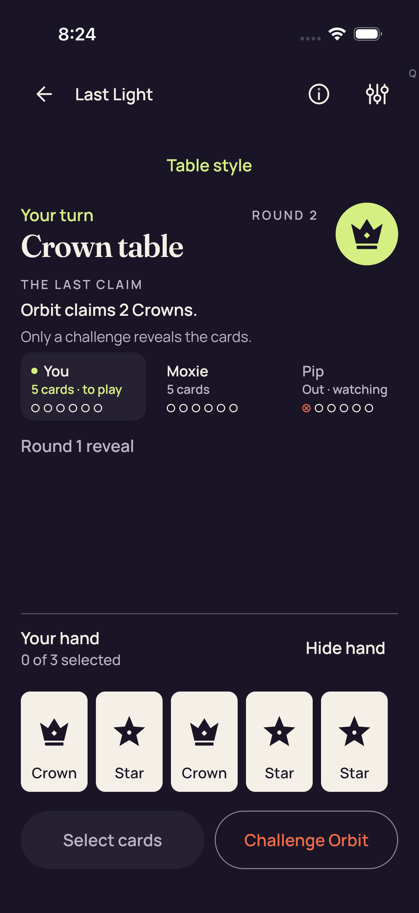</a> <code>A5F49CBA-6EAD-4FEB-B4CC-9EF2A589CC6E.png</code> 3d Standard fresh Reveal is unselected_0_E795A810-55E4-4A22-901E-C0B9B148A836.png | 1206 × 2622 px · 216,856 bytes SHA-256: <code>efe44856b2b986bf6fd90fde06f1e510ccbe4737bcddeef559c70599d6ce689e</code> Source: <code>/root/projects/PartyDeck/artifacts/evidence-storage/ios-validate-34520365907/ios-reports-and-simulator-app/build/ci/ios/godot-session/attachments/A5F49CBA-6EAD-4FEB-B4CC-9EF2A589CC6E.png</code> Original case: <code>PartyDeckGodotSessionUITests/testProduction3DPracticeSession()</code> — **failed** Original attachment timestamp: 1789071853.524 [Sanitized observation](attachments/16C02F73-FA4E-425E-AF07-D9C8F286DC4C.json) · [Original result](evidence/result.json) · [Attachment index](../companions.md) | **UNVIEWED original — no visual acceptance**. Original capture retained without direct visual review. Its recorded case, label, timestamp and outcome identify the source checkpoint; no pixel observation or visual acceptance is asserted. |
|  <code>C813CADB-7239-4FEC-8B20-7D15E0CB3B9F.png</code> 3d Standard Hide removes private nodes and selection_0_C7881E1A-8BF8-4F64-A383-A40177FB626A.png | 1206 × 2622 px · 252,570 bytes SHA-256: <code>958a132ac30297ad236d13a2ecabf8eedf6dc5e54d63aaf30954162d5a16330b</code> Source: <code>/root/projects/PartyDeck/artifacts/evidence-storage/ios-validate-34520365907/ios-reports-and-simulator-app/build/ci/ios/godot-session/attachments/C813CADB-7239-4FEC-8B20-7D15E0CB3B9F.png</code> Original case: <code>PartyDeckGodotSessionUITests/testProduction3DPracticeSession()</code> — **failed** Original attachment timestamp: 1789071830.436 [Sanitized observation](attachments/173DB18C-069C-457F-A2BD-500F2AA2BA27.json) · [Original result](evidence/result.json) · [Attachment index](../companions.md) | **UNVIEWED original — no visual acceptance**. Original capture retained without direct visual review. Its recorded case, label, timestamp and outcome identify the source checkpoint; no pixel observation or visual acceptance is asserted. |
| <a href="attachments/E6FFA31E-5721-4F32-AC73-BDE6DD60CDFF.png">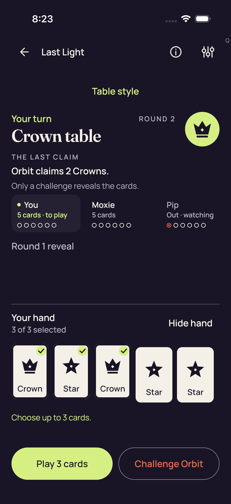</a> <code>E6FFA31E-5721-4F32-AC73-BDE6DD60CDFF.png</code> 3d Standard maximum selection and count-only feedback_0_7C9AC8FB-E30B-4354-88A6-9D9DBE767349.png | 1206 × 2622 px · 235,136 bytes SHA-256: <code>7953b38cac75ebb9e76b4fad4a597e848712e941719e4ed0b8044a0ac81b7d20</code> Source: <code>/root/projects/PartyDeck/artifacts/evidence-storage/ios-validate-34520365907/ios-reports-and-simulator-app/build/ci/ios/godot-session/attachments/E6FFA31E-5721-4F32-AC73-BDE6DD60CDFF.png</code> Original case: <code>PartyDeckGodotSessionUITests/testProduction3DPracticeSession()</code> — **failed** Original attachment timestamp: 1789071799.615 [Sanitized observation](attachments/C6CDB307-D241-41AC-A57F-04E3B9BB2421.json) · [Original result](evidence/result.json) · [Attachment index](../companions.md) | **UNVIEWED original — no visual acceptance**. Original capture retained without direct visual review. Its recorded case, label, timestamp and outcome identify the source checkpoint; no pixel observation or visual acceptance is asserted. |
|  <code>D7C35E9B-F488-4DD0-AEA6-F21C9E0E3200.png</code> 3d Standard all five native card descriptions_0_E7EFF6B2-AE66-4874-AFE1-39CFCE3AC366.png | 1206 × 2622 px · 216,581 bytes SHA-256: <code>a864c0729dbb64babfaff099bf62fa6c340645a01f801667c1b5f34447b1e450</code> Source: <code>/root/projects/PartyDeck/artifacts/evidence-storage/ios-validate-34520365907/ios-reports-and-simulator-app/build/ci/ios/godot-session/attachments/D7C35E9B-F488-4DD0-AEA6-F21C9E0E3200.png</code> Original case: <code>PartyDeckGodotSessionUITests/testProduction3DPracticeSession()</code> — **failed** Original attachment timestamp: 1789071740.616 [Sanitized observation](attachments/679CF209-5B56-476C-A040-2607D2CE9C01.json) · [Original result](evidence/result.json) · [Attachment index](../companions.md) | **UNVIEWED original — no visual acceptance**. Original capture retained without direct visual review. Its recorded case, label, timestamp and outcome identify the source checkpoint; no pixel observation or visual acceptance is asserted. |
| <a href="attachments/B7420CCA-421C-49D4-A51F-9ADF28BD6AC8.png">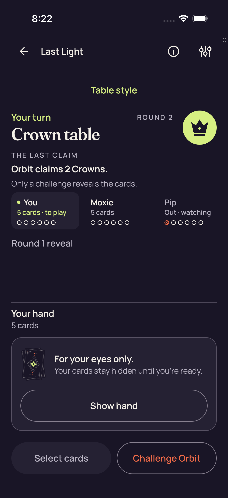</a> <code>B7420CCA-421C-49D4-A51F-9ADF28BD6AC8.png</code> 3d Standard concealed_0_5EDA4023-BFF0-4C0E-A65E-CBC7476DAB6C.png | 1206 × 2622 px · 251,726 bytes SHA-256: <code>5353e826308119028131eeb258447848563ac7a3747f8204660ed02a1afabb0e</code> Source: <code>/root/projects/PartyDeck/artifacts/evidence-storage/ios-validate-34520365907/ios-reports-and-simulator-app/build/ci/ios/godot-session/attachments/B7420CCA-421C-49D4-A51F-9ADF28BD6AC8.png</code> Original case: <code>PartyDeckGodotSessionUITests/testProduction3DPracticeSession()</code> — **failed** Original attachment timestamp: 1789071720.355 [Sanitized observation](attachments/3C507505-278B-4A8D-BCF7-D636BB15072E.json) · [Original result](evidence/result.json) · [Attachment index](../companions.md) | **UNVIEWED original — no visual acceptance**. Original capture retained without direct visual review. Its recorded case, label, timestamp and outcome identify the source checkpoint; no pixel observation or visual acceptance is asserted. |
