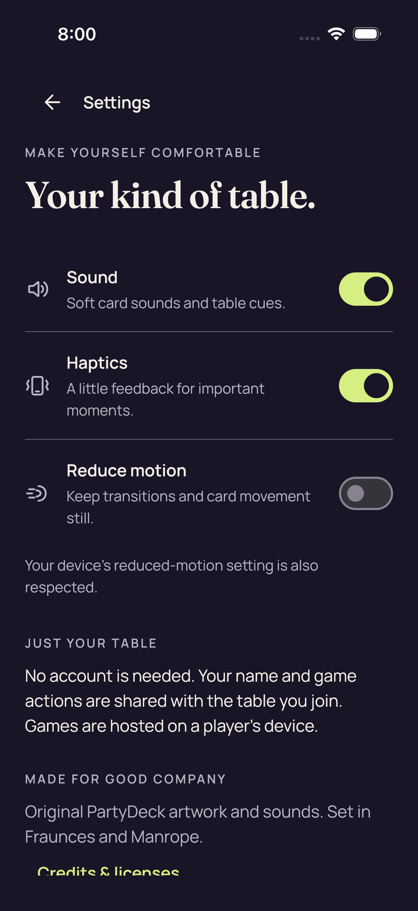
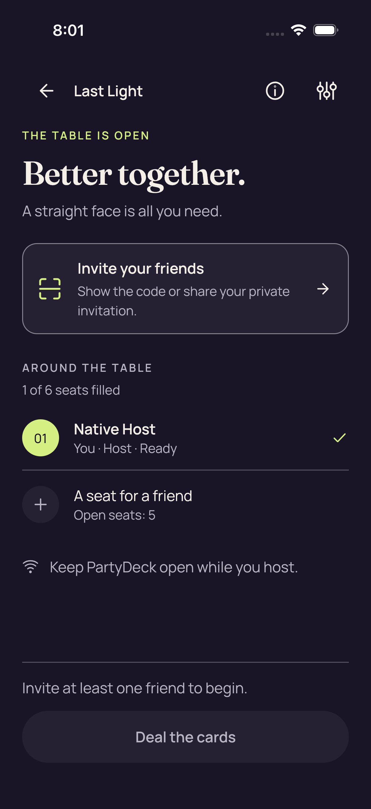
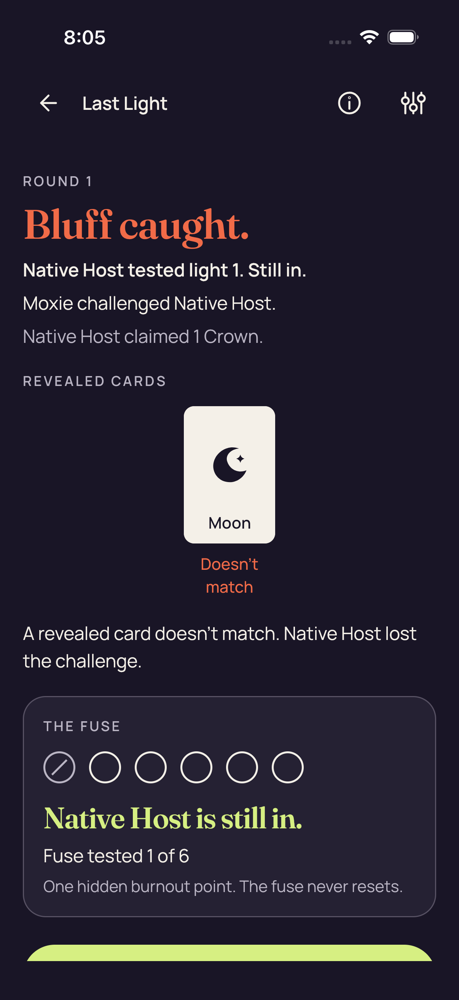
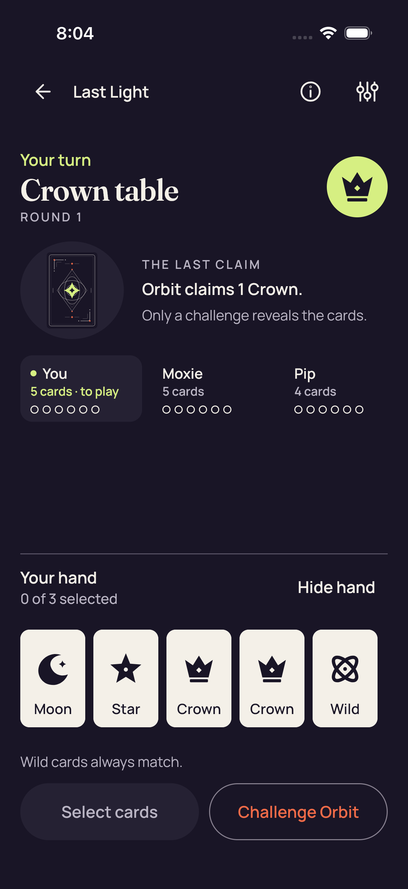
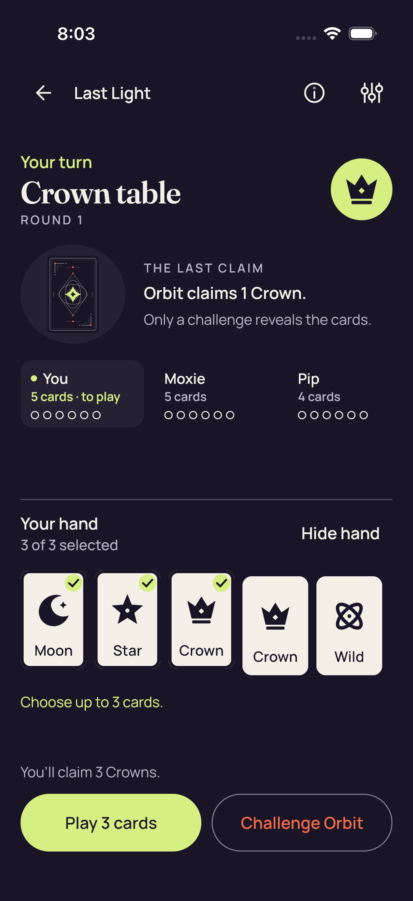
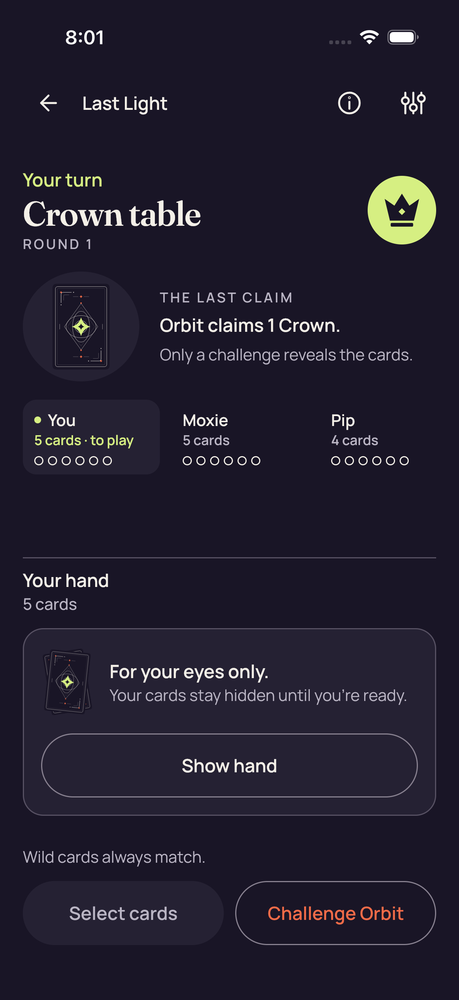
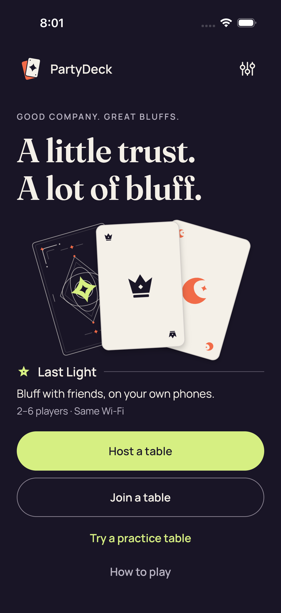

# Ordinary shared UI — iOS CI 34520365907

[All collections](../../README.md) · [Preserved evidence](../evidence-index.md) · [Copy/review binding](../../godot-ios-retained-34520375602/provenance/publication-review/publication-binding.json) · [Completed focused review](../provenance/publication-review/partydeck-gallery-after-3433-production34520365907-visual-review-v1.json) · [Frozen source mapping](../provenance/source-map/partydeck-gallery-after-3433-production34520365907-source-map-v1.json)

**Nine ordinary cases and five unfiltered .all audits pass. All ten original PNGs remain explicitly unviewed.**

Original named XCTest outcomes remain separate from screenshot observations.

The frozen c65e264 run passes 156 shared-native tests, nine ordinary XCTest cases and five unfiltered .all audits. The separate guarded UIKit gate passes all three cases and contributes no PNGs. Both production native cases pass concealed entry, native selection, Hide and real authority-accepted native Play, then fail during Standard return. Production Standard checkpoints do not invoke the ordinary accessibility audit callback. The 2D read fails health through port.quarantined=true with lastCloseSucceeded=false. The 3D first dormant predicate fails solely on authorityForegroundGrant=true, despite successful close, dormant native state and matching retained identities.

Six production originals were directly reviewed; 24 other originals remain explicitly unviewed. The 2D selected hand clips horizontally while full Claim 1 Crown fits. Its accepted-Play checkpoint is a public Crown result with full Deal the next round and clipped lower seat details. The native 3D selected checkpoint shows five face-up cards/count 5; its later accepted-Play checkpoint shows four backs/count 4. Both failure stills display Standard UI. The 2D result has a toast over the lower fuse panel and only the top of the continuation action visible; the 3D failure shows a concealed four-card hand/count and full Show hand/Select cards/Challenge Orbit. Native 3D selected lower button edges and the later Return to lobby remain clipped. No complete remaining 2D hand or remaining 3D face identities are shown.

All 30 original PNGs, all 121 non-PNG attachment companions and both original attachment manifests are preserved. The 121 companions comprise 33 JSONs, 86 extensionless UI/event payloads and two unviewed/undecoded MP4s. Exactly 20 JSONs are the supplied sanitized companions paired with the 20 production PNGs. The final archive reconciliation and logical/physical storage aliases are retained. Both native cases ran once and failed; manual isAssociatedWithFailure=false metadata does not imply success.

Original compact MSAA_2X PCK: `557b2297bed133a433acc25efa4837462465dd4e06da659ae5a4cbd792f77fe0`, 1,549,560 bytes. The preserved close audit verifies 294 raw AX references against original stream offsets. Fourteen 2D observations show covered, noninteractive empty-tree cleanup with an attached native surface and fixed frame/draw/iteration counters before quarantine. The 3D failure retains the stale authority grant after successful close. Source order and observed states do not log exact UIKit-stop/Swift-timeout callback interleaving. PNG timestamps reuse lastDocument and do not measure close duration. No continuous privacy, assistive-technology traversal or native qualification follows from these stills.

Source revision: `c65e264892ad21ecd8b7f8fba8bc3ae441ab3137`. CI run: [34520365907](https://github.com/Apdelrahman1911/PartyDeck/actions/runs/34520365907). 10 separate original PNGs. Review methods: 10 unviewed original — no visual acceptance.

Every thumbnail opens the unchanged original PNG. **UNVIEWED** means no direct pixel review or visual acceptance is asserted. Byte matching reuses only the earlier reviewed pixels; each execution, scenario and result remains separate. Frozen plans retain their historical pending flags; the completed review records final publication status. No image was recaptured or transformed, and no video was decoded.

| Original capture | Original identity and evidence | Review status and observation |
| --- | --- | --- |
|  <code>59693288-9B98-466D-B7EB-E2D01DE636BD.png</code> Settings_0_CAD57BD5-42DB-4416-8212-11CF22EEE8AB.png | 1206 × 2622 px · 288,004 bytes SHA-256: <code>bf0dc619cd90f12232cb2e01a3cd0c13daecd8341cfd4fc5f9006600bb22a8ec</code> Source: <code>/root/projects/PartyDeck/artifacts/evidence-storage/ios-validate-34520365907/ios-reports-and-simulator-app/build/ci/ios/attachments/59693288-9B98-466D-B7EB-E2D01DE636BD.png</code> Original case: <code>PartyDeckUITests/testNativeHostCanNavigateSharedSettings()</code> — **passed** Original attachment timestamp: 1789070411.002 [Attachment index](../companions.md) | **UNVIEWED original — no visual acceptance**. Original capture retained without direct visual review. Its recorded case, label, timestamp and outcome identify the source checkpoint; no pixel observation or visual acceptance is asserted. |
|  <code>60F90B77-F045-456E-9D4B-67695C841EBB.png</code> Native host invitation closed_0_B6A30C23-3296-47C6-AA0D-76F0904924A7.png | 1206 × 2622 px · 224,426 bytes SHA-256: <code>b4141efa78fe87063e65f70f0373f4fc3a42bb51926d2218ac4b2713031f5c18</code> Source: <code>/root/projects/PartyDeck/artifacts/evidence-storage/ios-validate-34520365907/ios-reports-and-simulator-app/build/ci/ios/attachments/60F90B77-F045-456E-9D4B-67695C841EBB.png</code> Original case: <code>PartyDeckUITests/testSharedControllerHostsANativeTableAndShowsItsInvitation()</code> — **passed** Original attachment timestamp: 1789070474.053 [Attachment index](../companions.md) | **UNVIEWED original — no visual acceptance**. Original capture retained without direct visual review. Its recorded case, label, timestamp and outcome identify the source checkpoint; no pixel observation or visual acceptance is asserted. |
|  <code>7EDF5B51-B98D-4C72-B474-3EC8C31C4717.png</code> Native host lobby_0_5E321A32-F55C-4FA3-BB55-882C002E8F2B.png | 1206 × 2622 px · 224,426 bytes SHA-256: <code>b4141efa78fe87063e65f70f0373f4fc3a42bb51926d2218ac4b2713031f5c18</code> Source: <code>/root/projects/PartyDeck/artifacts/evidence-storage/ios-validate-34520365907/ios-reports-and-simulator-app/build/ci/ios/attachments/7EDF5B51-B98D-4C72-B474-3EC8C31C4717.png</code> Original case: <code>PartyDeckUITests/testSharedControllerHostsANativeTableAndShowsItsInvitation()</code> — **passed** Original attachment timestamp: 1789070466.119 [Attachment index](../companions.md) | **UNVIEWED original — no visual acceptance**. Original capture retained without direct visual review. Its recorded case, label, timestamp and outcome identify the source checkpoint; no pixel observation or visual acceptance is asserted. |
|  <code>FDC920AF-03F6-4DA8-9ABC-2B3DD9AC7E81.png</code> Practice after accepted play_0_7C9E578C-69CD-45F9-88D9-38385DE37D3F.png | 1206 × 2622 px · 221,385 bytes SHA-256: <code>57b3deed386995bf21c2ee2047ad30757a93d36fd939bac916059b5a07df9830</code> Source: <code>/root/projects/PartyDeck/artifacts/evidence-storage/ios-validate-34520365907/ios-reports-and-simulator-app/build/ci/ios/attachments/FDC920AF-03F6-4DA8-9ABC-2B3DD9AC7E81.png</code> Original case: <code>PartyDeckUITests/testSharedHomeOpensAPlayablePracticeTable()</code> — **passed** Original attachment timestamp: 1789070729.068 [Attachment index](../companions.md) | **UNVIEWED original — no visual acceptance**. Original capture retained without direct visual review. Its recorded case, label, timestamp and outcome identify the source checkpoint; no pixel observation or visual acceptance is asserted. |
|  <code>1886C129-C12E-4918-8BA7-809E01884A9E.png</code> Practice Standard fresh Reveal is unselected_0_F77056D8-8694-4FB3-A74E-22492F7CE74E.png | 1206 × 2622 px · 237,091 bytes SHA-256: <code>2242e7fbb14f034d10c46749d7fc256ece51013b5de5bd79a010a4d6bf3957ee</code> Source: <code>/root/projects/PartyDeck/artifacts/evidence-storage/ios-validate-34520365907/ios-reports-and-simulator-app/build/ci/ios/attachments/1886C129-C12E-4918-8BA7-809E01884A9E.png</code> Original case: <code>PartyDeckUITests/testSharedHomeOpensAPlayablePracticeTable()</code> — **passed** Original attachment timestamp: 1789070674.418 [Attachment index](../companions.md) | **UNVIEWED original — no visual acceptance**. Original capture retained without direct visual review. Its recorded case, label, timestamp and outcome identify the source checkpoint; no pixel observation or visual acceptance is asserted. |
|  <code>D9DE643B-E86B-42EF-A73D-B488437065EE.png</code> Practice Standard Hide removes private nodes and selection_0_8C455355-3F8E-49D6-8734-F2D029B1450D.png | 1206 × 2622 px · 262,750 bytes SHA-256: <code>81e6fec42a4540f7fe131c21d7c21aa34b7977358be2106870e48ef0c61a6ad5</code> Source: <code>/root/projects/PartyDeck/artifacts/evidence-storage/ios-validate-34520365907/ios-reports-and-simulator-app/build/ci/ios/attachments/D9DE643B-E86B-42EF-A73D-B488437065EE.png</code> Original case: <code>PartyDeckUITests/testSharedHomeOpensAPlayablePracticeTable()</code> — **passed** Original attachment timestamp: 1789070641.807 [Attachment index](../companions.md) | **UNVIEWED original — no visual acceptance**. Original capture retained without direct visual review. Its recorded case, label, timestamp and outcome identify the source checkpoint; no pixel observation or visual acceptance is asserted. |
|  <code>068105FA-F22A-460D-9128-BD36D9B1B04E.png</code> Practice Standard maximum selection and count-only feedback_0_4DA9F7BF-B1B8-44D1-BE2A-F01298DFCABE.png | 1206 × 2622 px · 251,712 bytes SHA-256: <code>f4674fe8c7bf675dcc2eb9b8328eef7ba84a770035d980fee8f9f163b7d7f704</code> Source: <code>/root/projects/PartyDeck/artifacts/evidence-storage/ios-validate-34520365907/ios-reports-and-simulator-app/build/ci/ios/attachments/068105FA-F22A-460D-9128-BD36D9B1B04E.png</code> Original case: <code>PartyDeckUITests/testSharedHomeOpensAPlayablePracticeTable()</code> — **passed** Original attachment timestamp: 1789070601.682 [Attachment index](../companions.md) | **UNVIEWED original — no visual acceptance**. Original capture retained without direct visual review. Its recorded case, label, timestamp and outcome identify the source checkpoint; no pixel observation or visual acceptance is asserted. |
|  <code>07FB37EF-CC6B-4C95-A75A-99FF3BD698DD.png</code> Practice Standard all five native card descriptions_0_AEFCFB11-8CCA-42A3-85D3-C800F800BEEE.png | 1206 × 2622 px · 237,270 bytes SHA-256: <code>2f6aef96ffc97a8e189c85ac0c0c128d1383faa6b8ca7c3f2094b09ee2a984f7</code> Source: <code>/root/projects/PartyDeck/artifacts/evidence-storage/ios-validate-34520365907/ios-reports-and-simulator-app/build/ci/ios/attachments/07FB37EF-CC6B-4C95-A75A-99FF3BD698DD.png</code> Original case: <code>PartyDeckUITests/testSharedHomeOpensAPlayablePracticeTable()</code> — **passed** Original attachment timestamp: 1789070527.205 [Attachment index](../companions.md) | **UNVIEWED original — no visual acceptance**. Original capture retained without direct visual review. Its recorded case, label, timestamp and outcome identify the source checkpoint; no pixel observation or visual acceptance is asserted. |
|  <code>0ADABAFC-C5B7-4534-B89A-916D8FFD2E81.png</code> Practice Standard concealed_0_81374BD3-0F9F-478D-AB12-99511144D4FA.png | 1206 × 2622 px · 262,287 bytes SHA-256: <code>ffca48d744d6e074eb691540c8598b265c714fb0b8a4f615d64a743a79a0e9ac</code> Source: <code>/root/projects/PartyDeck/artifacts/evidence-storage/ios-validate-34520365907/ios-reports-and-simulator-app/build/ci/ios/attachments/0ADABAFC-C5B7-4534-B89A-916D8FFD2E81.png</code> Original case: <code>PartyDeckUITests/testSharedHomeOpensAPlayablePracticeTable()</code> — **passed** Original attachment timestamp: 1789070503.789 [Attachment index](../companions.md) | **UNVIEWED original — no visual acceptance**. Original capture retained without direct visual review. Its recorded case, label, timestamp and outcome identify the source checkpoint; no pixel observation or visual acceptance is asserted. |
|  <code>91468B65-A1B3-453D-BE7B-3D6D2A67E91A.png</code> Home_0_DE419EE2-A618-4008-9880-EE887F6AA48F.png | 1206 × 2622 px · 298,282 bytes SHA-256: <code>5474e8b97d322ee562390e9898284099bc9b016e72cae78a53eff82b241f2ff4</code> Source: <code>/root/projects/PartyDeck/artifacts/evidence-storage/ios-validate-34520365907/ios-reports-and-simulator-app/build/ci/ios/attachments/91468B65-A1B3-453D-BE7B-3D6D2A67E91A.png</code> Original case: <code>PartyDeckUITests/testSharedHomeOpensAPlayablePracticeTable()</code> — **passed** Original attachment timestamp: 1789070498.207 [Attachment index](../companions.md) | **UNVIEWED original — no visual acceptance**. Original capture retained without direct visual review. Its recorded case, label, timestamp and outcome identify the source checkpoint; no pixel observation or visual acceptance is asserted. |
