# Focused production iOS — CI 34532837557

The focused production run records **3D passed and 2D failed**, overall **1/2**. The 2D case reaches Standard return, accepted NEXT_ROUND and the Leave confirmation, then fails a query for the absent native `godot-session-status` element. Full Validate, earlier shared-native/ordinary/UIKit suites and other platform jobs were skipped.

Exact source: `e4871e165f949c600ddd89b13e74d06fc34d2e04`. The packaged app uses PCK `541ded4c5074b56a9e320882a23f357ff8162520fac099e32567ac3a678f2751`, **1,550,440 bytes**. [Source binding](provenance/source-collection/exact-source-binding.json), [Packaged-app verification](provenance/source-collection/production-source-and-app-verification.json) and [Original named outcomes](provenance/source-collection/focused-production-outcome-v1.json) retain the execution scope.

All **32 original PNGs at 1206 × 2622** are preserved: **15 direct full-size views, three verified byte matches and 14 explicitly unviewed**. The one [original 2D MP4](godot-session/attachments/99158E58-1555-4318-905B-5539FD47FF0B.mp4) remains unviewed and undecoded. The complete original attachment manifest and all 136 payloads are preserved, including the full set of 47 observation pointers and non-JSON failure companions. [Browse every companion](companions.md).

The reviewed 2D concealed entry fits the full Reveal; native selection scrolls horizontally, with fixed lower actions fully visible. Its Standard return is a public round-1 result whose continuation lies below the viewport. The later round-2 concealed hand, Show hand and Leave dialog fit. The initial 3D view fits its primary actions while Return to lobby is clipped. Native accepted Play shows four backs/count 4; the Standard return fits its concealed four-card panel. The later Standard accepted-Play still has three face-up hand cards and Hide hand. At later native round-3 reentry, the prior-round review row pushes Play/Select and Challenge lower edges below the visible body.

These are still-image findings. Cached `lastDocument` companions were acquired separately and are not guaranteed fresh at screenshot time. The passing 3D case and readable pixels do not change the failed 2D result or establish continuous privacy, accessibility audit coverage or whole-control scroll reachability. Every review used original files once; [the frozen visual review](provenance/visual-review/review.json) retains exact source identities and observations.

### 2d Standard concealed

<a href="godot-session/attachments/9F200648-695B-470C-919B-FD1B8E921779.png">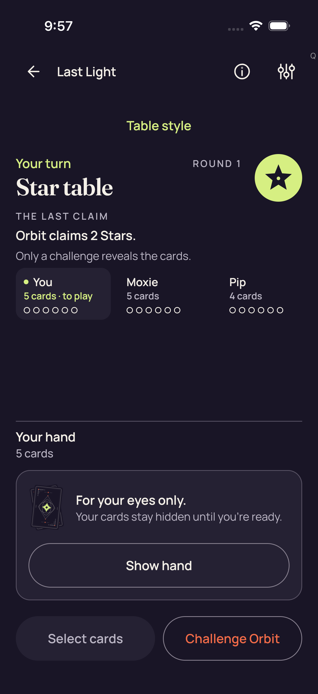</a>

Original filename: `9F200648-695B-470C-919B-FD1B8E921779.png` · **1206 × 2622** · 240,597 bytes.

SHA-256: `1f83edc7b712806227ef80ccc0484a0ea781049411f2bbd4bc5f8d161bb1528c`.

**[Preserved original; unviewed](provenance/visual-review/review.json).** Original retained without direct visual review; no pixel acceptance asserted.

Original case: `PartyDeckGodotSessionUITests/testProduction2DPracticeSession()`; case outcome: **failed**; exported timestamp: `1789077475.153`; attachment label: `2d Standard concealed_0_A4C47593-223B-4F77-ABFD-CAC2F3B1CFD5.png`.

### 2d Standard all five native card descriptions

<a href="godot-session/attachments/7DC6F835-BF41-4DB8-944F-41E982204F56.png">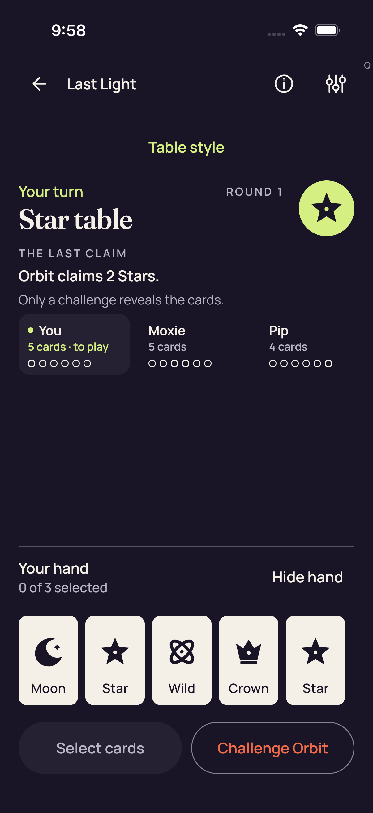</a>

Original filename: `7DC6F835-BF41-4DB8-944F-41E982204F56.png` · **1206 × 2622** · 215,709 bytes.

SHA-256: `110e7dd5ec8b97c7b21159e44fa244a2b9c30652c7c1d64213c89b3df6caaabd`.

**[Preserved original; unviewed](provenance/visual-review/review.json).** Original retained without direct visual review; no pixel acceptance asserted.

Original case: `PartyDeckGodotSessionUITests/testProduction2DPracticeSession()`; case outcome: **failed**; exported timestamp: `1789077496.906`; attachment label: `2d Standard all five native card descriptions_0_4AFADF9A-EE91-45F9-A1E9-5E6C2D29293E.png`.

### 2d Standard maximum selection and count-only feedback

<a href="godot-session/attachments/4076ACC7-D835-4A22-8ACB-A69A1E2D52B1.png">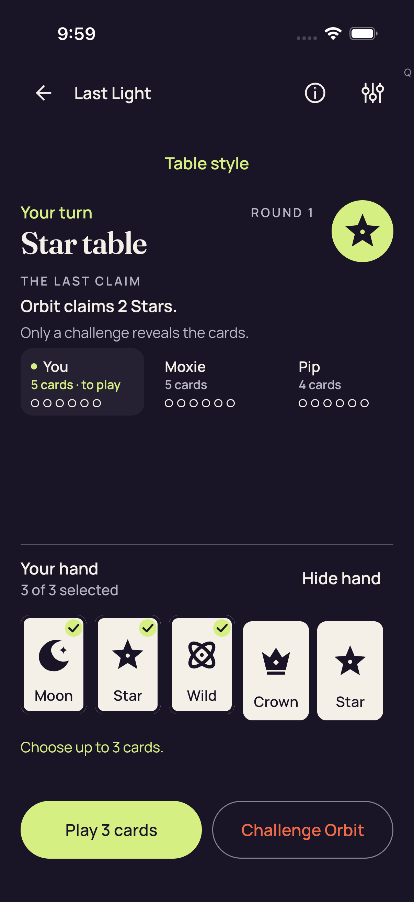</a>

Original filename: `4076ACC7-D835-4A22-8ACB-A69A1E2D52B1.png` · **1206 × 2622** · 232,396 bytes.

SHA-256: `5962ae60885ada60565ba6290f13a0f18e0f2d0d43bdc0234ffd97cb564468d1`.

**[Preserved original; unviewed](provenance/visual-review/review.json).** Original retained without direct visual review; no pixel acceptance asserted.

Original case: `PartyDeckGodotSessionUITests/testProduction2DPracticeSession()`; case outcome: **failed**; exported timestamp: `1789077552.007`; attachment label: `2d Standard maximum selection and count-only feedback_0_02FEFB76-9C38-4360-8454-8A87062395A5.png`.

### 2d Standard Hide removes private nodes and selection

<a href="godot-session/attachments/F8203C17-9856-47E7-A2C7-4E7DA7255A36.png">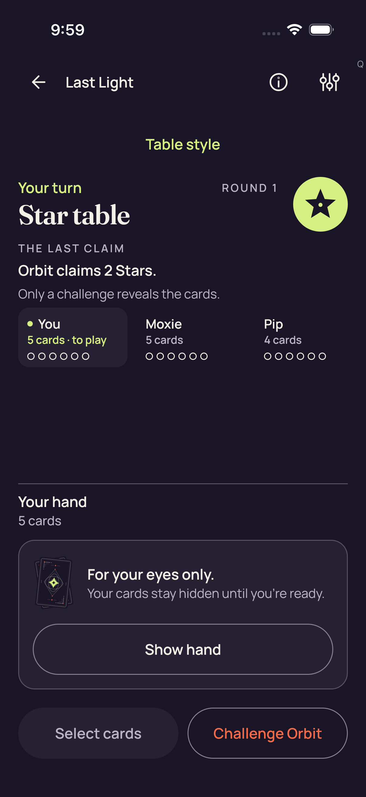</a>

Original filename: `F8203C17-9856-47E7-A2C7-4E7DA7255A36.png` · **1206 × 2622** · 240,173 bytes.

SHA-256: `57dbb9d858453cf80d6c8d9b51f9e8d5613a69f3158ed6183061bbc4c5bce7a1`.

**[Preserved original; unviewed](provenance/visual-review/review.json).** Original retained without direct visual review; no pixel acceptance asserted.

Original case: `PartyDeckGodotSessionUITests/testProduction2DPracticeSession()`; case outcome: **failed**; exported timestamp: `1789077578.619`; attachment label: `2d Standard Hide removes private nodes and selection_0_6C2F158F-A3C4-45B3-A525-A8894245FEEC.png`.

### 2d Standard fresh Reveal is unselected

<a href="godot-session/attachments/38804203-4DCE-470B-955D-29DEA3EEDFE8.png">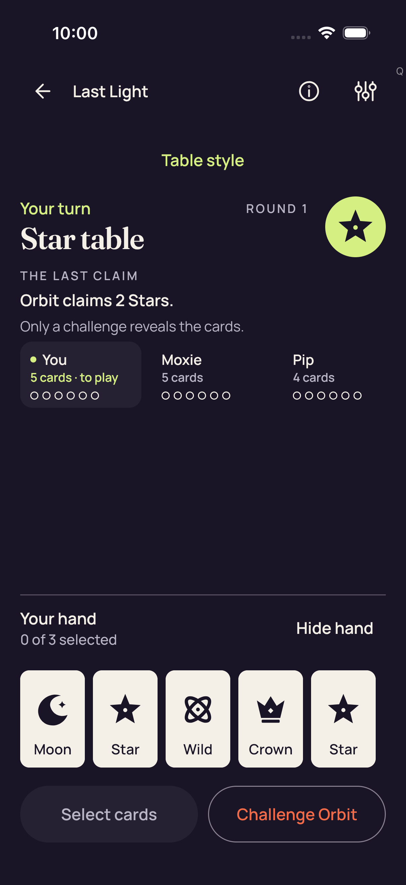</a>

Original filename: `38804203-4DCE-470B-955D-29DEA3EEDFE8.png` · **1206 × 2622** · 213,541 bytes.

SHA-256: `153534ec1cfe79f8ea457496bcd5ec5386664e966a98a2a4f82b41a04051a1b1`.

**[Preserved original; unviewed](provenance/visual-review/review.json).** Original retained without direct visual review; no pixel acceptance asserted.

Original case: `PartyDeckGodotSessionUITests/testProduction2DPracticeSession()`; case outcome: **failed**; exported timestamp: `1789077607.559`; attachment label: `2d Standard fresh Reveal is unselected_0_BD657AB1-3717-47F9-BEA9-8D60E9989481.png`.

### 2d production concealed entry

Original filename: `27399F43-39F4-44F8-ADE5-81C9093C9003.png` · **1206 × 2622** · 254,056 bytes.

SHA-256: `11426a39f77d9a33f18add58d0b207e7f6694fe62db00d3dd9bedc1aa694c389`.

**[Direct original view — review_design (`/root/review_design`)](provenance/visual-review/review.json).** Ready native 2D shows Your turn · claim Stars., ROUND 01, Star and Orbit claimed 2 Stars. The complete 5 cards, covered. panel and Reveal my hand button fit. First two numbered seats show Guest/Moxie, hand counts and No lights used, with their lower borders/content meeting the body clip. Both fixed Choose cards to play and Call the bluff controls fit completely. No private card faces are visible.

Original case: `PartyDeckGodotSessionUITests/testProduction2DPracticeSession()`; case outcome: **failed**; exported timestamp: `1789077625.89`; attachment label: `2d production concealed entry_0_95B3F6E8-DEBC-4408-AE59-B1B51258F831.png`.

### 2d real native card selection

<a href="godot-session/attachments/9F2FA4CB-BFDF-48A0-A0FF-1AC11C4C5F4A.png">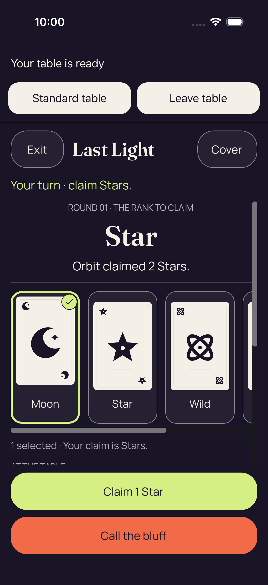</a>

Original filename: `9F2FA4CB-BFDF-48A0-A0FF-1AC11C4C5F4A.png` · **1206 × 2622** · 238,550 bytes.

SHA-256: `4994badf354d45ffffd19cae0be2f42ff008693ecfcdebabead08294775ff834`.

**[Direct original view — review_design (`/root/review_design`)](provenance/visual-review/review.json).** Native 2D shows the same Star round-1 public context and Orbit claim. Moon is selected with a visible check; Star and Wild are fully shown while a later card is cut at the right horizontal-scroll boundary. The horizontal scrollbar and 1 selected · Your claim is Stars. line are visible. Cover and both full fixed Claim 1 Star / Call the bluff buttons fit. AT THE TABLE begins at the lower scroll boundary and is clipped. Private faces are intentionally visible in this selection checkpoint.

Original case: `PartyDeckGodotSessionUITests/testProduction2DPracticeSession()`; case outcome: **failed**; exported timestamp: `1789077635.85`; attachment label: `2d real native card selection_0_A59D5C6C-1755-453A-941B-7CFA198AAD1D.png`.

### 2d Hide removes private faces labels and selection

<a href="godot-session/attachments/611F36AD-70C4-42CA-A39F-732337CC56D9.png">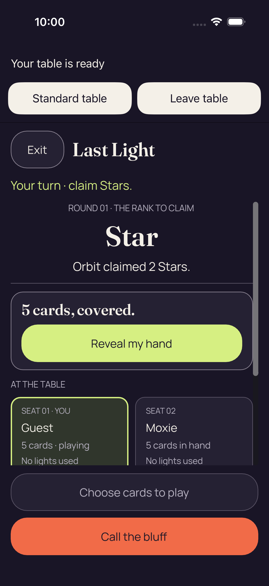</a>

Original filename: `611F36AD-70C4-42CA-A39F-732337CC56D9.png` · **1206 × 2622** · 254,056 bytes.

SHA-256: `11426a39f77d9a33f18add58d0b207e7f6694fe62db00d3dd9bedc1aa694c389`.

**[Reviewed identical bytes; this identity not reopened (`/root/review_design`)](provenance/visual-review/review.json).** Ready native 2D shows Your turn · claim Stars., ROUND 01, Star and Orbit claimed 2 Stars. The complete 5 cards, covered. panel and Reveal my hand button fit. First two numbered seats show Guest/Moxie, hand counts and No lights used, with their lower borders/content meeting the body clip. Both fixed Choose cards to play and Call the bluff controls fit completely. No private card faces are visible.

Reviewed representative: [27399F43-39F4-44F8-ADE5-81C9093C9003.png](godot-session/attachments/27399F43-39F4-44F8-ADE5-81C9093C9003.png). The original identity and timestamp above remain separate.

Original case: `PartyDeckGodotSessionUITests/testProduction2DPracticeSession()`; case outcome: **failed**; exported timestamp: `1789077640.296`; attachment label: `2d Hide removes private faces labels and selection_0_B4553226-3365-4829-8FB7-6DE48CD57411.png`.

### 2d real authority accepted native Play

<a href="godot-session/attachments/D1F889A7-3FAC-4ACC-B414-816E7475258E.png">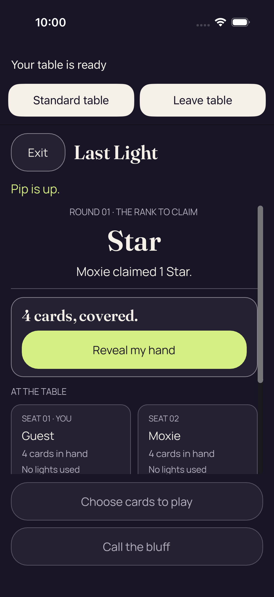</a>

Original filename: `D1F889A7-3FAC-4ACC-B414-816E7475258E.png` · **1206 × 2622** · 230,007 bytes.

SHA-256: `5c020d796abfd685a249cb11bf5e40def7f3f0bdd11df22b6f0d0fc93ea19d6f`.

**[Direct original view — review_design (`/root/review_design`)](provenance/visual-review/review.json).** Native 2D shows Pip is up., Star round 1 and Moxie claimed 1 Star. The complete 4 cards, covered. panel and Reveal my hand fit; Guest and Moxie each show 4 cards, with seat bottoms clipped by the scroll boundary. The two fixed lower controls remain fully inside the image in their muted appearance. No private faces or selected-card mark is visible. This is the recorded accepted-Play checkpoint; input acceptance comes from the separate native evidence.

Original case: `PartyDeckGodotSessionUITests/testProduction2DPracticeSession()`; case outcome: **failed**; exported timestamp: `1789077654.895`; attachment label: `2d real authority accepted native Play_0_11560308-CDD1-492E-B59C-CBAA8AF6B3FA.png`.

### 2d same session Standard return

<a href="godot-session/attachments/56C65FFE-10F2-462D-95ED-5B44A6B5C5BC.png">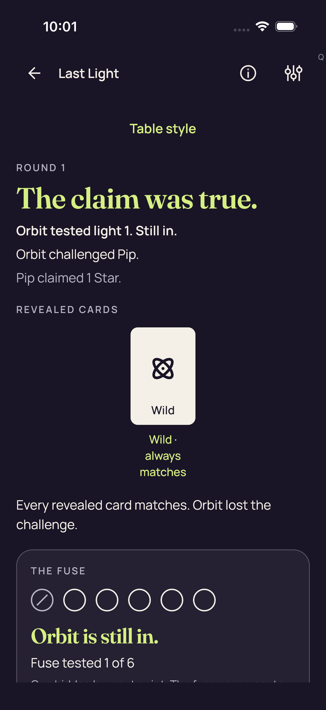</a>

Original filename: `56C65FFE-10F2-462D-95ED-5B44A6B5C5BC.png` · **1206 × 2622** · 206,969 bytes.

SHA-256: `a33bbe51e80ff37864c963e66bfcb33c73f0c2f2714e901f2e65e1631dd25182`.

**[Direct original view — review_design (`/root/review_design`)](provenance/visual-review/review.json).** The Standard return displays a public ROUND 1 result: The claim was true.; Orbit challenged Pip, who claimed 1 Star. One public Wild card and its matching explanation are readable. The lower fuse panel is clipped after Orbit is still in. / Fuse tested 1 of 6. The continuation action is below the visible viewport. No private hand is shown; the Wild belongs to the explicitly labeled public REVEALED CARDS result.

Original case: `PartyDeckGodotSessionUITests/testProduction2DPracticeSession()`; case outcome: **failed**; exported timestamp: `1789077671.079`; attachment label: `2d same session Standard return_0_09B966CA-9863-4C83-87BF-8AEA831CF42B.png`.

### 2d real Standard authority accepted NEXT_ROUND

<a href="godot-session/attachments/0CB03DBF-0C21-47BF-8A89-77C8F8069CFF.png">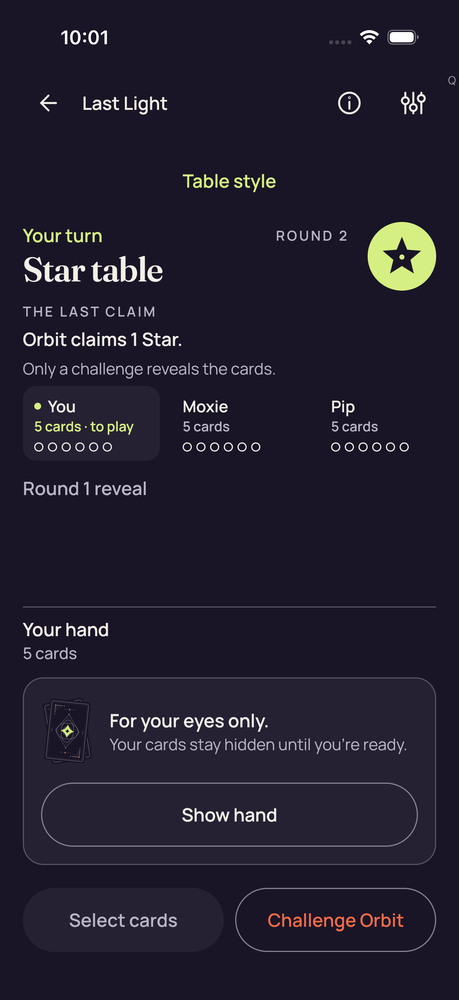</a>

Original filename: `0CB03DBF-0C21-47BF-8A89-77C8F8069CFF.png` · **1206 × 2622** · 242,310 bytes.

SHA-256: `eb21ab8ec2fd4e1a64de2fb342ccb0511fe236f0a1608b09b72542bc7d37d2f1`.

**[Direct original view — review_design (`/root/review_design`)](provenance/visual-review/review.json).** Standard ROUND 2 Star table shows Your turn, Orbit claims 1 Star., three visible seat summaries, Round 1 reveal and Your hand / 5 cards. The complete concealed For your eyes only. panel, Show hand button, Select cards and Challenge Orbit controls fit inside the image. Later seats are outside this horizontal view. No private card faces are visible. The NEXT_ROUND acceptance label is supported by separate native evidence.

Original case: `PartyDeckGodotSessionUITests/testProduction2DPracticeSession()`; case outcome: **failed**; exported timestamp: `1789077679.951`; attachment label: `2d real Standard authority accepted NEXT_ROUND_0_B3A33E82-048D-4652-A4A8-FA082957A6A7.png`.

### Actual production Leave confirmation

<a href="godot-session/attachments/99AF59C5-7A66-46E7-A0F1-7428847B8C69.png">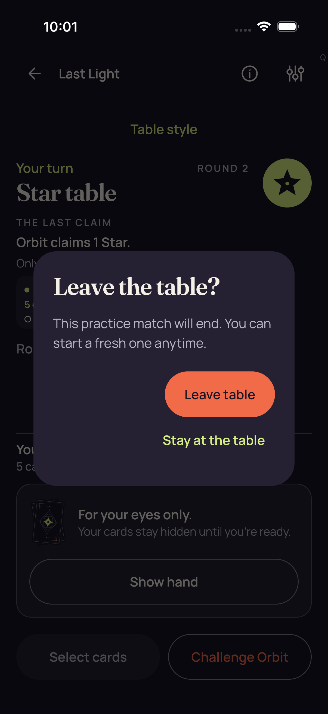</a>

Original filename: `99AF59C5-7A66-46E7-A0F1-7428847B8C69.png` · **1206 × 2622** · 249,192 bytes.

SHA-256: `afb7e84f6ba31ab477b8a7f46d319bb6606fa707ac248e92edca3a79620710a1`.

**[Direct original view — review_design (`/root/review_design`)](provenance/visual-review/review.json).** The full Leave the table? confirmation overlays the Standard Star round-2 concealed hand. Its explanatory text, orange Leave table button and Stay at the table action fit without clipping. The dimmed background retains covered-hand illustration and Show hand. No private faces are visible. This still does not remove the recorded 2D failure while querying the absent native status element; the paired JSON is cached lastDocument.

Original case: `PartyDeckGodotSessionUITests/testProduction2DPracticeSession()`; case outcome: **failed**; exported timestamp: `1789077692.513`; attachment label: `Actual production Leave confirmation_0_551E0176-2F16-4F2C-999A-0FD809247BFC.png`.

### 3d Standard concealed

<a href="godot-session/attachments/B9F9E38A-50BF-403C-AC4E-EE57A02CBE86.png">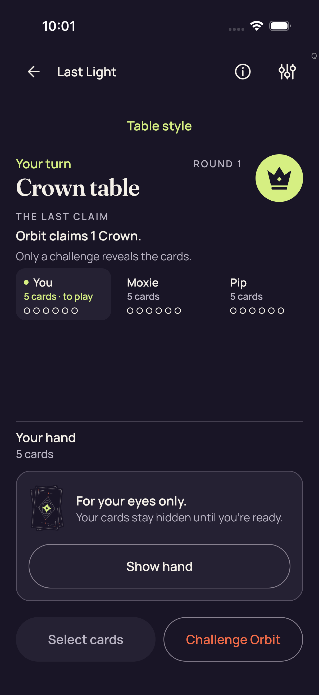</a>

Original filename: `B9F9E38A-50BF-403C-AC4E-EE57A02CBE86.png` · **1206 × 2622** · 238,298 bytes.

SHA-256: `75aa49cce74234ffbf98d737e074997f3d4aa65d3ade7d18ee41670fb133d1f6`.

**[Preserved original; unviewed](provenance/visual-review/review.json).** Original retained without direct visual review; no pixel acceptance asserted.

Original case: `PartyDeckGodotSessionUITests/testProduction3DPracticeSession()`; case outcome: **passed**; exported timestamp: `1789077719.121`; attachment label: `3d Standard concealed_0_94DB9384-3BF0-4A9B-92E5-0F82FF5C1200.png`.

### 3d Standard all five native card descriptions

Original filename: `563B229C-6A3F-4625-B6D9-D894DA00F085.png` · **1206 × 2622** · 203,377 bytes.

SHA-256: `bd7be5122a4b71bf10cb0de51e295cb0857ba819ea7e8d8be81c2757b16bfa1e`.

**[Preserved original; unviewed](provenance/visual-review/review.json).** Original retained without direct visual review; no pixel acceptance asserted.

Original case: `PartyDeckGodotSessionUITests/testProduction3DPracticeSession()`; case outcome: **passed**; exported timestamp: `1789077739.138`; attachment label: `3d Standard all five native card descriptions_0_E973DDCE-008F-4569-B1A9-575FC1B42850.png`.

### 3d Standard maximum selection and count-only feedback

<a href="godot-session/attachments/045C9265-912C-4942-B395-49A1D3C1BE06.png">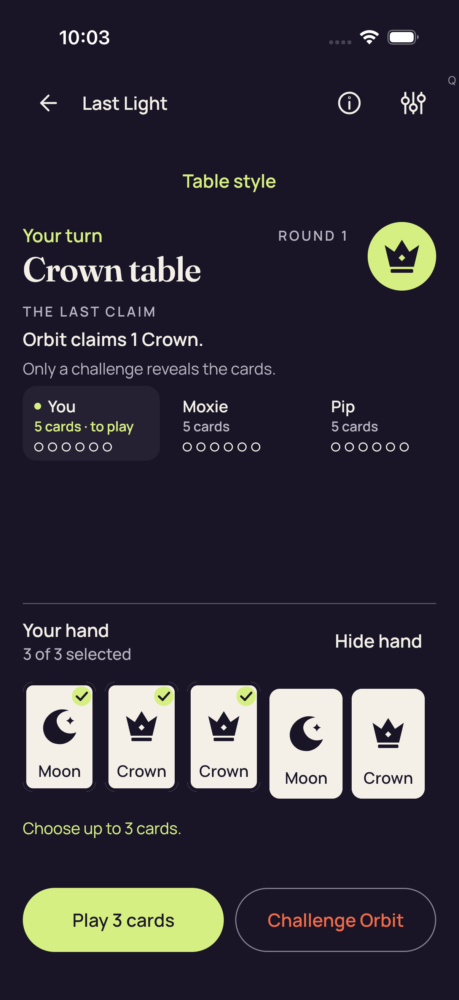</a>

Original filename: `045C9265-912C-4942-B395-49A1D3C1BE06.png` · **1206 × 2622** · 225,045 bytes.

SHA-256: `df6f14fd393230e97e94d2920daf491d2692f1619ea32870cb90b0fbf5c66e2b`.

**[Preserved original; unviewed](provenance/visual-review/review.json).** Original retained without direct visual review; no pixel acceptance asserted.

Original case: `PartyDeckGodotSessionUITests/testProduction3DPracticeSession()`; case outcome: **passed**; exported timestamp: `1789077834.699`; attachment label: `3d Standard maximum selection and count-only feedback_0_AF1F1EDB-780E-45ED-8636-CEA202F7C28E.png`.

### 3d Standard Hide removes private nodes and selection

<a href="godot-session/attachments/BF3DF3E2-EBD6-4AE5-9339-6974FDA127C1.png">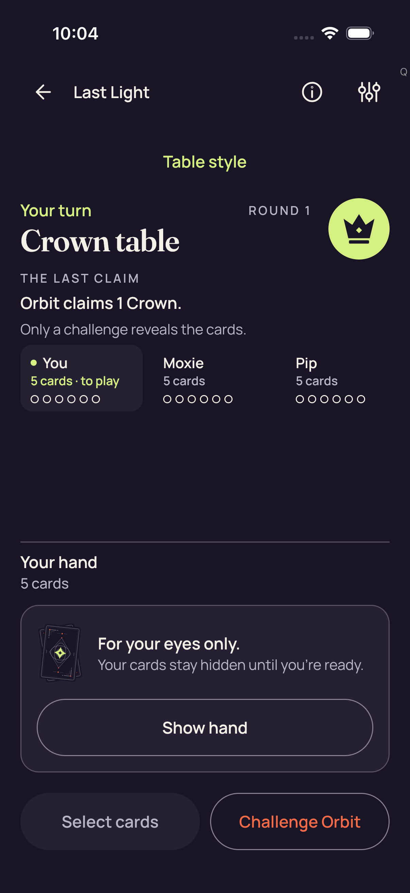</a>

Original filename: `BF3DF3E2-EBD6-4AE5-9339-6974FDA127C1.png` · **1206 × 2622** · 238,983 bytes.

SHA-256: `2eb8891657f87f13b3ad4bda7c2bcd3b52be1fb92509fc8123e6b84bf71bbde7`.

**[Preserved original; unviewed](provenance/visual-review/review.json).** Original retained without direct visual review; no pixel acceptance asserted.

Original case: `PartyDeckGodotSessionUITests/testProduction3DPracticeSession()`; case outcome: **passed**; exported timestamp: `1789077873.431`; attachment label: `3d Standard Hide removes private nodes and selection_0_27E18762-CA3D-43C4-8A4D-D4B8DB4A7ED5.png`.

### 3d Standard fresh Reveal is unselected

<a href="godot-session/attachments/305B3E98-25F7-43F0-BB7F-FEB018B8E2F2.png">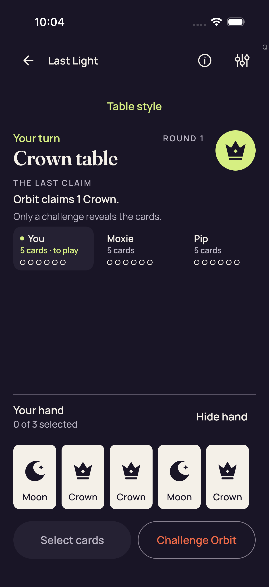</a>

Original filename: `305B3E98-25F7-43F0-BB7F-FEB018B8E2F2.png` · **1206 × 2622** · 203,083 bytes.

SHA-256: `47f3a79e713548ebf3d3c1e8a932dabad464e811da607cc589558f397f9e1651`.

**[Preserved original; unviewed](provenance/visual-review/review.json).** Original retained without direct visual review; no pixel acceptance asserted.

Original case: `PartyDeckGodotSessionUITests/testProduction3DPracticeSession()`; case outcome: **passed**; exported timestamp: `1789077894.195`; attachment label: `3d Standard fresh Reveal is unselected_0_50F5A56C-02BE-4683-AB5E-CF77D1B6CB6C.png`.

### 3d production concealed entry

<a href="godot-session/attachments/A66B26E3-3226-4D92-9D25-516EE55A39E1.png">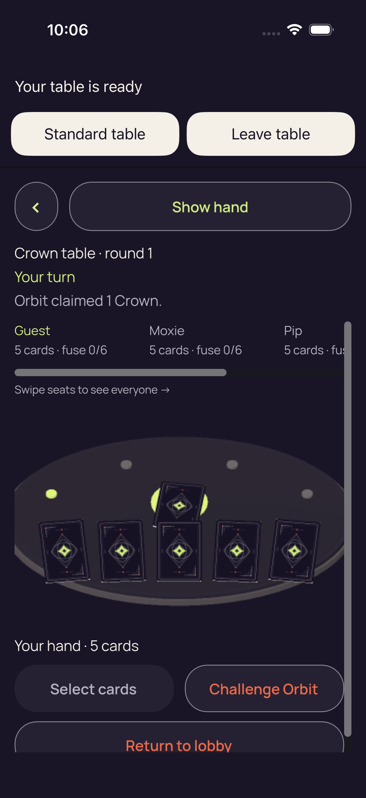</a>

Original filename: `A66B26E3-3226-4D92-9D25-516EE55A39E1.png` · **1206 × 2622** · 389,602 bytes.

SHA-256: `52e1c54d27bc85bd472d8b42907056ef9ed7ed167e8e33c1ecfb4d73ae501b2b`.

**[Direct original view — review_design (`/root/review_design`)](provenance/visual-review/review.json).** Native 3D shows Crown table · round 1, Your turn and Orbit claimed 1 Crown. The full upper Show hand button, five card backs, Your hand · 5 cards and full Select cards / Challenge Orbit buttons are visible. Guest/Moxie seat summaries fit; the later Pip summary is horizontally clipped with scrollbar and swipe instruction present. Return to lobby is partly cut at the lower body boundary. No private card faces are visible.

Original case: `PartyDeckGodotSessionUITests/testProduction3DPracticeSession()`; case outcome: **passed**; exported timestamp: `1789077961.735`; attachment label: `3d production concealed entry_0_0A02B2FC-3F25-4E7C-8796-C3212FE97085.png`.

### 3d real native card selection

<a href="godot-session/attachments/A4BFB7D6-3834-4024-A32C-6FA4998C8B5B.png">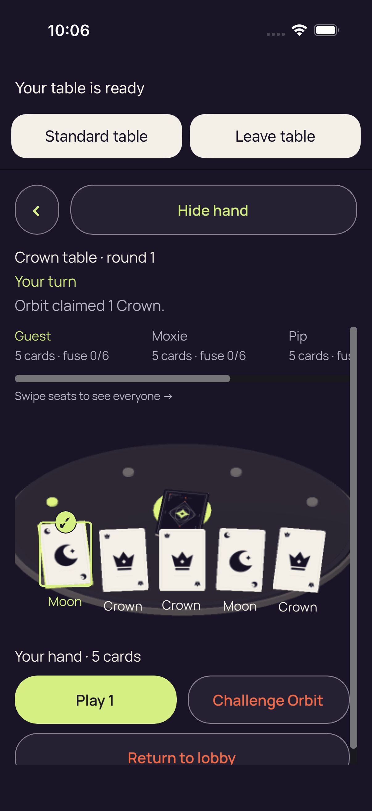</a>

Original filename: `A4BFB7D6-3834-4024-A32C-6FA4998C8B5B.png` · **1206 × 2622** · 351,501 bytes.

SHA-256: `673d4fdb0a614f64db9e2d8fda749f2457c1d50b055ed73caece3b9f53870bd7`.

**[Direct original view — review_design (`/root/review_design`)](provenance/visual-review/review.json).** Native 3D retains Crown round-1 context and shows five face-up cards labeled Moon, Crown, Crown, Moon, Crown. The first Moon has a lime outline and check. Hide hand, Your hand · 5 cards and the complete Play 1 / Challenge Orbit buttons fit. Later-seat text remains horizontally clipped, and Return to lobby remains partly below the body boundary. Private faces are intentionally visible in this selected checkpoint.

Original case: `PartyDeckGodotSessionUITests/testProduction3DPracticeSession()`; case outcome: **passed**; exported timestamp: `1789078006.568`; attachment label: `3d real native card selection_0_C421F555-2C2D-4A1B-A535-C681D587173A.png`.

### 3d Hide removes private faces labels and selection

Original filename: `85B831FB-0983-423C-AD4A-F1D6B38B9329.png` · **1206 × 2622** · 392,253 bytes.

SHA-256: `e99a486ef910904911327bc835237b34867cb0d47f6a18db9faaec7d696b82fb`.

**[Preserved original; unviewed](provenance/visual-review/review.json).** Original retained without direct visual review; no pixel acceptance asserted.

Original case: `PartyDeckGodotSessionUITests/testProduction3DPracticeSession()`; case outcome: **passed**; exported timestamp: `1789078011.241`; attachment label: `3d Hide removes private faces labels and selection_0_253D496D-2657-4391-8316-D7D3E717BF9F.png`.

### 3d real authority accepted native Play

<a href="godot-session/attachments/B24DD0E1-025D-4F87-8FA4-668FDF00C8A2.png">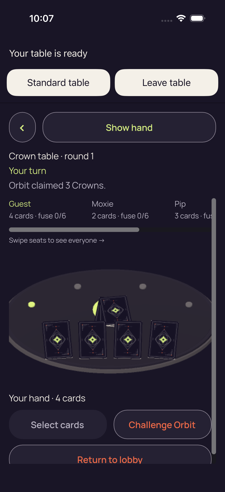</a>

Original filename: `B24DD0E1-025D-4F87-8FA4-668FDF00C8A2.png` · **1206 × 2622** · 388,823 bytes.

SHA-256: `902b4d458deb1ecec8ed567c36e0ae763182be0d2851775f8dfb7966f90aaafb`.

**[Direct original view — review_design (`/root/review_design`)](provenance/visual-review/review.json).** The native 3D accepted-Play checkpoint shows four card backs and Your hand · 4 cards. Crown round 1 remains, with Your turn and Orbit claimed 3 Crowns.; visible seat counts are Guest 4, Moxie 2 and Pip 3. Show hand and Select cards / Challenge Orbit fit. Pip details are horizontally clipped and Return to lobby is partly below the body boundary. No private faces or selected mark are visible.

Original case: `PartyDeckGodotSessionUITests/testProduction3DPracticeSession()`; case outcome: **passed**; exported timestamp: `1789078055.919`; attachment label: `3d real authority accepted native Play_0_6EF0F1BE-F64A-44E0-91A1-1C06195514FA.png`.

### 3d same session Standard return

Original filename: `9E8DE251-C95E-4634-BD60-E020EC4022B7.png` · **1206 × 2622** · 242,083 bytes.

SHA-256: `a5a51d8a85fd5a2324461009e7736ce5094fd6f66e40285259e3e5a3962d15c7`.

**[Direct original view — review_design (`/root/review_design`)](provenance/visual-review/review.json).** Standard return shows Crown table, ROUND 1, Your turn and Orbit claims 3 Crowns. Visible seat counts are You 4, Moxie 2 and Pip 3. Your hand / 4 cards and the complete For your eyes only. panel with Show hand fit, as do Select cards and Challenge Orbit. No private card faces are shown. Exact same-session continuity remains bound to the separately recorded native evidence.

Original case: `PartyDeckGodotSessionUITests/testProduction3DPracticeSession()`; case outcome: **passed**; exported timestamp: `1789078061.54`; attachment label: `3d same session Standard return_0_9532C8A0-F73A-40AD-B0CC-756D83C5D2EA.png`.

### 3d real Standard authority accepted PLAY_CARDS

<a href="godot-session/attachments/665DE40C-A526-4891-A08D-323AA5801AB0.png">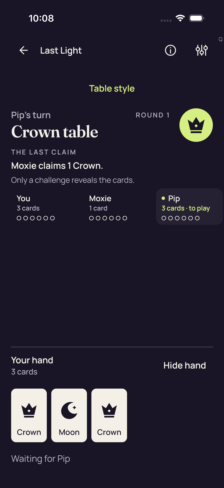</a>

Original filename: `665DE40C-A526-4891-A08D-323AA5801AB0.png` · **1206 × 2622** · 186,520 bytes.

SHA-256: `36719bd40630695e7bf7d8cec9081b792809f4340ec8f54966a6f9dc0ea04dd3`.

**[Direct original view — review_design (`/root/review_design`)](provenance/visual-review/review.json).** Standard Crown round 1 now shows Pip’s turn, Moxie claims 1 Crown., visible seat counts You 3 / Moxie 1 / Pip 3, and Your hand / 3 cards. Three face-up cards labeled Crown, Moon, Crown are fully visible with Hide hand and Waiting for Pip. No selected-card check is visible. This Standard accepted-Play still has private hand faces visible; it is distinct from the earlier concealed native accepted-Play frame.

Original case: `PartyDeckGodotSessionUITests/testProduction3DPracticeSession()`; case outcome: **passed**; exported timestamp: `1789078090.548`; attachment label: `3d real Standard authority accepted PLAY_CARDS_0_1926BB2E-0776-404E-8085-BB0FE4B73F40.png`.

### Actual production Leave confirmation

<a href="godot-session/attachments/36C729CF-7BA9-4FD4-887F-78278D570D77.png">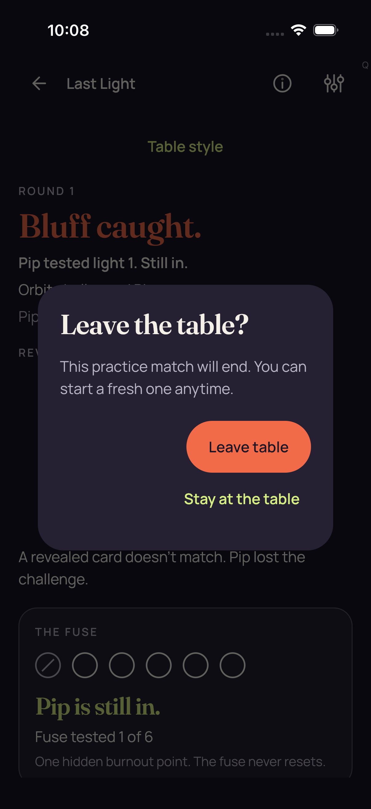</a>

Original filename: `36C729CF-7BA9-4FD4-887F-78278D570D77.png` · **1206 × 2622** · 224,588 bytes.

SHA-256: `dec602802cae627782873e1553b090149544f5ff11fc2fdd4fe7e96dc482027e`.

**[Direct original view — review_design (`/root/review_design`)](provenance/visual-review/review.json).** The complete Leave the table? dialog, explanation, Leave table button and Stay at the table action fit. The dimmed background is a public ROUND 1 Bluff caught. result with Pip tested light 1. Still in. and fuse information; the central public revealed-card area is obscured by the modal. No private hand faces are visible in the image.

Original case: `PartyDeckGodotSessionUITests/testProduction3DPracticeSession()`; case outcome: **passed**; exported timestamp: `1789078126.159`; attachment label: `Actual production Leave confirmation_0_1B9969C3-1B15-46F5-8C04-C5F35F55C293.png`.

### 3d Leave cancelled on same concealed session

<a href="godot-session/attachments/163945F5-5F24-4367-8B0A-D79AD8BE341E.png">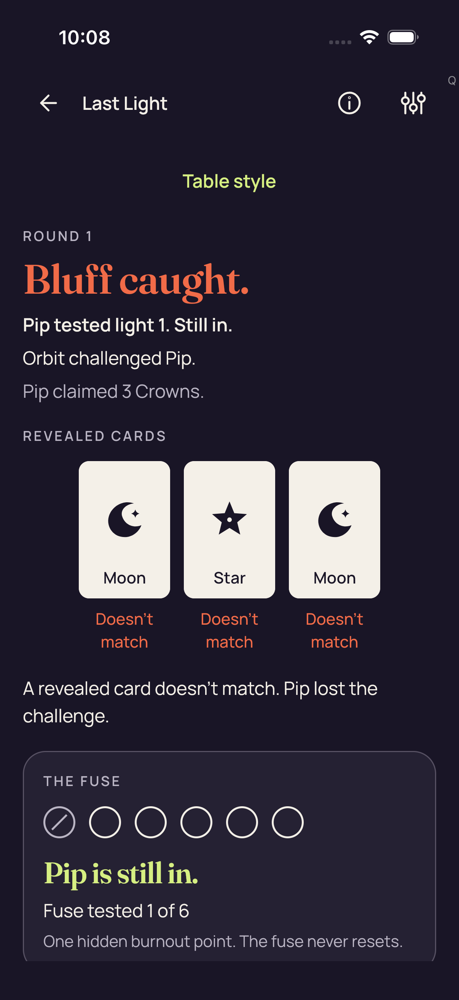</a>

Original filename: `163945F5-5F24-4367-8B0A-D79AD8BE341E.png` · **1206 × 2622** · 216,569 bytes.

SHA-256: `070cdc5f970b97df62bc9101789016a0c16330f624f03380e13271d4ccf613be`.

**[Preserved original; unviewed](provenance/visual-review/review.json).** Original retained without direct visual review; no pixel acceptance asserted.

Original case: `PartyDeckGodotSessionUITests/testProduction3DPracticeSession()`; case outcome: **passed**; exported timestamp: `1789078131.747`; attachment label: `3d Leave cancelled on same concealed session_0_B6B81B3D-3411-4180-AE07-259DC0C3F20D.png`.

### Actual production Leave confirmation

<a href="godot-session/attachments/6ACEF3C4-AAEC-46C9-8383-9199326A6C07.png">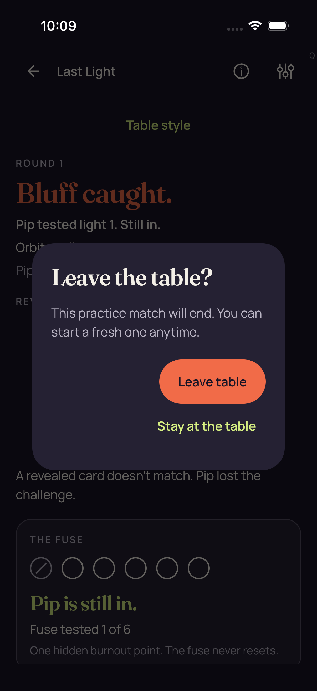</a>

Original filename: `6ACEF3C4-AAEC-46C9-8383-9199326A6C07.png` · **1206 × 2622** · 224,543 bytes.

SHA-256: `7bc666572b3cb2bb21d3783ba29a119179a54078ce18bf178aa42f18c662bc44`.

**[Preserved original; unviewed](provenance/visual-review/review.json).** Original retained without direct visual review; no pixel acceptance asserted.

Original case: `PartyDeckGodotSessionUITests/testProduction3DPracticeSession()`; case outcome: **passed**; exported timestamp: `1789078145.945`; attachment label: `Actual production Leave confirmation_0_80798A98-B23B-4B99-B333-991694E15B2C.png`.

### 3d confirmed Leave ended the session

<a href="godot-session/attachments/9B5624A1-BF15-4A0C-AEA0-BBD6CB6CAB56.png">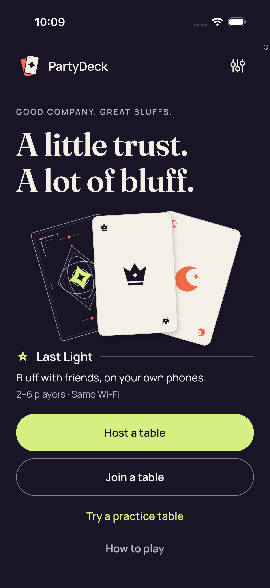</a>

Original filename: `9B5624A1-BF15-4A0C-AEA0-BBD6CB6CAB56.png` · **1206 × 2622** · 299,186 bytes.

SHA-256: `5bb34c311815338602bbd69cdb07907fdbacf54f29d0ab1ba8f54c25cb65ca3a`.

**[Direct original view — review_design (`/root/review_design`)](provenance/visual-review/review.json).** The post-Leave original shows the PartyDeck Home with A little trust. A lot of bluff., the decorative card artwork, Last Light description and complete Host a table, Join a table, Try a practice table and How to play actions. No active game hand is displayed. The card faces in the illustration are public Home artwork.

Original case: `PartyDeckGodotSessionUITests/testProduction3DPracticeSession()`; case outcome: **passed**; exported timestamp: `1789078148.715`; attachment label: `3d confirmed Leave ended the session_0_A07BD312-80FC-4753-8FF6-EE1E5816965B.png`.

### 3d real native card selection

<a href="godot-session/attachments/FE60E9B2-16A9-4401-9EBB-2C07559F1888.png">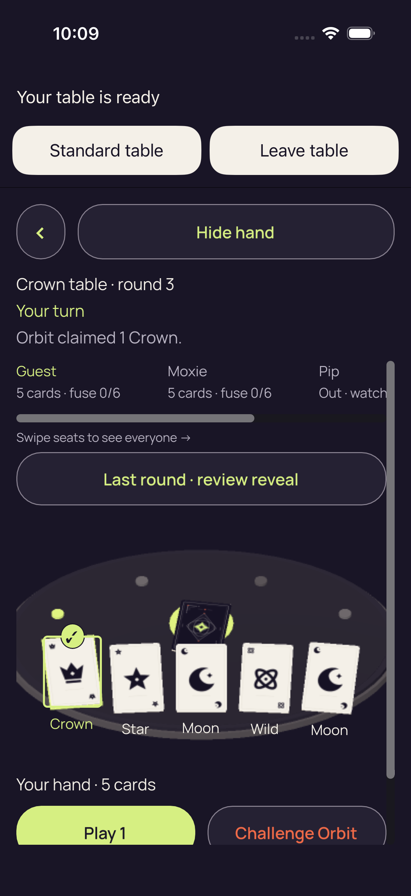</a>

Original filename: `FE60E9B2-16A9-4401-9EBB-2C07559F1888.png` · **1206 × 2622** · 365,111 bytes.

SHA-256: `81a2f0928be64cf5e1983e1cfa0dc345e05e3429114df327ba017789c0160248`.

**[Direct original view — review_design (`/root/review_design`)](provenance/visual-review/review.json).** The later native selection original shows Crown table · round 3, Your turn and Orbit claimed 1 Crown. Five faces labeled Crown, Star, Moon, Wild, Moon are visible, with the first Crown outlined and checked. Last round · review reveal and Hide hand fit; the lower Play 1 and Challenge Orbit controls are cut by the body boundary. Pip’s Out · watch… seat line is horizontally clipped, and Return to lobby is below the visible area. This captures the state associated with the new-practice/reuse case; the displayed round is 3.

Original case: `PartyDeckGodotSessionUITests/testProduction3DPracticeSession()`; case outcome: **passed**; exported timestamp: `1789078184.149`; attachment label: `3d real native card selection_0_6F121F6F-C146-4184-8506-1AD1CB7EFDF4.png`.

### 3d Hide removes private faces labels and selection

<a href="godot-session/attachments/203E7566-9B83-49ED-80C1-BB6C7E34FED8.png">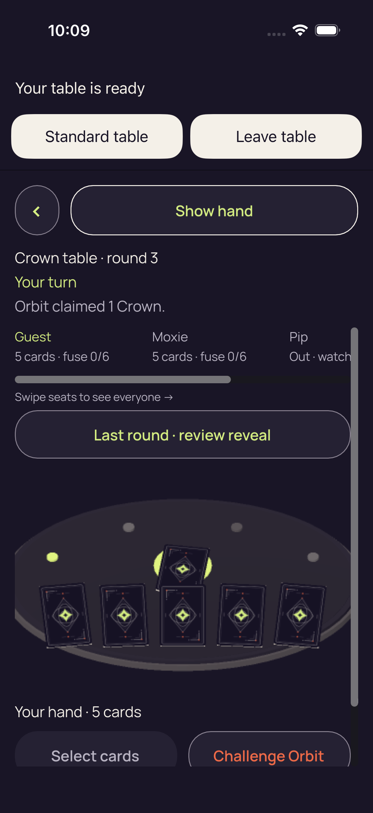</a>

Original filename: `203E7566-9B83-49ED-80C1-BB6C7E34FED8.png` · **1206 × 2622** · 403,197 bytes.

SHA-256: `cb148c4627b33ec33d3128b89fb0acf7e1af0a1fe998073905a86697bed04f34`.

**[Reviewed identical bytes; this identity not reopened (`/root/review_design`)](provenance/visual-review/review.json).** The later reentry/reuse original shows Crown table · round 3, Your turn and Orbit claimed 1 Crown. Five card backs and Your hand · 5 cards are visible with a full Show hand control and Last round · review reveal. Select cards and Challenge Orbit are cut at the lower body boundary, and later-seat details remain horizontally clipped. No private card faces or selected-card mark is visible. The source is byte-identical to the separately exported preceding Hide checkpoint.

Reviewed representative: [720C4985-B9CD-4C4D-8B98-1CF6CFAA1110.png](godot-session/attachments/720C4985-B9CD-4C4D-8B98-1CF6CFAA1110.png). The original identity and timestamp above remain separate.

Original case: `PartyDeckGodotSessionUITests/testProduction3DPracticeSession()`; case outcome: **passed**; exported timestamp: `1789078190.51`; attachment label: `3d Hide removes private faces labels and selection_0_1B7E7D7C-4FA0-4AD5-8116-ED45CE5EDC0B.png`.

### 3d new practice reuses engine and receives fresh input

Original filename: `720C4985-B9CD-4C4D-8B98-1CF6CFAA1110.png` · **1206 × 2622** · 403,197 bytes.

SHA-256: `cb148c4627b33ec33d3128b89fb0acf7e1af0a1fe998073905a86697bed04f34`.

**[Direct original view — review_design (`/root/review_design`)](provenance/visual-review/review.json).** The later reentry/reuse original shows Crown table · round 3, Your turn and Orbit claimed 1 Crown. Five card backs and Your hand · 5 cards are visible with a full Show hand control and Last round · review reveal. Select cards and Challenge Orbit are cut at the lower body boundary, and later-seat details remain horizontally clipped. No private card faces or selected-card mark is visible. The source is byte-identical to the separately exported preceding Hide checkpoint.

Original case: `PartyDeckGodotSessionUITests/testProduction3DPracticeSession()`; case outcome: **passed**; exported timestamp: `1789078191.112`; attachment label: `3d new practice reuses engine and receives fresh input_0_CBF7022F-13A8-42CA-AD7F-4AA97ADB68C1.png`.

### Actual production Leave confirmation

<a href="godot-session/attachments/C52710DF-62B8-47F4-91A8-7E17C82C5A3C.png">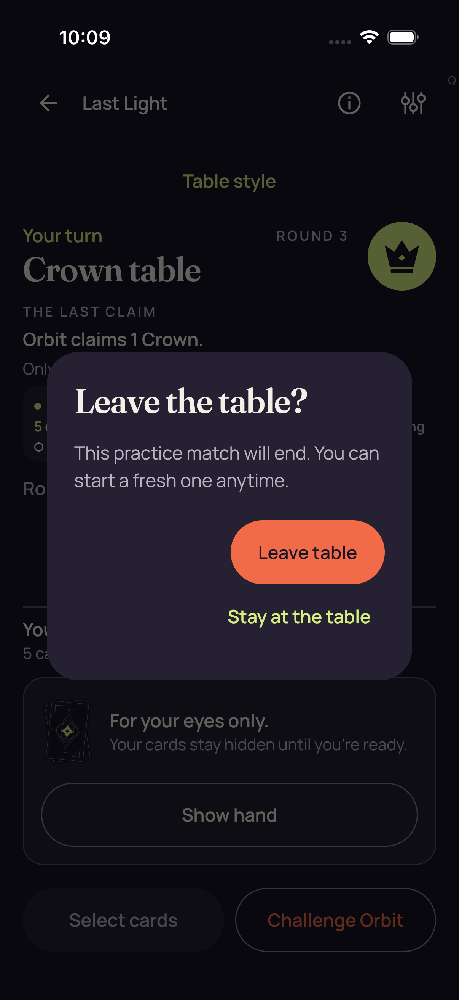</a>

Original filename: `C52710DF-62B8-47F4-91A8-7E17C82C5A3C.png` · **1206 × 2622** · 254,000 bytes.

SHA-256: `18586814e974291ad502139f880873c5f2bcf7615afe36ba8c9a20e5fd52d36b`.

**[Preserved original; unviewed](provenance/visual-review/review.json).** Original retained without direct visual review; no pixel acceptance asserted.

Original case: `PartyDeckGodotSessionUITests/testProduction3DPracticeSession()`; case outcome: **passed**; exported timestamp: `1789078196.755`; attachment label: `Actual production Leave confirmation_0_8BEBA9D2-FBB2-43DA-8E6B-E6E6F410FB29.png`.

### 3d production smoke cleanup complete

Original filename: `1FAA2CD2-6B72-4E2D-84CA-C05B53EE6289.png` · **1206 × 2622** · 299,186 bytes.

SHA-256: `5bb34c311815338602bbd69cdb07907fdbacf54f29d0ab1ba8f54c25cb65ca3a`.

**[Reviewed identical bytes; this identity not reopened (`/root/review_design`)](provenance/visual-review/review.json).** The post-Leave original shows the PartyDeck Home with A little trust. A lot of bluff., the decorative card artwork, Last Light description and complete Host a table, Join a table, Try a practice table and How to play actions. No active game hand is displayed. The card faces in the illustration are public Home artwork.

Reviewed representative: [9B5624A1-BF15-4A0C-AEA0-BBD6CB6CAB56.png](godot-session/attachments/9B5624A1-BF15-4A0C-AEA0-BBD6CB6CAB56.png). The original identity and timestamp above remain separate.

Original case: `PartyDeckGodotSessionUITests/testProduction3DPracticeSession()`; case outcome: **passed**; exported timestamp: `1789078199.759`; attachment label: `3d production smoke cleanup complete_0_9F76E5B7-2810-41DD-BD40-E35390E80A11.png`.
