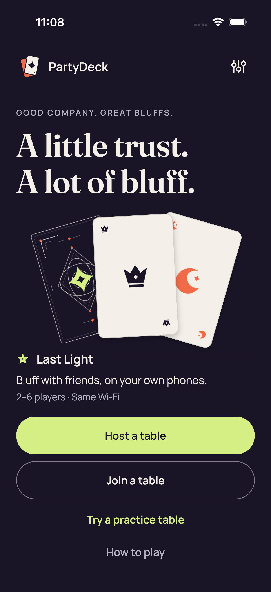
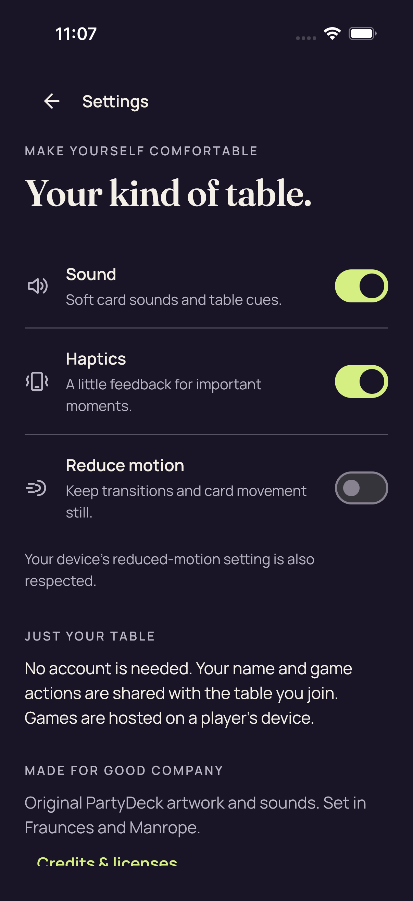

# Ordinary iOS — CI 34538972728

Six native unit tests passed; ordinary UI two of three passed. Host-name equality failed before host creation and invitation capture. These eight captures belong to the two passing ordinary UI cases. Guarded UIKit and production steps were skipped; no Simulator app tar exists.

Exact source: `dd6df8a530d71b51ae4c3b0f4a05246f2e58402f`. Platform: iPhone 17 Simulator, ordinary Compose UI.

**8 images**: 8 direct original view.

[Gallery index](../../README.md) · [Batch scope and review counts](../../provenance/20260911-4586/review-summary.json) · [Exact source paths, hashes and timestamps](../../provenance/20260911-4586/source-map.json).

### Home

`Home_0_854B22F1-EB40-436E-A1E0-27FD29F4A119.png` · 1206 × 2622 · 298,318 bytes.

SHA-256: `5f1b80f5e80a759b4b4cad9f72f316ea9121344b5c4e34b77d25f5582a36c0ce`.

**[Direct original view](../provenance/ordinary-visual-review/review.json).** Home shows the complete PartyDeck header/settings icon, A little trust. A lot of bluff. headline, card artwork, Last Light description and 2–6 players · Same Wi-Fi line. Host a table, Join a table, Try a practice table, and How to play are all completely visible without text or button clipping.

Original test: `PartyDeckUITests/testSharedHomeOpensAPlayablePracticeTable()`. Attachment timestamp: `2026-09-10T23:08:21.342+0000`.

### Practice Standard Hide removes private nodes and selection

`Practice Standard Hide removes private nodes and selection_0_7129C270-1AD7-48FA-A903-49D6CA61AE7F.png` · 1206 × 2622 · 280,895 bytes.

SHA-256: `2e5cd937693ffd654622081a0acda5a046e21dd8f197e9bcafa884b74b22340a`.

**[Direct original view](../provenance/ordinary-visual-review/review.json).** After Hide, the five face-up hand cards and selection count are replaced by the full five-card concealed panel and Show hand button. No private hand faces or selected checks are visible. The Crown round-1 claim remains. Wild cards always match, disabled Select cards and Challenge Orbit fit fully. This single still does not establish continuous concealment during the transition or accessibility node removal.

Original test: `PartyDeckUITests/testSharedHomeOpensAPlayablePracticeTable()`. Attachment timestamp: `2026-09-10T23:10:21.611+0000`.

### Practice Standard all five native card descriptions

`Practice Standard all five native card descriptions_0_9B1E9A18-DC61-42B0-8E59-0FEDC5758EB1.png` · 1206 × 2622 · 247,717 bytes.

SHA-256: `26b1200df50d1fd3df948b6e2388b60ecf92838d59ec97e44ba07c8be02dd9e9`.

**[Direct original view](../provenance/ordinary-visual-review/review.json).** The same Crown round-1 public context remains. The revealed hand shows five complete cards in one row: Star, Moon, Star, Star, Moon. Each symbol and text label fits. 0 of 3 selected, Hide hand, the Wild-card helper, disabled Select cards and Challenge Orbit controls are completely visible. No hand card is marked selected. This still does not establish spoken accessibility descriptions.

Original test: `PartyDeckUITests/testSharedHomeOpensAPlayablePracticeTable()`. Attachment timestamp: `2026-09-10T23:08:50.385+0000`.

### Practice Standard concealed

`Practice Standard concealed_0_9980F942-A7CF-4436-8701-65BCD054FE2C.png` · 1206 × 2622 · 282,251 bytes.

SHA-256: `f76d0adae79aff3685e6817020aeffffe8b1494791a1d7e5e6778320639a0d10`.

**[Direct original view](../provenance/ordinary-visual-review/review.json).** Standard Practice shows Your turn, Crown table, ROUND 1 and Orbit claims 2 Crowns with only claim card backs. You, Moxie and Pip seat summaries are readable. The full five-card concealed panel, For your eyes only helper, Show hand button, Wild cards always match line, disabled Select cards and Challenge Orbit controls all fit. No private hand faces are visible.

Original test: `PartyDeckUITests/testSharedHomeOpensAPlayablePracticeTable()`. Attachment timestamp: `2026-09-10T23:08:26.877+0000`.

### Practice Standard fresh Reveal is unselected

`Practice Standard fresh Reveal is unselected_0_909AFC41-51D6-46A6-A6C5-2A39B9196165.png` · 1206 × 2622 · 246,357 bytes.

SHA-256: `791635301b9bf2b00ada219a8c36cf63c8d43c9e0fc8f11e362d84639319a1da`.

**[Direct original view](../provenance/ordinary-visual-review/review.json).** Fresh Reveal again shows all five complete Star, Moon, Star, Star, Moon cards and 0 of 3 selected. No checkmark remains on any hand card. Hide hand, the Wild-card helper, disabled Select cards and Challenge Orbit all fit fully below the unchanged Crown round-1 public context.

Original test: `PartyDeckUITests/testSharedHomeOpensAPlayablePracticeTable()`. Attachment timestamp: `2026-09-10T23:10:40.922+0000`.

### Practice Standard maximum selection and count-only feedback

`Practice Standard maximum selection and count-only feedback_0_A52DA0A6-7B2F-4EAF-B5C9-7875CA30B2F7.png` · 1206 × 2622 · 266,588 bytes.

SHA-256: `3ec83ed2af422adfe75025a11991c943f8bf428178833e46e79b898f7c730107`.

**[Direct original view](../provenance/ordinary-visual-review/review.json).** Standard Practice retains the Crown round-1 public context. All five hand faces and labels fit; the first Star, Moon and next Star have lime checkmarks, matching the visible 3 of 3 selected count. Hide hand, Choose up to 3 cards, You’ll claim 3 Crowns, full Play 3 cards and Challenge Orbit are readable and fully within the viewport.

Original test: `PartyDeckUITests/testSharedHomeOpensAPlayablePracticeTable()`. Attachment timestamp: `2026-09-10T23:09:53.567+0000`.

### Practice after accepted play

`Practice after accepted play_0_BC081977-F1EE-49B7-BD7C-37A5403E3B7F.png` · 1206 × 2622 · 231,976 bytes.

SHA-256: `d469d266c0963641a633f89b1ba9f78ba3b5908f5010d081a52c5ebcdb4c2f0c`.

**[Direct original view](../provenance/ordinary-visual-review/review.json).** The later original shows ROUND 1, Bluff caught, Native Host tested light 1. Out of the match., Moxie challenged Native Host, and the public claim of 1 Crown. A fully visible public Star proof card is marked Doesn’t match; the explanation says Native Host lost the challenge. The complete Fuse panel shows one marked fuse, Native Host burned out, Fuse tested 1 of 6, and the supporting copy. No continuation action is visible at this scroll position. This still does not establish its scroll reachability, and the public revealed proof card is distinct from a private hand display.

Original test: `PartyDeckUITests/testSharedHomeOpensAPlayablePracticeTable()`. Attachment timestamp: `2026-09-10T23:11:15.080+0000`.

### Settings

`Settings_0_A5CB563C-8776-4F2B-95B6-6FEF4EEC2841.png` · 1206 × 2622 · 287,621 bytes.

SHA-256: `f2098f43d60ae16dd4917a7857ff4dc08507d358105ee9adfecff8e75d265684`.

**[Direct original view](../provenance/ordinary-visual-review/review.json).** Settings shows Sound and Haptics switched on, Reduce motion switched off, and all three full switch controls with readable labels and helper copy. The reduced-motion notice, account/table-hosting text, and artwork/font credits are readable. The Credits & licenses link is partially cut at the bottom content boundary; scroll reachability is not established by this still.

Original test: `PartyDeckUITests/testNativeHostCanNavigateSharedSettings()`. Attachment timestamp: `2026-09-10T23:07:29.548+0000`.

Original media companions and review receipts

| Preserved file | Bytes | SHA-256 |
| --- | ---: | --- |
| [provenance/collector/ordinary-passing-ui-png-handoff-v1.json](../provenance/collector/ordinary-passing-ui-png-handoff-v1.json) | 27,401 | `aea4521c920f1fb996d386c30c789de42dadb35f305dc6838a17eec1b178ee45` |
| [provenance/collector/source-producer-native-binding-v1.json](../provenance/collector/source-producer-native-binding-v1.json) | 66,862 | `a18958f5266ff0a6fe4eabde89f6e8f27baba7dd49e14d279c1300da9ef21d65` |
| [provenance/collector/ordinary-named-xcresult-results-v1.json](../provenance/collector/ordinary-named-xcresult-results-v1.json) | 8,182 | `c9f9e0af902e904d57870e558b2c36e1f67a87fff63576cc842ebb429aaf24d2` |
| [provenance/collector/ordinary-xctest-attachment-index-v1.json](../provenance/collector/ordinary-xctest-attachment-index-v1.json) | 54,808 | `90242059d184dd2bdb7868694252ded07672f2a6618e36e383a76d201aabd159` |
| [provenance/collector/ordinary-xctest-failure-audit-v1.json](../provenance/collector/ordinary-xctest-failure-audit-v1.json) | 13,698 | `a5bb3eef984f61ff95dffad6d613da0914e8573d17718b009a34afb0c610040a` |
| [provenance/collector/FROZEN.json](../provenance/collector/FROZEN.json) | 136,869 | `257aa021cb2c2edb40ea0d859c44704d8a02dfbfe5cf065078f17d95ed6a2bd9` |
| [provenance/collector/final-evidence-handoff-v1.json](../provenance/collector/final-evidence-handoff-v1.json) | 5,925 | `c28dc96beb8057d5e95769e0e52eb154ad43716c2249f7096a133459ef0cdaab` |
| [provenance/ordinary-visual-review/FROZEN.json](../provenance/ordinary-visual-review/FROZEN.json) | 1,324 | `87fd9b843cbbe0dc76e06e870ca1ea9aede2fc8865c3160c31bc45f87609bcf4` |
| [provenance/ordinary-visual-review/direct-views-01.json](../provenance/ordinary-visual-review/direct-views-01.json) | 4,385 | `7baac62755e375e5bdee43aa53c1511e9f46b56d8727722ac043a1da9f1709e3` |
| [provenance/ordinary-visual-review/direct-views-02.json](../provenance/ordinary-visual-review/direct-views-02.json) | 4,627 | `fab26d2dccd9642a7a2a4dee7ec2327ca90c2d5d3847a814d43d1592725b43de` |
| [provenance/ordinary-visual-review/direct-views-03.json](../provenance/ordinary-visual-review/direct-views-03.json) | 4,781 | `3000b7301bc4d2363f6b35fe791639d2e2f82ee4a74a77978eaa1e8b38e1e569` |
| [provenance/ordinary-visual-review/direct-views-04.json](../provenance/ordinary-visual-review/direct-views-04.json) | 4,724 | `482033aea5f1621cef2a68caf0e98e5b6771cd782587ba44927800ba6fc92311` |
| [provenance/ordinary-visual-review/review.json](../provenance/ordinary-visual-review/review.json) | 19,804 | `9f55069c08dd18b089a7870f21e5eeb335379b8a540b6c17f190fc1c01c13828` |
| [ordinary/failure-attachments/kXCTAttachmentScreenRecording_0_BF940F39-DFBE-4F33-8046-7521018A3BC5.mp4](failure-attachments/kXCTAttachmentScreenRecording_0_BF940F39-DFBE-4F33-8046-7521018A3BC5.mp4) | 3,255,255 | `2c86f1c16af32595a022327f3e059d8f4e131043406ce941cf28d289b8820e9d` |

