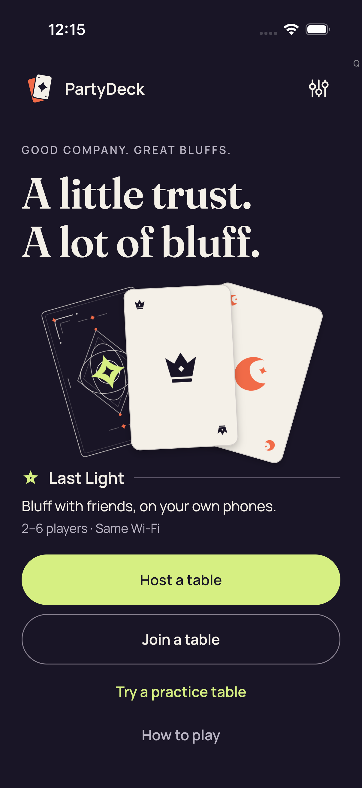

# Focused iOS initial-observation failure — CI 34544241421

Both focused production cases failed initial Home observation decoding before Practice. Two distinct screenshot identities have identical bytes: one direct view and one verified byte match. No observation JSON or body-scroll evidence was exported. The two original videos remain in their intact source ZIP, unviewed and undecoded.

Exact source: `aa1d1df822680debec6190d9df72ab11337501bb`. Platform: iPhone 17 Simulator.

**2 images**: 1 reviewed byte match; this identity was not reopened; 1 direct original view.

[Gallery index](../README.md) · [Batch scope and review counts](../provenance/20260911-4586/review-summary.json) · [Exact source paths, hashes and timestamps](../provenance/20260911-4586/source-map.json).

### 3d production smoke failure_0_AA7016A7-ED0F-46DC-B461-9D717C495291.png

`306264E7-8BE2-4FCA-BBE9-38EDCB7ED837.png` · 1206 × 2622 · 298,668 bytes.

SHA-256: `ed3e51d528aaad9510528fa0a6bf4d12ba01ef53a0e74d59e743568fdc1cdad6`.

**[Reviewed byte match; this identity was not reopened](provenance/visual-review/review.json).** Home is fully visible with PartyDeck branding, hero/card illustration, Last Light copy, complete Host a table and Join a table controls, Try a practice table and How to play. No keyboard, dialog or game-session hand appears. A small Q glyph is visible near the upper-right edge; this still alone does not establish its behavior. The displayed Home does not diagnose the observation-decoding failure or establish that Practice was entered.

Reviewed representative: [3F88A7CD-AA0F-4914-A5F5-4BA54E772F58.png](godot-session/attachments/3F88A7CD-AA0F-4914-A5F5-4BA54E772F58.png).

Original test: `PartyDeckGodotSessionUITests/testProduction3DPracticeSession()`. Attachment timestamp: `1789085714.509`.

### 2d production smoke failure_0_66CCC50D-5B76-4DF0-9D3F-1848930224AD.png

`3F88A7CD-AA0F-4914-A5F5-4BA54E772F58.png` · 1206 × 2622 · 298,668 bytes.

SHA-256: `ed3e51d528aaad9510528fa0a6bf4d12ba01ef53a0e74d59e743568fdc1cdad6`.

**[Direct original view](provenance/visual-review/review.json).** Home is fully visible with PartyDeck branding, hero/card illustration, Last Light copy, complete Host a table and Join a table controls, Try a practice table and How to play. No keyboard, dialog or game-session hand appears. A small Q glyph is visible near the upper-right edge; this still alone does not establish its behavior. The displayed Home does not diagnose the observation-decoding failure or establish that Practice was entered.

Original test: `PartyDeckGodotSessionUITests/testProduction2DPracticeSession()`. Attachment timestamp: `1789085705.608`.

Original media companions and review receipts

| Preserved file | Bytes | SHA-256 |
| --- | ---: | --- |
| [godot-session/test-summary.json](godot-session/test-summary.json) | 2,223 | `293084eae31914a26d70ad420da8c637ac1144cd9f599b65e28202a04a53ec0a` |
| [godot-session/result.json](godot-session/result.json) | 2,342 | `26df35cb902e140faef16e890cb46391a2188bc791b063932e0958f8ea7f260f` |
| [godot-session/test-evidence-export.json](godot-session/test-evidence-export.json) | 73 | `a26fb7cf154c7bb08a3a3ff377334bab7314f8323ab0092a4674eacf1ef35a8f` |
| [godot-session/build-settings.json](godot-session/build-settings.json) | 78,137 | `56f83e189532891c942bd50ae6b54526484aed9e8c45af9d2b894660d8e05aa5` |
| [godot-session/attachments/manifest.json](godot-session/attachments/manifest.json) | 2,212 | `bc478232e16f21ed26b6230c68a55d2bd21e6ff10ecc414c1853ec3a68fd5799` |
| [provenance/collector/focused-production-outcome-v1.json](provenance/collector/focused-production-outcome-v1.json) | 20,587 | `365f2939013bb976c7b14cf26b34f017b947505bde8ed40f29c1c3bb2dfd36fe` |
| [provenance/collector/source-producer-native-binding-v1.json](provenance/collector/source-producer-native-binding-v1.json) | 60,449 | `bbdff6193a57c6d1de412a753902465629a3a1275c2d172509a915ea8fdd16b3` |
| [provenance/collector/simulator-packaged-bytes-verification-v1.json](provenance/collector/simulator-packaged-bytes-verification-v1.json) | 70,914 | `f983f26bbf6ca1ee71ac098a4aebf6f125e7fb6806c88538c06a44d803d8f831` |
| [provenance/collector/FROZEN.json](provenance/collector/FROZEN.json) | 39,441 | `999880d924720df7c58781f6647784ad06067adc545076c7bf6202318278105e` |
| [provenance/collector/final-evidence-handoff-v1.json](provenance/collector/final-evidence-handoff-v1.json) | 5,473 | `4179de3ba9b40fa579d6253c5fc6060550486a4d226d7aff62e260e2d5e6a09b` |
| [provenance/visual-review/FROZEN.json](provenance/visual-review/FROZEN.json) | 372 | `f4f040eaa2193c202b1059d5610d94d9ae3dd22b2bd0f7548064f594fc8f63ef` |
| [provenance/visual-review/review.json](provenance/visual-review/review.json) | 6,585 | `19cc2fbcdf73051ec9c5d920b3c43ed6491dd7f107e78f91ff3bfeaa9a6e5de3` |

