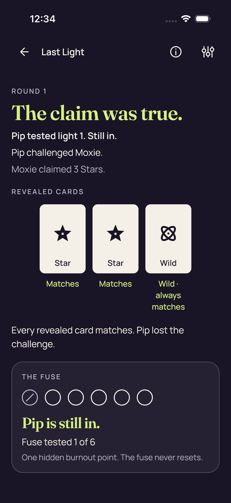
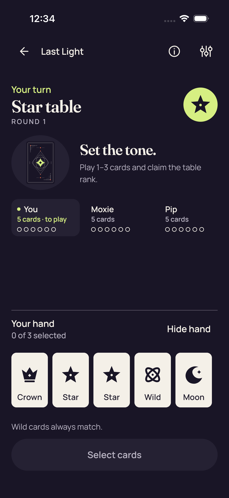
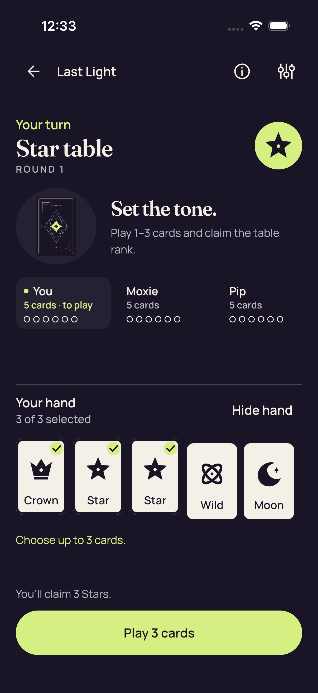
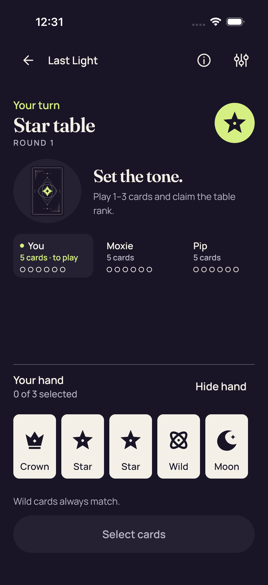
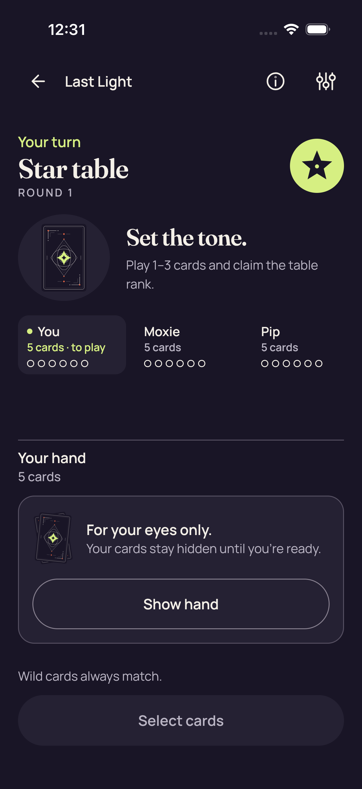
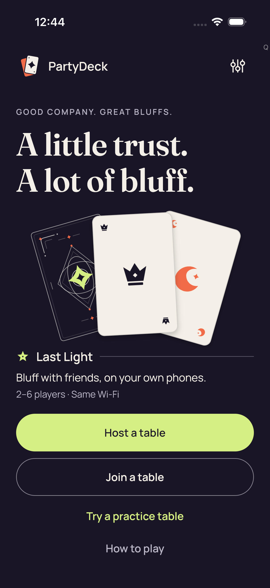

# iOS full retry stills — CI 34545222517

This batch preserves **12 original PNG attachments**: ten from ordinary UI tests and two production Godot failure stills. Each exported filename, test identity and timestamp is retained even when image bytes match.

Pixel review coverage: 10 direct views, 2 reviewed byte matches, 0 unviewed.

Source revision: `3d73b34390d376f37554361d64c23fdcfc822c04`. Ordinary tests pass 9/9, and the separate UIKit suite passes 3/3; those suites overlap in source cases and are not twelve unique tests. Both production Godot cases fail at the initial Home observation decode. These stills do not establish the failing field or successful Practice entry.

The two iOS MP4s remain archive-only and unviewed; this batch contains no iOS video derivatives. The canceled diagnostic run 34547924733 produced no native stills.

[Capture manifest](manifest.json) · [Collector handoff](provenance/collector/final-evidence-handoff-v1.json)

## Settings

**Direct view** · /root/pixel_d1_land · 1206 × 2622 · 288,419 bytes.

Original: `7B0FEA18-597A-4C42-90CE-552398B35290.png`; SHA-256 `f72b153dbc7dd9fff9da270e38779529b44036057e6f3b4913fd095c2deab216`.

Test: `PartyDeckUITests/testNativeHostCanNavigateSharedSettings()`. Export timestamp: `1789086611.241`.

[Attributed observation and limits](provenance/review/review.json).

## Native host invitation closed

**Reviewed byte match** · /root/pixel_d1_land · 1206 × 2622 · 225,036 bytes.

Original: `4C9B91D9-118F-4B91-877E-F7548F5E468C.png`; SHA-256 `2dd584d9b4186c63e54bfcfff0a34cbcac774a25783c014c330a1f92e8a00fe1`.

Test: `PartyDeckUITests/testSharedControllerHostsANativeTableAndShowsItsInvitation()`. Export timestamp: `1789086655.063`.

[Attributed observation and limits](provenance/review/review.json).

## Native host lobby

**Direct view** · /root/pixel_d1_land · 1206 × 2622 · 225,036 bytes.

Original: `DE08BEA8-0BA2-4343-B31E-D3EC1D7C2BDD.png`; SHA-256 `2dd584d9b4186c63e54bfcfff0a34cbcac774a25783c014c330a1f92e8a00fe1`.

Test: `PartyDeckUITests/testSharedControllerHostsANativeTableAndShowsItsInvitation()`. Export timestamp: `1789086644.351`.

[Attributed observation and limits](provenance/review/review.json).

## Practice after accepted play

**Direct view** · /root/pixel_d1_land · 1206 × 2622 · 226,981 bytes.

Original: `913B2DD5-9A9E-4E00-8FAF-AD4DDD58E335.png`; SHA-256 `8c3359f59125f91486f19600ee4a77801dea35f5dce1388c3b04412c899dc97c`.

Test: `PartyDeckUITests/testSharedHomeOpensAPlayablePracticeTable()`. Export timestamp: `1789086899.526`.

[Attributed observation and limits](provenance/review/review.json).

## Practice Standard fresh Reveal is unselected

**Direct view** · /root/pixel_d1_land · 1206 × 2622 · 214,110 bytes.

Original: `5123BA2F-F2C5-489D-B1D9-0D6A8DCB2D5E.png`; SHA-256 `04a19b6c114234b80b8740d1c977b18d997a8e67a3c223568aa6635f7fc17804`.

Test: `PartyDeckUITests/testSharedHomeOpensAPlayablePracticeTable()`. Export timestamp: `1789086859.253`.

[Attributed observation and limits](provenance/review/review.json).

## Practice Standard Hide removes private nodes and selection

**Direct view** · /root/pixel_d1_land · 1206 × 2622 · 239,751 bytes.

Original: `51BBA598-B230-4BE2-A999-1398F2950E75.png`; SHA-256 `82982ec921460cae9f1f73d9027a404c3a902fa2ef799baf04ef76e9b7de01e8`.

Test: `PartyDeckUITests/testSharedHomeOpensAPlayablePracticeTable()`. Export timestamp: `1789086833.816`.

[Attributed observation and limits](provenance/review/review.json).

## Practice Standard maximum selection and count-only feedback

**Direct view** · /root/pixel_d1_land · 1206 × 2622 · 224,155 bytes.

Original: `7059BCC9-5AD1-40C6-B422-AA78ECD3AE3D.png`; SHA-256 `2b3343a2c8ec227a910ffc9a34718b28e78156a45ec94efaec4bacb62d3db1ec`.

Test: `PartyDeckUITests/testSharedHomeOpensAPlayablePracticeTable()`. Export timestamp: `1789086799.248`.

[Attributed observation and limits](provenance/review/review.json).

## Practice Standard all five native card descriptions

**Direct view** · /root/pixel_d1_land · 1206 × 2622 · 213,570 bytes.

Original: `BE1944BF-1BA6-4EA3-AFB7-13C2DDD5AA38.png`; SHA-256 `28937d2616c3a3105df05d60883e58a07d78c583f3a2d220dd6c022105db1df4`.

Test: `PartyDeckUITests/testSharedHomeOpensAPlayablePracticeTable()`. Export timestamp: `1789086712.05`.

[Attributed observation and limits](provenance/review/review.json).

## Practice Standard concealed

**Direct view** · /root/pixel_d1_land · 1206 × 2622 · 239,593 bytes.

Original: `301AA8B3-5D5E-45F0-8E16-71F75B345128.png`; SHA-256 `7ee77c2a0b19d5e3221ab45938d35930151fc14d77b2fa484c042d89a63fd399`.

Test: `PartyDeckUITests/testSharedHomeOpensAPlayablePracticeTable()`. Export timestamp: `1789086683.293`.

[Attributed observation and limits](provenance/review/review.json).

## Home

**Direct view** · /root/pixel_d1_land · 1206 × 2622 · 297,892 bytes.

Original: `CA9D8C7A-7B40-4192-91D3-F480A6AF80FA.png`; SHA-256 `80d16a0791d3bca1809b22d45d7e39cc3baf40dbbe16237bb9f8b211eae48b0a`.

Test: `PartyDeckUITests/testSharedHomeOpensAPlayablePracticeTable()`. Export timestamp: `1789086678.03`.

[Attributed observation and limits](provenance/review/review.json).

## 2d production smoke failure

**Direct view** · /root/pixel_d1_land · 1206 × 2622 · 298,389 bytes.

Original: `B422B819-67D4-4AAA-932C-9F377A249B3E.png`; SHA-256 `cd289b6af7723d2fc222d394fcc35af363d67fd9829e36f89465fd77440081f5`.

Test: `PartyDeckGodotSessionUITests/testProduction2DPracticeSession()`. Export timestamp: `1789087451.756`.

[Attributed observation and limits](provenance/review/review.json).

## 3d production smoke failure

**Reviewed byte match** · /root/pixel_d1_land · 1206 × 2622 · 298,389 bytes.

Original: `77397327-DE50-4252-A28C-40124C2608FF.png`; SHA-256 `cd289b6af7723d2fc222d394fcc35af363d67fd9829e36f89465fd77440081f5`.

Test: `PartyDeckGodotSessionUITests/testProduction3DPracticeSession()`. Export timestamp: `1789087469.612`.

[Attributed observation and limits](provenance/review/review.json).

