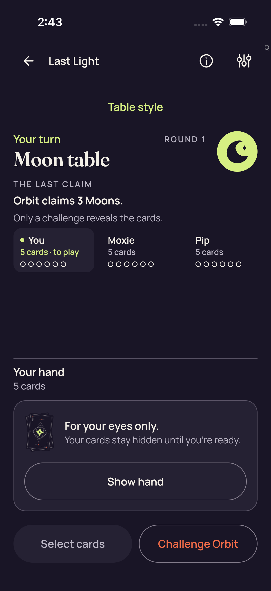
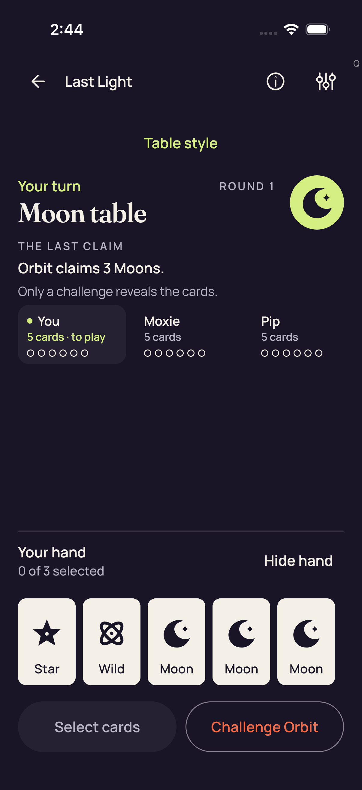
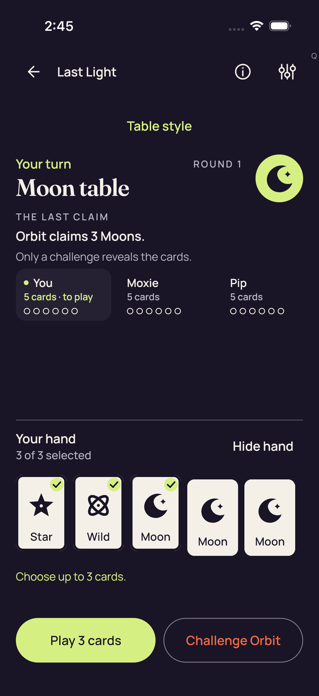
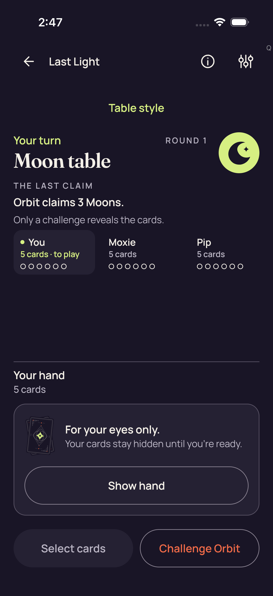

# Failed 2D case — six original Standard practice stills

[Collection overview](../README.md)

All six images belong to the failed 2D production case. The reviewer directly inspected three concealed and three explicit Reveal/selection frames. No clear layout defect or visible concealed-hand leak was observed in these snapshots. The final failure image remains a concealed Standard table; the stills establish neither a native 2D pass nor the runtime failure’s cause.

## 01 · Standard practice table, concealed hand

**Direct view** by `/root/pixel_d1_land`; 1206 × 2622 original pixels. [Attributed pixel receipt](../provenance/pixel-review-2d/review.json).

Original filename: `E381C1D5-2D5E-4C14-941C-D5E7F39B2BDA.png`. Original size: 240,460 bytes. SHA-256: `3eaa5f8bc84058e5e453a34c037b0a74a5458b32bc2d14b74790b1eacf95508d`.

Original export timestamp: `1789094620.554` (`2026-09-11T02:43:40.554Z`); source capture-pointer index 5. Case outcome: **failed**. The original attachment failure flag is `false`.

Original test label: `2d Standard concealed_0_186C4712-2C99-44C5-87F5-EE02ED021FE3.png`.

Last Light shows Your turn, Moon table, Round 1, and the public claim that Orbit claims 3 Moons. The visible player summaries show card counts. Your hand shows 5 cards, a card-back illustration, the privacy copy, and Show hand; no hand faces or private rank labels are visible. Select cards is visually dimmed.

The heading, public claim, visible player summaries, concealed-hand panel, Show hand, and bottom actions fit the portrait viewport without overlap or clipped labels.

Review limits: This still establishes concealment at this instant only. The image does not establish accessibility-node absence or control reachability.

## 02 · Standard practice table, explicitly revealed local hand with zero selection

**Direct view** by `/root/pixel_d1_land`; 1206 × 2622 original pixels. [Attributed pixel receipt](../provenance/pixel-review-2d/review.json).

Original filename: `5527A3FF-0D33-419E-A04E-4A9E2423F777.png`. Original size: 210,426 bytes. SHA-256: `d9a1616735d6b87ce78909eaff39ee19bd54a2ec87d088d0d031424509c35f25`.

Original export timestamp: `1789094644.876` (`2026-09-11T02:44:04.876Z`); source capture-pointer index 4. Case outcome: **failed**. The original attachment failure flag is `false`.

Original test label: `2d Standard all five native card descriptions_0_574E1A24-F960-4B23-9E9B-088A89B0DBD9.png`.

The local hand contains five visible face-up cards and readable labels, with 0 of 3 selected and Hide hand. All five cards have the same unselected appearance. The public claim and visible player summaries remain on screen. Select cards is visually dimmed.

All five cards, their labels, the selection count, Hide hand, and both bottom actions are visible without overlap or viewport clipping.

Review limits: The checkpoint labels this as an explicit Reveal capture; visible local faces here are not evidence of a concealed-hand leak. Pixels cannot verify the checkpoint's claim about all five native accessibility descriptions.

## 03 · Standard practice table, revealed local hand at maximum selection

**Direct view** by `/root/pixel_d1_land`; 1206 × 2622 original pixels. [Attributed pixel receipt](../provenance/pixel-review-2d/review.json).

Original filename: `DFB0FA5D-5ECC-4643-8BD2-997054F659E4.png`. Original size: 229,179 bytes. SHA-256: `1970a9308abdafd872274bbaa95d3c0145afd3361259c3258685cbb3faf1f19b`.

Original export timestamp: `1789094737.088` (`2026-09-11T02:45:37.088Z`); source capture-pointer index 3. Case outcome: **failed**. The original attachment failure flag is `false`.

Original test label: `2d Standard maximum selection and count-only feedback_0_78FD4D96-2CD2-47B6-B2FF-FCC14FD76F44.png`.

Five local card faces and labels remain visible. The first three cards show green selection checks; the counter reads 3 of 3 selected. Feedback reads Choose up to 3 cards, and the primary action reads Play 3 cards. Those feedback/action strings disclose counts rather than selected card ranks. Hide hand and Challenge Orbit remain visible.

The five card faces and labels, three selection checks, count, feedback, Hide hand, and bottom actions fit the portrait viewport without clipped text or overlapping controls.

Review limits: The hand is explicitly revealed at this checkpoint. A still cannot verify selection rejection behavior, native accessibility descriptions, or authority actions.

## 04 · Standard practice table, hand concealed after Hide

**Direct view** by `/root/pixel_d1_land`; 1206 × 2622 original pixels. [Attributed pixel receipt](../provenance/pixel-review-2d/review.json).

Original filename: `EF562525-61EF-475F-9746-2BD7FEE6C851.png`. Original size: 240,612 bytes. SHA-256: `b24ddb0a06521d6a99611ad750ec7d944e675849de494c41449f15e1e5dee8f8`.

Original export timestamp: `1789094766.943` (`2026-09-11T02:46:06.943Z`); source capture-pointer index 2. Case outcome: **failed**. The original attachment failure flag is `false`.

Original test label: `2d Standard Hide removes private nodes and selection_0_CCCD5412-3394-49DA-9D82-9F143903C692.png`.

The hand shows 5 cards, the card-back illustration and privacy copy, and Show hand. No local face labels, card faces, selection checks, or rank-bearing feedback are visible. Select cards is visually dimmed.

The public table information, visible player summaries, concealed-hand panel, Show hand, and bottom actions remain readable and fit the viewport without overlap or clipped text.

Review limits: This establishes visible concealment in the captured frame, not removal of hidden accessibility nodes. Continuous transition privacy and persistent selection state are not established by this still.

## 05 · Standard practice table, fresh explicit Reveal with zero selection

**Direct view** by `/root/pixel_d1_land`; 1206 × 2622 original pixels. [Attributed pixel receipt](../provenance/pixel-review-2d/review.json).

Original filename: `041E4922-B9AB-4EAB-94C8-463CC9B62751.png`. Original size: 211,647 bytes. SHA-256: `e25e7891460622161ed017c843b7f90c68c33e5a9b5b001270a06de2e9ec661c`.

Original export timestamp: `1789094789.183` (`2026-09-11T02:46:29.183Z`); source capture-pointer index 1. Case outcome: **failed**. The original attachment failure flag is `false`.

Original test label: `2d Standard fresh Reveal is unselected_0_68977243-7C6C-43DB-BFFE-C2894A5F4855.png`.

Five local card faces and labels are visible, with 0 of 3 selected and Hide hand. The cards have no visible selection checks, and Select cards is visually dimmed. No maximum-selection feedback appears.

All five cards and labels, the selection count, Hide hand, and both bottom actions fit the portrait viewport without overlap or clipped text.

Review limits: This frame visually supports zero selection at the fresh-Reveal checkpoint. Pixels do not establish the underlying persistent state, authority behavior, or continuous Hide-to-Reveal privacy.

## 06 · Standard practice table, concealed hand at failed-case capture

**Direct view** by `/root/pixel_d1_land`; 1206 × 2622 original pixels. [Attributed pixel receipt](../provenance/pixel-review-2d/review.json).

Original filename: `14D2F884-6790-4503-8381-0A849544C350.png`. Original size: 239,889 bytes. SHA-256: `385f0140e91a83075de7eb8be04fb23fc8c31cdd091a51b16719f9f36994b8a4`.

Original export timestamp: `1789094869.44` (`2026-09-11T02:47:49.440Z`); source capture-pointer index 0. Case outcome: **failed**. The original attachment failure flag is `false`.

Original test label: `2d production smoke failure_0_CEC19E7B-707B-4B27-ACB7-FB7B96F039B1.png`.

The failure capture shows Last Light on the Standard practice table, with Your turn, Moon table, Round 1, the public claim, and the concealed-hand panel. Show hand is visible and Select cards is visually dimmed. No local hand faces, private rank labels, selection checks, or native renderer surface are visible.

The visible public table information, concealed-hand copy, Show hand, and bottom actions are readable and fit the viewport without overlap or clipped text.

Review limits: The manifest export flag remains isAssociatedWithFailure=false; failed-case attribution comes separately from the exact case and native outcome. This is a captured instant, not evidence of continuous privacy or native gameplay success.
