# Passed 3D case — 21 original practice-flow stills

[Collection overview](../README.md)

These originals belong to the passed 3D named case. The complete two-case gate remains failed because the separate 2D case failed. Original checkpoint labels are preserved below; the attributed pixel observations state what each image actually shows. Pre-scroll lobby controls are partly clipped; the later passive-scroll checkpoint shows complete Play/lobby controls while most body instruction text is above the viewport. A Standard outcome frame has no lower continuation action visible. Repeated-image matches do not merge case checkpoints or timestamps. This native run contains the earlier 3D renderer source.

## 01 · Standard table, hand concealed

<a href="../originals/658A6A4D-7E3A-467C-B111-DE4E81627320.png">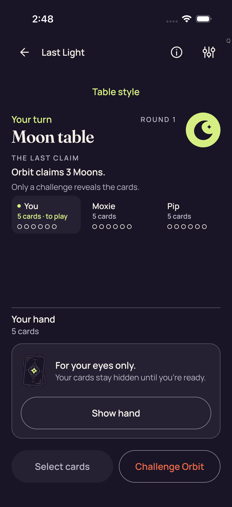</a>

**Direct view** by `/root/pixel_o1_land3`; 1206 × 2622 original pixels. [Attributed pixel receipt](../provenance/pixel-review-3d/capture-review-index.json).

Original filename: `658A6A4D-7E3A-467C-B111-DE4E81627320.png`. Original size: 240,632 bytes. SHA-256: `96fc9b9d652803cdd095319f84b70b068f92261f25b735599b45103bdeaa61e8`.

Original export timestamp: `1789094890.526` (`2026-09-11T02:48:10.526Z`); source capture-pointer index 27. Case outcome: **passed**. The original attachment failure flag is `false`.

Original test label: `3d Standard concealed_0_B9CAD8A1-FFBD-47E2-A410-8854E8343EF9.png`.

Portrait Standard Moon table shows Your turn, ROUND 1, Orbit claims 3 Moons, and visible seat counts/fuse circles. The complete Your hand / 5 cards concealed panel shows card-back art, For your eyes only, and Show hand. Select cards and Challenge Orbit fit at the bottom.

Main labels and controls fit inside the 1206×2622 image. There is a large empty vertical gap between the seat row and hand panel. A small gray Q glyph appears near the upper-right edge; its semantics are not determined by the pixels.

Review limits: This still shows concealment at this captured checkpoint; it does not prove continuous concealment or accessibility-tree contents.

Attachment names remain source metadata; observations and limits are recorded separately.

## 02 · Standard table, revealed unselected hand

<a href="../originals/7A86EB1A-39C2-4D60-855F-E89AFE5B8C6A.png">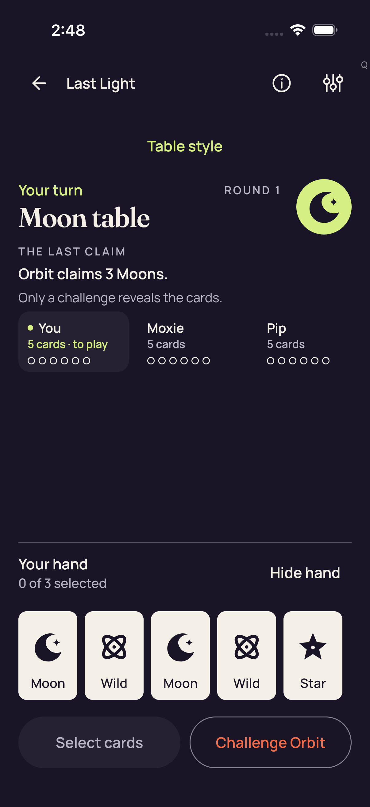</a>

**Direct view** by `/root/pixel_o1_land3`; 1206 × 2622 original pixels. [Attributed pixel receipt](../provenance/pixel-review-3d/capture-review-index.json).

Original filename: `7A86EB1A-39C2-4D60-855F-E89AFE5B8C6A.png`. Original size: 211,683 bytes. SHA-256: `9734fcbe6e3796ae8827f9edcd5da9177881a12cc95c3029faeea86ad6bb1e43`.

Original export timestamp: `1789094908.838` (`2026-09-11T02:48:28.838Z`); source capture-pointer index 26. Case outcome: **passed**. The original attachment failure flag is `false`.

Original test label: `3d Standard all five native card descriptions_0_EBD46BCD-4674-4CBC-8E5C-6F4D1E12815F.png`.

The Standard Moon table remains visible. Five revealed hand cards fit in one row with readable Moon, Wild, Moon, Wild and Star labels. Your hand reports 0 of 3 selected and Hide hand is visible. Select cards and Challenge Orbit remain within the bottom viewport.

All five card faces and text labels fit without visible overlap. Large spacing separates the seat row from the hand. The small gray Q remains near the upper-right edge.

Review limits: The attachment title refers to native descriptions; pixels establish readable card labels, not accessible descriptions or semantics. Revealed cards coincide with a shown-hand UI state.

Attachment names remain source metadata; observations and limits are recorded separately.

## 03 · Standard table, three selected cards

<a href="../originals/ED43667C-16C9-49C2-B1E0-D44332FAD99A.png">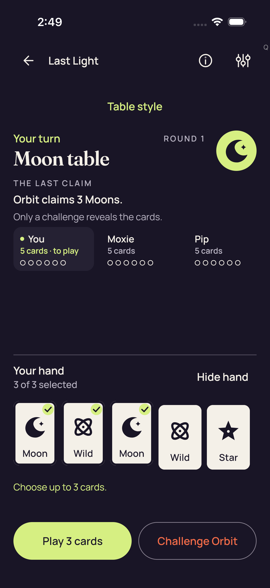</a>

**Direct view** by `/root/pixel_o1_land3`; 1206 × 2622 original pixels. [Attributed pixel receipt](../provenance/pixel-review-3d/capture-review-index.json).

Original filename: `ED43667C-16C9-49C2-B1E0-D44332FAD99A.png`. Original size: 231,212 bytes. SHA-256: `62a6552be1b4745a51529fb1a48e9a20858f6089a7244d464dd4f0d45c40c5ae`.

Original export timestamp: `1789094984.565` (`2026-09-11T02:49:44.565Z`); source capture-pointer index 25. Case outcome: **passed**. The original attachment failure flag is `false`.

Original test label: `3d Standard maximum selection and count-only feedback_0_69590881-162A-4426-8D87-EE06331E0F96.png`.

The first three of the five visible hand cards have citron check badges. Your hand reports 3 of 3 selected; Hide hand and Choose up to 3 cards are readable. Play 3 cards and Challenge Orbit both fit. The hand remains visibly revealed.

Five card labels, three check badges, count feedback and both bottom buttons are contained in the viewport with no visible overlap.

Review limits: The visible count and feedback do not independently prove rejection of a fourth selection or execution of an authority action.

Attachment names remain source metadata; observations and limits are recorded separately.

## 04 · Standard table, hand concealed

**Direct view** by `/root/pixel_o1_land3`; 1206 × 2622 original pixels. [Attributed pixel receipt](../provenance/pixel-review-3d/capture-review-index.json).

Original filename: `42BC3828-0238-4BC6-A599-4A28C59E0E12.png`. Original size: 240,795 bytes. SHA-256: `687b0712d8f72579d0aeb70e9c55811701ad3e38650e2dc1757d6e947e7457f8`.

Original export timestamp: `1789095019.575` (`2026-09-11T02:50:19.575Z`); source capture-pointer index 24. Case outcome: **passed**. The original attachment failure flag is `false`.

Original test label: `3d Standard Hide removes private nodes and selection_0_3C5B9047-1B47-4428-9276-520EF4000EA8.png`.

Portrait Standard Moon table shows Your turn, ROUND 1, Orbit claims 3 Moons, and visible seat counts/fuse circles. The complete Your hand / 5 cards concealed panel shows card-back art, For your eyes only, and Show hand. Select cards and Challenge Orbit fit at the bottom.

Main labels and controls fit inside the 1206×2622 image. There is a large empty vertical gap between the seat row and hand panel. A small gray Q glyph appears near the upper-right edge; its semantics are not determined by the pixels.

Review limits: The pixels show a concealed panel after the named Hide checkpoint. Removal of private accessibility nodes and clearing internal selection are not independently visible in this still.

Attachment names remain source metadata; observations and limits are recorded separately.

## 05 · Standard table, revealed unselected hand

**Direct view** by `/root/pixel_o1_land3`; 1206 × 2622 original pixels. [Attributed pixel receipt](../provenance/pixel-review-3d/capture-review-index.json).

Original filename: `591CF996-1D4E-403F-9669-B7D3785B9AFA.png`. Original size: 211,867 bytes. SHA-256: `119df3e88fbe25997a0437ec32cc544a3b725843f5a09b9c87d3839933e65769`.

Original export timestamp: `1789095046.033` (`2026-09-11T02:50:46.033Z`); source capture-pointer index 23. Case outcome: **passed**. The original attachment failure flag is `false`.

Original test label: `3d Standard fresh Reveal is unselected_0_1FAEE5F7-DC3F-4A45-BE2A-255002CD4DA5.png`.

The Standard Moon table remains visible. Five revealed hand cards fit in one row with readable Moon, Wild, Moon, Wild and Star labels. Your hand reports 0 of 3 selected and Hide hand is visible. Select cards and Challenge Orbit remain within the bottom viewport.

All five card faces and text labels fit without visible overlap. Large spacing separates the seat row from the hand. The small gray Q remains near the upper-right edge.

Review limits: The pixels show five revealed card labels and 0 of 3 selected at the named fresh-Reveal checkpoint. No transient-state, input-timing or accessibility-tree claim follows.

Attachment names remain source metadata; observations and limits are recorded separately.

## 06 · Native 3D entry, hand concealed

<a href="../originals/455A6EAE-E634-4B9E-B0E3-2270BC1A38DB.png">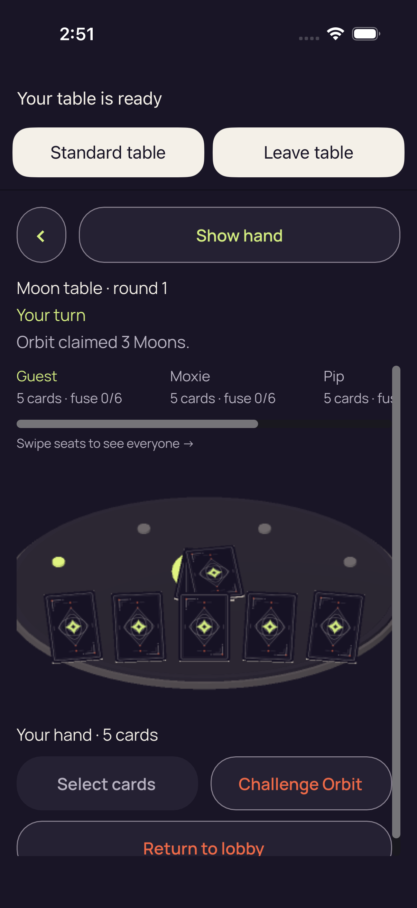</a>

**Direct view** by `/root/pixel_o1_land3`; 1206 × 2622 original pixels. [Attributed pixel receipt](../provenance/pixel-review-3d/capture-review-index.json).

Original filename: `455A6EAE-E634-4B9E-B0E3-2270BC1A38DB.png`. Original size: 392,548 bytes. SHA-256: `a789b8b7cc01c19cd9d6c4b28b8377472654f9656a511638bfe581fa79dc3586`.

Original export timestamp: `1789095116.289` (`2026-09-11T02:51:56.289Z`); source capture-pointer index 22. Case outcome: **passed**. The original attachment failure flag is `false`.

Original test label: `3d production concealed entry_0_290683BD-C4EB-4BBC-9105-290A44CC73F6.png`.

Your table is ready appears above Standard table and Leave table. Show hand remains visible in the native toolbar. Moon table · round 1, Your turn, Orbit's three-Moon claim, seat counts and an oval 3D table with dark card backs are visible. Your hand · 5 cards, Select cards and Challenge Orbit fit below the table. Return to lobby extends below the body viewport and its lower portion is clipped.

A vertical body scrollbar and horizontal seat scrollbar are visible. Pip's seat text is clipped at the right viewport edge. The tall native composition leaves the bottom Return to lobby control only partly visible in this still.

Review limits: Visible clipping records the current scroll position; it does not alone establish that Return to lobby is unreachable. No private card ranks are visible, but the still does not establish continuous concealment during entry.

Attachment names remain source metadata; observations and limits are recorded separately.

## 07 · Native 3D, revealed hand with one selection

<a href="../originals/A472CA92-3A82-4E9C-811F-63DD25DD8A46.png">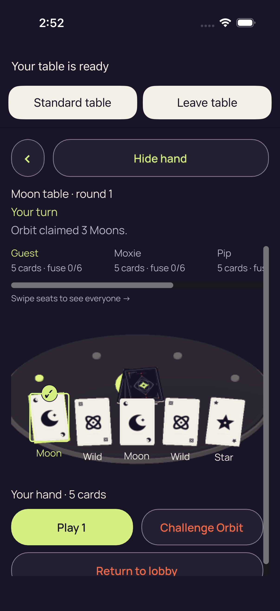</a>

**Direct view** by `/root/pixel_o1_land3`; 1206 × 2622 original pixels. [Attributed pixel receipt](../provenance/pixel-review-3d/capture-review-index.json).

Original filename: `A472CA92-3A82-4E9C-811F-63DD25DD8A46.png`. Original size: 359,250 bytes. SHA-256: `39e59383bc1c9683a5538c56a0a2b8a2276a41cf52faa50c734ad00adc643d7d`.

Original export timestamp: `1789095149.941` (`2026-09-11T02:52:29.941Z`); source capture-pointer index 21. Case outcome: **passed**. The original attachment failure flag is `false`.

Original test label: `3d real native card selection_0_50A31F8A-6DDE-4F01-A95D-82E13527DCBD.png`.

Hide hand is visible above the Moon table. Five face-up cards and their Moon, Wild, Moon, Wild and Star labels appear on the 3D table. The first Moon has a citron outline and check badge. Play 1 and Challenge Orbit fit below Your hand · 5 cards. Return to lobby remains clipped at the lower body edge.

Card labels and selection badge are readable; native table/card art appears softer than the surrounding UI text. The rightmost seat details and lower Return to lobby control extend outside their visible scroll viewports.

Review limits: The visible selected state does not independently establish how the selection was entered. These revealed faces are present while Hide hand is shown.

Attachment names remain source metadata; observations and limits are recorded separately.

## 08 · Native 3D after named Hide, hand concealed

<a href="../originals/416093FC-4B1F-4F58-92D4-227640B1FBEA.png">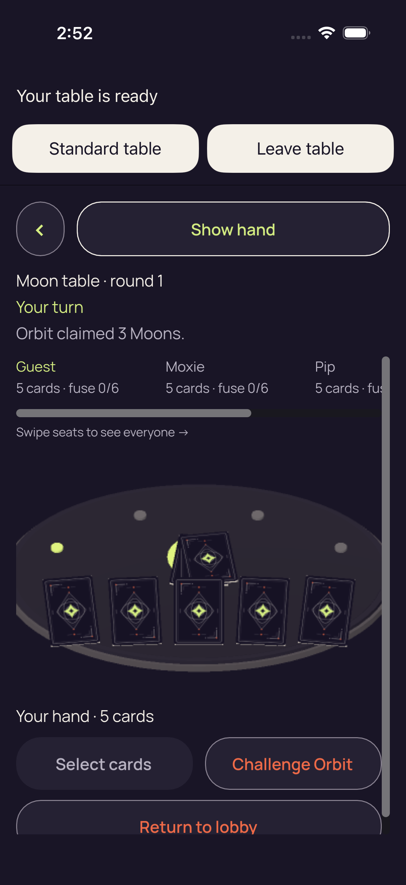</a>

**Direct view** by `/root/pixel_o1_land3`; 1206 × 2622 original pixels. [Attributed pixel receipt](../provenance/pixel-review-3d/capture-review-index.json).

Original filename: `416093FC-4B1F-4F58-92D4-227640B1FBEA.png`. Original size: 395,219 bytes. SHA-256: `aab75f0237e28c66c4052dc3a6b3746441c94d9e291d99303cfafb0399ecc803`.

Original export timestamp: `1789095152.704` (`2026-09-11T02:52:32.704Z`); source capture-pointer index 20. Case outcome: **passed**. The original attachment failure flag is `false`.

Original test label: `3d Hide removes private faces labels and selection_0_635C7F07-0903-4B88-BCEB-5470A84C3A06.png`.

Show hand replaces Hide hand. All five visible front cards show backs; their rank labels and the prior selection badge are absent. Select cards replaces Play 1. Challenge Orbit remains visible. The bottom Return to lobby control is still partly clipped.

Horizontal seat and vertical body scrollbars remain visible. No private card face or rank label is visible in the native table at this checkpoint.

Review limits: This still establishes absence of the previously visible faces/labels/badge in its pixels, not accessibility-node removal, input-release timing, or continuous cover behavior.

Attachment names remain source metadata; observations and limits are recorded separately.

## 09 · Native 3D public challenge outcome

<a href="../originals/59A5AFB5-D9A2-4342-BF48-809047F84CA7.png">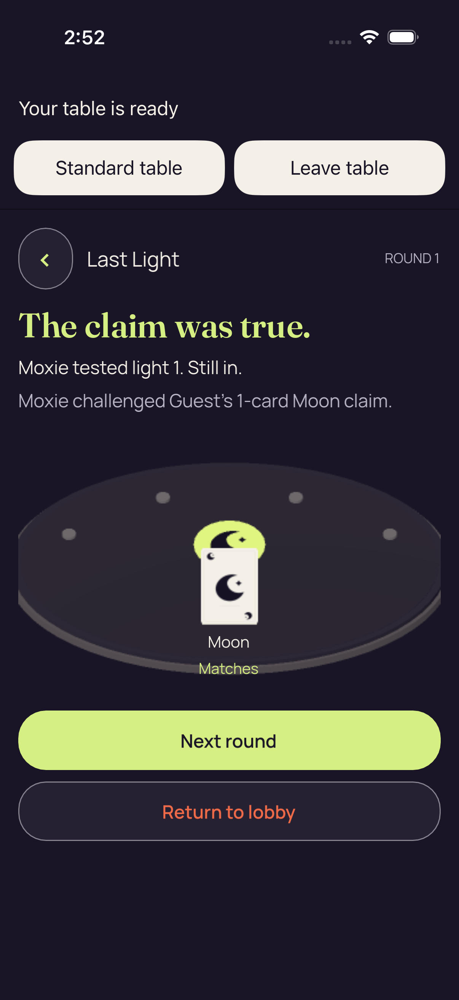</a>

**Direct view** by `/root/pixel_o1_land3`; 1206 × 2622 original pixels. [Attributed pixel receipt](../provenance/pixel-review-3d/capture-review-index.json).

Original filename: `59A5AFB5-D9A2-4342-BF48-809047F84CA7.png`. Original size: 249,333 bytes. SHA-256: `1a177c5fe00f72de99f5f031e56650ed237ec99cf731f0456fbc9c5f39e8e31e`.

Original export timestamp: `1789095179.652` (`2026-09-11T02:52:59.652Z`); source capture-pointer index 19. Case outcome: **passed**. The original attachment failure flag is `false`.

Original test label: `3d real authority accepted native Play_0_61BCDA49-A8B1-4314-AEF6-34DD05D98AF2.png`.

The native outcome reads The claim was true., Moxie tested light 1. Still in., and Moxie challenged Guest's 1-card Moon claim. A single public Moon card is visible with Moon and Matches labels. Next round and Return to lobby fit below the table. No private hand is displayed.

Outcome text, public reveal, and both complete action buttons fit without visible clipping. The public card/table rendering remains softer than UI text.

Review limits: This is a public gameplay outcome, not a runtime failure overlay or a visible private-hand leak. The PNG title's accepted-Play claim is separate from what the still proves.

Attachment names remain source metadata; observations and limits are recorded separately.

## 10 · Standard public challenge outcome

<a href="../originals/C7EA193B-2195-4E9A-9485-90D34FF83B39.png">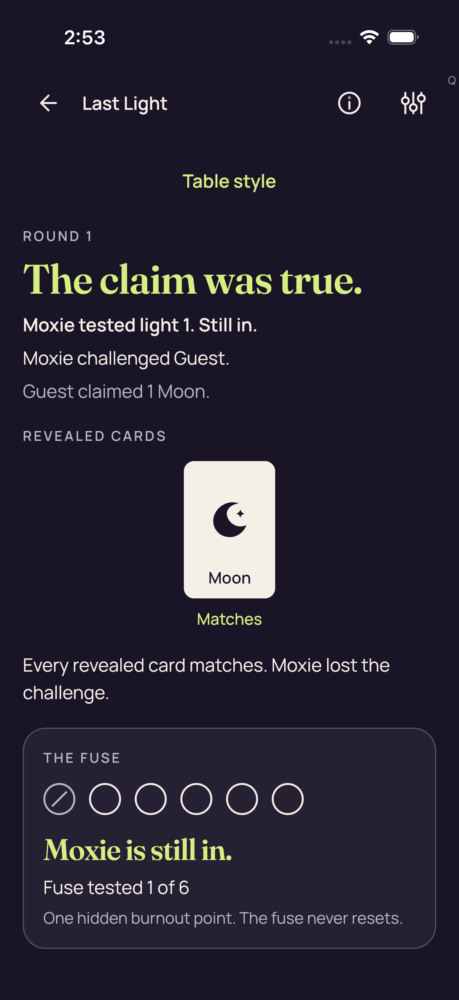</a>

**Direct view** by `/root/pixel_o1_land3`; 1206 × 2622 original pixels. [Attributed pixel receipt](../provenance/pixel-review-3d/capture-review-index.json).

Original filename: `C7EA193B-2195-4E9A-9485-90D34FF83B39.png`. Original size: 223,807 bytes. SHA-256: `54f47db3f04a020dbf0c40e567ca543c305be6a31bab45240d3870035283769b`.

Original export timestamp: `1789095183.402` (`2026-09-11T02:53:03.402Z`); source capture-pointer index 18. Case outcome: **passed**. The original attachment failure flag is `false`.

Original test label: `3d same session Standard return_0_00C34B45-B3AE-4C96-9DBF-ABCF2B743ED8.png`.

The Standard outcome reads The claim was true., Moxie tested light 1. Still in., Moxie challenged Guest., and Guest claimed 1 Moon. A public Moon card and Matches label appear under REVEALED CARDS. The fuse panel shows its first light marked and Moxie is still in. No private hand is displayed.

Outcome text and fuse panel are readable. The content fills the captured viewport; no Next round or Return to lobby control is visible in this still.

Review limits: The public reveal is expected gameplay information. The absence of lower controls in this view does not alone prove they cannot be reached by scrolling, and the still cannot establish an authority action.

Attachment names remain source metadata; observations and limits are recorded separately.

## 11 · Standard round 2, concealed hand

<a href="../originals/5CB6CE5C-A589-4086-9B9A-E3E85B227262.png">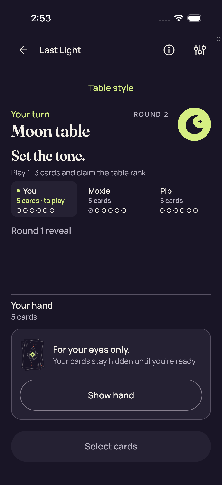</a>

**Direct view** by `/root/pixel_o1_land3`; 1206 × 2622 original pixels. [Attributed pixel receipt](../provenance/pixel-review-3d/capture-review-index.json).

Original filename: `5CB6CE5C-A589-4086-9B9A-E3E85B227262.png`. Original size: 228,179 bytes. SHA-256: `acdbbb3ab7e63b25f679fe5c6d880d6662d1b51aaa79a02e65677d7482a5f0ee`.

Original export timestamp: `1789095190.545` (`2026-09-11T02:53:10.545Z`); source capture-pointer index 17. Case outcome: **passed**. The original attachment failure flag is `false`.

Original test label: `3d real Standard authority accepted NEXT_ROUND_0_BFC4B730-9034-4351-9024-54F6D6435339.png`.

The Standard screen now shows ROUND 2, Moon table, Your turn and Set the tone. Moxie's first fuse circle is marked. Round 1 reveal is shown as a control label. The complete Your hand / 5 cards concealed panel, Show hand, and full-width Select cards button fit. No private card faces are visible.

All principal displayed text and the hand/action controls fit. A gray Q near the top-right corresponds to the SessionQualificationBadge defined in the exact frozen PartyDeckApp.swift source, not an inferred shipping UI feature.

Review limits: The visible round change supports this captured state only; the PNG title does not independently prove input acceptance or same-session identity.

Attachment names remain source metadata; observations and limits are recorded separately.

## 12 · Leave confirmation over concealed Standard round 2

**Direct view** by `/root/pixel_o1_land3`; 1206 × 2622 original pixels. [Attributed pixel receipt](../provenance/pixel-review-3d/capture-review-index.json).

Original filename: `FBBC1570-DCF8-4DF9-A872-5780DA2C8EB1.png`. Original size: 237,276 bytes. SHA-256: `b3c5b3cd9efea8d20b6cce2dcfeb8e61aa9b228f425e1dd82de2548e268feb20`.

Original export timestamp: `1789095225.931` (`2026-09-11T02:53:45.931Z`); source capture-pointer index 16. Case outcome: **passed**. The original attachment failure flag is `false`.

Original test label: `Actual production Leave confirmation_0_529A13B8-3A0F-45D2-95F8-EDD8BEE9791B.png`.

A centered Leave the table? dialog explains that this practice match will end and a fresh one can be started. Leave table and Stay at the table are fully readable. The dimmed Standard round-2 background shows the concealed For your eyes only panel and Show hand; no private card faces are visible.

Dialog heading, explanation and both choices fit within its bounds without visible overlap or truncation. The background remains dimmed.

Review limits: This still shows a dialog over a concealed hand. It does not establish modal focus semantics, which control was touched, or cover timing before/after the capture.

Attachment names remain source metadata; observations and limits are recorded separately.

## 13 · Standard round 2, concealed hand

**Reviewed byte match** by `/root/pixel_o1_land3`; 1206 × 2622 original pixels. [Attributed pixel receipt](../provenance/pixel-review-3d/capture-review-index.json).

Original filename: `8DFE984C-B5BE-4B19-A2A8-8D797D22F723.png`. Original size: 228,179 bytes. SHA-256: `acdbbb3ab7e63b25f679fe5c6d880d6662d1b51aaa79a02e65677d7482a5f0ee`.

Original export timestamp: `1789095227.933` (`2026-09-11T02:53:47.933Z`); source capture-pointer index 15. Case outcome: **passed**. The original attachment failure flag is `false`.

Original test label: `3d Leave cancelled on same concealed session_0_57F3FC3F-A759-4280-A4EE-A20D882DA21E.png`.

This distinct capture was matched to the [directly viewed original](../originals/5CB6CE5C-A589-4086-9B9A-E3E85B227262.png); its own filename, outcome and timestamp metadata remain separate.

The Standard screen now shows ROUND 2, Moon table, Your turn and Set the tone. Moxie's first fuse circle is marked. Round 1 reveal is shown as a control label. The complete Your hand / 5 cards concealed panel, Show hand, and full-width Select cards button fit. No private card faces are visible.

All principal displayed text and the hand/action controls fit. A gray Q near the top-right corresponds to the SessionQualificationBadge defined in the exact frozen PartyDeckApp.swift source, not an inferred shipping UI feature.

Review limits: The visible round change supports this captured state only; the PNG title does not independently prove input acceptance or same-session identity.

The original title refers to Leave cancellation on the same concealed session. Its exact-byte match establishes the same visible concealed round-2 screen as capture 10, not input acceptance or same-session identity.

## 14 · Leave confirmation over concealed Standard round 2

<a href="../originals/A7D13E6A-E2FA-4072-BA5A-664A1E5DF5EB.png">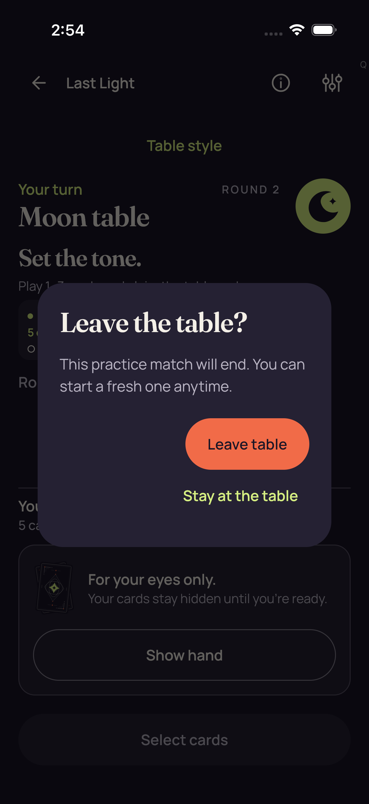</a>

**Direct view** by `/root/pixel_o1_land3`; 1206 × 2622 original pixels. [Attributed pixel receipt](../provenance/pixel-review-3d/capture-review-index.json).

Original filename: `A7D13E6A-E2FA-4072-BA5A-664A1E5DF5EB.png`. Original size: 236,747 bytes. SHA-256: `4641799402e174a60c80ddf1538f23a1d1e516189f0d05cb30016eb3c8548a3a`.

Original export timestamp: `1789095250.257` (`2026-09-11T02:54:10.257Z`); source capture-pointer index 14. Case outcome: **passed**. The original attachment failure flag is `false`.

Original test label: `Actual production Leave confirmation_0_7C8BEC3E-BE3D-49E4-8E0D-01930A3CFC25.png`.

A second distinct Leave the table? capture shows the same complete practice-ending explanation, Leave table, and Stay at the table choices over the dimmed concealed Standard round-2 screen. No private hand faces are visible.

Dialog heading, explanation and both choices fit within its bounds without visible overlap or truncation. The background remains dimmed.

Review limits: This still shows a dialog over a concealed hand. It does not establish modal focus semantics, which control was touched, or cover timing before/after the capture.

Attachment names remain source metadata; observations and limits are recorded separately.

## 15 · PartyDeck home

<a href="../originals/ED473BF9-950B-4909-8BD6-027FF5141F9A.png">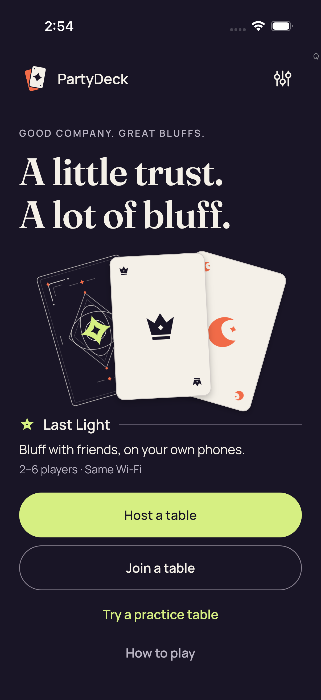</a>

**Direct view** by `/root/pixel_o1_land3`; 1206 × 2622 original pixels. [Attributed pixel receipt](../provenance/pixel-review-3d/capture-review-index.json).

Original filename: `ED473BF9-950B-4909-8BD6-027FF5141F9A.png`. Original size: 298,905 bytes. SHA-256: `4ddf23e6b48b1397f395353686ffbb764bc5c71a5c0e6fcc4ef5b60dfc9a8072`.

Original export timestamp: `1789095252.098` (`2026-09-11T02:54:12.098Z`); source capture-pointer index 13. Case outcome: **passed**. The original attachment failure flag is `false`.

Original test label: `3d confirmed Leave ended the session_0_B44EBC0D-2763-4C7F-95D7-D734A5121868.png`.

The home screen shows PartyDeck branding, A little trust. A lot of bluff., decorative card artwork, Last Light description, Host a table, Join a table, Try a practice table and How to play. No session hand or game outcome is displayed.

All main home labels and action choices fit in the captured portrait viewport with clear spacing. The visible gray Q is the qualification badge identified in frozen source.

Review limits: Decorative card artwork is not a private hand. Home pixels alone do not prove session destruction, engine dormancy, queue cleanup or input-resource disposal.

Attachment names remain source metadata; observations and limits are recorded separately.

## 16 · Later native 3D Star round 1, selected hand before scroll

<a href="../originals/C7972C10-88FE-4456-8D14-02129ED28669.png">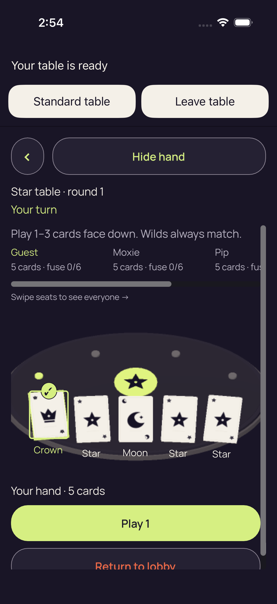</a>

**Direct view** by `/root/pixel_o1_land3`; 1206 × 2622 original pixels. [Attributed pixel receipt](../provenance/pixel-review-3d/capture-review-index.json).

Original filename: `C7972C10-88FE-4456-8D14-02129ED28669.png`. Original size: 329,382 bytes. SHA-256: `7754fa58edb300e0d927185e3ab7d1e8410b8e7e7bd5323ce484964f39c2094d`.

Original export timestamp: `1789095265.304` (`2026-09-11T02:54:25.304Z`); source capture-pointer index 12. Case outcome: **passed**. The original attachment failure flag is `false`.

Original test label: `3d real native card selection_0_D9FB45F8-11ED-4FA7-8BCE-713B462C0892.png`.

The native view shows Star table · round 1, Your turn, the play-one-to-three instruction, and Hide hand. Five faces labeled Crown, Star, Moon, Star, Star are visible; the first Crown is selected with a citron outline and check. Play 1 fits. No Challenge control is visible. Return to lobby is clipped at the lower body viewport edge.

The complete five-card hand remains readable while the lower lobby control is only partly visible. Seat details are horizontally clipped with an explicit swipe-seats hint and scrollbar.

Review limits: This is the visibly selected checkpoint preceding the named body-scroll attachment. Challenge availability and intent counters require the separate JSON evidence; no absence-of-action claim follows from this still alone.

Attachment names remain source metadata; observations and limits are recorded separately.

## 17 · Native 3D Star round 1, selected hand after body scroll

<a href="../originals/510C04E1-9095-4FDC-9E22-595708C0D6AF.png">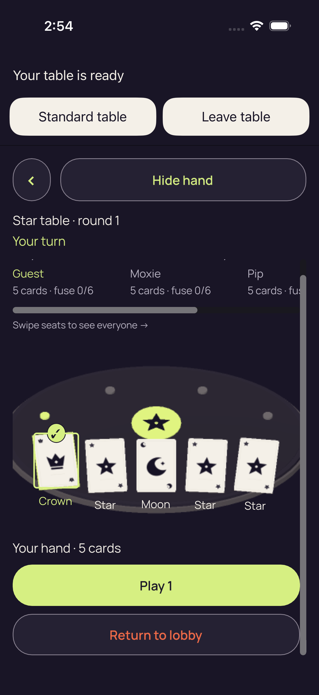</a>

**Direct view** by `/root/pixel_o1_land3`; 1206 × 2622 original pixels. [Attributed pixel receipt](../provenance/pixel-review-3d/capture-review-index.json).

Original filename: `510C04E1-9095-4FDC-9E22-595708C0D6AF.png`. Original size: 309,365 bytes. SHA-256: `895d4c5f28ee2eb29fbd86d2ab147904a139f8e63a69302d1ded27b119ba50cd`.

Original export timestamp: `1789095270.206` (`2026-09-11T02:54:30.206Z`); source capture-pointer index 11. Case outcome: **passed**. The original attachment failure flag is `false`.

Original test label: `3d round 1 full native action bounds preserve selection_0_72C1F92D-0C54-4C4A-971D-23F2769E1B68.png`.

Star table · round 1 and Your turn remain fully visible, together with Hide hand and the top Standard table / Leave table controls. The five revealed cards read Crown, Star, Moon, Star, Star; the first Crown retains its citron outline and check. Play 1 and Return to lobby are now both fully visible.

The body instruction Play 1–3 cards face down. Wilds always match. has scrolled almost entirely above the body viewport, with tiny glyph fragments at its upper edge. Right-side seat text remains horizontally clipped; the horizontal scrollbar and swipe-seats hint are visible.

Review limits: The still shows retained visible selection and complete action labels at this checkpoint. The separate body-scroll JSON records passive scrolling only; no tap, authority action, input timing or accessibility claim follows from this still.

Attachment names remain source metadata; observations and limits are recorded separately.

## 18 · Native 3D Star round 1, concealed hand after named Hide

<a href="../originals/849A5E6E-4FC9-4D62-8860-CB97CEDACC50.png">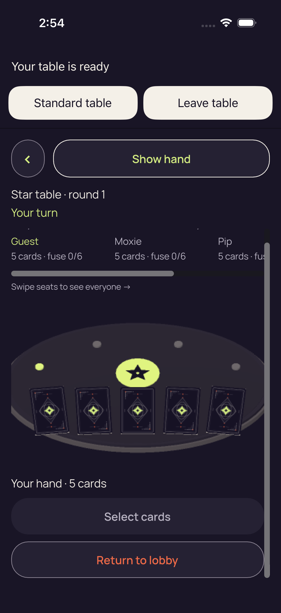</a>

**Direct view** by `/root/pixel_o1_land3`; 1206 × 2622 original pixels. [Attributed pixel receipt](../provenance/pixel-review-3d/capture-review-index.json).

Original filename: `849A5E6E-4FC9-4D62-8860-CB97CEDACC50.png`. Original size: 353,178 bytes. SHA-256: `a416af8f998505f2c9752e1cb0bcaca98fd360c6c730b200c8f41de59936ee47`.

Original export timestamp: `1789095272.524` (`2026-09-11T02:54:32.524Z`); source capture-pointer index 10. Case outcome: **passed**. The original attachment failure flag is `false`.

Original test label: `3d Hide removes private faces labels and selection_0_844D82B3-9C7E-483E-895B-330E74F6B484.png`.

In the same scrolled Star round-1 composition, Show hand is visible and all five cards show backs. Rank labels and the previously selected Crown's badge are absent. Select cards and Return to lobby are fully visible. Star table · round 1 and Your turn remain visible; no dialog appears.

The body instruction remains clipped at the upper scroll edge. The complete concealed hand and both lower controls fit at this checkpoint, while right-side seat details remain horizontally clipped.

Review limits: This establishes captured absence of private faces, labels and the prior selection badge, not accessibility-tree removal or continuous privacy. Capture 18 is a separately identified exact-byte match whose title refers to engine reuse and fresh input; identical pixels do not independently establish either.

Attachment names remain source metadata; observations and limits are recorded separately.

## 19 · Native 3D Star round 1, concealed hand after named Hide

**Reviewed byte match** by `/root/pixel_o1_land3`; 1206 × 2622 original pixels. [Attributed pixel receipt](../provenance/pixel-review-3d/capture-review-index.json).

Original filename: `63866437-5944-4416-BE0D-4494F4CF7163.png`. Original size: 353,178 bytes. SHA-256: `a416af8f998505f2c9752e1cb0bcaca98fd360c6c730b200c8f41de59936ee47`.

Original export timestamp: `1789095272.958` (`2026-09-11T02:54:32.958Z`); source capture-pointer index 9. Case outcome: **passed**. The original attachment failure flag is `false`.

Original test label: `3d new practice reuses engine and receives fresh input_0_3C3F66EE-C049-4773-9557-80E51F781869.png`.

This distinct capture was matched to the [directly viewed original](../originals/849A5E6E-4FC9-4D62-8860-CB97CEDACC50.png); its own filename, outcome and timestamp metadata remain separate.

In the same scrolled Star round-1 composition, Show hand is visible and all five cards show backs. Rank labels and the previously selected Crown's badge are absent. Select cards and Return to lobby are fully visible. Star table · round 1 and Your turn remain visible; no dialog appears.

The body instruction remains clipped at the upper scroll edge. The complete concealed hand and both lower controls fit at this checkpoint, while right-side seat details remain horizontally clipped.

Review limits: This establishes captured absence of private faces, labels and the prior selection badge, not accessibility-tree removal or continuous privacy. Capture 18 is a separately identified exact-byte match whose title refers to engine reuse and fresh input; identical pixels do not independently establish either.

The original title refers to engine reuse and fresh input. Its exact-byte match establishes the same visible concealed Star round-1 state as capture 17, not engine reuse, freshness or authority execution.

## 20 · Leave confirmation over concealed Standard Star round 1

<a href="../originals/45BAC248-650D-4110-B114-F73B6129E717.png">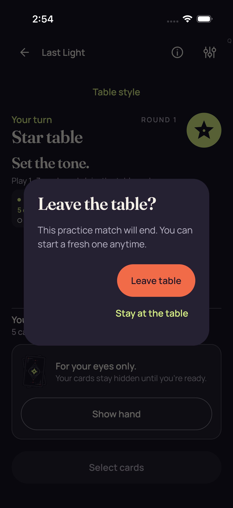</a>

**Direct view** by `/root/pixel_o1_land3`; 1206 × 2622 original pixels. [Attributed pixel receipt](../provenance/pixel-review-3d/capture-review-index.json).

Original filename: `45BAC248-650D-4110-B114-F73B6129E717.png`. Original size: 232,265 bytes. SHA-256: `738250274675287b13dff2c2b328637e6f236a05bbbe7614d291593b0def376e`.

Original export timestamp: `1789095275.977` (`2026-09-11T02:54:35.977Z`); source capture-pointer index 8. Case outcome: **passed**. The original attachment failure flag is `false`.

Original test label: `Actual production Leave confirmation_0_AA36135C-B8DF-4A55-BA19-AD02BF5585E6.png`.

A centered Leave the table? dialog overlays a dimmed Standard Star table at round 1. Its explanation says this practice match will end and a fresh one can be started. Leave table and Stay at the table are fully readable. The background contains the concealed For your eyes only / Show hand panel. No private card faces are visible.

The heading, explanation and both choices fit without visible overlap or truncation. The concealed background remains dimmed.

Review limits: This still shows the Leave dialog over a concealed hand; it does not establish modal semantics, control input, or concealment timing before or after capture.

Attachment names remain source metadata; observations and limits are recorded separately.

## 21 · PartyDeck home

**Reviewed byte match** by `/root/pixel_o1_land3`; 1206 × 2622 original pixels. [Attributed pixel receipt](../provenance/pixel-review-3d/capture-review-index.json).

Original filename: `0252A4EB-C288-4E96-9E2C-19754DE7BB93.png`. Original size: 298,905 bytes. SHA-256: `4ddf23e6b48b1397f395353686ffbb764bc5c71a5c0e6fcc4ef5b60dfc9a8072`.

Original export timestamp: `1789095278.51` (`2026-09-11T02:54:38.510Z`); source capture-pointer index 7. Case outcome: **passed**. The original attachment failure flag is `false`.

Original test label: `3d production smoke cleanup complete_0_79524FB2-F208-469F-AEAD-5F68C3BA413C.png`.

This distinct capture was matched to the [directly viewed original](../originals/ED473BF9-950B-4909-8BD6-027FF5141F9A.png); its own filename, outcome and timestamp metadata remain separate.

The home screen shows PartyDeck branding, A little trust. A lot of bluff., decorative card artwork, Last Light description, Host a table, Join a table, Try a practice table and How to play. No session hand or game outcome is displayed.

All main home labels and action choices fit in the captured portrait viewport with clear spacing. The visible gray Q is the qualification badge identified in frozen source.

Review limits: Decorative card artwork is not a private hand. Home pixels alone do not prove session destruction, engine dormancy, queue cleanup or input-resource disposal.

The original title refers to production smoke cleanup. Its exact-byte match establishes the same visible home screen as capture 14, not teardown, resource disposal or cleanup completion.
