# 2D production practice — CI 34559902607

[Collection](../README.md) · [Manifest](../manifest.json)

20 original PNGs, in original export timestamp order. Source labels and pixel findings are recorded separately.

## 30F6BE67-8F7C-4579-82C5-D8354FBB1DC1.png

Source label: 2d Standard concealed

Test: `PartyDeckGodotSessionUITests/testProduction2DPracticeSession()`. Export timestamp: `1789101006.969`. Original manifest case/attachment: 1/49.

<a href="../originals/30F6BE67-8F7C-4579-82C5-D8354FBB1DC1.png">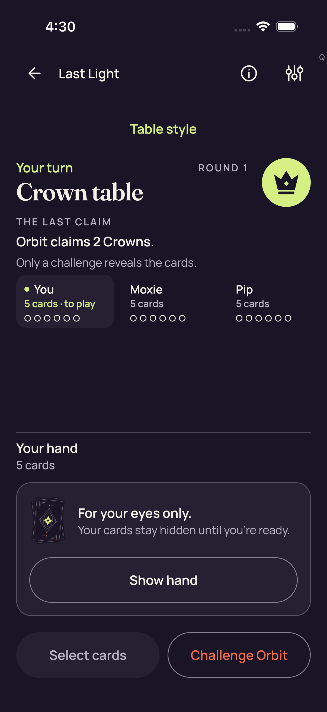</a>

**Pixel review: direct — /root/ios_review**

The captured Standard hand area shows the concealed hand panel and Show hand control; no private hand faces, rank labels or selected-card markers are visible.

[Exact review](../provenance/review/ios_review/original-screenshot-independent-review-v1.json) — JSON pointer `/productionCaptures/0`.

[Source-paired sanitized observation](../provenance/collector/ios-reports-and-simulator-app/build/ci/ios/godot-session/attachments/78220379-6CE2-4A08-AE9A-C27D422012D2.json) — sequence `34`; the PNG and retained document are not asserted to be atomic.

## 4F3265E9-3332-476A-94A5-52D730FE2CB4.png

Source label: 2d Standard all five native card descriptions

Test: `PartyDeckGodotSessionUITests/testProduction2DPracticeSession()`. Export timestamp: `1789101028.355`. Original manifest case/attachment: 1/47.

<a href="../originals/4F3265E9-3332-476A-94A5-52D730FE2CB4.png">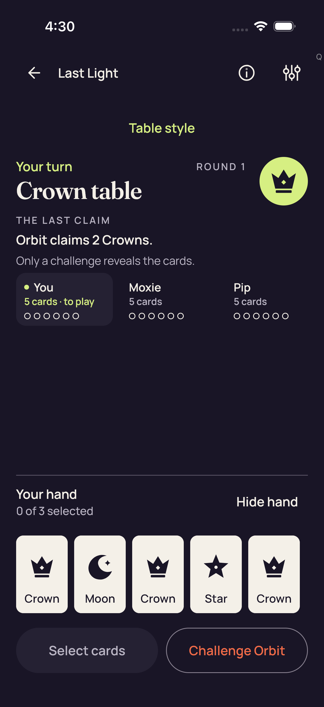</a>

**Pixel review: direct — /root/ios_review**

Five card faces and readable labels are simultaneously visible in the Standard hand. The selection text is 0 of 3 selected, with no selected-card checks visible.

[Exact review](../provenance/review/ios_review/original-screenshot-independent-review-v1.json) — JSON pointer `/productionCaptures/1`.

[Source-paired sanitized observation](../provenance/collector/ios-reports-and-simulator-app/build/ci/ios/godot-session/attachments/C79BB1FE-33C3-4A6C-80E9-645557D61D88.json) — sequence `133`; the PNG and retained document are not asserted to be atomic.

## 0FF55D21-15F2-48CE-BA7F-92A4D7443CFD.png

Source label: 2d Standard maximum selection and count-only feedback

Test: `PartyDeckGodotSessionUITests/testProduction2DPracticeSession()`. Export timestamp: `1789101091.415`. Original manifest case/attachment: 1/45.

<a href="../originals/0FF55D21-15F2-48CE-BA7F-92A4D7443CFD.png">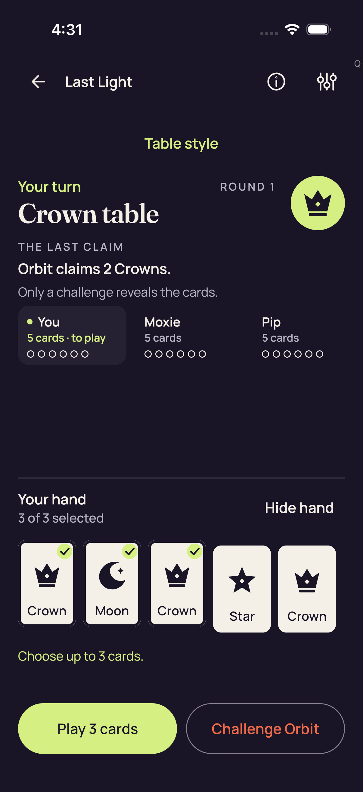</a>

**Pixel review: direct — /root/ios_review**

Exactly the first three of five visible Standard cards have selected markers. The screen reads 3 of 3 selected and Choose up to 3 cards.; the Play 3 cards control is visible.

[Exact review](../provenance/review/ios_review/original-screenshot-independent-review-v1.json) — JSON pointer `/productionCaptures/2`.

[Source-paired sanitized observation](../provenance/collector/ios-reports-and-simulator-app/build/ci/ios/godot-session/attachments/7E4A2DA4-34C8-4B39-857B-88CCE9CCEBA2.json) — sequence `433`; the PNG and retained document are not asserted to be atomic.

## BA0FFB78-590E-44AC-BEF4-430B1604479F.png

Source label: 2d Standard Hide removes private nodes and selection

Test: `PartyDeckGodotSessionUITests/testProduction2DPracticeSession()`. Export timestamp: `1789101117.009`. Original manifest case/attachment: 1/43.

**Pixel review: direct — /root/ios_review**

The captured Standard hand area shows the concealed hand panel and Show hand control; no private hand faces, rank labels or selected-card markers are visible.

[Exact review](../provenance/review/ios_review/original-screenshot-independent-review-v1.json) — JSON pointer `/productionCaptures/3`.

[Source-paired sanitized observation](../provenance/collector/ios-reports-and-simulator-app/build/ci/ios/godot-session/attachments/59A5261D-2685-45F1-B780-0700B8A88A85.json) — sequence `560`; the PNG and retained document are not asserted to be atomic.

## BF6A4215-6134-4742-AD8E-7CDF2EA041AA.png

Source label: 2d Standard fresh Reveal is unselected

Test: `PartyDeckGodotSessionUITests/testProduction2DPracticeSession()`. Export timestamp: `1789101157.556`. Original manifest case/attachment: 1/41.

<a href="../originals/BF6A4215-6134-4742-AD8E-7CDF2EA041AA.png">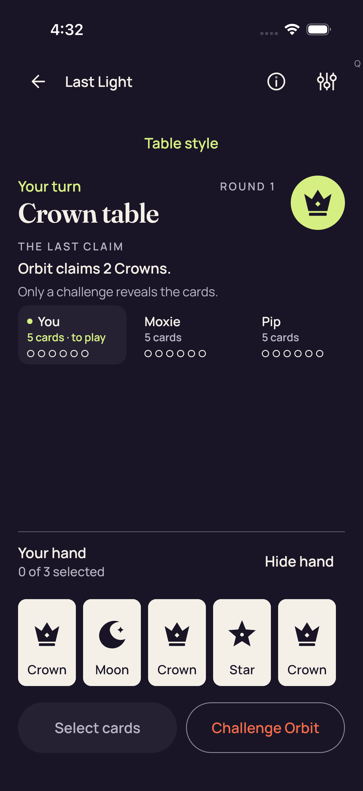</a>

**Pixel review: direct — /root/ios_review**

Five card faces and readable labels are simultaneously visible in the Standard hand. The selection text is 0 of 3 selected, with no selected-card checks visible.

[Exact review](../provenance/review/ios_review/original-screenshot-independent-review-v1.json) — JSON pointer `/productionCaptures/4`.

[Source-paired sanitized observation](../provenance/collector/ios-reports-and-simulator-app/build/ci/ios/godot-session/attachments/32C06E13-7A64-46C6-9872-ECC3F84902E9.json) — sequence `693`; the PNG and retained document are not asserted to be atomic.

## B34C60A8-EA61-4820-B60D-BDE87C8323FE.png

Source label: 2d production concealed entry

Test: `PartyDeckGodotSessionUITests/testProduction2DPracticeSession()`. Export timestamp: `1789101174.919`. Original manifest case/attachment: 1/39.

**Pixel review: direct — /root/ios_review**

The 2D native hand is covered, with 5 cards, covered and Reveal visible. No private hand faces, rank labels or selected-card markers are visible.

[Exact review](../provenance/review/ios_review/original-screenshot-independent-review-v1.json) — JSON pointer `/productionCaptures/5`.

Additional scoped review — /root/pixel_o1_2d (direct): Native 2D entry: round 01/Crown and Orbit's two-Crown claim; the full covered-hand panel, Reveal and fixed actions are visible.

[Scoped record](../provenance/review/pixel_o1_2d/ios-34559902607-pixel-review-v1/review.json) — JSON pointer `/source_captures/0`.

Visible concealment only at this captured stage; no offscreen, continuous privacy or scrolling acceptance.

[Source-paired sanitized observation](../provenance/collector/ios-reports-and-simulator-app/build/ci/ios/godot-session/attachments/97880D77-5655-41C9-AB05-EFFDB26BC821.json) — sequence `743`; the PNG and retained document are not asserted to be atomic.

## 872023E0-6770-4413-8B0B-7024E4075737.png

Source label: 2d real native card selection

Test: `PartyDeckGodotSessionUITests/testProduction2DPracticeSession()`. Export timestamp: `1789101184.532`. Original manifest case/attachment: 1/35.

<a href="../originals/872023E0-6770-4413-8B0B-7024E4075737.png">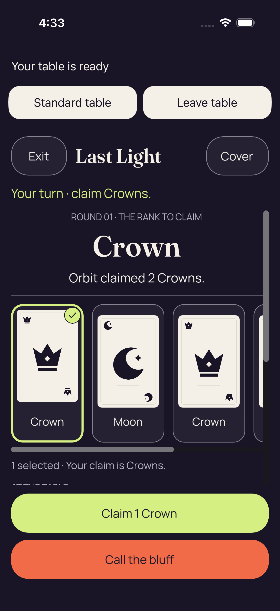</a>

**Pixel review: direct — /root/ios_review**

The 2D native hand strip shows a selected first card with check and border and readable visible card labels. Only part of the horizontal hand strip is simultaneously onscreen; this is not visual evidence that all five 2D native cards fit at once.

Native 2D selections show part of a horizontal hand strip. All five 2D native cards are not simultaneously visible in these captures.

[Exact review](../provenance/review/ios_review/original-screenshot-independent-review-v1.json) — JSON pointer `/productionCaptures/6`.

Additional scoped review — /root/pixel_o1_2d (direct): First native selection: Crown selected with a check badge; Claim 1 Crown and Call the bluff fit. Three full hand cards and part of the next are visible.

[Scoped record](../provenance/review/pixel_o1_2d/ios-34559902607-pixel-review-v1/review.json) — JSON pointer `/source_captures/1`.

This image establishes the visible first-card selection and full visible Claim control at this selection stage. It does not show all five card fronts or the exact later Play tap.

[Source-paired sanitized observation](../provenance/collector/ios-reports-and-simulator-app/build/ci/ios/godot-session/attachments/99EF5AB5-3A77-420A-9550-288D0ABA0E1D.json) — sequence `790`; the PNG and retained document are not asserted to be atomic.

## 85E50C54-A954-4B72-87BD-3A82DD53CBDD.png

Source label: 2d Hide removes private faces labels and selection

Test: `PartyDeckGodotSessionUITests/testProduction2DPracticeSession()`. Export timestamp: `1789101189.087`. Original manifest case/attachment: 1/32.

<a href="../originals/85E50C54-A954-4B72-87BD-3A82DD53CBDD.png">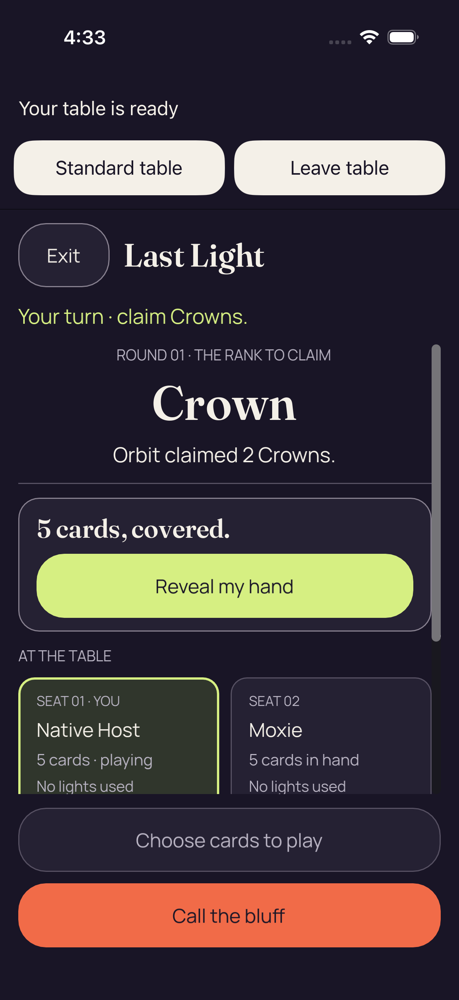</a>

**Pixel review: direct — /root/ios_review**

The 2D native hand is covered, with 5 cards, covered and Reveal visible. No private hand faces, rank labels or selected-card markers are visible.

[Exact review](../provenance/review/ios_review/original-screenshot-independent-review-v1.json) — JSON pointer `/productionCaptures/7`.

Additional scoped review — /root/pixel_o1_2d (direct): After first Hide: private card fronts and selection feedback are replaced by the full '5 cards, covered.' panel and Reveal control.

[Scoped record](../provenance/review/pixel_o1_2d/ios-34559902607-pixel-review-v1/review.json) — JSON pointer `/source_captures/2`.

The before/after visible states support concealment of the previously visible selected cards at these two captured stages. No between-capture timing or continuous privacy claim is made.

[Source-paired sanitized observation](../provenance/collector/ios-reports-and-simulator-app/build/ci/ios/godot-session/attachments/E9CA5304-7482-4DFC-9A8D-8E35C0CCEB1A.json) — sequence `812`; the PNG and retained document are not asserted to be atomic.

## 545A5EEB-3CA6-445A-8409-574FA9EFEF48.png

Source label: 2d real authority accepted native Play

Test: `PartyDeckGodotSessionUITests/testProduction2DPracticeSession()`. Export timestamp: `1789101205.489`. Original manifest case/attachment: 1/27.

<a href="../originals/545A5EEB-3CA6-445A-8409-574FA9EFEF48.png">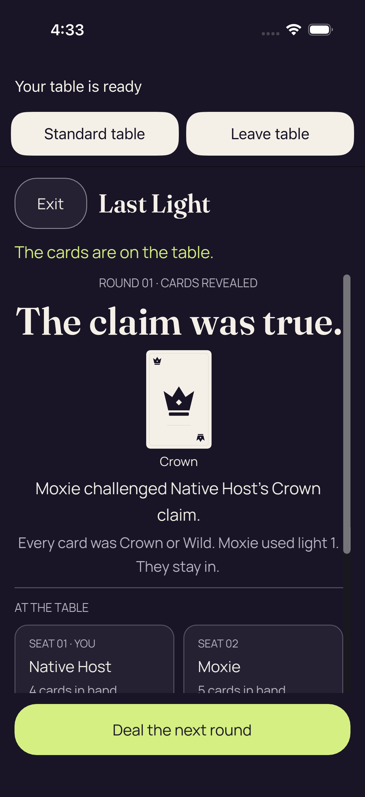</a>

**Pixel review: direct — /root/ios_review**

The native capture shows public round-result content after Play. Public result-card disclosure is visible; it is distinct from private concealed-hand content. Action acceptance comes from the separately reviewed receipt, not these pixels.

[Exact review](../provenance/review/ios_review/original-screenshot-independent-review-v1.json) — JSON pointer `/productionCaptures/8`.

Additional scoped review — /root/pixel_o1_2d (direct): Native post-Play public result: a true Crown claim, one public Crown proof, Moxie's light-1 outcome and a complete Deal the next round control.

[Scoped record](../provenance/review/pixel_o1_2d/ios-34559902607-pixel-review-v1/review.json) — JSON pointer `/source_captures/3`.

The paired authority receipt is needed to establish accepted Play. The screenshot shows its later public outcome, not the exact tap instant. A visible public proof face is not private-hand exposure; no visible private-hand panel can be evaluated at this result stage.

[Source-paired sanitized observation](../provenance/collector/ios-reports-and-simulator-app/build/ci/ios/godot-session/attachments/84D2B202-4AA2-427C-B0E2-C6BAB2E2FDB6.json) — sequence `892`; the PNG and retained document are not asserted to be atomic.

## FDDF061A-3803-44AB-AB9D-968D76BBF1FB.png

Source label: 2d same session Standard return

Test: `PartyDeckGodotSessionUITests/testProduction2DPracticeSession()`. Export timestamp: `1789101209.232`. Original manifest case/attachment: 1/25.

<a href="../originals/FDDF061A-3803-44AB-AB9D-968D76BBF1FB.png">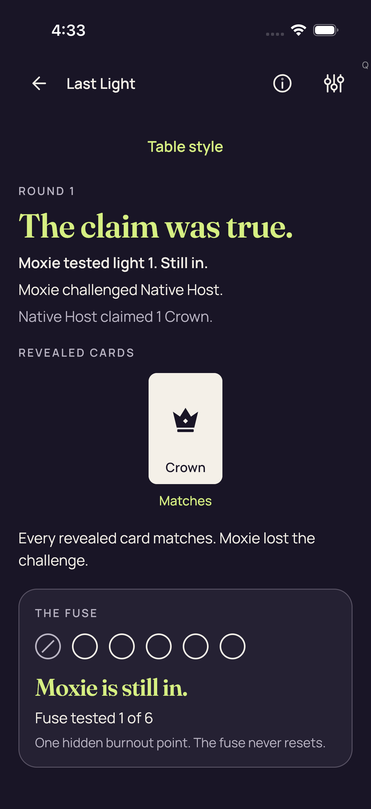</a>

**Pixel review: direct — /root/ios_review**

The Standard return shows the public round-result screen. No native stage or private hand disclosure is visible in this capture.

[Exact review](../provenance/review/ios_review/original-screenshot-independent-review-v1.json) — JSON pointer `/productionCaptures/9`.

Additional scoped review — /root/pixel_o1_2d (direct): Standard return to the public round result: Crown Matches proof and Moxie's outcome are visible; a private-hand panel is not shown.

[Scoped record](../provenance/review/pixel_o1_2d/ios-34559902607-pixel-review-v1/review.json) — JSON pointer `/source_captures/4`.

This establishes Standard result-page recovery. It does not visually establish a concealed Standard hand panel or availability/reachability of controls outside the visible area. Same-session identity and native dormancy come from the paired observation.

[Source-paired sanitized observation](../provenance/collector/ios-reports-and-simulator-app/build/ci/ios/godot-session/attachments/F4AEAE39-4AC5-4572-B36C-85D31E808AE7.json) — sequence `911`; the PNG and retained document are not asserted to be atomic.

## F9BC2B55-1C77-4851-AD6B-E4DA3A07601D.png

Source label: 2d real Standard authority accepted NEXT_ROUND

Test: `PartyDeckGodotSessionUITests/testProduction2DPracticeSession()`. Export timestamp: `1789101220.028`. Original manifest case/attachment: 1/23.

<a href="../originals/F9BC2B55-1C77-4851-AD6B-E4DA3A07601D.png">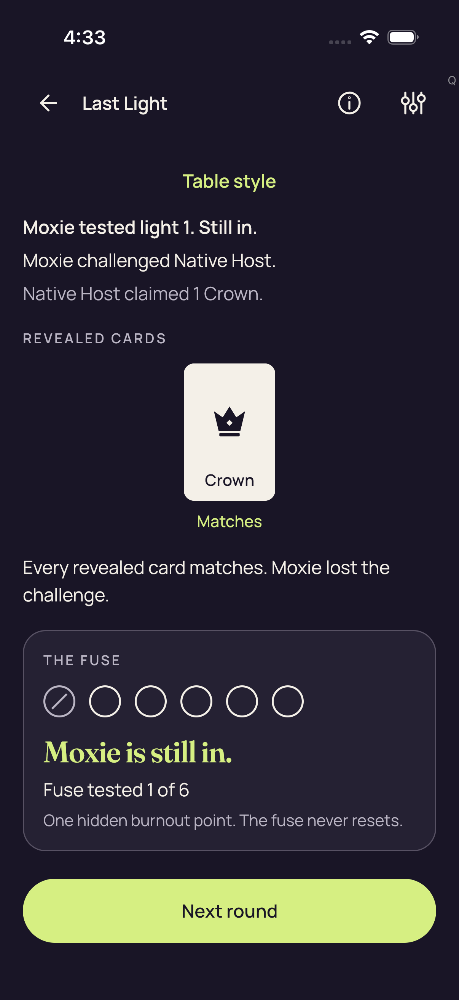</a>

**Pixel review: direct — /root/ios_review**

Despite its accepted NEXT_ROUND source label, this immediate 2D Standard capture still shows the preceding result panel and Next round control. Round 2 is not visually established by this image.

The immediate accepted NEXT_ROUND capture still displays the preceding result panel, not round 2.

[Exact review](../provenance/review/ios_review/original-screenshot-independent-review-v1.json) — JSON pointer `/productionCaptures/10`.

[Source-paired sanitized observation](../provenance/collector/ios-reports-and-simulator-app/build/ci/ios/godot-session/attachments/0D23EFC9-D58C-4212-AAAB-8FD0A2949681.json) — sequence `958`; the PNG and retained document are not asserted to be atomic.

## 8A23C534-7D00-41C2-93E2-9526DAE8B23A.png

Source label: Actual production Leave confirmation

Test: `PartyDeckGodotSessionUITests/testProduction2DPracticeSession()`. Export timestamp: `1789101233.019`. Original manifest case/attachment: 1/21.

**Pixel review: direct — /root/ios_review**

The Leave the table? modal and Leave and Stay controls are visible above the Standard underlay. No private hand disclosure or native stage is visible.

[Exact review](../provenance/review/ios_review/original-screenshot-independent-review-v1.json) — JSON pointer `/productionCaptures/11`.

[Source-paired sanitized observation](../provenance/collector/ios-reports-and-simulator-app/build/ci/ios/godot-session/attachments/15D27285-0ED5-4427-97BB-8E3FDBFF8624.json) — sequence `1017`; the PNG and retained document are not asserted to be atomic.

## 08D65E9E-794B-4E0B-8EFE-22DA74BB22EB.png

Source label: 2d Leave cancelled on same concealed session

Test: `PartyDeckGodotSessionUITests/testProduction2DPracticeSession()`. Export timestamp: `1789101237.493`. Original manifest case/attachment: 1/19.

<a href="../originals/08D65E9E-794B-4E0B-8EFE-22DA74BB22EB.png">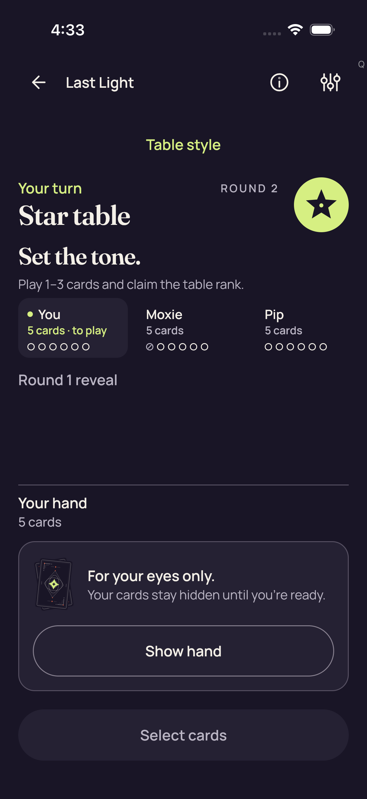</a>

**Pixel review: direct — /root/ios_review**

The Standard table visibly shows ROUND 2 and a concealed hand, with no Leave dialog or native stage visible.

The later 2D Leave-cancel capture visibly shows ROUND 2 with a concealed hand and no dialog.

[Exact review](../provenance/review/ios_review/original-screenshot-independent-review-v1.json) — JSON pointer `/productionCaptures/12`.

[Source-paired sanitized observation](../provenance/collector/ios-reports-and-simulator-app/build/ci/ios/godot-session/attachments/B2A3ACA4-FE44-4F09-A041-1476AA881E18.json) — sequence `1032`; the PNG and retained document are not asserted to be atomic.

## E1F8D7E2-5FBA-47BE-A7B3-C1B537580881.png

Source label: Actual production Leave confirmation

Test: `PartyDeckGodotSessionUITests/testProduction2DPracticeSession()`. Export timestamp: `1789101251.84`. Original manifest case/attachment: 1/17.

<a href="../originals/E1F8D7E2-5FBA-47BE-A7B3-C1B537580881.png">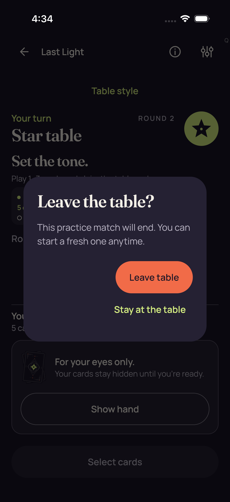</a>

**Pixel review: direct — /root/ios_review**

The Leave the table? modal and Leave and Stay controls are visible above the Standard underlay. No private hand disclosure or native stage is visible.

[Exact review](../provenance/review/ios_review/original-screenshot-independent-review-v1.json) — JSON pointer `/productionCaptures/13`.

[Source-paired sanitized observation](../provenance/collector/ios-reports-and-simulator-app/build/ci/ios/godot-session/attachments/F7882F0E-E038-4DA7-BD12-7813C6C2F0EA.json) — sequence `1103`; the PNG and retained document are not asserted to be atomic.

## 2593E026-0033-4E04-8C79-6CA11D2FF597.png

Source label: 2d confirmed Leave ended the session

Test: `PartyDeckGodotSessionUITests/testProduction2DPracticeSession()`. Export timestamp: `1789101254.477`. Original manifest case/attachment: 1/15.

**Pixel review: direct — /root/ios_review**

Home is visible with Host, Join and Practice choices. No native stage or private hand content is visible.

[Exact review](../provenance/review/ios_review/original-screenshot-independent-review-v1.json) — JSON pointer `/productionCaptures/14`.

Additional scoped review — /root/pixel_o1_2d (direct): Home after confirmed Leave: Host, Join, practice and How to play controls are visible. The large card art is promotional.

[Scoped record](../provenance/review/pixel_o1_2d/ios-34559902607-pixel-review-v1/review.json) — JSON pointer `/source_captures/5`.

This is a Home boundary capture. Session teardown, generation change and retained-engine dormancy require the paired observation; it is not native gameplay evidence.

[Source-paired sanitized observation](../provenance/collector/ios-reports-and-simulator-app/build/ci/ios/godot-session/attachments/3D20E7E7-A3E3-46A2-A653-938071AC3EAB.json) — sequence `1116`; the PNG and retained document are not asserted to be atomic.

## D4FBA53E-D71B-4806-85D2-E23139858D15.png

Source label: 2d real native card selection

Test: `PartyDeckGodotSessionUITests/testProduction2DPracticeSession()`. Export timestamp: `1789101285.671`. Original manifest case/attachment: 1/11.

<a href="../originals/D4FBA53E-D71B-4806-85D2-E23139858D15.png">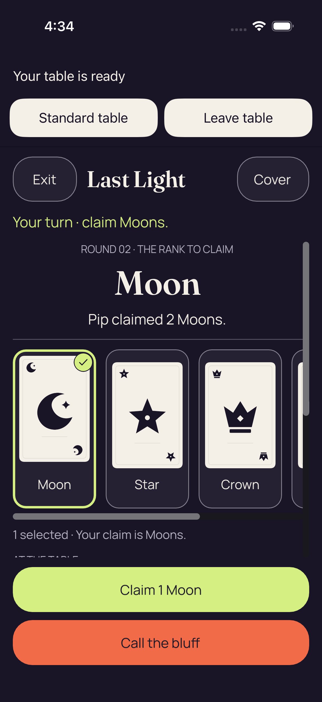</a>

**Pixel review: direct — /root/ios_review**

The 2D native hand strip shows a selected first card with check and border and readable visible card labels. Only part of the horizontal hand strip is simultaneously onscreen; this is not visual evidence that all five 2D native cards fit at once.

Native 2D selections show part of a horizontal hand strip. All five 2D native cards are not simultaneously visible in these captures.

[Exact review](../provenance/review/ios_review/original-screenshot-independent-review-v1.json) — JSON pointer `/productionCaptures/15`.

Additional scoped review — /root/pixel_o1_2d (direct): Fresh-practice native selection: round 02/Moon, Pip's two-Moon claim and a selected Moon; Claim 1 Moon and Call the bluff fit.

[Scoped record](../provenance/review/pixel_o1_2d/ios-34559902607-pixel-review-v1/review.json) — JSON pointer `/source_captures/6`.

The new session/presentation and retained engine identity are established by the paired observations, not appearance alone. No claim that all five card fronts or later-card input are visually covered.

[Source-paired sanitized observation](../provenance/collector/ios-reports-and-simulator-app/build/ci/ios/godot-session/attachments/1A1EF7FD-8A48-4FF7-8AFD-1267B07D9BE3.json) — sequence `1264`; the PNG and retained document are not asserted to be atomic.

## BCA52D0A-4F90-4349-BAD9-B77B60D738AE.png

Source label: 2d Hide removes private faces labels and selection

Test: `PartyDeckGodotSessionUITests/testProduction2DPracticeSession()`. Export timestamp: `1789101292.891`. Original manifest case/attachment: 1/8.

**Pixel review: direct — /root/ios_review**

The 2D native hand is covered, with 5 cards, covered and Reveal visible. No private hand faces, rank labels or selected-card markers are visible.

[Exact review](../provenance/review/ios_review/original-screenshot-independent-review-v1.json) — JSON pointer `/productionCaptures/16`.

Additional scoped review — /root/pixel_o1_2d (direct): After fresh-practice Hide: Moon public context and a full covered-hand panel remain, with no visible private fronts.

[Scoped record](../provenance/review/pixel_o1_2d/ios-34559902607-pixel-review-v1/review.json) — JSON pointer `/source_captures/7`.

This supports visible concealment after the later selected-hand image. The following new-practice milestone PNG has independently verified identical file bytes and the same latest observation sequence 1299; it provides a separate capture identity, not a second fresh-state observation or continuous privacy evidence.

[Source-paired sanitized observation](../provenance/collector/ios-reports-and-simulator-app/build/ci/ios/godot-session/attachments/343F9314-5145-40AF-BFA2-C888FB113124.json) — sequence `1299`; the PNG and retained document are not asserted to be atomic.

## DF6233B3-E4AE-462A-9979-F604368BA980.png

Source label: 2d new practice reuses engine and receives fresh input

Test: `PartyDeckGodotSessionUITests/testProduction2DPracticeSession()`. Export timestamp: `1789101293.954`. Original manifest case/attachment: 1/6.

<a href="../originals/DF6233B3-E4AE-462A-9979-F604368BA980.png">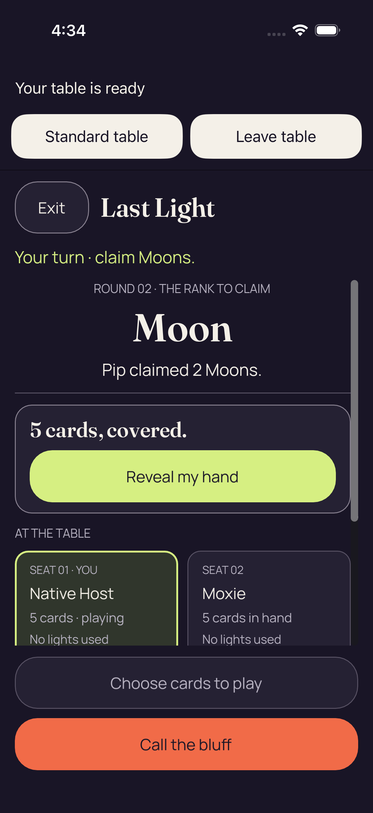</a>

**Pixel review: direct — /root/ios_review**

The 2D native hand is covered, with 5 cards, covered and Reveal visible. No private hand faces, rank labels or selected-card markers are visible.

[Exact review](../provenance/review/ios_review/original-screenshot-independent-review-v1.json) — JSON pointer `/productionCaptures/17`.

Additional scoped review — /root/pixel_o1_2d (reviewed_byte_match): New-practice milestone: exact-byte match of the second Hide capture, preserving its separate original attachment identity and timestamp.

[Scoped record](../provenance/review/pixel_o1_2d/ios-34559902607-pixel-review-v1/review.json) — JSON pointer `/source_captures/8`.

This supports visible concealment after the later selected-hand image. The following new-practice milestone PNG has independently verified identical file bytes and the same latest observation sequence 1299; it provides a separate capture identity, not a second fresh-state observation or continuous privacy evidence.

Its directly viewed representative is [BCA52D0A-4F90-4349-BAD9-B77B60D738AE.png](../originals/BCA52D0A-4F90-4349-BAD9-B77B60D738AE.png).

[Source-paired sanitized observation](../provenance/collector/ios-reports-and-simulator-app/build/ci/ios/godot-session/attachments/4ECA18E1-4D5C-45A4-8215-7D8A2ADD1CFF.json) — sequence `1299`; the PNG and retained document are not asserted to be atomic.

## 9960E985-75EF-41BF-ACBD-8A1E69A92332.png

Source label: Actual production Leave confirmation

Test: `PartyDeckGodotSessionUITests/testProduction2DPracticeSession()`. Export timestamp: `1789101299.514`. Original manifest case/attachment: 1/4.

<a href="../originals/9960E985-75EF-41BF-ACBD-8A1E69A92332.png">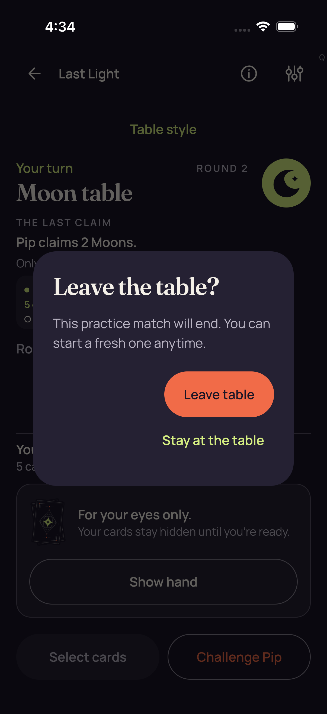</a>

**Pixel review: direct — /root/ios_review**

The Leave the table? modal and Leave and Stay controls are visible above the Standard underlay. No private hand disclosure or native stage is visible.

[Exact review](../provenance/review/ios_review/original-screenshot-independent-review-v1.json) — JSON pointer `/productionCaptures/18`.

[Source-paired sanitized observation](../provenance/collector/ios-reports-and-simulator-app/build/ci/ios/godot-session/attachments/99939228-5B8A-45C1-84B5-BFA51129EDEE.json) — sequence `1330`; the PNG and retained document are not asserted to be atomic.

## 42615FED-42C2-4100-ACF7-A5D4B20752C8.png

Source label: 2d production smoke cleanup complete

Test: `PartyDeckGodotSessionUITests/testProduction2DPracticeSession()`. Export timestamp: `1789101304.995`. Original manifest case/attachment: 1/2.

**Pixel review: direct — /root/ios_review**

Home is visible with Host, Join and Practice choices. No native stage or private hand content is visible.

[Exact review](../provenance/review/ios_review/original-screenshot-independent-review-v1.json) — JSON pointer `/productionCaptures/19`.

[Source-paired sanitized observation](../provenance/collector/ios-reports-and-simulator-app/build/ci/ios/godot-session/attachments/96E23A6D-13E2-4AF2-8B90-194FB41E54FB.json) — sequence `1346`; the PNG and retained document are not asserted to be atomic.

