# 3D production practice — CI 34559902607

[Collection](../README.md) · [Manifest](../manifest.json)

21 original PNGs, in original export timestamp order. Source labels and pixel findings are recorded separately.

## 20C41AFB-81AD-4F3B-A568-233DBF5C4330.png

Source label: 3d Standard concealed

Test: `PartyDeckGodotSessionUITests/testProduction3DPracticeSession()`. Export timestamp: `1789101327.425`. Original manifest case/attachment: 2/57.

**Pixel review: direct — /root/ios_review**

The captured Standard hand area shows the concealed hand panel and Show hand control; no private hand faces, rank labels or selected-card markers are visible.

[Exact review](../provenance/review/ios_review/original-screenshot-independent-review-v1.json) — JSON pointer `/productionCaptures/20`.

[Source-paired sanitized observation](../provenance/collector/ios-reports-and-simulator-app/build/ci/ios/godot-session/attachments/8A88BC21-D7D2-4E50-8912-F359111E1153.json) — sequence `35`; the PNG and retained document are not asserted to be atomic.

## B9F21E9C-8967-422A-87A8-B65F2644A63B.png

Source label: 3d Standard all five native card descriptions

Test: `PartyDeckGodotSessionUITests/testProduction3DPracticeSession()`. Export timestamp: `1789101351.487`. Original manifest case/attachment: 2/55.

**Pixel review: direct — /root/ios_review**

Five card faces and readable labels are simultaneously visible in the Standard hand. The selection text is 0 of 3 selected, with no selected-card checks visible.

[Exact review](../provenance/review/ios_review/original-screenshot-independent-review-v1.json) — JSON pointer `/productionCaptures/21`.

[Source-paired sanitized observation](../provenance/collector/ios-reports-and-simulator-app/build/ci/ios/godot-session/attachments/B6D974A7-A121-4610-B597-C326946FFC29.json) — sequence `137`; the PNG and retained document are not asserted to be atomic.

## 9C8D8812-4C4A-40C9-9EA6-99351E77F7CF.png

Source label: 3d Standard maximum selection and count-only feedback

Test: `PartyDeckGodotSessionUITests/testProduction3DPracticeSession()`. Export timestamp: `1789101452.624`. Original manifest case/attachment: 2/53.

<a href="../originals/9C8D8812-4C4A-40C9-9EA6-99351E77F7CF.png">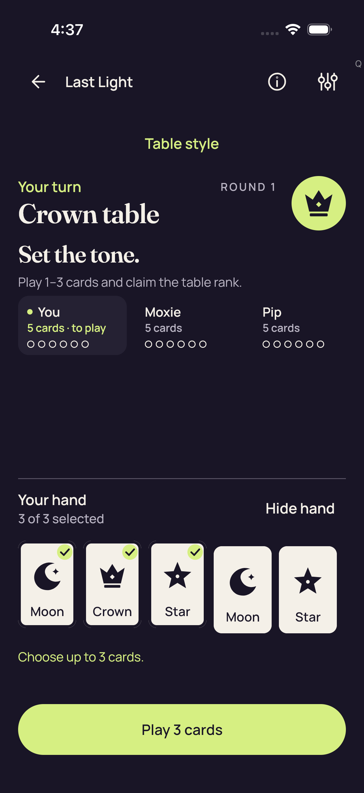</a>

**Pixel review: direct — /root/ios_review**

Exactly the first three of five visible Standard cards have selected markers. The screen reads 3 of 3 selected and Choose up to 3 cards.; the Play 3 cards control is visible.

[Exact review](../provenance/review/ios_review/original-screenshot-independent-review-v1.json) — JSON pointer `/productionCaptures/22`.

[Source-paired sanitized observation](../provenance/collector/ios-reports-and-simulator-app/build/ci/ios/godot-session/attachments/433DE4AE-B6D7-4ED7-976C-33991C943E3E.json) — sequence `512`; the PNG and retained document are not asserted to be atomic.

## 6902B013-E409-49DE-8B2A-A1E177999B50.png

Source label: 3d Standard Hide removes private nodes and selection

Test: `PartyDeckGodotSessionUITests/testProduction3DPracticeSession()`. Export timestamp: `1789101491.977`. Original manifest case/attachment: 2/51.

<a href="../originals/6902B013-E409-49DE-8B2A-A1E177999B50.png">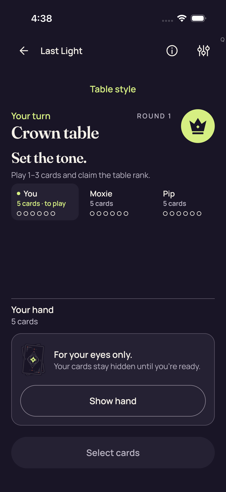</a>

**Pixel review: direct — /root/ios_review**

The captured Standard hand area shows the concealed hand panel and Show hand control; no private hand faces, rank labels or selected-card markers are visible.

[Exact review](../provenance/review/ios_review/original-screenshot-independent-review-v1.json) — JSON pointer `/productionCaptures/23`.

[Source-paired sanitized observation](../provenance/collector/ios-reports-and-simulator-app/build/ci/ios/godot-session/attachments/1527644F-EA40-4043-899F-81E05FF134E9.json) — sequence `679`; the PNG and retained document are not asserted to be atomic.

## 609DDEB3-25F9-4AD4-8985-E127453A1F94.png

Source label: 3d Standard fresh Reveal is unselected

Test: `PartyDeckGodotSessionUITests/testProduction3DPracticeSession()`. Export timestamp: `1789101519.77`. Original manifest case/attachment: 2/49.

<a href="../originals/609DDEB3-25F9-4AD4-8985-E127453A1F94.png">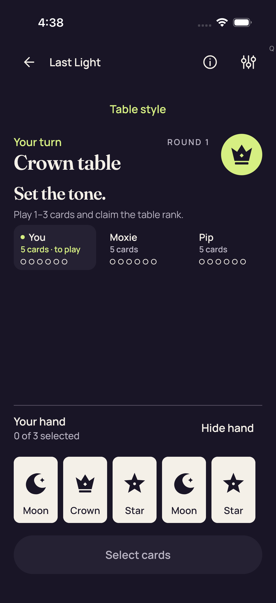</a>

**Pixel review: direct — /root/ios_review**

Five card faces and readable labels are simultaneously visible in the Standard hand. The selection text is 0 of 3 selected, with no selected-card checks visible.

[Exact review](../provenance/review/ios_review/original-screenshot-independent-review-v1.json) — JSON pointer `/productionCaptures/24`.

[Source-paired sanitized observation](../provenance/collector/ios-reports-and-simulator-app/build/ci/ios/godot-session/attachments/59ACF582-CE01-485E-88A2-8FD1A4FE9536.json) — sequence `799`; the PNG and retained document are not asserted to be atomic.

## 2BCEDF04-EE2E-42EE-B765-AC5DB90D88EA.png

Source label: 3d production concealed entry

Test: `PartyDeckGodotSessionUITests/testProduction3DPracticeSession()`. Export timestamp: `1789101598.273`. Original manifest case/attachment: 2/47.

**Pixel review: direct — /root/ios_review**

The 3D native hand shows five covered card backs, with no private hand face labels or selected-card marker visible. The initial unscrolled 3D viewport visibly clips the bottom Return to lobby action. These initial images do not establish full action-button bounds; the separate actual post-scroll image does.

Initial unscrolled 3D frames clip the bottom Return to lobby action. The actual post-scroll image shows all three full action buttons and retained selection.

[Exact review](../provenance/review/ios_review/original-screenshot-independent-review-v1.json) — JSON pointer `/productionCaptures/25`.

Additional scoped review — /root/pixel_o1_land3 (direct): Crown round 1 concealed entry: five backs and full turn/play instruction. Select cards fits; Return to lobby is partly clipped.

[Scoped record](../provenance/review/pixel_o1_land3/ios34559902607-3d-bounded-review-v1-_pri4hzn/capture-review-index.json) — JSON pointer `/captures/5`.

This is a visible concealed native gameplay checkpoint, not a continuous privacy or input-reachability claim. Missing claim/Challenge text in this still does not independently establish authority availability.

[Source-paired sanitized observation](../provenance/collector/ios-reports-and-simulator-app/build/ci/ios/godot-session/attachments/6B7971DF-9563-4180-BF60-BAAFCCFD6218.json) — sequence `853`; the PNG and retained document are not asserted to be atomic.

## BEFA0FD5-DCE1-4749-84EE-96E7B6EDD1AD.png

Source label: 3d real native card selection

Test: `PartyDeckGodotSessionUITests/testProduction3DPracticeSession()`. Export timestamp: `1789101631.11`. Original manifest case/attachment: 2/43.

<a href="../originals/BEFA0FD5-DCE1-4749-84EE-96E7B6EDD1AD.png">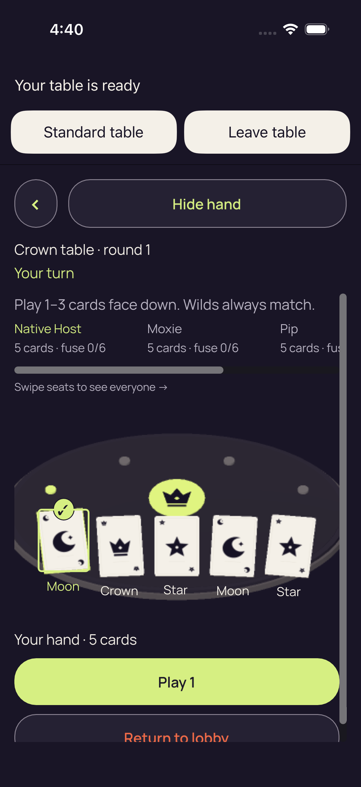</a>

**Pixel review: direct — /root/ios_review**

All five 3D native card faces and labels are visible, with the first-card selected marker present. The initial unscrolled 3D viewport visibly clips the bottom Return to lobby action. These initial images do not establish full action-button bounds; the separate actual post-scroll image does.

Initial unscrolled 3D frames clip the bottom Return to lobby action. The actual post-scroll image shows all three full action buttons and retained selection.

[Exact review](../provenance/review/ios_review/original-screenshot-independent-review-v1.json) — JSON pointer `/productionCaptures/26`.

Additional scoped review — /root/pixel_o1_land3 (direct): First selected hand: Moon, Crown, Star, Moon, Star. The first Moon is checked and Play 1 fits; the lobby control remains clipped.

[Scoped record](../provenance/review/pixel_o1_land3/ios34559902607-3d-bounded-review-v1-_pri4hzn/capture-review-index.json) — JSON pointer `/captures/6`.

One selected marker and revealed faces are visibly present while Hide hand is shown. The still does not prove how selection was entered or that Play executed; those require the separate current-run observations.

[Source-paired sanitized observation](../provenance/collector/ios-reports-and-simulator-app/build/ci/ios/godot-session/attachments/E94047A8-0169-49A1-ABCD-A6A409BF0896.json) — sequence `889`; the PNG and retained document are not asserted to be atomic.

## 910A258C-3158-4B80-B83A-7C0C0EFB02C9.png

Source label: 3d Hide removes private faces labels and selection

Test: `PartyDeckGodotSessionUITests/testProduction3DPracticeSession()`. Export timestamp: `1789101635.458`. Original manifest case/attachment: 2/40.

<a href="../originals/910A258C-3158-4B80-B83A-7C0C0EFB02C9.png">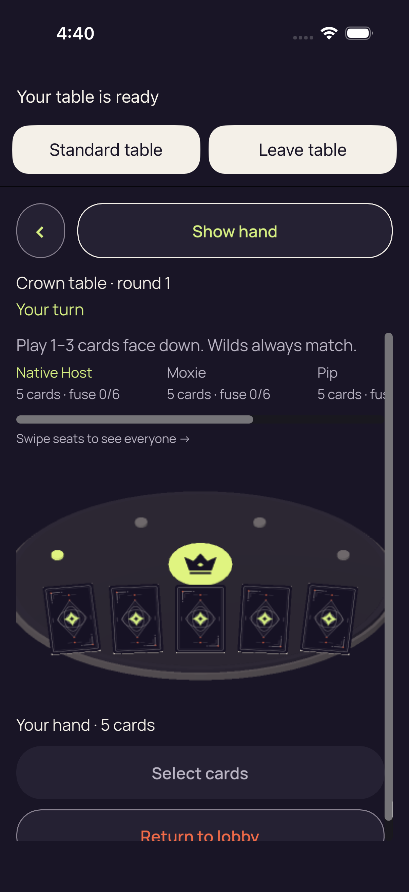</a>

**Pixel review: direct — /root/ios_review**

The 3D native hand shows five covered card backs, with no private hand face labels or selected-card marker visible.

[Exact review](../provenance/review/ios_review/original-screenshot-independent-review-v1.json) — JSON pointer `/productionCaptures/27`.

Additional scoped review — /root/pixel_o1_land3 (direct): After Hide: five backs, Show hand, and no private rank labels or selection badge. The lobby control remains clipped.

[Scoped record](../provenance/review/pixel_o1_land3/ios34559902607-3d-bounded-review-v1-_pri4hzn/capture-review-index.json) — JSON pointer `/captures/7`.

This supports captured absence of private faces, rank labels and the former selection badge. It does not prove accessibility removal, cover timing, focus semantics or continuous concealment.

[Source-paired sanitized observation](../provenance/collector/ios-reports-and-simulator-app/build/ci/ios/godot-session/attachments/3E824B5D-0457-46DA-8EBB-47C9AA8293D3.json) — sequence `905`; the PNG and retained document are not asserted to be atomic.

## 8741B976-69BE-4AF4-8751-1D668B1DCAD5.png

Source label: 3d real authority accepted native Play

Test: `PartyDeckGodotSessionUITests/testProduction3DPracticeSession()`. Export timestamp: `1789101682.897`. Original manifest case/attachment: 2/35.

<a href="../originals/8741B976-69BE-4AF4-8751-1D668B1DCAD5.png">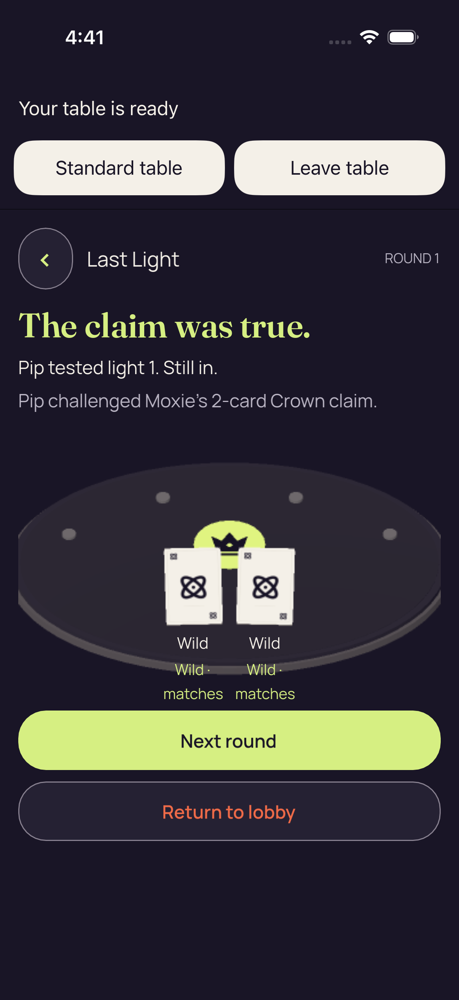</a>

**Pixel review: direct — /root/ios_review**

The native capture shows public round-result content after Play. Public result-card disclosure is visible; it is distinct from private concealed-hand content. Action acceptance comes from the separately reviewed receipt, not these pixels.

[Exact review](../provenance/review/ios_review/original-screenshot-independent-review-v1.json) — JSON pointer `/productionCaptures/28`.

Additional scoped review — /root/pixel_o1_land3 (direct): Native public round result: a true 2-card Crown claim and two Wilds. Next round and Return to lobby are fully visible.

[Scoped record](../provenance/review/pixel_o1_land3/ios34559902607-3d-bounded-review-v1-_pri4hzn/capture-review-index.json) — JSON pointer `/captures/8`.

This is a public gameplay outcome, not an exposed private hand or a visible runtime-error overlay. The still does not independently prove the preceding native Play; its source title and paired authority observations are separate evidence.

[Source-paired sanitized observation](../provenance/collector/ios-reports-and-simulator-app/build/ci/ios/godot-session/attachments/F38F3CEC-3C45-4AC8-9B7C-BBA4612257EC.json) — sequence `962`; the PNG and retained document are not asserted to be atomic.

## 3B2EF600-E81D-4789-AC94-8149D93DAC6D.png

Source label: 3d same session Standard return

Test: `PartyDeckGodotSessionUITests/testProduction3DPracticeSession()`. Export timestamp: `1789101695.958`. Original manifest case/attachment: 2/33.

<a href="../originals/3B2EF600-E81D-4789-AC94-8149D93DAC6D.png">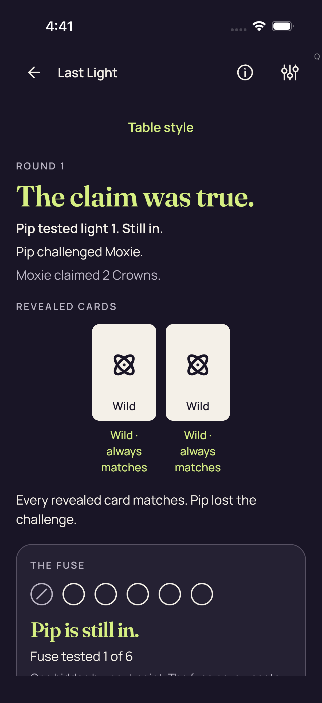</a>

**Pixel review: direct — /root/ios_review**

The Standard return shows the public round-result screen. No native stage or private hand disclosure is visible in this capture.

[Exact review](../provenance/review/ios_review/original-screenshot-independent-review-v1.json) — JSON pointer `/productionCaptures/29`.

Additional scoped review — /root/pixel_o1_land3 (direct): Standard public result: two Wilds and Pip’s lost challenge. Lower fuse explanation is clipped; continuation controls are outside this captured viewport.

[Scoped record](../provenance/review/pixel_o1_land3/ios34559902607-3d-bounded-review-v1-_pri4hzn/capture-review-index.json) — JSON pointer `/captures/9`.

This is a public reveal/result, not a private hand leak. The absence of continuation controls in this still does not prove they are unreachable by scrolling. Pixels do not establish same-session continuity, renderer dormancy or successful native close.

[Source-paired sanitized observation](../provenance/collector/ios-reports-and-simulator-app/build/ci/ios/godot-session/attachments/F0E8BCF9-07B2-4662-B78A-2CF779909D58.json) — sequence `1008`; the PNG and retained document are not asserted to be atomic.

## 6221652C-F7DD-45DD-A284-0FC83E6C1414.png

Source label: 3d real Standard authority accepted NEXT_ROUND

Test: `PartyDeckGodotSessionUITests/testProduction3DPracticeSession()`. Export timestamp: `1789101711.598`. Original manifest case/attachment: 2/31.

<a href="../originals/6221652C-F7DD-45DD-A284-0FC83E6C1414.png">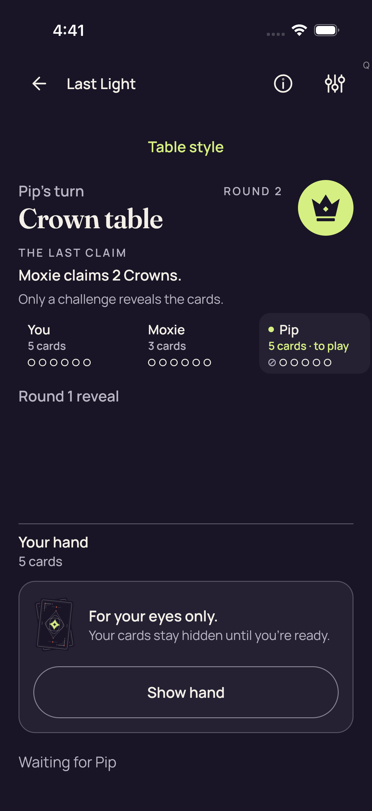</a>

**Pixel review: direct — /root/ios_review**

The Standard table visibly shows ROUND 2 and a concealed hand, with no Leave dialog or native stage visible.

[Exact review](../provenance/review/ios_review/original-screenshot-independent-review-v1.json) — JSON pointer `/productionCaptures/30`.

[Source-paired sanitized observation](../provenance/collector/ios-reports-and-simulator-app/build/ci/ios/godot-session/attachments/9A936E28-7240-40C6-B04F-F3D0C7C3BDBE.json) — sequence `1060`; the PNG and retained document are not asserted to be atomic.

## A1AE82BE-A106-4089-8ED9-3DC03C029FE3.png

Source label: Actual production Leave confirmation

Test: `PartyDeckGodotSessionUITests/testProduction3DPracticeSession()`. Export timestamp: `1789101751.65`. Original manifest case/attachment: 2/29.

<a href="../originals/A1AE82BE-A106-4089-8ED9-3DC03C029FE3.png">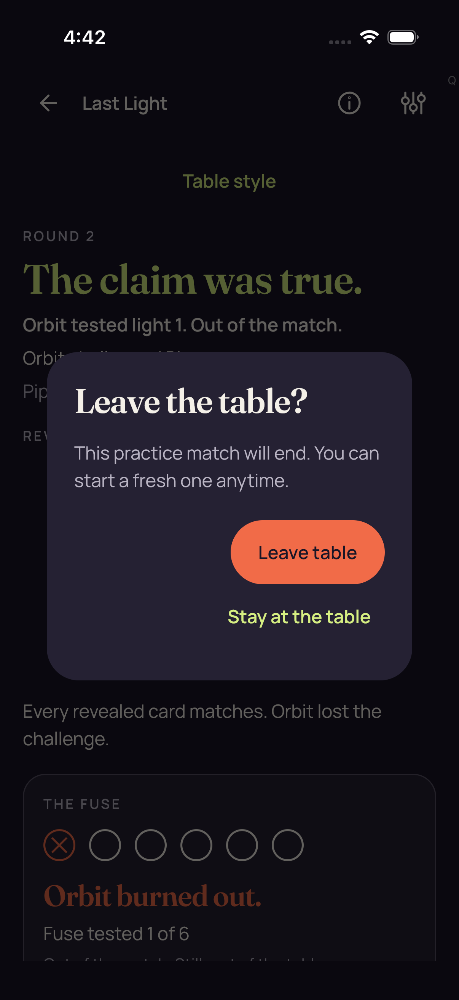</a>

**Pixel review: direct — /root/ios_review**

The Leave the table? modal and Leave and Stay controls are visible above the Standard underlay. No private hand disclosure or native stage is visible.

[Exact review](../provenance/review/ios_review/original-screenshot-independent-review-v1.json) — JSON pointer `/productionCaptures/31`.

[Source-paired sanitized observation](../provenance/collector/ios-reports-and-simulator-app/build/ci/ios/godot-session/attachments/D72CB595-8FCA-401D-BEF4-BAADBA1F6842.json) — sequence `1122`; the PNG and retained document are not asserted to be atomic.

## A6E03DED-D494-4139-81C3-49FD68CB8FEC.png

Source label: 3d Leave cancelled on same concealed session

Test: `PartyDeckGodotSessionUITests/testProduction3DPracticeSession()`. Export timestamp: `1789101753.794`. Original manifest case/attachment: 2/27.

<a href="../originals/A6E03DED-D494-4139-81C3-49FD68CB8FEC.png">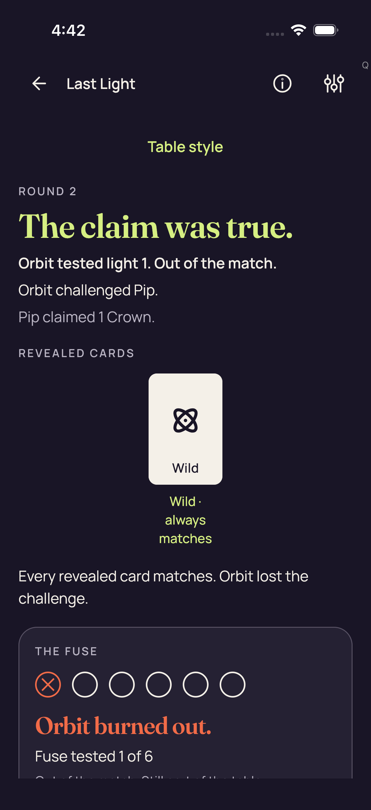</a>

**Pixel review: direct — /root/ios_review**

The Standard table visibly shows ROUND 2 and a concealed hand, with no Leave dialog or native stage visible.

[Exact review](../provenance/review/ios_review/original-screenshot-independent-review-v1.json) — JSON pointer `/productionCaptures/32`.

[Source-paired sanitized observation](../provenance/collector/ios-reports-and-simulator-app/build/ci/ios/godot-session/attachments/9AD67926-B509-4D66-A915-233654D35E96.json) — sequence `1133`; the PNG and retained document are not asserted to be atomic.

## 62D9A565-0EEF-4B9E-908B-DA8E8FEDBB11.png

Source label: Actual production Leave confirmation

Test: `PartyDeckGodotSessionUITests/testProduction3DPracticeSession()`. Export timestamp: `1789101783.03`. Original manifest case/attachment: 2/25.

**Pixel review: direct — /root/ios_review**

The Leave the table? modal and Leave and Stay controls are visible above the Standard underlay. No private hand disclosure or native stage is visible.

[Exact review](../provenance/review/ios_review/original-screenshot-independent-review-v1.json) — JSON pointer `/productionCaptures/33`.

[Source-paired sanitized observation](../provenance/collector/ios-reports-and-simulator-app/build/ci/ios/godot-session/attachments/0E6E6B29-5CD6-4749-9543-C6FD5BACFF1F.json) — sequence `1190`; the PNG and retained document are not asserted to be atomic.

## D52FC7CE-FE18-49B6-A5BA-BD01FA7D3831.png

Source label: 3d confirmed Leave ended the session

Test: `PartyDeckGodotSessionUITests/testProduction3DPracticeSession()`. Export timestamp: `1789101785.059`. Original manifest case/attachment: 2/23.

<a href="../originals/D52FC7CE-FE18-49B6-A5BA-BD01FA7D3831.png">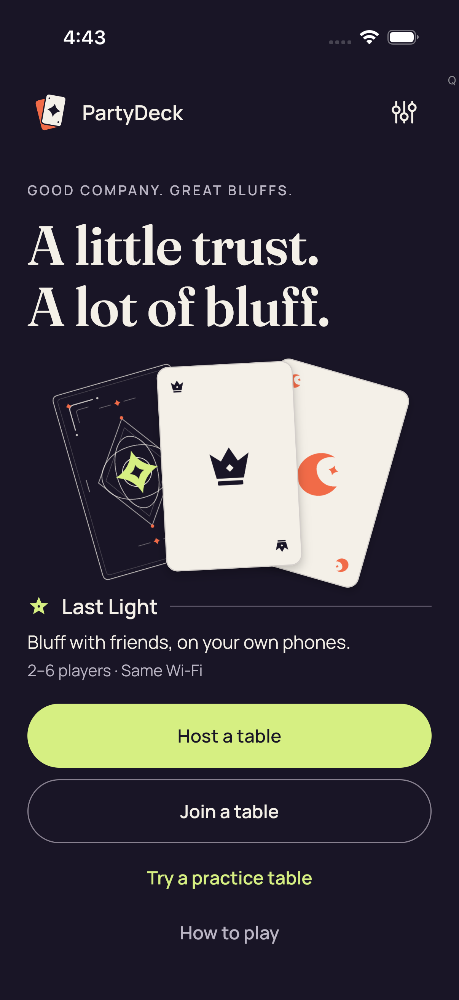</a>

**Pixel review: direct — /root/ios_review**

Home is visible with Host, Join and Practice choices. No native stage or private hand content is visible.

[Exact review](../provenance/review/ios_review/original-screenshot-independent-review-v1.json) — JSON pointer `/productionCaptures/34`.

[Source-paired sanitized observation](../provenance/collector/ios-reports-and-simulator-app/build/ci/ios/godot-session/attachments/A49EAF4B-A885-4F67-9B50-AD6C6985578E.json) — sequence `1200`; the PNG and retained document are not asserted to be atomic.

## 96BF308F-29B0-4BF5-B689-8B874FF80130.png

Source label: 3d real native card selection

Test: `PartyDeckGodotSessionUITests/testProduction3DPracticeSession()`. Export timestamp: `1789101806.596`. Original manifest case/attachment: 2/19.

<a href="../originals/96BF308F-29B0-4BF5-B689-8B874FF80130.png">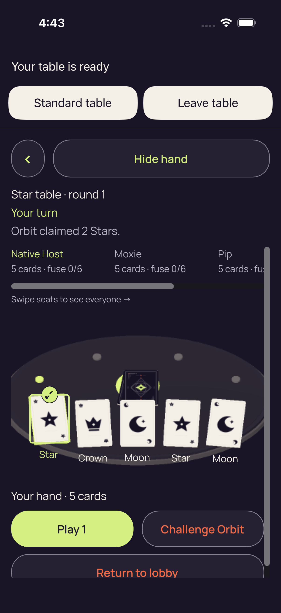</a>

**Pixel review: direct — /root/ios_review**

All five 3D native card faces and labels are visible, with the first-card selected marker present.

[Exact review](../provenance/review/ios_review/original-screenshot-independent-review-v1.json) — JSON pointer `/productionCaptures/35`.

Additional scoped review — /root/pixel_o1_land3 (direct): Later Star round 1: Orbit claimed 2 Stars; first Star selected. Play 1 and Challenge Orbit fit; the complete lobby control does not.

[Scoped record](../provenance/review/pixel_o1_land3/ios34559902607-3d-bounded-review-v1-_pri4hzn/capture-review-index.json) — JSON pointer `/captures/15`.

This still establishes visible claim/count/rank context and the selected Star before the named scroll checkpoint. It does not prove Challenge execution, new-session identity or the input that produced selection.

[Source-paired sanitized observation](../provenance/collector/ios-reports-and-simulator-app/build/ci/ios/godot-session/attachments/766B5D5E-F981-465D-91C8-EB87A6CF9A05.json) — sequence `1264`; the PNG and retained document are not asserted to be atomic.

## 0896A2DA-8FFA-4722-8D67-4BA569111EC9.png

Source label: 3d round 1 full native action bounds preserve selection

Test: `PartyDeckGodotSessionUITests/testProduction3DPracticeSession()`. Export timestamp: `1789101817.014`. Original manifest case/attachment: 2/11.

<a href="../originals/0896A2DA-8FFA-4722-8D67-4BA569111EC9.png">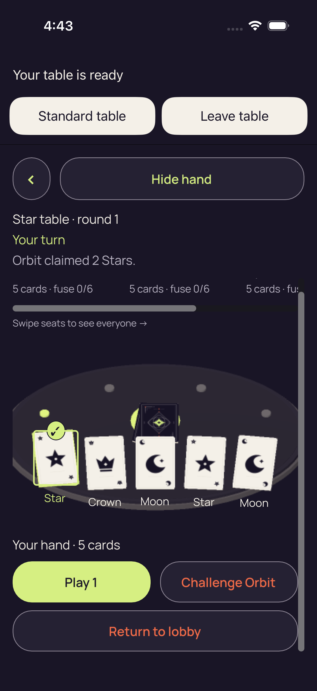</a>

**Pixel review: direct — /root/ios_review**

The actual post-scroll 3D image visibly includes the complete Play 1, Challenge Orbit and Return to lobby buttons, with the first-card selected marker retained. This image supports whole-button visibility after scrolling; it does not demonstrate Challenge execution.

Initial unscrolled 3D frames clip the bottom Return to lobby action. The actual post-scroll image shows all three full action buttons and retained selection.

[Exact review](../provenance/review/ios_review/original-screenshot-independent-review-v1.json) — JSON pointer `/productionCaptures/36`.

Additional scoped review — /root/pixel_o1_land3 (direct): After body scroll: full table/round/turn and Orbit claim remain readable, first Star stays selected, and Play 1, Challenge Orbit and Return to lobby fit completely together.

[Scoped record](../provenance/review/pixel_o1_land3/ios34559902607-3d-bounded-review-v1-_pri4hzn/capture-review-index.json) — JSON pointer `/captures/16`.

Pixels establish co-visibility of public context, retained selected marker and all three controls at this checkpoint. The separate body-scroll JSON records passive scrolling and whole bounds; it does not establish Play, Challenge or lobby execution or general touch/accessibility qualification.

[Source-paired sanitized observation](../provenance/collector/ios-reports-and-simulator-app/build/ci/ios/godot-session/attachments/8001D5B1-5B52-4203-A1C5-BEF932DE3685.json) — sequence `1310`; the PNG and retained document are not asserted to be atomic.

## 0C7AC701-1E72-42CC-A68A-6D1AC1EFB6B3.png

Source label: 3d Hide removes private faces labels and selection

Test: `PartyDeckGodotSessionUITests/testProduction3DPracticeSession()`. Export timestamp: `1789101822.445`. Original manifest case/attachment: 2/8.

<a href="../originals/0C7AC701-1E72-42CC-A68A-6D1AC1EFB6B3.png">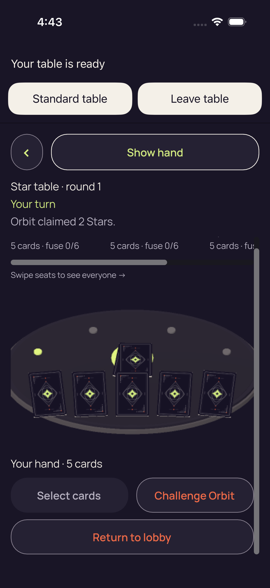</a>

**Pixel review: direct — /root/ios_review**

The 3D native hand shows five covered card backs, with no private hand face labels or selected-card marker visible.

[Exact review](../provenance/review/ios_review/original-screenshot-independent-review-v1.json) — JSON pointer `/productionCaptures/37`.

Additional scoped review — /root/pixel_o1_land3 (direct): Later Hide: backs replace private faces and labels, and the selected-Star marker is absent. The full claim and Select cards, Challenge Orbit and lobby controls fit.

[Scoped record](../provenance/review/pixel_o1_land3/ios34559902607-3d-bounded-review-v1-_pri4hzn/capture-review-index.json) — JSON pointer `/captures/17`.

This proves captured absence of private faces/labels/badge, not continuous privacy or accessibility-node removal. Assigned capture 8 has exactly the same complete bytes but a separate new-practice title/identity; matching pixels do not independently prove engine reuse or fresh input.

[Source-paired sanitized observation](../provenance/collector/ios-reports-and-simulator-app/build/ci/ios/godot-session/attachments/176538E4-0966-44CF-9DE0-CA0DFA50E7D1.json) — sequence `1327`; the PNG and retained document are not asserted to be atomic.

## D2EA5FDE-7418-4EB5-B70A-52C5C484D447.png

Source label: 3d new practice reuses engine and receives fresh input

Test: `PartyDeckGodotSessionUITests/testProduction3DPracticeSession()`. Export timestamp: `1789101823.944`. Original manifest case/attachment: 2/6.

**Pixel review: direct — /root/ios_review**

The 3D native hand shows five covered card backs, with no private hand face labels or selected-card marker visible.

[Exact review](../provenance/review/ios_review/original-screenshot-independent-review-v1.json) — JSON pointer `/productionCaptures/38`.

Additional scoped review — /root/pixel_o1_land3 (reviewed_byte_match): The separately named new-practice capture has exactly capture 7’s bytes. Its concealed hand and full claim/actions are reviewed by that match; the title does not prove engine reuse or fresh input.

[Scoped record](../provenance/review/pixel_o1_land3/ios34559902607-3d-bounded-review-v1-_pri4hzn/capture-review-index.json) — JSON pointer `/captures/18`.

This proves captured absence of private faces/labels/badge, not continuous privacy or accessibility-node removal. Assigned capture 8 has exactly the same complete bytes but a separate new-practice title/identity; matching pixels do not independently prove engine reuse or fresh input.

Its directly viewed representative is [0C7AC701-1E72-42CC-A68A-6D1AC1EFB6B3.png](../originals/0C7AC701-1E72-42CC-A68A-6D1AC1EFB6B3.png).

[Source-paired sanitized observation](../provenance/collector/ios-reports-and-simulator-app/build/ci/ios/godot-session/attachments/7B052DBF-D073-4CB7-9CF8-D28F67587813.json) — sequence `1327`; the PNG and retained document are not asserted to be atomic.

## 7F81DB0A-2BE1-446E-A003-8D183360D5D1.png

Source label: Actual production Leave confirmation

Test: `PartyDeckGodotSessionUITests/testProduction3DPracticeSession()`. Export timestamp: `1789101831.055`. Original manifest case/attachment: 2/4.

<a href="../originals/7F81DB0A-2BE1-446E-A003-8D183360D5D1.png">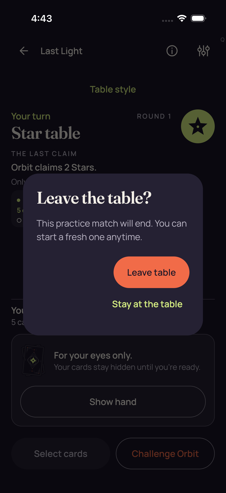</a>

**Pixel review: direct — /root/ios_review**

The Leave the table? modal and Leave and Stay controls are visible above the Standard underlay. No private hand disclosure or native stage is visible.

[Exact review](../provenance/review/ios_review/original-screenshot-independent-review-v1.json) — JSON pointer `/productionCaptures/39`.

[Source-paired sanitized observation](../provenance/collector/ios-reports-and-simulator-app/build/ci/ios/godot-session/attachments/2E90F1EB-8A0D-49DE-B368-6FCFA62906C7.json) — sequence `1359`; the PNG and retained document are not asserted to be atomic.

## 6E61EF7D-0A35-4A58-BB49-3B72B69AA90C.png

Source label: 3d production smoke cleanup complete

Test: `PartyDeckGodotSessionUITests/testProduction3DPracticeSession()`. Export timestamp: `1789101837.167`. Original manifest case/attachment: 2/2.

**Pixel review: direct — /root/ios_review**

Home is visible with Host, Join and Practice choices. No native stage or private hand content is visible.

[Exact review](../provenance/review/ios_review/original-screenshot-independent-review-v1.json) — JSON pointer `/productionCaptures/40`.

[Source-paired sanitized observation](../provenance/collector/ios-reports-and-simulator-app/build/ci/ios/godot-session/attachments/40F0B0D7-E1A3-4FDD-82F7-FE47438C77FD.json) — sequence `1378`; the PNG and retained document are not asserted to be atomic.

