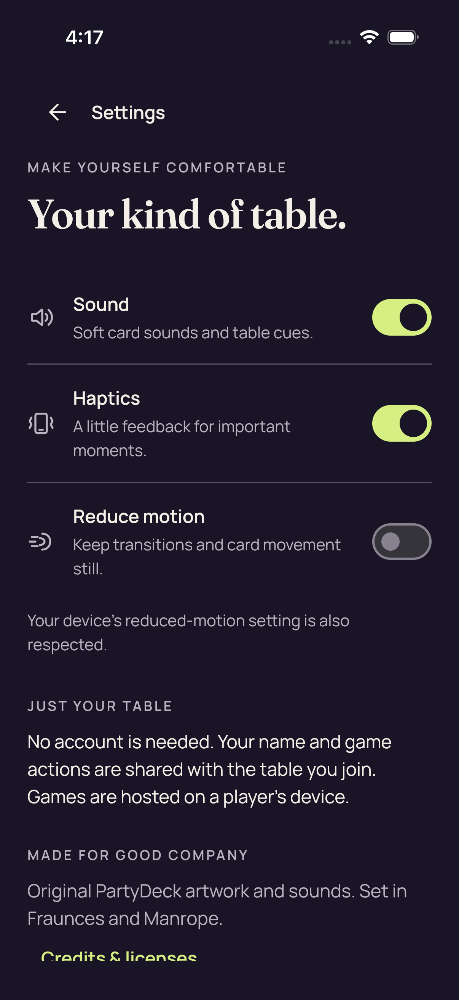
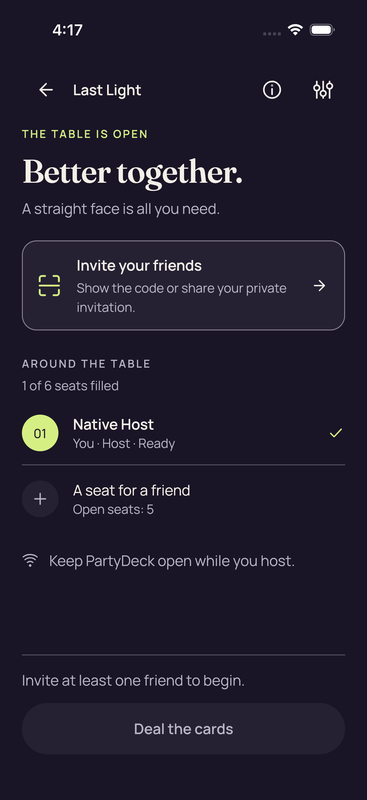
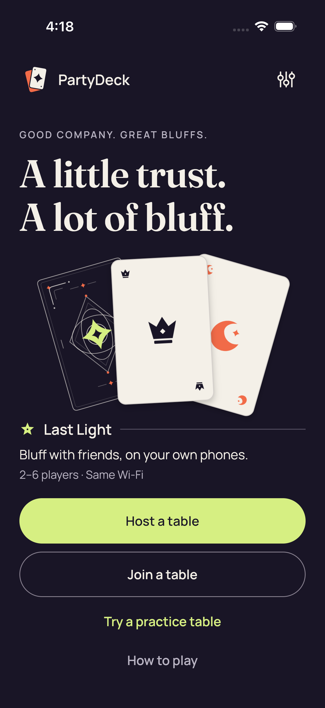
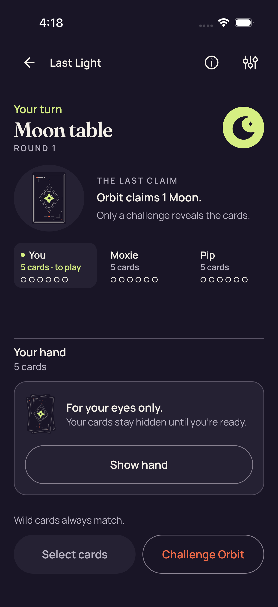
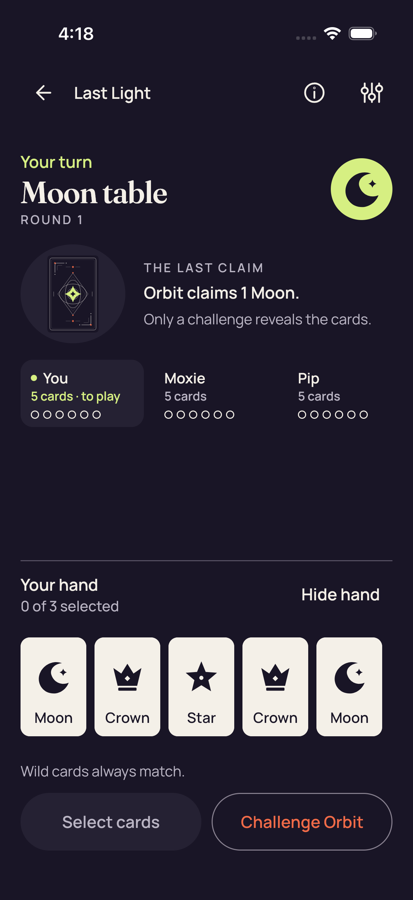
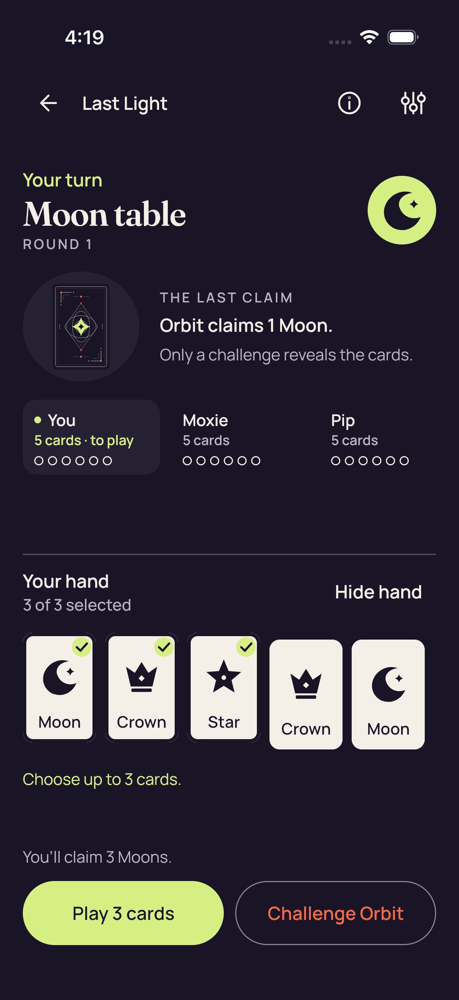
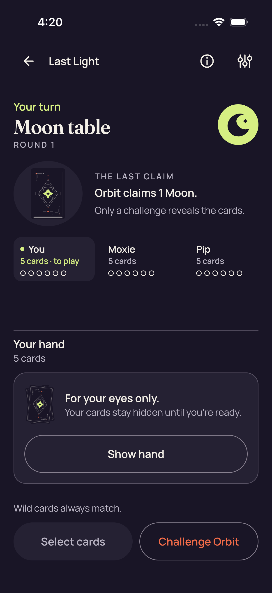
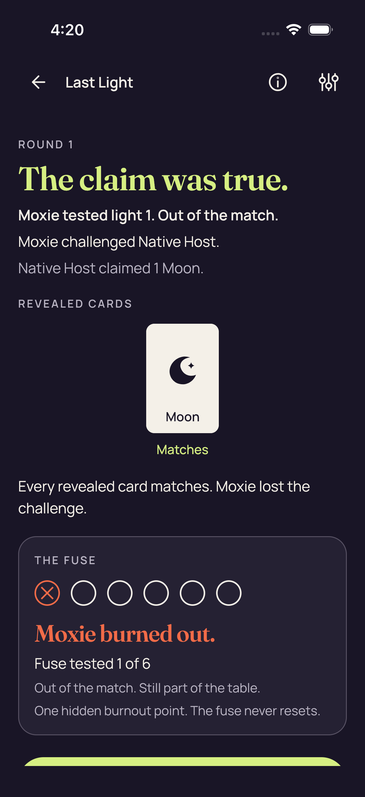

# Ordinary iOS UI — CI 34559902607

[Collection](../README.md) · [Manifest](../manifest.json)

10 original PNGs, in original export timestamp order. Source labels and pixel findings are recorded separately.

## 3D66B340-AADF-445F-A14E-49C9D080D6DC.png

Source label: Settings_0_90BEE4AF-0AD4-49C9-8E4D-7EFDDBA8E341.png

Test: `PartyDeckUITests/testNativeHostCanNavigateSharedSettings()`. Export timestamp: `1789100239.445`. Original manifest case/attachment: 1/1.

**Pixel review: direct — /root/ios_review**

Settings shows Sound, Haptics and Reduce motion toggles with explanatory text. The lower credits link is clipped by the scrolling viewport, so this capture does not establish complete initial visibility of that link.

The ordinary Settings credits link and practice result next action are partly clipped in their captured scrolling viewports.

[Exact review](../provenance/review/ios_review/original-screenshot-independent-review-v1.json) — JSON pointer `/ordinaryCaptures/0`.

## 27A99B04-983E-4093-BBD5-856857AAAAB0.png

Source label: Native host lobby_0_F679D94F-CB41-492E-B10C-FFD93BFCED38.png

Test: `PartyDeckUITests/testSharedControllerHostsANativeTableAndShowsItsInvitation()`. Export timestamp: `1789100266.901`. Original manifest case/attachment: 2/2.

**Pixel review: direct — /root/ios_review**

The host lobby shows Native Host ready, one of six seats filled and five open seats. Invite is visible and Deal appears disabled. No invitation payload or admission secret is visible in these lobby captures.

[Exact review](../provenance/review/ios_review/original-screenshot-independent-review-v1.json) — JSON pointer `/ordinaryCaptures/2`.

## AABDA185-1C33-418B-84CB-0BD1E6E78E5A.png

Source label: Native host invitation closed_0_B81F40E2-2AFF-4C57-B940-E97497EC3BA4.png

Test: `PartyDeckUITests/testSharedControllerHostsANativeTableAndShowsItsInvitation()`. Export timestamp: `1789100272.902`. Original manifest case/attachment: 2/1.

**Pixel review: direct — /root/ios_review**

The host lobby shows Native Host ready, one of six seats filled and five open seats. Invite is visible and Deal appears disabled. No invitation payload or admission secret is visible in these lobby captures.

[Exact review](../provenance/review/ios_review/original-screenshot-independent-review-v1.json) — JSON pointer `/ordinaryCaptures/1`.

## BA4FE395-6EF1-4FCE-A00F-65AC98BB248A.png

Source label: Home_0_D19BB869-38B1-4EA5-960A-5C4A072EBD59.png

Test: `PartyDeckUITests/testSharedHomeOpensAPlayablePracticeTable()`. Export timestamp: `1789100288.553`. Original manifest case/attachment: 3/7.

**Pixel review: direct — /root/ios_review**

Home is visible with Host, Join and Practice choices. No native stage or private hand content is visible. The ordinary Home capture has no visible Q qualification marker.

[Exact review](../provenance/review/ios_review/original-screenshot-independent-review-v1.json) — JSON pointer `/ordinaryCaptures/9`.

## 37645B95-59ED-4575-8FBE-5A57A43799AB.png

Source label: Practice Standard concealed_0_9F927166-6082-455B-AAFA-3DB5FFF78C54.png

Test: `PartyDeckUITests/testSharedHomeOpensAPlayablePracticeTable()`. Export timestamp: `1789100293.867`. Original manifest case/attachment: 3/6.

**Pixel review: direct — /root/ios_review**

The captured Standard hand area shows the concealed hand panel and Show hand control; no private hand faces, rank labels or selected-card markers are visible.

[Exact review](../provenance/review/ios_review/original-screenshot-independent-review-v1.json) — JSON pointer `/ordinaryCaptures/8`.

## B74A1E74-163C-45EF-ACE0-3FCFC663B537.png

Source label: Practice Standard all five native card descriptions_0_4883A3B5-18AB-4E1C-BF2C-4E783DA40686.png

Test: `PartyDeckUITests/testSharedHomeOpensAPlayablePracticeTable()`. Export timestamp: `1789100319.268`. Original manifest case/attachment: 3/5.

**Pixel review: direct — /root/ios_review**

Five card faces and readable labels are simultaneously visible in the Standard hand. The selection text is 0 of 3 selected, with no selected-card checks visible.

[Exact review](../provenance/review/ios_review/original-screenshot-independent-review-v1.json) — JSON pointer `/ordinaryCaptures/7`.

## 3CF5875D-126E-4082-9C7E-06B6909A55A2.png

Source label: Practice Standard maximum selection and count-only feedback_0_ECBC2C98-4DD3-4C30-8359-F1FE12447D39.png

Test: `PartyDeckUITests/testSharedHomeOpensAPlayablePracticeTable()`. Export timestamp: `1789100384.331`. Original manifest case/attachment: 3/4.

**Pixel review: direct — /root/ios_review**

Exactly the first three of five visible Standard cards have selected markers. The screen reads 3 of 3 selected and Choose up to 3 cards.; the Play 3 cards control is visible.

[Exact review](../provenance/review/ios_review/original-screenshot-independent-review-v1.json) — JSON pointer `/ordinaryCaptures/6`.

## 2C4189F4-8E3A-4AEC-836F-E2D62A782A33.png

Source label: Practice Standard Hide removes private nodes and selection_0_F622E2AD-9DA8-4A90-8983-C8C8FFC26205.png

Test: `PartyDeckUITests/testSharedHomeOpensAPlayablePracticeTable()`. Export timestamp: `1789100409.452`. Original manifest case/attachment: 3/3.

**Pixel review: direct — /root/ios_review**

The captured Standard hand area shows the concealed hand panel and Show hand control; no private hand faces, rank labels or selected-card markers are visible.

[Exact review](../provenance/review/ios_review/original-screenshot-independent-review-v1.json) — JSON pointer `/ordinaryCaptures/5`.

## 59050287-1F7F-490B-AC7A-51E6024FF430.png

Source label: Practice Standard fresh Reveal is unselected_0_3DDA2D8D-974E-4450-8EBF-4ED7F569644A.png

Test: `PartyDeckUITests/testSharedHomeOpensAPlayablePracticeTable()`. Export timestamp: `1789100429.339`. Original manifest case/attachment: 3/2.

**Pixel review: direct — /root/ios_review**

Five card faces and readable labels are simultaneously visible in the Standard hand. The selection text is 0 of 3 selected, with no selected-card checks visible.

[Exact review](../provenance/review/ios_review/original-screenshot-independent-review-v1.json) — JSON pointer `/ordinaryCaptures/4`.

## F28F669C-C729-4085-8599-E1336112B96C.png

Source label: Practice after accepted play_0_5FA78450-3A17-4CAD-97A1-324C782F5F2B.png

Test: `PartyDeckUITests/testSharedHomeOpensAPlayablePracticeTable()`. Export timestamp: `1789100457.946`. Original manifest case/attachment: 3/1.

**Pixel review: direct — /root/ios_review**

The ordinary practice capture shows a public round result with the revealed public card and opponent result/fuse information. The lower next action is partly clipped by the scrolling viewport.

The ordinary Settings credits link and practice result next action are partly clipped in their captured scrolling viewports.

[Exact review](../provenance/review/ios_review/original-screenshot-independent-review-v1.json) — JSON pointer `/ordinaryCaptures/3`.

