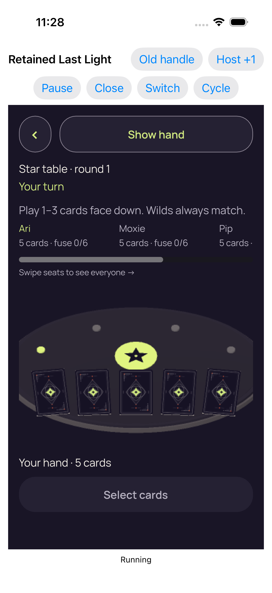
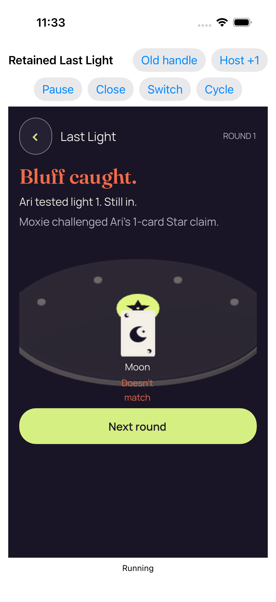
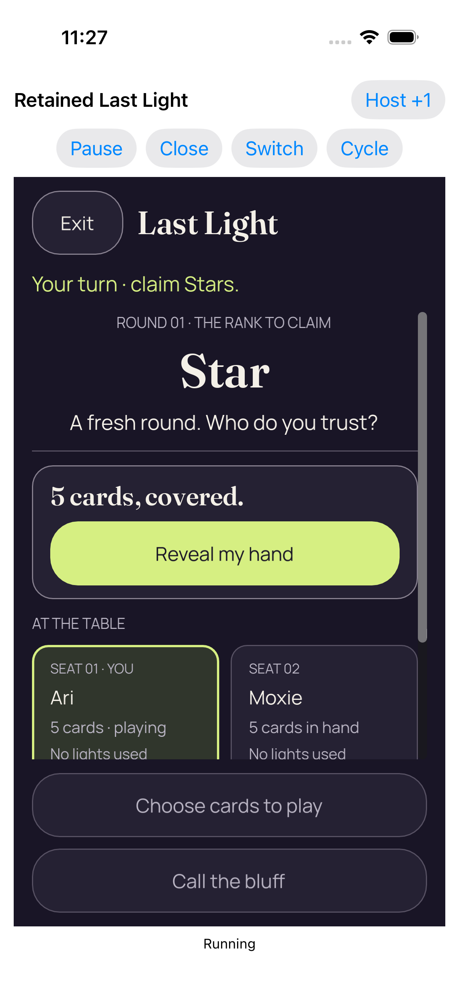
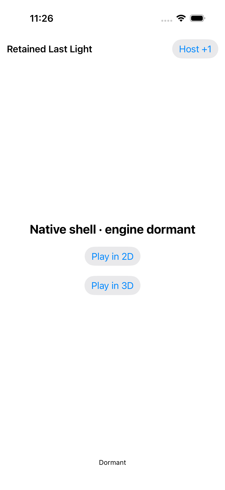
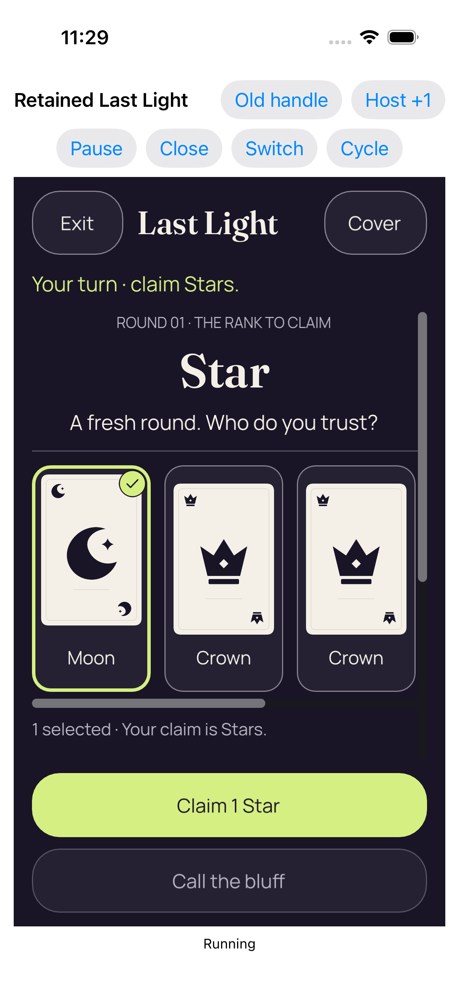
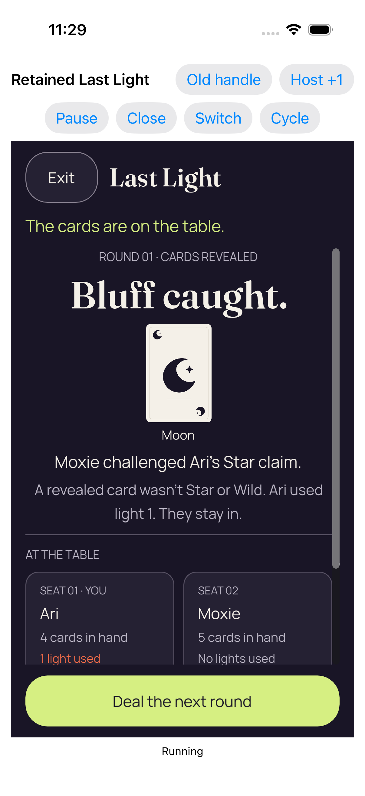
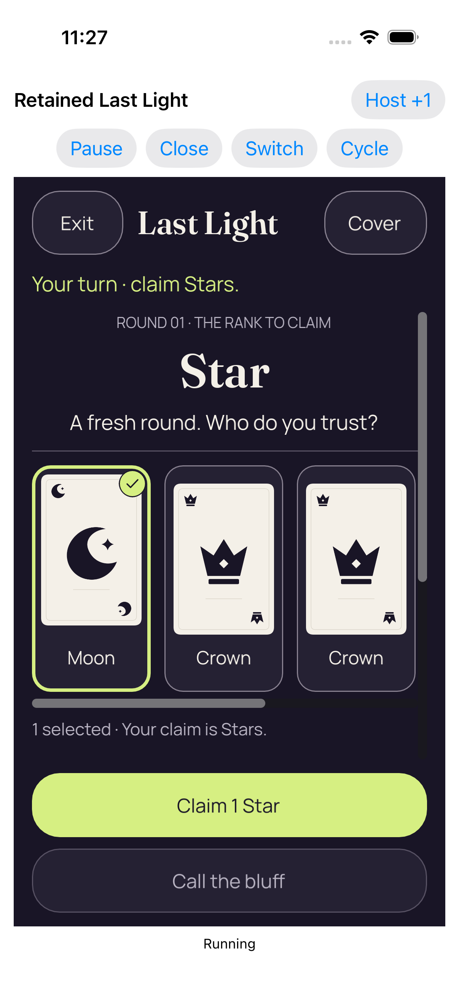
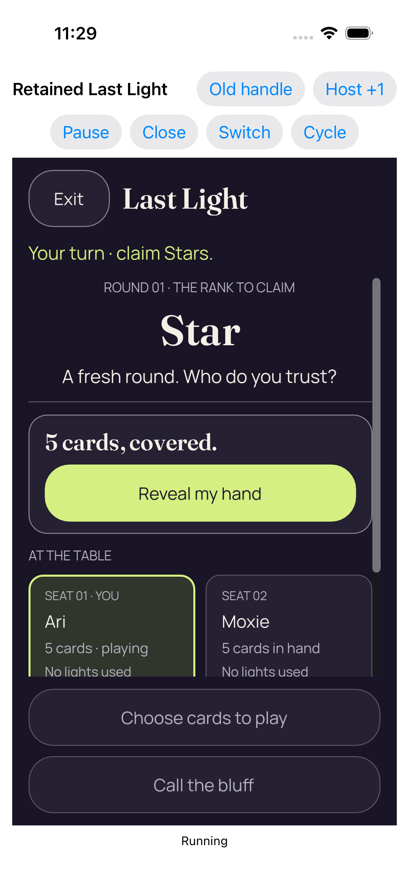
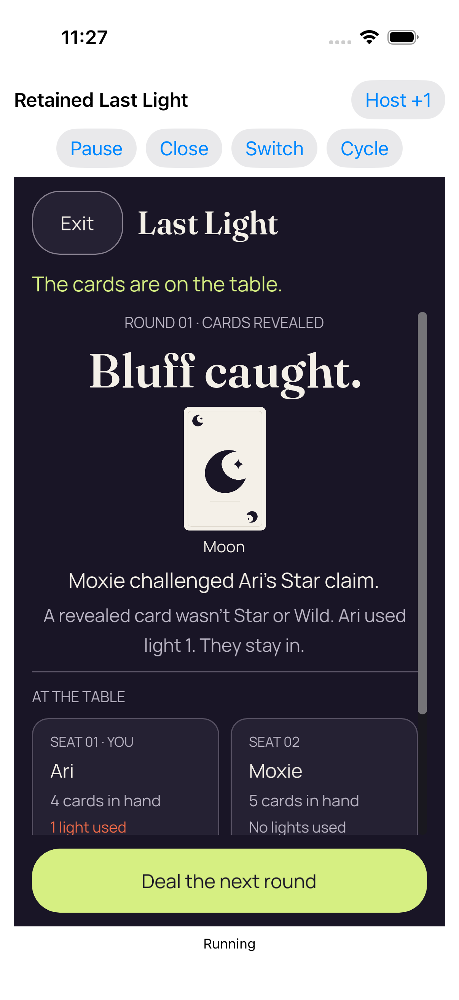
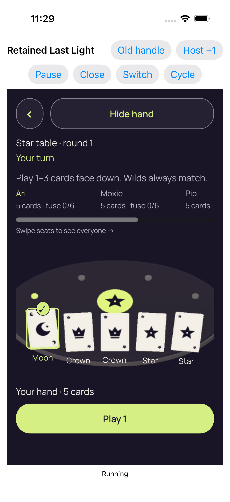

# Retained iOS native host — CI 34540908385

All three retained-host cases passed. Same-process retained lifecycle is qualified for this native Simulator test harness. KMP production factory, device Metal, physical motion shutdown and real audio interruption remain unqualified. Eight original stills directly reviewed; 23 unviewed.

Exact source: `65e4d86ed13e9a98dd56df49436093304a26f083`. Platform: iPhone 17 Simulator, native test harness.

**31 images**: 8 direct original view; 23 preserved image; unviewed.

[Gallery index](../README.md) · [Batch scope and review counts](../provenance/20260911-4586/review-summary.json) · [Exact source paths, hashes and timestamps](../provenance/20260911-4586/source-map.json).

### Entry 2 fresh concealed 3d_0_0E550F5F-7EB2-4F7A-9B9A-AA77CB136FAD.png

`2676649A-B42F-4A41-8733-CAD99A504B3A.png` · 1206 × 2622 · 365,760 bytes.

SHA-256: `409109c1764d0a75d8562d47b2b9031d03183cda979e9f6e381b772366398322`.

**[Direct original view](provenance/visual-review/review.json).** The fresh 3D entry shows the complete Show hand control, Star table · round 1, Your turn, play guidance, five card backs, Your hand · 5 cards and the disabled Select cards button. The table/card-back imagery remains coarse beside the interface text. Ari and Moxie seat summaries are readable; Pip’s statistics are clipped at the horizontal strip boundary with a scrollbar and explicit swipe affordance. No private hand face, suit label or selected check is visible. The later entry’s native identity and freshness come from source/measurement evidence, not this still alone.

Original test: `RetainedHostUITests/testRepeated2DAnd3DKeepOneDormantEngine()`. Attachment timestamp: `1789082895.41`.

### Coalesced native foreground loss and regain returned concealed_0_FF53CEBB-DCCF-45A2-8296-A6DA26A04BB8.png

`4EC820BA-D50F-47D9-B9D6-34E56C0B9B63.png` · 1206 × 2622 · 265,380 bytes.

SHA-256: `16e01cd966cbaa6af4ba0e429f3f5af79bb47a463e09dd35ec170b3bda6bab9c`.

**[Direct original view](provenance/visual-review/review.json).** The original foreground-loss/regain checkpoint visibly shows the retained 2D Star round-1 concealed layout: 5 cards, covered and a complete Reveal my hand button. The visible seat panels are clipped at the bottom scroll boundary, while both fixed Choose cards to play and Call the bluff controls fit. A vertical scrollbar is visible. No private faces or selected-card indicators are visible.

Original test: `RetainedHostUITests/testActiveAndDormantBackgroundTransitionsStayConcealed()`. Attachment timestamp: `1789082642.752`.

### Real background and resume kept the same authority concealed_0_B0FBD219-462C-48F5-AA00-4AA68164E80E.png

`51E32978-9916-43C1-B213-B109BF289374.png` · 1206 × 2622 · 264,476 bytes.

SHA-256: `79b2a995a8d525b07d3e6e92a345cd96d3f6f139bc91877b41cf372fa221eeb6`.

**[Direct original view](provenance/visual-review/review.json).** The original background/resume checkpoint visibly shows the retained 2D Star round-1 concealed layout with the complete 5 cards, covered panel and Reveal my hand. The visible seat panels meet the lower scroll-body clip; both fixed lower action controls fit completely. No private faces, hand labels or selected-card indicators are visible. The two lifecycle checkpoint stills cannot establish the ordering or uninterrupted concealment of intermediate background/foreground frames.

Original test: `RetainedHostUITests/testActiveAndDormantBackgroundTransitionsStayConcealed()`. Attachment timestamp: `1789082764.525`.

### Old native handle refused commands, grants, callbacks, and replacement closure_0_7BB4ECE8-1D88-4C3B-ADF2-767B8040A2FB.png

`9B687B58-C5F5-4EB9-B479-22DD8DAE6452.png` · 1206 × 2622 · 365,485 bytes.

SHA-256: `a32180af2d1228acccd0410e9dda6ae3f3c08eace8aec4f9f007d125726a12b2`.

**[Direct original view](provenance/visual-review/review.json).** Retained Last Light harness chrome surrounds a native Star table · round 1 view. Show hand, Your turn, play guidance and the full disabled Select cards action fit. The table illustration shows five complete card backs. Your hand · 5 cards is visible; no private face or suit labels are visible. Ari and Moxie seat summaries fit. Pip’s remaining statistics are clipped at the horizontal seat viewport, which has a scrollbar and explicit Swipe seats to see everyone arrow. Table and card-back artwork appears visibly coarse beside crisp interface text; these pixels do not identify the renderer sampling or density cause.

Original test: `RetainedHostUITests/testStaleFirstReadyAndCloseCompletionReentry()`. Attachment timestamp: `1789083120.359`.

### Whole recipient scene retired; retained services dormant_0_A7134E48-E223-458D-A1A4-4DEF75063277.png

`A4A7C45D-70AD-4297-BB1E-73FC08D2132F.png` · 1206 × 2622 · 98,068 bytes.

SHA-256: `53a2dd562a320fbc612010f5a4c921d9359be9fb1c2db91afcd3d75b06f86d05`.

**[Direct original view](provenance/visual-review/review.json).** The game renderer is absent from the visible white native harness shell. Retained Last Light, Host +1, Native shell · engine dormant, Play in 2D, Play in 3D and Dormant are all visible. No game cards, private faces, table scene or selected-card indicator are visible. The word Dormant is a visible UI label; actual engine dormancy is separate measurement/source evidence.

Original test: `RetainedHostUITests/testStaleFirstReadyAndCloseCompletionReentry()`. Attachment timestamp: `1789083195.822`.

### Real play accepted by the Kotlin authority_0_8FFCD8DA-4494-423C-A800-E6607DA2DC26.png

`BE62F47D-AA26-4D79-8DA2-22FF16A86A98.png` · 1206 × 2622 · 234,153 bytes.

SHA-256: `45cde42e88d6ab8555c41f0dcfa1d041dc9c36d05dd6dbc2c1a75a5a86b072ed`.

**[Direct original view](provenance/visual-review/review.json).** The retained renderer shows a complete public ROUND 1 bluff result: Bluff caught, Ari tested light 1. Still in., and Moxie challenged Ari’s 1-card Star claim. A public Moon proof card, Moon label, two-line Doesn’t match feedback and the full Next round button are visible without viewport clipping. The remaining private hand is not displayed. The table/card imagery remains coarse while the text and Next round control are crisp. Public proof feedback crosses the illustrated table edge but remains readable.

Original test: `RetainedHostUITests/testStaleFirstReadyAndCloseCompletionReentry()`. Attachment timestamp: `1789083189.617`.

### Real reveal and card selection_0_988F6A9A-653F-4EED-BD1E-AF96A442313F.png

`ED5B6A69-7140-4BC2-AEF0-96CB875D3401.png` · 1206 × 2622 · 324,601 bytes.

SHA-256: `d4951e4f2a3ed4ea0c319821e3d3f6002b73646901ebeba971c721369a5ef0fe`.

**[Direct original view](provenance/visual-review/review.json).** The same retained 3D table is revealed. Moon, Crown, Crown, Star, Star faces and all five suit labels fit; Moon has a lime outline and a visible selected check. Hide hand, Your hand · 5 cards and the full Play 1 action fit. The horizontal seat-strip clipping and swipe affordance remain. The table and card-face imagery is visibly coarse compared with the surrounding text. No card, selected check or primary action is cut by the renderer viewport in this still.

Original test: `RetainedHostUITests/testStaleFirstReadyAndCloseCompletionReentry()`. Attachment timestamp: `1789083179.18`.

### Entry 1 fresh concealed 2d_0_31036F0D-B76B-415A-AF90-5C00DD308C3D.png

`FF32828B-A585-45E0-B6D5-C23643271754.png` · 1206 × 2622 · 263,869 bytes.

SHA-256: `aa508e38d0930965a90df340eba6326832a649f6debfb40de6fdff8b04832654`.

**[Direct original view](provenance/visual-review/review.json).** The first retained 2D entry shows Exit, Last Light, Your turn · claim Stars, ROUND 01, Star and A fresh round. Who do you trust? clearly. The complete 5 cards, covered panel and Reveal my hand action fit inside the scroll body. The two visible seat panels are clipped at their lower edge by the body viewport; a vertical scrollbar is visible. Both fixed lower Choose cards to play and Call the bluff controls fit. No private hand faces are visible.

Original test: `RetainedHostUITests/testRepeated2DAnd3DKeepOneDormantEngine()`. Attachment timestamp: `1789082852.195`.

### Whole recipient scene retired; retained services dormant_0_087B9772-0703-4891-AF06-D7040F5B898F.png

`038C0988-55C3-4BD0-B03C-234419204E13.png` · 1206 × 2622 · 98,660 bytes.

SHA-256: `628d0932a0de49184328208ccf54a3592a1c38012ba6acab98fbf6dbc9283fbd`.

**[Preserved image; unviewed](provenance/visual-review/review.json).** Original Simulator attachment preserved without a direct pixel view. No visual finding is asserted.

Original test: `RetainedHostUITests/testRepeated2DAnd3DKeepOneDormantEngine()`. Attachment timestamp: `1789083002.458`.

### Real play accepted by the Kotlin authority_0_971DC0B0-0DC9-447E-9450-33DE3A221A48.png

`27B2132A-DEAF-4025-A20F-3101DCE2238A.png` · 1206 × 2622 · 234,751 bytes.

SHA-256: `fb3c58dbf28c775df34ae99abe08b86cdf2d5eeb4b71084194f48f79890ce516`.

**[Preserved image; unviewed](provenance/visual-review/review.json).** Original Simulator attachment preserved without a direct pixel view. No visual finding is asserted.

Original test: `RetainedHostUITests/testRepeated2DAnd3DKeepOneDormantEngine()`. Attachment timestamp: `1789083058.015`.

### Whole recipient scene retired; retained services dormant_0_66E639E3-7FF3-4125-B474-76A367E34698.png

`31A7AB7B-9F22-4B79-B423-6C3908A465F5.png` · 1206 × 2622 · 98,155 bytes.

SHA-256: `fb732ccbe5e4c1b1b94c3a1789cfd98b497ff5bcbba0ad08530b365385533067`.

**[Preserved image; unviewed](provenance/visual-review/review.json).** Original Simulator attachment preserved without a direct pixel view. No visual finding is asserted.

Original test: `RetainedHostUITests/testRepeated2DAnd3DKeepOneDormantEngine()`. Attachment timestamp: `1789082862.933`.

### Actual Home screen_0_E5A8B45D-2C42-4347-AD85-B86DCBABFA79.png

`35EA59DE-E89A-4993-818D-10320FB27F0A.png` · 1206 × 2622 · 2,804,919 bytes.

SHA-256: `c0abf4f8b4392638eec8bd2f86067f08a0a95722aa0492fbc4d01ba2af675e11`.

**[Preserved image; unviewed](provenance/visual-review/review.json).** Original Simulator attachment preserved without a direct pixel view. No visual finding is asserted.

Original test: `RetainedHostUITests/testActiveAndDormantBackgroundTransitionsStayConcealed()`. Attachment timestamp: `1789082759.82`.

### Whole recipient scene retired; retained services dormant_0_AE3988EA-B1AE-4C7F-B4BF-88FB1FF68C08.png

`419C36C8-0DAE-49B9-B669-10ECC29B3562.png` · 1206 × 2622 · 98,717 bytes.

SHA-256: `ea2fcd014a1d36e7a1f0b0b24a2c7efa26e8f718cbfeac14cc87554a146015ee`.

**[Preserved image; unviewed](provenance/visual-review/review.json).** Original Simulator attachment preserved without a direct pixel view. No visual finding is asserted.

Original test: `RetainedHostUITests/testActiveAndDormantBackgroundTransitionsStayConcealed()`. Attachment timestamp: `1789082767.734`.

### Real reveal and card selection_0_E1EE3B40-AA0F-41EC-82EF-05FA119D7F1C.png

`4C1BCAF6-A932-4413-9EF1-F44F29EE96FD.png` · 1206 × 2622 · 244,532 bytes.

SHA-256: `40c608629d61b2e97d8696f4cc2fab284d5e8f0c47aee5f8151362b9f850e5bc`.

**[Preserved image; unviewed](provenance/visual-review/review.json).** Original Simulator attachment preserved without a direct pixel view. No visual finding is asserted.

Original test: `RetainedHostUITests/testRepeated2DAnd3DKeepOneDormantEngine()`. Attachment timestamp: `1789082979.478`.

### Real play accepted by the Kotlin authority_0_2DB39130-7CE3-4AA9-8EAE-DE986CB24F3F.png

`54695AF0-1828-49CF-8BA8-A2937A71740E.png` · 1206 × 2622 · 272,788 bytes.

SHA-256: `dd6b5c43bf991954eb7d01073c79b0eaaf937d1f73792cf28cc8433a0145f052`.

**[Preserved image; unviewed](provenance/visual-review/review.json).** Original Simulator attachment preserved without a direct pixel view. No visual finding is asserted.

Original test: `RetainedHostUITests/testRepeated2DAnd3DKeepOneDormantEngine()`. Attachment timestamp: `1789082988.772`.

### Four completed real entries in one retained engine process_0_40FD2C5F-A941-4819-B383-A0D8E456E0F4.png

`54D0D3F4-B2C7-4434-96F4-EC97FD3CA1A6.png` · 1206 × 2622 · 97,943 bytes.

SHA-256: `9713b1b288f868001f635826ba24ec4eece10c0f397e6bd3791151a109d1595d`.

**[Preserved image; unviewed](provenance/visual-review/review.json).** Original Simulator attachment preserved without a direct pixel view. No visual finding is asserted.

Original test: `RetainedHostUITests/testRepeated2DAnd3DKeepOneDormantEngine()`. Attachment timestamp: `1789083063.794`.

### Real reveal and card selection_0_76B77B3E-73E0-4E4F-890D-3B532688B0B6.png

`5582F552-ABE6-44D8-B0DB-9F61A4F54A57.png` · 1206 × 2622 · 324,729 bytes.

SHA-256: `00fb02cff01840e9271e30dd52c852aca0387b209661e584df49203b3fa4ca50`.

**[Preserved image; unviewed](provenance/visual-review/review.json).** Original Simulator attachment preserved without a direct pixel view. No visual finding is asserted.

Original test: `RetainedHostUITests/testRepeated2DAnd3DKeepOneDormantEngine()`. Attachment timestamp: `1789083052.662`.

### Real reveal and card selection_0_F6241EF3-86ED-4F14-A1B3-E048CF8F68A9.png

`56253CA5-D104-466D-B573-6E216895B5F1.png` · 1206 × 2622 · 239,287 bytes.

SHA-256: `deb922f383f7e2419b8fa67b124ddbf395bd40f4e5da90fbd2fca34ab30586b2`.

**[Preserved image; unviewed](provenance/visual-review/review.json).** Original Simulator attachment preserved without a direct pixel view. No visual finding is asserted.

Original test: `RetainedHostUITests/testRepeated2DAnd3DKeepOneDormantEngine()`. Attachment timestamp: `1789082857.531`.

### Dormant application lifecycle did not restart the engine services_0_D69F233B-5867-49A3-8FA0-9768614D1D60.png

`5CBDF706-0538-4DC3-B0F9-6696CA2655E0.png` · 1206 × 2622 · 98,155 bytes.

SHA-256: `fb732ccbe5e4c1b1b94c3a1789cfd98b497ff5bcbba0ad08530b365385533067`.

**[Preserved image; unviewed](provenance/visual-review/review.json).** Original Simulator attachment preserved without a direct pixel view. No visual finding is asserted.

Original test: `RetainedHostUITests/testActiveAndDormantBackgroundTransitionsStayConcealed()`. Attachment timestamp: `1789082823.041`.

### Entry 3 fresh concealed 2d_0_22F20730-763D-4966-A743-36A5C5AF2D24.png

`6107B81B-EFD4-49FC-9024-67E507DCBE38.png` · 1206 × 2622 · 269,604 bytes.

SHA-256: `f0e4b1b8ef42057443c9928ac457c89deb7e9ee175ace08a7b6b8d71f69cbe9a`.

**[Preserved image; unviewed](provenance/visual-review/review.json).** Original Simulator attachment preserved without a direct pixel view. No visual finding is asserted.

Original test: `RetainedHostUITests/testRepeated2DAnd3DKeepOneDormantEngine()`. Attachment timestamp: `1789082972.161`.

### Whole recipient scene retired; retained services dormant_0_207FB9B1-E1C2-4411-8AB5-F489535CFB09.png

`6C142FD0-7D42-42EA-94E7-080DF1FB49D7.png` · 1206 × 2622 · 97,943 bytes.

SHA-256: `9713b1b288f868001f635826ba24ec4eece10c0f397e6bd3791151a109d1595d`.

**[Preserved image; unviewed](provenance/visual-review/review.json).** Original Simulator attachment preserved without a direct pixel view. No visual finding is asserted.

Original test: `RetainedHostUITests/testRepeated2DAnd3DKeepOneDormantEngine()`. Attachment timestamp: `1789083062.015`.

### Real play accepted by the Kotlin authority_0_FA005E9B-8399-4BCF-AD66-929A19AEFAEA.png

`71B6E206-1CB8-4819-8944-4CB0142B4944.png` · 1206 × 2622 · 234,764 bytes.

SHA-256: `b2cdcae42ef92c3433143ae59a2a8213abe28ac0da77c96d448b4ceff9db7001`.

**[Preserved image; unviewed](provenance/visual-review/review.json).** Original Simulator attachment preserved without a direct pixel view. No visual finding is asserted.

Original test: `RetainedHostUITests/testRepeated2DAnd3DKeepOneDormantEngine()`. Attachment timestamp: `1789082964.011`.

### Real play accepted by the Kotlin authority_0_E5A07A64-504A-4470-B176-E1E02E271BAF.png

`7D4FE738-FB6A-43C1-BE9C-DAAAC0581A31.png` · 1206 × 2622 · 267,117 bytes.

SHA-256: `627af19f726ae654e7ac442fa38c31d8868e770e7b31755a67195b99ec63bebb`.

**[Preserved image; unviewed](provenance/visual-review/review.json).** Original Simulator attachment preserved without a direct pixel view. No visual finding is asserted.

Original test: `RetainedHostUITests/testRepeated2DAnd3DKeepOneDormantEngine()`. Attachment timestamp: `1789082860.023`.

### Real reveal and card selection_0_7A64D738-3E22-4FBD-94D1-69CBF90DC7E5.png

`80ED1E56-BECE-4D7F-9DCB-4F1D759A8DEF.png` · 1206 × 2622 · 239,273 bytes.

SHA-256: `d7bc7e050d034616abfc7a33230696657ece9a3dc4ec51a6051ab17fde4f9612`.

**[Preserved image; unviewed](provenance/visual-review/review.json).** Original Simulator attachment preserved without a direct pixel view. No visual finding is asserted.

Original test: `RetainedHostUITests/testActiveAndDormantBackgroundTransitionsStayConcealed()`. Attachment timestamp: `1789082648.418`.

### Entry 4 fresh concealed 3d_0_DE918EF5-7BC8-4578-A18F-F54ED7DAE0A3.png

`85D41F8B-99D8-40F9-A1AD-22233B6B146D.png` · 1206 × 2622 · 365,651 bytes.

SHA-256: `d2e99607df3375662d1e1cc9b78101adfbaea0b8e4a3710da32d16bc032fe557`.

**[Preserved image; unviewed](provenance/visual-review/review.json).** Original Simulator attachment preserved without a direct pixel view. No visual finding is asserted.

Original test: `RetainedHostUITests/testRepeated2DAnd3DKeepOneDormantEngine()`. Attachment timestamp: `1789083028.442`.

### Real reveal and card selection_0_E22B6E87-6B53-4D85-889F-F38A13ABC057.png

`96F1729C-B2B0-4108-920F-802256B9D2E4.png` · 1206 × 2622 · 324,728 bytes.

SHA-256: `1c14c42d67d3eca9e9586177253009937ef31c8bdc652f131db4766f6b442419`.

**[Preserved image; unviewed](provenance/visual-review/review.json).** Original Simulator attachment preserved without a direct pixel view. No visual finding is asserted.

Original test: `RetainedHostUITests/testRepeated2DAnd3DKeepOneDormantEngine()`. Attachment timestamp: `1789082956.991`.

### Whole recipient scene retired; retained services dormant_0_5A69883C-D2D3-405B-8F37-4126A0713E31.png

`9CCC7C16-0F2A-46DB-8C8B-A59063168A4C.png` · 1206 × 2622 · 98,155 bytes.

SHA-256: `fb732ccbe5e4c1b1b94c3a1789cfd98b497ff5bcbba0ad08530b365385533067`.

**[Preserved image; unviewed](provenance/visual-review/review.json).** Original Simulator attachment preserved without a direct pixel view. No visual finding is asserted.

Original test: `RetainedHostUITests/testActiveAndDormantBackgroundTransitionsStayConcealed()`. Attachment timestamp: `1789082822.808`.

### Actual Home screen_0_D99EA1B2-17E3-408D-B34E-9BA733768373.png

`9EBF2AA8-2EBA-4250-89CF-15949C2DC8ED.png` · 1206 × 2622 · 2,805,308 bytes.

SHA-256: `e33dd0fbf5aea62954cfdc0d09a5e019fee6a0bff6a207cbd6d5d962bddc0171`.

**[Preserved image; unviewed](provenance/visual-review/review.json).** Original Simulator attachment preserved without a direct pixel view. No visual finding is asserted.

Original test: `RetainedHostUITests/testActiveAndDormantBackgroundTransitionsStayConcealed()`. Attachment timestamp: `1789082772.125`.

### Real reveal and card selection_0_20A42CB7-8194-423C-A746-C38CC67C5D70.png

`E8719805-1B3E-48B5-B143-A397ABD193D6.png` · 1206 × 2622 · 239,273 bytes.

SHA-256: `d7bc7e050d034616abfc7a33230696657ece9a3dc4ec51a6051ab17fde4f9612`.

**[Preserved image; unviewed](provenance/visual-review/review.json).** Original Simulator attachment preserved without a direct pixel view. No visual finding is asserted.

Original test: `RetainedHostUITests/testActiveAndDormantBackgroundTransitionsStayConcealed()`. Attachment timestamp: `1789082641.496`.

### Real reveal and card selection_0_E924D691-8389-4CDB-A346-CCD7F759D1A8.png

`ED6B1408-5FD9-41A5-97DB-F7DB6B00B10E.png` · 1206 × 2622 · 239,568 bytes.

SHA-256: `09e02c2fb5ec59279a078aaeeb9e58cfb4a3115f93e18a1889bc9def58642465`.

**[Preserved image; unviewed](provenance/visual-review/review.json).** Original Simulator attachment preserved without a direct pixel view. No visual finding is asserted.

Original test: `RetainedHostUITests/testActiveAndDormantBackgroundTransitionsStayConcealed()`. Attachment timestamp: `1789082753.213`.

### Whole recipient scene retired; retained services dormant_0_57AD06ED-69B8-43D8-AD15-84C7BDE471A4.png

`F4014A25-A585-46FE-914F-F05C909D9C65.png` · 1206 × 2622 · 98,687 bytes.

SHA-256: `f211aa6ee83413eb5e9fa43d7646e59a67f366c3440267c95872ceea3373f2ec`.

**[Preserved image; unviewed](provenance/visual-review/review.json).** Original Simulator attachment preserved without a direct pixel view. No visual finding is asserted.

Original test: `RetainedHostUITests/testRepeated2DAnd3DKeepOneDormantEngine()`. Attachment timestamp: `1789082968.266`.

Original media companions and review receipts

| Preserved file | Bytes | SHA-256 |
| --- | ---: | --- |
| [originals/evidence/retained-ci-input-verification.log](originals/evidence/retained-ci-input-verification.log) | 0 | `e3b0c44298fc1c149afbf4c8996fb92427ae41e4649b934ca495991b7852b855` |
| [originals/evidence/retained-ci-inputs.json](originals/evidence/retained-ci-inputs.json) | 2,615 | `86fd142bebaf49541daebd86cee6fa1bb26b5f88e6b3c05534b983aea72274ae` |
| [originals/evidence/retained-ci-context.json](originals/evidence/retained-ci-context.json) | 651 | `7f5918cba04c1b1efa0e5ed8b223df253934a00da08dea5dee6cd01a00ef3dd7` |
| [originals/evidence/retained-ci-runner.log](originals/evidence/retained-ci-runner.log) | 254,564 | `da0256b48a02bd577523d62cc4cc8e3d10ed561000d16d3921cf21c316b6d98d` |
| [originals/retained-ci-preserved/preservation.json](originals/retained-ci-preserved/preservation.json) | 722 | `9cd2a22fbfbb29e33b224ab908cfef8591d8214c582a4569e5e3ef49b14d030a` |
| [originals/retained-host-test/artifacts/RetainedHost.xcresult/Info.plist](originals/retained-host-test/artifacts/RetainedHost.xcresult/Info.plist) | 715 | `1f102621cc23356d7e7f596721120c694b18221c5ef6bd87bdbf3bfc551f05b7` |
| [originals/retained-host-test/artifacts/attachments/00696FCD-2471-4346-A9A8-138822C9294B.json](originals/retained-host-test/artifacts/attachments/00696FCD-2471-4346-A9A8-138822C9294B.json) | 77,740 | `b9b632436102abefb00b93e179565ab26bb4113e9ff2c76645edaeb72e098b0e` |
| [originals/retained-host-test/artifacts/attachments/01FA482C-5744-4BA8-9AA3-5E5D4314EFD5.json](originals/retained-host-test/artifacts/attachments/01FA482C-5744-4BA8-9AA3-5E5D4314EFD5.json) | 21,071 | `d88f1c90191d1920adc28faef151474f64b1bf57cbfe9788368b7775fd828a01` |
| [originals/retained-host-test/artifacts/attachments/04437620-C421-4B4D-ACC5-DD3271B07ADD.json](originals/retained-host-test/artifacts/attachments/04437620-C421-4B4D-ACC5-DD3271B07ADD.json) | 19,316 | `b1ba4a745fd56b2649d2e0db1b73629ddba11c524a0ad5401bb84d97f8aff5c5` |
| [originals/retained-host-test/artifacts/attachments/06101260-6FB2-4454-AD7A-E1E08442E8EE.json](originals/retained-host-test/artifacts/attachments/06101260-6FB2-4454-AD7A-E1E08442E8EE.json) | 24,206 | `09c94d7024eaded53a12bc5925cde8c562a726e09a3ec75cf968de088ab39393` |
| [originals/retained-host-test/artifacts/attachments/0ADCC943-316A-4A58-AD03-36A52B88CD41.json](originals/retained-host-test/artifacts/attachments/0ADCC943-316A-4A58-AD03-36A52B88CD41.json) | 394 | `9ef063f669cafa244658a436ab19d6cbe78688cc76961499b23558e38ffed527` |
| [originals/retained-host-test/artifacts/attachments/105AB1B5-25AC-447E-B906-9428B21F8F4D.json](originals/retained-host-test/artifacts/attachments/105AB1B5-25AC-447E-B906-9428B21F8F4D.json) | 35,141 | `6a5e710daba7c33dd39540edb2b73dbeef47cf000c6e21855268015fc1e50e92` |
| [originals/retained-host-test/artifacts/attachments/138C534D-26F0-4C4B-BFB2-76E7869BBF25.json](originals/retained-host-test/artifacts/attachments/138C534D-26F0-4C4B-BFB2-76E7869BBF25.json) | 37,940 | `f75089ce90729234068b3bc987a71da7c6b73c3f412fb4d74c408e84ed92793e` |
| [originals/retained-host-test/artifacts/attachments/1EA0EA58-6A08-41DD-B431-8F8D31BD44CC.json](originals/retained-host-test/artifacts/attachments/1EA0EA58-6A08-41DD-B431-8F8D31BD44CC.json) | 70,239 | `5123d3d6b154962e5b16d834decdc78c8a643f6e2c846c521bc91edc470bb457` |
| [originals/retained-host-test/artifacts/attachments/1FFB2F92-232E-46EC-8063-5C8F468F47B4.json](originals/retained-host-test/artifacts/attachments/1FFB2F92-232E-46EC-8063-5C8F468F47B4.json) | 17,406 | `c63cdb8fa43f1e068585afabdcd11c9337841f04096e131fc87d393d7d99fb0e` |
| [originals/retained-host-test/artifacts/attachments/23ECA90C-22E4-49B8-92C1-AF0ABA56B019.json](originals/retained-host-test/artifacts/attachments/23ECA90C-22E4-49B8-92C1-AF0ABA56B019.json) | 37,239 | `fb17177aac96b11d8199a4296ecc248df1252bd117dabd16b389e87ba9276b71` |
| [originals/retained-host-test/artifacts/attachments/270C80A0-F8CF-41CE-BD23-7E97C683668F.json](originals/retained-host-test/artifacts/attachments/270C80A0-F8CF-41CE-BD23-7E97C683668F.json) | 24,284 | `e4441b471db8beb93f034df254e2ed0356d8db41aa02b087ba0d58ff811fcec1` |
| [originals/retained-host-test/artifacts/attachments/279CFBCA-1EDB-4B64-B353-B2BE9175CA3C.json](originals/retained-host-test/artifacts/attachments/279CFBCA-1EDB-4B64-B353-B2BE9175CA3C.json) | 19,328 | `24da43ed0814fb25fe2bb4fe16d69a35cc6b548bbe2abe50324b00fa2e1fd8b7` |
| [originals/retained-host-test/artifacts/attachments/2F524BA4-8A95-48A3-B262-23290A20BCD4.json](originals/retained-host-test/artifacts/attachments/2F524BA4-8A95-48A3-B262-23290A20BCD4.json) | 24,255 | `6e9f68e1e0bafc8a6578540a2a2eca338517123fdb52cca1c0eba9cb0f9360a3` |
| [originals/retained-host-test/artifacts/attachments/31E80683-3C8C-4605-B938-0EEDEA643EFC.json](originals/retained-host-test/artifacts/attachments/31E80683-3C8C-4605-B938-0EEDEA643EFC.json) | 92,019 | `927f52c1424082123d29f7c0b9c7a924c881a1c3437dc958880699d4a9cb668a` |
| [originals/retained-host-test/artifacts/attachments/33F84511-C5C0-4AF3-B6FE-24E622F2654A.json](originals/retained-host-test/artifacts/attachments/33F84511-C5C0-4AF3-B6FE-24E622F2654A.json) | 32,808 | `c03a930a19e417dda16d86f8f70765d7ba7425a52123e4c1e11ee40d4157318f` |
| [originals/retained-host-test/artifacts/attachments/3B2C06E0-C5E5-40FE-BE58-F721B48DCAEF.json](originals/retained-host-test/artifacts/attachments/3B2C06E0-C5E5-40FE-BE58-F721B48DCAEF.json) | 51,387 | `6ad82533caca3769010efa50bf81385ec2e957cdeec88086480d33e28311d864` |
| [originals/retained-host-test/artifacts/attachments/3C82A182-0362-45A6-9C5A-A6484766A3BB.json](originals/retained-host-test/artifacts/attachments/3C82A182-0362-45A6-9C5A-A6484766A3BB.json) | 24,279 | `a1aa4a1dac8cd18cd6bf76abefce0aa90882509f66d42bac9e1619788dadcfa6` |
| [originals/retained-host-test/artifacts/attachments/3E2AA790-3D2D-421F-9D5A-0B7198CB6A82.json](originals/retained-host-test/artifacts/attachments/3E2AA790-3D2D-421F-9D5A-0B7198CB6A82.json) | 24,254 | `8c75f21525d4e651090004d77da340014bf1437ca29740287713cfe670ccbb16` |
| [originals/retained-host-test/artifacts/attachments/3E89AB0A-3083-4AAC-9AE2-2FE58061ACC1.json](originals/retained-host-test/artifacts/attachments/3E89AB0A-3083-4AAC-9AE2-2FE58061ACC1.json) | 24,269 | `b5b87d11b706cba7df7bcb4b248d471b9a9b5b5e84a121a034e6f839bb4f2171` |
| [originals/retained-host-test/artifacts/attachments/3E8E5972-FCB5-4391-B979-164BAC5B1F1F.json](originals/retained-host-test/artifacts/attachments/3E8E5972-FCB5-4391-B979-164BAC5B1F1F.json) | 33,179 | `e1e9cea88714851d091eb8712fd3964a7b7dbff375a5238b81a32526e419af76` |
| [originals/retained-host-test/artifacts/attachments/47A9B0A6-7187-4E43-8565-18FDAA736AE3.json](originals/retained-host-test/artifacts/attachments/47A9B0A6-7187-4E43-8565-18FDAA736AE3.json) | 17,388 | `15eebc1db2d8d6b4d67e1a16e242151fa84b436b6cae01eb927d93c5509981b2` |
| [originals/retained-host-test/artifacts/attachments/4C701D44-631A-4748-BE00-FFB18267194A.json](originals/retained-host-test/artifacts/attachments/4C701D44-631A-4748-BE00-FFB18267194A.json) | 19,345 | `a147da6a772d9818b856bfc0ceec765d09fd1b79524a46b79fdde39337ca5791` |
| [originals/retained-host-test/artifacts/attachments/56E5BFD4-09E4-42E3-BA37-1DC8238720A3.json](originals/retained-host-test/artifacts/attachments/56E5BFD4-09E4-42E3-BA37-1DC8238720A3.json) | 21,056 | `0b83a98132e62e7eef7e166d2c24a274b8e999084fe66a2fe388c37f0e8eb075` |
| [originals/retained-host-test/artifacts/attachments/58478061-CBED-4AEA-B7A9-E208719042AF.json](originals/retained-host-test/artifacts/attachments/58478061-CBED-4AEA-B7A9-E208719042AF.json) | 35,629 | `0c98dddcb1fa7f9aadcf3c210a0530eb90a1fa186d8b51c0e89c5e5ce2e8294e` |
| [originals/retained-host-test/artifacts/attachments/5B7110A3-A92C-4A23-81E0-AEE88D4CD940.json](originals/retained-host-test/artifacts/attachments/5B7110A3-A92C-4A23-81E0-AEE88D4CD940.json) | 35,392 | `0175738416aab74c449acbbd401eba37615265d2c94419c764478d40b1936436` |
| [originals/retained-host-test/artifacts/attachments/61A74A08-661E-4EAE-AC41-22B75E3AEC69.json](originals/retained-host-test/artifacts/attachments/61A74A08-661E-4EAE-AC41-22B75E3AEC69.json) | 21,047 | `b7f979b36e1bc5ce9ae7ceab626b9bfab92d3598a37f2c7d24a8b3d13e16ae3c` |
| [originals/retained-host-test/artifacts/attachments/62D6A4C9-71E7-4B3A-BDDD-2EF3D0508784.json](originals/retained-host-test/artifacts/attachments/62D6A4C9-71E7-4B3A-BDDD-2EF3D0508784.json) | 39,354 | `8b3a23d8595619ba7c8486cb304ffa686ec4ed33cf6d270c026162bd0b2b9c47` |
| [originals/retained-host-test/artifacts/attachments/67414900-98B9-4F93-8506-E9B07D3C8F6D.json](originals/retained-host-test/artifacts/attachments/67414900-98B9-4F93-8506-E9B07D3C8F6D.json) | 34,732 | `a02ca6eb124b54ca6369395f8f87636863f29cade23ecf0739e005db5ff42cfc` |
| [originals/retained-host-test/artifacts/attachments/67E2264D-A521-4988-88DC-CCB86B7366F9.json](originals/retained-host-test/artifacts/attachments/67E2264D-A521-4988-88DC-CCB86B7366F9.json) | 21,086 | `4125a9d2c90444d363ae9abbe89ef0527deff95a7de5eb9882372c75d4b64d6a` |
| [originals/retained-host-test/artifacts/attachments/7496F34C-1329-4014-A55E-CA7F940BDD76.json](originals/retained-host-test/artifacts/attachments/7496F34C-1329-4014-A55E-CA7F940BDD76.json) | 18,967 | `6da6eabe6022f8e2f2569927ebb051facac30b268093b1c4eaeeeb26ae0f4be4` |
| [originals/retained-host-test/artifacts/attachments/75633652-410E-4176-A096-50A1CB2FCF76.json](originals/retained-host-test/artifacts/attachments/75633652-410E-4176-A096-50A1CB2FCF76.json) | 51,375 | `1248a6d6c45e122c60b5cd835c6d97f2cb429709f87fde978c2448b58c9bc736` |
| [originals/retained-host-test/artifacts/attachments/77FBB8DA-E5DE-42A3-A739-99C6BB1B5B3D.json](originals/retained-host-test/artifacts/attachments/77FBB8DA-E5DE-42A3-A739-99C6BB1B5B3D.json) | 37,936 | `e4cbbfa3da45d936f22cabe678be0d0d6ead577d268cf23980fed6d7274bcbc9` |
| [originals/retained-host-test/artifacts/attachments/78193DC5-5905-49FB-8E63-B25A3FCB3155.json](originals/retained-host-test/artifacts/attachments/78193DC5-5905-49FB-8E63-B25A3FCB3155.json) | 24,269 | `327534713a6a91c655d68920a1d9b658414184de4b24db93a35b3d7f1743be3f` |
| [originals/retained-host-test/artifacts/attachments/79CD40B0-D954-422D-B224-B2D70ECA3F1B.json](originals/retained-host-test/artifacts/attachments/79CD40B0-D954-422D-B224-B2D70ECA3F1B.json) | 35,552 | `ce9fb215c23f10afbca33c753edd2cee3b62cdbf5850025df61a835d1598db52` |
| [originals/retained-host-test/artifacts/attachments/7B8E1941-4715-42C0-8120-BCDFEB92445B.json](originals/retained-host-test/artifacts/attachments/7B8E1941-4715-42C0-8120-BCDFEB92445B.json) | 51,372 | `e360c0eb10889cac45e6e31e812e6bed469cab7a7c11f2b91d127514149786dc` |
| [originals/retained-host-test/artifacts/attachments/7F893382-8717-44CE-BA0A-C61243FC1860.json](originals/retained-host-test/artifacts/attachments/7F893382-8717-44CE-BA0A-C61243FC1860.json) | 75,378 | `f7c0f4a0a441e67619766f8e44577195bab69dd8e709c71556c8b985794aa53f` |
| [originals/retained-host-test/artifacts/attachments/927DB4F7-D07A-498D-B94D-19AD0726A625.json](originals/retained-host-test/artifacts/attachments/927DB4F7-D07A-498D-B94D-19AD0726A625.json) | 35,366 | `e580b6138fbebf74c1a239f05f98775aaf2a9ce8e124666af08b5c38c3c737bb` |
| [originals/retained-host-test/artifacts/attachments/93037CCD-5B32-4A93-869B-0997AD147B47.json](originals/retained-host-test/artifacts/attachments/93037CCD-5B32-4A93-869B-0997AD147B47.json) | 36,606 | `9bdc1204ded627f9233e436d1f5661087960997e0a1e7d455dd477f0a712ec9b` |
| [originals/retained-host-test/artifacts/attachments/942A726A-8437-47B0-B5F0-C55E615DCAE7.json](originals/retained-host-test/artifacts/attachments/942A726A-8437-47B0-B5F0-C55E615DCAE7.json) | 18,970 | `93444bdcd643369ab8f4545cfd303c0a22b936f7cc4602681809fe242ff078b8` |
| [originals/retained-host-test/artifacts/attachments/969FC336-1735-4A2C-BD7A-2EFF44FC12D4.txt](originals/retained-host-test/artifacts/attachments/969FC336-1735-4A2C-BD7A-2EFF44FC12D4.txt) | 15,275 | `61c8962b7792fdf96c5394a802714fd51a15780f3ce0ad93a837f72fe9b6a4f3` |
| [originals/retained-host-test/artifacts/attachments/9A49901B-8617-4EE4-9F96-F33B45F43B43.json](originals/retained-host-test/artifacts/attachments/9A49901B-8617-4EE4-9F96-F33B45F43B43.json) | 34,714 | `262b037414b61d60586406ea285cd9727b1177281022dd14f42229bc95008155` |
| [originals/retained-host-test/artifacts/attachments/9AEB1454-EACB-42EB-85F9-3F3F97F74C15.json](originals/retained-host-test/artifacts/attachments/9AEB1454-EACB-42EB-85F9-3F3F97F74C15.json) | 51,470 | `88b0c7da421c442b9f01c29c636c1ed7e07674a1490de1258df453ec71f38203` |
| [originals/retained-host-test/artifacts/attachments/A27E530E-83C2-449D-A16A-AF501AD5FF72.json](originals/retained-host-test/artifacts/attachments/A27E530E-83C2-449D-A16A-AF501AD5FF72.json) | 18,959 | `78aa055ace6e42ed568fc0afe2177c925d27d47ee165fb3e7828fc645326f1d1` |
| [originals/retained-host-test/artifacts/attachments/A2D93E6C-B25D-4FE3-B036-625E3D4BD0FF.json](originals/retained-host-test/artifacts/attachments/A2D93E6C-B25D-4FE3-B036-625E3D4BD0FF.json) | 33,166 | `1c3ef3dda5301fb24d477018af237168133efbb07e8bd8a42fa5bc24ce3532d2` |
| [originals/retained-host-test/artifacts/attachments/A623C24E-6206-4E8F-BD20-F178808366C8.json](originals/retained-host-test/artifacts/attachments/A623C24E-6206-4E8F-BD20-F178808366C8.json) | 37,985 | `08ef4783b65136f1aef30e7be435688f5e84821a94032649ed654808196199f5` |
| [originals/retained-host-test/artifacts/attachments/AC72909E-C544-4CA2-A890-A0048DBA1E43.json](originals/retained-host-test/artifacts/attachments/AC72909E-C544-4CA2-A890-A0048DBA1E43.json) | 392 | `314b95ba4e9189c5c595410a06b33446ddc9476243eae7d1e2c131467118e526` |
| [originals/retained-host-test/artifacts/attachments/B23C1F20-825E-461E-8648-AEAF0AEB7327.json](originals/retained-host-test/artifacts/attachments/B23C1F20-825E-461E-8648-AEAF0AEB7327.json) | 24,210 | `34da2700a0d37f75192d8b5c2f405fdf410a78df45a011fa286198b0fea7ed4b` |
| [originals/retained-host-test/artifacts/attachments/B26D9080-3464-472B-8963-1115A61FFB9C.json](originals/retained-host-test/artifacts/attachments/B26D9080-3464-472B-8963-1115A61FFB9C.json) | 24,208 | `22cd1f26db1d76fe9c92c4c1dbd1ed8df8b93044e1c17b742936edfa5578553b` |
| [originals/retained-host-test/artifacts/attachments/B9236AA8-2BB5-4DB8-AFEA-24C8B5E97BB6.json](originals/retained-host-test/artifacts/attachments/B9236AA8-2BB5-4DB8-AFEA-24C8B5E97BB6.json) | 32,804 | `bbae1a55c07018106a74e0fa10aaed2db57b51616a1015570f5b60adcdba27c2` |
| [originals/retained-host-test/artifacts/attachments/BB3C655A-2F8B-425D-A4A4-D46C04A7DE16.json](originals/retained-host-test/artifacts/attachments/BB3C655A-2F8B-425D-A4A4-D46C04A7DE16.json) | 17,444 | `e4660f3dd27872162fa58d8b175711dd5a7c197370d37323afa57d417ab6847d` |
| [originals/retained-host-test/artifacts/attachments/BD370B05-48F3-4149-98C0-87816396B59B.json](originals/retained-host-test/artifacts/attachments/BD370B05-48F3-4149-98C0-87816396B59B.json) | 21,064 | `dcb0135a90532ba987eebd2c2b4ce617f1cd5f63a1e8c8e4bdae91f969f3d747` |
| [originals/retained-host-test/artifacts/attachments/C1E8A111-D91C-474B-87F2-949FB4F72249.json](originals/retained-host-test/artifacts/attachments/C1E8A111-D91C-474B-87F2-949FB4F72249.json) | 17,420 | `57919f145d3b8b3300d629bae23d33185a7a154d095dd400b11bdaf24b9b7455` |
| [originals/retained-host-test/artifacts/attachments/C205E098-F9C2-418F-9120-6E015CAF2CB8.json](originals/retained-host-test/artifacts/attachments/C205E098-F9C2-418F-9120-6E015CAF2CB8.json) | 35,178 | `4637171045984fe723dd68f17f2d8df955a28b6a1d88bbe4ea7e2f203d6d446c` |
| [originals/retained-host-test/artifacts/attachments/C49E8207-19D5-458E-AE95-BE054C628727.txt](originals/retained-host-test/artifacts/attachments/C49E8207-19D5-458E-AE95-BE054C628727.txt) | 15,275 | `a2d0b96cea2f2d177476e5b21ea07670439fa53c7ac00682b3308571c35cfaf9` |
| [originals/retained-host-test/artifacts/attachments/C622377A-8C18-460A-A0EC-1656A87EE652.json](originals/retained-host-test/artifacts/attachments/C622377A-8C18-460A-A0EC-1656A87EE652.json) | 70,589 | `5e35d8ae7806d1b623777218f890f076c1c9c28de8ead5c297022263ed061969` |
| [originals/retained-host-test/artifacts/attachments/C74CEBEE-D052-4CFF-BD22-71F4F4A39F3B.json](originals/retained-host-test/artifacts/attachments/C74CEBEE-D052-4CFF-BD22-71F4F4A39F3B.json) | 37,283 | `1161d951667b7e222ad6d77c1960693d12daba3231a08c67c6ebc6bb5406c15c` |
| [originals/retained-host-test/artifacts/attachments/C7D591CE-8E7E-4348-B809-23C17B3BDE31.json](originals/retained-host-test/artifacts/attachments/C7D591CE-8E7E-4348-B809-23C17B3BDE31.json) | 18,975 | `e7e5100e330f7b5db283b11900b5a036d0ed5c68aad0832d3afd8f58191a9cfe` |
| [originals/retained-host-test/artifacts/attachments/C7ECA389-5185-4348-83DC-83204BA1FD2B.json](originals/retained-host-test/artifacts/attachments/C7ECA389-5185-4348-83DC-83204BA1FD2B.json) | 51,494 | `70b4e3a699691b7699f2d861da36339204138659691090c5dc61c1016e0b5219` |
| [originals/retained-host-test/artifacts/attachments/C84AED8D-88FB-4CB7-A2B1-F517A968A538.json](originals/retained-host-test/artifacts/attachments/C84AED8D-88FB-4CB7-A2B1-F517A968A538.json) | 18,955 | `4082b35e720dcf9d668474e7cc0741ca487b80a9424f18da3ce370e00563d3d5` |
| [originals/retained-host-test/artifacts/attachments/C9CA7768-7546-4FA0-BFD1-7220608C2614.json](originals/retained-host-test/artifacts/attachments/C9CA7768-7546-4FA0-BFD1-7220608C2614.json) | 77,764 | `9f46ef91e04fabb795612c5e0334e0f65812a4f67fab20b580acc2102d9d1eb3` |
| [originals/retained-host-test/artifacts/attachments/CAD52801-DBEB-42C4-B0E0-9DA24A4D7C4F.json](originals/retained-host-test/artifacts/attachments/CAD52801-DBEB-42C4-B0E0-9DA24A4D7C4F.json) | 43,326 | `7e2f48102b9f80419ecd330c3b90b6bc3c03e953e69f699f029be025927ecae4` |
| [originals/retained-host-test/artifacts/attachments/D6E84F52-C2DF-4D65-9BCE-A586659454E9.json](originals/retained-host-test/artifacts/attachments/D6E84F52-C2DF-4D65-9BCE-A586659454E9.json) | 51,497 | `578624a1037a1ecb1a5ed89d59c54cb01acedf876e9cb26fe49fbcefa0440532` |
| [originals/retained-host-test/artifacts/attachments/D99B5C3B-65F0-4DED-93EA-025956D681B2.json](originals/retained-host-test/artifacts/attachments/D99B5C3B-65F0-4DED-93EA-025956D681B2.json) | 35,552 | `f0de32dd8ae81c706b13e3871ac28ee6cc67880f03b993a9128d3efcced6eff7` |
| [originals/retained-host-test/artifacts/attachments/D9DAD017-DD10-43FA-9F7A-C960363176D2.json](originals/retained-host-test/artifacts/attachments/D9DAD017-DD10-43FA-9F7A-C960363176D2.json) | 18,981 | `3cdcc54c4ac2415a7bbce28a9fe2ccff9674591d7ad52a6b47d34a0a399c47a0` |
| [originals/retained-host-test/artifacts/attachments/E398DF62-1243-4152-AF62-C1E529F18C69.json](originals/retained-host-test/artifacts/attachments/E398DF62-1243-4152-AF62-C1E529F18C69.json) | 39,322 | `14831dd3e9de9eceff1d4e906dd1e8d2aba75bfbce41bd1f578174b25c45599c` |
| [originals/retained-host-test/artifacts/attachments/E5647D9B-E390-47DC-A9AA-14C5ED3EACE9.json](originals/retained-host-test/artifacts/attachments/E5647D9B-E390-47DC-A9AA-14C5ED3EACE9.json) | 19,335 | `a5cbbeebc27a2ad805d81127d926e275acaeca0c3a6e7dd37902d774847239f1` |
| [originals/retained-host-test/artifacts/attachments/E94A2659-2761-4DCD-A93E-FBFD13D6B575.json](originals/retained-host-test/artifacts/attachments/E94A2659-2761-4DCD-A93E-FBFD13D6B575.json) | 74,955 | `75316f0685d0965a2e025f9005be816a8afb49fc26c3af55903ac54e440487c3` |
| [originals/retained-host-test/artifacts/attachments/EAF1882C-5456-4C0E-B633-0DDD5EB0B06F.json](originals/retained-host-test/artifacts/attachments/EAF1882C-5456-4C0E-B633-0DDD5EB0B06F.json) | 37,982 | `6fbe94d566a4fe953b12dc8949ca216d486b4860cf8635de0e469ed1906300c3` |
| [originals/retained-host-test/artifacts/attachments/FD5351C6-8935-4C07-9FDB-8F4CC6D2116F.json](originals/retained-host-test/artifacts/attachments/FD5351C6-8935-4C07-9FDB-8F4CC6D2116F.json) | 72,792 | `c5f7772a8d08374d2b3c7affc9f2711bca81b60f9e8b6c913e31a1d20f0a51e8` |
| [originals/retained-host-test/artifacts/attachments/manifest.json](originals/retained-host-test/artifacts/attachments/manifest.json) | 45,548 | `05987ea436bd33fb189ef6413b671b5c72a1ed7bac5b7430969a07de26ab5452` |
| [originals/retained-host-test/evidence/application-observations/retained-runtime-127D2B15-7A9C-4E79-BBB0-04925CC3D524.json](originals/retained-host-test/evidence/application-observations/retained-runtime-127D2B15-7A9C-4E79-BBB0-04925CC3D524.json) | 69,952 | `104e4f19a6d0af880475048754897786fe3d1478363819de639be16051438b8f` |
| [originals/retained-host-test/evidence/application-observations/retained-runtime-3C8F268C-415F-49E4-85DA-D54A04646B54.json](originals/retained-host-test/evidence/application-observations/retained-runtime-3C8F268C-415F-49E4-85DA-D54A04646B54.json) | 139,931 | `3df92f8cc1c468a43624734a688167a6b5ca9446f5a0742ea5172305fac52838` |
| [originals/retained-host-test/evidence/application-observations/retained-runtime-A779579A-D04B-44E8-B3A6-AA1435621182.json](originals/retained-host-test/evidence/application-observations/retained-runtime-A779579A-D04B-44E8-B3A6-AA1435621182.json) | 165,969 | `75f198543f0b5ba94986a35384629d7ae199a4493a7611ba00175522ed7188b4` |
| [originals/retained-host-test/evidence/attachments-export.log](originals/retained-host-test/evidence/attachments-export.log) | 15,673 | `1a2be8847ed691222b53e5a91802dc4f1d5f0dc7f03e5d20c517c2fcbc124b07` |
| [originals/retained-host-test/evidence/inputs.json](originals/retained-host-test/evidence/inputs.json) | 10,377 | `4bda1a6b1317c770e1070cc085c6f2f60daebcb1e2fcd94d87de7030dfde86b3` |
| [originals/retained-host-test/evidence/result.json](originals/retained-host-test/evidence/result.json) | 20,513 | `9c2d14c32148901b0338cf1bafb0e98cf849618a659307901ca84e00e979dae3` |
| [originals/retained-host-test/evidence/simulator.json](originals/retained-host-test/evidence/simulator.json) | 20,022 | `eb81402a862c9e78c4362ca211234afac2b91d6cc5396b6b7c919054ca4adb30` |
| [originals/retained-host-test/evidence/test-evidence-export.json](originals/retained-host-test/evidence/test-evidence-export.json) | 73 | `a26fb7cf154c7bb08a3a3ff377334bab7314f8323ab0092a4674eacf1ef35a8f` |
| [originals/retained-host-test/evidence/test-summary-error.log](originals/retained-host-test/evidence/test-summary-error.log) | 0 | `e3b0c44298fc1c149afbf4c8996fb92427ae41e4649b934ca495991b7852b855` |
| [originals/retained-host-test/evidence/test-summary.json](originals/retained-host-test/evidence/test-summary.json) | 972 | `760d8b33dd6607e0b06064fcea130ad33c1327e37d91a9e9e5024b15b7b44c9b` |
| [originals/retained-host-test/evidence/test.log](originals/retained-host-test/evidence/test.log) | 135,739 | `4af984aec9fe14e7a16e0856cef28301ac03e657122b8d699a9713dbaac61a0e` |
| [originals/retained-host-test/evidence/xcode-version.log](originals/retained-host-test/evidence/xcode-version.log) | 34 | `bbe969e3e1760bbc982b73129dcb3b303aa7e410a7a6d7f666d20df96e601bdf` |
| [provenance/collector/final-audit-v1/native-outcome-handoff.json](provenance/collector/final-audit-v1/native-outcome-handoff.json) | 4,436 | `a2b91dfd8a87870d1b83bf41e85c14512b1cb292ad9dcc57ce2ac42da01f1260` |
| [provenance/collector/final-audit-v1/producer-to-native-binding.json](provenance/collector/final-audit-v1/producer-to-native-binding.json) | 18,046 | `ed148a3bbc0594bf8ce7e775b7b79c9945f68498f1d4d346c35c59a30c1875f1` |
| [provenance/collector/final-audit-v1/media-companions.json](provenance/collector/final-audit-v1/media-companions.json) | 155,134 | `f7fb1530a435fde89e84e08ecfd01070a49d432a441811b17c4096b4cfb36ae8` |
| [provenance/collector/final-audit-v1/case3-pixel-review.json](provenance/collector/final-audit-v1/case3-pixel-review.json) | 7,021 | `17430f9c3c265857757fef6e8ad1c07215aeaf2d793883be8d9bd9300513aaee` |
| [provenance/collector/final-audit-v1/native-package-byte-binding.json](provenance/collector/final-audit-v1/native-package-byte-binding.json) | 54,240 | `fbced3870a72a56ab5da458e2f27d26ae36bc094b7b1053074581fd795837f48` |
| [provenance/collector/collection-frozen.json](provenance/collector/collection-frozen.json) | 36,664 | `db96d5451f2a4ac8307007ab1f240a9dc3a05e6fc458e4a986bf9fe3d1db9784` |
| [provenance/visual-review/FROZEN.json](provenance/visual-review/FROZEN.json) | 2,254 | `8cf8683872179d418a90e792ac9c762b8c5d1dbbcd369b5e8d54f583182a5227` |
| [provenance/visual-review/direct-views-01.json](provenance/visual-review/direct-views-01.json) | 4,145 | `7a00ac6c8e4ea38f60f506774a5b673b668d014b3e5c39a492e3fc3ed564741d` |
| [provenance/visual-review/direct-views-02.json](provenance/visual-review/direct-views-02.json) | 3,912 | `a207afabcf8031b85e0345bc28165f6ecb2f1854a04c617a5346a4700cb8dc9c` |
| [provenance/visual-review/direct-views-03.json](provenance/visual-review/direct-views-03.json) | 4,006 | `0a4332eba274df0e995694e4d218696c39473680920f4cd27547c4d1b1c8916a` |
| [provenance/visual-review/direct-views-04.json](provenance/visual-review/direct-views-04.json) | 3,938 | `922d25bcbbcb5df34d5b59949b60d437fd5f11ba6cfa0782011374d7dcbcce63` |
| [provenance/visual-review/review.json](provenance/visual-review/review.json) | 71,011 | `6b1e36624d2abc872830ef1a651f10c7cef931c8afa70784a3aec90a8ab2a52d` |
| [provenance/collector/godot-ios-retained-host-test-attempt-1.selected-originals.json](provenance/collector/godot-ios-retained-host-test-attempt-1.selected-originals.json) | 53,649 | `6b5378cf1275f3f2915c946282a5cbb4aeabf80735c80b2d1283c385a6830e34` |

