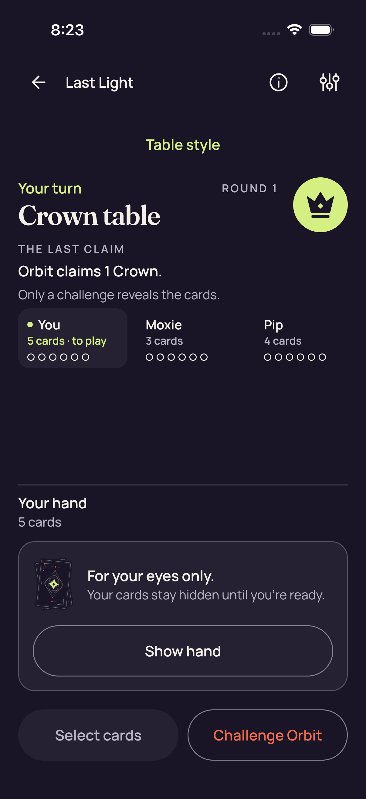
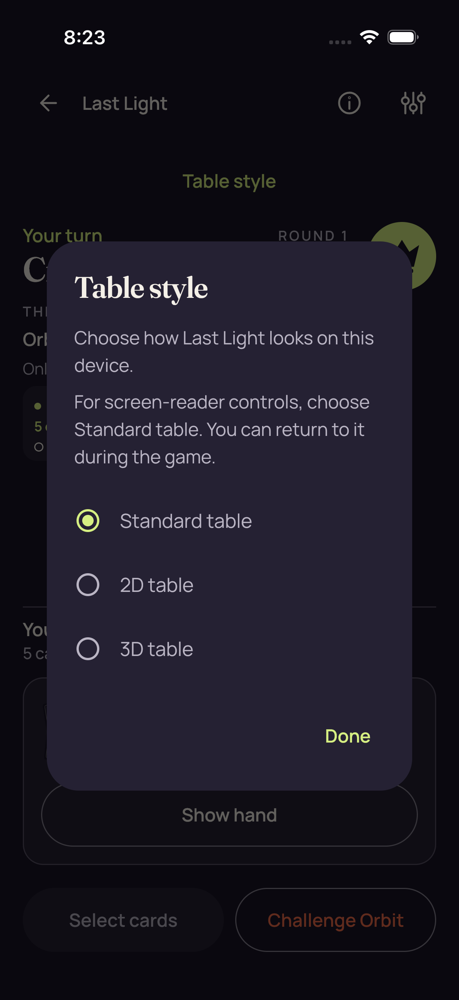

# iOS shipping pre-entry stills — run 34577058494

Source `4df1b6114aad70f6d84807ea956ec48832f361a5`, attempt 1. **The recorded run failed.**

[Gallery](../README.md) · [Capture manifest](manifest.json) · [Primary direct pixel review](provenance/review/pixel-o1-2d-shipping-review-v1.json)

These three original 1206 × 2622 PNGs show Home, the shared Standard table and the Table style picker **before native entry**. `/root/pixel_o1_2d` directly reviewed all three originals. `/root/ios_review` also directly reviewed these same originals; those corroborating reviews add no image identities.

**One test ran: 0 passed, 1 failed, 0 skipped.** Its reported failure is:

> failed: caught error: "Native entry must leave the shared game surface and picker."

First 2D `nativeReady` returned before the strict immediate game-table/picker absence assertion failed. The independent query-order review indicates the game table was absent while the retained options query still existed. No fresh post-entry picker query, persistence sample or native-ready image distinguishes persistent dialog, transient disposal or query-reference behavior.

The native-ready capture, both Standard returns, 3D entry and confirmed Leave were not reached. The test defer terminated the app before the recorded error. The 56.981-second test wall time is not startup or performance evidence.

[Original test summary](provenance/original-reports/test-summary.json) · [Original result](provenance/original-reports/result.json) · [Original stage exits](provenance/original-reports/stage-exits.json) · [Independent result and additional pixel review](provenance/review/shipping-original-result-and-png-independent-review-v1.json)

The collector reports a retained 193,117,842-byte archive and checks of all 1,448 members. These are existing collector assertions, preserved with their exact receipts. This gallery adds no full-archive audit, native acceptance or shipping qualification.

The attachment index contains 14 items: these three PNGs, ten opaque snapshot/event bodies and one recording. All have `isAssociatedWithFailure=false`. The other bodies and recording were not opened for this gallery. There is no failure-moment, native-ready, native gameplay, Standard-return, 3D-entry or Leave PNG in this indexed source.

## shipping-home

**Direct original-detail review — /root/pixel_o1_2d**

Shipping-run home before practice entry. Host, Join, practice and How to play are fully visible; the large cards are promotional artwork.

[Exact primary pixel record](provenance/review/pixel-o1-2d-shipping-review-v1.json) — JSON pointer `/source_captures/0`.

Original filename: `3BD52D0F-86F6-4F42-9BBC-FA7E62A65B8F.png`. Original ZIP member: `build/ci/ios/godot-shipping/attachments/3BD52D0F-86F6-4F42-9BBC-FA7E62A65B8F.png`.

Original capture timestamp: `1789114978.72` (`2026-09-11T08:22:58.720000+00:00`). Manifest entry/attachment ordinals: `0` / `12`.

[Additional direct review — /root/ios_review](provenance/review/shipping-original-result-and-png-independent-review-v1.json) — JSON pointer `/originalVisualReview/captures/0`. This corroborates the same original and adds no image identity.

Scope: The illustrated card faces are promotional artwork; this home capture does not show a private gameplay hand. Visible buttons and copy do not establish navigation, networking or interaction success.

## shipping-standard-before-entry

**Direct original-detail review — /root/pixel_o1_2d**

Standard table before native entry: Crown round 1, Orbit's one-Crown claim, and a fully visible covered five-card hand panel with Show hand. Select cards and Challenge Orbit fit.

[Exact primary pixel record](provenance/review/pixel-o1-2d-shipping-review-v1.json) — JSON pointer `/source_captures/1`.

Original filename: `2FAAE741-37A6-4D29-9C7E-4201E517D5F1.png`. Original ZIP member: `build/ci/ios/godot-shipping/attachments/2FAAE741-37A6-4D29-9C7E-4201E517D5F1.png`.

Original capture timestamp: `1789115004.144` (`2026-09-11T08:23:24.144000+00:00`). Manifest entry/attachment ordinals: `0` / `5`.

[Additional direct review — /root/ios_review](provenance/review/shipping-original-result-and-png-independent-review-v1.json) — JSON pointer `/originalVisualReview/captures/1`. This corroborates the same original and adds no image identity.

Scope: The concealed panel establishes only the visible pre-entry Standard hand presentation at this still. Muted styling alone does not establish the Select cards control's semantic enabled state. Only the displayed seat strip is covered; no claim is made about other seats, scrolling, offscreen content or interaction behavior.

## shipping-2d-picker

**Direct original-detail review — /root/pixel_o1_2d**

Pre-entry Table style picker with Standard selected, 2D and 3D options visible, and Done fully displayed. This still does not show a completed native transition.

[Exact primary pixel record](provenance/review/pixel-o1-2d-shipping-review-v1.json) — JSON pointer `/source_captures/2`.

Original filename: `4D5218A3-AD04-4980-8243-55591D7224BB.png`. Original ZIP member: `build/ci/ios/godot-shipping/attachments/4D5218A3-AD04-4980-8243-55591D7224BB.png`.

Original capture timestamp: `1789115006.93` (`2026-09-11T08:23:26.930000+00:00`). Manifest entry/attachment ordinals: `0` / `2`.

[Additional direct review — /root/ios_review](provenance/review/shipping-original-result-and-png-independent-review-v1.json) — JSON pointer `/originalVisualReview/captures/2`. This corroborates the same original and adds no image identity.

Scope: The original shipping-2d-picker name is preserved, but the actual selected option in these pixels is Standard table. The visible 2D and 3D choices do not establish native entry, native rendering, picker dismissal, return to Standard or Leave. The screen-reader sentence is displayed product copy; no accessibility execution was performed.

Three original pre-entry PNGs and named safe metadata; no log, opaque snapshot/event body, recording, app or source-tree payload.

Original image bytes, filenames, timestamps and source/review identities are preserved in the manifest. No new pixel view, media decode, download, archive audit or native test was performed by the gallery publisher.

