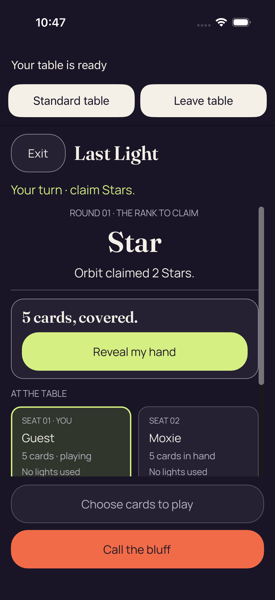

# iOS shipping guarded failure still — run 34589069960

Source `d9ae05003e931334e2304b89db926b67a76ab9e8`, attempt 1. **The recorded run failed.**

[Gallery](../README.md) · [Capture manifest](manifest.json) · [Primary direct pixel review](provenance/review/DIRECT-FAILURE-PIXEL-AND-QUERY-REVIEW-v1.json)

This original guarded failure screenshot was captured after first 2D readiness in the failed shipping test. Its direct pixel review and the sequential failure JSON retain separate scope.

**One test ran: 0 passed, 1 failed, 0 skipped.** Its reported failure is:

> failed: caught error: "Native entry must leave the shared game surface and picker."

The original failure JSON reports both fresh and retained picker queries existing and nonhittable. The screenshot shows the native 2D table with readiness and Standard/Leave controls, a covered hand, and no visible picker. These records do not prove picker absence, a completed route or the cause of the query result.

Both sequential samples report the shared game table absent and the native table present and hittable. Their approximately 2.49-second envelope is diagnostic collection time, not a continuous picker-lifetime or engine-latency measurement.

[Original guarded diagnostic JSON](provenance/original-reports/shipping-2d-native-entry-absence-diagnostic.json) · [Original test summary](provenance/original-reports/test-summary.json) · [Selected-member extraction receipt](provenance/extraction/SELECTED-DIAGNOSTICS-v1.json) · [Independent pixel and diagnostic review](provenance/review/selected-diagnostics-and-png-independent-review-v1.json)

Only this guarded failure PNG is added from the run. The selected members came from bounded HTTP ranges; no complete archive is retained and the API archive digest remains unverified. No opaque attachment body, recording, raw log or UI tree was opened for this gallery. Native/route acceptance, both Standard returns, 3D entry, confirmed Leave and shipping qualification remain unaccepted.

## shipping-2d-native-entry-absence-failure

**Direct original-detail review — /root/ios_fix**

iOS shipping diagnostic #42, 2D entry: the native table and Standard/Leave controls are visible with the hand covered. No picker is visible in this frame, while the paired diagnostic reports a nonhittable picker in both fresh and retained queries. The test failed its unchanged picker-absence assertion; shipping acceptance remains incomplete.

[Exact primary pixel record](provenance/review/DIRECT-FAILURE-PIXEL-AND-QUERY-REVIEW-v1.json) — JSON pointer `/directPixelReview`.

Original filename: `shipping-2d-native-entry-absence-failure.png`. Original ZIP member: `build/ci/ios/godot-shipping/attachments/9FFDE00C-DC18-4CF3-9C2F-B6F819C7F2FD.png`.

Original capture timestamp: `1789123642.029` (`2026-09-11T10:47:22.029000+00:00`). Manifest entry/attachment ordinals: `0` / `1`.

[Additional direct review — /root/ios_review](provenance/review/selected-diagnostics-and-png-independent-review-v1.json) — JSON pointer `/originalDirectPixelReview`. This corroborates the same original and adds no image identity.

Scope: This is the newly guarded failure capture before the original error is rethrown and deferred app termination runs. It does not establish continuity, later return/3D success, complete native qualification, physical accessibility or latency. No picker visible in one frame does not establish absence; paired query samples are sequential, not atomic or continuous persistence evidence. The manual failure-only attachment has isAssociatedWithFailure=false; the strict absence test remains failed.

One guarded failure PNG, five safe original JSON members, six selected-member receipts and exact primary/corroborating pixel records. The three other pre-entry PNGs, opaque bodies, recording, logs and source tree are outside this gallery selection.

Original image bytes, filenames, timestamps and source/review identities are preserved in the manifest. No new pixel view, media decode, download, archive audit or native test was performed by the gallery publisher.

