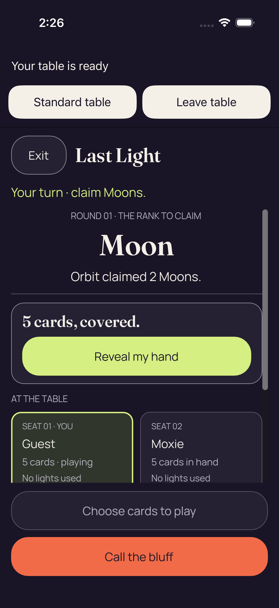
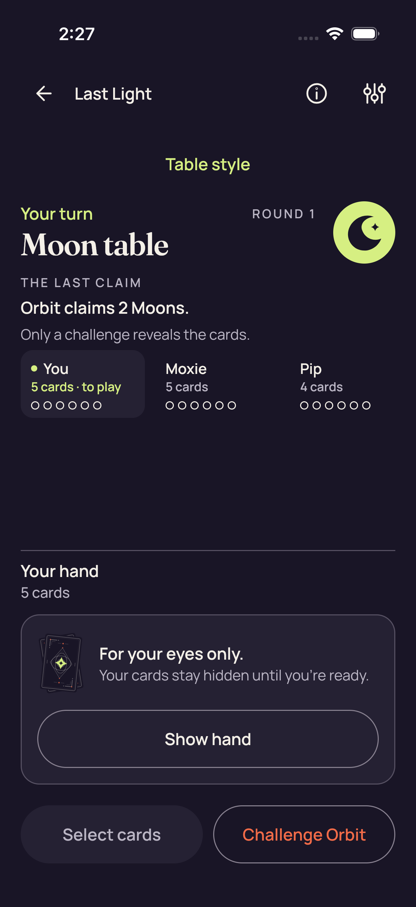
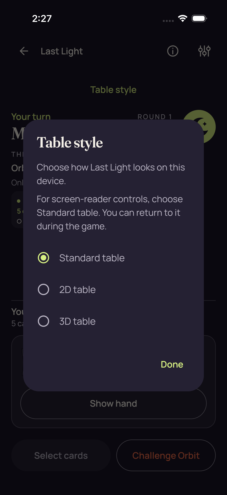
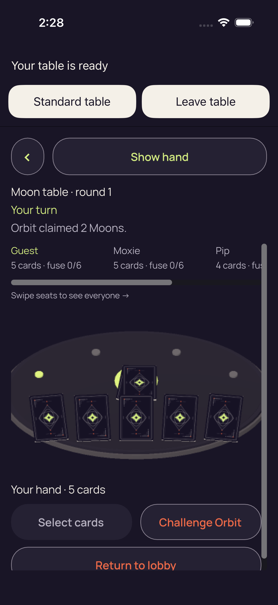
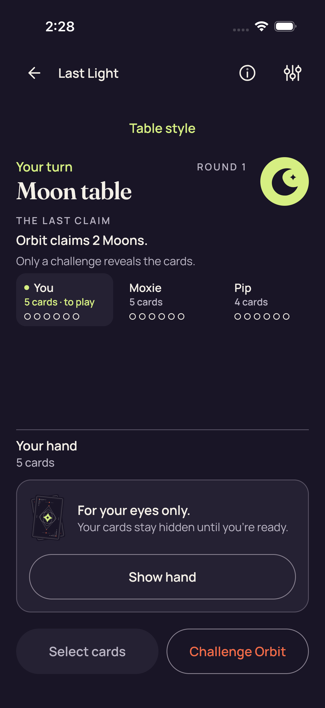

# iOS shipping-profile route — run 34607946293

Nine original **1206 × 2622** iPhone 17 Simulator captures preserve the shipping-profile route from source `5d6b1f868723109fde858279b11ae64b599f2bf1`, attempt **1**. The app configuration is **Debug**, platform **iphonesimulator**, architecture **arm64**.

[Gallery](../README.md) · [Capture manifest](manifest.json) · [Direct pixel review](provenance/review/pixel/review.json) · [Independent route review](provenance/review/original-route-independent-review-v1.json)

**One test passed; zero failed or skipped. All ten recorded stage exit codes are zero.**

`PartyDeckGodotShippingUITests/testShippingPickerOpensBothNativeTablesAndReturnsToStandard()`

The recorded sequence is Home → shared Standard table → 2D picker → native 2D ready → shared Standard return → 3D picker → native 3D ready → shared Standard return → confirmed shared Leave → Home.

Both returns exercise native **Standard**. Native **Leave** was checked as enabled/hittable; its action was not exercised. The final Leave used the shared confirmation.

The native stills show real 2D and 3D content without a visible shared-table or picker overlay. The 2D lower seat panel is clipped. The 3D lower Return to lobby control and right-seat details are only partly visible. Exact per-image observations and limits follow.

[Original test summary](provenance/original-reports/test-summary.json) · [Original result](provenance/original-reports/result.json) · [Original stage exits](provenance/original-reports/stage-exits.json) · [Original attachment manifest](provenance/original-reports/attachments/manifest.json)

The original result predates independent review and retains `native_pixel_review_complete=false` and `native_acceptance_or_shipping_promotion=false`. Its `named_ui_route_evidence_complete=true` records the passing named route. The linked independent reviews retain their own distinct scopes.

Package acceptance is not asserted by this gallery; no final package receipt is included.

This collection documents a shipping-profile **Debug Simulator** run. These stills do not establish complete lower-control reachability, full gameplay, continuous privacy, timing or performance, physical-device behavior, signing, store release or shipping promotion.

The collector and independent reviews retain the exact original archive/member hashes. Gallery preparation copies only the nine named PNGs and selected safe JSON receipts. It adds no archive audit, image transformation or new pixel view.

The following limits are quoted once from `/root/pixel_o1_2d` at collection level. In the native Leave observation, “here” refers to the two native-ready captures.

> Screenshots establish visible presentation only. Route/controller identity, same-session returns, readiness and final confirmed shared Leave are attributed to the separately pinned ios_review audit.

> The native Leave button is visible here; execution of that button is not established by these stills. The separately audited route used native Standard returns and final shared Leave.

> No accessibility, hit testing, scroll reachability, continuous privacy, network-authority behavior, physical-device/LAN behavior, performance/timing, device signing, store delivery or shipping promotion is established.

> No private card label values, invitation/admission/reconnect values, raw accessibility text trees or raw logs are reproduced in findings or captions.

> No historical PNG or prior run has been substituted; original image bytes were neither copied nor transformed for display.

> The image tool calls were serialized under the same live lease with before/after worker/lease identity checks, but ran outside the read worker's 128 MiB RLIMIT. No process-enforced memory claim is made for the image tool itself.

## shipping-home

**Direct original-detail review — /root/pixel_o1_2d**

Shipping-run home with Host, Join, practice and How to play fully visible. The large cards are promotional artwork.

[Exact pixel record](provenance/review/pixel/review.json) — JSON pointer `/source_captures/0`.

Original filename: `69EB7CE3-CF16-40E7-94EF-DC51D0293C67.png`. Human-readable source name: `shipping-home_0_51EE372E-52AA-42C2-B391-CC8DF123A04A.png`.

Original capture timestamp: `1789136772.233` (`2026-09-11T14:26:12.233+00:00`). Original ZIP member: `build/ci/ios/godot-shipping/attachments/69EB7CE3-CF16-40E7-94EF-DC51D0293C67.png`.

## shipping-standard-before-entry

**Direct original-detail review — /root/pixel_o1_2d**

Standard table before native entry with a fully visible covered five-card hand panel, Show hand and both bottom actions.

[Exact pixel record](provenance/review/pixel/review.json) — JSON pointer `/source_captures/1`.

Original filename: `E997FE6F-E746-4D9F-A02F-679CC2612530.png`. Human-readable source name: `shipping-standard-before-entry_0_9E48CADC-EB55-4A84-97FC-683085964023.png`.

Original capture timestamp: `1789136796.535` (`2026-09-11T14:26:36.535+00:00`). Original ZIP member: `build/ci/ios/godot-shipping/attachments/E997FE6F-E746-4D9F-A02F-679CC2612530.png`.

## shipping-2d-picker

**Direct original-detail review — /root/pixel_o1_2d**

Pre-entry Table style picker with Standard selected, both native options visible and Done fully displayed.

[Exact pixel record](provenance/review/pixel/review.json) — JSON pointer `/source_captures/2`.

Original filename: `9011F273-B533-4DFF-AD78-20D4EDB35852.png`. Human-readable source name: `shipping-2d-picker_0_8007A296-7C5A-4D95-BEDF-747E2795BCB2.png`.

Original capture timestamp: `1789136799.988` (`2026-09-11T14:26:39.988+00:00`). Original ZIP member: `build/ci/ios/godot-shipping/attachments/9011F273-B533-4DFF-AD78-20D4EDB35852.png`.

## shipping-2d-native-ready

**Direct original-detail review — /root/pixel_o1_2d**

Native 2D capture with substantive table content, covered hand and complete return, Leave, reveal and fixed action controls. Lower seat content extends beyond the visible scroll viewport.

[Exact pixel record](provenance/review/pixel/review.json) — JSON pointer `/source_captures/3`.

Original filename: `24F41BCD-635D-474C-A785-79F87865E7ED.png`. Human-readable source name: `shipping-2d-native-ready_0_70F55381-6337-4C60-99E8-D51164F83FCE.png`.

Original capture timestamp: `1789136806.706` (`2026-09-11T14:26:46.706+00:00`). Original ZIP member: `build/ci/ios/godot-shipping/attachments/24F41BCD-635D-474C-A785-79F87865E7ED.png`.

Scope: Lower seat content and offscreen scrolling are not visually covered. Readiness, hit testing and native/controller identity require the separate route/source evidence.

## shipping-2d-standard-return

**Direct original-detail review — /root/pixel_o1_2d**

Standard table after the 2D route, with the complete covered-hand panel, Show hand and both bottom actions visible.

[Exact pixel record](provenance/review/pixel/review.json) — JSON pointer `/source_captures/4`.

Original filename: `72B7AB4F-B69C-499A-BF63-DB38375E9C17.png`. Human-readable source name: `shipping-2d-standard-return_0_E7BEAE76-D8FA-468F-A11D-2B5DDCE00B16.png`.

Original capture timestamp: `1789136848.059` (`2026-09-11T14:27:28.059+00:00`). Original ZIP member: `build/ci/ios/godot-shipping/attachments/72B7AB4F-B69C-499A-BF63-DB38375E9C17.png`.

Scope: The image establishes the visible Standard return layout; same-session/controller identity is attributed to the separate route audit.

## shipping-3d-picker

**Direct original-detail review — /root/pixel_o1_2d**

Picker before the 3D route: Standard selected, both native options visible, and the full dialog including Done fits.

[Exact pixel record](provenance/review/pixel/review.json) — JSON pointer `/source_captures/5`.

Original filename: `83FDFFAA-E968-48D7-8729-BE82D51EE91C.png`. Human-readable source name: `shipping-3d-picker_0_C906A744-D78A-44C3-A11D-822B375BF413.png`.

Original capture timestamp: `1789136851.99` (`2026-09-11T14:27:31.990+00:00`). Original ZIP member: `build/ci/ios/godot-shipping/attachments/83FDFFAA-E968-48D7-8729-BE82D51EE91C.png`.

## shipping-3d-native-ready

**Direct original-detail review — /root/pixel_o1_2d**

Native 3D capture with rendered table geometry and face-down cards; Standard, Leave, Show hand and the primary action labels are visible. The lower Return to lobby control and right seat details are clipped at scroll viewport edges.

[Exact pixel record](provenance/review/pixel/review.json) — JSON pointer `/source_captures/6`.

Original filename: `ED435CCA-F5EF-4C4E-B89C-A006FB3F2FDF.png`. Human-readable source name: `shipping-3d-native-ready_0_D8C1BB86-3CCA-49C8-935C-4C2F0775B7E5.png`.

Original capture timestamp: `1789136881.283` (`2026-09-11T14:28:01.283+00:00`). Original ZIP member: `build/ci/ios/godot-shipping/attachments/ED435CCA-F5EF-4C4E-B89C-A006FB3F2FDF.png`.

Scope: The lower Return to lobby control is only partially visible in this still; its full bounds and access after scrolling are not established. The right seat's secondary text and other offscreen seat content are not fully covered. Pixels do not establish hit testing, native engine/controller identity or successful navigation.

## shipping-3d-standard-return

**Direct original-detail review — /root/pixel_o1_2d**

Standard table after the 3D route, with the covered-hand panel and complete Show hand and bottom actions visible.

[Exact pixel record](provenance/review/pixel/review.json) — JSON pointer `/source_captures/7`.

Original filename: `A418AA3C-813F-4EB8-A6AF-4BFD79782223.png`. Human-readable source name: `shipping-3d-standard-return_0_7A1F0F90-F379-4489-AA9A-D5259D0A97D9.png`.

Original capture timestamp: `1789136922.377` (`2026-09-11T14:28:42.377+00:00`). Original ZIP member: `build/ci/ios/godot-shipping/attachments/A418AA3C-813F-4EB8-A6AF-4BFD79782223.png`.

Scope: The separate route audit supplies the same-session/controller attribution; pixels alone do not.

## shipping-home-after-leave

**Direct original-detail review — /root/pixel_o1_2d**

Final Home capture after the route's shared Leave step, with the full home actions visible and no native or picker overlay.

[Exact pixel record](provenance/review/pixel/review.json) — JSON pointer `/source_captures/8`.

Original filename: `751C5819-B72B-4EF0-A9E3-4CED3820921C.png`. Human-readable source name: `shipping-home-after-leave_0_1B9E682F-81BA-4204-BF7D-66240445E6BE.png`.

Original capture timestamp: `1789136925.249` (`2026-09-11T14:28:45.249+00:00`). Original ZIP member: `build/ci/ios/godot-shipping/attachments/751C5819-B72B-4EF0-A9E3-4CED3820921C.png`.

Scope: The final shared Leave interaction is established by the separate route audit, not by this Home image alone.

Captures follow the source route order. The manifest preserves each exact attachment association and original result/review pointer; no original attachment-manifest ordinal is inferred.

Original filenames, image bytes, source timestamps, file modes and nanosecond modification times are preserved in the capture manifest and checksums.
