# Android debug font 2.0 video — 2d-split-entry

**80 decoded identities: 43 direct views and 37 reviewed byte matches.** [Read the shared scope and clock limits](../../README.md).

Original [2d-split-entry.mp4](../../runtime/videos/2d-split-entry.mp4): **292,322 bytes**, SHA-256 `24e634e7b34a182f9aaa6f59bf06b37aaca7c4a1c68d2c5aa0e6805d2ff8d853`. Frame images are decoded derivatives, not original CI PNG attachments.

Native fullscreen readiness appears at frame 33. Exit, Your turn · Crown table and the upper 5 cards, covered. panel are visible; only a sliver of the lime reveal control reaches the lower edge.

Frame 59 shows split entry: PartyDeck left with Closing table… and privacy cover; Android Display settings right. Frame 60 shows the left privacy cover alone.

From frame 68, Standard in the left pane shows public Crown round-1 header and Set the tone. The hand and gameplay actions are offscreen; their concealed state is not directly observed.

| Derivative at full original canvas | Frame / exact media timestamp | Review / SHA-256 |
| --- | --- | --- |
|  | `frame-000001.png` Index 0; PTS `0` × `1/90000` `0.000000` s; 1600 × 720 | Direct full-size decoded-frame view `11e486f4da3d81102493669f806587c95bb9c490c3163cc0643c55bb953efa4a` Landscape Table style dialog shows Standard table selected, full 2D table / 3D table labels and Done. Only small lower fragments of descriptive glyphs appear immediately beneath the title; the descriptive sentence is not legible in this scroll position. Dialog and dark surroundings show no private card faces. |
| <a href="frames/frame-000002.png">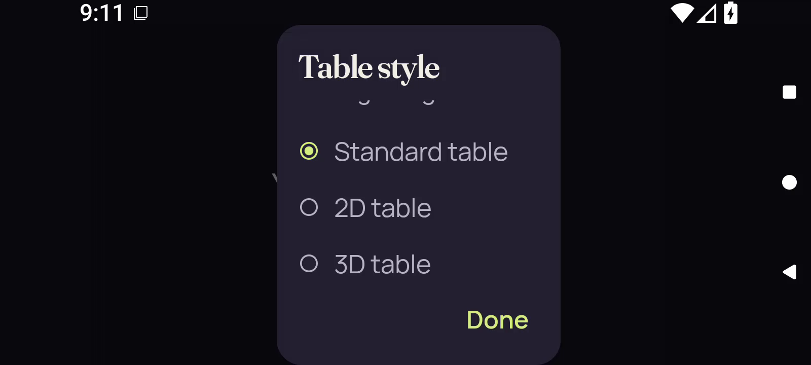</a> | `frame-000002.png` Index 1; PTS `41998` × `1/90000` `0.466644` s; 1600 × 720 | Direct full-size decoded-frame view `31a9db645bdd4fa0e3d8d2e67d07380913fbb29f8870d642167bfaa9e8280647` Landscape Table style dialog shows Standard table selected, full 2D table / 3D table labels and Done. Only small lower fragments of descriptive glyphs appear immediately beneath the title; the descriptive sentence is not legible in this scroll position. Dialog and dark surroundings show no private card faces. |
|  | `frame-000003.png` Index 2; PTS `133799` × `1/90000` `1.486656` s; 1600 × 720 | Direct full-size decoded-frame view `576a01a0e2c81f503bbc882d3c254eb890390c381509eb986cca65e1d944a6fb` Landscape Table style dialog shows Standard table selected, full 2D table / 3D table labels and Done. Only small lower fragments of descriptive glyphs appear immediately beneath the title; the descriptive sentence is not legible in this scroll position. Dialog and dark surroundings show no private card faces. |
| <a href="frames/frame-000004.png">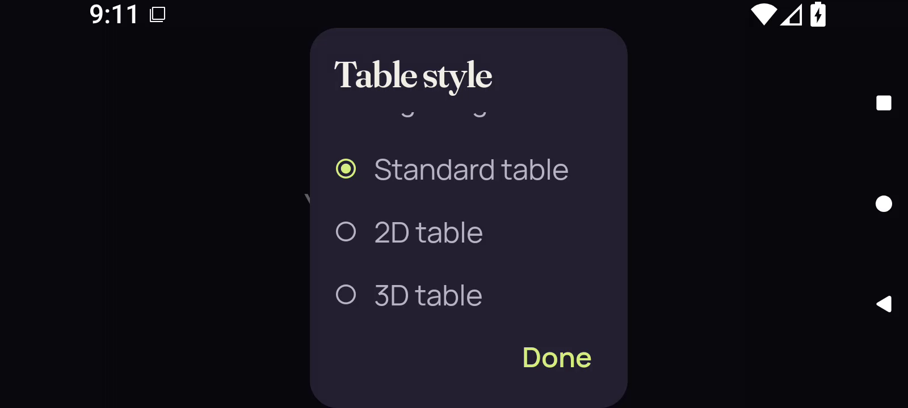</a> | `frame-000004.png` Index 3; PTS `144880` × `1/90000` `1.609778` s; 1600 × 720 | Direct full-size decoded-frame view `6624c16aa45b73fd461277c73cfbedc855cd153e7985f4697f1199400a6d5082` Landscape Table style dialog shows Standard table selected, full 2D table / 3D table labels and Done. Only small lower fragments of descriptive glyphs appear immediately beneath the title; the descriptive sentence is not legible in this scroll position. Dialog and dark surroundings show no private card faces. |
| <a href="frames/frame-000005.png">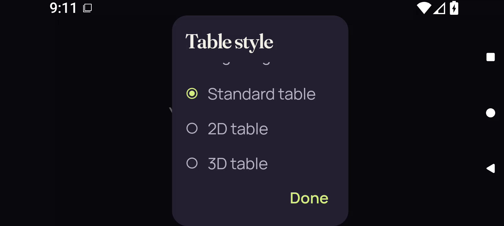</a> | `frame-000005.png` Index 4; PTS `208918` × `1/90000` `2.321311` s; 1600 × 720 | Direct full-size decoded-frame view `a399d8a640494ec457d1aeb9a389d19dc61c09aef03b523e67dccc4b8eb1ea23` Landscape Table style dialog shows Standard table selected, full 2D table / 3D table labels and Done. Only small lower fragments of descriptive glyphs appear immediately beneath the title; the descriptive sentence is not legible in this scroll position. Dialog and dark surroundings show no private card faces. |
|  | `frame-000006.png` Index 5; PTS `218589` × `1/90000` `2.428767` s; 1600 × 720 | Direct full-size decoded-frame view `7a8d8ebd257e6880408fa99e2fd01b5953f7c72ae54d812e253d3a9b40162fc8` Full landscape app area shows centered Your cards stay private text on a dark-purple cover, with Android status and side navigation. No private card faces are visible. |
|  | `frame-000007.png` Index 6; PTS `224613` × `1/90000` `2.495700` s; 1600 × 720 | Direct full-size decoded-frame view `3f3adc431db8faecb80b97134e00092bff66e6916f8906c8900eb793b744f861` Landscape privacy cover retains centered Your cards stay private text. Android status and side navigation remain visible; no private card faces are visible. |
|  | `frame-000008.png` Index 7; PTS `228796` × `1/90000` `2.542178` s; 1600 × 720 | Direct full-size decoded-frame view `5a4c16f6ff697e7309c2152ea068976b948b5c5e0db08d058f5bc5727a199433` Landscape privacy cover retains centered Your cards stay private text. Android status and side navigation remain visible; no private card faces are visible. |
|  | `frame-000009.png` Index 8; PTS `238297` × `1/90000` `2.647744` s; 1600 × 720 | Direct full-size decoded-frame view `39c6e4c31700202aca5dadf63a665c3aa01d730808fde5e0f1fe391045c137a0` Landscape privacy cover retains centered Your cards stay private text. Android status and side navigation remain visible; no private card faces are visible. |
|  | `frame-000010.png` Index 9; PTS `243808` × `1/90000` `2.708978` s; 1600 × 720 | Reviewed identical bytes; this identity not reopened Representative: [frame-000009.png](frames/frame-000009.png) `39c6e4c31700202aca5dadf63a665c3aa01d730808fde5e0f1fe391045c137a0` Landscape privacy cover retains centered Your cards stay private text. Android status and side navigation remain visible; no private card faces are visible. |
|  | `frame-000011.png` Index 10; PTS `258275` × `1/90000` `2.869722` s; 1600 × 720 | Direct full-size decoded-frame view `a93eebbabe9a7cabceb67cc4964fc22efbe4c40d06a9dbf9423378ebc0f1bea6` App area is blank dark purple while Android status and side navigation remain visible. No game details or private card faces are visible. |
|  | `frame-000012.png` Index 11; PTS `276297` × `1/90000` `3.069967` s; 1600 × 720 | Reviewed identical bytes; this identity not reopened Representative: [frame-000011.png](frames/frame-000011.png) `a93eebbabe9a7cabceb67cc4964fc22efbe4c40d06a9dbf9423378ebc0f1bea6` App area is blank dark purple while Android status and side navigation remain visible. No game details or private card faces are visible. |
|  | `frame-000013.png` Index 12; PTS `281450` × `1/90000` `3.127222` s; 1600 × 720 | Reviewed identical bytes; this identity not reopened Representative: [frame-000011.png](frames/frame-000011.png) `a93eebbabe9a7cabceb67cc4964fc22efbe4c40d06a9dbf9423378ebc0f1bea6` App area is blank dark purple while Android status and side navigation remain visible. No game details or private card faces are visible. |
|  | `frame-000014.png` Index 13; PTS `285354` × `1/90000` `3.170600` s; 1600 × 720 | Reviewed identical bytes; this identity not reopened Representative: [frame-000011.png](frames/frame-000011.png) `a93eebbabe9a7cabceb67cc4964fc22efbe4c40d06a9dbf9423378ebc0f1bea6` App area is blank dark purple while Android status and side navigation remain visible. No game details or private card faces are visible. |
|  | `frame-000015.png` Index 14; PTS `324819` × `1/90000` `3.609100` s; 1600 × 720 | Reviewed identical bytes; this identity not reopened Representative: [frame-000011.png](frames/frame-000011.png) `a93eebbabe9a7cabceb67cc4964fc22efbe4c40d06a9dbf9423378ebc0f1bea6` App area is blank dark purple while Android status and side navigation remain visible. No game details or private card faces are visible. |
|  | `frame-000016.png` Index 15; PTS `331263` × `1/90000` `3.680700` s; 1600 × 720 | Reviewed identical bytes; this identity not reopened Representative: [frame-000011.png](frames/frame-000011.png) `a93eebbabe9a7cabceb67cc4964fc22efbe4c40d06a9dbf9423378ebc0f1bea6` App area is blank dark purple while Android status and side navigation remain visible. No game details or private card faces are visible. |
|  | `frame-000017.png` Index 16; PTS `335982` × `1/90000` `3.733133` s; 1600 × 720 | Reviewed identical bytes; this identity not reopened Representative: [frame-000011.png](frames/frame-000011.png) `a93eebbabe9a7cabceb67cc4964fc22efbe4c40d06a9dbf9423378ebc0f1bea6` App area is blank dark purple while Android status and side navigation remain visible. No game details or private card faces are visible. |
|  | `frame-000018.png` Index 17; PTS `348556` × `1/90000` `3.872844` s; 1600 × 720 | Reviewed identical bytes; this identity not reopened Representative: [frame-000011.png](frames/frame-000011.png) `a93eebbabe9a7cabceb67cc4964fc22efbe4c40d06a9dbf9423378ebc0f1bea6` App area is blank dark purple while Android status and side navigation remain visible. No game details or private card faces are visible. |
|  | `frame-000019.png` Index 18; PTS `359523` × `1/90000` `3.994700` s; 1600 × 720 | Reviewed identical bytes; this identity not reopened Representative: [frame-000011.png](frames/frame-000011.png) `a93eebbabe9a7cabceb67cc4964fc22efbe4c40d06a9dbf9423378ebc0f1bea6` App area is blank dark purple while Android status and side navigation remain visible. No game details or private card faces are visible. |
|  | `frame-000020.png` Index 19; PTS `365890` × `1/90000` `4.065444` s; 1600 × 720 | Direct full-size decoded-frame view `1ebd8ae11c47c880bef16b4c38c221e96d19b24320975919d8638654321a32e5` Opening table... status and full Standard table / Leave table buttons sit above a centered Your cards stay private cover. No private card faces are visible. |
|  | `frame-000021.png` Index 20; PTS `371422` × `1/90000` `4.126911` s; 1600 × 720 | Direct full-size decoded-frame view `430f8fa56350d7f6c54646890360719928c78f0bceb2ca404374d2b2db5d53e2` Opening table... status and full Standard table / Leave table buttons sit above a centered Your cards stay private cover. No private card faces are visible. |
| <a href="frames/frame-000022.png">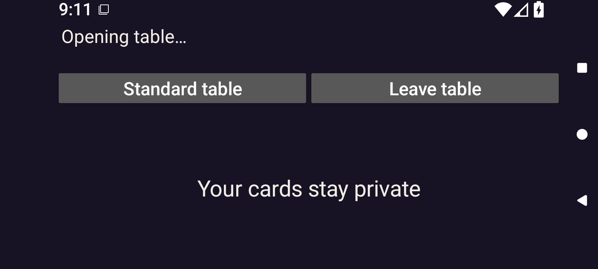</a> | `frame-000022.png` Index 21; PTS `378869` × `1/90000` `4.209656` s; 1600 × 720 | Direct full-size decoded-frame view `52544f517fc9a7e5bae9e35191f36d710cd804472e013e4e609088ff3ba1046e` Opening table... status, Standard table / Leave table host buttons, and centered Your cards stay private cover persist. No private card faces are visible. |
|  | `frame-000023.png` Index 22; PTS `384322` × `1/90000` `4.270244` s; 1600 × 720 | Direct full-size decoded-frame view `de9163754368afedf8fa08b661667dfbf91cefa410595281ba1937870c378f8d` Opening table... status, Standard table / Leave table host buttons, and centered Your cards stay private cover persist. No private card faces are visible. |
|  | `frame-000024.png` Index 23; PTS `393127` × `1/90000` `4.368078` s; 1600 × 720 | Reviewed identical bytes; this identity not reopened Representative: [frame-000023.png](frames/frame-000023.png) `de9163754368afedf8fa08b661667dfbf91cefa410595281ba1937870c378f8d` Opening table... status, Standard table / Leave table host buttons, and centered Your cards stay private cover persist. No private card faces are visible. |
|  | `frame-000025.png` Index 24; PTS `402648` × `1/90000` `4.473867` s; 1600 × 720 | Reviewed identical bytes; this identity not reopened Representative: [frame-000023.png](frames/frame-000023.png) `de9163754368afedf8fa08b661667dfbf91cefa410595281ba1937870c378f8d` Opening table... status, Standard table / Leave table host buttons, and centered Your cards stay private cover persist. No private card faces are visible. |
|  | `frame-000026.png` Index 25; PTS `408561` × `1/90000` `4.539567` s; 1600 × 720 | Reviewed identical bytes; this identity not reopened Representative: [frame-000023.png](frames/frame-000023.png) `de9163754368afedf8fa08b661667dfbf91cefa410595281ba1937870c378f8d` Opening table... status, Standard table / Leave table host buttons, and centered Your cards stay private cover persist. No private card faces are visible. |
|  | `frame-000027.png` Index 26; PTS `470764` × `1/90000` `5.230711` s; 1600 × 720 | Reviewed identical bytes; this identity not reopened Representative: [frame-000023.png](frames/frame-000023.png) `de9163754368afedf8fa08b661667dfbf91cefa410595281ba1937870c378f8d` Opening table... status, Standard table / Leave table host buttons, and centered Your cards stay private cover persist. No private card faces are visible. |
|  | `frame-000028.png` Index 27; PTS `476616` × `1/90000` `5.295733` s; 1600 × 720 | Reviewed identical bytes; this identity not reopened Representative: [frame-000023.png](frames/frame-000023.png) `de9163754368afedf8fa08b661667dfbf91cefa410595281ba1937870c378f8d` Opening table... status, Standard table / Leave table host buttons, and centered Your cards stay private cover persist. No private card faces are visible. |
|  | `frame-000029.png` Index 28; PTS `502326` × `1/90000` `5.581400` s; 1600 × 720 | Reviewed identical bytes; this identity not reopened Representative: [frame-000023.png](frames/frame-000023.png) `de9163754368afedf8fa08b661667dfbf91cefa410595281ba1937870c378f8d` Opening table... status, Standard table / Leave table host buttons, and centered Your cards stay private cover persist. No private card faces are visible. |
|  | `frame-000030.png` Index 29; PTS `510709` × `1/90000` `5.674544` s; 1600 × 720 | Reviewed identical bytes; this identity not reopened Representative: [frame-000023.png](frames/frame-000023.png) `de9163754368afedf8fa08b661667dfbf91cefa410595281ba1937870c378f8d` Opening table... status, Standard table / Leave table host buttons, and centered Your cards stay private cover persist. No private card faces are visible. |
|  | `frame-000031.png` Index 30; PTS `522684` × `1/90000` `5.807600` s; 1600 × 720 | Direct full-size decoded-frame view `0350b2ba5cff26fabb29f8bd92de881bfc7384041a37029ae071f82cacbbed22` Top status and centered native cover both read Your cards stay private; host Standard table / Leave table actions are complete. No private card faces are visible. |
| <a href="frames/frame-000032.png">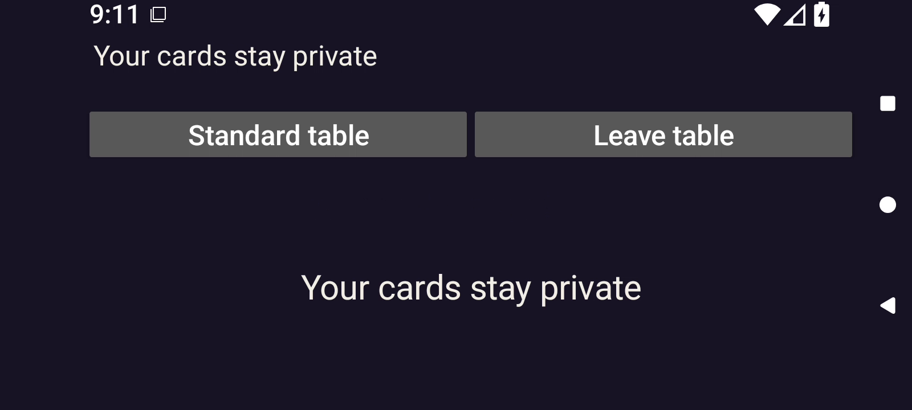</a> | `frame-000032.png` Index 31; PTS `529470` × `1/90000` `5.883000` s; 1600 × 720 | Direct full-size decoded-frame view `ac46b3978002ffe2f57194684d1c1f8031354ce6337fe202e21fafe3d5d67550` Top status and centered native cover both read Your cards stay private; host Standard table / Leave table actions are complete. No private card faces are visible. |
|  | `frame-000033.png` Index 32; PTS `534931` × `1/90000` `5.943678` s; 1600 × 720 | Direct full-size decoded-frame view `179e8aa4f775b12875dd3d66a6799b8424d1055fa6697dcdca65216c7065f20f` Table ready. and host actions appear above a full Exit button, Your turn · Crown table, and the upper portion of a 5 cards, covered. panel. A vertical scroll thumb is visible; only the very top of the lime reveal action reaches the lower clipping boundary. No private card faces are visible. |
|  | `frame-000034.png` Index 33; PTS `627113` × `1/90000` `6.967922` s; 1600 × 720 | Direct full-size decoded-frame view `f9a660b4551c02eb49e9a4bbe74392ffc7cae914e39a793d0a58bf6a6c0e4f8d` Table ready. and host actions appear above a full Exit button, Your turn · Crown table, and the upper portion of a 5 cards, covered. panel. A vertical scroll thumb is visible; only the very top of the lime reveal action reaches the lower clipping boundary. No private card faces are visible. |
|  | `frame-000035.png` Index 34; PTS `632643` × `1/90000` `7.029367` s; 1600 × 720 | Direct full-size decoded-frame view `c02c48e297602caa5f304d6741f79feaaa69a8aea5b3495b43c52c24b4baf09c` The native 2D landscape pane remains Table ready. with full host Standard table / Leave table controls, full Exit, Your turn · Crown table, and the upper 5 cards, covered. panel. A scroll thumb is visible; only the top sliver of the lime reveal control reaches the lower clipping boundary. No private card faces are visible. |
|  | `frame-000036.png` Index 35; PTS `721112` × `1/90000` `8.012356` s; 1600 × 720 | Direct full-size decoded-frame view `05d85ad15ad828fd607994c29f003ad31f8b993e0a6324aa4f947bd8086796e1` The native 2D landscape pane remains Table ready. with full host Standard table / Leave table controls, full Exit, Your turn · Crown table, and the upper 5 cards, covered. panel. A scroll thumb is visible; only the top sliver of the lime reveal control reaches the lower clipping boundary. No private card faces are visible. |
|  | `frame-000037.png` Index 36; PTS `726097` × `1/90000` `8.067744` s; 1600 × 720 | Reviewed identical bytes; this identity not reopened Representative: [frame-000036.png](frames/frame-000036.png) `05d85ad15ad828fd607994c29f003ad31f8b993e0a6324aa4f947bd8086796e1` The native 2D landscape pane remains Table ready. with full host Standard table / Leave table controls, full Exit, Your turn · Crown table, and the upper 5 cards, covered. panel. A scroll thumb is visible; only the top sliver of the lime reveal control reaches the lower clipping boundary. No private card faces are visible. |
|  | `frame-000038.png` Index 37; PTS `822242` × `1/90000` `9.136022` s; 1600 × 720 | Reviewed identical bytes; this identity not reopened Representative: [frame-000036.png](frames/frame-000036.png) `05d85ad15ad828fd607994c29f003ad31f8b993e0a6324aa4f947bd8086796e1` The native 2D landscape pane remains Table ready. with full host Standard table / Leave table controls, full Exit, Your turn · Crown table, and the upper 5 cards, covered. panel. A scroll thumb is visible; only the top sliver of the lime reveal control reaches the lower clipping boundary. No private card faces are visible. |
|  | `frame-000039.png` Index 38; PTS `826195` × `1/90000` `9.179944` s; 1600 × 720 | Reviewed identical bytes; this identity not reopened Representative: [frame-000036.png](frames/frame-000036.png) `05d85ad15ad828fd607994c29f003ad31f8b993e0a6324aa4f947bd8086796e1` The native 2D landscape pane remains Table ready. with full host Standard table / Leave table controls, full Exit, Your turn · Crown table, and the upper 5 cards, covered. panel. A scroll thumb is visible; only the top sliver of the lime reveal control reaches the lower clipping boundary. No private card faces are visible. |
|  | `frame-000040.png` Index 39; PTS `914860` × `1/90000` `10.165111` s; 1600 × 720 | Reviewed identical bytes; this identity not reopened Representative: [frame-000036.png](frames/frame-000036.png) `05d85ad15ad828fd607994c29f003ad31f8b993e0a6324aa4f947bd8086796e1` The native 2D landscape pane remains Table ready. with full host Standard table / Leave table controls, full Exit, Your turn · Crown table, and the upper 5 cards, covered. panel. A scroll thumb is visible; only the top sliver of the lime reveal control reaches the lower clipping boundary. No private card faces are visible. |
|  | `frame-000041.png` Index 40; PTS `919867` × `1/90000` `10.220744` s; 1600 × 720 | Reviewed identical bytes; this identity not reopened Representative: [frame-000036.png](frames/frame-000036.png) `05d85ad15ad828fd607994c29f003ad31f8b993e0a6324aa4f947bd8086796e1` The native 2D landscape pane remains Table ready. with full host Standard table / Leave table controls, full Exit, Your turn · Crown table, and the upper 5 cards, covered. panel. A scroll thumb is visible; only the top sliver of the lime reveal control reaches the lower clipping boundary. No private card faces are visible. |
|  | `frame-000042.png` Index 41; PTS `1051882` × `1/90000` `11.687578` s; 1600 × 720 | Reviewed identical bytes; this identity not reopened Representative: [frame-000036.png](frames/frame-000036.png) `05d85ad15ad828fd607994c29f003ad31f8b993e0a6324aa4f947bd8086796e1` The native 2D landscape pane remains Table ready. with full host Standard table / Leave table controls, full Exit, Your turn · Crown table, and the upper 5 cards, covered. panel. A scroll thumb is visible; only the top sliver of the lime reveal control reaches the lower clipping boundary. No private card faces are visible. |
|  | `frame-000043.png` Index 42; PTS `1055382` × `1/90000` `11.726467` s; 1600 × 720 | Reviewed identical bytes; this identity not reopened Representative: [frame-000036.png](frames/frame-000036.png) `05d85ad15ad828fd607994c29f003ad31f8b993e0a6324aa4f947bd8086796e1` The native 2D landscape pane remains Table ready. with full host Standard table / Leave table controls, full Exit, Your turn · Crown table, and the upper 5 cards, covered. panel. A scroll thumb is visible; only the top sliver of the lime reveal control reaches the lower clipping boundary. No private card faces are visible. |
|  | `frame-000044.png` Index 43; PTS `1061013` × `1/90000` `11.789033` s; 1600 × 720 | Reviewed identical bytes; this identity not reopened Representative: [frame-000036.png](frames/frame-000036.png) `05d85ad15ad828fd607994c29f003ad31f8b993e0a6324aa4f947bd8086796e1` The native 2D landscape pane remains Table ready. with full host Standard table / Leave table controls, full Exit, Your turn · Crown table, and the upper 5 cards, covered. panel. A scroll thumb is visible; only the top sliver of the lime reveal control reaches the lower clipping boundary. No private card faces are visible. |
|  | `frame-000045.png` Index 44; PTS `1066572` × `1/90000` `11.850800` s; 1600 × 720 | Reviewed identical bytes; this identity not reopened Representative: [frame-000036.png](frames/frame-000036.png) `05d85ad15ad828fd607994c29f003ad31f8b993e0a6324aa4f947bd8086796e1` The native 2D landscape pane remains Table ready. with full host Standard table / Leave table controls, full Exit, Your turn · Crown table, and the upper 5 cards, covered. panel. A scroll thumb is visible; only the top sliver of the lime reveal control reaches the lower clipping boundary. No private card faces are visible. |
|  | `frame-000046.png` Index 45; PTS `1072165` × `1/90000` `11.912944` s; 1600 × 720 | Reviewed identical bytes; this identity not reopened Representative: [frame-000036.png](frames/frame-000036.png) `05d85ad15ad828fd607994c29f003ad31f8b993e0a6324aa4f947bd8086796e1` The native 2D landscape pane remains Table ready. with full host Standard table / Leave table controls, full Exit, Your turn · Crown table, and the upper 5 cards, covered. panel. A scroll thumb is visible; only the top sliver of the lime reveal control reaches the lower clipping boundary. No private card faces are visible. |
| <a href="frames/frame-000047.png">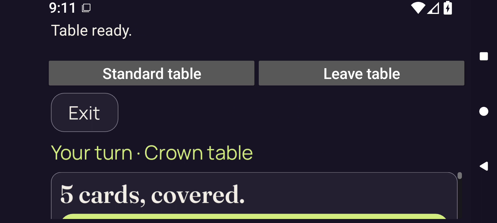</a> | `frame-000047.png` Index 46; PTS `1078363` × `1/90000` `11.981811` s; 1600 × 720 | Direct full-size decoded-frame view `a708ff12444d85da31cf98e82cb137a9cc809d1d2a8570a81d31e51519c91c58` The native 2D landscape pane remains Table ready. with full host Standard table / Leave table controls, full Exit, Your turn · Crown table, and the upper 5 cards, covered. panel. A scroll thumb is visible; only the top sliver of the lime reveal control reaches the lower clipping boundary. No private card faces are visible. |
| <a href="frames/frame-000048.png">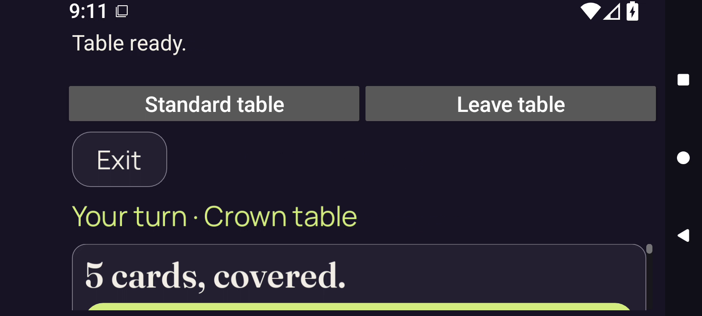</a> | `frame-000048.png` Index 47; PTS `1083836` × `1/90000` `12.042622` s; 1600 × 720 | Direct full-size decoded-frame view `c81ac5e7d99bc152ab1d6b0e4f6cf1ea0c1adcff2f27dfa674d1fa27b1277dc6` The native 2D landscape pane remains Table ready. with full host Standard table / Leave table controls, full Exit, Your turn · Crown table, and the upper 5 cards, covered. panel. A scroll thumb is visible; only the top sliver of the lime reveal control reaches the lower clipping boundary. No private card faces are visible. |
|  | `frame-000049.png` Index 48; PTS `1088470` × `1/90000` `12.094111` s; 1600 × 720 | Direct full-size decoded-frame view `72588ddf11d1978ae117d62c461165ed9b6d861da077f202da9f7cfe69f039fd` The native 2D landscape pane remains Table ready. with full host Standard table / Leave table controls, full Exit, Your turn · Crown table, and the upper 5 cards, covered. panel. A scroll thumb is visible; only the top sliver of the lime reveal control reaches the lower clipping boundary. No private card faces are visible. |
|  | `frame-000050.png` Index 49; PTS `1094356` × `1/90000` `12.159511` s; 1600 × 720 | Direct full-size decoded-frame view `1f72d604d549324b832ed73d0c888ed649641883d627a52ceb69f2646a7b1299` The native 2D landscape pane remains Table ready. with full host Standard table / Leave table controls, full Exit, Your turn · Crown table, and the upper 5 cards, covered. panel. A scroll thumb is visible; only the top sliver of the lime reveal control reaches the lower clipping boundary. No private card faces are visible. |
|  | `frame-000051.png` Index 50; PTS `1100549` × `1/90000` `12.228322` s; 1600 × 720 | Reviewed identical bytes; this identity not reopened Representative: [frame-000050.png](frames/frame-000050.png) `1f72d604d549324b832ed73d0c888ed649641883d627a52ceb69f2646a7b1299` The native 2D landscape pane remains Table ready. with full host Standard table / Leave table controls, full Exit, Your turn · Crown table, and the upper 5 cards, covered. panel. A scroll thumb is visible; only the top sliver of the lime reveal control reaches the lower clipping boundary. No private card faces are visible. |
|  | `frame-000052.png` Index 51; PTS `1109766` × `1/90000` `12.330733` s; 1600 × 720 | Reviewed identical bytes; this identity not reopened Representative: [frame-000050.png](frames/frame-000050.png) `1f72d604d549324b832ed73d0c888ed649641883d627a52ceb69f2646a7b1299` The native 2D landscape pane remains Table ready. with full host Standard table / Leave table controls, full Exit, Your turn · Crown table, and the upper 5 cards, covered. panel. A scroll thumb is visible; only the top sliver of the lime reveal control reaches the lower clipping boundary. No private card faces are visible. |
|  | `frame-000053.png` Index 52; PTS `1117561` × `1/90000` `12.417344` s; 1600 × 720 | Reviewed identical bytes; this identity not reopened Representative: [frame-000050.png](frames/frame-000050.png) `1f72d604d549324b832ed73d0c888ed649641883d627a52ceb69f2646a7b1299` The native 2D landscape pane remains Table ready. with full host Standard table / Leave table controls, full Exit, Your turn · Crown table, and the upper 5 cards, covered. panel. A scroll thumb is visible; only the top sliver of the lime reveal control reaches the lower clipping boundary. No private card faces are visible. |
| <a href="frames/frame-000054.png">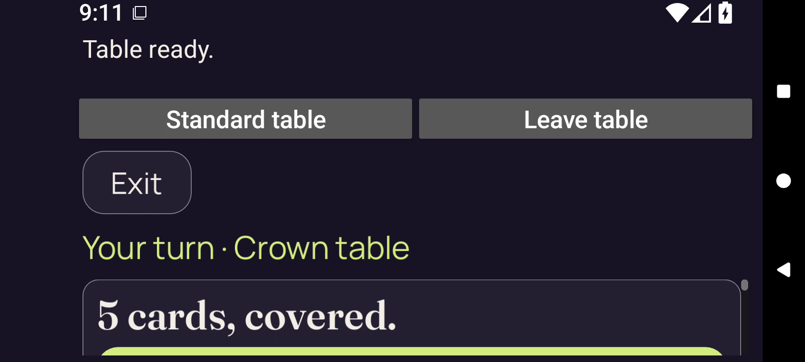</a> | `frame-000054.png` Index 53; PTS `1130644` × `1/90000` `12.562711` s; 1600 × 720 | Reviewed identical bytes; this identity not reopened Representative: [frame-000050.png](frames/frame-000050.png) `1f72d604d549324b832ed73d0c888ed649641883d627a52ceb69f2646a7b1299` The native 2D landscape pane remains Table ready. with full host Standard table / Leave table controls, full Exit, Your turn · Crown table, and the upper 5 cards, covered. panel. A scroll thumb is visible; only the top sliver of the lime reveal control reaches the lower clipping boundary. No private card faces are visible. |
|  | `frame-000055.png` Index 54; PTS `1141144` × `1/90000` `12.679378` s; 1600 × 720 | Reviewed identical bytes; this identity not reopened Representative: [frame-000050.png](frames/frame-000050.png) `1f72d604d549324b832ed73d0c888ed649641883d627a52ceb69f2646a7b1299` The native 2D landscape pane remains Table ready. with full host Standard table / Leave table controls, full Exit, Your turn · Crown table, and the upper 5 cards, covered. panel. A scroll thumb is visible; only the top sliver of the lime reveal control reaches the lower clipping boundary. No private card faces are visible. |
|  | `frame-000056.png` Index 55; PTS `1147558` × `1/90000` `12.750644` s; 1600 × 720 | Reviewed identical bytes; this identity not reopened Representative: [frame-000050.png](frames/frame-000050.png) `1f72d604d549324b832ed73d0c888ed649641883d627a52ceb69f2646a7b1299` The native 2D landscape pane remains Table ready. with full host Standard table / Leave table controls, full Exit, Your turn · Crown table, and the upper 5 cards, covered. panel. A scroll thumb is visible; only the top sliver of the lime reveal control reaches the lower clipping boundary. No private card faces are visible. |
| <a href="frames/frame-000057.png">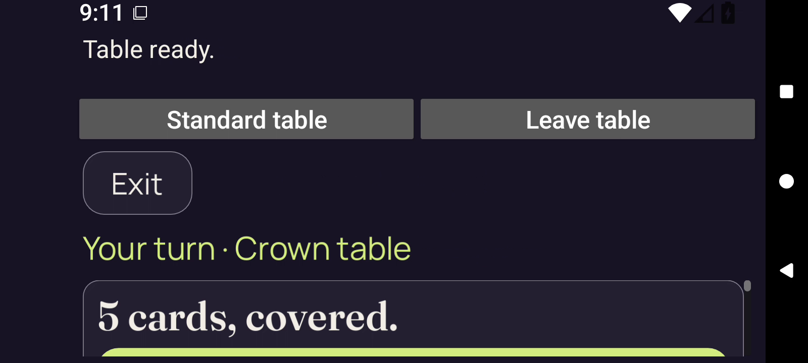</a> | `frame-000057.png` Index 56; PTS `1157843` × `1/90000` `12.864922` s; 1600 × 720 | Direct full-size decoded-frame view `a53c8498efd3d03db4300bf3daf6a36a403393254ad7d807cc9bfb85439029ac` The native 2D pane remains fullscreen and covered: Table ready., full host actions/Exit, Your turn · Crown table, and 5 cards, covered. at the scroll boundary. Status icons change contrast. No private card faces are visible. |
| <a href="frames/frame-000058.png">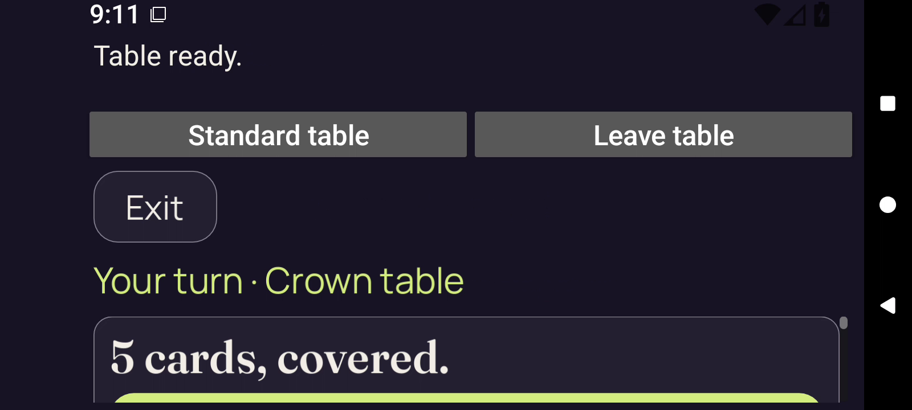</a> | `frame-000058.png` Index 57; PTS `1162292` × `1/90000` `12.914356` s; 1600 × 720 | Direct full-size decoded-frame view `117f776cb10fba1094cafd2d9ddf8e906d4f92ea84a85b403221e163253a88e9` The native 2D pane remains fullscreen and covered: Table ready., full host actions/Exit, Your turn · Crown table, and 5 cards, covered. at the scroll boundary. Status icons change contrast. No private card faces are visible. |
| <a href="frames/frame-000059.png">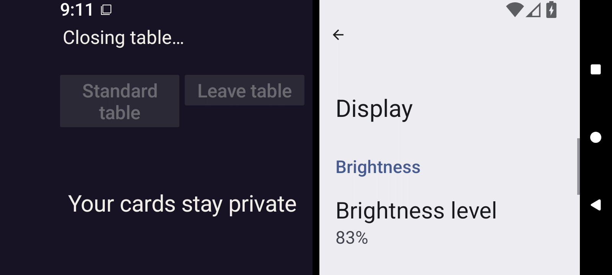</a> | `frame-000059.png` Index 58; PTS `1171884` × `1/90000` `13.020933` s; 1600 × 720 | Direct full-size decoded-frame view `79282fd7deaae03e8fb1bb339e6172d57e1969c9e698e9ec1f801849d7c30489` The first reviewed decoded split frame shows PartyDeck at left with Closing table..., dimmed host controls, and Your cards stay private covering the game. Android Display settings appears at right, showing Brightness level 83%. No private card faces are visible in either pane. |
|  | `frame-000060.png` Index 59; PTS `1179026` × `1/90000` `13.100289` s; 1600 × 720 | Direct full-size decoded-frame view `a3528e2c3a72297379a28ef61b225d93c55198847d197c6aed1fd67ad3a030fb` PartyDeck left pane is a dark cover with centered Your cards stay private; its closing status and host controls are gone. Android Display settings remains in the right pane. No private card faces are visible. |
| <a href="frames/frame-000061.png">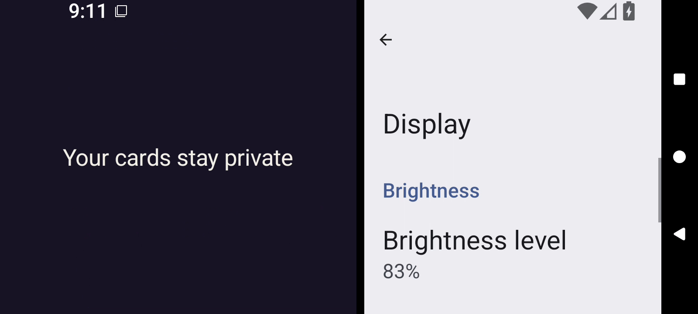</a> | `frame-000061.png` Index 60; PTS `1184774` × `1/90000` `13.164156` s; 1600 × 720 | Direct full-size decoded-frame view `3f1748c168b39bd2647ff0e034ad26f2423721310fd17bffb377ae73f633877c` PartyDeck left pane is a dark cover with centered Your cards stay private; its closing status and host controls are gone. Android Display settings remains in the right pane. No private card faces are visible. |
|  | `frame-000062.png` Index 61; PTS `1189654` × `1/90000` `13.218378` s; 1600 × 720 | Direct full-size decoded-frame view `f40f31fba4d82a9a2ad0791b017a5928bc66e5c4b7c624daa6f7cb5da60359d7` PartyDeck left pane is a dark cover with centered Your cards stay private; its closing status and host controls are gone. Android Display settings remains in the right pane. No private card faces are visible. |
| <a href="frames/frame-000063.png">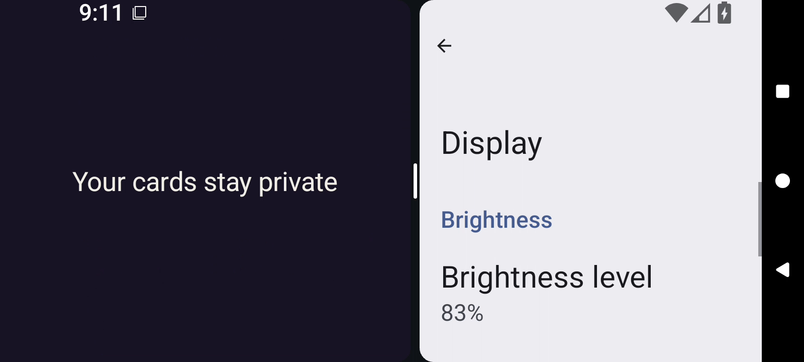</a> | `frame-000063.png` Index 62; PTS `1196863` × `1/90000` `13.298478` s; 1600 × 720 | Direct full-size decoded-frame view `5673840dc769fe0b94c8cde2cf3d26b91e1be6a4962f9f7e98da0edcae3bbdcd` The two app panes now have rounded inner edges and a visible center divider handle. PartyDeck remains covered by Your cards stay private at left; Display settings remains at right. No private card faces are visible. |
|  | `frame-000064.png` Index 63; PTS `1202274` × `1/90000` `13.358600` s; 1600 × 720 | Direct full-size decoded-frame view `b2a404f5831ecd5adb11014db93655bc7cac15f6082d1a31bd61cc88d0fc4e48` The two app panes now have rounded inner edges and a visible center divider handle. PartyDeck remains covered by Your cards stay private at left; Display settings remains at right. No private card faces are visible. |
|  | `frame-000065.png` Index 64; PTS `1209182` × `1/90000` `13.435356` s; 1600 × 720 | Reviewed identical bytes; this identity not reopened Representative: [frame-000064.png](frames/frame-000064.png) `b2a404f5831ecd5adb11014db93655bc7cac15f6082d1a31bd61cc88d0fc4e48` The two app panes now have rounded inner edges and a visible center divider handle. PartyDeck remains covered by Your cards stay private at left; Display settings remains at right. No private card faces are visible. |
|  | `frame-000066.png` Index 65; PTS `1214753` × `1/90000` `13.497256` s; 1600 × 720 | Reviewed identical bytes; this identity not reopened Representative: [frame-000064.png](frames/frame-000064.png) `b2a404f5831ecd5adb11014db93655bc7cac15f6082d1a31bd61cc88d0fc4e48` The two app panes now have rounded inner edges and a visible center divider handle. PartyDeck remains covered by Your cards stay private at left; Display settings remains at right. No private card faces are visible. |
|  | `frame-000067.png` Index 66; PTS `1221210` × `1/90000` `13.569000` s; 1600 × 720 | Reviewed identical bytes; this identity not reopened Representative: [frame-000064.png](frames/frame-000064.png) `b2a404f5831ecd5adb11014db93655bc7cac15f6082d1a31bd61cc88d0fc4e48` The two app panes now have rounded inner edges and a visible center divider handle. PartyDeck remains covered by Your cards stay private at left; Display settings remains at right. No private card faces are visible. |
| <a href="frames/frame-000068.png">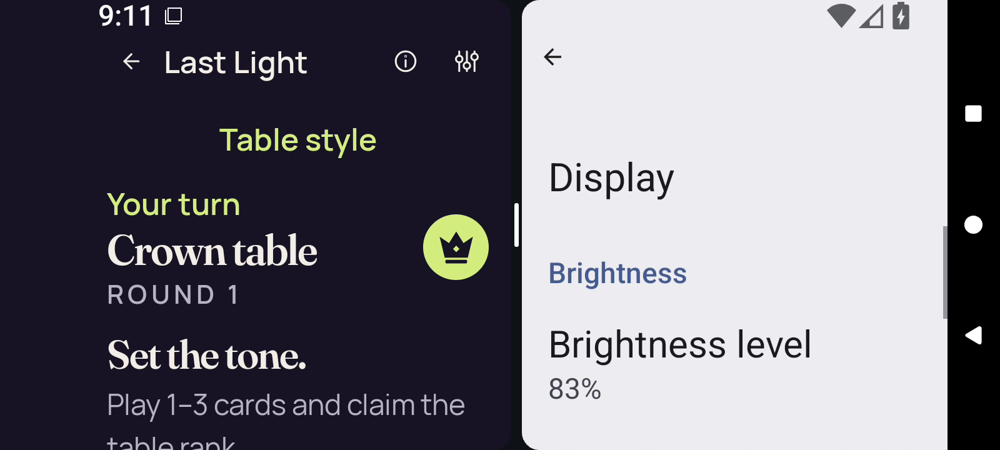</a> | `frame-000068.png` Index 67; PTS `1228633` × `1/90000` `13.651478` s; 1600 × 720 | Direct full-size decoded-frame view `20ff243649907cf8ed63f168e535c624f149540a22f1ea8b82530daa294bd78a` PartyDeck left pane returns to the Standard layout with Last Light, Table style, Your turn, Crown table / ROUND 1, Set the tone., and the start of Play 1–3 cards and claim the table rank. Lower instructions are clipped and the hand and gameplay actions are below the viewport. Display settings remains visible at right. No private card faces are visible; concealed hand state is not directly observable because the hand area is offscreen. |
|  | `frame-000069.png` Index 68; PTS `1233483` × `1/90000` `13.705367` s; 1600 × 720 | Direct full-size decoded-frame view `5ce11748fb17b10bcc9e06520d780f0dc14bfe1a3bdaebebc2b35e58d65bf958` PartyDeck left pane returns to the Standard layout with Last Light, Table style, Your turn, Crown table / ROUND 1, Set the tone., and the start of Play 1–3 cards and claim the table rank. Lower instructions are clipped and the hand and gameplay actions are below the viewport. Display settings remains visible at right. No private card faces are visible; concealed hand state is not directly observable because the hand area is offscreen. |
|  | `frame-000070.png` Index 69; PTS `1237886` × `1/90000` `13.754289` s; 1600 × 720 | Direct full-size decoded-frame view `220f833d52086f87360b7e75c23a0d475b667e0df399f91d194eb39aa523ef8b` PartyDeck left pane returns to the Standard layout with Last Light, Table style, Your turn, Crown table / ROUND 1, Set the tone., and the start of Play 1–3 cards and claim the table rank. Lower instructions are clipped and the hand and gameplay actions are below the viewport. Display settings remains visible at right. No private card faces are visible; concealed hand state is not directly observable because the hand area is offscreen. |
|  | `frame-000071.png` Index 70; PTS `1245818` × `1/90000` `13.842422` s; 1600 × 720 | Direct full-size decoded-frame view `3a5889d47d7f9aa6c2e3b85c3b8f38755820b3e5bf128418305eef8c16e4ea84` PartyDeck left pane returns to the Standard layout with Last Light, Table style, Your turn, Crown table / ROUND 1, Set the tone., and the start of Play 1–3 cards and claim the table rank. Lower instructions are clipped and the hand and gameplay actions are below the viewport. Display settings remains visible at right. No private card faces are visible; concealed hand state is not directly observable because the hand area is offscreen. |
|  | `frame-000072.png` Index 71; PTS `1251758` × `1/90000` `13.908422` s; 1600 × 720 | Direct full-size decoded-frame view `5b2d9978d9e506023b9e2a831226505ddb72641b047c618ed162632ccd996830` Split Standard PartyDeck pane retains the public Crown round-1 header, Your turn and Set the tone. at font 2.0. The instruction line reaches the lower clipping edge; hand and game actions remain offscreen. Android Display settings remains at right. No private card faces are visible. |
|  | `frame-000073.png` Index 72; PTS `1257698` × `1/90000` `13.974422` s; 1600 × 720 | Direct full-size decoded-frame view `4365decbb4de675c32882080f32940ad8243005973adf24dd7df191a58e4fc8c` Split Standard PartyDeck pane retains the public Crown round-1 header, Your turn and Set the tone. at font 2.0. The instruction line reaches the lower clipping edge; hand and game actions remain offscreen. Android Display settings remains at right. No private card faces are visible. |
|  | `frame-000074.png` Index 73; PTS `1263268` × `1/90000` `14.036311` s; 1600 × 720 | Direct full-size decoded-frame view `64ca0acea543cef63712002c4e66497459608565f4c24539236220e6cc86df19` Split Standard PartyDeck pane retains the public Crown round-1 header, Your turn and Set the tone. at font 2.0. The instruction line reaches the lower clipping edge; hand and game actions remain offscreen. Android Display settings remains at right. No private card faces are visible. |
|  | `frame-000075.png` Index 74; PTS `1268295` × `1/90000` `14.092167` s; 1600 × 720 | Direct full-size decoded-frame view `3471f0fad028f02b2e01f978925dba9235fb62eb16183e6e091a335d8ee45f4b` Split Standard PartyDeck pane retains the public Crown round-1 header, Your turn and Set the tone. at font 2.0. The instruction line reaches the lower clipping edge; hand and game actions remain offscreen. Android Display settings remains at right. No private card faces are visible. |
|  | `frame-000076.png` Index 75; PTS `1299283` × `1/90000` `14.436478` s; 1600 × 720 | Direct full-size decoded-frame view `a7b223e43ba4339c6300c86c509e0f672ea6d8bf9907e1001fa7b82b02db8ea4` Split Standard PartyDeck pane retains the public Crown round-1 header, Your turn and Set the tone. at font 2.0. The instruction line reaches the lower clipping edge; hand and game actions remain offscreen. Android Display settings remains at right. No private card faces are visible. |
|  | `frame-000077.png` Index 76; PTS `1303679` × `1/90000` `14.485322` s; 1600 × 720 | Direct full-size decoded-frame view `6ae245ff859915355c926d5a9776fc71429d0517775ab45cb52c5bb488f1eba9` Split Standard PartyDeck pane retains the public Crown round-1 header, Your turn and Set the tone. at font 2.0. The instruction line reaches the lower clipping edge; hand and game actions remain offscreen. Android Display settings remains at right. No private card faces are visible. |
|  | `frame-000078.png` Index 77; PTS `1390773` × `1/90000` `15.453033` s; 1600 × 720 | Direct full-size decoded-frame view `98c6c21f8e3edbc1af3265080785b06afcd93d692dcd9b3fe14825e50db4c148` The final distinct frame group retains the public-only Standard Crown round-1 split pane beside Display settings. Lower instructional text meets the bottom clipping edge; the hand and actions are offscreen. No private card faces are visible. |
|  | `frame-000079.png` Index 78; PTS `1395764` × `1/90000` `15.508489` s; 1600 × 720 | Reviewed identical bytes; this identity not reopened Representative: [frame-000075.png](frames/frame-000075.png) `3471f0fad028f02b2e01f978925dba9235fb62eb16183e6e091a335d8ee45f4b` Split Standard PartyDeck pane retains the public Crown round-1 header, Your turn and Set the tone. at font 2.0. The instruction line reaches the lower clipping edge; hand and game actions remain offscreen. Android Display settings remains at right. No private card faces are visible. |
|  | `frame-000080.png` Index 79; PTS `1400887` × `1/90000` `15.565411` s; 1600 × 720 | Reviewed identical bytes; this identity not reopened Representative: [frame-000076.png](frames/frame-000076.png) `a7b223e43ba4339c6300c86c509e0f672ea6d8bf9907e1001fa7b82b02db8ea4` Split Standard PartyDeck pane retains the public Crown round-1 header, Your turn and Set the tone. at font 2.0. The instruction line reaches the lower clipping edge; hand and game actions remain offscreen. Android Display settings remains at right. No private card faces are visible. |
