# Android debug font 2.0 video — 2d-split-exit

**65 decoded identities: 35 direct views and 30 reviewed byte matches.** [Read the shared scope and clock limits](../../README.md).

Original [2d-split-exit.mp4](../../runtime/videos/2d-split-exit.mp4): **285,679 bytes**, SHA-256 `4f7f26627ce249b4e6c3fb18ced127461c819c993b12094b15b0e8ede0d69453`. Frame images are decoded derivatives, not original CI PNG attachments.

Initial Table style dialog is in the left pane with Display settings on the right.

Native readiness at frame 36 shows Standard table, Leave table, Exit and the two-line Your turn · Crown table header. The hand and lower actions are below the left-pane viewport.

Frame 51 shows fullscreen Closing table… with privacy cover after the second app disappears. Frame 57 shows privacy cover alone.

From frame 60, Standard fullscreen shows public Crown round-1 header, Set the tone. and instruction. The hand and lower gameplay actions remain below the viewport; their concealed state is not directly observed.

| Derivative at full original canvas | Frame / exact media timestamp | Review / SHA-256 |
| --- | --- | --- |
|  | `frame-000001.png` Index 0; PTS `0` × `1/90000` `0.000000` s; 1600 × 720 | Direct full-size decoded-frame view `bdaeec4f882b6d53c8c0d8a1954b43467524ed2ea9ea1b0014ac91e5a2cc44bf` In the left split pane, the Table style dialog shows the trailing description during the game., Standard table selected, 2D table, and Done. The right pane shows Android Display settings / Brightness level 83%. No game cards or private card faces are visible. |
|  | `frame-000002.png` Index 1; PTS `39607` × `1/90000` `0.440078` s; 1600 × 720 | Direct full-size decoded-frame view `54b4d4f60e113bc451f8237e1aa2337ca595a4ac5e66034da7cc322465450e94` In the left split pane, the Table style dialog shows the trailing description during the game., Standard table selected, 2D table, and Done. The right pane shows Android Display settings / Brightness level 83%. No game cards or private card faces are visible. |
| <a href="frames/frame-000003.png">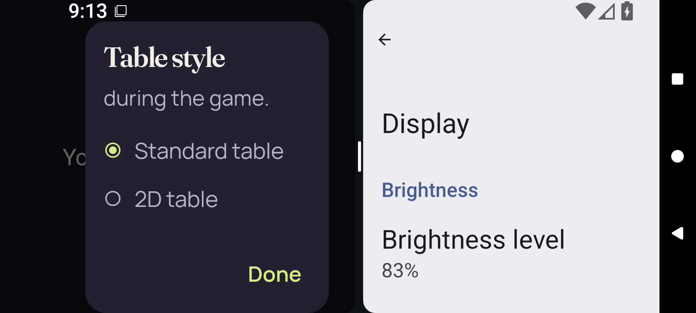</a> | `frame-000003.png` Index 2; PTS `48745` × `1/90000` `0.541611` s; 1600 × 720 | Direct full-size decoded-frame view `89ce7d62acc580461a58562b661e4983cb0dfd7d7a0787347fd14b7e1775b74b` In the left split pane, the Table style dialog shows the trailing description during the game., Standard table selected, 2D table, and Done. The right pane shows Android Display settings / Brightness level 83%. No game cards or private card faces are visible. |
|  | `frame-000004.png` Index 3; PTS `134480` × `1/90000` `1.494222` s; 1600 × 720 | Direct full-size decoded-frame view `0025cf9f0ffb5e23a5f82a591d9f475c3225ebf330eb16da54ef4dd391efd711` In the left split pane, the Table style dialog shows the trailing description during the game., Standard table selected, 2D table, and Done. The right pane shows Android Display settings / Brightness level 83%. No game cards or private card faces are visible. |
| <a href="frames/frame-000005.png">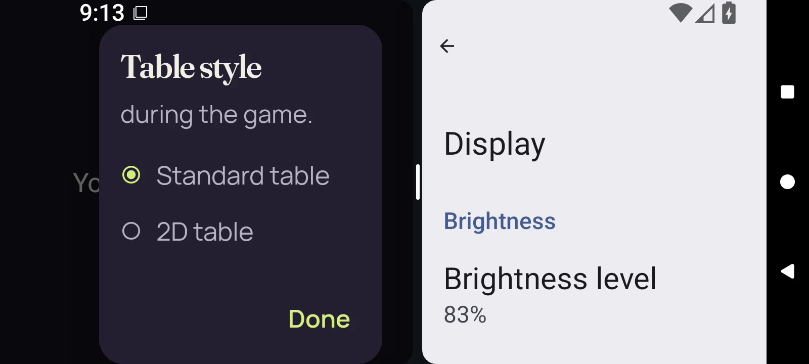</a> | `frame-000005.png` Index 4; PTS `139064` × `1/90000` `1.545156` s; 1600 × 720 | Direct full-size decoded-frame view `680a75b51440fd0042ae5a792cf68ee5725074fba11afa0f0db4ecc4649854c4` In the left split pane, the Table style dialog shows the trailing description during the game., Standard table selected, 2D table, and Done. The right pane shows Android Display settings / Brightness level 83%. No game cards or private card faces are visible. |
|  | `frame-000006.png` Index 5; PTS `208706` × `1/90000` `2.318956` s; 1600 × 720 | Direct full-size decoded-frame view `06ab5da6bff18fa27a57dd0689f91c1e942281b20d3ee01232aa352595606266` Left pane retains the Table style dialog with Standard table selected, 2D table and Done; Display settings remains at right. No private card faces are visible. |
|  | `frame-000007.png` Index 6; PTS `218028` × `1/90000` `2.422533` s; 1600 × 720 | Direct full-size decoded-frame view `4703128f2a723f2c63a015c4ed66bbad11981e731427f0f85e9a55078385e44f` PartyDeck left pane is covered by centered Your cards stay private text; Display settings remains at right with the center divider handle visible. No private card faces are visible. |
| <a href="frames/frame-000008.png">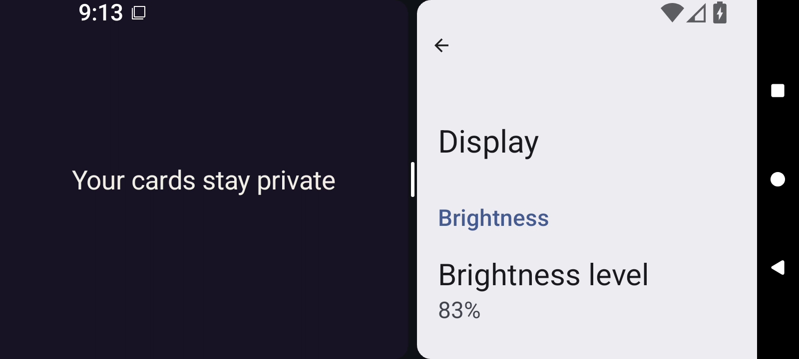</a> | `frame-000008.png` Index 7; PTS `224010` × `1/90000` `2.489000` s; 1600 × 720 | Direct full-size decoded-frame view `6af34cc3fb813976c45c6f487baba893ab1a3f249377d5cb9565dcc60e57f760` PartyDeck left pane is covered by centered Your cards stay private text; Display settings remains at right with the center divider handle visible. No private card faces are visible. |
|  | `frame-000009.png` Index 8; PTS `229904` × `1/90000` `2.554489` s; 1600 × 720 | Direct full-size decoded-frame view `4bdbc1bb0411dce25196c90daaa254d53c70707ac54d7772711780f9d1115508` PartyDeck left pane is covered by centered Your cards stay private text; Display settings remains at right with the center divider handle visible. No private card faces are visible. |
|  | `frame-000010.png` Index 9; PTS `230766` × `1/90000` `2.564067` s; 1600 × 720 | Reviewed identical bytes; this identity not reopened Representative: [frame-000009.png](frames/frame-000009.png) `4bdbc1bb0411dce25196c90daaa254d53c70707ac54d7772711780f9d1115508` PartyDeck left pane is covered by centered Your cards stay private text; Display settings remains at right with the center divider handle visible. No private card faces are visible. |
|  | `frame-000011.png` Index 10; PTS `241751` × `1/90000` `2.686122` s; 1600 × 720 | Reviewed identical bytes; this identity not reopened Representative: [frame-000009.png](frames/frame-000009.png) `4bdbc1bb0411dce25196c90daaa254d53c70707ac54d7772711780f9d1115508` PartyDeck left pane is covered by centered Your cards stay private text; Display settings remains at right with the center divider handle visible. No private card faces are visible. |
|  | `frame-000012.png` Index 11; PTS `252676` × `1/90000` `2.807511` s; 1600 × 720 | Direct full-size decoded-frame view `f3c4d18702439847421e8c51891e72bec3759cf77017d1c5edd936a66e2f4962` The left app pane becomes blank dark purple while Display settings remains at right. No private card faces or game details are visible. |
|  | `frame-000013.png` Index 12; PTS `267040` × `1/90000` `2.967111` s; 1600 × 720 | Reviewed identical bytes; this identity not reopened Representative: [frame-000012.png](frames/frame-000012.png) `f3c4d18702439847421e8c51891e72bec3759cf77017d1c5edd936a66e2f4962` The left app pane becomes blank dark purple while Display settings remains at right. No private card faces or game details are visible. |
|  | `frame-000014.png` Index 13; PTS `273223` × `1/90000` `3.035811` s; 1600 × 720 | Reviewed identical bytes; this identity not reopened Representative: [frame-000012.png](frames/frame-000012.png) `f3c4d18702439847421e8c51891e72bec3759cf77017d1c5edd936a66e2f4962` The left app pane becomes blank dark purple while Display settings remains at right. No private card faces or game details are visible. |
|  | `frame-000015.png` Index 14; PTS `279630` × `1/90000` `3.107000` s; 1600 × 720 | Reviewed identical bytes; this identity not reopened Representative: [frame-000012.png](frames/frame-000012.png) `f3c4d18702439847421e8c51891e72bec3759cf77017d1c5edd936a66e2f4962` The left app pane becomes blank dark purple while Display settings remains at right. No private card faces or game details are visible. |
|  | `frame-000016.png` Index 15; PTS `286301` × `1/90000` `3.181122` s; 1600 × 720 | Reviewed identical bytes; this identity not reopened Representative: [frame-000012.png](frames/frame-000012.png) `f3c4d18702439847421e8c51891e72bec3759cf77017d1c5edd936a66e2f4962` The left app pane becomes blank dark purple while Display settings remains at right. No private card faces or game details are visible. |
|  | `frame-000017.png` Index 16; PTS `292222` × `1/90000` `3.246911` s; 1600 × 720 | Reviewed identical bytes; this identity not reopened Representative: [frame-000012.png](frames/frame-000012.png) `f3c4d18702439847421e8c51891e72bec3759cf77017d1c5edd936a66e2f4962` The left app pane becomes blank dark purple while Display settings remains at right. No private card faces or game details are visible. |
|  | `frame-000018.png` Index 17; PTS `323917` × `1/90000` `3.599078` s; 1600 × 720 | Reviewed identical bytes; this identity not reopened Representative: [frame-000012.png](frames/frame-000012.png) `f3c4d18702439847421e8c51891e72bec3759cf77017d1c5edd936a66e2f4962` The left app pane becomes blank dark purple while Display settings remains at right. No private card faces or game details are visible. |
|  | `frame-000019.png` Index 18; PTS `332592` × `1/90000` `3.695467` s; 1600 × 720 | Reviewed identical bytes; this identity not reopened Representative: [frame-000012.png](frames/frame-000012.png) `f3c4d18702439847421e8c51891e72bec3759cf77017d1c5edd936a66e2f4962` The left app pane becomes blank dark purple while Display settings remains at right. No private card faces or game details are visible. |
|  | `frame-000020.png` Index 19; PTS `337481` × `1/90000` `3.749789` s; 1600 × 720 | Reviewed identical bytes; this identity not reopened Representative: [frame-000012.png](frames/frame-000012.png) `f3c4d18702439847421e8c51891e72bec3759cf77017d1c5edd936a66e2f4962` The left app pane becomes blank dark purple while Display settings remains at right. No private card faces or game details are visible. |
|  | `frame-000021.png` Index 20; PTS `351547` × `1/90000` `3.906078` s; 1600 × 720 | Reviewed identical bytes; this identity not reopened Representative: [frame-000012.png](frames/frame-000012.png) `f3c4d18702439847421e8c51891e72bec3759cf77017d1c5edd936a66e2f4962` The left app pane becomes blank dark purple while Display settings remains at right. No private card faces or game details are visible. |
| <a href="frames/frame-000022.png">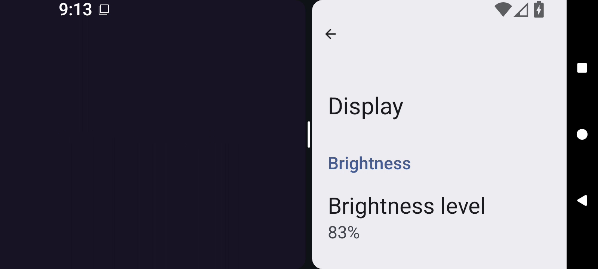</a> | `frame-000022.png` Index 21; PTS `365766` × `1/90000` `4.064067` s; 1600 × 720 | Reviewed identical bytes; this identity not reopened Representative: [frame-000012.png](frames/frame-000012.png) `f3c4d18702439847421e8c51891e72bec3759cf77017d1c5edd936a66e2f4962` The left app pane becomes blank dark purple while Display settings remains at right. No private card faces or game details are visible. |
|  | `frame-000023.png` Index 22; PTS `372677` × `1/90000` `4.140856` s; 1600 × 720 | Direct full-size decoded-frame view `3826823fed5b40ed8d7aa7ff268d2219fc5455bbcfbb97375f4c0390c7f04b0c` The left pane shows Opening table..., complete Standard table / Leave table host labels (Standard table wraps), and a centered Your cards stay private cover. Display settings remains at right. No private card faces are visible. |
| <a href="frames/frame-000024.png">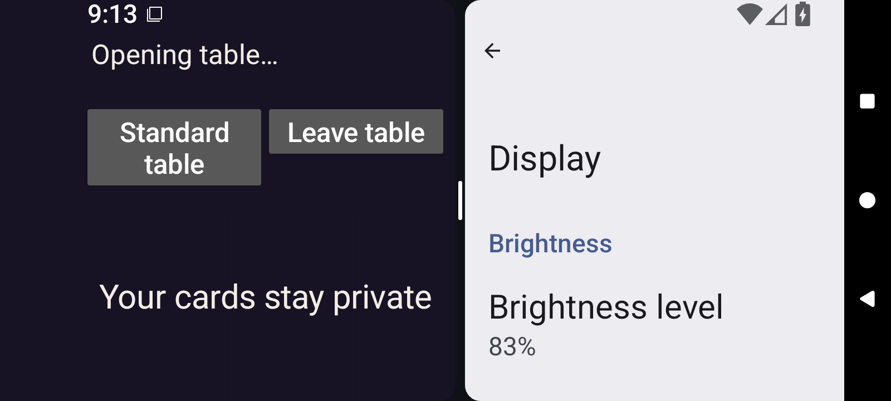</a> | `frame-000024.png` Index 23; PTS `376811` × `1/90000` `4.186789` s; 1600 × 720 | Direct full-size decoded-frame view `e99cda06715e8104e52363cfb31ca1d92aa1a5af9ed15a36cc7995ffec6d8abd` Left pane retains Opening table..., complete Standard table / Leave table host labels, and the Your cards stay private cover. Display settings remains at right. No private card faces are visible. |
|  | `frame-000025.png` Index 24; PTS `387434` × `1/90000` `4.304822` s; 1600 × 720 | Direct full-size decoded-frame view `894f660808ebec8f54b7855231e3e8ff005b346f68a1d1748c89620cd3a1c8b2` Left pane retains Opening table..., complete Standard table / Leave table host labels, and the Your cards stay private cover. Display settings remains at right. No private card faces are visible. |
|  | `frame-000026.png` Index 25; PTS `393151` × `1/90000` `4.368344` s; 1600 × 720 | Reviewed identical bytes; this identity not reopened Representative: [frame-000025.png](frames/frame-000025.png) `894f660808ebec8f54b7855231e3e8ff005b346f68a1d1748c89620cd3a1c8b2` Left pane retains Opening table..., complete Standard table / Leave table host labels, and the Your cards stay private cover. Display settings remains at right. No private card faces are visible. |
|  | `frame-000027.png` Index 26; PTS `406401` × `1/90000` `4.515567` s; 1600 × 720 | Reviewed identical bytes; this identity not reopened Representative: [frame-000025.png](frames/frame-000025.png) `894f660808ebec8f54b7855231e3e8ff005b346f68a1d1748c89620cd3a1c8b2` Left pane retains Opening table..., complete Standard table / Leave table host labels, and the Your cards stay private cover. Display settings remains at right. No private card faces are visible. |
|  | `frame-000028.png` Index 27; PTS `434106` × `1/90000` `4.823400` s; 1600 × 720 | Reviewed identical bytes; this identity not reopened Representative: [frame-000025.png](frames/frame-000025.png) `894f660808ebec8f54b7855231e3e8ff005b346f68a1d1748c89620cd3a1c8b2` Left pane retains Opening table..., complete Standard table / Leave table host labels, and the Your cards stay private cover. Display settings remains at right. No private card faces are visible. |
|  | `frame-000029.png` Index 28; PTS `439195` × `1/90000` `4.879944` s; 1600 × 720 | Reviewed identical bytes; this identity not reopened Representative: [frame-000025.png](frames/frame-000025.png) `894f660808ebec8f54b7855231e3e8ff005b346f68a1d1748c89620cd3a1c8b2` Left pane retains Opening table..., complete Standard table / Leave table host labels, and the Your cards stay private cover. Display settings remains at right. No private card faces are visible. |
|  | `frame-000030.png` Index 29; PTS `482619` × `1/90000` `5.362433` s; 1600 × 720 | Reviewed identical bytes; this identity not reopened Representative: [frame-000025.png](frames/frame-000025.png) `894f660808ebec8f54b7855231e3e8ff005b346f68a1d1748c89620cd3a1c8b2` Left pane retains Opening table..., complete Standard table / Leave table host labels, and the Your cards stay private cover. Display settings remains at right. No private card faces are visible. |
|  | `frame-000031.png` Index 30; PTS `488123` × `1/90000` `5.423589` s; 1600 × 720 | Reviewed identical bytes; this identity not reopened Representative: [frame-000025.png](frames/frame-000025.png) `894f660808ebec8f54b7855231e3e8ff005b346f68a1d1748c89620cd3a1c8b2` Left pane retains Opening table..., complete Standard table / Leave table host labels, and the Your cards stay private cover. Display settings remains at right. No private card faces are visible. |
|  | `frame-000032.png` Index 31; PTS `513455` × `1/90000` `5.705056` s; 1600 × 720 | Reviewed identical bytes; this identity not reopened Representative: [frame-000025.png](frames/frame-000025.png) `894f660808ebec8f54b7855231e3e8ff005b346f68a1d1748c89620cd3a1c8b2` Left pane retains Opening table..., complete Standard table / Leave table host labels, and the Your cards stay private cover. Display settings remains at right. No private card faces are visible. |
| <a href="frames/frame-000033.png">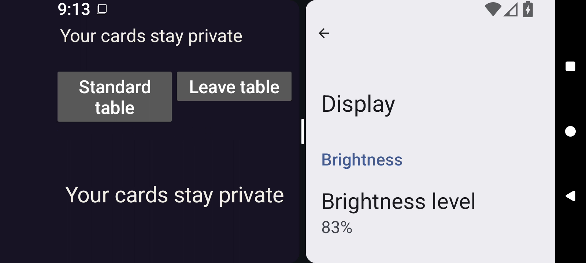</a> | `frame-000033.png` Index 32; PTS `519483` × `1/90000` `5.772033` s; 1600 × 720 | Direct full-size decoded-frame view `2f9ca176ed3b15a557eac56c13643f0ad39f88f7c7af107aec61532d0061709f` Left pane top status and central game cover both read Your cards stay private, with Standard table / Leave table buttons above. Right Display settings pane remains visible. No private card faces are visible. |
|  | `frame-000034.png` Index 33; PTS `527229` × `1/90000` `5.858100` s; 1600 × 720 | Direct full-size decoded-frame view `4c7fa43f256847c239478551dc0b20231691aff57b39f058ac83bda1bb82d55b` Left pane top status and central game cover both read Your cards stay private, with Standard table / Leave table buttons above. Right Display settings pane remains visible. No private card faces are visible. |
|  | `frame-000035.png` Index 34; PTS `533862` × `1/90000` `5.931800` s; 1600 × 720 | Reviewed identical bytes; this identity not reopened Representative: [frame-000034.png](frames/frame-000034.png) `4c7fa43f256847c239478551dc0b20231691aff57b39f058ac83bda1bb82d55b` Left pane top status and central game cover both read Your cards stay private, with Standard table / Leave table buttons above. Right Display settings pane remains visible. No private card faces are visible. |
|  | `frame-000036.png` Index 35; PTS `539995` × `1/90000` `5.999944` s; 1600 × 720 | Direct full-size decoded-frame view `2aeffe98587711ecbf5c53a9dbd5ba08b3878135982f05c3e32ee9532af4736e` PartyDeck left native pane shows Table ready., Standard table / Leave table host controls, full Exit and Your turn · Crown table wrapped onto two lines. At font 2.0 these controls and header fill the pane; hand and lower gameplay actions are below the captured viewport. Display settings remains at right. No private card faces are visible. |
| <a href="frames/frame-000037.png">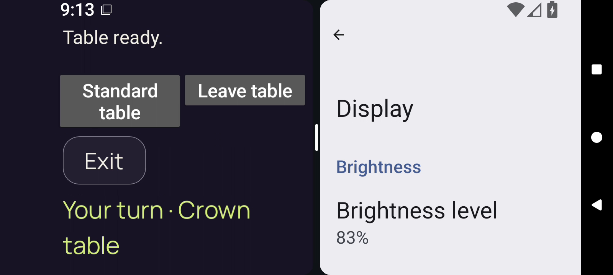</a> | `frame-000037.png` Index 36; PTS `620528` × `1/90000` `6.894756` s; 1600 × 720 | Direct full-size decoded-frame view `cb737ab981a7013884564ea2ff4a8e462793c3bdd970eb8c19f485b1329e4df0` PartyDeck left native pane shows Table ready., Standard table / Leave table host controls, full Exit and Your turn · Crown table wrapped onto two lines. At font 2.0 these controls and header fill the pane; hand and lower gameplay actions are below the captured viewport. Display settings remains at right. No private card faces are visible. |
|  | `frame-000038.png` Index 37; PTS `624273` × `1/90000` `6.936367` s; 1600 × 720 | Direct full-size decoded-frame view `2ae6490defe221f7cbe4c246ee68818c731fe99ae2ebf02347de9009a72254d2` The native 2D left pane remains Table ready. with Standard table / Leave table, Exit, and the wrapped Your turn · Crown table header. Hand and lower game controls remain below the image; Display settings stays at right while the system navigation area changes contrast. No private card faces are visible. |
|  | `frame-000039.png` Index 38; PTS `725850` × `1/90000` `8.065000` s; 1600 × 720 | Reviewed identical bytes; this identity not reopened Representative: [frame-000038.png](frames/frame-000038.png) `2ae6490defe221f7cbe4c246ee68818c731fe99ae2ebf02347de9009a72254d2` The native 2D left pane remains Table ready. with Standard table / Leave table, Exit, and the wrapped Your turn · Crown table header. Hand and lower game controls remain below the image; Display settings stays at right while the system navigation area changes contrast. No private card faces are visible. |
|  | `frame-000040.png` Index 39; PTS `729981` × `1/90000` `8.110900` s; 1600 × 720 | Reviewed identical bytes; this identity not reopened Representative: [frame-000038.png](frames/frame-000038.png) `2ae6490defe221f7cbe4c246ee68818c731fe99ae2ebf02347de9009a72254d2` The native 2D left pane remains Table ready. with Standard table / Leave table, Exit, and the wrapped Your turn · Crown table header. Hand and lower game controls remain below the image; Display settings stays at right while the system navigation area changes contrast. No private card faces are visible. |
|  | `frame-000041.png` Index 40; PTS `818528` × `1/90000` `9.094756` s; 1600 × 720 | Reviewed identical bytes; this identity not reopened Representative: [frame-000038.png](frames/frame-000038.png) `2ae6490defe221f7cbe4c246ee68818c731fe99ae2ebf02347de9009a72254d2` The native 2D left pane remains Table ready. with Standard table / Leave table, Exit, and the wrapped Your turn · Crown table header. Hand and lower game controls remain below the image; Display settings stays at right while the system navigation area changes contrast. No private card faces are visible. |
|  | `frame-000042.png` Index 41; PTS `824294` × `1/90000` `9.158822` s; 1600 × 720 | Reviewed identical bytes; this identity not reopened Representative: [frame-000038.png](frames/frame-000038.png) `2ae6490defe221f7cbe4c246ee68818c731fe99ae2ebf02347de9009a72254d2` The native 2D left pane remains Table ready. with Standard table / Leave table, Exit, and the wrapped Your turn · Crown table header. Hand and lower game controls remain below the image; Display settings stays at right while the system navigation area changes contrast. No private card faces are visible. |
|  | `frame-000043.png` Index 42; PTS `911401` × `1/90000` `10.126678` s; 1600 × 720 | Direct full-size decoded-frame view `74751368cdfd126e08393a3129e40814d3c6a896056aceeca56fc9901fc76aea` The native 2D left pane remains Table ready. with Standard table / Leave table, Exit, and the wrapped Your turn · Crown table header. Hand and lower game controls remain below the image; Display settings stays at right while the system navigation area changes contrast. No private card faces are visible. |
|  | `frame-000044.png` Index 43; PTS `968546` × `1/90000` `10.761622` s; 1600 × 720 | Reviewed identical bytes; this identity not reopened Representative: [frame-000043.png](frames/frame-000043.png) `74751368cdfd126e08393a3129e40814d3c6a896056aceeca56fc9901fc76aea` The native 2D left pane remains Table ready. with Standard table / Leave table, Exit, and the wrapped Your turn · Crown table header. Hand and lower game controls remain below the image; Display settings stays at right while the system navigation area changes contrast. No private card faces are visible. |
|  | `frame-000045.png` Index 44; PTS `974124` × `1/90000` `10.823600` s; 1600 × 720 | Reviewed identical bytes; this identity not reopened Representative: [frame-000043.png](frames/frame-000043.png) `74751368cdfd126e08393a3129e40814d3c6a896056aceeca56fc9901fc76aea` The native 2D left pane remains Table ready. with Standard table / Leave table, Exit, and the wrapped Your turn · Crown table header. Hand and lower game controls remain below the image; Display settings stays at right while the system navigation area changes contrast. No private card faces are visible. |
|  | `frame-000046.png` Index 45; PTS `981604` × `1/90000` `10.906711` s; 1600 × 720 | Reviewed identical bytes; this identity not reopened Representative: [frame-000043.png](frames/frame-000043.png) `74751368cdfd126e08393a3129e40814d3c6a896056aceeca56fc9901fc76aea` The native 2D left pane remains Table ready. with Standard table / Leave table, Exit, and the wrapped Your turn · Crown table header. Hand and lower game controls remain below the image; Display settings stays at right while the system navigation area changes contrast. No private card faces are visible. |
|  | `frame-000047.png` Index 46; PTS `986345` × `1/90000` `10.959389` s; 1600 × 720 | Reviewed identical bytes; this identity not reopened Representative: [frame-000043.png](frames/frame-000043.png) `74751368cdfd126e08393a3129e40814d3c6a896056aceeca56fc9901fc76aea` The native 2D left pane remains Table ready. with Standard table / Leave table, Exit, and the wrapped Your turn · Crown table header. Hand and lower game controls remain below the image; Display settings stays at right while the system navigation area changes contrast. No private card faces are visible. |
|  | `frame-000048.png` Index 47; PTS `993480` × `1/90000` `11.038667` s; 1600 × 720 | Direct full-size decoded-frame view `b7c38ac4a89823bf9966e8e2a7d62d45eedca5efd93dd30f02fdafbb91e9c31e` The native 2D left pane remains Table ready. with Standard table / Leave table, Exit, and the wrapped Your turn · Crown table header. Hand and lower game controls remain below the image; Display settings stays at right while the system navigation area changes contrast. No private card faces are visible. |
|  | `frame-000049.png` Index 48; PTS `998201` × `1/90000` `11.091122` s; 1600 × 720 | Direct full-size decoded-frame view `9f5592d472a62e25e0f40f23fd3bd13a209314e452027b6f23e09ed6648a7b09` The native 2D left pane remains Table ready. with Standard table / Leave table, Exit, and the wrapped Your turn · Crown table header. Hand and lower game controls remain below the image; Display settings stays at right while the system navigation area changes contrast. No private card faces are visible. |
| <a href="frames/frame-000050.png">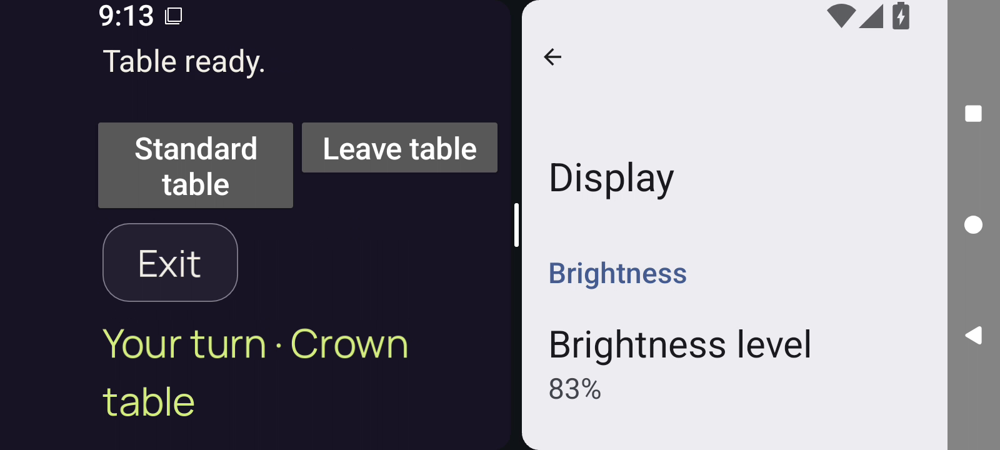</a> | `frame-000050.png` Index 49; PTS `1008347` × `1/90000` `11.203856` s; 1600 × 720 | Direct full-size decoded-frame view `e07632c6f2050b75e162797e2e3aaa16ea07b3fac4cca7251ca695b130595a6e` The native 2D left pane remains Table ready. with Standard table / Leave table, Exit, and the wrapped Your turn · Crown table header. Hand and lower game controls remain below the image; Display settings stays at right while the system navigation area changes contrast. No private card faces are visible. |
| <a href="frames/frame-000051.png">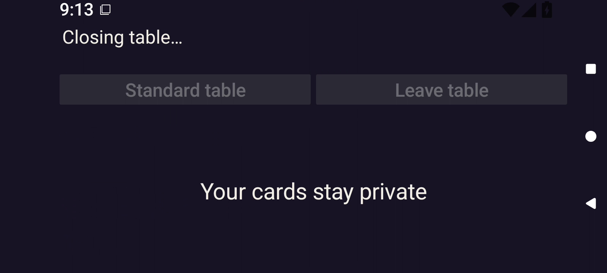</a> | `frame-000051.png` Index 50; PTS `1020562` × `1/90000` `11.339578` s; 1600 × 720 | Direct full-size decoded-frame view `35d4f20566a5b4b1921a519001a05dbc370c0cd1c0e5bd6cc5befffdaf8f2f24` PartyDeck is fullscreen again; Display settings and the center divider are gone. Closing table... and dimmed Standard table / Leave table host buttons sit above a centered Your cards stay private cover. No private card faces are visible. |
|  | `frame-000052.png` Index 51; PTS `1029716` × `1/90000` `11.441289` s; 1600 × 720 | Direct full-size decoded-frame view `99caeb00075c2cb249f5bd483c393ebe6cc2f1338b287f02dc297aff45148d44` Fullscreen Closing table... persists with dimmed Standard table / Leave table buttons and Your cards stay private. Android status icons change contrast; no private card faces are visible. |
| <a href="frames/frame-000053.png">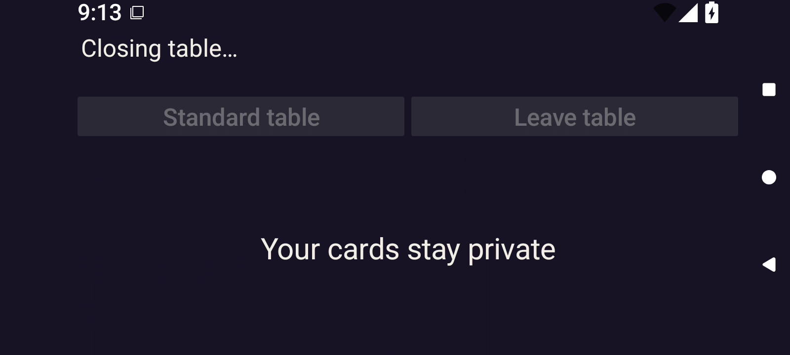</a> | `frame-000053.png` Index 52; PTS `1036919` × `1/90000` `11.521322` s; 1600 × 720 | Direct full-size decoded-frame view `9e1f273edfb0e7dc1a5e6a96912f1d3c8adc5508cb8293306393b25156bee2f6` Fullscreen Closing table... persists with dimmed Standard table / Leave table buttons and Your cards stay private. Android status icons change contrast; no private card faces are visible. |
|  | `frame-000054.png` Index 53; PTS `1042908` × `1/90000` `11.587867` s; 1600 × 720 | Direct full-size decoded-frame view `4188ab831519e87bccaa349c16805f7ab5d503bee6addc953d567d7c8fe686f9` Fullscreen Closing table... persists with dimmed Standard table / Leave table buttons and Your cards stay private. Android status icons change contrast; no private card faces are visible. |
|  | `frame-000055.png` Index 54; PTS `1050727` × `1/90000` `11.674744` s; 1600 × 720 | Direct full-size decoded-frame view `917a2b903c9400a4cbbb80817c915d8c67f830090c002916c07ea23bb5b8ae59` Fullscreen Closing table... persists with dimmed Standard table / Leave table buttons and Your cards stay private. Android status icons change contrast; no private card faces are visible. |
| <a href="frames/frame-000056.png">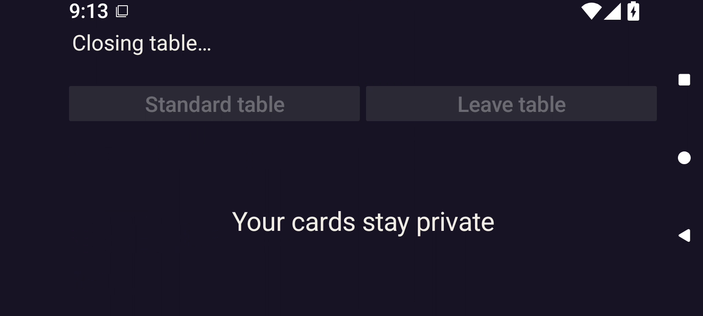</a> | `frame-000056.png` Index 55; PTS `1060108` × `1/90000` `11.778978` s; 1600 × 720 | Reviewed identical bytes; this identity not reopened Representative: [frame-000055.png](frames/frame-000055.png) `917a2b903c9400a4cbbb80817c915d8c67f830090c002916c07ea23bb5b8ae59` Fullscreen Closing table... persists with dimmed Standard table / Leave table buttons and Your cards stay private. Android status icons change contrast; no private card faces are visible. |
|  | `frame-000057.png` Index 56; PTS `1065014` × `1/90000` `11.833489` s; 1600 × 720 | Direct full-size decoded-frame view `b3efbb4f451d565e372227f981a363ad22f8c537cae965a29c46734f6a932686` The fullscreen app area becomes only a centered Your cards stay private cover; closing status and host buttons are gone. No private card faces are visible. |
|  | `frame-000058.png` Index 57; PTS `1071269` × `1/90000` `11.902989` s; 1600 × 720 | Direct full-size decoded-frame view `a496db041478a0f05241e41757eebf90bb2a4610de2b96b85237ee02fd97b628` The fullscreen app area becomes only a centered Your cards stay private cover; closing status and host buttons are gone. No private card faces are visible. |
|  | `frame-000059.png` Index 58; PTS `1080277` × `1/90000` `12.003078` s; 1600 × 720 | Reviewed identical bytes; this identity not reopened Representative: [frame-000058.png](frames/frame-000058.png) `a496db041478a0f05241e41757eebf90bb2a4610de2b96b85237ee02fd97b628` The fullscreen app area becomes only a centered Your cards stay private cover; closing status and host buttons are gone. No private card faces are visible. |
| <a href="frames/frame-000060.png">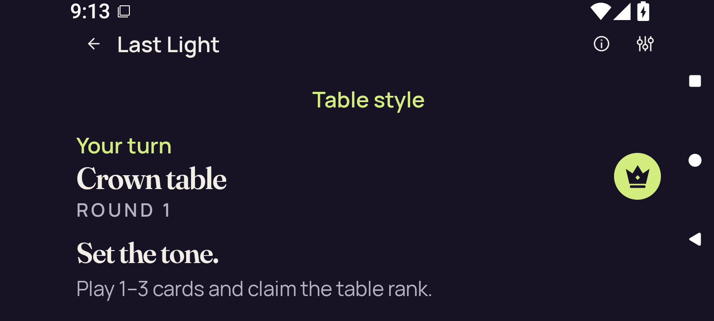</a> | `frame-000060.png` Index 59; PTS `1085118` × `1/90000` `12.056867` s; 1600 × 720 | Direct full-size decoded-frame view `de7548686a707ae48063e77e3623b71b8f3ef8f61209c7f091e020383a55ee24` Fullscreen Standard layout shows Last Light, Table style, Your turn, Crown table / ROUND 1, Set the tone., and the complete public instruction Play 1–3 cards and claim the table rank. The hand and gameplay actions are below the visible landscape viewport. No private card faces are visible; concealed hand state is not directly observable in this offscreen area. |
|  | `frame-000061.png` Index 60; PTS `1144748` × `1/90000` `12.719422` s; 1600 × 720 | Direct full-size decoded-frame view `cf2816fa98c1d97c71bccaaa4decca63444996a94758bd87724e216fa209d9b3` Fullscreen Standard layout shows Last Light, Table style, Your turn, Crown table / ROUND 1, Set the tone., and the complete public instruction Play 1–3 cards and claim the table rank. The hand and gameplay actions are below the visible landscape viewport. No private card faces are visible; concealed hand state is not directly observable in this offscreen area. |
|  | `frame-000062.png` Index 61; PTS `1149558` × `1/90000` `12.772867` s; 1600 × 720 | Direct full-size decoded-frame view `d9db636b20d98d9876895e9c3101335a94da13288bfb26ab6d82b6f07068a39c` Fullscreen Standard layout shows Last Light, Table style, Your turn, Crown table / ROUND 1, Set the tone., and the complete public instruction Play 1–3 cards and claim the table rank. The hand and gameplay actions are below the visible landscape viewport. No private card faces are visible; concealed hand state is not directly observable in this offscreen area. |
|  | `frame-000063.png` Index 62; PTS `1236000` × `1/90000` `13.733333` s; 1600 × 720 | Direct full-size decoded-frame view `35b0cf516f5c654d7da619c75cb0b032f181e997492f0ae9cdad7fdda753158f` Fullscreen Standard layout shows Last Light, Table style, Your turn, Crown table / ROUND 1, Set the tone., and the complete public instruction Play 1–3 cards and claim the table rank. The hand and gameplay actions are below the visible landscape viewport. No private card faces are visible; concealed hand state is not directly observable in this offscreen area. |
|  | `frame-000064.png` Index 63; PTS `1240259` × `1/90000` `13.780656` s; 1600 × 720 | Direct full-size decoded-frame view `585cc4c7cbbcfbf29d3d545bbc6703db3b817a97b30167525c669fd5cbd6fe48` Fullscreen Standard layout shows Last Light, Table style, Your turn, Crown table / ROUND 1, Set the tone., and the complete public instruction Play 1–3 cards and claim the table rank. The hand and gameplay actions are below the visible landscape viewport. No private card faces are visible; concealed hand state is not directly observable in this offscreen area. |
|  | `frame-000065.png` Index 64; PTS `1244250` × `1/90000` `13.825000` s; 1600 × 720 | Direct full-size decoded-frame view `e96a48874421cc2186ca7cf2e74c71a5271220859287953c32797ec755d1f966` Fullscreen Standard layout shows Last Light, Table style, Your turn, Crown table / ROUND 1, Set the tone., and the complete public instruction Play 1–3 cards and claim the table rank. The hand and gameplay actions are below the visible landscape viewport. No private card faces are visible; concealed hand state is not directly observable in this offscreen area. |
