# Android debug font 2.0 video — 3d-landscape-rotation

**88 decoded identities: 44 direct views and 44 reviewed byte matches.** [Read the shared scope and clock limits](../../README.md).

Original [3d-landscape-rotation.mp4](../../runtime/videos/3d-landscape-rotation.mp4): **287,377 bytes**, SHA-256 `ef36ffcd7d072f3af98899bd8d4ac534beb080f35e57c72eca3a6dc86d5fe8c9`. Frame images are decoded derivatives, not original CI PNG attachments.

Ready native landscape retains Last Light, ROUND 1, Show hand, Crown table, Your turn and the public Orbit claim. The hand and lower actions are below the font-2.0 viewport.

Standard table is visibly lighter in frames 49–56; frame 57 is a sideways intermediate with a dark right portion.

Frames 58–66 show centered portrait Closing table… and a privacy cover. Frame 67 shows the portrait cover only. From frame 70 the Standard portrait view shows a concealed five-card hand, while the lower Reveal/action area is clipped.

The portrait image and black side areas occur inside the original fixed 1600 × 720 recording canvas.

| Derivative at full original canvas | Frame / exact media timestamp | Review / SHA-256 |
| --- | --- | --- |
|  | `frame-000001.png` Index 0; PTS `0` × `1/90000` `0.000000` s; 1600 × 720 | Direct full-size decoded-frame view `f8b843153b738f70ba1611d5ed7fc41a6e2e882a6895e7f08daba3f0fa65cea7` Landscape Table style dialog shows Standard table selected and complete 2D table, 3D table and Done labels. Dialog covers the game; surrounding screen is dark. No private card faces are visible. |
| <a href="frames/frame-000002.png">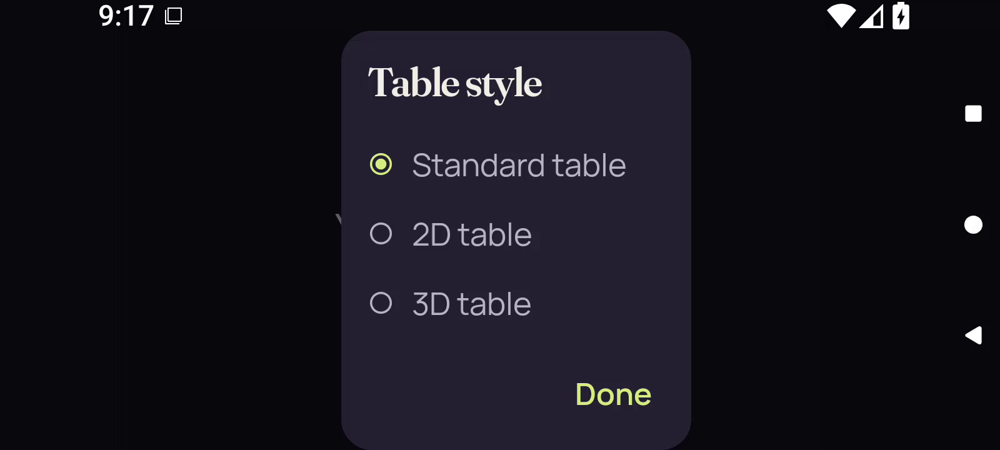</a> | `frame-000002.png` Index 1; PTS `45687` × `1/90000` `0.507633` s; 1600 × 720 | Direct full-size decoded-frame view `bc74a66f3b2456139f2f9c5fbf99122e8ff19053a170738f3c612d878fa4f8e7` Landscape Table style dialog shows Standard table selected and complete 2D table, 3D table and Done labels. Dialog covers the game; surrounding screen is dark. No private card faces are visible. |
|  | `frame-000003.png` Index 2; PTS `136915` × `1/90000` `1.521278` s; 1600 × 720 | Direct full-size decoded-frame view `88ee9015e7400412831576f69c68ea836977b04864d17b299b341d611cd6fcfe` Landscape Table style dialog shows Standard table selected and complete 2D table, 3D table and Done labels. Dialog covers the game; surrounding screen is dark. No private card faces are visible. |
| <a href="frames/frame-000004.png">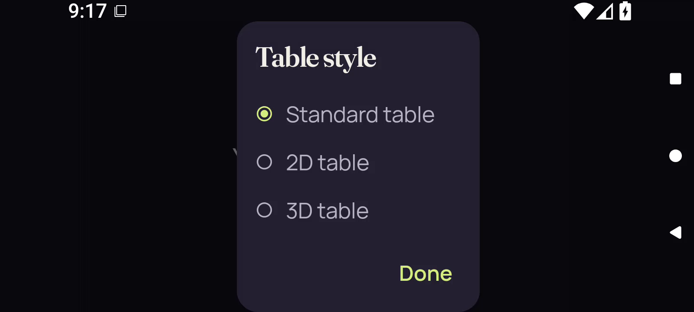</a> | `frame-000004.png` Index 3; PTS `148319` × `1/90000` `1.647989` s; 1600 × 720 | Direct full-size decoded-frame view `72e0a3941c5494e33c48f8e16cc3c38c1d4faacc5c6aa66a40914f547ca92cc8` Landscape Table style dialog shows Standard table selected and complete 2D table, 3D table and Done labels. Dialog covers the game; surrounding screen is dark. No private card faces are visible. |
| <a href="frames/frame-000005.png">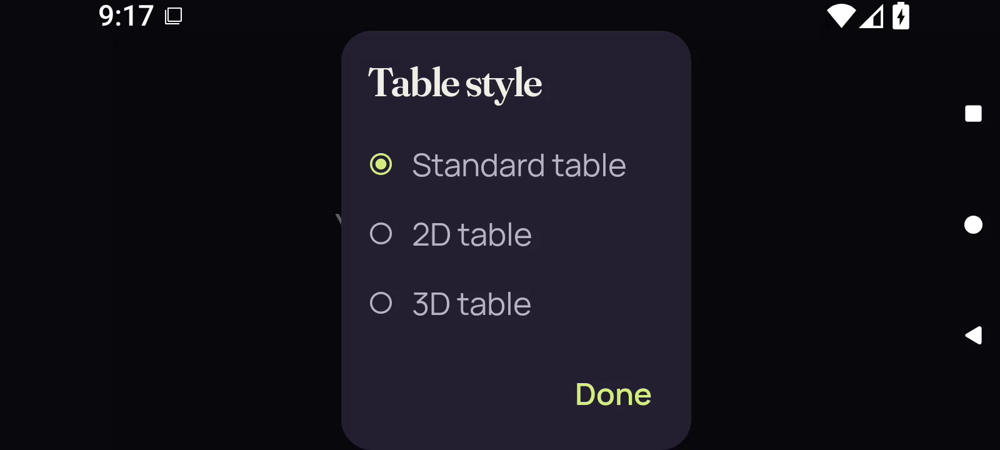</a> | `frame-000005.png` Index 4; PTS `211362` × `1/90000` `2.348467` s; 1600 × 720 | Direct full-size decoded-frame view `c4174773b2998571a36d6424eddf7102f82f651a2bd1d7d2055ed8d6ca65cebe` Landscape Table style dialog shows Standard table selected and complete 2D table, 3D table and Done labels. Dialog covers the game; surrounding screen is dark. No private card faces are visible. |
|  | `frame-000006.png` Index 5; PTS `219200` × `1/90000` `2.435556` s; 1600 × 720 | Direct full-size decoded-frame view `d4b7f6a5a36aabb88bda13b779ba1fb78c8f5fbec778a73d4c8809a5c1e75a0b` Full landscape app area is a uniform dark-purple privacy cover with centered Your cards stay private text; Android status and side navigation remain visible. No card faces are visible. |
|  | `frame-000007.png` Index 6; PTS `225239` × `1/90000` `2.502656` s; 1600 × 720 | Direct full-size decoded-frame view `172a160901d8bc5f8b38f1ba892d7ee427a62f76d2105a04450df37ad4ed8733` Full landscape app area shows the centered Your cards stay private cover; Android status and side navigation remain visible. No card faces are visible. |
|  | `frame-000008.png` Index 7; PTS `233698` × `1/90000` `2.596644` s; 1600 × 720 | Direct full-size decoded-frame view `60ad1d73bc40ae7f30c702b217c22cc0c69fbbdf779d35df64d5d16a8093dea8` Full landscape app area shows the centered Your cards stay private cover; Android status and side navigation remain visible. No card faces are visible. |
|  | `frame-000009.png` Index 8; PTS `240304` × `1/90000` `2.670044` s; 1600 × 720 | Direct full-size decoded-frame view `cb45046bfb42046750517fed94c093c83a1a20041e45f8fb15a03cccc8cd8a8f` Full landscape app area shows the centered Your cards stay private cover; Android status and side navigation remain visible. No card faces are visible. |
|  | `frame-000010.png` Index 9; PTS `246517` × `1/90000` `2.739078` s; 1600 × 720 | Reviewed identical bytes; this identity not reopened Representative: [frame-000009.png](frames/frame-000009.png) `cb45046bfb42046750517fed94c093c83a1a20041e45f8fb15a03cccc8cd8a8f` Full landscape app area shows the centered Your cards stay private cover; Android status and side navigation remain visible. No card faces are visible. |
|  | `frame-000011.png` Index 10; PTS `252422` × `1/90000` `2.804689` s; 1600 × 720 | Reviewed identical bytes; this identity not reopened Representative: [frame-000009.png](frames/frame-000009.png) `cb45046bfb42046750517fed94c093c83a1a20041e45f8fb15a03cccc8cd8a8f` Full landscape app area shows the centered Your cards stay private cover; Android status and side navigation remain visible. No card faces are visible. |
|  | `frame-000012.png` Index 11; PTS `257994` × `1/90000` `2.866600` s; 1600 × 720 | Direct full-size decoded-frame view `9f1b09cc1b148a1a6518e45de7bcf94230aafe85729b141cafe3744e001b9575` Full app area is blank dark purple, without the privacy sentence; Android status and side navigation remain visible. No cards or game details are visible. |
|  | `frame-000013.png` Index 12; PTS `263622` × `1/90000` `2.929133` s; 1600 × 720 | Reviewed identical bytes; this identity not reopened Representative: [frame-000012.png](frames/frame-000012.png) `9f1b09cc1b148a1a6518e45de7bcf94230aafe85729b141cafe3744e001b9575` Full app area is blank dark purple, without the privacy sentence; Android status and side navigation remain visible. No cards or game details are visible. |
|  | `frame-000014.png` Index 13; PTS `268111` × `1/90000` `2.979011` s; 1600 × 720 | Reviewed identical bytes; this identity not reopened Representative: [frame-000012.png](frames/frame-000012.png) `9f1b09cc1b148a1a6518e45de7bcf94230aafe85729b141cafe3744e001b9575` Full app area is blank dark purple, without the privacy sentence; Android status and side navigation remain visible. No cards or game details are visible. |
|  | `frame-000015.png` Index 14; PTS `314673` × `1/90000` `3.496367` s; 1600 × 720 | Reviewed identical bytes; this identity not reopened Representative: [frame-000012.png](frames/frame-000012.png) `9f1b09cc1b148a1a6518e45de7bcf94230aafe85729b141cafe3744e001b9575` Full app area is blank dark purple, without the privacy sentence; Android status and side navigation remain visible. No cards or game details are visible. |
|  | `frame-000016.png` Index 15; PTS `320573` × `1/90000` `3.561922` s; 1600 × 720 | Reviewed identical bytes; this identity not reopened Representative: [frame-000012.png](frames/frame-000012.png) `9f1b09cc1b148a1a6518e45de7bcf94230aafe85729b141cafe3744e001b9575` Full app area is blank dark purple, without the privacy sentence; Android status and side navigation remain visible. No cards or game details are visible. |
|  | `frame-000017.png` Index 16; PTS `328147` × `1/90000` `3.646078` s; 1600 × 720 | Reviewed identical bytes; this identity not reopened Representative: [frame-000012.png](frames/frame-000012.png) `9f1b09cc1b148a1a6518e45de7bcf94230aafe85729b141cafe3744e001b9575` Full app area is blank dark purple, without the privacy sentence; Android status and side navigation remain visible. No cards or game details are visible. |
|  | `frame-000018.png` Index 17; PTS `337663` × `1/90000` `3.751811` s; 1600 × 720 | Reviewed identical bytes; this identity not reopened Representative: [frame-000012.png](frames/frame-000012.png) `9f1b09cc1b148a1a6518e45de7bcf94230aafe85729b141cafe3744e001b9575` Full app area is blank dark purple, without the privacy sentence; Android status and side navigation remain visible. No cards or game details are visible. |
|  | `frame-000019.png` Index 18; PTS `342603` × `1/90000` `3.806700` s; 1600 × 720 | Direct full-size decoded-frame view `f3b4353821b53633a3a6a74a923108c7c76f05c862db25bf7d6536aa616dd875` Opening table... status and full Standard table / Leave table buttons appear above the centered Your cards stay private message. The native game area remains covered; no card faces are visible. |
|  | `frame-000020.png` Index 19; PTS `347688` × `1/90000` `3.863200` s; 1600 × 720 | Direct full-size decoded-frame view `c44f96aa26ca2a85395cdab3c87d926d7966f73f23860008ee9af33d1831a69d` Opening table... status and full Standard table / Leave table buttons appear above the centered Your cards stay private message. The native game area remains covered; no card faces are visible. |
| <a href="frames/frame-000021.png">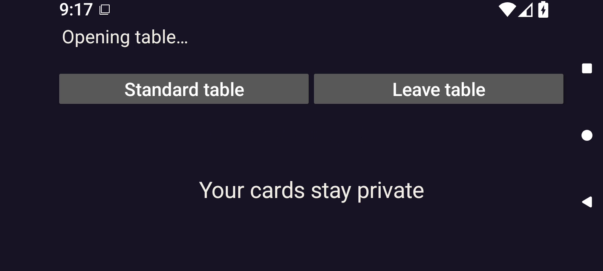</a> | `frame-000021.png` Index 20; PTS `355711` × `1/90000` `3.952344` s; 1600 × 720 | Direct full-size decoded-frame view `42dfc54fc37b60d1e1ed7e9530fde61cb2f8bc9b5149a474ead657e8c077f43b` Opening table... status, Standard table / Leave table buttons, and a centered Your cards stay private cover remain visible. No card faces are visible. |
|  | `frame-000022.png` Index 21; PTS `364371` × `1/90000` `4.048567` s; 1600 × 720 | Direct full-size decoded-frame view `d6ddef85fa1ccbcc6f4e3d326e1e29d227ecc226c97adec5cc49f57e8c199d85` Opening table... status, Standard table / Leave table buttons, and a centered Your cards stay private cover remain visible. No card faces are visible. |
|  | `frame-000023.png` Index 22; PTS `371252` × `1/90000` `4.125022` s; 1600 × 720 | Reviewed identical bytes; this identity not reopened Representative: [frame-000022.png](frames/frame-000022.png) `d6ddef85fa1ccbcc6f4e3d326e1e29d227ecc226c97adec5cc49f57e8c199d85` Opening table... status, Standard table / Leave table buttons, and a centered Your cards stay private cover remain visible. No card faces are visible. |
|  | `frame-000024.png` Index 23; PTS `377471` × `1/90000` `4.194122` s; 1600 × 720 | Reviewed identical bytes; this identity not reopened Representative: [frame-000022.png](frames/frame-000022.png) `d6ddef85fa1ccbcc6f4e3d326e1e29d227ecc226c97adec5cc49f57e8c199d85` Opening table... status, Standard table / Leave table buttons, and a centered Your cards stay private cover remain visible. No card faces are visible. |
|  | `frame-000025.png` Index 24; PTS `385222` × `1/90000` `4.280244` s; 1600 × 720 | Reviewed identical bytes; this identity not reopened Representative: [frame-000022.png](frames/frame-000022.png) `d6ddef85fa1ccbcc6f4e3d326e1e29d227ecc226c97adec5cc49f57e8c199d85` Opening table... status, Standard table / Leave table buttons, and a centered Your cards stay private cover remain visible. No card faces are visible. |
|  | `frame-000026.png` Index 25; PTS `396249` × `1/90000` `4.402767` s; 1600 × 720 | Reviewed identical bytes; this identity not reopened Representative: [frame-000022.png](frames/frame-000022.png) `d6ddef85fa1ccbcc6f4e3d326e1e29d227ecc226c97adec5cc49f57e8c199d85` Opening table... status, Standard table / Leave table buttons, and a centered Your cards stay private cover remain visible. No card faces are visible. |
|  | `frame-000027.png` Index 26; PTS `411886` × `1/90000` `4.576511` s; 1600 × 720 | Reviewed identical bytes; this identity not reopened Representative: [frame-000022.png](frames/frame-000022.png) `d6ddef85fa1ccbcc6f4e3d326e1e29d227ecc226c97adec5cc49f57e8c199d85` Opening table... status, Standard table / Leave table buttons, and a centered Your cards stay private cover remain visible. No card faces are visible. |
|  | `frame-000028.png` Index 27; PTS `476445` × `1/90000` `5.293833` s; 1600 × 720 | Reviewed identical bytes; this identity not reopened Representative: [frame-000022.png](frames/frame-000022.png) `d6ddef85fa1ccbcc6f4e3d326e1e29d227ecc226c97adec5cc49f57e8c199d85` Opening table... status, Standard table / Leave table buttons, and a centered Your cards stay private cover remain visible. No card faces are visible. |
|  | `frame-000029.png` Index 28; PTS `482681` × `1/90000` `5.363122` s; 1600 × 720 | Reviewed identical bytes; this identity not reopened Representative: [frame-000022.png](frames/frame-000022.png) `d6ddef85fa1ccbcc6f4e3d326e1e29d227ecc226c97adec5cc49f57e8c199d85` Opening table... status, Standard table / Leave table buttons, and a centered Your cards stay private cover remain visible. No card faces are visible. |
|  | `frame-000030.png` Index 29; PTS `514158` × `1/90000` `5.712867` s; 1600 × 720 | Reviewed identical bytes; this identity not reopened Representative: [frame-000022.png](frames/frame-000022.png) `d6ddef85fa1ccbcc6f4e3d326e1e29d227ecc226c97adec5cc49f57e8c199d85` Opening table... status, Standard table / Leave table buttons, and a centered Your cards stay private cover remain visible. No card faces are visible. |
|  | `frame-000031.png` Index 30; PTS `520266` × `1/90000` `5.780733` s; 1600 × 720 | Reviewed identical bytes; this identity not reopened Representative: [frame-000022.png](frames/frame-000022.png) `d6ddef85fa1ccbcc6f4e3d326e1e29d227ecc226c97adec5cc49f57e8c199d85` Opening table... status, Standard table / Leave table buttons, and a centered Your cards stay private cover remain visible. No card faces are visible. |
|  | `frame-000032.png` Index 31; PTS `644528` × `1/90000` `7.161422` s; 1600 × 720 | Reviewed identical bytes; this identity not reopened Representative: [frame-000022.png](frames/frame-000022.png) `d6ddef85fa1ccbcc6f4e3d326e1e29d227ecc226c97adec5cc49f57e8c199d85` Opening table... status, Standard table / Leave table buttons, and a centered Your cards stay private cover remain visible. No card faces are visible. |
|  | `frame-000033.png` Index 32; PTS `652295` × `1/90000` `7.247722` s; 1600 × 720 | Reviewed identical bytes; this identity not reopened Representative: [frame-000022.png](frames/frame-000022.png) `d6ddef85fa1ccbcc6f4e3d326e1e29d227ecc226c97adec5cc49f57e8c199d85` Opening table... status, Standard table / Leave table buttons, and a centered Your cards stay private cover remain visible. No card faces are visible. |
|  | `frame-000034.png` Index 33; PTS `693413` × `1/90000` `7.704589` s; 1600 × 720 | Reviewed identical bytes; this identity not reopened Representative: [frame-000022.png](frames/frame-000022.png) `d6ddef85fa1ccbcc6f4e3d326e1e29d227ecc226c97adec5cc49f57e8c199d85` Opening table... status, Standard table / Leave table buttons, and a centered Your cards stay private cover remain visible. No card faces are visible. |
|  | `frame-000035.png` Index 34; PTS `699844` × `1/90000` `7.776044` s; 1600 × 720 | Direct full-size decoded-frame view `e891cabc50c720bcda9e056d4030b4f10ac81a12cffe857736e180226267c390` The top status now reads Your cards stay private, repeated in the covered game area beneath Standard table / Leave table. No cards or card faces are visible. |
| <a href="frames/frame-000036.png">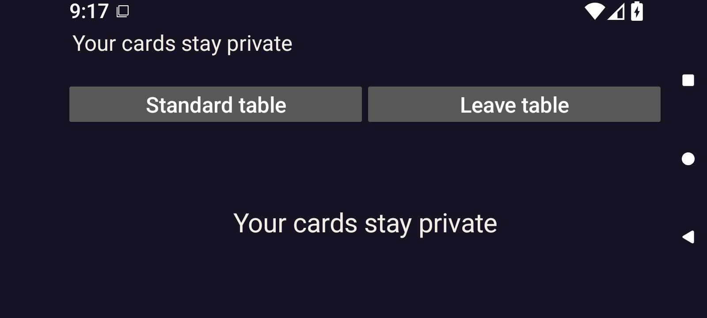</a> | `frame-000036.png` Index 35; PTS `711842` × `1/90000` `7.909356` s; 1600 × 720 | Direct full-size decoded-frame view `fadfaa82d1c45e5a69e6e50c6ced1c35abff83782e4768e1487ee365b0a4a862` The top status now reads Your cards stay private, repeated in the covered game area beneath Standard table / Leave table. No cards or card faces are visible. |
|  | `frame-000037.png` Index 36; PTS `719406` × `1/90000` `7.993400` s; 1600 × 720 | Reviewed identical bytes; this identity not reopened Representative: [frame-000036.png](frames/frame-000036.png) `fadfaa82d1c45e5a69e6e50c6ced1c35abff83782e4768e1487ee365b0a4a862` The top status now reads Your cards stay private, repeated in the covered game area beneath Standard table / Leave table. No cards or card faces are visible. |
|  | `frame-000038.png` Index 37; PTS `724780` × `1/90000` `8.053111` s; 1600 × 720 | Direct full-size decoded-frame view `e1ba23deeb7f7ab40a1a0f28094a6589a97a0a428c1d6099fbf6f898137b5656` Table ready. status above Standard table / Leave table. The visible game header reads Last Light, ROUND 1, full Show hand button, Crown table · round 1, Your turn, and Orbit claimed 1 Crown. At 2.0 font scaling this content consumes the landscape height; the hand area and lower game actions are below the captured bottom edge. No private card faces are visible. |
| <a href="frames/frame-000039.png">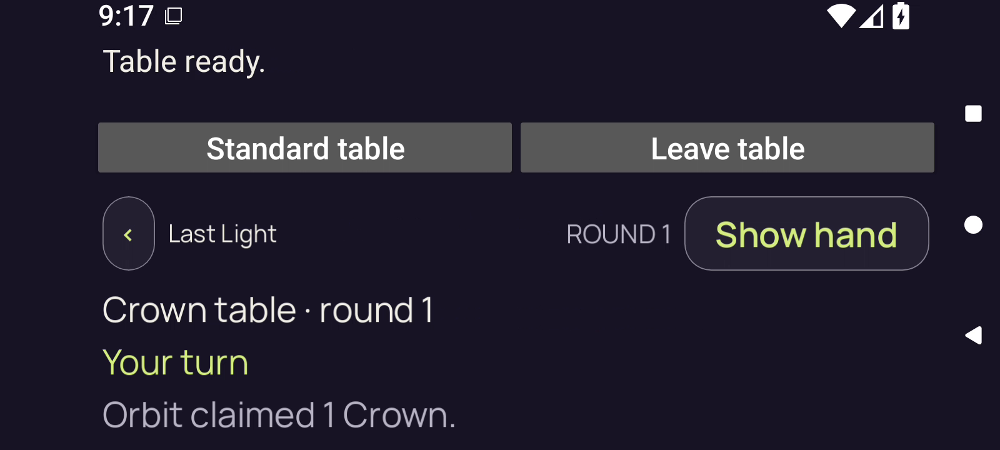</a> | `frame-000039.png` Index 38; PTS `806024` × `1/90000` `8.955822` s; 1600 × 720 | Direct full-size decoded-frame view `b74b4c11ec90c16485c1e0abd822e23335e7fae042d1f87e73f7bfcd393e9024` Table ready. status above Standard table / Leave table. The visible game header reads Last Light, ROUND 1, full Show hand button, Crown table · round 1, Your turn, and Orbit claimed 1 Crown. At 2.0 font scaling this content consumes the landscape height; the hand area and lower game actions are below the captured bottom edge. No private card faces are visible. |
|  | `frame-000040.png` Index 39; PTS `810851` × `1/90000` `9.009456` s; 1600 × 720 | Direct full-size decoded-frame view `16f4a925442ccfffe5d818905a2870b3f49bd45681a4709edc8447cb6732dcab` Table ready. and the Crown round-1 header remain visible with Show hand. The viewport ends below Orbit claimed 1 Crown; the hand and lower game actions are outside the image. No private card faces are visible. |
|  | `frame-000041.png` Index 40; PTS `911173` × `1/90000` `10.124144` s; 1600 × 720 | Direct full-size decoded-frame view `0e52b95097899478655f5709da55086d4dd7d4089c5b7f9202f806e137f5b6a7` Table ready. and the Crown round-1 header remain visible with Show hand. The viewport ends below Orbit claimed 1 Crown; the hand and lower game actions are outside the image. No private card faces are visible. |
|  | `frame-000042.png` Index 41; PTS `916241` × `1/90000` `10.180456` s; 1600 × 720 | Direct full-size decoded-frame view `c37a7eaea9fd12cc92647237e83866f28da95846015435206a732a596a45c292` Table ready. and the Crown round-1 header remain visible with Show hand. The viewport ends below Orbit claimed 1 Crown; the hand and lower game actions are outside the image. No private card faces are visible. |
|  | `frame-000043.png` Index 42; PTS `1005417` × `1/90000` `11.171300` s; 1600 × 720 | Direct full-size decoded-frame view `ad73c65e4427069edb47e6c982d702d16ccc4d907bac23b633488160ba75e063` Table ready. and the Crown round-1 header remain visible with Show hand. The viewport ends below Orbit claimed 1 Crown; the hand and lower game actions are outside the image. No private card faces are visible. |
|  | `frame-000044.png` Index 43; PTS `1011464` × `1/90000` `11.238489` s; 1600 × 720 | Reviewed identical bytes; this identity not reopened Representative: [frame-000040.png](frames/frame-000040.png) `16f4a925442ccfffe5d818905a2870b3f49bd45681a4709edc8447cb6732dcab` Table ready. and the Crown round-1 header remain visible with Show hand. The viewport ends below Orbit claimed 1 Crown; the hand and lower game actions are outside the image. No private card faces are visible. |
|  | `frame-000045.png` Index 44; PTS `1155515` × `1/90000` `12.839056` s; 1600 × 720 | Reviewed identical bytes; this identity not reopened Representative: [frame-000041.png](frames/frame-000041.png) `0e52b95097899478655f5709da55086d4dd7d4089c5b7f9202f806e137f5b6a7` Table ready. and the Crown round-1 header remain visible with Show hand. The viewport ends below Orbit claimed 1 Crown; the hand and lower game actions are outside the image. No private card faces are visible. |
|  | `frame-000046.png` Index 45; PTS `1160495` × `1/90000` `12.894389` s; 1600 × 720 | Reviewed identical bytes; this identity not reopened Representative: [frame-000042.png](frames/frame-000042.png) `c37a7eaea9fd12cc92647237e83866f28da95846015435206a732a596a45c292` Table ready. and the Crown round-1 header remain visible with Show hand. The viewport ends below Orbit claimed 1 Crown; the hand and lower game actions are outside the image. No private card faces are visible. |
|  | `frame-000047.png` Index 46; PTS `1249862` × `1/90000` `13.887356` s; 1600 × 720 | Reviewed identical bytes; this identity not reopened Representative: [frame-000043.png](frames/frame-000043.png) `ad73c65e4427069edb47e6c982d702d16ccc4d907bac23b633488160ba75e063` Table ready. and the Crown round-1 header remain visible with Show hand. The viewport ends below Orbit claimed 1 Crown; the hand and lower game actions are outside the image. No private card faces are visible. |
|  | `frame-000048.png` Index 47; PTS `1255960` × `1/90000` `13.955111` s; 1600 × 720 | Reviewed identical bytes; this identity not reopened Representative: [frame-000040.png](frames/frame-000040.png) `16f4a925442ccfffe5d818905a2870b3f49bd45681a4709edc8447cb6732dcab` Table ready. and the Crown round-1 header remain visible with Show hand. The viewport ends below Orbit claimed 1 Crown; the hand and lower game actions are outside the image. No private card faces are visible. |
|  | `frame-000049.png` Index 48; PTS `1335544` × `1/90000` `14.839378` s; 1600 × 720 | Direct full-size decoded-frame view `b4cb8fd475ee456d81e1a9521a4896e8906c20c42ab11876188c9f269f706bc2` The same landscape Table ready./Crown round-1 header persists, with a visibly lighter fill on the host Standard table button. Show hand remains labeled Show hand. The hand and lower game actions remain below the image. Pixel highlight alone does not establish its input target. No private card faces are visible. |
|  | `frame-000050.png` Index 49; PTS `1341959` × `1/90000` `14.910656` s; 1600 × 720 | Direct full-size decoded-frame view `7621255406ca25f30530a123535e2970001711aa8c9330beea40683d75e0d4b6` The same landscape Table ready./Crown round-1 header persists, with a visibly lighter fill on the host Standard table button. Show hand remains labeled Show hand. The hand and lower game actions remain below the image. Pixel highlight alone does not establish its input target. No private card faces are visible. |
|  | `frame-000051.png` Index 50; PTS `1365515` × `1/90000` `15.172389` s; 1600 × 720 | Direct full-size decoded-frame view `96d2953b521020b920b37d03d4246afee29a76113f3ad89b3eb205656319490f` The host Standard table button remains visibly lighter than Leave table. The game header still reads Show hand, Crown table · round 1, Your turn, and Orbit claimed 1 Crown. No hand is within the recorded viewport, and no private card faces are visible. Pixel highlight is recorded separately from input-coordinate evidence. |
|  | `frame-000052.png` Index 51; PTS `1371099` × `1/90000` `15.234433` s; 1600 × 720 | Direct full-size decoded-frame view `5dc8f9ef7785e2f8b279e22f8a8fe8d139859a518f65893a6c3f89a18ff19c92` The host Standard table button remains visibly lighter than Leave table. The game header still reads Show hand, Crown table · round 1, Your turn, and Orbit claimed 1 Crown. No hand is within the recorded viewport, and no private card faces are visible. Pixel highlight is recorded separately from input-coordinate evidence. |
|  | `frame-000053.png` Index 52; PTS `1374978` × `1/90000` `15.277533` s; 1600 × 720 | Direct full-size decoded-frame view `b964c8a825b3e3a2f38cb1f6e53d46d9e9dea38ffc549774b160f4a901ca8749` The host Standard table button remains visibly lighter than Leave table. The game header still reads Show hand, Crown table · round 1, Your turn, and Orbit claimed 1 Crown. No hand is within the recorded viewport, and no private card faces are visible. Pixel highlight is recorded separately from input-coordinate evidence. |
|  | `frame-000054.png` Index 53; PTS `1381530` × `1/90000` `15.350333` s; 1600 × 720 | Direct full-size decoded-frame view `87f09793ef0329b1a9c9c2d4e3ba03c176376596628a6e6a02ec1059dae7e5c7` The host Standard table button remains visibly lighter than Leave table. The game header still reads Show hand, Crown table · round 1, Your turn, and Orbit claimed 1 Crown. No hand is within the recorded viewport, and no private card faces are visible. Pixel highlight is recorded separately from input-coordinate evidence. |
| <a href="frames/frame-000055.png">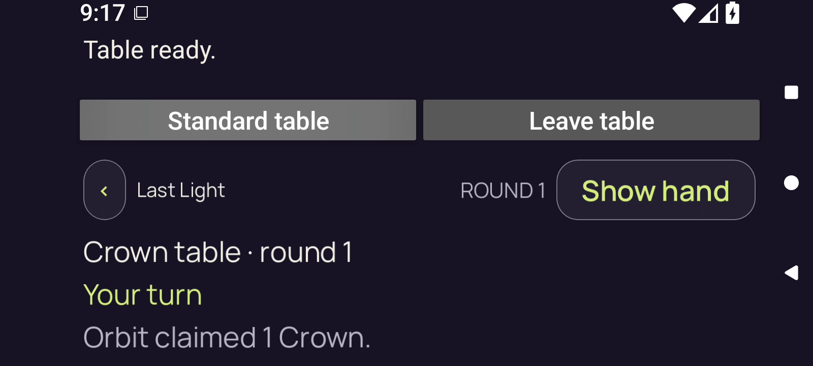</a> | `frame-000055.png` Index 54; PTS `1389180` × `1/90000` `15.435333` s; 1600 × 720 | Reviewed identical bytes; this identity not reopened Representative: [frame-000051.png](frames/frame-000051.png) `96d2953b521020b920b37d03d4246afee29a76113f3ad89b3eb205656319490f` The host Standard table button remains visibly lighter than Leave table. The game header still reads Show hand, Crown table · round 1, Your turn, and Orbit claimed 1 Crown. No hand is within the recorded viewport, and no private card faces are visible. Pixel highlight is recorded separately from input-coordinate evidence. |
|  | `frame-000056.png` Index 55; PTS `1394525` × `1/90000` `15.494722` s; 1600 × 720 | Reviewed identical bytes; this identity not reopened Representative: [frame-000052.png](frames/frame-000052.png) `5dc8f9ef7785e2f8b279e22f8a8fe8d139859a518f65893a6c3f89a18ff19c92` The host Standard table button remains visibly lighter than Leave table. The game header still reads Show hand, Crown table · round 1, Your turn, and Orbit claimed 1 Crown. No hand is within the recorded viewport, and no private card faces are visible. Pixel highlight is recorded separately from input-coordinate evidence. |
| <a href="frames/frame-000057.png">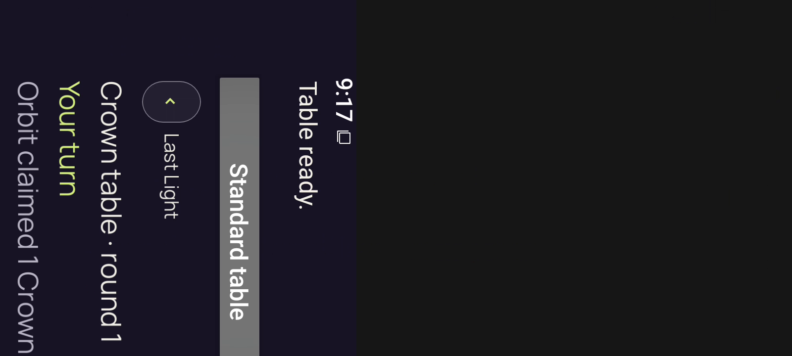</a> | `frame-000057.png` Index 56; PTS `1399155` × `1/90000` `15.546167` s; 1600 × 720 | Direct full-size decoded-frame view `1e8839114a148613a8e48d2be1e8d2d61e0ceadaea90171712ae0fcb6409b041` The recorded 1600×720 canvas shows the previous landscape header rotated clockwise in its left portion, with dark space on the right. Visible text includes Table ready., Standard table, Last Light, Crown table · round 1, Your turn and part of Orbit claimed 1 Crown. No hand or private card faces are visible. Orientation is preserved as decoded. |
|  | `frame-000058.png` Index 57; PTS `1406044` × `1/90000` `15.622711` s; 1600 × 720 | Direct full-size decoded-frame view `12eae20be35f12fa440ce9110470d4ff111df0b32c629cc08eef153e29c0af1d` A narrow portrait app image is centered inside the unchanged landscape recording canvas with wide black side areas. Closing table... and dimmed Standard table / Leave table buttons appear above Your cards stay private. No game cards or private faces are visible. |
| <a href="frames/frame-000059.png">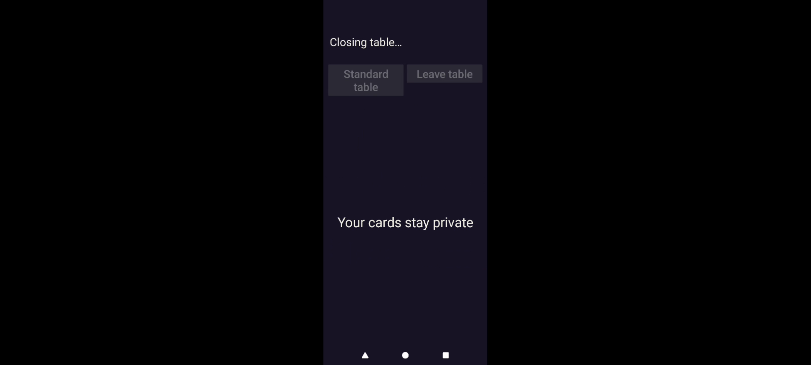</a> | `frame-000059.png` Index 58; PTS `1414738` × `1/90000` `15.719311` s; 1600 × 720 | Direct full-size decoded-frame view `0c83deb72d3c073225a556791c2a71cc23337c8ebb71984531602819763cb068` Narrow centered portrait app image remains inside the landscape canvas. Closing table..., dimmed Standard table / Leave table buttons, and Your cards stay private remain visible. The status bar is temporarily absent; no private card faces are visible. |
| <a href="frames/frame-000060.png">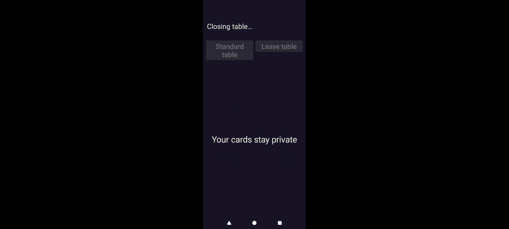</a> | `frame-000060.png` Index 59; PTS `1423856` × `1/90000` `15.820622` s; 1600 × 720 | Direct full-size decoded-frame view `659adbe1ec4b9e88ae5424b534f25c57ab0e61b47c9c18f0bd685ab3a78197d6` Narrow centered portrait app image remains inside the landscape canvas. Closing table..., dimmed Standard table / Leave table buttons, and Your cards stay private remain visible. The status bar is temporarily absent; no private card faces are visible. |
|  | `frame-000061.png` Index 60; PTS `1433214` × `1/90000` `15.924600` s; 1600 × 720 | Direct full-size decoded-frame view `06863628e03c746eee5baa2bf3c6c25d9f3f7e9695b02976e3f7f8d00e83020b` Portrait Closing table... and the complete privacy sentence remain visible with dimmed host actions; the Android status bar has reappeared above. No private card faces are visible. |
|  | `frame-000062.png` Index 61; PTS `1440217` × `1/90000` `16.002411` s; 1600 × 720 | Direct full-size decoded-frame view `255b9728aa271b42ffb3bf947b7a601e68b946d35d1206f5e615a95c519594cd` Portrait Closing table... and the complete privacy sentence remain visible with dimmed host actions; the Android status bar has reappeared above. No private card faces are visible. |
|  | `frame-000063.png` Index 62; PTS `1447159` × `1/90000` `16.079544` s; 1600 × 720 | Reviewed identical bytes; this identity not reopened Representative: [frame-000062.png](frames/frame-000062.png) `255b9728aa271b42ffb3bf947b7a601e68b946d35d1206f5e615a95c519594cd` Portrait Closing table... and the complete privacy sentence remain visible with dimmed host actions; the Android status bar has reappeared above. No private card faces are visible. |
|  | `frame-000064.png` Index 63; PTS `1464230` × `1/90000` `16.269222` s; 1600 × 720 | Reviewed identical bytes; this identity not reopened Representative: [frame-000062.png](frames/frame-000062.png) `255b9728aa271b42ffb3bf947b7a601e68b946d35d1206f5e615a95c519594cd` Portrait Closing table... and the complete privacy sentence remain visible with dimmed host actions; the Android status bar has reappeared above. No private card faces are visible. |
| <a href="frames/frame-000065.png">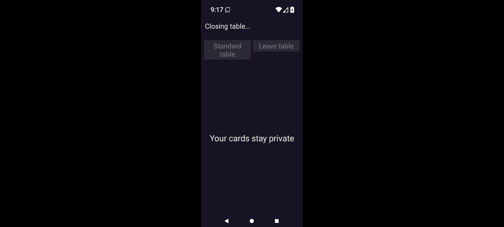</a> | `frame-000065.png` Index 64; PTS `1472060` × `1/90000` `16.356222` s; 1600 × 720 | Reviewed identical bytes; this identity not reopened Representative: [frame-000062.png](frames/frame-000062.png) `255b9728aa271b42ffb3bf947b7a601e68b946d35d1206f5e615a95c519594cd` Portrait Closing table... and the complete privacy sentence remain visible with dimmed host actions; the Android status bar has reappeared above. No private card faces are visible. |
|  | `frame-000066.png` Index 65; PTS `1479584` × `1/90000` `16.439822` s; 1600 × 720 | Reviewed identical bytes; this identity not reopened Representative: [frame-000062.png](frames/frame-000062.png) `255b9728aa271b42ffb3bf947b7a601e68b946d35d1206f5e615a95c519594cd` Portrait Closing table... and the complete privacy sentence remain visible with dimmed host actions; the Android status bar has reappeared above. No private card faces are visible. |
|  | `frame-000067.png` Index 66; PTS `1484662` × `1/90000` `16.496244` s; 1600 × 720 | Direct full-size decoded-frame view `755e76be810c92c7a8820572f90162c1c9decdc62cac172f3f23664344172ff9` The portrait app area now contains only centered Your cards stay private beneath the Android status bar; host closing status and actions have disappeared. Wide black side areas remain within the recording. No card faces are visible. |
| <a href="frames/frame-000068.png">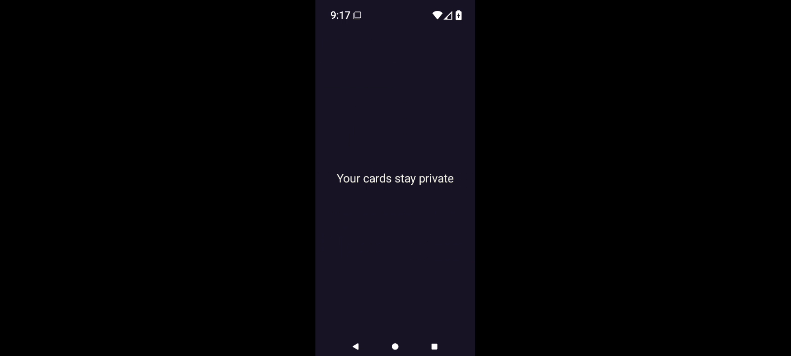</a> | `frame-000068.png` Index 67; PTS `1489402` × `1/90000` `16.548911` s; 1600 × 720 | Direct full-size decoded-frame view `8528909808e2a9f01bcb0a9444d3da28eb64159bf52abcf1dcc4ebcf2382b9b3` The portrait app area now contains only centered Your cards stay private beneath the Android status bar; host closing status and actions have disappeared. Wide black side areas remain within the recording. No card faces are visible. |
|  | `frame-000069.png` Index 68; PTS `1494970` × `1/90000` `16.610778` s; 1600 × 720 | Reviewed identical bytes; this identity not reopened Representative: [frame-000068.png](frames/frame-000068.png) `8528909808e2a9f01bcb0a9444d3da28eb64159bf52abcf1dcc4ebcf2382b9b3` The portrait app area now contains only centered Your cards stay private beneath the Android status bar; host closing status and actions have disappeared. Wide black side areas remain within the recording. No card faces are visible. |
|  | `frame-000070.png` Index 69; PTS `1499328` × `1/90000` `16.659200` s; 1600 × 720 | Direct full-size decoded-frame view `ee0c69d5c677d04b677ff851b6cc8e49849aa184283d9d0574d830688b0b4c8b` Centered portrait Standard screen shows Last Light, Table style, Your turn, Crown table / ROUND 1, Orbit claims 1 Crown, See all 4 players, Your hand / 5 cards, and a For your eyes only privacy panel with a card-back illustration. The lower reveal/action area is cut off at the viewport bottom. No private card faces are visible. |
|  | `frame-000071.png` Index 70; PTS `1515212` × `1/90000` `16.835689` s; 1600 × 720 | Direct full-size decoded-frame view `3eefa69307e2599190c568cbb45855dfba66ce3981b782a3c6a6c854a86ce908` Centered portrait Standard screen shows Last Light, Table style, Your turn, Crown table / ROUND 1, Orbit claims 1 Crown, See all 4 players, Your hand / 5 cards, and a For your eyes only privacy panel with a card-back illustration. The lower reveal/action area is cut off at the viewport bottom. No private card faces are visible. |
|  | `frame-000072.png` Index 71; PTS `1519193` × `1/90000` `16.879922` s; 1600 × 720 | Direct full-size decoded-frame view `ef6ca143ed3a579fd8aa35fa9ce35291ee9f32bce56749fa4f2bbf04b5a6be7d` Centered portrait Standard screen shows Last Light, Table style, Your turn, Crown table / ROUND 1, Orbit claims 1 Crown, See all 4 players, Your hand / 5 cards, and a For your eyes only privacy panel with a card-back illustration. The lower reveal/action area is cut off at the viewport bottom. No private card faces are visible. |
|  | `frame-000073.png` Index 72; PTS `1606642` × `1/90000` `17.851578` s; 1600 × 720 | Direct full-size decoded-frame view `d537ac76928c0a57c42fe3ac0eeba40e7f1da2af96711b809ac0da17b32f3f1b` Centered portrait Standard screen shows Last Light, Table style, Your turn, Crown table / ROUND 1, Orbit claims 1 Crown, See all 4 players, Your hand / 5 cards, and a For your eyes only privacy panel with a card-back illustration. The lower reveal/action area is cut off at the viewport bottom. No private card faces are visible. |
|  | `frame-000074.png` Index 73; PTS `1610773` × `1/90000` `17.897478` s; 1600 × 720 | Reviewed identical bytes; this identity not reopened Representative: [frame-000073.png](frames/frame-000073.png) `d537ac76928c0a57c42fe3ac0eeba40e7f1da2af96711b809ac0da17b32f3f1b` Centered portrait Standard screen shows Last Light, Table style, Your turn, Crown table / ROUND 1, Orbit claims 1 Crown, See all 4 players, Your hand / 5 cards, and a For your eyes only privacy panel with a card-back illustration. The lower reveal/action area is cut off at the viewport bottom. No private card faces are visible. |
|  | `frame-000075.png` Index 74; PTS `1614578` × `1/90000` `17.939756` s; 1600 × 720 | Reviewed identical bytes; this identity not reopened Representative: [frame-000073.png](frames/frame-000073.png) `d537ac76928c0a57c42fe3ac0eeba40e7f1da2af96711b809ac0da17b32f3f1b` Centered portrait Standard screen shows Last Light, Table style, Your turn, Crown table / ROUND 1, Orbit claims 1 Crown, See all 4 players, Your hand / 5 cards, and a For your eyes only privacy panel with a card-back illustration. The lower reveal/action area is cut off at the viewport bottom. No private card faces are visible. |
|  | `frame-000076.png` Index 75; PTS `1705724` × `1/90000` `18.952489` s; 1600 × 720 | Reviewed identical bytes; this identity not reopened Representative: [frame-000073.png](frames/frame-000073.png) `d537ac76928c0a57c42fe3ac0eeba40e7f1da2af96711b809ac0da17b32f3f1b` Centered portrait Standard screen shows Last Light, Table style, Your turn, Crown table / ROUND 1, Orbit claims 1 Crown, See all 4 players, Your hand / 5 cards, and a For your eyes only privacy panel with a card-back illustration. The lower reveal/action area is cut off at the viewport bottom. No private card faces are visible. |
|  | `frame-000077.png` Index 76; PTS `1709165` × `1/90000` `18.990722` s; 1600 × 720 | Reviewed identical bytes; this identity not reopened Representative: [frame-000073.png](frames/frame-000073.png) `d537ac76928c0a57c42fe3ac0eeba40e7f1da2af96711b809ac0da17b32f3f1b` Centered portrait Standard screen shows Last Light, Table style, Your turn, Crown table / ROUND 1, Orbit claims 1 Crown, See all 4 players, Your hand / 5 cards, and a For your eyes only privacy panel with a card-back illustration. The lower reveal/action area is cut off at the viewport bottom. No private card faces are visible. |
|  | `frame-000078.png` Index 77; PTS `1800286` × `1/90000` `20.003178` s; 1600 × 720 | Reviewed identical bytes; this identity not reopened Representative: [frame-000073.png](frames/frame-000073.png) `d537ac76928c0a57c42fe3ac0eeba40e7f1da2af96711b809ac0da17b32f3f1b` Centered portrait Standard screen shows Last Light, Table style, Your turn, Crown table / ROUND 1, Orbit claims 1 Crown, See all 4 players, Your hand / 5 cards, and a For your eyes only privacy panel with a card-back illustration. The lower reveal/action area is cut off at the viewport bottom. No private card faces are visible. |
|  | `frame-000079.png` Index 78; PTS `1804337` × `1/90000` `20.048189` s; 1600 × 720 | Reviewed identical bytes; this identity not reopened Representative: [frame-000073.png](frames/frame-000073.png) `d537ac76928c0a57c42fe3ac0eeba40e7f1da2af96711b809ac0da17b32f3f1b` Centered portrait Standard screen shows Last Light, Table style, Your turn, Crown table / ROUND 1, Orbit claims 1 Crown, See all 4 players, Your hand / 5 cards, and a For your eyes only privacy panel with a card-back illustration. The lower reveal/action area is cut off at the viewport bottom. No private card faces are visible. |
| <a href="frames/frame-000080.png">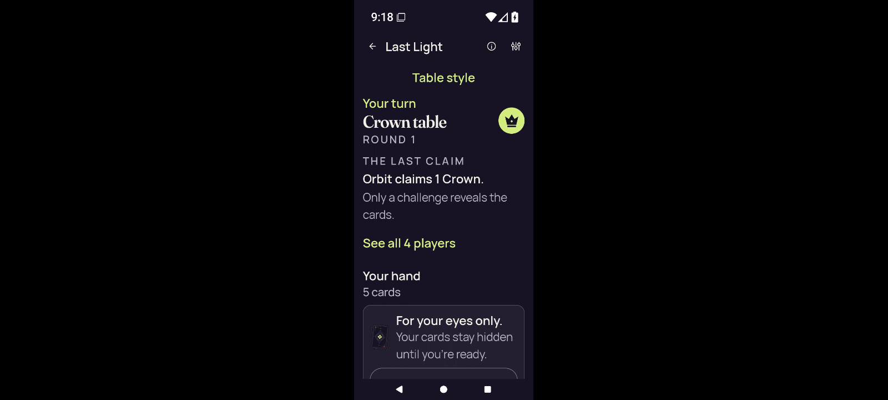</a> | `frame-000080.png` Index 79; PTS `3709587` × `1/90000` `41.217633` s; 1600 × 720 | Direct full-size decoded-frame view `7d62dfbaf61b75143ba0afaded226e279674ba5a4bb1c3fe8fc19f755543d3fa` The same concealed Standard portrait Crown round-1 screen remains visible; status clock now reads 9:18. Your hand says 5 cards and the privacy panel is present, with lower actions beyond the captured viewport. No private card faces are visible. |
|  | `frame-000081.png` Index 80; PTS `4055829` × `1/90000` `45.064767` s; 1600 × 720 | Direct full-size decoded-frame view `dbb66509163cec5efa973d29e2fa4276f775b07b7c904d138df442d320d2442a` The same concealed Standard portrait Crown round-1 screen remains visible; status clock now reads 9:18. Your hand says 5 cards and the privacy panel is present, with lower actions beyond the captured viewport. No private card faces are visible. |
|  | `frame-000082.png` Index 81; PTS `4064079` × `1/90000` `45.156433` s; 1600 × 720 | Direct full-size decoded-frame view `833ad907bfcfa249a3d8bc7f839f5a894683e154ee5475d76e5cfa3494525f9a` The final distinct PNG groups retain the concealed Standard portrait Crown round-1 screen with Orbit claims 1 Crown, Your hand / 5 cards and the For your eyes only panel. Lower game actions remain outside the viewport. No private card faces are visible. |
|  | `frame-000083.png` Index 82; PTS `4147855` × `1/90000` `46.087278` s; 1600 × 720 | Direct full-size decoded-frame view `3f967b14424f40f5469d842ca847c04b6b602ca9fd453c5e20af4bc48714bbf9` The final distinct PNG groups retain the concealed Standard portrait Crown round-1 screen with Orbit claims 1 Crown, Your hand / 5 cards and the For your eyes only panel. Lower game actions remain outside the viewport. No private card faces are visible. |
|  | `frame-000084.png` Index 83; PTS `4151837` × `1/90000` `46.131522` s; 1600 × 720 | Reviewed identical bytes; this identity not reopened Representative: [frame-000083.png](frames/frame-000083.png) `3f967b14424f40f5469d842ca847c04b6b602ca9fd453c5e20af4bc48714bbf9` The final distinct PNG groups retain the concealed Standard portrait Crown round-1 screen with Orbit claims 1 Crown, Your hand / 5 cards and the For your eyes only panel. Lower game actions remain outside the viewport. No private card faces are visible. |
|  | `frame-000085.png` Index 84; PTS `4243731` × `1/90000` `47.152567` s; 1600 × 720 | Reviewed identical bytes; this identity not reopened Representative: [frame-000083.png](frames/frame-000083.png) `3f967b14424f40f5469d842ca847c04b6b602ca9fd453c5e20af4bc48714bbf9` The final distinct PNG groups retain the concealed Standard portrait Crown round-1 screen with Orbit claims 1 Crown, Your hand / 5 cards and the For your eyes only panel. Lower game actions remain outside the viewport. No private card faces are visible. |
|  | `frame-000086.png` Index 85; PTS `4247781` × `1/90000` `47.197567` s; 1600 × 720 | Reviewed identical bytes; this identity not reopened Representative: [frame-000083.png](frames/frame-000083.png) `3f967b14424f40f5469d842ca847c04b6b602ca9fd453c5e20af4bc48714bbf9` The final distinct PNG groups retain the concealed Standard portrait Crown round-1 screen with Orbit claims 1 Crown, Your hand / 5 cards and the For your eyes only panel. Lower game actions remain outside the viewport. No private card faces are visible. |
|  | `frame-000087.png` Index 86; PTS `4335059` × `1/90000` `48.167322` s; 1600 × 720 | Reviewed identical bytes; this identity not reopened Representative: [frame-000083.png](frames/frame-000083.png) `3f967b14424f40f5469d842ca847c04b6b602ca9fd453c5e20af4bc48714bbf9` The final distinct PNG groups retain the concealed Standard portrait Crown round-1 screen with Orbit claims 1 Crown, Your hand / 5 cards and the For your eyes only panel. Lower game actions remain outside the viewport. No private card faces are visible. |
| <a href="frames/frame-000088.png">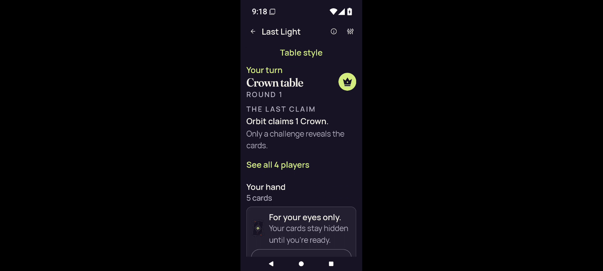</a> | `frame-000088.png` Index 87; PTS `4338792` × `1/90000` `48.208800` s; 1600 × 720 | Reviewed identical bytes; this identity not reopened Representative: [frame-000083.png](frames/frame-000083.png) `3f967b14424f40f5469d842ca847c04b6b602ca9fd453c5e20af4bc48714bbf9` The final distinct PNG groups retain the concealed Standard portrait Crown round-1 screen with Orbit claims 1 Crown, Your hand / 5 cards and the For your eyes only panel. Lower game actions remain outside the viewport. No private card faces are visible. |
